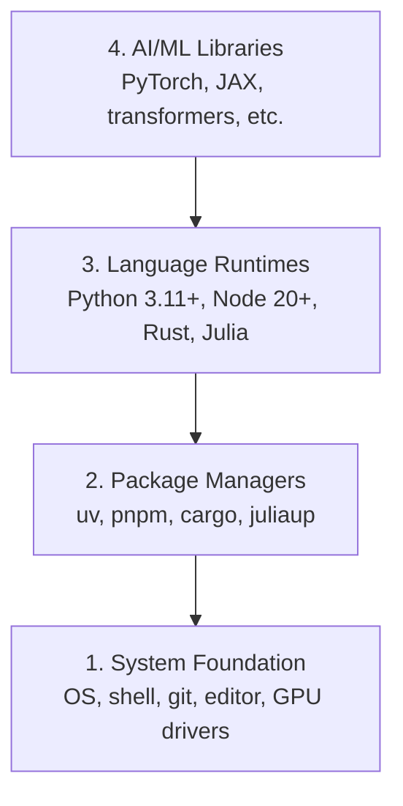

# Dev Environment / 开发环境

> 工具会塑造你的思考方式。一次配置到位，后面才能专注学习。

**类型：** 构建
**语言：** Python, Node.js, Rust
**前置要求：** 无
**时间：** 约 45 分钟

## Learning Objectives / 学习目标

- 从零安装 Python 3.11+、Node.js 20+ 和 Rust 工具链
- 配置虚拟环境和包管理器，让构建结果可复现
- 验证 CUDA/MPS 的 GPU 访问能力，并运行一次测试张量运算
- 理解四层环境栈：系统、包、运行时、AI 库

## The Problem / 问题

你接下来会用 Python、TypeScript、Rust 和 Julia 学习 200 多节 AI 工程课程。如果环境是坏的，每一节课都会变成和工具链搏斗，而不是学习本身。

大多数人会跳过环境配置。结果就是花几个小时排查 import 错误、版本冲突和缺失的 CUDA 驱动。我们这次把它一次性配置正确。

## The Concept / 概念

AI 工程环境有四层：



安装时从底层往上走。每一层都依赖它下面那一层。

## Build It / 动手构建

### Step 1: System Foundation / 第 1 步：系统基础

检查你的系统，并安装基础工具。

```bash
# macOS
xcode-select --install
brew install git curl wget

# Ubuntu/Debian
sudo apt update && sudo apt install -y build-essential git curl wget

# Windows (use WSL2)
wsl --install -d Ubuntu-24.04
```

### Step 2: Python with uv / 第 2 步：用 uv 安装 Python

我们使用 `uv`。它比 pip 快 10-100 倍，并且会自动处理虚拟环境。

```bash
curl -LsSf https://astral.sh/uv/install.sh | sh

uv python install 3.12

uv venv
source .venv/bin/activate  # or .venv\Scripts\activate on Windows

uv pip install numpy matplotlib jupyter
```

验证：

```python
import sys
print(f"Python {sys.version}")

import numpy as np
print(f"NumPy {np.__version__}")
a = np.array([1, 2, 3])
print(f"Vector: {a}, dot product with itself: {np.dot(a, a)}")
```

### Step 3: Node.js with pnpm / 第 3 步：用 pnpm 配置 Node.js

TypeScript 课程会用到它，比如 Agent、MCP server 和 Web app。

```bash
curl -fsSL https://fnm.vercel.app/install | bash
fnm install 22
fnm use 22

npm install -g pnpm

node -e "console.log('Node', process.version)"
```

### Step 4: Rust / 第 4 步：Rust

性能敏感课程会用到 Rust，比如推理和系统部分。

```bash
curl --proto '=https' --tlsv1.2 -sSf https://sh.rustup.rs | sh

rustc --version
cargo --version
```

### Step 5: Julia (Optional) / 第 5 步：Julia（可选）

一些数学密集型课程中，Julia 很适合表达计算。

```bash
curl -fsSL https://install.julialang.org | sh

julia -e 'println("Julia ", VERSION)'
```

### Step 6: GPU Setup (If You Have One) / 第 6 步：GPU 设置（如果你有 GPU）

```bash
# NVIDIA
nvidia-smi

# Install PyTorch with CUDA
uv pip install torch torchvision torchaudio --index-url https://download.pytorch.org/whl/cu124
```

```python
import torch
print(f"CUDA available: {torch.cuda.is_available()}")
if torch.cuda.is_available():
    print(f"GPU: {torch.cuda.get_device_name(0)}")
```

没有 GPU 也没关系。大多数课程可以在 CPU 上完成。训练压力大的课程可以用 Google Colab 或云 GPU。

### Step 7: Verify Everything / 第 7 步：验证全部环境

运行验证脚本：

```bash
python phases/00-setup-and-tooling/01-dev-environment/code/verify.py
```

## Use It / 应用它

现在，你的环境已经可以支撑本课程的所有 lesson。不同语言会用在这些地方：

| Language | Used In | Package Manager |
|----------|---------|-----------------|
| Python | Phase 1-12（ML、DL、NLP、Vision、Audio、LLM） | uv |
| TypeScript | Phase 13-17（工具、Agent、Swarm、基础设施） | pnpm |
| Rust | Phase 12、15-17（性能敏感系统） | cargo |
| Julia | Phase 1（数学基础） | Pkg |

## Ship It / 交付它

这一课会产出一个验证脚本，任何人都可以运行它来检查自己的环境。

查看 `outputs/prompt-env-check.md`，里面有一个 prompt，可以帮助 AI assistant 诊断环境问题。

## Exercises / 练习

1. 运行验证脚本，并修复所有失败项
2. 为本课程创建一个 Python 虚拟环境，并安装 PyTorch
3. 用四种语言各写一个 "hello world"，并分别运行

## Key Terms / 关键术语

| 术语 | 常见说法 | 实际含义 |
|------|----------------|----------------------|
| Toolchain | “开发工具” | 一门语言从安装、编译/运行到包管理所需的一整套工具 |
| Runtime | “运行环境” | 真正执行代码的语言环境，例如 Python、Node.js、Rust 工具链 |
| Package manager | “装包工具” | 安装、解析和管理依赖的工具，例如 `uv`、`pnpm`、`cargo` |
| GPU driver | “显卡驱动” | 让操作系统和 AI library 能访问 GPU 的系统层软件 |
