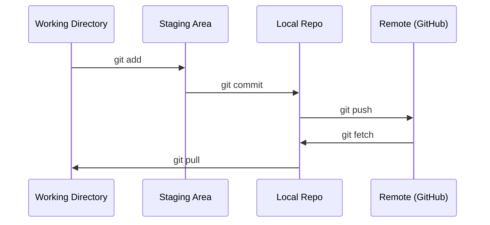

# Git & Collaboration / Git 与协作

> 版本控制不是可选项。你在这里写下的每个实验、每个模型、每节课的代码，都应该被追踪。

**类型：** 学习
**语言：** --
**前置要求：** Phase 0, Lesson 01
**时间：** 约 30 分钟

## Learning Objectives / 学习目标

- 配置 git 身份，并掌握日常的 add、commit、push 工作流
- 为隔离实验创建和合并分支，避免破坏 main
- 编写 `.gitignore`，排除模型 checkpoint 和大型二进制文件
- 使用 `git log` 浏览提交历史，理解项目如何演进

## The Problem / 问题

你接下来会在 20 个 phase 中写数百个代码文件。如果没有版本控制，你会丢工作成果，破坏难以恢复的东西，也无法和别人协作。

Git 是工具。GitHub 是代码托管的地方。这一课只讲本课程真正需要的内容，不展开无关复杂度。

## The Concept / 概念



记住三件事：
1. 经常保存快照（`git commit`）
2. 推送到远端（`git push`）
3. 实验用分支（`git checkout -b experiment`）

## Build It / 动手构建

### Step 1: Configure git / 第 1 步：配置 git

```bash
git config --global user.name "Your Name"
git config --global user.email "you@example.com"
```

### Step 2: The daily workflow / 第 2 步：日常工作流

```bash
git status
git add file.py
git commit -m "Add perceptron implementation"
git push origin main
```

### Step 3: Branching for experiments / 第 3 步：为实验创建分支

```bash
git checkout -b experiment/new-optimizer

# ... make changes, commit ...

git checkout main
git merge experiment/new-optimizer
```

### Step 4: Working with this course repo / 第 4 步：使用本课程仓库

```bash
git clone https://github.com/rohitg00/ai-engineering-from-scratch.git
cd ai-engineering-from-scratch

git checkout -b my-progress
# work through lessons, commit your code
git push origin my-progress
```

## Use It / 应用它

在本课程中，你真正需要的命令就是这些：

| Command | When |
|---------|------|
| `git clone` | 获取课程仓库 |
| `git add` + `git commit` | 保存你的工作 |
| `git push` | 备份到 GitHub |
| `git checkout -b` | 在不破坏 main 的前提下尝试想法 |
| `git log --oneline` | 查看自己做过什么 |

就这些。本课程不需要 rebase、cherry-pick 或 submodules。

## Ship It / 交付它

这一课交付的是一套最小但可靠的 Git 工作流：能 clone 课程仓库、在自己的分支上保存进度，并把工作推送到 GitHub 备份。

## Exercises / 练习

1. Clone 这个 repo，创建名为 `my-progress` 的分支，创建一个文件，commit，然后 push
2. 创建一个 `.gitignore`，排除模型 checkpoint 文件（`.pt`、`.pth`、`.safetensors`）
3. 用 `git log --oneline` 查看这个 repo 的提交历史，读一读 lesson 是如何逐步加入的

## Key Terms / 关键术语

| 术语 | 常见说法 | 实际含义 |
|------|----------------|----------------------|
| Commit | “保存” | 项目在某个时间点的完整快照 |
| Branch | “一份拷贝” | 指向某个 commit 的指针，会随着你的工作继续向前移动 |
| Merge | “合并代码” | 把一个分支上的改动应用到另一个分支 |
| Remote | “云端” | 托管在别处的 repo 副本，比如 GitHub 或 GitLab |
