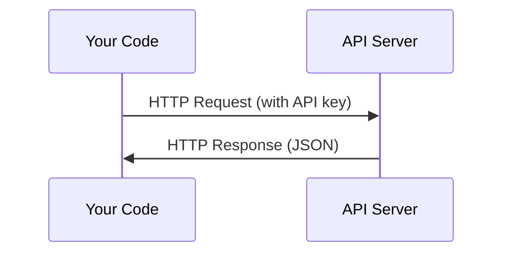

# APIs & Keys / API 与密钥

> 每个 AI API 的工作方式都一样：发送请求，得到响应。细节会变，模式不会。

**类型：** 构建
**语言：** Python, TypeScript
**前置要求：** Phase 0, Lesson 01
**时间：** 约 30 分钟

## Learning Objectives / 学习目标

- 使用环境变量和 `.env` 文件安全保存 API key
- 分别用 Anthropic Python SDK 和原始 HTTP 发起一次 LLM API 调用
- 对比 SDK 和原始 HTTP 的请求/响应格式，帮助后续调试
- 识别并处理常见 API 错误，包括认证失败和 rate limit

## The Problem / 问题

从 Phase 11 开始，你会调用 LLM API（Anthropic、OpenAI、Google）。在 Phase 13-16，你会构建循环调用这些 API 的 Agent。你需要理解 API key 如何工作、如何安全保存，以及如何发起第一次 API 调用。

## The Concept / 概念



每次 API 调用都有四个部分：
1. endpoint（URL）
2. API key（认证）
3. request body（你想要什么）
4. response body（你拿到什么）

## Build It / 动手构建

### Step 1: Store API keys safely / 第 1 步：安全保存 API key

永远不要把 API key 写进代码。使用环境变量。

```bash
export ANTHROPIC_API_KEY="sk-ant-..."
export OPENAI_API_KEY="sk-..."
```

或者使用 `.env` 文件，并把它加入 `.gitignore`：

```
ANTHROPIC_API_KEY=sk-ant-...
OPENAI_API_KEY=sk-...
```

### Step 2: First API call (Python) / 第 2 步：第一次 API 调用（Python）

```python
import anthropic

client = anthropic.Anthropic()

response = client.messages.create(
    model="claude-sonnet-4-20250514",
    max_tokens=256,
    messages=[{"role": "user", "content": "What is a neural network in one sentence?"}]
)

print(response.content[0].text)
```

### Step 3: First API call (TypeScript) / 第 3 步：第一次 API 调用（TypeScript）

```typescript
import Anthropic from "@anthropic-ai/sdk";

const client = new Anthropic();

const response = await client.messages.create({
  model: "claude-sonnet-4-20250514",
  max_tokens: 256,
  messages: [{ role: "user", content: "What is a neural network in one sentence?" }],
});

console.log(response.content[0].text);
```

### Step 4: Raw HTTP (no SDK) / 第 4 步：原始 HTTP（不使用 SDK）

```python
import os
import urllib.request
import json

url = "https://api.anthropic.com/v1/messages"
headers = {
    "Content-Type": "application/json",
    "x-api-key": os.environ["ANTHROPIC_API_KEY"],
    "anthropic-version": "2023-06-01",
}
body = json.dumps({
    "model": "claude-sonnet-4-20250514",
    "max_tokens": 256,
    "messages": [{"role": "user", "content": "What is a neural network in one sentence?"}],
}).encode()

req = urllib.request.Request(url, data=body, headers=headers, method="POST")
with urllib.request.urlopen(req) as resp:
    result = json.loads(resp.read())
    print(result["content"][0]["text"])
```

SDK 在底层做的就是这些事。理解原始 HTTP 调用，会让你在调试时更清楚问题出在哪里。

## Use It / 应用它

在本课程中：

| API | When you need it | Free tier |
|-----|-----------------|-----------|
| Anthropic (Claude) | Phase 11-16（Agent、工具） | 注册赠送 $5 credit |
| OpenAI | Phase 11（对比） | 注册赠送 $5 credit |
| Hugging Face | Phase 4-10（模型、数据集） | 免费 |

你现在不需要一次性配置全部 API。等课程需要时再设置。

## Ship It / 交付它

这一课会产出：
- `outputs/prompt-api-troubleshooter.md` - 诊断常见 API 错误

## Exercises / 练习

1. 获取一个 Anthropic API key，并完成你的第一次 API 调用
2. 尝试原始 HTTP 版本，并把响应格式和 SDK 版本做对比
3. 故意使用错误的 API key，阅读返回的错误信息

## Key Terms / 关键术语

| 术语 | 常见说法 | 实际含义 |
|------|----------------|----------------------|
| API key | “Password for the API” | 标识你的账号并授权请求的一段唯一字符串 |
| Rate limit | “They're throttling me” | 每分钟/每小时允许的最大请求数，用于防止滥用并保证公平使用 |
| Token | “A word”（API 语境） | 计费单位：输入 token 和输出 token 会分别统计并计费 |
| Streaming | “Real-time responses” | 不等待完整响应，而是逐词接收输出 |
