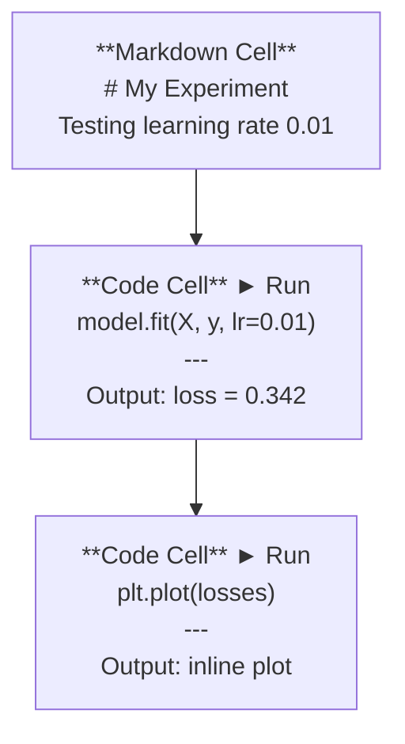
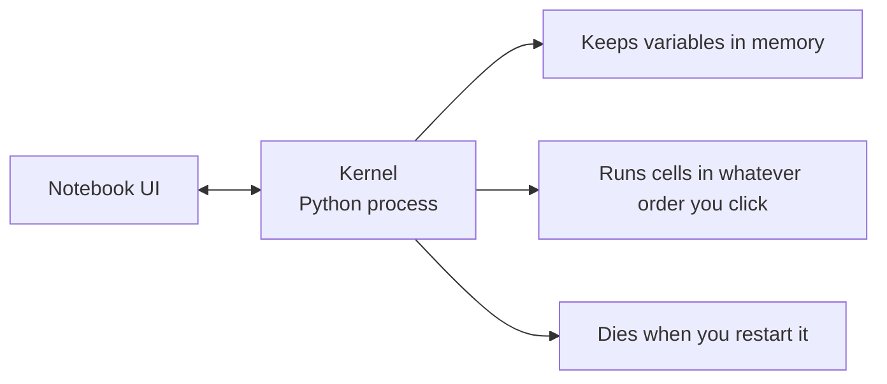

# Jupyter Notebooks / Jupyter Notebook

> Notebook 是 AI 工程的实验台。你在这里快速原型验证，再把真正可用的部分迁移到生产代码。

**类型：** 构建
**语言：** Python
**前置要求：** Phase 0, Lesson 01
**时间：** 约 30 分钟

## Learning Objectives / 学习目标

- 安装并启动 JupyterLab、Jupyter Notebook，或带 Jupyter extension 的 VS Code
- 使用 magic command（`%timeit`、`%%time`、`%matplotlib inline`）做基准测试和内联可视化
- 区分什么时候用 notebook、什么时候用 script，并采用“在 notebook 中探索，在 script 中交付”的工作流
- 识别并避开常见 notebook 陷阱：乱序执行、隐藏状态和内存泄漏

## The Problem / 问题

几乎每篇 AI 论文、教程和 Kaggle 竞赛都会用 Jupyter notebook。它让你可以分块运行代码、直接看到输出，把代码和解释写在一起，并快速迭代。如果你不用 notebook 学 AI，就像做数学题没有草稿纸。

但 notebook 也有真实的坑。很多人什么都往 notebook 里放，包括那些 notebook 并不擅长的工作。知道什么时候用 notebook、什么时候用 script，会让你以后少掉很多调试噩梦。

## The Concept / 概念

一个 notebook 是一组 cell。每个 cell 要么是代码，要么是文本。



kernel 是后台运行的 Python 进程。当你运行一个 cell 时，notebook 会把代码发给 kernel；kernel 执行后把结果传回来。所有 cell 共享同一个 kernel，所以变量会在 cell 之间保留。



“按你点击的任意顺序执行”既是 notebook 的超能力，也是最容易误伤自己的地方。

## Build It / 动手构建

### Step 1: Pick your interface / 第 1 步：选择界面

三种界面，同一种文件格式：

| Interface | Install | Best for |
|-----------|---------|----------|
| JupyterLab | `pip install jupyterlab` 然后 `jupyter lab` | 完整 IDE 体验、多标签、文件浏览器、终端 |
| Jupyter Notebook | `pip install notebook` 然后 `jupyter notebook` | 简单轻量，一次专注一个 notebook |
| VS Code | 安装 "Jupyter" extension | 已在你的编辑器中，带 git 集成和调试能力 |

这三者都读写同一种 `.ipynb` 文件。选你喜欢的即可。AI 工作中最常见的是 JupyterLab。

```bash
pip install jupyterlab
jupyter lab
```

### Step 2: Keyboard shortcuts that matter / 第 2 步：真正重要的快捷键

你会在两种模式之间切换。按 `Escape` 进入 command mode（左侧蓝条），按 `Enter` 进入 edit mode（绿条）。

**Command mode（最常用）：**

| Key | Action |
|-----|--------|
| `Shift+Enter` | 运行当前 cell，并移动到下一个 |
| `A` | 在上方插入 cell |
| `B` | 在下方插入 cell |
| `DD` | 删除 cell |
| `M` | 转为 markdown |
| `Y` | 转为 code |
| `Z` | 撤销 cell 操作 |
| `Ctrl+Shift+H` | 显示所有快捷键 |

**Edit mode：**

| Key | Action |
|-----|--------|
| `Tab` | 自动补全 |
| `Shift+Tab` | 显示函数签名 |
| `Ctrl+/` | 切换注释 |

`Shift+Enter` 是你每天会用上千次的快捷键。先把它练熟。

### Step 3: Cell types / 第 3 步：Cell 类型

**Code cells** 会运行 Python 并显示输出：

```python
import numpy as np
data = np.random.randn(1000)
data.mean(), data.std()
```

输出：`(0.0032, 0.9987)`

**Markdown cells** 会渲染格式化文本。用它记录你正在做什么，以及为什么这么做。它支持标题、粗体、斜体、LaTeX 数学公式（`$E = mc^2$`）、表格和图片。

### Step 4: Magic commands / 第 4 步：Magic command

这些不是 Python 语法，而是 Jupyter 专用命令，以 `%`（line magic）或 `%%`（cell magic）开头。

**给代码计时：**

```python
%timeit np.random.randn(10000)
```

输出：`45.2 us +/- 1.3 us per loop`

```python
%%time
model.fit(X_train, y_train, epochs=10)
```

输出：`Wall time: 2.34 s`

`%timeit` 会多次运行并取平均值。`%%time` 只运行一次。微基准测试用 `%timeit`，训练任务计时用 `%%time`。

**开启内联绘图：**

```python
%matplotlib inline
```

之后每个 `plt.plot()` 或 `plt.show()` 都会直接在 notebook 中渲染。

**不离开 notebook 安装包：**

```python
!pip install scikit-learn
```

`!` 前缀可以运行任意 shell command。

**检查环境变量：**

```python
%env CUDA_VISIBLE_DEVICES
```

### Step 5: Display rich output inline / 第 5 步：内联显示富输出

Notebook 会自动显示一个 cell 中最后一个表达式的结果。你也可以主动控制输出：

```python
import pandas as pd

df = pd.DataFrame({
    "model": ["Linear", "Random Forest", "Neural Net"],
    "accuracy": [0.72, 0.89, 0.94],
    "training_time": [0.1, 2.3, 45.6]
})
df
```

这里会渲染成格式化 HTML 表格，而不是普通文本。同理，图表也会直接显示：

```python
import matplotlib.pyplot as plt

plt.figure(figsize=(8, 4))
plt.plot([1, 2, 3, 4], [1, 4, 2, 3])
plt.title("Inline Plot")
plt.show()
```

图会出现在 cell 下方。这就是 notebook 在 AI 工作中如此常见的原因：数据、图表和代码放在同一个上下文里。

图片也可以这样显示：

```python
from IPython.display import Image, display
display(Image(filename="architecture.png"))
```

### Step 6: Google Colab / 第 6 步：Google Colab

Colab 是云端免费的 Jupyter notebook。它提供 GPU、预装库和 Google Drive 集成，不需要本地配置。

1. 打开 [colab.research.google.com](https://colab.research.google.com)
2. 上传本课程中的任意 `.ipynb` 文件
3. Runtime > Change runtime type > T4 GPU（免费）

Colab 和本地 Jupyter 的差异：
- 文件不会在 session 之间自动保留，需要保存到 Drive 或下载
- 预装：numpy、pandas、matplotlib、torch、tensorflow、sklearn
- 用 `from google.colab import files` 上传/下载文件
- 用 `from google.colab import drive; drive.mount('/content/drive')` 持久化存储
- 免费层在 90 分钟无操作后会超时

## Use It / 应用它

### Notebooks vs Scripts: When to use which / Notebook 与 Script：什么时候用哪个

| Use notebooks for | Use scripts for |
|-------------------|-----------------|
| 探索数据集 | 训练 pipeline |
| 原型验证模型 | 可复用工具函数 |
| 可视化结果 | 任何带 `if __name__` 的代码 |
| 解释你的工作 | 定时运行的代码 |
| 快速实验 | 生产代码 |
| 课程练习 | 包和库 |

规则是：**在 notebook 中探索，在 script 中交付**。

AI 中常见的工作流：
1. 在 notebook 中探索数据
2. 在 notebook 中原型验证模型
3. 一旦可行，把代码迁移到 `.py` 文件
4. 再把这些 `.py` 文件 import 回 notebook，继续做实验

### Common traps / 常见陷阱

**乱序执行。** 你先运行 cell 5，再运行 cell 2，然后运行 cell 7。这个 notebook 在你机器上可用，但别人从头到尾运行时会坏。修复方式：分享前执行 Kernel > Restart & Run All。

**隐藏状态。** 你删除了某个 cell，但它创建的变量还留在内存里。Notebook 看起来很干净，其实依赖一个已经看不见的 cell。修复方式：定期重启 kernel。

**内存泄漏。** 加载一个 4GB 数据集，训练一个模型，再加载另一个数据集。前面的内存并不会自动释放。修复方式：`del variable_name` 加 `gc.collect()`，或者直接重启 kernel。

## Ship It / 交付它

这一课会产出：
- `outputs/prompt-notebook-helper.md`，用于调试 notebook 问题

## Exercises / 练习

1. 打开 JupyterLab，创建一个 notebook，用 `%timeit` 对比 list comprehension 和 numpy 创建 100,000 个随机数数组的速度
2. 创建一个同时包含 markdown 和 code cell 的 notebook：加载 CSV、显示 dataframe、绘制图表。然后运行 Kernel > Restart & Run All，验证它能从头到尾执行
3. 把 `code/notebook_tips.py` 中的代码粘贴到 Colab notebook 中，并使用免费 GPU 运行

## Key Terms / 关键术语

| 术语 | 常见说法 | 实际含义 |
|------|----------------|----------------------|
| Kernel | “The thing running my code” | 一个独立的 Python 进程，负责执行 cell 并在内存中保留变量 |
| Cell | “A code block” | Notebook 中可以独立运行的单元，可以是 code 或 markdown |
| Magic command | “Jupyter tricks” | 以 `%` 或 `%%` 开头、用于控制 notebook 环境的特殊命令 |
| `.ipynb` | “Notebook file” | 包含 cell、输出和 metadata 的 JSON 文件；名称来自 IPython Notebook |

## Further Reading / 延伸阅读

- [JupyterLab Docs](https://jupyterlab.readthedocs.io/)：完整功能说明
- [Google Colab FAQ](https://research.google.com/colaboratory/faq.html)：Colab 的限制和特性
- [28 Jupyter Notebook Tips](https://www.dataquest.io/blog/jupyter-notebook-tips-tricks-shortcuts/)：进阶快捷键和技巧
