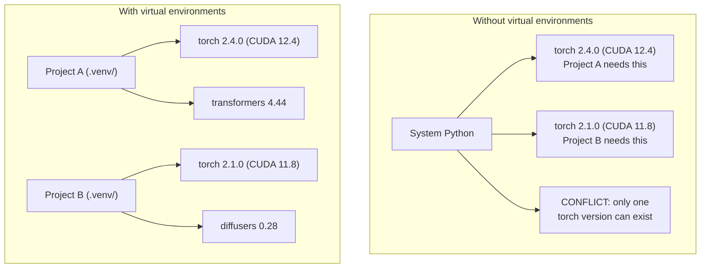

# Python Environments / Python 环境

> 依赖地狱是真实存在的。虚拟环境就是解法。

**类型：** 构建
**语言：** Shell
**前置要求：** Phase 0, Lesson 01
**时间：** 约 30 分钟

## Learning Objectives / 学习目标

- 使用 `uv`、`venv` 或 `conda` 创建隔离的虚拟环境
- 编写带可选依赖组的 `pyproject.toml`，并生成 lockfile 保证可复现
- 诊断并修复常见问题：全局安装、混用 pip/conda、CUDA 版本不匹配
- 为存在冲突依赖的项目设计按 phase 划分的环境策略

## The Problem / 问题

你为一个微调项目安装了 PyTorch 2.4。下周，另一个项目需要 PyTorch 2.1，因为它绑定了特定的 CUDA 构建。你在全局环境里升级，第一个项目坏了；你降级，第二个项目又坏了。

这就是依赖地狱。AI/ML 工作中它尤其常见，因为：

- PyTorch、JAX 和 TensorFlow 都会携带各自的 CUDA 绑定
- 模型库经常 pin 特定 framework 版本
- 全局 `pip install` 会覆盖已有包
- CUDA 11.8 build 不能和 CUDA 12.x driver 随意混用，反过来也一样

解决办法：每个项目都有自己的隔离环境，里面放自己的包。

## The Concept / 概念



## Build It / 动手构建

### Option 1: uv venv (Recommended) / 方案 1：uv venv（推荐）

`uv` 是速度最快的 Python 包管理器，比 pip 快 10-100 倍。它把虚拟环境、Python 版本和依赖解析放在一个工具里处理。

```bash
curl -LsSf https://astral.sh/uv/install.sh | sh

uv python install 3.12

cd your-project
uv venv
source .venv/bin/activate
```

安装包：

```bash
uv pip install torch numpy
```

一步创建带 `pyproject.toml` 的项目：

```bash
uv init my-ai-project
cd my-ai-project
uv add torch numpy matplotlib
```

### Option 2: venv (Built-in) / 方案 2：venv（内置）

如果你无法安装 `uv`，Python 自带 `venv`：

```bash
python3 -m venv .venv
source .venv/bin/activate  # Linux/macOS
.venv\Scripts\activate     # Windows

pip install torch numpy
```

它比 `uv` 慢，但只要有 Python 就能用。

### Option 3: conda (When You Need It) / 方案 3：conda（确实需要时）

Conda 可以管理 CUDA toolkit、cuDNN、C library 等非 Python 依赖。以下情况适合使用它：

- 你需要特定 CUDA toolkit 版本，但不想系统级安装
- 你在共享集群上，不能安装系统包
- 某个库的安装说明明确要求 “use conda”

```bash
# Install miniconda (not the full Anaconda)
curl -LsSf https://repo.anaconda.com/miniconda/Miniconda3-latest-Linux-x86_64.sh -o miniconda.sh
bash miniconda.sh -b

conda create -n myproject python=3.12
conda activate myproject

conda install pytorch torchvision torchaudio pytorch-cuda=12.4 -c pytorch -c nvidia
```

一条规则：如果一个环境用 conda，就尽量让这个环境里的所有包都由 conda 管理。往 conda env 里混入 `pip install` 很容易制造难以排查的依赖冲突。

### For This Course: Per-Phase Strategy / 本课程建议：按 Phase 划分环境

你可以为整个课程创建一个环境。但不建议这么做。不同 phase 需要不同依赖，有时还会互相冲突。

策略：

```
ai-engineering-from-scratch/
├── .venv/                    <-- shared lightweight env for phases 0-3
├── phases/
│   ├── 04-neural-networks/
│   │   └── .venv/            <-- PyTorch env
│   ├── 05-cnns/
│   │   └── .venv/            <-- same PyTorch env (symlink or shared)
│   ├── 08-transformers/
│   │   └── .venv/            <-- might need different transformer versions
│   └── 11-llm-apis/
│       └── .venv/            <-- API SDKs, no torch needed
```

`code/env_setup.sh` 中的脚本会为本课程创建基础环境。

## pyproject.toml Basics / pyproject.toml 基础

每个 Python 项目都应该有一个 `pyproject.toml`。它用一个文件取代 `setup.py`、`setup.cfg` 和 `requirements.txt`。

```toml
[project]
name = "ai-engineering-from-scratch"
version = "0.1.0"
requires-python = ">=3.11"
dependencies = [
    "numpy>=1.26",
    "matplotlib>=3.8",
    "jupyter>=1.0",
    "scikit-learn>=1.4",
]

[project.optional-dependencies]
torch = ["torch>=2.3", "torchvision>=0.18"]
llm = ["anthropic>=0.39", "openai>=1.50"]
```

然后安装：

```bash
uv pip install -e ".[torch]"    # base + PyTorch
uv pip install -e ".[llm]"     # base + LLM SDKs
uv pip install -e ".[torch,llm]" # everything
```

## Lockfiles / 锁文件

Lockfile 会把每个依赖，包括传递依赖，都固定到精确版本。这保证了可复现性：任何人从 lockfile 安装，都会得到完全相同的包版本。

```bash
# uv generates uv.lock automatically when using uv add
uv add numpy

# pip-tools approach
uv pip compile pyproject.toml -o requirements.lock
uv pip install -r requirements.lock
```

把 lockfile 提交到 git。别人 clone repo 后，从 lockfile 安装，就能得到一致的版本。

## Common Mistakes / 常见错误

### 1. Installing globally / 1. 全局安装

```bash
pip install torch  # BAD: installs to system Python

source .venv/bin/activate
pip install torch  # GOOD: installs to virtual environment
```

检查包会被安装到哪里：

```bash
which python       # should show .venv/bin/python, not /usr/bin/python
which pip           # should show .venv/bin/pip
```

### 2. Mixing pip and conda / 2. 混用 pip 和 conda

```bash
conda create -n myenv python=3.12
conda activate myenv
conda install pytorch -c pytorch
pip install some-other-package   # BAD: can break conda's dependency tracking
conda install some-other-package # GOOD: let conda manage everything
```

如果必须在 conda 中使用 pip（有些包只有 pip 版本），先安装所有 conda 包，再最后安装 pip 包。

### 3. Forgetting to activate / 3. 忘记激活环境

```bash
python train.py           # uses system Python, missing packages
source .venv/bin/activate
python train.py           # uses project Python, packages found
```

你的 shell prompt 应该显示环境名称：

```
(.venv) $ python train.py
```

### 4. Committing .venv to git / 4. 把 .venv 提交到 git

```bash
echo ".venv/" >> .gitignore
```

虚拟环境通常有 200MB-2GB。它们是本地目录，不能跨机器可靠复用。应该提交 `pyproject.toml` 和 lockfile。

### 5. CUDA version mismatch / 5. CUDA 版本不匹配

```bash
nvidia-smi                # shows driver CUDA version (e.g., 12.4)
python -c "import torch; print(torch.version.cuda)"  # shows PyTorch CUDA version

# These must be compatible.
# PyTorch CUDA version must be <= driver CUDA version.
```

## Use It / 应用它

运行 setup script，为课程创建环境：

```bash
bash phases/00-setup-and-tooling/06-python-environments/code/env_setup.sh
```

它会在 repo root 创建 `.venv`，安装核心依赖并完成验证。

## Ship It / 交付它

这一课交付的是一个可复现的课程基础 Python 环境：通过 `env_setup.sh` 创建 `.venv`，并用项目级依赖文件记录真正需要的包，而不是依赖全局 Python 状态。

## Exercises / 练习

1. 运行 `env_setup.sh`，确认所有检查都通过
2. 创建第二个虚拟环境，在其中安装不同版本的 numpy，并确认两个环境彼此隔离
3. 为一个同时需要 PyTorch 和 Anthropic SDK 的项目编写 `pyproject.toml`
4. 故意在未激活 venv 的情况下全局安装一个包，观察它被安装到哪里，然后卸载它

## Key Terms / 关键术语

| 术语 | 常见说法 | 实际含义 |
|------|----------------|----------------------|
| Virtual environment | “A venv” | 一个隔离目录，包含 Python interpreter 和 packages，与系统 Python 分离 |
| Lockfile | “Pinned dependencies” | 列出每个 package 及其精确版本的文件，用来保证跨机器安装一致 |
| pyproject.toml | “The new setup.py” | 标准 Python 项目配置文件，用来取代 setup.py/setup.cfg/requirements.txt |
| Transitive dependency | “A dependency of a dependency” | B 依赖 C；如果你安装依赖 B 的 A，那么 C 就是 A 的传递依赖 |
| CUDA mismatch | “My GPU isn't working” | PyTorch 编译所用 CUDA 版本和 GPU driver 支持的 CUDA 版本不兼容 |
