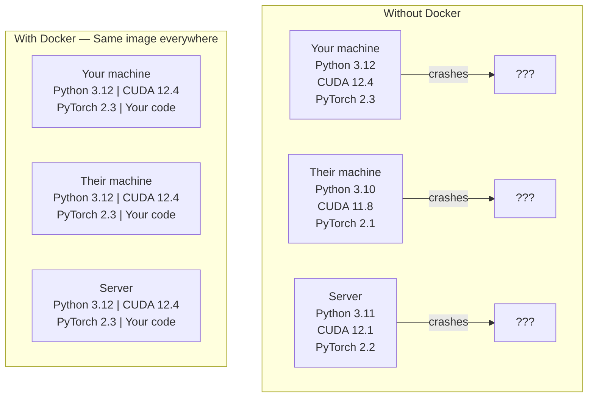

# Docker for AI / 面向 AI 的 Docker

> 容器让 “works on my machine” 成为过去式。

**类型：** 构建
**语言：** Docker
**前置要求：** Phase 0, Lessons 01 and 03
**时间：** 约 60 分钟

## Learning Objectives / 学习目标

- 从 Dockerfile 构建带 GPU 支持的 Docker image，包含 CUDA、PyTorch 和 AI 库
- 把宿主机目录挂载为 volume，让模型、数据集和代码在 container 重建后仍然保留
- 配置 NVIDIA Container Toolkit，让 container 内部可以访问 GPU
- 使用 Docker Compose 编排多服务 AI 应用，例如 inference server + vector database

## The Problem / 问题

你在自己的 laptop 上用 PyTorch 2.3、CUDA 12.4 和 Python 3.12 训练了一个模型。你的同事机器上是 PyTorch 2.1、CUDA 11.8 和 Python 3.10。模型在他们机器上崩了。你的 Dockerfile 可以让两边运行同一个环境。

AI 项目天然容易陷入依赖噩梦。一个典型栈包含 Python、PyTorch、CUDA driver、cuDNN、系统级 C library，以及 flash-attn 这种对 compiler 版本敏感的专用包。Docker 把这些都打包到一个 image 中，让它在任何地方以相同方式运行。

## The Concept / 概念

Docker 会把你的代码、运行时、库和系统工具封装成一个叫 container 的隔离单元。可以把它理解成轻量虚拟机，但它共享宿主机 OS kernel，不需要运行自己的 kernel，所以启动只要几秒，而不是几分钟。



### Why AI projects need Docker more than most / 为什么 AI 项目更需要 Docker

1. **GPU driver 很脆弱。** CUDA 12.4 的代码不能直接跑在 CUDA 11.8 环境里。Docker 把 CUDA toolkit 隔离在 container 内部，再通过 NVIDIA Container Toolkit 共享宿主机 GPU driver。

2. **模型权重很大。** 一个 7B 参数模型在 fp16 下约 14 GB。你不希望每次 rebuild 都重新下载。Docker volume 可以把宿主机上的 models 目录挂载进去。

3. **多服务架构很常见。** 一个真实 AI 应用通常不只是 Python script。它可能包含 inference server、用于 RAG 的 vector database，甚至还有 Web frontend。Docker Compose 可以用一个命令编排这些服务。

### Key vocabulary / 关键词汇

| Term | What it means |
|------|---------------|
| Image | 只读模板。你的配方。由 Dockerfile 构建出来。 |
| Container | image 的运行实例。真正运行的厨房。 |
| Dockerfile | 构建 image 的指令，逐层执行。 |
| Volume | container 重启后仍然保留的持久化存储。 |
| docker-compose | 用 YAML 定义多 container 应用的工具。 |

### Common container patterns in AI / AI 中常见的 container 模式

```
Dev Container
  Full toolkit. Editor support. Jupyter. Debugging tools.
  Used during development and experimentation.

Training Container
  Minimal. Just the training script and dependencies.
  Runs on GPU clusters. No editor, no Jupyter.

Inference Container
  Optimized for serving. Small image. Fast cold start.
  Runs behind a load balancer in production.
```

## Build It / 动手构建

### Step 1: Install Docker / 第 1 步：安装 Docker

```bash
# macOS
brew install --cask docker
open /Applications/Docker.app

# Ubuntu
curl -fsSL https://get.docker.com | sh
sudo usermod -aG docker $USER
# Log out and back in for group change to take effect
```

验证：

```bash
docker --version
docker run hello-world
```

### Step 2: Install NVIDIA Container Toolkit (Linux with NVIDIA GPU) / 第 2 步：安装 NVIDIA Container Toolkit（Linux + NVIDIA GPU）

它让 Docker container 可以访问你的 GPU。macOS 和 Windows（WSL2）用户可以跳过这一步；Docker Desktop 在这些平台上用不同方式处理 GPU passthrough。

```bash
distribution=$(. /etc/os-release;echo $ID$VERSION_ID)
curl -fsSL https://nvidia.github.io/libnvidia-container/gpgkey | sudo gpg --dearmor -o /usr/share/keyrings/nvidia-container-toolkit-keyring.gpg
curl -s -L https://nvidia.github.io/libnvidia-container/$distribution/libnvidia-container.list | \
    sed 's#deb https://#deb [signed-by=/usr/share/keyrings/nvidia-container-toolkit-keyring.gpg] https://#g' | \
    sudo tee /etc/apt/sources.list.d/nvidia-container-toolkit.list

sudo apt-get update
sudo apt-get install -y nvidia-container-toolkit
sudo nvidia-ctk runtime configure --runtime=docker
sudo systemctl restart docker
```

测试 container 内的 GPU 访问：

```bash
docker run --rm --gpus all nvidia/cuda:12.4.1-base-ubuntu22.04 nvidia-smi
```

如果能看到 GPU 信息，说明 toolkit 已经工作。

### Step 3: Understand base images / 第 3 步：理解 base image

选对 base image 能省下大量调试时间。

```
nvidia/cuda:12.4.1-devel-ubuntu22.04
  Full CUDA toolkit. Compilers included.
  Use for: building packages that need nvcc (flash-attn, bitsandbytes)
  Size: ~4 GB

nvidia/cuda:12.4.1-runtime-ubuntu22.04
  CUDA runtime only. No compilers.
  Use for: running pre-built code
  Size: ~1.5 GB

pytorch/pytorch:2.3.1-cuda12.4-cudnn9-runtime
  PyTorch pre-installed on top of CUDA.
  Use for: skipping the PyTorch install step
  Size: ~6 GB

python:3.12-slim
  No CUDA. CPU only.
  Use for: inference on CPU, lightweight tools
  Size: ~150 MB
```

### Step 4: Write a Dockerfile for AI development / 第 4 步：为 AI 开发编写 Dockerfile

下面是 `code/Dockerfile` 中的 Dockerfile。先逐段看懂它：

```dockerfile
FROM nvidia/cuda:12.4.1-devel-ubuntu22.04

ENV DEBIAN_FRONTEND=noninteractive
ENV PYTHONUNBUFFERED=1

RUN apt-get update && apt-get install -y --no-install-recommends \
    python3.12 \
    python3.12-venv \
    python3.12-dev \
    python3-pip \
    git \
    curl \
    build-essential \
    && rm -rf /var/lib/apt/lists/*

RUN update-alternatives --install /usr/bin/python python /usr/bin/python3.12 1

RUN python -m pip install --no-cache-dir --upgrade pip setuptools wheel

RUN python -m pip install --no-cache-dir \
    torch==2.3.1 \
    torchvision==0.18.1 \
    torchaudio==2.3.1 \
    --index-url https://download.pytorch.org/whl/cu124

RUN python -m pip install --no-cache-dir \
    numpy \
    pandas \
    scikit-learn \
    matplotlib \
    jupyter \
    transformers \
    datasets \
    accelerate \
    safetensors

WORKDIR /workspace

VOLUME ["/workspace", "/models"]

EXPOSE 8888

CMD ["python"]
```

构建它：

```bash
docker build -t ai-dev -f phases/00-setup-and-tooling/07-docker-for-ai/code/Dockerfile .
```

第一次会比较久，因为要下载 CUDA base image 和 PyTorch。后续 build 会复用缓存层。

运行它：

```bash
docker run --rm -it --gpus all \
    -v $(pwd):/workspace \
    -v ~/models:/models \
    ai-dev python -c "import torch; print(f'PyTorch {torch.__version__}, CUDA: {torch.cuda.is_available()}')"
```

在 container 中运行 Jupyter：

```bash
docker run --rm -it --gpus all \
    -v $(pwd):/workspace \
    -v ~/models:/models \
    -p 8888:8888 \
    ai-dev jupyter notebook --ip=0.0.0.0 --port=8888 --no-browser --allow-root
```

### Step 5: Volume mounts for data and models / 第 5 步：为数据和模型挂载 volume

Volume mount 对 AI 工作非常关键。没有它，你下载的 14 GB 模型会在 container 停止后消失。

```bash
# Mount your code
-v $(pwd):/workspace

# Mount a shared models directory
-v ~/models:/models

# Mount datasets
-v ~/datasets:/data
```

在训练脚本中，从挂载路径加载：

```python
from transformers import AutoModel

model = AutoModel.from_pretrained("/models/llama-7b")
```

模型保存在宿主机文件系统上。你可以任意重建 container，不需要重新下载。

### Step 6: Docker Compose for multi-service AI apps / 第 6 步：用 Docker Compose 编排多服务 AI 应用

真实 RAG 应用需要 inference server 和 vector database。Docker Compose 可以用一个命令同时运行它们。

查看 `code/docker-compose.yml`：

```yaml
services:
  ai-dev:
    build:
      context: .
      dockerfile: Dockerfile
    deploy:
      resources:
        reservations:
          devices:
            - driver: nvidia
              count: all
              capabilities: [gpu]
    volumes:
      - ../../../:/workspace
      - ~/models:/models
      - ~/datasets:/data
    ports:
      - "8888:8888"
    stdin_open: true
    tty: true
    command: jupyter notebook --ip=0.0.0.0 --port=8888 --no-browser --allow-root

  qdrant:
    image: qdrant/qdrant:v1.12.5
    ports:
      - "6333:6333"
      - "6334:6334"
    volumes:
      - qdrant_data:/qdrant/storage

volumes:
  qdrant_data:
```

启动全部服务：

```bash
cd phases/00-setup-and-tooling/07-docker-for-ai/code
docker compose up -d
```

现在 AI dev container 可以通过 service name 访问 vector database：`http://qdrant:6333`。Docker Compose 会自动创建共享网络。

从 AI container 内测试连接：

```python
from qdrant_client import QdrantClient

client = QdrantClient(host="qdrant", port=6333)
print(client.get_collections())
```

停止全部服务：

```bash
docker compose down
```

加上 `-v` 还会删除 qdrant volume：

```bash
docker compose down -v
```

### Step 7: Useful Docker commands for AI work / 第 7 步：AI 工作中常用的 Docker 命令

```bash
# List running containers
docker ps

# List all images and their sizes
docker images

# Remove unused images (reclaim disk space)
docker system prune -a

# Check GPU usage inside a running container
docker exec -it <container_id> nvidia-smi

# Copy a file from container to host
docker cp <container_id>:/workspace/results.csv ./results.csv

# View container logs
docker logs -f <container_id>
```

## Use It / 应用它

现在你有了一个可复现的 AI 开发环境。本课程后续可以这样使用：

- 用 `docker compose up` 同时启动开发环境和 vector database
- 把代码、模型和数据以 volume 形式挂载，确保 rebuild 后不会丢失
- 当某节课需要新的 Python package，把它加入 Dockerfile 并 rebuild
- 把你的 Dockerfile 分享给队友，他们会得到完全相同的环境

### No GPU? / 没有 GPU？

移除 `--gpus all` flag 和 NVIDIA deploy block。CPU 课程仍然能跑。PyTorch 会检测不到 CUDA，然后自动回退到 CPU。

## Ship It / 交付它

这一课交付的是一个可共享的 AI Docker 环境：Dockerfile 固化 CUDA、PyTorch 和常用 AI library，Docker Compose 则把开发容器和 vector database 组合成可重复启动的本地 stack。

## Exercises / 练习

1. 构建 Dockerfile，并在 container 中运行 `python -c "import torch; print(torch.__version__)"`
2. 启动 docker-compose stack，并验证 AI container 可以访问 `http://qdrant:6333/collections`
3. 把 `flask` 加入 Dockerfile，rebuild，并在 5000 端口运行一个简单 API server。用 `-p 5000:5000` 映射端口
4. 用 `docker images` 查看 image 大小。尝试把 base image 从 `devel` 换成 `runtime`，对比大小

## Key Terms / 关键术语

| 术语 | 常见说法 | 实际含义 |
|------|----------------|----------------------|
| Container | “Lightweight VM” | 使用宿主机 kernel 的隔离进程，拥有自己的文件系统和网络 |
| Image layer | “Cached step” | 每条 Dockerfile 指令都会创建一层。未改变的层会被缓存，所以 rebuild 很快 |
| NVIDIA Container Toolkit | “GPU in Docker” | 通过 `--gpus` flag 把宿主机 GPU 暴露给 container 的 runtime hook |
| Volume mount | “Shared folder” | 把宿主机目录映射到 container 内；container 停止后改动仍保留 |
| Base image | “Starting point” | Dockerfile 中的 `FROM` image，决定预装了什么 |
