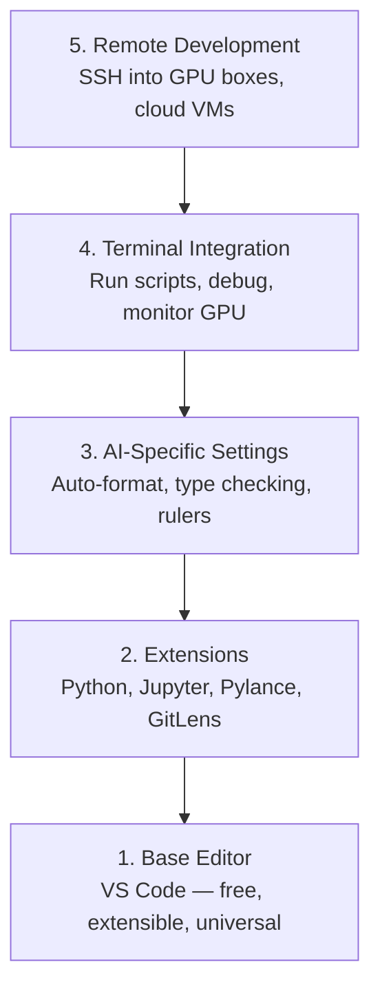

# Editor Setup / 编辑器配置

> 编辑器是你的副驾驶。一次配置好，让它减少阻力，并真正承担一部分工作。

**类型：** 构建
**语言：** --
**前置要求：** Phase 0, Lesson 01
**时间：** 约 20 分钟

## Learning Objectives / 学习目标

- 安装 VS Code，并配置 Python、Jupyter、linting 和 Remote SSH 所需的核心 extensions
- 为 AI workflow 配置 format-on-save、type checking 和 notebook output scrolling
- 设置 Remote SSH，让你像编辑本地代码一样编辑和调试远程 GPU 机器上的代码
- 评估 Cursor、Windsurf、Neovim 等替代编辑器，以及它们对 AI 工作的取舍

## The Problem / 问题

你会在编辑器里花上千小时写 Python、运行 notebook、调试训练循环、SSH 到 GPU 机器。配置糟糕的编辑器会让每次工作都变成摩擦：没有自动补全、没有类型提示、没有内联错误、格式化要手动做，终端体验也很笨重。

正确配置只需要 20 分钟。不配置，可能每天都浪费 20 分钟。

## The Concept / 概念

AI 工程编辑器需要五层能力：



## Build It / 动手构建

### Step 1: Install VS Code / 第 1 步：安装 VS Code

推荐编辑器是 VS Code。它免费、跨平台、对 Jupyter notebook 有一等支持，extension 生态也覆盖了 AI 工作需要的几乎所有能力。

从 [code.visualstudio.com](https://code.visualstudio.com/) 下载。

在终端中验证：

```bash
code --version
```

如果 macOS 上找不到 `code`，打开 VS Code，按 `Cmd+Shift+P`，输入 "Shell Command"，选择 "Install 'code' command in PATH"。

### Step 2: Install Essential Extensions / 第 2 步：安装核心 Extensions

打开 VS Code integrated terminal（`` Ctrl+` `` 或 `` Cmd+` ``），安装 AI 工作真正需要的 extensions：

```bash
code --install-extension ms-python.python
code --install-extension ms-python.vscode-pylance
code --install-extension ms-toolsai.jupyter
code --install-extension eamodio.gitlens
code --install-extension ms-vscode-remote.remote-ssh
code --install-extension ms-python.debugpy
code --install-extension ms-python.black-formatter
code --install-extension charliermarsh.ruff
```

每个 extension 的作用：

| Extension | Why |
|-----------|-----|
| Python | 语言支持、虚拟环境检测、运行/调试 |
| Pylance | 快速类型检查、自动补全、import 解析 |
| Jupyter | 在 VS Code 内运行 notebook、查看变量 |
| GitLens | 查看谁改了什么，内联 git blame |
| Remote SSH | 像打开本地文件夹一样打开远程 GPU 机器上的文件夹 |
| Debugpy | Python 单步调试 |
| Black Formatter | 保存时自动格式化，保持风格一致 |
| Ruff | 快速 linting，捕捉常见错误 |

本课的 `code/.vscode/extensions.json` 包含完整推荐列表。当你打开项目文件夹时，VS Code 会提示安装它们。

### Step 3: Configure Settings / 第 3 步：配置 Settings

复制本课 `code/.vscode/settings.json` 中的设置，或通过 `Settings > Open Settings (JSON)` 手动应用。

AI 工作的关键设置：

```jsonc
{
    "python.analysis.typeCheckingMode": "basic",
    "editor.formatOnSave": true,
    "editor.rulers": [88, 120],
    "notebook.output.scrolling": true,
    "files.autoSave": "afterDelay"
}
```

为什么这些设置重要：

- **Type checking on basic**：在运行前捕捉错误参数类型。对 tensor shape mismatch 和错误 API 参数尤其省时间。
- **Format on save**：不再手动考虑格式化。Black 会处理。
- **Rulers at 88 and 120**：Black 在 88 列换行。120 列标尺提示 docstring 和注释是否过长。
- **Notebook output scrolling**：训练循环会打印成千上万行。没有滚动，output panel 会撑爆页面。
- **Auto-save**：你一定会忘记保存。训练脚本可能跑旧代码。Auto-save 可以避免这种情况。

### Step 4: Terminal Integration / 第 4 步：终端集成

VS Code integrated terminal 是你运行训练脚本、监控 GPU、管理环境的地方。

这样配置：

```jsonc
{
    "terminal.integrated.defaultProfile.osx": "zsh",
    "terminal.integrated.defaultProfile.linux": "bash",
    "terminal.integrated.fontSize": 13,
    "terminal.integrated.scrollback": 10000
}
```

常用快捷键：

| Action | macOS | Linux/Windows |
|--------|-------|---------------|
| Toggle terminal | `` Ctrl+` `` | `` Ctrl+` `` |
| New terminal | `Ctrl+Shift+`` ` | `Ctrl+Shift+`` ` |
| Split terminal | `Cmd+\` | `Ctrl+\` |

Split terminal 很实用：一个窗口跑脚本，一个窗口用 `nvidia-smi -l 1` 或 `watch -n 1 nvidia-smi` 监控 GPU。

### Step 5: Remote Development (SSH into GPU Boxes) / 第 5 步：远程开发（SSH 到 GPU 机器）

这是 AI 工作中最重要的 extension。你会在远程机器上训练模型，比如 cloud VM、实验室 server、Lambda、Vast.ai。Remote SSH 让你打开远程文件系统、编辑文件、运行终端和调试代码，就像一切都在本地。

设置步骤：

1. 安装 Remote SSH extension（已在第 2 步完成）。
2. 按 `Ctrl+Shift+P`（或 `Cmd+Shift+P`），输入 "Remote-SSH: Connect to Host"。
3. 输入 `user@your-gpu-box-ip`。
4. VS Code 会自动在远程机器上安装 server component。

如果想免密码访问，配置 SSH keys：

```bash
ssh-keygen -t ed25519 -C "your-email@example.com"
ssh-copy-id user@your-gpu-box-ip
```

把 host 加入 `~/.ssh/config`，使用更方便：

```
Host gpu-box
    HostName 203.0.113.50
    User ubuntu
    IdentityFile ~/.ssh/id_ed25519
    ForwardAgent yes
```

现在选择 `Remote-SSH: Connect to Host > gpu-box` 就能立即连接。

## Alternatives / 替代选择

### Cursor

[cursor.com](https://cursor.com) 是内置 AI code generation 的 VS Code fork。它使用同样的 extension 生态和 settings 格式。如果你使用 Cursor，本课内容仍然适用。导入同一个 `settings.json` 和 `extensions.json` 即可。

### Windsurf

[windsurf.com](https://windsurf.com) 是另一个 AI-first VS Code fork。逻辑一样：相同 extensions、相同 settings 格式、相同 Remote SSH 支持。

### Vim/Neovim

如果你已经在 Vim 或 Neovim 里很高效，就继续用。AI Python 工作的最低配置是：

- **pyright** 或 **pylsp** 做类型检查（通过 Mason 或手动安装）
- **nvim-lspconfig** 做 language server 集成
- **jupyter-vim** 或 **molten-nvim** 做 notebook-like execution
- **telescope.nvim** 做文件/符号搜索
- **none-ls.nvim** 搭配 black 和 ruff 做 formatting/linting

如果你还不会 Vim，不要现在开始学。它的学习曲线会和 AI 工程学习抢注意力。用 VS Code。

## Use It / 应用它

配置完成后，你的日常工作流会是：

1. 在 VS Code 中打开项目文件夹，或通过 Remote SSH 连接 GPU 机器。
2. 在编辑器里写 Python，获得自动补全、类型提示和内联错误。
3. 用 Jupyter extension 内联运行 notebook。
4. 用 integrated terminal 运行训练脚本、执行 `uv pip install`、监控 GPU。
5. commit 前用 GitLens 审查改动。

## Ship It / 交付它

这一课交付的是一套可复用的编辑器配置：推荐 extensions、`settings.json` 中的 AI 工作流设置，以及可连接远程 GPU 机器的 Remote SSH 配置方式。

## Exercises / 练习

1. 安装 VS Code 和第 2 步列出的所有 extensions
2. 把本课的 `settings.json` 复制到你的 VS Code config
3. 打开一个 Python 文件，验证 Pylance 会显示类型提示，并且 Black 会在保存时格式化
4. 如果你能访问远程机器，配置 Remote SSH 并打开其中一个文件夹

## Key Terms / 关键术语

| 术语 | 常见说法 | 实际含义 |
|------|----------------|----------------------|
| LSP | “Autocomplete engine” | Language Server Protocol：编辑器从语言专用 server 获取类型信息、补全和诊断的标准 |
| Pylance | “The Python plugin” | Microsoft 的 Python language server，使用 Pyright 做类型检查和 IntelliSense |
| Remote SSH | “Working on the server” | VS Code extension，会在远程机器上运行轻量 server，并把 UI 流式传回本地编辑器 |
| Format on save | “Auto-prettier” | 每次保存时编辑器自动运行 formatter（Black、Ruff），让代码风格保持一致 |
