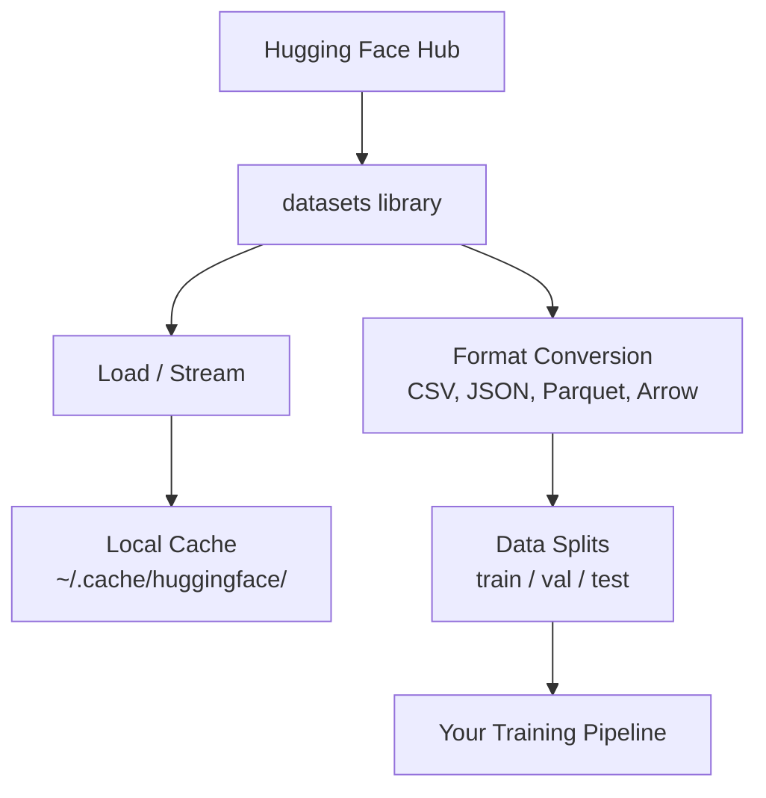

# Data Management / 数据管理

> 数据是燃料。你如何管理数据，决定你能跑多快。

**类型：** 构建
**语言：** Python
**前置要求：** Phase 0, Lesson 01
**时间：** 约 45 分钟

## Learning Objectives / 学习目标

- 使用 Hugging Face `datasets` library 加载、stream 和 cache 数据集
- 在 CSV、JSON、Parquet 和 Arrow 格式之间转换，并解释它们的取舍
- 用固定 random seed 创建可复现的 train/validation/test 划分
- 使用 `.gitignore`、Git LFS 或 DVC 管理大型模型和数据集文件

## The Problem / 问题

每个 AI 项目都从数据开始。你需要寻找数据集、下载数据、在格式之间转换、划分训练和评估数据，并对它们做版本管理，让实验可以复现。每次都手工处理很慢，也很容易出错。你需要一套可重复的工作流。

## The Concept / 概念



Hugging Face `datasets` library 是 AI 工作中加载数据的标准方式之一。它开箱支持下载、缓存、格式转换和 streaming。

## Build It / 动手构建

### Step 1: Install the datasets library / 第 1 步：安装 datasets library

```bash
pip install datasets huggingface_hub
```

### Step 2: Load a dataset / 第 2 步：加载数据集

```python
from datasets import load_dataset

dataset = load_dataset("imdb")
print(dataset)
print(dataset["train"][0])
```

这会下载 IMDB 电影评论数据集。第一次下载后，后续会从 `~/.cache/huggingface/datasets/` 缓存加载。

### Step 3: Stream large datasets / 第 3 步：Stream 大型数据集

有些数据集大到本地磁盘放不下。Streaming 会逐行加载，而不是把整个数据集下载下来。

```python
dataset = load_dataset("wikimedia/wikipedia", "20220301.en", split="train", streaming=True)

for i, example in enumerate(dataset):
    print(example["title"])
    if i >= 4:
        break
```

Streaming 会给你一个 `IterableDataset`。你按行处理到达的数据。无论数据集多大，内存使用都保持稳定。

### Step 4: Dataset formats / 第 4 步：数据集格式

`datasets` library 底层使用 Apache Arrow。你可以根据 pipeline 的需要转换成其他格式。

```python
dataset = load_dataset("imdb", split="train")

dataset.to_csv("imdb_train.csv")
dataset.to_json("imdb_train.json")
dataset.to_parquet("imdb_train.parquet")
```

格式对比：

| Format | Size | Read Speed | Best For |
|--------|------|-----------|----------|
| CSV | 大 | 慢 | 人类可读、电子表格 |
| JSON | 大 | 慢 | API、嵌套数据 |
| Parquet | 小 | 快 | 分析、列式查询 |
| Arrow | 小 | 最快 | 内存中处理（`datasets` 内部使用） |

AI 工作中，Parquet 是最适合存储的格式。Arrow 是内存中处理的数据格式。CSV 和 JSON 更适合交换数据。

### Step 5: Data splits / 第 5 步：数据划分

每个 ML 项目都需要三种 split：

- **Train**：模型从这里学习（通常 80%）
- **Validation**：训练过程中检查进展（通常 10%）
- **Test**：训练结束后的最终评估（通常 10%）

有些数据集自带 split。没有的话，就自己划分：

```python
dataset = load_dataset("imdb", split="train")

split = dataset.train_test_split(test_size=0.2, seed=42)
train_val = split["train"].train_test_split(test_size=0.125, seed=42)

train_ds = train_val["train"]
val_ds = train_val["test"]
test_ds = split["test"]

print(f"Train: {len(train_ds)}, Val: {len(val_ds)}, Test: {len(test_ds)}")
```

始终设置 seed，保证可复现。同一个 seed 每次都会产生相同的划分。

### Step 6: Download and cache models / 第 6 步：下载并缓存模型

模型通常是大文件。`huggingface_hub` library 会负责下载和缓存。

```python
from huggingface_hub import hf_hub_download, snapshot_download

model_path = hf_hub_download(
    repo_id="sentence-transformers/all-MiniLM-L6-v2",
    filename="config.json"
)
print(f"Cached at: {model_path}")

model_dir = snapshot_download("sentence-transformers/all-MiniLM-L6-v2")
print(f"Full model at: {model_dir}")
```

模型会缓存到 `~/.cache/huggingface/hub/`。下载一次后，后续运行会立即从缓存加载。

### Step 7: Handle large files / 第 7 步：处理大文件

模型权重和大型数据集不应该进 git。你有三个选择：

**Option A: .gitignore（最简单）**

```
*.bin
*.safetensors
*.pt
*.onnx
data/*.parquet
data/*.csv
models/
```

**Option B: Git LFS（在 git 中追踪大文件）**

```bash
git lfs install
git lfs track "*.bin"
git lfs track "*.safetensors"
git add .gitattributes
```

Git LFS 会把 pointer 存在 repo 中，实际文件存到单独的 server。GitHub 免费给 1 GB。

**Option C: DVC（data version control）**

```bash
pip install dvc
dvc init
dvc add data/training_set.parquet
git add data/training_set.parquet.dvc data/.gitignore
git commit -m "Track training data with DVC"
```

DVC 会创建小型 `.dvc` 文件指向你的数据。真实数据放在 S3、GCS 或其他远程存储 backend。

| Approach | Complexity | Best For |
|----------|-----------|----------|
| .gitignore | 低 | 个人项目、可重新下载的数据 |
| Git LFS | 中 | 团队通过 git 共享模型权重 |
| DVC | 高 | 可复现实验、大型数据集、团队协作 |

本课程中，`.gitignore` 已经足够。当你需要跨机器精确复现实验时，再使用 DVC。

### Step 8: Storage patterns / 第 8 步：存储模式

**Local storage** 适合 10 GB 以下的数据集。HF cache 会自动处理。

**Cloud storage** 适合更大的数据，或者需要多台机器共享的数据：

```python
import os

local_path = os.path.expanduser("~/.cache/huggingface/datasets/")

# s3_path = "s3://my-bucket/datasets/"
# gcs_path = "gs://my-bucket/datasets/"
```

DVC 可以直接和 S3、GCS 集成：

```bash
dvc remote add -d myremote s3://my-bucket/dvc-store
dvc push
```

对本课程来说，本地存储已经足够。等你在远程 GPU instance 上做微调时，cloud storage 才会更相关。

## Datasets Used in This Course / 本课程使用的数据集

| Dataset | Lessons | Size | What It Teaches |
|---------|---------|------|----------------|
| IMDB | Tokenization、classification | 84 MB | 文本分类基础 |
| WikiText | Language modeling | 181 MB | Next-token prediction |
| SQuAD | QA systems | 35 MB | 问答、span |
| Common Crawl (subset) | Embeddings | 不定 | 大规模文本处理 |
| MNIST | Vision basics | 21 MB | 图像分类基础 |
| COCO (subset) | Multimodal | 不定 | 图文对 |

你现在不需要全部下载。每节课会说明自己需要什么数据。

## Use It / 应用它

运行 utility script，验证一切正常：

```bash
python code/data_utils.py
```

它会下载一个小数据集，完成转换和划分，并打印摘要。

## Ship It / 交付它

这一课会产出：
- `code/data_utils.py` - 可复用的数据加载与缓存工具
- `outputs/prompt-data-helper.md` - 帮你为任务寻找合适数据集的 prompt

## Exercises / 练习

1. 加载带 `mrpc` config 的 `glue` 数据集，并查看前 5 个 example
2. Stream `c4` 数据集，统计 10 秒内可以处理多少个 example
3. 把一个数据集转换成 Parquet，并和 CSV 对比文件大小
4. 用固定 seed 创建 70/15/15 的 train/val/test split，并验证各部分大小

## Key Terms / 关键术语

| 术语 | 常见说法 | 实际含义 |
|------|----------------|----------------------|
| Dataset split | “Training data” | ML 生命周期不同阶段使用的命名子集（train/val/test） |
| Streaming | “Load it lazily” | 不下载完整数据集，而是从远端按行处理数据 |
| Parquet | “Compressed CSV” | 面向分析查询和存储效率优化的列式文件格式 |
| Arrow | “Fast dataframe” | `datasets` library 内部使用的内存列式格式，支持 zero-copy read |
| Git LFS | “Git for big files” | 把大文件存到 git repo 外部，同时在版本控制中保留 pointer 的扩展 |
| DVC | “Git for data” | 数据集和模型的版本控制系统，可与 cloud storage 集成 |
| Cache | “Already downloaded” | 已获取数据的本地副本，默认存储在 ~/.cache/huggingface/ |
