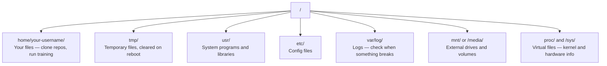

# Linux for AI / 面向 AI 的 Linux

> 大多数 AI 都运行在 Linux 上。你需要懂到足够不被卡住。

**类型：** 学习
**语言：** --
**前置要求：** Phase 0, Lesson 01
**时间：** 约 30 分钟

## Learning Objectives / 学习目标

- 在命令行中导航 Linux 文件系统，并执行必要的文件操作
- 使用 `chmod` 和 `chown` 管理文件权限，解决 "Permission denied" 错误
- 使用 `apt` 安装系统包，并配置一台新的 GPU 机器用于 AI 工作
- 识别从 macOS 转到 Linux 时常见的差异，避免远程机器上的踩坑

## The Problem / 问题

你可能在 macOS 或 Windows 上开发。但当你 SSH 进一台云 GPU 机器、租用 Lambda instance，或启动 EC2 时，落地环境通常是 Ubuntu。终端是你唯一的界面。没有 Finder，没有 Explorer，没有 GUI。如果你不会在命令行里浏览文件系统、安装包和管理进程，就会一边为闲置 GPU 小时付费，一边搜索 “how to unzip a file in Linux”。

这是一份生存指南。它只覆盖你在远程 Linux 机器上做 AI 工作所需的内容，不再扩展。

## File System Layout / 文件系统布局

Linux 把所有内容组织在单一 root `/` 下面。没有 `C:\`，也没有 `/Volumes`。你真正会碰到的目录是这些：



你的 home directory 是 `~` 或 `/home/your-username`。几乎所有日常操作都发生在这里。

## Build It / 动手构建

这一课的构建方式不是写一个程序，而是在一台 Linux 或 WSL2 机器上实际完成文件导航、权限修复、包安装、进程检查和远程文件传输。下面各节就是这套最小生存工具箱。

## Essential Commands / 必备命令

下面 15 个命令覆盖了你在远程 GPU 机器上 95% 的操作。

### Moving Around / 移动位置

```bash
pwd                         # Where am I?
ls                          # What's here?
ls -la                      # What's here, including hidden files with details?
cd /path/to/dir             # Go there
cd ~                        # Go home
cd ..                       # Go up one level
```

### Files and Directories / 文件与目录

```bash
mkdir my-project            # Create a directory
mkdir -p a/b/c              # Create nested directories in one shot

cp file.txt backup.txt      # Copy a file
cp -r src/ src-backup/      # Copy a directory (recursive)

mv old.txt new.txt          # Rename a file
mv file.txt /tmp/           # Move a file

rm file.txt                 # Delete a file (no trash, it's gone)
rm -rf my-dir/              # Delete a directory and everything inside
```

`rm -rf` 是永久删除，没有撤销。按下回车前一定再次确认路径。

### Reading Files / 阅读文件

```bash
cat file.txt                # Print entire file
head -20 file.txt           # First 20 lines
tail -20 file.txt           # Last 20 lines
tail -f log.txt             # Follow a log file in real time (Ctrl+C to stop)
less file.txt               # Scroll through a file (q to quit)
```

### Searching / 搜索

```bash
grep "error" training.log           # Find lines containing "error"
grep -r "learning_rate" .           # Search all files in current directory
grep -i "cuda" config.yaml          # Case-insensitive search

find . -name "*.py"                 # Find all Python files under current dir
find . -name "*.ckpt" -size +1G     # Find checkpoint files larger than 1GB
```

## Permissions / 权限

Linux 中每个文件都有 owner 和 permission bits。当脚本不能执行，或者目录不能写入时，你会遇到它。

```bash
ls -l train.py
# -rwxr-xr-- 1 user group 2048 Mar 19 10:00 train.py
#  ^^^             owner permissions: read, write, execute
#     ^^^          group permissions: read, execute
#        ^^        everyone else: read only
```

常见修复：

```bash
chmod +x train.sh           # Make a script executable
chmod 755 deploy.sh         # Owner: full, others: read+execute
chmod 644 config.yaml       # Owner: read+write, others: read only

chown user:group file.txt   # Change who owns a file (needs sudo)
```

当你看到 "Permission denied"，几乎总是权限问题。大多数情况下，`chmod +x` 或 `sudo` 就能解决。

## Package Management (apt) / 包管理（apt）

Ubuntu 使用 `apt`。你用它安装系统级软件。

```bash
sudo apt update             # Refresh the package list (always do this first)
sudo apt install -y htop    # Install a package (-y skips confirmation)
sudo apt install -y build-essential  # C compiler, make, etc. Needed by many Python packages
sudo apt install -y tmux    # Terminal multiplexer (keep sessions alive after disconnect)

apt list --installed        # What's installed?
sudo apt remove htop        # Uninstall
```

新 GPU 机器上常装的包：

```bash
sudo apt update && sudo apt install -y \
    build-essential \
    git \
    curl \
    wget \
    tmux \
    htop \
    unzip \
    python3-venv
```

## Users and sudo / 用户与 sudo

你通常以普通用户身份登录。有些操作需要 root（admin）权限。

```bash
whoami                      # What user am I?
sudo command                # Run a single command as root
sudo su                     # Become root (exit to go back, use sparingly)
```

在云 GPU instance 上，你通常是唯一用户，并且已经有 sudo 权限。不要所有事情都用 root 做，只在需要时使用 sudo。

## Processes and systemd / 进程与 systemd

当训练卡住，或者你需要检查什么正在运行：

```bash
htop                        # Interactive process viewer (q to quit)
ps aux | grep python        # Find running Python processes
kill 12345                  # Gracefully stop process with PID 12345
kill -9 12345               # Force kill (use when graceful doesn't work)
nvidia-smi                  # GPU processes and memory usage
```

systemd 管理 service（后台 daemon）。如果你运行 inference server，会用到它：

```bash
sudo systemctl start nginx          # Start a service
sudo systemctl stop nginx           # Stop it
sudo systemctl restart nginx        # Restart it
sudo systemctl status nginx         # Check if it's running
sudo systemctl enable nginx         # Start automatically on boot
```

## Disk Space / 磁盘空间

GPU 机器的磁盘经常有限。模型和数据集会很快填满它。

```bash
df -h                       # Disk usage for all mounted drives
df -h /home                 # Disk usage for /home specifically

du -sh *                    # Size of each item in current directory
du -sh ~/.cache             # Size of your cache (pip, huggingface models land here)
du -sh /data/checkpoints/   # Check how big your checkpoints are

# Find the biggest space hogs
du -h --max-depth=1 / 2>/dev/null | sort -hr | head -20
```

常见节省空间方式：

```bash
# Clear pip cache
pip cache purge

# Clear apt cache
sudo apt clean

# Remove old checkpoints you don't need
rm -rf checkpoints/epoch_01/ checkpoints/epoch_02/
```

## Networking / 网络

你会在命令行里下载模型、传输文件、调用 API。

```bash
# Download files
wget https://example.com/model.bin                   # Download a file
curl -O https://example.com/data.tar.gz              # Same thing with curl
curl -s https://api.example.com/health | python3 -m json.tool  # Hit an API, pretty-print JSON

# Transfer files between machines
scp model.bin user@remote:/data/                     # Copy file to remote machine
scp user@remote:/data/results.csv .                  # Copy file from remote to local
scp -r user@remote:/data/checkpoints/ ./local-dir/   # Copy directory

# Sync directories (faster than scp for large transfers, resumes on failure)
rsync -avz --progress ./data/ user@remote:/data/
rsync -avz --progress user@remote:/results/ ./results/
```

大文件优先用 `rsync`，不要用 `scp`。它只传输变化的字节，也能处理连接中断后的继续同步。

## tmux: Keep Sessions Alive / tmux：保持 Session 存活

当你 SSH 到远程机器时，合上电脑可能会杀掉训练任务。tmux 可以避免这一点。

```bash
tmux new -s train           # Start a new session named "train"
# ... start your training, then:
# Ctrl+B, then D            # Detach (training keeps running)

tmux ls                     # List sessions
tmux attach -t train        # Reattach to session

# Inside tmux:
# Ctrl+B, then %            # Split pane vertically
# Ctrl+B, then "            # Split pane horizontally
# Ctrl+B, then arrow keys   # Switch between panes
```

长训练任务始终放在 tmux 里运行。始终如此。

## WSL2 for Windows Users / 给 Windows 用户的 WSL2

如果你使用 Windows，WSL2 可以让你在不双系统启动的情况下获得真实 Linux 环境。

```bash
# In PowerShell (admin)
wsl --install -d Ubuntu-24.04

# After restart, open Ubuntu from Start menu
sudo apt update && sudo apt upgrade -y
```

WSL2 运行真实 Linux kernel。本课所有内容都可以在其中使用。在 WSL 内部，你的 Windows 文件位于 `/mnt/c/Users/YourName/`。

GPU passthrough 可以通过 Windows 侧安装的 NVIDIA driver 实现。安装 Windows NVIDIA driver（不是 Linux 版），CUDA 就可以在 WSL2 内部使用。

## Gotchas: macOS to Linux / 易踩坑：从 macOS 到 Linux

如果你从 macOS 过来，这些差异会卡住你：

| macOS | Linux | Notes |
|-------|-------|-------|
| `brew install` | `sudo apt install` | 包名有时不同。`brew install htop` 和 `sudo apt install htop` 基本一样，但 `brew install readline` 和 `sudo apt install libreadline-dev` 并不是同名。 |
| `open file.txt` | `xdg-open file.txt` | 但远程机器通常没有 GUI。用 `cat` 或 `less`。 |
| `pbcopy` / `pbpaste` | 不可用 | SSH 里没有可直接 pipe 的剪贴板。 |
| `~/.zshrc` | `~/.bashrc` | macOS 默认 zsh，多数 Linux server 默认 bash。 |
| `/opt/homebrew/` | `/usr/bin/`, `/usr/local/bin/` | binary 所在路径不同。 |
| `sed -i '' 's/a/b/' file` | `sed -i 's/a/b/' file` | macOS sed 的 `-i` 后需要空字符串，Linux 不需要。 |
| Case-insensitive filesystem | Case-sensitive filesystem | `Model.py` 和 `model.py` 在 Linux 上是两个不同文件。 |
| Line endings `\n` | Line endings `\n` | 两者相同。但 Windows 使用 `\r\n`，会让 bash script 出问题。用 `dos2unix` 修复。 |

## Quick Reference Card / 快速参考卡

```
Navigation:     pwd, ls, cd, find
Files:          cp, mv, rm, mkdir, cat, head, tail, less
Search:         grep, find
Permissions:    chmod, chown, sudo
Packages:       apt update, apt install
Processes:      htop, ps, kill, nvidia-smi
Services:       systemctl start/stop/restart/status
Disk:           df -h, du -sh
Network:        curl, wget, scp, rsync
Sessions:       tmux new/attach/detach
```

## Use It / 应用它

后续当你登录云 GPU、排查训练进程、清理磁盘或部署 inference service 时，这些 Linux 命令就是默认工具箱。先在本地 WSL2 或一台普通 Linux 机器上练熟，再把同样动作带到昂贵的 GPU instance 上。

## Ship It / 交付它

这一课交付的是一张 Linux AI 生存清单：你应该能在没有 GUI 的远程机器上定位文件、安装依赖、修复权限、查看进程、检查磁盘，并保持训练 session 存活。

## Exercises / 练习

1. SSH 到任意 Linux 机器（或打开 WSL2），进入 home directory。创建一个 project folder，在里面用 `touch` 创建三个空文件，然后用 `ls -la` 列出它们。
2. 用 apt 安装 `htop`，运行它，并找出哪个进程占用最多 memory。
3. 启动 tmux session，在里面运行 `sleep 300`，detach，列出 session，再 reattach。
4. 用 `df -h` 检查可用磁盘空间，再用 `du -sh ~/.cache/*` 找出 cache 中最占空间的内容。
5. 用 `scp` 从本地向远程机器传输一个文件，然后用 `rsync` 做同样传输，对比体验。

## Key Terms / 关键术语

| 术语 | 常见说法 | 实际含义 |
|------|----------------|----------------------|
| Root directory | “系统根目录” | Linux 文件系统的起点 `/`，所有路径都挂在它下面 |
| Permission bits | “文件权限” | 控制 owner、group 和 others 是否可 read/write/execute 文件的标记 |
| sudo | “管理员权限” | 以 root 权限运行单个命令的机制，应只在需要时使用 |
| systemd | “服务管理器” | Linux 上管理后台服务启动、停止、重启和开机自启的系统组件 |
| WSL2 | “Windows 里的 Linux” | Windows 上运行真实 Linux kernel 的环境，可用于本课程命令行练习 |
