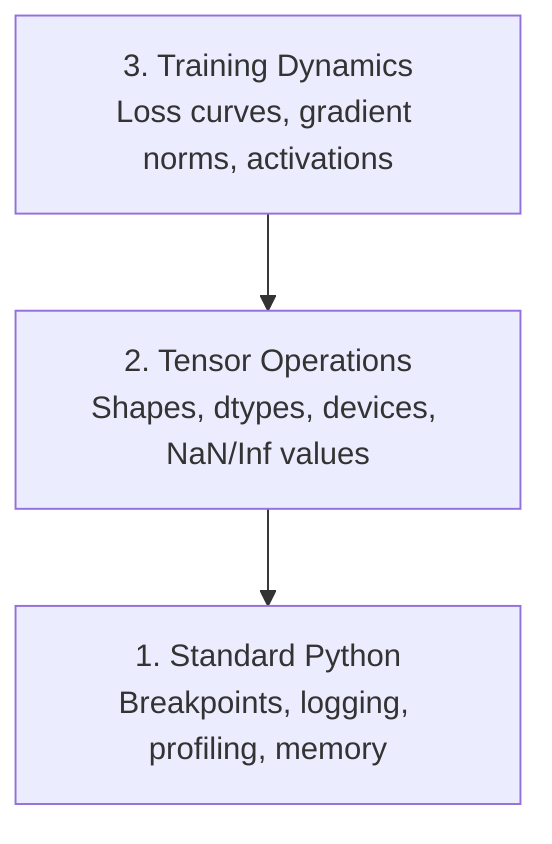

# Debugging and Profiling / 调试与性能分析

> 最糟糕的 AI bug 不会崩溃。它们会安静地在垃圾数据上训练，并给你一条漂亮的 loss curve。

**类型：** 构建
**语言：** Python
**前置要求：** Lesson 1 (Dev Environment), basic PyTorch familiarity
**时间：** 约 60 分钟

## Learning Objectives / 学习目标

- 使用条件式 `breakpoint()` 和 `debug_print` 在训练中途检查 tensor shape、dtype 和 NaN 值
- 使用 `cProfile`、`line_profiler` 和 `tracemalloc` 分析训练循环，定位瓶颈
- 检测常见 AI bug：shape mismatch、NaN loss、data leakage 和 wrong-device tensor
- 配置 TensorBoard，可视化 loss curve、weight histogram 和 gradient distribution

## The Problem / 问题

AI 代码的失败方式和普通代码不同。Web app 出错会带着 stack trace 崩溃。配置错误的训练循环可能运行 8 小时，烧掉 $200 GPU 时间，最后得到一个对所有输入都预测均值的模型。代码从未报错。真正的问题可能是 tensor 在错误设备上、忘了 `.detach()`，或者 label 泄漏进了 feature。

你需要能在这些静默失败浪费时间和算力前抓住它们的调试工具。

## The Concept / 概念

AI debugging 有三个层次：



大多数人会直接跳到第 3 层，也就是盯着 TensorBoard 看。但 80% 的 AI bug 都在第 1 层和第 2 层。

## Build It / 动手构建

### Part 1: Print Debugging (Yes, It Works) / 第 1 部分：Print Debugging（它真的有用）

Print debugging 经常被轻视，但不应该。对 tensor 代码来说，一个有针对性的 print 往往比单步调试更有效，因为你需要同时看到 shape、dtype 和取值范围。

```python
def debug_print(name, tensor):
    print(f"{name}: shape={tensor.shape}, dtype={tensor.dtype}, "
          f"device={tensor.device}, "
          f"min={tensor.min().item():.4f}, max={tensor.max().item():.4f}, "
          f"mean={tensor.mean().item():.4f}, "
          f"has_nan={tensor.isnan().any().item()}")
```

在每个可疑操作后调用它。找到 bug 后删除这些 print。简单但有效。

### Part 2: Python Debugger (pdb and breakpoint) / 第 2 部分：Python Debugger（pdb 和 breakpoint）

内置 debugger 在 AI 工作中被低估了。把 `breakpoint()` 放进训练循环，就可以交互式检查 tensor。

```python
def training_step(model, batch, criterion, optimizer):
    inputs, labels = batch
    outputs = model(inputs)
    loss = criterion(outputs, labels)

    if loss.item() > 100 or torch.isnan(loss):
        breakpoint()

    loss.backward()
    optimizer.step()
```

进入 debugger 后，常用命令：

- `p outputs.shape` 检查 shape
- `p loss.item()` 查看 loss 值
- `p torch.isnan(outputs).sum()` 统计 NaN 数量
- `p model.fc1.weight.grad` 检查 gradient
- `c` 继续，`q` 退出

这就是条件式调试。只有当某些东西看起来不对时才停下。对 10,000 step 的训练来说，这很重要。

### Part 3: Python Logging / 第 3 部分：Python Logging

当调试不再只是快速检查时，用 logging 替代 print。

```python
import logging

logging.basicConfig(
    level=logging.INFO,
    format="%(asctime)s [%(levelname)s] %(message)s",
    handlers=[
        logging.FileHandler("training.log"),
        logging.StreamHandler()
    ]
)
logger = logging.getLogger(__name__)

logger.info("Starting training: lr=%.4f, batch_size=%d", lr, batch_size)
logger.warning("Loss spike detected: %.4f at step %d", loss.item(), step)
logger.error("NaN loss at step %d, stopping", step)
```

Logging 会给你 timestamp、severity level 和文件输出。当训练凌晨 3 点失败时，你想要的是 log file，而不是已经滚出屏幕的 terminal output。

### Part 4: Timing Code Sections / 第 4 部分：给代码片段计时

知道时间花在哪里，是优化的第一步。

```python
import time

class Timer:
    def __init__(self, name=""):
        self.name = name

    def __enter__(self):
        self.start = time.perf_counter()
        return self

    def __exit__(self, *args):
        elapsed = time.perf_counter() - self.start
        print(f"[{self.name}] {elapsed:.4f}s")

with Timer("data loading"):
    batch = next(dataloader_iter)

with Timer("forward pass"):
    outputs = model(batch)

with Timer("backward pass"):
    loss.backward()
```

常见发现：data loading 占了 60% 的训练时间。修复方式往往是给 DataLoader 设置 `num_workers > 0`，而不是换更快的 GPU。

### Part 5: cProfile and line_profiler / 第 5 部分：cProfile 和 line_profiler

当手写 timer 不够用时：

```bash
python -m cProfile -s cumtime train.py
```

它会列出每个函数调用，并按累计耗时排序。逐行 profiling：

```bash
pip install line_profiler
```

```python
@profile
def train_step(model, data, target):
    output = model(data)
    loss = F.cross_entropy(output, target)
    loss.backward()
    return loss

# Run with: kernprof -l -v train.py
```

### Part 6: Memory Profiling / 第 6 部分：内存分析

#### CPU Memory with tracemalloc / 用 tracemalloc 分析 CPU 内存

```python
import tracemalloc

tracemalloc.start()

# your code here
model = build_model()
data = load_dataset()

snapshot = tracemalloc.take_snapshot()
top_stats = snapshot.statistics("lineno")
for stat in top_stats[:10]:
    print(stat)
```

#### CPU Memory with memory_profiler / 用 memory_profiler 分析 CPU 内存

```bash
pip install memory_profiler
```

```python
from memory_profiler import profile

@profile
def load_data():
    raw = read_csv("data.csv")       # watch memory jump here
    processed = preprocess(raw)       # and here
    return processed
```

用 `python -m memory_profiler your_script.py` 运行，就能看到逐行内存使用。

#### GPU Memory with PyTorch / 用 PyTorch 查看 GPU 内存

```python
import torch

if torch.cuda.is_available():
    print(torch.cuda.memory_summary())

    print(f"Allocated: {torch.cuda.memory_allocated() / 1e9:.2f} GB")
    print(f"Cached: {torch.cuda.memory_reserved() / 1e9:.2f} GB")
```

当你遇到 OOM（Out of Memory）：

1. 降低 batch size（永远先尝试这个）
2. 使用 `torch.cuda.empty_cache()` 释放 cached memory
3. 对大型中间结果使用 `del tensor`，然后调用 `torch.cuda.empty_cache()`
4. 使用 mixed precision（`torch.cuda.amp`）把内存用量减半
5. 对很深的模型使用 gradient checkpointing

### Part 7: Common AI Bugs and How to Catch Them / 第 7 部分：常见 AI Bug 以及如何抓住它们

#### Shape Mismatch / Shape 不匹配

最常见的 bug。比如 tensor shape 是 `[batch, features]`，但模型期望 `[batch, channels, height, width]`。

```python
def check_shapes(model, sample_input):
    print(f"Input: {sample_input.shape}")
    hooks = []

    def make_hook(name):
        def hook(module, inp, out):
            in_shape = inp[0].shape if isinstance(inp, tuple) else inp.shape
            out_shape = out.shape if hasattr(out, "shape") else type(out)
            print(f"  {name}: {in_shape} -> {out_shape}")
        return hook

    for name, module in model.named_modules():
        hooks.append(module.register_forward_hook(make_hook(name)))

    with torch.no_grad():
        model(sample_input)

    for h in hooks:
        h.remove()
```

用一个 sample batch 运行一次。它会列出模型中每一步 shape 如何变化。

#### NaN Loss / NaN Loss

NaN loss 表示某些数值炸了。常见原因：

- Learning rate 过高
- 自定义 loss 中除以 0
- 对 0 或负数取 log
- RNN 中 gradient exploding

```python
def detect_nan(model, loss, step):
    if torch.isnan(loss):
        print(f"NaN loss at step {step}")
        for name, param in model.named_parameters():
            if param.grad is not None:
                if torch.isnan(param.grad).any():
                    print(f"  NaN gradient in {name}")
                if torch.isinf(param.grad).any():
                    print(f"  Inf gradient in {name}")
        return True
    return False
```

#### Data Leakage / 数据泄漏

你的模型在 test set 上拿到 99% accuracy。听起来很棒，但它很可能是 bug。

```python
def check_data_leakage(train_set, test_set, id_column="id"):
    train_ids = set(train_set[id_column].tolist())
    test_ids = set(test_set[id_column].tolist())
    overlap = train_ids & test_ids
    if overlap:
        print(f"DATA LEAKAGE: {len(overlap)} samples in both train and test")
        return True
    return False
```

也要检查 temporal leakage：用未来数据预测过去。按 timestamp 排序后再划分。

#### Wrong Device / 错误设备

不同设备上的 tensor（CPU vs GPU）会导致 runtime error。但有时某个 tensor 悄悄停留在 CPU，而其他东西都在 GPU 上，训练只是变得很慢。

```python
def check_devices(model, *tensors):
    model_device = next(model.parameters()).device
    print(f"Model device: {model_device}")
    for i, t in enumerate(tensors):
        if t.device != model_device:
            print(f"  WARNING: tensor {i} on {t.device}, model on {model_device}")
```

### Part 8: TensorBoard Basics / 第 8 部分：TensorBoard 基础

TensorBoard 会展示训练随时间发生了什么。

```bash
pip install tensorboard
```

```python
from torch.utils.tensorboard import SummaryWriter

writer = SummaryWriter("runs/experiment_1")

for step in range(num_steps):
    loss = train_step(model, batch)

    writer.add_scalar("loss/train", loss.item(), step)
    writer.add_scalar("lr", optimizer.param_groups[0]["lr"], step)

    if step % 100 == 0:
        for name, param in model.named_parameters():
            writer.add_histogram(f"weights/{name}", param, step)
            if param.grad is not None:
                writer.add_histogram(f"grads/{name}", param.grad, step)

writer.close()
```

启动它：

```bash
tensorboard --logdir=runs
```

你应该关注：

- **Loss not decreasing**：learning rate 太低，或 model architecture 有问题
- **Loss oscillating wildly**：learning rate 太高
- **Loss goes to NaN**：数值不稳定（见上面的 NaN 部分）
- **Train loss decreasing, val loss increasing**：过拟合
- **Weight histograms collapsing to zero**：vanishing gradients
- **Gradient histograms exploding**：需要 gradient clipping

### Part 9: VS Code Debugger / 第 9 部分：VS Code Debugger

交互式调试可以通过 `launch.json` 配置 VS Code：

```json
{
    "version": "0.2.0",
    "configurations": [
        {
            "name": "Debug Training",
            "type": "debugpy",
            "request": "launch",
            "program": "${file}",
            "console": "integratedTerminal",
            "justMyCode": false
        }
    ]
}
```

点击 gutter 设置 breakpoint。用 Variables pane 检查 tensor 属性。Debug Console 可以让你在执行中途运行任意 Python 表达式。

这很适合单步查看 data preprocessing pipeline，观察每一步 transformation。

## Use It / 应用它

下面这套 debugging workflow 可以抓住大多数 AI bug：

1. **训练前**：用 sample batch 运行 `check_shapes`。确认输入输出维度符合预期。
2. **前 10 步**：对 loss、outputs 和 gradients 使用 `debug_print`。确认没有 NaN，数值范围合理。
3. **训练中**：记录 loss、learning rate 和 gradient norm。用 TensorBoard 可视化。
4. **出问题时**：在失败点放 `breakpoint()`，交互式检查 tensor。
5. **性能问题**：分别计时 data loading、forward、backward。如果接近 OOM，再做 memory profiling。

## Ship It / 交付它

运行 debugging toolkit script：

```bash
python phases/00-setup-and-tooling/12-debugging-and-profiling/code/debug_tools.py
```

查看 `outputs/prompt-debug-ai-code.md`，里面有一个帮助诊断 AI 专属 bug 的 prompt。

## Exercises / 练习

1. 运行 `debug_tools.py`，阅读每一部分输出。修改 dummy model，引入一个 NaN（提示：在 forward pass 中除以 0），观察 detector 如何抓住它。
2. 用 `cProfile` 分析一个 training loop，并找出最慢的函数。
3. 使用 `tracemalloc` 找出 data loading pipeline 中哪一行分配了最多内存。
4. 为一个简单训练任务配置 TensorBoard，并判断模型是否过拟合。
5. 在 training loop 里使用 `breakpoint()`。练习在 debugger prompt 中检查 tensor shape、device 和 gradient 值。

## Key Terms / 关键术语

| 术语 | 常见说法 | 实际含义 |
|------|----------------|----------------------|
| Profiling | “性能分析” | 测量时间、内存或调用频率，找出真正瓶颈的过程 |
| NaN | “Not a Number” | 数值计算中无效结果的标记，训练中通常表示数值已经不稳定 |
| Data leakage | “数据穿越” | 训练过程意外接触到验证/测试或未来信息，导致评估结果虚高 |
| TensorBoard | “训练曲线面板” | 可视化 loss、权重、gradient 等训练动态的工具 |
| OOM | “Out of Memory” | 内存或显存不足，训练任务无法继续分配所需空间 |
