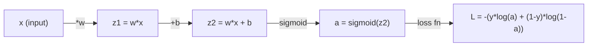
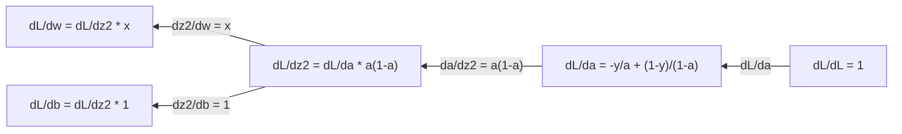
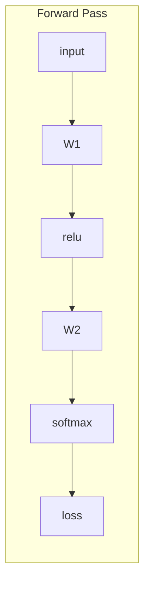
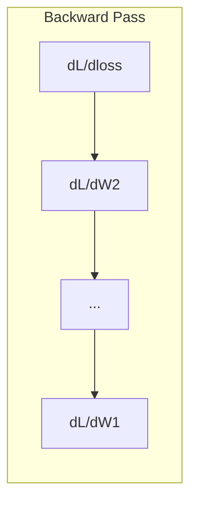

# Calculus for Machine Learning / 面向机器学习的微积分

> 导数告诉你哪里是下坡。神经网络学习所需要的，核心就是这个方向。

**类型：** 学习
**语言：** Python
**前置要求：** Phase 1, Lessons 01-03
**时间：** 约 60 分钟

## Learning Objectives / 学习目标

- 为常见 ML 函数计算 numerical derivatives 和 analytical derivatives，例如 x^2、sigmoid、cross-entropy
- 从零实现 gradient descent，在 1D 和 2D 中最小化 loss function
- 推导 linear regression model 的 gradient，并通过手写 weight updates 完成训练
- 解释 Hessian matrix、Taylor series approximations，以及它们与 optimization methods 的关系

## The Problem / 问题

你有一个包含数百万个权重的神经网络。每个权重都是一个旋钮。你需要知道该往哪个方向拧每一个旋钮，才能让模型稍微少错一点。微积分给你的就是这个方向。

没有微积分，训练神经网络就只能随机尝试修改，然后祈祷效果变好。有了导数，你就能精确知道每个权重如何影响误差。每一次都把每个旋钮往正确方向拧。

## The Concept / 概念

### What is a derivative? / 什么是导数？

导数衡量变化率。对函数 y = f(x)，导数 f'(x) 告诉你：如果把 x 轻轻挪动一点点，y 会变化多少？

从几何上看，导数就是某一点处切线的斜率。

**f(x) = x^2：**

| x | f(x) | f'(x) (slope) |
|---|------|---------------|
| 0 | 0    | 0（平坦，位于底部） |
| 1 | 1    | 2 |
| 2 | 4    | 4（这一点处切线的斜率） |
| 3 | 9    | 6 |

在 x=2 时，斜率是 4。如果你把 x 向右移动一点点，y 大约会增加这段移动量的 4 倍。在 x=0 时，斜率是 0。你位于碗底。

形式化定义：

```
f'(x) = lim   f(x + h) - f(x)
        h->0  -----------------
                     h
```

在代码中，你不会真的取极限，而是使用一个很小的 h。这就是 numerical derivative。

### Partial derivatives: one variable at a time / 偏导数：一次只看一个变量

真实函数通常有很多输入。神经网络的 loss 依赖成千上万个权重。Partial derivative 会把其他变量都固定住，只对其中一个变量求导。

```
f(x, y) = x^2 + 3xy + y^2

df/dx = 2x + 3y     (treat y as a constant)
df/dy = 3x + 2y     (treat x as a constant)
```

每个偏导数回答一个问题：如果我只轻轻改变这个权重，loss 会怎么变？

### The gradient: vector of all partial derivatives / 梯度：所有偏导数组成的向量

Gradient 会把所有 partial derivatives 收集成一个向量。对函数 f(x, y, z)，gradient 是：

```
grad f = [ df/dx, df/dy, df/dz ]
```

Gradient 指向最陡上升方向。要最小化函数，就朝相反方向走。

**f(x,y) = x^2 + y^2 的 contour plot：**

这个函数形成一个碗形曲面，contour lines 是同心圆。最小值在 (0, 0)。

| Point | grad f | -grad f (descent direction) |
|-------|--------|----------------------------|
| (1, 1) | [2, 2]（指向上坡，远离最小值） | [-2, -2]（指向下坡，靠近最小值） |
| (0, 0) | [0, 0]（平坦，位于最小值） | [0, 0] |

这就是图像化的 gradient descent。计算 gradient，取负方向，走一步。

### The connection to optimization / 与优化的关系

训练神经网络就是 optimization。你有一个 loss function L(w1, w2, ..., wn)，用来衡量模型错得有多离谱。目标是最小化它。

```
Gradient descent update rule:

  w_new = w_old - learning_rate * dL/dw

For every weight:
  1. Compute the partial derivative of loss with respect to that weight
  2. Subtract a small multiple of it from the weight
  3. Repeat
```

Learning rate 控制步长。太大就会越过谷底，太小就会爬得很慢。

**Loss landscape (1D slice)：**

随着权重 w 变化，loss function L(w) 会形成一条有峰有谷的曲线。

| Feature | Description |
|---------|-------------|
| Global minimum | 整条曲线上的最低点，也就是最佳解 |
| Local minimum | 比邻近点低、但不是全局最低的谷底 |
| Slope | Gradient descent 会从任意起点沿斜率下坡 |

Gradient descent 会沿着斜率向下走。它可能卡在 local minima，但在高维空间，也就是数百万权重的空间中，这通常不是实践中最主要的问题。

### Numerical vs analytical derivatives / 数值导数与解析导数

计算导数有两种方式。

Analytical：手动应用微积分规则。对 f(x) = x^2，导数是 f'(x) = 2x。精确，快速。

Numerical：用定义来近似。计算 f(x+h) 和 f(x-h)，h 很小，然后取差分。

```
Numerical (central difference):

f'(x) ~= f(x + h) - f(x - h)
          -----------------------
                  2h

h = 0.0001 works well in practice
```

Numerical derivatives 更慢，但适用于任意函数。Analytical derivatives 很快，但需要你推导公式。神经网络框架使用第三种方法：automatic differentiation，它会机械地计算精确导数。Phase 3 会深入这个主题。

### Derivatives by hand for simple functions / 手算简单函数的导数

下面这些导数会在 ML 中反复出现。

```
Function        Derivative       Used in
--------        ----------       -------
f(x) = x^2     f'(x) = 2x      Loss functions (MSE)
f(x) = wx + b  f'(w) = x        Linear layer (gradient w.r.t. weight)
                f'(b) = 1        Linear layer (gradient w.r.t. bias)
                f'(x) = w        Linear layer (gradient w.r.t. input)
f(x) = e^x     f'(x) = e^x     Softmax, attention
f(x) = ln(x)   f'(x) = 1/x     Cross-entropy loss
f(x) = 1/(1+e^-x)  f'(x) = f(x)(1-f(x))   Sigmoid activation
```

对 f(x) = x^2：

```
f(x) = x^2    f'(x) = 2x

  x    f(x)   f'(x)   meaning
  -2    4      -4      slope tilts left (decreasing)
  -1    1      -2      slope tilts left (decreasing)
   0    0       0      flat (minimum!)
   1    1       2      slope tilts right (increasing)
   2    4       4      slope tilts right (increasing)
```

对 f(w) = wx + b，且 x=3、b=1：

```
f(w) = 3w + 1    f'(w) = 3

The derivative with respect to w is just x.
If x is big, a small change in w causes a big change in output.
```

### The chain rule / 链式法则

当函数由多个函数组合而成时，chain rule 告诉你如何求导。

```
If y = f(g(x)), then dy/dx = f'(g(x)) * g'(x)

Example: y = (3x + 1)^2
  outer: f(u) = u^2       f'(u) = 2u
  inner: g(x) = 3x + 1    g'(x) = 3
  dy/dx = 2(3x + 1) * 3 = 6(3x + 1)
```

神经网络就是函数链：input -> linear -> activation -> linear -> activation -> loss。Backpropagation 就是从输出到输入反复应用 chain rule。这就是整个算法。

### The Hessian Matrix / Hessian 矩阵

Gradient 告诉你斜率。Hessian 告诉你曲率。

Hessian 是二阶偏导数组成的矩阵。对函数 f(x1, x2, ..., xn)，Hessian 中第 (i, j) 项是：

```
H[i][j] = d^2f / (dx_i * dx_j)
```

对一个二变量函数 f(x, y)：

```
H = | d^2f/dx^2    d^2f/dxdy |
    | d^2f/dydx    d^2f/dy^2 |
```

**Hessian 在 critical point（gradient = 0）告诉你的信息：**

| Hessian property | Meaning | Example surface |
|-----------------|---------|-----------------|
| Positive definite（所有 eigenvalues > 0） | Local minimum | 向上的碗 |
| Negative definite（所有 eigenvalues < 0） | Local maximum | 向下的碗 |
| Indefinite（eigenvalues 有正有负） | Saddle point | 马鞍形曲面 |

**例子：** f(x, y) = x^2 - y^2（一个 saddle function）

```
df/dx = 2x       df/dy = -2y
d^2f/dx^2 = 2    d^2f/dy^2 = -2    d^2f/dxdy = 0

H = | 2   0 |
    | 0  -2 |

Eigenvalues: 2 and -2 (one positive, one negative)
--> Saddle point at (0, 0)
```

与 f(x, y) = x^2 + y^2（一个碗形曲面）对比：

```
H = | 2  0 |
    | 0  2 |

Eigenvalues: 2 and 2 (both positive)
--> Local minimum at (0, 0)
```

**为什么 Hessian 对 ML 重要：**

Newton's method 会使用 Hessian 来做出比 gradient descent 更好的优化步。它不只是沿斜率走，还会考虑曲率：

```
Newton's update:    w_new = w_old - H^(-1) * gradient
Gradient descent:   w_new = w_old - lr * gradient
```

Newton's method 收敛更快，因为 Hessian 会“重新缩放”gradient：陡峭方向走小步，平坦方向走大步。

问题是：对一个有 N 个参数的神经网络，Hessian 是 N x N。一个 100 万参数的模型需要一个 1 万亿项矩阵。这就是为什么我们要用近似方法。

| Method | What it uses | Cost | Convergence |
|--------|-------------|------|-------------|
| Gradient descent | 只用一阶导数 | 每步 O(N) | 慢（linear） |
| Newton's method | 完整 Hessian | 每步 O(N^3) | 快（quadratic） |
| L-BFGS | 从 gradient history 近似 Hessian | 每步 O(N) | 中等（superlinear） |
| Adam | 每参数自适应 rate（diagonal Hessian approx） | 每步 O(N) | 中等 |
| Natural gradient | Fisher information matrix（statistical Hessian） | 每步 O(N^2) | 快 |

实践中，Adam 是 deep learning 的默认 optimizer。它通过跟踪每个参数 gradient 的 running mean 和 variance，以低成本近似二阶信息。

### Taylor Series Approximation / Taylor 级数近似

任何光滑函数都可以在局部用多项式近似：

```
f(x + h) = f(x) + f'(x)*h + (1/2)*f''(x)*h^2 + (1/6)*f'''(x)*h^3 + ...
```

包含的项越多，近似越好，但只在点 x 附近成立。

**为什么 Taylor series 对 ML 重要：**

- **First-order Taylor = gradient descent。** 当你使用 f(x + h) ~ f(x) + f'(x)*h 时，你是在做线性近似。Gradient descent 会最小化这个线性模型，选择 h = -lr * f'(x)。

- **Second-order Taylor = Newton's method。** 使用 f(x + h) ~ f(x) + f'(x)*h + (1/2)*f''(x)*h^2 时，你得到一个二次模型。最小化它会得到 h = -f'(x)/f''(x)，也就是 Newton's step。

- **Loss function design。** MSE 和 cross-entropy 都是光滑的，这意味着它们的 Taylor expansions 表现良好。这不是巧合。光滑 loss 会让优化更可预测。

```
Approximation order    What it captures    Optimization method
-------------------    -----------------   -------------------
0th order (constant)   Just the value      Random search
1st order (linear)     Slope               Gradient descent
2nd order (quadratic)  Curvature           Newton's method
Higher orders          Finer structure     Rarely used in ML
```

关键洞见：所有 gradient-based optimization，本质上都是在局部近似 loss function，并向这个近似模型的最小值迈一步。

### Integrals in ML / ML 中的积分

导数告诉你变化率。积分计算累积量，也就是曲线下的面积。

在 ML 中，你很少手算积分，但这个概念无处不在：

**Probability。** 对一个密度为 p(x) 的 continuous random variable：
```
P(a < X < b) = integral from a to b of p(x) dx
```
概率密度曲线在 a 和 b 之间的面积，就是落在这个范围内的概率。

**Expected value。** 按概率加权的平均结果：
```
E[f(X)] = integral of f(x) * p(x) dx
```
数据分布上的 expected loss 就是一个积分。训练会最小化它的经验近似。

**KL divergence。** 衡量两个分布有多不同：
```
KL(p || q) = integral of p(x) * log(p(x) / q(x)) dx
```
用于 VAEs、knowledge distillation 和 Bayesian inference。

**Normalization constants。** 在 Bayesian inference 中：
```
p(w | data) = p(data | w) * p(w) / integral of p(data | w) * p(w) dw
```
分母是对所有可能参数值的积分。它通常不可解，所以我们使用 MCMC 和 variational inference 这样的近似方法。

| Integral concept | Where it appears in ML |
|-----------------|----------------------|
| Area under curve | Probability from density functions |
| Expected value | Loss functions, risk minimization |
| KL divergence | VAEs, policy optimization, distillation |
| Normalization | Bayesian posteriors, softmax denominator |
| Marginal likelihood | Model comparison, evidence lower bound (ELBO) |

### Multivariable Chain Rule in a Computation Graph / 计算图中的多变量链式法则

Chain rule 不只适用于一条线上的标量函数。在神经网络中，变量会分叉再汇合。下面是一个简单 forward pass 中导数如何流动：



Backward pass 会从右到左计算 gradients：



每条箭头都会乘以 local derivative。任意参数的 gradient，是从 loss 到该参数路径上所有 local derivatives 的乘积。当路径分叉再汇合时，你要把各条路径的贡献相加，这就是 multivariate chain rule。

Backpropagation 的全部内容就是：从输出到输入，沿 computation graph 系统地应用 chain rule。

### The Jacobian matrix / Jacobian 矩阵

当一个函数把向量映射到向量时，比如一个神经网络层，它的导数是一个矩阵。Jacobian 包含每个输出相对于每个输入的所有 partial derivatives。

对 f: R^n -> R^m，Jacobian J 是一个 m x n 矩阵：

| | x1 | x2 | ... | xn |
|---|---|---|---|---|
| f1 | df1/dx1 | df1/dx2 | ... | df1/dxn |
| f2 | df2/dx1 | df2/dx2 | ... | df2/dxn |
| ... | ... | ... | ... | ... |
| fm | dfm/dx1 | dfm/dx2 | ... | dfm/dxn |

你不会手算神经网络的 Jacobians。PyTorch 会处理。但知道它存在，能帮助你理解 backpropagation 中的 shape：如果一层把 R^n 映射到 R^m，它的 Jacobian 就是 m x n。Gradient 会通过这个矩阵的转置向后传播。

### Why this matters for neural networks / 为什么这对神经网络重要

神经网络中的每个权重都会得到一个 gradient。Gradient 告诉你如何调整这个权重来降低 loss。





每次权重更新：
- `W1 = W1 - lr * dL/dW1`
- `W2 = W2 - lr * dL/dW2`

Forward pass 计算 prediction 和 loss。Backward pass 计算 loss 对每个 weight 的 gradient。然后每个 weight 都向下坡方向走一小步。重复数百万次。这就是 deep learning。

```figure
derivative-tangent
```

## Build It / 动手构建

### Step 1: Numerical derivative from scratch / 第 1 步：从零实现 numerical derivative

```python
def numerical_derivative(f, x, h=1e-7):
    return (f(x + h) - f(x - h)) / (2 * h)

def f(x):
    return x ** 2

for x in [-2, -1, 0, 1, 2]:
    numerical = numerical_derivative(f, x)
    analytical = 2 * x
    print(f"x={x:2d}  f'(x) numerical={numerical:.6f}  analytical={analytical:.1f}")
```

Numerical derivative 会在很多小数位上匹配 analytical derivative。

### Step 2: Partial derivatives and gradients / 第 2 步：偏导数与梯度

```python
def numerical_gradient(f, point, h=1e-7):
    gradient = []
    for i in range(len(point)):
        point_plus = list(point)
        point_minus = list(point)
        point_plus[i] += h
        point_minus[i] -= h
        partial = (f(point_plus) - f(point_minus)) / (2 * h)
        gradient.append(partial)
    return gradient

def f_multi(point):
    x, y = point
    return x**2 + 3*x*y + y**2

grad = numerical_gradient(f_multi, [1.0, 2.0])
print(f"Numerical gradient at (1,2): {[f'{g:.4f}' for g in grad]}")
print(f"Analytical gradient at (1,2): [2*1+3*2, 3*1+2*2] = [{2*1+3*2}, {3*1+2*2}]")
```

### Step 3: Gradient descent to find the minimum of f(x) = x^2 / 第 3 步：用 gradient descent 找到 f(x) = x^2 的最小值

```python
x = 5.0
lr = 0.1
for step in range(20):
    grad = 2 * x
    x = x - lr * grad
    print(f"step {step:2d}  x={x:8.4f}  f(x)={x**2:10.6f}")
```

从 x=5 开始，每一步都会更靠近 x=0，也就是最小值。

### Step 4: Gradient descent on a 2D function / 第 4 步：在 2D 函数上做 gradient descent

```python
def f_2d(point):
    x, y = point
    return x**2 + y**2

point = [4.0, 3.0]
lr = 0.1
for step in range(30):
    grad = numerical_gradient(f_2d, point)
    point = [p - lr * g for p, g in zip(point, grad)]
    loss = f_2d(point)
    if step % 5 == 0 or step == 29:
        print(f"step {step:2d}  point=({point[0]:7.4f}, {point[1]:7.4f})  f={loss:.6f}")
```

### Step 5: Comparing numerical and analytical derivatives / 第 5 步：比较 numerical 与 analytical derivatives

```python
import math

test_functions = [
    ("x^2",      lambda x: x**2,          lambda x: 2*x),
    ("x^3",      lambda x: x**3,          lambda x: 3*x**2),
    ("sin(x)",   lambda x: math.sin(x),   lambda x: math.cos(x)),
    ("e^x",      lambda x: math.exp(x),   lambda x: math.exp(x)),
    ("1/x",      lambda x: 1/x,           lambda x: -1/x**2),
]

x = 2.0
print(f"{'Function':<12} {'Numerical':>12} {'Analytical':>12} {'Error':>12}")
print("-" * 50)
for name, f, df in test_functions:
    num = numerical_derivative(f, x)
    ana = df(x)
    err = abs(num - ana)
    print(f"{name:<12} {num:12.6f} {ana:12.6f} {err:12.2e}")
```

### Step 6: Computing the Hessian numerically / 第 6 步：数值计算 Hessian

```python
def hessian_2d(f, x, y, h=1e-5):
    fxx = (f(x + h, y) - 2 * f(x, y) + f(x - h, y)) / (h ** 2)
    fyy = (f(x, y + h) - 2 * f(x, y) + f(x, y - h)) / (h ** 2)
    fxy = (f(x + h, y + h) - f(x + h, y - h) - f(x - h, y + h) + f(x - h, y - h)) / (4 * h ** 2)
    return [[fxx, fxy], [fxy, fyy]]

def saddle(x, y):
    return x ** 2 - y ** 2

def bowl(x, y):
    return x ** 2 + y ** 2

H_saddle = hessian_2d(saddle, 0.0, 0.0)
H_bowl = hessian_2d(bowl, 0.0, 0.0)
print(f"Saddle Hessian: {H_saddle}")  # [[2, 0], [0, -2]] -- mixed signs
print(f"Bowl Hessian:   {H_bowl}")    # [[2, 0], [0, 2]]  -- both positive
```

Saddle function 的 Hessian 有 eigenvalues 2 和 -2，也就是正负混合，确认这是 saddle point。Bowl 的 eigenvalues 是 2 和 2，都是正数，确认这是 minimum。

### Step 7: Taylor approximation in action / 第 7 步：观察 Taylor approximation

```python
import math

def taylor_approx(f, f_prime, f_double_prime, x0, h, order=2):
    result = f(x0)
    if order >= 1:
        result += f_prime(x0) * h
    if order >= 2:
        result += 0.5 * f_double_prime(x0) * h ** 2
    return result

x0 = 0.0
for h in [0.1, 0.5, 1.0, 2.0]:
    true_val = math.sin(h)
    t1 = taylor_approx(math.sin, math.cos, lambda x: -math.sin(x), x0, h, order=1)
    t2 = taylor_approx(math.sin, math.cos, lambda x: -math.sin(x), x0, h, order=2)
    print(f"h={h:.1f}  sin(h)={true_val:.4f}  order1={t1:.4f}  order2={t2:.4f}")
```

在 x0=0 附近，sin(x) ~ x，也就是 first-order Taylor。h 很小时近似非常好；h 变大后就会失效。这就是为什么 gradient descent 最适合较小 learning rates：每一步都假设线性近似足够准确。

### Step 8: Why this matters for a neural network / 第 8 步：为什么这对神经网络重要

```python
import random

random.seed(42)

w = random.gauss(0, 1)
b = random.gauss(0, 1)
lr = 0.01

xs = [1.0, 2.0, 3.0, 4.0, 5.0]
ys = [3.0, 5.0, 7.0, 9.0, 11.0]

for epoch in range(200):
    total_loss = 0
    dw = 0
    db = 0
    for x, y in zip(xs, ys):
        pred = w * x + b
        error = pred - y
        total_loss += error ** 2
        dw += 2 * error * x
        db += 2 * error
    dw /= len(xs)
    db /= len(xs)
    total_loss /= len(xs)
    w -= lr * dw
    b -= lr * db
    if epoch % 40 == 0 or epoch == 199:
        print(f"epoch {epoch:3d}  w={w:.4f}  b={b:.4f}  loss={total_loss:.6f}")

print(f"\nLearned: y = {w:.2f}x + {b:.2f}")
print(f"Actual:  y = 2x + 1")
```

所有 gradient-based training loop 都遵循这个模式：predict，compute loss，compute gradients，update weights。

## Use It / 应用它

用 NumPy 写同样的操作会更快、更简洁：

```python
import numpy as np

x = np.array([1, 2, 3, 4, 5], dtype=float)
y = np.array([3, 5, 7, 9, 11], dtype=float)

w, b = np.random.randn(), np.random.randn()
lr = 0.01

for epoch in range(200):
    pred = w * x + b
    error = pred - y
    loss = np.mean(error ** 2)
    dw = np.mean(2 * error * x)
    db = np.mean(2 * error)
    w -= lr * dw
    b -= lr * db

print(f"Learned: y = {w:.2f}x + {b:.2f}")
```

你刚刚从零构建了 gradient descent。PyTorch 会自动完成 gradient computation，但 update loop 是一样的。

## Ship It / 交付它

本课交付的是一个可复用的 calculus mental model：用 numerical derivative 检查公式，用 gradient descent 调整参数，并用 Hessian/Taylor series 理解优化器为什么会这样走。

## Exercises / 练习

1. 使用调用两次 `numerical_derivative` 的方式，实现 `numerical_second_derivative(f, x)`。验证 x^3 在 x=2 处的二阶导数是 12。
2. 使用 gradient descent 找到 f(x, y) = (x - 3)^2 + (y + 1)^2 的最小值。从 (0, 0) 开始。答案应收敛到 (3, -1)。
3. 给 gradient descent loop 加上 momentum：维护一个会累积历史 gradients 的 velocity vector。在 f(x) = x^4 - 3x^2 上比较有无 momentum 的收敛速度。

## Key Terms / 关键术语

| 术语 | 常见说法 | 实际含义 |
|------|----------------|----------------------|
| Derivative | “斜率” | 函数在某一点的变化率。告诉你输入每变化一个单位，输出会变化多少。 |
| Partial derivative | “某个变量的导数” | 在其他变量保持不变时，对某一个变量求导。 |
| Gradient | “最陡上升方向” | 所有 partial derivatives 组成的向量。指向让函数增长最快的方向。 |
| Gradient descent | “往下坡走” | 从参数中减去 gradient（乘以 learning rate）来降低 loss。神经网络训练的核心。 |
| Learning rate | “步长” | 控制每一步 gradient descent 走多远的标量。太大：发散。太小：收敛很慢。 |
| Chain rule | “把导数乘起来” | 对复合函数求导的规则：df/dx = df/dg * dg/dx。Backpropagation 的数学基础。 |
| Jacobian | “导数矩阵” | 当函数把向量映射到向量时，Jacobian 是所有输出对所有输入的 partial derivatives 组成的矩阵。 |
| Numerical derivative | “Finite differences” | 通过在两个邻近点计算函数值，并计算它们之间的斜率来近似导数。 |
| Backpropagation | “Reverse-mode autodiff” | 用 chain rule 从输出到输入逐层计算 gradients。神经网络就是这样学习的。 |
| Hessian | “二阶导数矩阵” | 所有二阶 partial derivatives 组成的矩阵。描述函数曲率。在 critical point 处 Hessian positive definite 表示 local minimum。 |
| Taylor series | “多项式近似” | 用函数在某一点的导数来近似附近函数值：f(x+h) ~ f(x) + f'(x)h + (1/2)f''(x)h^2 + ...。这是理解 gradient descent 和 Newton's method 为什么有效的基础。 |
| Integral | “曲线下面积” | 某个量在一个范围内的累积。在 ML 中，积分定义概率、expected values 和 KL divergence。 |

## Further Reading / 延伸阅读

- [3Blue1Brown: Essence of Calculus](https://www.3blue1brown.com/topics/calculus) - 关于 derivatives、integrals 和 chain rule 的可视化直觉
- [Stanford CS231n: Backpropagation](https://cs231n.github.io/optimization-2/) - gradients 如何流过神经网络层
