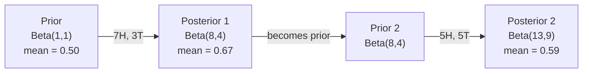

# Bayes' Theorem / 贝叶斯定理

> 概率关心你原本期待什么。Bayes' theorem 关心你看到证据后学到了什么。

**类型：** 构建
**语言：** Python
**前置要求：** Phase 1, Lesson 06 (Probability Fundamentals)
**时间：** 约 75 分钟

## Learning Objectives / 学习目标

- 应用 Bayes' theorem，根据 priors、likelihoods 和 evidence 计算 posterior probabilities
- 从零构建一个 Naive Bayes text classifier，包含 Laplace smoothing 和 log-space computation
- 比较 MLE 与 MAP estimation，并解释 MAP 如何对应 L2 regularization
- 使用 Beta-Binomial conjugate priors 实现 sequential Bayesian updating，用于 A/B testing

## The Problem / 问题

某个医学检测准确率是 99%。你的检测结果是阳性。你真正患病的概率是多少？

大多数人会说 99%。真实答案取决于这种病有多罕见。如果每 10,000 人中只有 1 人患病，那么阳性结果只意味着你约有 1% 的概率患病。其他 99% 的阳性结果，都是健康人的误报。

这不是脑筋急转弯。这是 Bayes' theorem。每个 spam filter、每个 medical diagnostic、每个量化不确定性的 machine learning model，都在使用同一种推理。先有一个信念，看到证据，然后更新信念。

如果你构建 ML 系统却不理解这一点，就会误读模型输出、设置糟糕阈值，并交付过度自信的预测。

## The Concept / 概念

### From joint probability to Bayes / 从联合概率到 Bayes

你已经在 Lesson 06 学过 conditional probability：

```
P(A|B) = P(A and B) / P(B)
```

对称地：

```
P(B|A) = P(A and B) / P(A)
```

两个表达式共享同一个分子：P(A and B)。令它们相等并重新整理：

```
P(A and B) = P(A|B) * P(B) = P(B|A) * P(A)

Therefore:

P(A|B) = P(B|A) * P(A) / P(B)
```

这就是 Bayes' theorem。四个量，一个公式。

### The four parts / 四个部分

| Part | Name | What it means |
|------|------|---------------|
| P(A\|B) | Posterior | 看到 evidence B 后，你对 A 的更新后信念 |
| P(B\|A) | Likelihood | 如果 A 为真，evidence B 出现的概率 |
| P(A) | Prior | 看到任何 evidence 前，你对 A 的信念 |
| P(B) | Evidence | 在所有可能性下看到 B 的总概率 |

Evidence 项 P(B) 起到归一化作用。你可以用 total probability law 展开它：

```
P(B) = P(B|A) * P(A) + P(B|not A) * P(not A)
```

### Medical test example / 医学检测示例

一种疾病影响每 10,000 人中的 1 人。检测准确率是 99%（能抓住 99% 的病人，健康人中有 1% 会误报阳性）。

```
P(sick)          = 0.0001     (prior: disease is rare)
P(positive|sick) = 0.99       (likelihood: test catches it)
P(positive|healthy) = 0.01    (false positive rate)

P(positive) = P(positive|sick) * P(sick) + P(positive|healthy) * P(healthy)
            = 0.99 * 0.0001 + 0.01 * 0.9999
            = 0.000099 + 0.009999
            = 0.010098

P(sick|positive) = P(positive|sick) * P(sick) / P(positive)
                 = 0.99 * 0.0001 / 0.010098
                 = 0.0098
                 = 0.98%
```

不到 1%。Prior 占主导。当某种情况很罕见时，即便测试准确，大多数阳性结果也可能是假阳性。这就是医生会要求复查的原因。

### Spam filter example / 垃圾邮件过滤示例

你收到一封包含 "lottery" 的邮件。它是 spam 吗？

```
P(spam)                = 0.3      (30% of email is spam)
P("lottery"|spam)      = 0.05     (5% of spam emails contain "lottery")
P("lottery"|not spam)  = 0.001    (0.1% of legitimate emails contain "lottery")

P("lottery") = 0.05 * 0.3 + 0.001 * 0.7
             = 0.015 + 0.0007
             = 0.0157

P(spam|"lottery") = 0.05 * 0.3 / 0.0157
                  = 0.955
                  = 95.5%
```

一个词就把概率从 30% 推到了 95.5%。真实 spam filter 会同时对数百个词应用 Bayes。

### Naive Bayes: independence assumption / Naive Bayes：独立性假设

Naive Bayes 通过假设所有 features 在给定 class 后条件独立，把这个推理扩展到多个 features：

```
P(class | feature_1, feature_2, ..., feature_n)
  = P(class) * P(feature_1|class) * P(feature_2|class) * ... * P(feature_n|class)
    / P(feature_1, feature_2, ..., feature_n)
```

"Naive" 指的就是这个 independence assumption。在文本中，词出现并不独立，例如 "New" 和 "York" 强相关。但这个假设在实践中 surprisingly well，因为 classifier 只需要给 classes 排序，不一定要产出校准良好的概率。

由于 denominator 对所有 classes 都相同，你可以跳过它，只比较 numerators：

```
score(class) = P(class) * product of P(feature_i | class)
```

选择 score 最高的 class。

### Maximum likelihood estimation (MLE) / 最大似然估计（MLE）

如何从训练数据得到 P(feature|class)？计数。

```
P("free"|spam) = (number of spam emails containing "free") / (total spam emails)
```

这就是 MLE：选择让观测数据最可能出现的参数值。你在最大化 likelihood function；对离散计数来说，它会退化成相对频率。

问题是：如果某个词在训练时从未出现在 spam 中，MLE 会给它概率零。一个没见过的词会让整个乘积归零。用 Laplace smoothing 修复：

```
P(word|class) = (count(word, class) + 1) / (total_words_in_class + vocabulary_size)
```

给每个 count 加 1，确保没有概率会变成零。

### Maximum a posteriori (MAP) / 最大后验估计（MAP）

MLE 问的是：什么参数能最大化 P(data|parameters)？

MAP 问的是：什么参数能最大化 P(parameters|data)？

根据 Bayes' theorem：

```
P(parameters|data) proportional to P(data|parameters) * P(parameters)
```

MAP 会为参数本身添加一个 prior。如果你相信参数应该很小，就把这种信念编码成惩罚大参数的 prior。这与 ML 中的 L2 regularization 完全相同。Ridge regression 中的 "ridge" penalty，本质上就是 weights 上的 Gaussian prior。

| Estimation | Optimizes | ML equivalent |
|------------|-----------|---------------|
| MLE | P(data\|params) | Unregularized training |
| MAP | P(data\|params) * P(params) | L2 / L1 regularization |

### Bayesian vs frequentist: the practical difference / Bayesian 与 frequentist：实践差异

Frequentists 把参数看作固定但未知的量。他们问：“如果我重复这个实验很多次，会发生什么？”

Bayesians 把参数看作 distributions。他们问：“根据我已经观察到的东西，我现在应该如何相信这些参数？”

对构建 ML 系统来说，实际差别如下：

| Aspect | Frequentist | Bayesian |
|--------|-------------|----------|
| Output | Point estimate | Distribution over values |
| Uncertainty | Confidence intervals（关于 procedure） | Credible intervals（关于 parameter） |
| Small data | 可能 overfit | Prior 起到 regularization 作用 |
| Computation | 通常更快 | 通常需要 sampling（MCMC） |

大多数生产 ML 是 frequentist 的，例如 SGD 和 point estimates。Bayesian methods 在需要校准不确定性时尤其有用，例如医学决策、安全关键系统；也适合数据稀缺场景，例如 few-shot learning 和 cold start。

### Why Bayesian thinking matters for ML / 为什么 Bayesian thinking 对 ML 重要

这里的联系比类比更深：

**Priors are regularization。** Weights 上的 Gaussian prior 就是 L2 regularization。Laplace prior 就是 L1。每次你添加 regularization term，都是在做一个 Bayesian statement：你预期参数值应该是什么样。

**Posteriors are uncertainty。** 单个 predicted probability 并不会告诉你模型对这个估计有多自信。Bayesian methods 会给你一个 distribution：“我认为 P(spam) 在 0.8 到 0.95 之间。”

**Bayes updates are online learning。** 今天的 posterior 会成为明天的 prior。当模型看到新数据时，它可以增量更新信念，而不必从头训练。

**Model comparison is Bayesian。** Bayesian information criterion（BIC）、marginal likelihood 和 Bayes factors 都使用 Bayesian reasoning，在避免 overfitting 的同时选择模型。

```figure
bayes-update
```

## Build It / 动手构建

### Step 1: Bayes theorem function / 第 1 步：Bayes theorem function

```python
def bayes(prior, likelihood, false_positive_rate):
    evidence = likelihood * prior + false_positive_rate * (1 - prior)
    posterior = likelihood * prior / evidence
    return posterior

result = bayes(prior=0.0001, likelihood=0.99, false_positive_rate=0.01)
print(f"P(sick|positive) = {result:.4f}")
```

### Step 2: Naive Bayes classifier / 第 2 步：Naive Bayes classifier

```python
import math
from collections import defaultdict

class NaiveBayes:
    def __init__(self, smoothing=1.0):
        self.smoothing = smoothing
        self.class_counts = defaultdict(int)
        self.word_counts = defaultdict(lambda: defaultdict(int))
        self.class_word_totals = defaultdict(int)
        self.vocab = set()

    def train(self, documents, labels):
        for doc, label in zip(documents, labels):
            self.class_counts[label] += 1
            words = doc.lower().split()
            for word in words:
                self.word_counts[label][word] += 1
                self.class_word_totals[label] += 1
                self.vocab.add(word)

    def predict(self, document):
        words = document.lower().split()
        total_docs = sum(self.class_counts.values())
        vocab_size = len(self.vocab)
        best_class = None
        best_score = float("-inf")
        for cls in self.class_counts:
            score = math.log(self.class_counts[cls] / total_docs)
            for word in words:
                count = self.word_counts[cls].get(word, 0)
                total = self.class_word_totals[cls]
                score += math.log((count + self.smoothing) / (total + self.smoothing * vocab_size))
            if score > best_score:
                best_score = score
                best_class = cls
        return best_class
```

Log probabilities 可以防止 underflow。相乘很多很小的概率，会产生浮点数无法表示的小值。求 log-probabilities 之和在数值上稳定，并且数学上等价。

### Step 3: Train on spam data / 第 3 步：在 spam 数据上训练

```python
train_docs = [
    "win free money now",
    "free lottery ticket winner",
    "claim your prize today free",
    "urgent offer free cash",
    "congratulations you won free",
    "meeting tomorrow at noon",
    "project update attached",
    "can we schedule a call",
    "quarterly report review",
    "lunch on thursday sounds good",
    "team standup notes attached",
    "please review the pull request",
]

train_labels = [
    "spam", "spam", "spam", "spam", "spam",
    "ham", "ham", "ham", "ham", "ham", "ham", "ham",
]

classifier = NaiveBayes()
classifier.train(train_docs, train_labels)

test_messages = [
    "free money waiting for you",
    "meeting rescheduled to friday",
    "you won a free prize",
    "please review the attached report",
]

for msg in test_messages:
    print(f"  '{msg}' -> {classifier.predict(msg)}")
```

### Step 4: Inspect the learned probabilities / 第 4 步：检查学到的概率

```python
def show_top_words(classifier, cls, n=5):
    vocab_size = len(classifier.vocab)
    total = classifier.class_word_totals[cls]
    probs = {}
    for word in classifier.vocab:
        count = classifier.word_counts[cls].get(word, 0)
        probs[word] = (count + classifier.smoothing) / (total + classifier.smoothing * vocab_size)
    sorted_words = sorted(probs.items(), key=lambda x: x[1], reverse=True)
    for word, prob in sorted_words[:n]:
        print(f"    {word}: {prob:.4f}")

print("\nTop spam words:")
show_top_words(classifier, "spam")
print("\nTop ham words:")
show_top_words(classifier, "ham")
```

## Use It / 应用它

Scikit-learn 提供了 production-ready naive Bayes implementations：

```python
from sklearn.feature_extraction.text import CountVectorizer
from sklearn.naive_bayes import MultinomialNB
from sklearn.metrics import classification_report

vectorizer = CountVectorizer()
X_train = vectorizer.fit_transform(train_docs)
clf = MultinomialNB()
clf.fit(X_train, train_labels)

X_test = vectorizer.transform(test_messages)
predictions = clf.predict(X_test)
for msg, pred in zip(test_messages, predictions):
    print(f"  '{msg}' -> {pred}")
```

同一个算法。CountVectorizer 处理 tokenization 和 vocabulary building。MultinomialNB 内部处理 smoothing 和 log-probabilities。你的 from-scratch 版本用 40 行做了同样的事。

## Ship It / 交付它

这里构建的 NaiveBayes class 展示了完整 pipeline：tokenization、带 Laplace smoothing 的 probability estimation、log-space prediction。`code/bayes.py` 中的代码可以端到端运行，除了 Python standard library 没有其他依赖。

### Conjugate Priors / 共轭先验

当 prior 和 posterior 属于同一族 distributions 时，这个 prior 称为 "conjugate"。这让 Bayesian updating 在代数上非常干净：你可以得到 closed-form posterior，不需要 numerical integration。

| Likelihood | Conjugate Prior | Posterior | Example |
|-----------|----------------|-----------|---------|
| Bernoulli | Beta(a, b) | Beta(a + successes, b + failures) | Coin flip bias estimation |
| Normal (known variance) | Normal(mu_0, sigma_0) | Normal(weighted mean, smaller variance) | Sensor calibration |
| Poisson | Gamma(a, b) | Gamma(a + sum of counts, b + n) | Modeling arrival rates |
| Multinomial | Dirichlet(alpha) | Dirichlet(alpha + counts) | Topic modeling, language models |

为什么重要：没有 conjugate priors 时，你需要用 Monte Carlo sampling 或 variational inference 来近似 posterior。有了 conjugate priors，你只需要更新两个数。

Beta distribution 是实践中最常见的 conjugate prior。Beta(a, b) 表示你对一个概率参数的信念。它的 mean 是 a/(a+b)。a+b 越大，distribution 越集中，也就是越有信心。

Beta prior 的特殊情况：
- Beta(1, 1) = uniform。你对这个参数没有意见。
- Beta(10, 10) = 在 0.5 附近有峰。你强烈相信参数接近 0.5。
- Beta(1, 10) = 偏向 0。你相信参数较小。

更新规则非常简单：

```
Prior:     Beta(a, b)
Data:      s successes, f failures
Posterior: Beta(a + s, b + f)
```

没有积分，没有采样，只有加法。

### Sequential Bayesian Updating / 顺序 Bayesian 更新

Bayesian inference 天然是顺序式的。今天的 posterior 会成为明天的 prior。这是真实系统在不重新处理所有历史数据的情况下增量学习的方式。

具体例子：估计一枚硬币是否公平。

**Day 1：还没有数据。**
从 Beta(1, 1) 开始，也就是 uniform prior。你没有明确观点。
- Prior mean: 0.5
- Prior 在 [0, 1] 上是平坦的

**Day 2：观察到 7 次正面、3 次反面。**
Posterior = Beta(1 + 7, 1 + 3) = Beta(8, 4)
- Posterior mean: 8/12 = 0.667
- Evidence 暗示硬币偏向正面

**Day 3：又观察到 5 次正面、5 次反面。**
把昨天的 posterior 作为今天的 prior。
Posterior = Beta(8 + 5, 4 + 5) = Beta(13, 9)
- Posterior mean: 13/22 = 0.591
- 新的均衡数据把估计拉回 0.5 附近



观测顺序不重要。Beta(1,1) 一次性用全部 12 次正面、8 次反面更新，也会得到 Beta(13, 9)，结果相同。Sequential updating 和 batch updating 在数学上等价。但 sequential updating 让你可以在每一步做决策，而不必保存原始数据。

这是 production ML systems 中 online learning 的基础。Bandits 中的 Thompson sampling、增量推荐系统和 streaming anomaly detectors 都使用这种模式。

### Connection to A/B Testing / 与 A/B Testing 的连接

A/B testing 本质上就是伪装过的 Bayesian inference。

设定：你在测试两种按钮颜色。Variant A（blue）和 variant B（green）。你想知道哪个获得更多 clicks。

Bayesian A/B test：

1. **Prior。** 两个 variants 都从 Beta(1, 1) 开始。没有 prior preference。
2. **Data。** Variant A：1000 次展示中 50 次点击。Variant B：1000 次展示中 65 次点击。
3. **Posteriors。**
   - A: Beta(1 + 50, 1 + 950) = Beta(51, 951)。Mean = 0.051
   - B: Beta(1 + 65, 1 + 935) = Beta(66, 936)。Mean = 0.066
4. **Decision。** 计算 P(B > A)，也就是 B 的真实 conversion rate 高于 A 的概率。

解析计算 P(B > A) 很难。但 Monte Carlo 让它变得直接：

```
1. Draw 100,000 samples from Beta(51, 951)  -> samples_A
2. Draw 100,000 samples from Beta(66, 936)  -> samples_B
3. P(B > A) = fraction of samples where B > A
```

如果 P(B > A) > 0.95，就发布 variant B。如果它在 0.05 和 0.95 之间，就继续收集数据。如果 P(B > A) < 0.05，就发布 variant A。

相比 frequentist A/B testing 的优势：
- 你得到的是直接概率陈述：“B 有 97% 的概率更好”
- 没有 p-value 混淆。没有 “fail to reject the null hypothesis” 这种绕口表达。
- 可以随时查看结果，而不会抬高 false positive rates，也就是没有 "peeking problem"
- 可以纳入 prior knowledge，例如之前测试表明 conversion rates 通常在 3-8%

| Aspect | Frequentist A/B | Bayesian A/B |
|--------|----------------|--------------|
| Output | p-value | P(B > A) |
| Interpretation | “如果 A=B，这份数据有多惊讶？” | “B 比 A 更好的可能性有多大？” |
| Early stopping | 会抬高 false positives | 任何时刻都安全（前提是 prior 选择合理且模型设定正确） |
| Prior knowledge | 不使用 | 编码为 Beta prior |
| Decision rule | p < 0.05 | P(B > A) > threshold |

## Exercises / 练习

1. **Multiple tests。** 一个病人在两次独立检测中都呈阳性（两次检测都 99% 准确，疾病 prevalence 为 1 in 10,000）。两次检测后 P(sick) 是多少？把第一次检测后的 posterior 作为第二次检测的 prior。

2. **Smoothing impact。** 用 smoothing values 0.01、0.1、1.0 和 10.0 运行 spam classifier。Top word probabilities 会如何变化？当 smoothing=0 且某个词只出现在 ham 中时，会发生什么？

3. **Add features。** 扩展 NaiveBayes class，让它在 word counts 之外也使用 message length（short/long）作为 feature。从训练数据估计 P(short|spam) 和 P(short|ham)，并把它纳入 prediction score。

4. **MAP by hand。** 给定观测数据（10 次抛硬币中 7 次正面），使用 Beta(2,2) prior 计算 bias 的 MAP estimate。把它与 MLE estimate（7/10）对比。

## Key Terms / 关键术语

| 术语 | 常见说法 | 实际含义 |
|------|----------------|----------------------|
| Prior | “我的初始猜测” | 观察 evidence 前的 P(hypothesis)。在 ML 中就是 regularization term。 |
| Likelihood | “数据拟合得怎么样” | P(evidence\|hypothesis)。在特定 hypothesis 下，观测数据出现的概率。 |
| Posterior | “更新后的信念” | P(hypothesis\|evidence)。Prior 乘以 likelihood，再归一化。 |
| Evidence | “归一化常数” | 所有 hypotheses 下的 P(data)。确保 posterior 总和为 1。 |
| Naive Bayes | “那个简单文本分类器” | 一个假设 features 在给定 class 后相互独立的 classifier。虽然假设不真实，但效果常常不错。 |
| Laplace smoothing | “Add-one smoothing” | 给每个 feature 加一个小 count，防止未见数据造成 zero probabilities。 |
| MLE | “直接用频率” | 选择最大化 P(data\|parameters) 的参数。没有 prior。小数据下可能 overfit。 |
| MAP | “带 prior 的 MLE” | 选择最大化 P(data\|parameters) * P(parameters) 的参数。等价于 regularized MLE。 |
| Log-probability | “在 log space 工作” | 使用 log(P) 而不是 P，避免许多小数相乘时 floating-point underflow。 |
| False positive | “误报” | 测试显示 positive，但真实状态是 negative。它会驱动 base rate fallacy。 |

## Further Reading / 延伸阅读

- [3Blue1Brown: Bayes' theorem](https://www.youtube.com/watch?v=HZGCoVF3YvM) - 用医学检测示例做可视化解释
- [Stanford CS229: Generative Learning Algorithms](https://cs229.stanford.edu/notes2022fall/cs229-notes2.pdf) - naive Bayes 及其与 discriminative models 的关系
- [Think Bayes](https://greenteapress.com/wp/think-bayes/) - 免费书，带 Python code 的 Bayesian statistics
- [scikit-learn Naive Bayes](https://scikit-learn.org/stable/modules/naive_bayes.html) - 生产实现以及何时使用不同 variant
