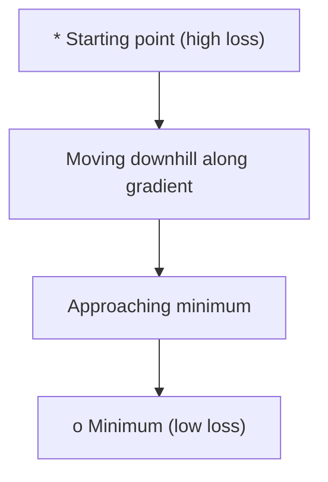
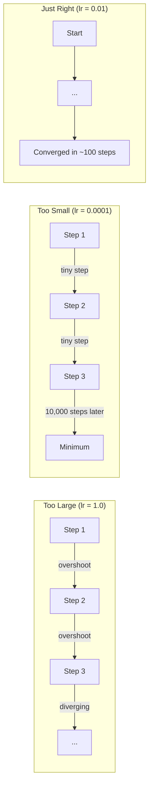
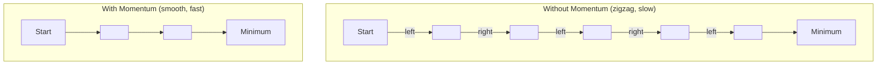
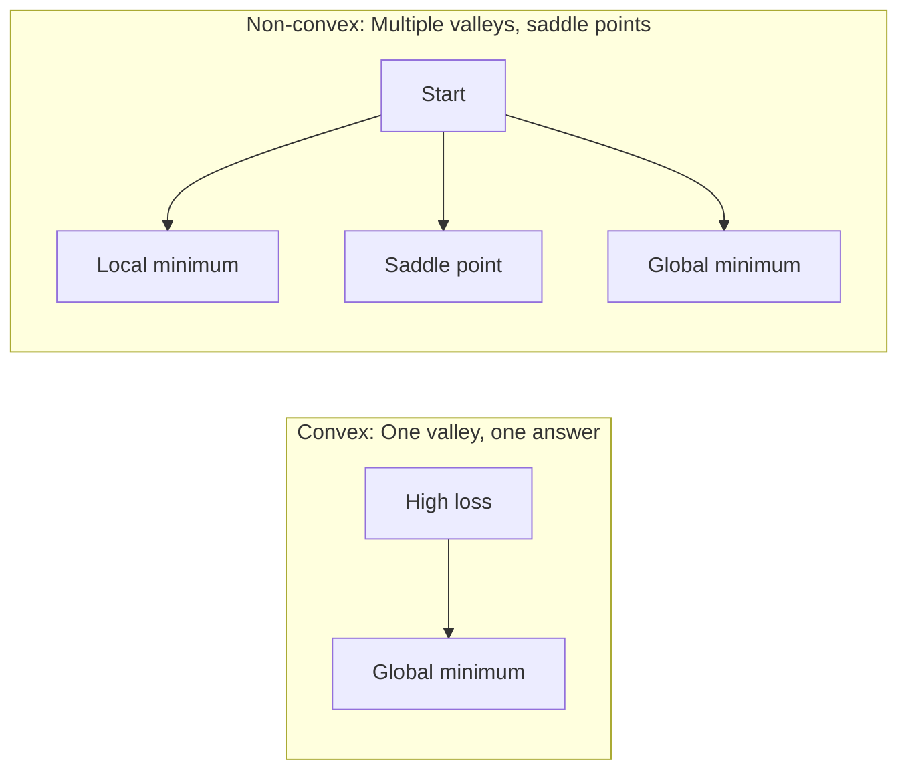
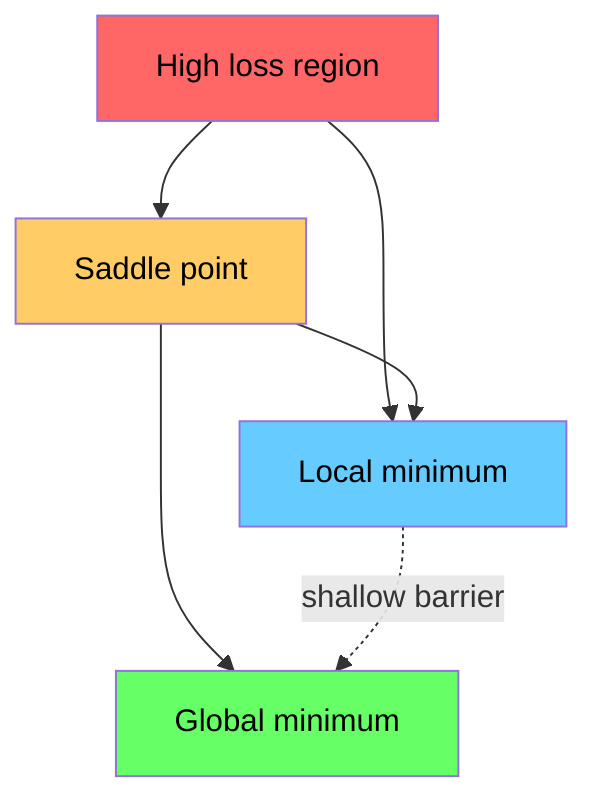

# Optimization / 优化

> 训练神经网络，本质上就是寻找山谷最低点。

**类型：** 构建
**语言：** Python
**前置要求：** Phase 1, Lessons 04-05 (Derivatives, Gradients)
**时间：** 约 75 分钟

## Learning Objectives / 学习目标

- 从零实现 vanilla gradient descent、带 momentum 的 SGD 和 Adam
- 在 Rosenbrock function 上比较 optimizer convergence，并解释为什么 Adam 会为每个 weight 自适应 learning rate
- 区分 convex 与 non-convex loss landscapes，并解释 saddle points 在高维中的作用
- 配置 learning rate schedules（step decay、cosine annealing、warmup）来提高训练稳定性

## The Problem / 问题

你有一个 loss function。它告诉你模型错得有多离谱。你有 gradients。它们告诉你哪个方向会让 loss 变得更糟。现在你需要一个向下走的策略。

最朴素的方法很简单：沿 gradient 的反方向移动。用一个叫 learning rate 的数字缩放步长。重复。这就是 gradient descent，而且它确实有效。但“有效”有前提。Learning rate 太大，你会直接越过山谷，在两侧来回弹跳。太小，你会用成千上万步慢慢爬向答案。碰到 saddle point 时，你可能停止移动，但还没有找到 minimum。

Deep learning 中的每个 optimizer 都是在回答同一个问题：怎样更快、更可靠地走到山谷底部？

## The Concept / 概念

### What optimization means / 优化是什么意思

Optimization 是寻找让函数最小（或最大）的输入值。在 machine learning 中，这个函数是 loss。输入是模型的 weights。Training 就是 optimization。

```
minimize L(w) where:
  L = loss function
  w = model weights (could be millions of parameters)
```

### Gradient descent (vanilla) / 梯度下降（vanilla）

最简单的 optimizer。计算 loss 对每个 weight 的 gradient。让每个 weight 朝其 gradient 的反方向移动，并用 learning rate 缩放步长。

```
w = w - lr * gradient
```

这就是完整算法。只有一行。



### Learning rate: the most important hyperparameter / Learning rate：最重要的超参数

Learning rate 控制步长。它决定了 convergence 的一切。



没有公式可以直接给出正确 learning rate。你需要通过实验找到它。常见起点：Adam 用 0.001，带 momentum 的 SGD 用 0.01。

### SGD vs batch vs mini-batch / SGD、batch 与 mini-batch

Vanilla gradient descent 会在整个 dataset 上计算 gradient，然后才走一步。这叫 batch gradient descent。它稳定但慢。

Stochastic gradient descent（SGD）会在单个随机样本上计算 gradient，并立刻走一步。它噪声大但快。

Mini-batch gradient descent 介于两者之间。它在一个小 batch（32、64、128、256 个样本）上计算 gradient，然后走一步。这才是大家实际使用的做法。

| Variant | Batch size | Gradient quality | Speed per step | Noise |
|---------|-----------|-----------------|---------------|-------|
| Batch GD | Entire dataset | Exact | Slow | None |
| SGD | 1 sample | Very noisy | Fast | High |
| Mini-batch | 32-256 | Good estimate | Balanced | Moderate |

SGD 和 mini-batch 中的噪声不是 bug。它有助于逃离浅 local minima 和 saddle points。

### Momentum: the ball rolling downhill / Momentum：向下滚动的球

Vanilla gradient descent 只看当前 gradient。如果 gradient 来回 zigzag，例如在狭窄山谷中很常见，进展会很慢。Momentum 通过把过去 gradients 累积到 velocity term 中解决这个问题。

```
v = beta * v + gradient
w = w - lr * v
```

类比是一颗向下滚动的球。它不会在每个小凸起处停下再重新开始。它会在一致方向上积累速度，并抑制震荡。



`beta`（通常是 0.9）控制保留多少历史。Beta 越高，momentum 越大，路径越平滑，但对方向变化的响应也越慢。

### Adam: adaptive learning rates / Adam：自适应 learning rates

不同 weights 需要不同 learning rates。某个 weight 很少得到大 gradient，当它终于得到时应该走大步。某个 weight 经常得到巨大 gradient，就应该走小步。

Adam（Adaptive Moment Estimation）为每个 weight 跟踪两件事：

1. First moment（m）：gradients 的 running average，类似 momentum
2. Second moment（v）：squared gradients 的 running average，也就是 gradient magnitude

```
m = beta1 * m + (1 - beta1) * gradient
v = beta2 * v + (1 - beta2) * gradient^2

m_hat = m / (1 - beta1^t)    bias correction
v_hat = v / (1 - beta2^t)    bias correction

w = w - lr * m_hat / (sqrt(v_hat) + epsilon)
```

除以 `sqrt(v_hat)` 是关键洞见。Gradients 大的 weights 会除以一个大数，也就是 effective step 较小。Gradients 小的 weights 会除以一个小数，也就是 effective step 较大。每个 weight 都有自己的 adaptive learning rate。

默认 hyperparameters：`lr=0.001, beta1=0.9, beta2=0.999, epsilon=1e-8`。这些默认值对大多数问题都很好用。

### Learning rate schedules / Learning rate 调度

固定 learning rate 是一种折中。训练早期你希望步子大，快速推进；训练后期你希望步子小，在 minimum 附近精调。

常见 schedules：

| Schedule | Formula | Use case |
|----------|---------|----------|
| Step decay | lr = lr * factor every N epochs | 简单，手动控制 |
| Exponential decay | lr = lr_0 * decay^t | 平滑降低 |
| Cosine annealing | lr = lr_min + 0.5 * (lr_max - lr_min) * (1 + cos(pi * t / T)) | Transformers、modern training |
| Warmup + decay | 先线性升高，再衰减 | Large models，防止早期不稳定 |

### Convex vs non-convex / 凸与非凸

Convex function 只有一个 minimum。Gradient descent 总能找到它。像 `f(x) = x^2` 这样的二次函数就是 convex。

Neural network loss functions 是 non-convex 的。它们有许多 local minima、saddle points 和 flat regions。



实践中，高维神经网络里的 local minima 很少是主要问题。大多数 local minima 的 loss values 接近 global minimum。真正的障碍是 saddle points，也就是某些方向平坦、某些方向弯曲。Momentum 和 mini-batches 带来的噪声有助于逃离它们。

### Loss landscape visualization / Loss landscape 可视化

Loss 是所有 weights 的函数。对一个有 100 万 weights 的模型，loss landscape 存在于 1,000,001 维空间中。我们通常通过在 weight space 中选择两个随机方向，然后沿这些方向绘制 loss 来可视化它，得到一个 2D surface。



Sharp minima 泛化较差。Flat minima 泛化更好。这也是 SGD with momentum 在最终 test accuracy 上常常优于 Adam 的原因之一：它的噪声会防止模型落入 sharp minima。

```figure
gradient-descent
```

## Build It / 动手构建

### Step 1: Define a test function / 第 1 步：定义测试函数

Rosenbrock function 是经典 optimization benchmark。它的 minimum 在 (1, 1)，位于一个狭窄弯曲的山谷里；这个谷容易找到，但很难沿着走。

```
f(x, y) = (1 - x)^2 + 100 * (y - x^2)^2
```

```python
def rosenbrock(params):
    x, y = params
    return (1 - x) ** 2 + 100 * (y - x ** 2) ** 2

def rosenbrock_gradient(params):
    x, y = params
    df_dx = -2 * (1 - x) + 200 * (y - x ** 2) * (-2 * x)
    df_dy = 200 * (y - x ** 2)
    return [df_dx, df_dy]
```

### Step 2: Vanilla gradient descent / 第 2 步：Vanilla gradient descent

```python
class GradientDescent:
    def __init__(self, lr=0.001):
        self.lr = lr

    def step(self, params, grads):
        return [p - self.lr * g for p, g in zip(params, grads)]
```

### Step 3: SGD with momentum / 第 3 步：带 momentum 的 SGD

```python
class SGDMomentum:
    def __init__(self, lr=0.001, momentum=0.9):
        self.lr = lr
        self.momentum = momentum
        self.velocity = None

    def step(self, params, grads):
        if self.velocity is None:
            self.velocity = [0.0] * len(params)
        self.velocity = [
            self.momentum * v + g
            for v, g in zip(self.velocity, grads)
        ]
        return [p - self.lr * v for p, v in zip(params, self.velocity)]
```

### Step 4: Adam / 第 4 步：Adam

```python
class Adam:
    def __init__(self, lr=0.001, beta1=0.9, beta2=0.999, epsilon=1e-8):
        self.lr = lr
        self.beta1 = beta1
        self.beta2 = beta2
        self.epsilon = epsilon
        self.m = None
        self.v = None
        self.t = 0

    def step(self, params, grads):
        if self.m is None:
            self.m = [0.0] * len(params)
            self.v = [0.0] * len(params)

        self.t += 1

        self.m = [
            self.beta1 * m + (1 - self.beta1) * g
            for m, g in zip(self.m, grads)
        ]
        self.v = [
            self.beta2 * v + (1 - self.beta2) * g ** 2
            for v, g in zip(self.v, grads)
        ]

        m_hat = [m / (1 - self.beta1 ** self.t) for m in self.m]
        v_hat = [v / (1 - self.beta2 ** self.t) for v in self.v]

        return [
            p - self.lr * mh / (vh ** 0.5 + self.epsilon)
            for p, mh, vh in zip(params, m_hat, v_hat)
        ]
```

### Step 5: Run and compare / 第 5 步：运行并比较

```python
def optimize(optimizer, func, grad_func, start, steps=5000):
    params = list(start)
    history = [params[:]]
    for _ in range(steps):
        grads = grad_func(params)
        params = optimizer.step(params, grads)
        history.append(params[:])
    return history

start = [-1.0, 1.0]

gd_history = optimize(GradientDescent(lr=0.0005), rosenbrock, rosenbrock_gradient, start)
sgd_history = optimize(SGDMomentum(lr=0.0001, momentum=0.9), rosenbrock, rosenbrock_gradient, start)
adam_history = optimize(Adam(lr=0.01), rosenbrock, rosenbrock_gradient, start)

for name, history in [("GD", gd_history), ("SGD+M", sgd_history), ("Adam", adam_history)]:
    final = history[-1]
    loss = rosenbrock(final)
    print(f"{name:6s} -> x={final[0]:.6f}, y={final[1]:.6f}, loss={loss:.8f}")
```

预期输出：Adam 收敛最快。SGD with momentum 会沿着更平滑的路径前进。Vanilla GD 会沿狭窄山谷缓慢推进。

## Use It / 应用它

实践中使用 PyTorch 或 JAX optimizers。它们会处理 parameter groups、weight decay、gradient clipping 和 GPU acceleration。

```python
import torch

model = torch.nn.Linear(784, 10)

sgd = torch.optim.SGD(model.parameters(), lr=0.01, momentum=0.9)
adam = torch.optim.Adam(model.parameters(), lr=0.001)
adamw = torch.optim.AdamW(model.parameters(), lr=0.001, weight_decay=0.01)

scheduler = torch.optim.lr_scheduler.CosineAnnealingLR(adam, T_max=100)
```

经验规则：

- 从 Adam（lr=0.001）开始。它对大多数问题无需太多调参就能工作。
- 当你需要最好的最终 accuracy，并且能承受更多调参成本时，切换到 SGD with momentum（lr=0.01, momentum=0.9）。
- 对 transformers 使用 AdamW，也就是 Adam with decoupled weight decay。
- 训练超过几个 epochs 时，始终使用 learning rate schedule。
- 如果训练不稳定，降低 learning rate。如果训练太慢，提高它。

## Ship It / 交付它

本课产出一个用于选择合适 optimizer 的 prompt。见 `outputs/prompt-optimizer-guide.md`。

这里构建的 optimizer classes 会在 Phase 3 训练 from-scratch neural network 时再次出现。

## Exercises / 练习

1. **Learning rate sweep。** 在 Rosenbrock function 上用 learning rates [0.0001, 0.0005, 0.001, 0.005, 0.01] 运行 vanilla gradient descent。绘制或打印 5000 steps 后的 final loss。找出仍能收敛的最大 learning rate。

2. **Momentum comparison。** 在 Rosenbrock function 上运行 momentum values [0.0, 0.5, 0.9, 0.99] 的 SGD with momentum。跟踪每一步的 loss。哪个 momentum value 收敛最快？哪个会 overshoot？

3. **Saddle point escape。** 定义函数 `f(x, y) = x^2 - y^2`，它在原点有一个 saddle point。从 (0.01, 0.01) 开始。比较 vanilla GD、SGD with momentum 和 Adam 的表现。哪个会逃离 saddle point？

4. **Implement learning rate decay。** 给 GradientDescent class 添加 exponential decay schedule：`lr = lr_0 * 0.999^step`。比较 Rosenbrock function 上有无 decay 的 convergence。

## Key Terms / 关键术语

| 术语 | 常见说法 | 实际含义 |
|------|----------------|----------------------|
| Gradient descent | “往下坡走” | 用 learning rate 缩放 gradient，并从 weights 中减去它。最基础的 optimizer。 |
| Learning rate | “步长” | 控制每次 update 会让 weights 移动多远的标量。太大会 divergence，太小会浪费 compute。 |
| Momentum | “保持滚动” | 把过去 gradients 累积进 velocity vector。抑制震荡，并在一致方向上加速移动。 |
| SGD | “随机采样” | Stochastic gradient descent。用随机子集而不是完整 dataset 计算 gradient。实践中几乎总是指 mini-batch SGD。 |
| Mini-batch | “一小块数据” | 用于估计 gradient 的一小部分训练数据（32-256 samples）。平衡速度和 gradient accuracy。 |
| Adam | “默认 optimizer” | Adaptive Moment Estimation。跟踪每个 weight 的 gradients 和 squared gradients 的 running averages，让每个 weight 有自己的 learning rate。 |
| Bias correction | “修正冷启动” | Adam 的 first 和 second moments 初始化为零。Bias correction 会除以 (1 - beta^t)，补偿早期 steps。 |
| Learning rate schedule | “随时间改变 lr” | 训练期间调整 learning rate 的函数。早期大步，后期小步。 |
| Convex function | “一个山谷” | 任意 local minimum 都是 global minimum 的函数。Gradient descent 总能找到它。Neural network losses 不是 convex。 |
| Saddle point | “平坦但不是最低点” | Gradient 为零，但某些方向是 minimum、另一些方向是 maximum 的点。高维中很常见。 |
| Loss landscape | “地形” | 在 weight space 上绘制的 loss function。通常沿两个随机方向切片可视化。 |
| Convergence | “到达了” | Optimizer 到达某一点，后续 steps 不再显著降低 loss。 |

## Further Reading / 延伸阅读

- [Sebastian Ruder: An overview of gradient descent optimization algorithms](https://ruder.io/optimizing-gradient-descent/) - 主要 optimizers 的综合综述
- [Why Momentum Really Works (Distill)](https://distill.pub/2017/momentum/) - momentum dynamics 的交互式可视化
- [Adam: A Method for Stochastic Optimization (Kingma & Ba, 2014)](https://arxiv.org/abs/1412.6980) - Adam 原始论文，短而可读
- [Visualizing the Loss Landscape of Neural Nets (Li et al., 2018)](https://arxiv.org/abs/1712.09913) - 展示 sharp vs flat minima 的论文
