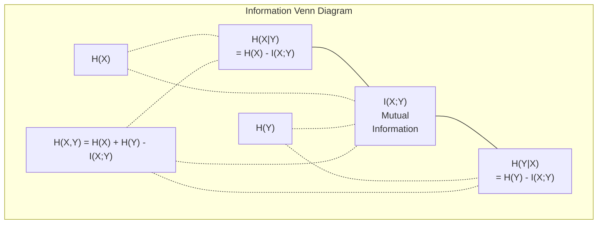

# Information Theory / 信息论

> 信息论衡量惊讶程度。Loss functions 就建立在它之上。

**类型：** 学习
**语言：** Python
**前置要求：** Phase 1, Lesson 06 (Probability)
**时间：** 约 60 分钟

## Learning Objectives / 学习目标

- 从零计算 entropy、cross-entropy 和 KL divergence，并解释它们之间的关系
- 推导为什么最小化 cross-entropy loss 等价于最大化 log-likelihood
- 计算 features 与 target 之间的 mutual information，用来排序 feature importance
- 解释 perplexity：它是 language model 平均要在多少个有效词表选项中做选择

## The Problem / 问题

你训练每个 classification model 时都会调用 `CrossEntropyLoss()`。你在每篇 language model paper 中都会看到 "perplexity"。你在 VAEs、distillation 和 RLHF 中会读到 KL divergence。这些概念并不分散。它们都是同一个思想的不同外壳。

信息论给你一套语言，用来推理 uncertainty、compression 和 prediction。Claude Shannon 在 1948 年发明它，是为了解决通信问题。结果证明，训练神经网络也是一个通信问题：模型试图通过 learned weights 这条 noisy channel 传递正确 label。

本课会从零构建每个公式，让你看见它们从哪里来，以及为什么有效。

## The Concept / 概念

### Information Content (Surprise) / 信息量（惊讶程度）

越不可能发生的事情，包含的信息越多。硬币正面朝上？不意外。彩票中奖？非常意外。

概率为 p 的事件，其 information content 是：

```
I(x) = -log(p(x))
```

使用以 2 为底的 log，单位是 bits。使用 natural log，单位是 nats。思想相同，单位不同。

```
Event              Probability    Surprise (bits)
Fair coin heads    0.5            1.0
Rolling a 6        0.167          2.58
1-in-1000 event    0.001          9.97
Certain event      1.0            0.0
```

确定事件携带 0 信息。因为你本来就知道它会发生。

### Entropy (Average Surprise) / 熵（平均惊讶程度）

Entropy 是一个 distribution 所有可能结果的 expected surprise。

```
H(P) = -sum( p(x) * log(p(x)) )  for all x
```

对 binary variable 来说，公平硬币有最大 entropy：1 bit。偏置硬币（99% 正面）的 entropy 很低：0.08 bits。你几乎已经知道会发生什么，所以每次抛硬币几乎不会告诉你新信息。

```
Fair coin:    H = -(0.5 * log2(0.5) + 0.5 * log2(0.5)) = 1.0 bit
Biased coin:  H = -(0.99 * log2(0.99) + 0.01 * log2(0.01)) = 0.08 bits
```

Entropy 衡量一个 distribution 中不可约的不确定性。你无法压缩到比它更低。

### Cross-Entropy (The Loss Function You Use Every Day) / 交叉熵（你每天都在用的 Loss Function）

Cross-entropy 衡量的是：当真实事件来自 distribution P，却用 distribution Q 去编码时，平均会有多惊讶。

```
H(P, Q) = -sum( p(x) * log(q(x)) )  for all x
```

P 是 true distribution，也就是 labels。Q 是模型预测。如果 Q 完美匹配 P，cross-entropy 就等于 entropy。任何不匹配都会让它变大。

在 classification 中，P 是 one-hot vector，也就是真实 class 概率为 1，其他全为 0。此时 cross-entropy 简化为：

```
H(P, Q) = -log(q(true_class))
```

这就是 classification 中完整的 cross-entropy loss 公式。最大化正确类别的预测概率。

### KL Divergence (Distance Between Distributions) / KL 散度（分布之间的差异）

KL divergence 衡量的是：使用 Q 而不是 P 会带来多少额外惊讶。

```
D_KL(P || Q) = sum( p(x) * log(p(x) / q(x)) )  for all x
             = H(P, Q) - H(P)
```

Cross-entropy 等于 entropy 加 KL divergence。由于 true distribution 的 entropy 在训练期间是常数，最小化 cross-entropy 等价于最小化 KL divergence。你在把模型 distribution 推向 true distribution。

KL divergence 不对称：D_KL(P || Q) != D_KL(Q || P)。它不是严格意义上的距离度量。

### Mutual Information / 互信息

Mutual information 衡量的是：知道一个变量后，你能获得多少关于另一个变量的信息。

```
I(X; Y) = H(X) - H(X|Y)
        = H(X) + H(Y) - H(X, Y)
```

如果 X 和 Y 独立，mutual information 为零。知道一个并不会告诉你另一个的任何信息。如果它们完全相关，mutual information 等于任一变量的 entropy。

在 feature selection 中，feature 与 target 之间的 mutual information 越高，说明这个 feature 越有用。Mutual information 低，则说明它更像噪声。

### Conditional Entropy / 条件熵

H(Y|X) 衡量的是观察到 X 之后，关于 Y 还剩多少不确定性。

```
H(Y|X) = H(X,Y) - H(X)
```

两个极端：
- 如果 X 完全决定 Y，那么 H(Y|X) = 0。知道 X 会消除关于 Y 的所有不确定性。例如：X = 摄氏温度，Y = 华氏温度。
- 如果 X 对 Y 没有任何信息，那么 H(Y|X) = H(Y)。知道 X 不会减少任何不确定性。例如：X = 抛硬币，Y = 明天天气。

Conditional entropy 永远非负，且不会超过 H(Y)：

```
0 <= H(Y|X) <= H(Y)
```

在 machine learning 中，conditional entropy 会出现在 decision trees 里。每次 split 时，算法会选择让 H(Y|X) 最小的 feature X，也就是最大程度消除 label Y 不确定性的 feature。

### Joint Entropy / 联合熵

H(X,Y) 是 X 和 Y 联合分布的 entropy。

```
H(X,Y) = -sum sum p(x,y) * log(p(x,y))   for all x, y
```

关键性质：

```
H(X,Y) <= H(X) + H(Y)
```

当 X 和 Y 独立时取等号。如果它们共享信息，joint entropy 会小于各自 entropy 之和。“少掉”的那部分 entropy 正是 mutual information。



这些关系是：
- H(X,Y) = H(X) + H(Y|X) = H(Y) + H(X|Y)
- I(X;Y) = H(X) - H(X|Y) = H(Y) - H(Y|X)
- H(X,Y) = H(X) + H(Y) - I(X;Y)

### Mutual Information (Deep Dive) / 互信息深入理解

Mutual information I(X;Y) 量化的是，知道一个变量后能减少多少关于另一个变量的不确定性。

```
I(X;Y) = H(X) - H(X|Y)
       = H(Y) - H(Y|X)
       = H(X) + H(Y) - H(X,Y)
       = sum sum p(x,y) * log(p(x,y) / (p(x) * p(y)))
```

性质：
- I(X;Y) >= 0 始终成立。观察某个东西不会让你失去信息。
- 当且仅当 X 和 Y 独立时，I(X;Y) = 0。
- I(X;Y) = I(Y;X)。它是对称的，不像 KL divergence。
- I(X;X) = H(X)。一个变量与自身共享全部信息。

**用于 feature selection 的 mutual information。** 在 ML 中，你希望 features 对 target 有信息量。Mutual information 提供了一种有原则的 feature ranking 方式：

1. 对每个 feature X_i，计算 I(X_i; Y)，其中 Y 是 target variable。
2. 按 MI score 排序 features。
3. 保留 top k features。

它适用于 feature 和 target 之间的任意关系：linear、nonlinear、monotonic，或都不是。Correlation 只能捕捉线性关系。MI 能捕捉所有统计依赖。

| Method | Detects | Computational cost | Handles categorical? |
|--------|---------|-------------------|---------------------|
| Pearson correlation | Linear relationships | O(n) | No |
| Spearman correlation | Monotonic relationships | O(n log n) | No |
| Mutual information | Any statistical dependency | O(n log n) with binning | Yes |

### Label Smoothing and Cross-Entropy / Label smoothing 与 cross-entropy

标准 classification 使用 hard targets：[0, 0, 1, 0]。真实 class 概率为 1，其他都是 0。Label smoothing 会用 soft targets 替代它们：

```
soft_target = (1 - epsilon) * hard_target + epsilon / num_classes
```

当 epsilon = 0.1 且有 4 个 classes：
- Hard target:  [0, 0, 1, 0]
- Soft target:  [0.025, 0.025, 0.925, 0.025]

从信息论角度看，label smoothing 提高了 target distribution 的 entropy。Hard one-hot targets 的 entropy 是 0，也就是没有不确定性。Soft targets 有正 entropy。

它为什么有用：
- 防止模型把 logits 推到极端值。要在 cross-entropy 下完美匹配 one-hot target，需要无限 logits。
- 起到 regularization 作用：模型不能 100% 自信。
- 改善 calibration：predicted probabilities 更能反映真实不确定性。
- 缩小 training 和 inference behavior 之间的差距。

带 label smoothing 的 cross-entropy loss 变成：

```
L = (1 - epsilon) * CE(hard_target, prediction) + epsilon * H_uniform(prediction)
```

第二项会惩罚远离 uniform 的 predictions，也就是对 confidence 的直接 regularization。

### Why Cross-Entropy Is THE Classification Loss / 为什么 Cross-Entropy 是分类任务的核心 Loss

三个视角，得出同一个结论。

**Information theory view。** Cross-entropy 衡量的是，用模型分布而不是真实分布编码时浪费了多少 bits。最小化它，就是让模型成为现实的最高效编码器。

**Maximum likelihood view。** 对 N 个训练样本，真实类别为 y_i：

```
Likelihood     = product( q(y_i) )
Log-likelihood = sum( log(q(y_i)) )
Negative log-likelihood = -sum( log(q(y_i)) )
```

最后一行就是 cross-entropy loss。最小化 cross-entropy = 最大化训练数据在模型下的 likelihood。

**Gradient view。** Cross-entropy 对 logits 的 gradient 简单地是 predicted - true。干净、稳定、计算快。这就是它与 softmax 完美配合的原因。

### Bits vs Nats / Bits 与 Nats

唯一差异是 log base。

```
log base 2   -> bits      (information theory tradition)
log base e   -> nats      (machine learning convention)
log base 10  -> hartleys  (rarely used)
```

1 nat = 1/ln(2) bits = 1.4427 bits。PyTorch 和 TensorFlow 默认使用 natural log（nats）。

### Perplexity / 困惑度

Perplexity 是 cross-entropy 的指数。它告诉你模型相当于在多少个等可能选项之间犹豫。

```
Perplexity = 2^H(P,Q)   (if using bits)
Perplexity = e^H(P,Q)   (if using nats)
```

一个 perplexity 为 50 的 language model，平均来看就像每一步都要从 50 个可能 next tokens 中均匀选择一样困惑。越低越好。

GPT-2 在常见 benchmarks 上达到 perplexity ~30。现代模型在表示充分的领域通常能做到个位数。

```figure
entropy-kl
```

## Build It / 动手构建

### Step 1: Information content and entropy / 第 1 步：Information content 与 entropy

```python
import math

def information_content(p, base=2):
    if p <= 0 or p > 1:
        return float('inf') if p <= 0 else 0.0
    return -math.log(p) / math.log(base)

def entropy(probs, base=2):
    return sum(
        p * information_content(p, base)
        for p in probs if p > 0
    )

fair_coin = [0.5, 0.5]
biased_coin = [0.99, 0.01]
fair_die = [1/6] * 6

print(f"Fair coin entropy:   {entropy(fair_coin):.4f} bits")
print(f"Biased coin entropy: {entropy(biased_coin):.4f} bits")
print(f"Fair die entropy:    {entropy(fair_die):.4f} bits")
```

### Step 2: Cross-entropy and KL divergence / 第 2 步：Cross-entropy 与 KL divergence

```python
def cross_entropy(p, q, base=2):
    total = 0.0
    for pi, qi in zip(p, q):
        if pi > 0:
            if qi <= 0:
                return float('inf')
            total += pi * (-math.log(qi) / math.log(base))
    return total

def kl_divergence(p, q, base=2):
    return cross_entropy(p, q, base) - entropy(p, base)

true_dist = [0.7, 0.2, 0.1]
good_model = [0.6, 0.25, 0.15]
bad_model = [0.1, 0.1, 0.8]

print(f"Entropy of true dist:     {entropy(true_dist):.4f} bits")
print(f"CE (good model):          {cross_entropy(true_dist, good_model):.4f} bits")
print(f"CE (bad model):           {cross_entropy(true_dist, bad_model):.4f} bits")
print(f"KL divergence (good):     {kl_divergence(true_dist, good_model):.4f} bits")
print(f"KL divergence (bad):      {kl_divergence(true_dist, bad_model):.4f} bits")
```

### Step 3: Cross-entropy as classification loss / 第 3 步：Cross-entropy 作为 classification loss

```python
def softmax(logits):
    max_logit = max(logits)
    exps = [math.exp(z - max_logit) for z in logits]
    total = sum(exps)
    return [e / total for e in exps]

def cross_entropy_loss(true_class, logits):
    probs = softmax(logits)
    return -math.log(probs[true_class])

logits = [2.0, 1.0, 0.1]
true_class = 0

probs = softmax(logits)
loss = cross_entropy_loss(true_class, logits)

print(f"Logits:      {logits}")
print(f"Softmax:     {[f'{p:.4f}' for p in probs]}")
print(f"True class:  {true_class}")
print(f"Loss:        {loss:.4f} nats")
print(f"Perplexity:  {math.exp(loss):.2f}")
```

### Step 4: Cross-entropy equals negative log-likelihood / 第 4 步：Cross-entropy 等于 negative log-likelihood

```python
import random

random.seed(42)

n_samples = 1000
n_classes = 3
true_labels = [random.randint(0, n_classes - 1) for _ in range(n_samples)]
model_logits = [[random.gauss(0, 1) for _ in range(n_classes)] for _ in range(n_samples)]

ce_loss = sum(
    cross_entropy_loss(label, logits)
    for label, logits in zip(true_labels, model_logits)
) / n_samples

nll = -sum(
    math.log(softmax(logits)[label])
    for label, logits in zip(true_labels, model_logits)
) / n_samples

print(f"Cross-entropy loss:      {ce_loss:.6f}")
print(f"Negative log-likelihood: {nll:.6f}")
print(f"Difference:              {abs(ce_loss - nll):.2e}")
```

### Step 5: Mutual information / 第 5 步：Mutual information

```python
def mutual_information(joint_probs, base=2):
    rows = len(joint_probs)
    cols = len(joint_probs[0])

    margin_x = [sum(joint_probs[i][j] for j in range(cols)) for i in range(rows)]
    margin_y = [sum(joint_probs[i][j] for i in range(rows)) for j in range(cols)]

    mi = 0.0
    for i in range(rows):
        for j in range(cols):
            pxy = joint_probs[i][j]
            if pxy > 0:
                mi += pxy * math.log(pxy / (margin_x[i] * margin_y[j])) / math.log(base)
    return mi

independent = [[0.25, 0.25], [0.25, 0.25]]
dependent = [[0.45, 0.05], [0.05, 0.45]]

print(f"MI (independent): {mutual_information(independent):.4f} bits")
print(f"MI (dependent):   {mutual_information(dependent):.4f} bits")
```

## Use It / 应用它

下面用 NumPy 表达同样的概念，这是你在实践中会使用的方式：

```python
import numpy as np

def np_entropy(p):
    p = np.asarray(p, dtype=float)
    mask = p > 0
    result = np.zeros_like(p)
    result[mask] = p[mask] * np.log(p[mask])
    return -result.sum()

def np_cross_entropy(p, q):
    p, q = np.asarray(p, dtype=float), np.asarray(q, dtype=float)
    mask = p > 0
    return -(p[mask] * np.log(q[mask])).sum()

def np_kl_divergence(p, q):
    return np_cross_entropy(p, q) - np_entropy(p)

true = np.array([0.7, 0.2, 0.1])
pred = np.array([0.6, 0.25, 0.15])
print(f"Entropy:    {np_entropy(true):.4f} nats")
print(f"Cross-ent:  {np_cross_entropy(true, pred):.4f} nats")
print(f"KL div:     {np_kl_divergence(true, pred):.4f} nats")
```

你从零构建了 `torch.nn.CrossEntropyLoss()` 内部做的事情。现在你知道为什么训练中 loss 会下降：模型预测分布正在靠近真实分布，衡量单位是浪费掉的 nats of information。

## Ship It / 交付它

本课交付一套可复用的信息论工具：用 entropy 衡量不确定性，用 cross-entropy 训练分类器，用 KL divergence 比较分布，用 mutual information 评估 feature 与 target 的关系。

## Exercises / 练习

1. 假设英文字母均匀分布（26 个字母），计算它的 entropy。然后用真实字母频率估计 entropy。哪个更高？为什么？

2. 某模型对 true class 1 的样本输出 logits [5.0, 2.0, 0.5]。手算 cross-entropy loss，然后用你的 `cross_entropy_loss` 函数验证。什么样的 logits 会得到 zero loss？

3. 证明 KL divergence 不对称。选择两个 distributions P 和 Q，计算 D_KL(P || Q) 和 D_KL(Q || P)。解释为什么它们不同。

4. 构建一个函数，为一串 token predictions 计算 perplexity。给定一组 (true_token_index, predicted_logits) pairs，返回这个序列的 perplexity。

## Key Terms / 关键术语

| 术语 | 常见说法 | 实际含义 |
|------|----------------|----------------------|
| Information content | “惊讶程度” | 编码一个事件所需的 bits（或 nats）数量：-log(p) |
| Entropy | “随机性” | 一个 distribution 所有 outcomes 的平均惊讶程度。衡量不可约不确定性。 |
| Cross-entropy | “Loss function” | 用模型 distribution Q 编码真实 distribution P 中 events 时的平均惊讶程度。 |
| KL divergence | “分布之间的距离” | 使用 Q 而不是 P 额外浪费的 bits。等于 cross-entropy 减 entropy。不对称。 |
| Mutual information | “X 和 Y 有多相关” | 知道 Y 后，关于 X 的不确定性减少了多少。为零表示 independent。 |
| Softmax | “把 logits 变成 probabilities” | 指数化并归一化。把任意 real-valued vector 映射为合法 probability distribution。 |
| Perplexity | “模型有多困惑” | Cross-entropy 的指数。模型每一步相当于在多大有效词表中选择。 |
| Bits | “Shannon 的单位” | 以 2 为底的 log 度量信息。一个 bit 可以解决一次公平抛硬币。 |
| Nats | “ML 的单位” | 用 natural log 度量信息。PyTorch 和 TensorFlow 默认使用。 |
| Negative log-likelihood | “NLL loss” | 对 one-hot labels 来说与 cross-entropy loss 相同。最小化它就是最大化 correct predictions 的概率。 |

## Further Reading / 延伸阅读

- [Shannon 1948: A Mathematical Theory of Communication](https://people.math.harvard.edu/~ctm/home/text/others/shannon/entropy/entropy.pdf) - 原始论文，今天仍然可读
- [Visual Information Theory (Chris Olah)](https://colah.github.io/posts/2015-09-Visual-Information/) - entropy 和 KL divergence 最好的可视化解释之一
- [PyTorch CrossEntropyLoss docs](https://pytorch.org/docs/stable/generated/torch.nn.CrossEntropyLoss.html) - 框架如何实现你刚刚构建的内容
