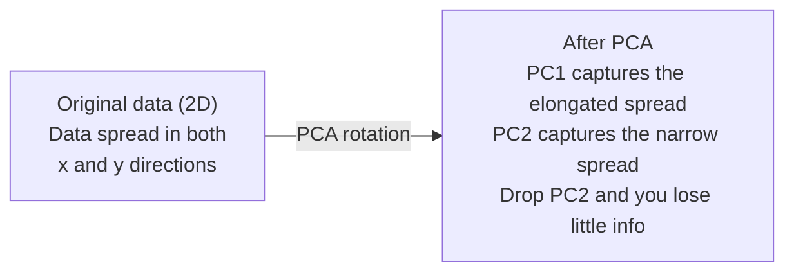

# Dimensionality Reduction / 降维

> 高维数据有结构。你需要从正确角度去看见它。

**类型：** 构建
**语言：** Python
**前置要求：** Phase 1, Lessons 01 (Linear Algebra Intuition), 02 (Vectors, Matrices & Operations), 03 (Eigenvalues & Eigenvectors), 06 (Probability & Distributions)
**时间：** 约 90 分钟

## Learning Objectives / 学习目标

- 从零实现 PCA：center data、计算 covariance matrix、eigendecompose，并完成 projection
- 使用 explained variance ratio 和 elbow method 选择 principal components 的数量
- 比较 PCA、t-SNE 和 UMAP 在 2D 中可视化 MNIST digits 的效果，并解释它们的 tradeoffs
- 使用带 RBF kernel 的 kernel PCA 分离 standard PCA 无法处理的 nonlinear data structures

## The Problem / 问题

你有一个每个样本 784 个 features 的 dataset。也许它是手写数字的 pixel values，也许是 gene expression levels，也许是 user behavior signals。你无法可视化 784 维。你没法画出来，甚至没法直观思考它。

但这 784 个 features 中大多数是冗余的。真实信息位于一个小得多的低维流形上。一个手写的 "7" 不需要 784 个独立数字来描述。它只需要少数几个：笔画角度、横杠长度、倾斜程度。其余很多是噪声。

Dimensionality reduction 要找到那个更小的低维结构。它会把 784 维数据压缩到 2、10 或 50 维，同时保留重要结构。

## The Concept / 概念

### The curse of dimensionality / 维度灾难

高维空间非常反直觉。维度增长时，三件事会出问题。

**距离变得没有意义。** 在高维中，任意两个随机点之间的距离会收敛到相近值。如果每个点与其他点的距离都差不多，nearest-neighbor search 就失效了。

```
Dimension    Avg distance ratio (max/min between random points)
2            ~5.0
10           ~1.8
100          ~1.2
1000         ~1.02
```

**体积集中到角落。** d 维 unit hypercube 有 2^d 个角。在 100 维中，几乎所有体积都在角落，远离中心。数据点会散到边缘，模型在内部区域会严重缺数据。

**你需要指数级更多数据。** 为了在空间中保持相同 sample density，从 2D 到 20D 意味着你需要 10^18 倍数据。你永远不会有这么多。降维会把 data density 拉回可处理范围。

### PCA: find the directions that matter / PCA：找到重要方向

Principal Component Analysis（PCA）会找到数据变化最大的轴。它会旋转坐标系，让第一条轴捕获最多 variance，第二条轴捕获次多 variance，依此类推。

算法：

```
1. Center the data        (subtract the mean from each feature)
2. Compute covariance     (how features move together)
3. Eigendecomposition     (find the principal directions)
4. Sort by eigenvalue     (biggest variance first)
5. Project               (keep top k eigenvectors, drop the rest)
```

为什么用 eigendecomposition？Covariance matrix 是 symmetric 且 positive semi-definite 的。它的 eigenvectors 是 feature space 中的正交方向。Eigenvalues 告诉你每个方向捕获了多少 variance。最大 eigenvalue 对应的 eigenvector 指向 maximum variance 的方向。



- **Before PCA：** 数据云沿对角线分布，横跨 x 和 y 两条轴
- **After PCA：** 坐标系被旋转，PC1 对齐 maximum variance 的方向，也就是拉长的方向；PC2 对齐 minimum variance 的方向，也就是较窄的方向
- **Dimensionality reduction：** 丢掉 PC2，相当于把数据投影到 PC1 上，损失很少信息

### Explained variance ratio / 解释方差比

每个 principal component 捕获总 variance 的一部分。Explained variance ratio 告诉你捕获了多少。

```
Component    Eigenvalue    Explained ratio    Cumulative
PC1          4.73          0.473              0.473
PC2          2.51          0.251              0.724
PC3          1.12          0.112              0.836
PC4          0.89          0.089              0.925
...
```

当 cumulative explained variance 达到 0.95 时，你就知道这么多 components 能捕获 95% 的信息。后面的基本都是噪声。

### Choosing the number of components / 选择 components 数量

三种策略：

1. **Threshold。** 保留足够 components，解释 90-95% 的 variance。
2. **Elbow method。** 绘制每个 component 的 explained variance。寻找明显的下降拐点。
3. **Downstream performance。** 把 PCA 当作 preprocessing。扫描 k，并测量模型 accuracy。最好的 k 通常是 accuracy 进入平台期的位置。

### t-SNE: preserve neighborhoods / t-SNE：保留邻域

t-Distributed Stochastic Neighbor Embedding（t-SNE）专为可视化设计。它把高维数据映射到 2D（或 3D），同时保留哪些点彼此接近。

直觉：在原始空间中，根据距离为点对计算一个 probability distribution。近的点概率高，远的点概率低。然后寻找一个 2D 布局，让同样的 probability distribution 尽量成立。在 784 维中是邻居的点，在 2D 中仍然是邻居。

t-SNE 的关键性质：
- Non-linear。它能展开 PCA 无法处理的复杂 manifolds。
- Stochastic。不同运行会产生不同布局。
- Perplexity parameter 控制考虑多少邻居，典型范围是 5-50。
- 输出中 clusters 之间的距离没有意义。只有 cluster 本身有意义。
- 大数据集上较慢。默认是 O(n^2)。

### UMAP: faster, better global structure / UMAP：更快，也保留更多全局结构

Uniform Manifold Approximation and Projection（UMAP）与 t-SNE 思路相似，但有两个优势：
- 更快。它使用 approximate nearest-neighbor graphs，而不是计算所有 pairwise distances。
- 更好的 global structure。输出中 clusters 的相对位置通常比 t-SNE 更有意义。

UMAP 会在高维空间构建一个 weighted graph，也就是 "fuzzy topological representation"，然后寻找一个低维布局，尽可能保留这张图。

关键参数：
- `n_neighbors`：定义 local structure 的邻居数量，类似 perplexity。值越高，保留更多 global structure。
- `min_dist`：输出中点能堆得多紧。值越低，clusters 越密集。

### When to use which / 什么时候用哪种方法

| Method | Use case | Preserves | Speed |
|--------|----------|-----------|-------|
| PCA | 训练前 preprocessing | Global variance | 快（exact），可处理数百万 samples |
| PCA | 快速 exploratory visualization | Linear structure | 快 |
| t-SNE | Publication-quality 2D plots | Local neighborhoods | 慢（理想情况下 < 10k samples） |
| UMAP | 大规模 2D visualization | Local + 部分 global structure | 中等（可处理 millions） |
| PCA | 为模型做 feature reduction | Variance-ranked features | 快 |
| t-SNE / UMAP | 理解 cluster structure | Cluster separation | 中到慢 |

经验规则：用 PCA 做 preprocessing 和 data compression。当你需要在 2D 中可视化结构时，用 t-SNE 或 UMAP。

### Kernel PCA / Kernel PCA

Standard PCA 寻找的是 linear subspaces。它旋转坐标系并丢弃轴。但如果数据位于 nonlinear manifold 上呢？2D 中的一个圆无法被任何直线分开。Standard PCA 无法帮忙。

Kernel PCA 会在 kernel function 诱导出的高维 feature space 中应用 PCA，但不显式计算那个空间中的坐标。这就是 kernel trick，也就是 SVM 背后的同一个思想。

算法：
1. 计算 kernel matrix K，其中 K_ij = k(x_i, x_j)
2. 在 feature space 中 center kernel matrix
3. 对 centered kernel matrix 做 eigendecompose
4. Top eigenvectors（按 1/sqrt(eigenvalue) 缩放）就是 projections

常见 kernel functions：

| Kernel | Formula | Good for |
|--------|---------|----------|
| RBF (Gaussian) | exp(-gamma * \|\|x - y\|\|^2) | 大多数 nonlinear data、smooth manifolds |
| Polynomial | (x . y + c)^d | Polynomial relationships |
| Sigmoid | tanh(alpha * x . y + c) | Neural network-like mappings |

什么时候用 kernel PCA，什么时候用 standard PCA：

| Criterion | Standard PCA | Kernel PCA |
|-----------|-------------|------------|
| Data structure | Linear subspace | Nonlinear manifold |
| Speed | O(min(n^2 d, d^2 n)) | O(n^2 d + n^3) |
| Interpretability | Components are linear combinations of features | Components lack direct feature interpretation |
| Scalability | Works on millions of samples | Kernel matrix is n x n, memory-limited |
| Reconstruction | Direct inverse transform | Requires pre-image approximation |

经典例子：2D 中的 concentric circles。两圈点，一圈在内，一圈在外。Standard PCA 会把两者投影到同一条线上，对 classification 没用。带 RBF kernel 的 Kernel PCA 会把内圈和外圈映射到不同区域，让它们变得 linearly separable。

### Reconstruction Error / 重构误差

你的 dimensionality reduction 有多好？你把 784 维压缩到 50 维。到底损失了什么？

测量 reconstruction error：
1. 把数据投影到 k 维：X_reduced = X @ W_k
2. 重构：X_hat = X_reduced @ W_k^T
3. 计算 MSE：mean((X - X_hat)^2)

对 PCA 来说，reconstruction error 与 explained variance 有清晰关系：

```
Reconstruction error = sum of eigenvalues NOT included
Total variance = sum of ALL eigenvalues
Fraction lost = (sum of dropped eigenvalues) / (sum of all eigenvalues)
```

每个 component 的 explained variance ratio 是：

```
explained_ratio_k = eigenvalue_k / sum(all eigenvalues)
```

把 cumulative explained variance 对 components 数量作图，就得到 "elbow" curve。合适的 components 数量通常满足：
- 曲线开始变平，收益递减
- Cumulative variance 越过阈值，通常是 0.90 或 0.95
- Downstream task performance 进入平台期

Reconstruction error 不只用于选择 k。你也可以用它做 anomaly detection：reconstruction error 很高的 samples 是 outliers，不符合学到的 subspace。这就是生产系统中 PCA-based anomaly detection 的基础。

```figure
pca-axes
```

## Build It / 动手构建

### Step 1: PCA from scratch / 第 1 步：从零实现 PCA

```python
import numpy as np

class PCA:
    def __init__(self, n_components):
        self.n_components = n_components
        self.components = None
        self.mean = None
        self.eigenvalues = None
        self.explained_variance_ratio_ = None

    def fit(self, X):
        self.mean = np.mean(X, axis=0)
        X_centered = X - self.mean

        cov_matrix = np.cov(X_centered, rowvar=False)

        eigenvalues, eigenvectors = np.linalg.eigh(cov_matrix)

        sorted_idx = np.argsort(eigenvalues)[::-1]
        eigenvalues = eigenvalues[sorted_idx]
        eigenvectors = eigenvectors[:, sorted_idx]

        self.components = eigenvectors[:, :self.n_components].T
        self.eigenvalues = eigenvalues[:self.n_components]
        total_var = np.sum(eigenvalues)
        self.explained_variance_ratio_ = self.eigenvalues / total_var

        return self

    def transform(self, X):
        X_centered = X - self.mean
        return X_centered @ self.components.T

    def fit_transform(self, X):
        self.fit(X)
        return self.transform(X)
```

### Step 2: Test on synthetic data / 第 2 步：在 synthetic data 上测试

```python
np.random.seed(42)
n_samples = 500

t = np.random.uniform(0, 2 * np.pi, n_samples)
x1 = 3 * np.cos(t) + np.random.normal(0, 0.2, n_samples)
x2 = 3 * np.sin(t) + np.random.normal(0, 0.2, n_samples)
x3 = 0.5 * x1 + 0.3 * x2 + np.random.normal(0, 0.1, n_samples)

X_synthetic = np.column_stack([x1, x2, x3])

pca = PCA(n_components=2)
X_reduced = pca.fit_transform(X_synthetic)

print(f"Original shape: {X_synthetic.shape}")
print(f"Reduced shape:  {X_reduced.shape}")
print(f"Explained variance ratios: {pca.explained_variance_ratio_}")
print(f"Total variance captured: {sum(pca.explained_variance_ratio_):.4f}")
```

### Step 3: MNIST digits in 2D / 第 3 步：2D 中的 MNIST digits

```python
from sklearn.datasets import fetch_openml

mnist = fetch_openml("mnist_784", version=1, as_frame=False, parser="auto")
X_mnist = mnist.data[:5000].astype(float)
y_mnist = mnist.target[:5000].astype(int)

pca_mnist = PCA(n_components=50)
X_pca50 = pca_mnist.fit_transform(X_mnist)
print(f"50 components capture {sum(pca_mnist.explained_variance_ratio_):.2%} of variance")

pca_2d = PCA(n_components=2)
X_pca2d = pca_2d.fit_transform(X_mnist)
print(f"2 components capture {sum(pca_2d.explained_variance_ratio_):.2%} of variance")
```

### Step 4: Compare with sklearn / 第 4 步：与 sklearn 对比

```python
from sklearn.decomposition import PCA as SklearnPCA
from sklearn.manifold import TSNE

sklearn_pca = SklearnPCA(n_components=2)
X_sklearn_pca = sklearn_pca.fit_transform(X_mnist)

print(f"\nOur PCA explained variance:     {pca_2d.explained_variance_ratio_}")
print(f"Sklearn PCA explained variance: {sklearn_pca.explained_variance_ratio_}")

diff = np.abs(np.abs(X_pca2d) - np.abs(X_sklearn_pca))
print(f"Max absolute difference: {diff.max():.10f}")

tsne = TSNE(n_components=2, perplexity=30, random_state=42)
X_tsne = tsne.fit_transform(X_mnist)
print(f"\nt-SNE output shape: {X_tsne.shape}")
```

### Step 5: UMAP comparison / 第 5 步：UMAP 对比

```python
try:
    from umap import UMAP

    reducer = UMAP(n_components=2, n_neighbors=15, min_dist=0.1, random_state=42)
    X_umap = reducer.fit_transform(X_mnist)
    print(f"UMAP output shape: {X_umap.shape}")
except ImportError:
    print("Install umap-learn: pip install umap-learn")
```

## Use It / 应用它

把 PCA 作为 classifier 前的 preprocessing：

```python
from sklearn.decomposition import PCA as SklearnPCA
from sklearn.linear_model import LogisticRegression
from sklearn.model_selection import train_test_split
from sklearn.metrics import accuracy_score

X_train, X_test, y_train, y_test = train_test_split(
    X_mnist, y_mnist, test_size=0.2, random_state=42
)

results = {}
for k in [10, 30, 50, 100, 200]:
    pca_k = SklearnPCA(n_components=k)
    X_tr = pca_k.fit_transform(X_train)
    X_te = pca_k.transform(X_test)

    clf = LogisticRegression(max_iter=1000, random_state=42)
    clf.fit(X_tr, y_train)
    acc = accuracy_score(y_test, clf.predict(X_te))
    var_captured = sum(pca_k.explained_variance_ratio_)
    results[k] = (acc, var_captured)
    print(f"k={k:>3d}  accuracy={acc:.4f}  variance={var_captured:.4f}")
```

Performance 会在远小于 784 维时进入平台期。那个平台期就是你的 operating point。

## Ship It / 交付它

本课产出：
- `outputs/skill-dimensionality-reduction.md` - 一个 skill，用于根据任务选择合适的 dimensionality reduction technique

## Exercises / 练习

1. 修改 PCA class，支持 `inverse_transform`。用 10、50 和 200 components 重构 MNIST digits。分别打印 reconstruction error，也就是与原图的 mean squared difference。

2. 在同一个 MNIST subset 上用 perplexity values 5、30 和 100 运行 t-SNE。描述输出如何变化。为什么 perplexity 会影响 cluster tightness？

3. 构造一个 50 features、但只有 5 个 informative features 的 dataset（用 `sklearn.datasets.make_classification` 生成）。应用 PCA，并检查 explained variance curve 是否正确识别出数据实际上接近 5-dimensional。

## Key Terms / 关键术语

| 术语 | 常见说法 | 实际含义 |
|------|----------------|----------------------|
| Curse of dimensionality | “特征太多” | 维度增长后，距离、体积和 data density 都会出现反直觉行为。模型需要指数级更多数据来补偿。 |
| PCA | “降低维度” | 旋转坐标系，让轴对齐 maximum variance 的方向，然后丢掉 low-variance axes。 |
| Principal component | “重要方向” | Covariance matrix 的 eigenvector。Feature space 中数据变化最大的方向。 |
| Explained variance ratio | “这个 component 有多少信息” | 某个 principal component 捕获 total variance 的比例。把前 k 个比例相加，就知道 k components 保留多少信息。 |
| Covariance matrix | “特征如何相关” | 一个 symmetric matrix，其中 entry (i,j) 衡量 feature i 和 feature j 如何一起变化。对角线项是各 feature 的 variance。 |
| t-SNE | “那个 cluster plot” | 一种 nonlinear 方法，通过保留 pairwise neighborhood probabilities，把高维数据映射到 2D。适合 visualization，不适合 preprocessing。 |
| UMAP | “更快的 t-SNE” | 一种基于 topological data analysis 的 nonlinear 方法。保留 local 和部分 global structure。比 t-SNE 更可扩展。 |
| Perplexity | “t-SNE 旋钮” | 控制每个点考虑的有效邻居数量。低 perplexity 聚焦非常局部的结构，高 perplexity 捕获更宽的模式。 |
| Manifold | “数据所在的曲面” | 嵌入在高维空间中的低维曲面。一张纸揉在 3D 中，仍然是一个 2D manifold。 |

## Further Reading / 延伸阅读

- [A Tutorial on Principal Component Analysis](https://arxiv.org/abs/1404.1100) (Shlens) - 从底层清楚推导 PCA
- [How to Use t-SNE Effectively](https://distill.pub/2016/misread-tsne/) (Wattenberg et al.) - t-SNE 陷阱和参数选择的交互式指南
- [UMAP documentation](https://umap-learn.readthedocs.io/) - UMAP 作者提供的理论和实践指导
