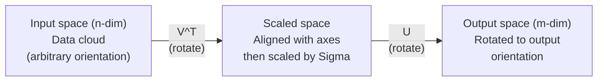
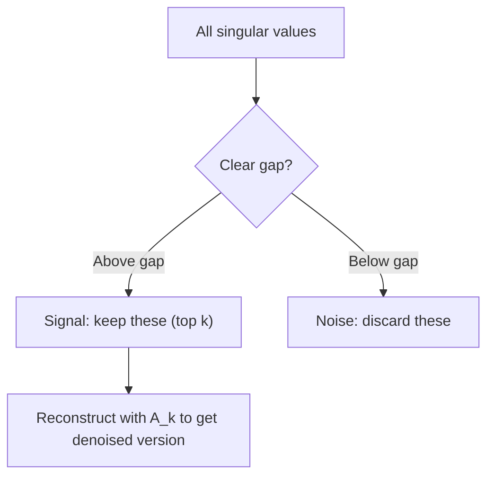

# Singular Value Decomposition / 奇异值分解

> SVD 是线性代数里的万能工具。每个矩阵都有 SVD，每个数据科学工作者都需要理解它。

**类型：** 构建
**语言：** Python, Julia
**前置要求：** Phase 1, Lessons 01 (Linear Algebra Intuition), 02 (Vectors & Matrices Operations), 03 (Matrix Transformations)
**时间：** 约 120 分钟

## Learning Objectives / 学习目标

- 通过 power iteration 实现 SVD，并解释 U、Sigma 和 V^T 的几何意义
- 使用 truncated SVD 做 image compression，并衡量 compression ratio 与 reconstruction error 的关系
- 通过 SVD 计算 Moore-Penrose pseudoinverse，求解 overdetermined least-squares systems
- 把 SVD 连接到 PCA、recommendation systems（latent factors）和 NLP 中的 Latent Semantic Analysis

## The Problem / 问题

你有一个 1000x2000 的矩阵。也许它是 user-movie ratings，也许是 document-term frequency table，也许是图像 pixel values。你需要压缩它、去噪、寻找隐藏结构，或者用它求解 least-squares system。Eigendecomposition 只适用于方阵。即使是方阵，它还要求矩阵有一整组线性无关 eigenvectors。

SVD 适用于任何矩阵。任何 shape，任何 rank，没有前置条件。它把矩阵分解成三个 factors，揭示这个矩阵对空间所做事情的几何结构。它是整个线性代数中最通用、最有用的分解。

## The Concept / 概念

### What SVD does geometrically / SVD 在几何上做什么

每个矩阵，不管 shape 如何，都会按顺序执行三种操作：旋转、缩放、再旋转。SVD 会把这个分解显式写出来。

```
A = U * Sigma * V^T

      m x n     m x m    m x n    n x n
     (any)    (rotate)  (scale)  (rotate)
```

给定任意矩阵 A，SVD 会把它分解为：
- V^T 在 input space（n-dimensional）中旋转向量
- Sigma 沿每条轴缩放，也就是拉伸或压缩
- U 把结果旋转到 output space（m-dimensional）中



可以这样理解：你把一个矩阵交给 SVD。它告诉你：“这个矩阵会把一个输入球体先通过 V^T 旋转，然后通过 Sigma 拉伸成一个椭球，再通过 U 旋转这个椭球。” Singular values 就是这个椭球各条轴的长度。

### The full decomposition / 完整分解

对 shape 为 m x n 的矩阵 A：

```
A = U * Sigma * V^T

where:
  U     is m x m, orthogonal (U^T U = I)
  Sigma is m x n, diagonal (singular values on the diagonal)
  V     is n x n, orthogonal (V^T V = I)

The singular values sigma_1 >= sigma_2 >= ... >= sigma_r > 0
where r = rank(A)
```

U 的列称为 left singular vectors。V 的列称为 right singular vectors。Sigma 对角线上的 entries 称为 singular values。它们永远非负，并且通常按降序排列。

### Left singular vectors, singular values, right singular vectors / 左奇异向量、奇异值、右奇异向量

SVD 的每个组件都有不同的几何意义。

**Right singular vectors（V 的列）：** 它们为 input space（R^n）构成一组 orthonormal basis。它们是 input space 中的方向，矩阵会把这些方向映射到 output space 中的正交方向。可以把它们看作 domain 的自然坐标系。

**Singular values（Sigma 的对角线）：** 它们是缩放因子。第 i 个 singular value 告诉你矩阵会沿第 i 个 right singular vector 拉伸多少。Singular value 为零，意味着矩阵会把该方向完全压扁。

**Left singular vectors（U 的列）：** 它们为 output space（R^m）构成一组 orthonormal basis。第 i 个 left singular vector 是第 i 个 right singular vector 经过缩放后落到 output space 中的方向。

它们之间的关系：

```
A * v_i = sigma_i * u_i

The matrix A takes the i-th right singular vector v_i,
scales it by sigma_i, and maps it to the i-th left singular vector u_i.
```

这给了你一个逐坐标视角，说明任意矩阵到底在做什么。

### Outer product form / 外积形式

SVD 可以写成 rank-1 matrices 之和：

```
A = sigma_1 * u_1 * v_1^T + sigma_2 * u_2 * v_2^T + ... + sigma_r * u_r * v_r^T

Each term sigma_i * u_i * v_i^T is a rank-1 matrix (an outer product).
The full matrix is the sum of r such matrices, where r is the rank.
```

这个形式是 low-rank approximation 的基础。每一项都添加一层结构。第一项捕获最重要的单个模式，第二项捕获次重要模式，依此类推。截断这个和，就能在任意给定 rank 下得到最好的近似。

```
Rank-1 approx:    A_1 = sigma_1 * u_1 * v_1^T
                  (captures the dominant pattern)

Rank-2 approx:    A_2 = sigma_1 * u_1 * v_1^T + sigma_2 * u_2 * v_2^T
                  (captures the two most important patterns)

Rank-k approx:    A_k = sum of top k terms
                  (optimal by the Eckart-Young theorem)
```

### Relationship to eigendecomposition / 与特征分解的关系

SVD 和 eigendecomposition 有很深的联系。A 的 singular values 和 vectors 直接来自 A^T A 以及 A A^T 的 eigenvalues 和 eigenvectors。

```
A^T A = V * Sigma^T * U^T * U * Sigma * V^T
      = V * Sigma^T * Sigma * V^T
      = V * D * V^T

where D = Sigma^T * Sigma is a diagonal matrix with sigma_i^2 on the diagonal.

So:
- The right singular vectors (V) are eigenvectors of A^T A
- The singular values squared (sigma_i^2) are eigenvalues of A^T A

Similarly:
A A^T = U * Sigma * V^T * V * Sigma^T * U^T
      = U * Sigma * Sigma^T * U^T

So:
- The left singular vectors (U) are eigenvectors of A A^T
- The eigenvalues of A A^T are also sigma_i^2
```

这个联系告诉你三件事：
1. Singular values 永远是实数且非负，因为它们是 positive semi-definite matrix 的 eigenvalues 的平方根。
2. 你可以通过对 A^T A 做 eigendecomposition 来计算 SVD，但这会平方 condition number 并损失数值精度。专门的 SVD algorithms 会避免这一点。
3. 当 A 是 square 且 symmetric positive semi-definite 时，SVD 和 eigendecomposition 是同一件事。

### Truncated SVD: low-rank approximation / Truncated SVD：低秩近似

Eckart-Young-Mirsky theorem 说明，A 的最佳 rank-k approximation（同时针对 Frobenius norm 和 spectral norm）可以通过只保留 top k singular values 及其对应 vectors 得到：

```
A_k = U_k * Sigma_k * V_k^T

where:
  U_k     is m x k  (first k columns of U)
  Sigma_k is k x k  (top-left k x k block of Sigma)
  V_k     is n x k  (first k columns of V)

Approximation error = sigma_{k+1}  (in spectral norm)
                    = sqrt(sigma_{k+1}^2 + ... + sigma_r^2)  (in Frobenius norm)
```

这不只是“还不错”的近似。它是可证明的 rank k 最佳近似。没有其他 rank-k matrix 能比它更接近 A。

| Component | Relative magnitude | Kept in rank-3 approx? |
|-----------|-------------------|------------------------|
| sigma_1 | 最大 | 是 |
| sigma_2 | 大 | 是 |
| sigma_3 | 中等偏大 | 是 |
| sigma_4 | 中等 | 否（error） |
| sigma_5 | 中等偏小 | 否（error） |
| sigma_6 | 小 | 否（error） |
| sigma_7 | 很小 | 否（error） |
| sigma_8 | 极小 | 否（error） |

保留 top 3：A_3 捕获三个最大的 singular values。Error = 剩余值（sigma_4 到 sigma_8）。

如果 singular values 衰减很快，一个小 k 就能捕获矩阵的大部分信息。如果衰减很慢，这个矩阵就没有明显 low-rank structure。

### Image compression with SVD / 用 SVD 压缩图像

一张 grayscale image 是 pixel intensities 组成的矩阵。800x600 图像有 480,000 个值。SVD 可以用少得多的值近似它。

```
Original image: 800 x 600 = 480,000 values

SVD with rank k:
  U_k:      800 x k values
  Sigma_k:  k values
  V_k:      600 x k values
  Total:    k * (800 + 600 + 1) = k * 1401 values

  k=10:   14,010 values   (2.9% of original)
  k=50:   70,050 values  (14.6% of original)
  k=100: 140,100 values  (29.2% of original)

  The compression ratio improves as k gets smaller,
  but visual quality degrades.
```

关键洞见：自然图像的 singular values 通常快速衰减。前几个 singular values 捕获大尺度结构，例如形状和渐变。后面的捕获细节和噪声。截断到 rank 50 往往能得到看起来几乎一样的图像，同时少用 85% 存储。

### SVD for recommendation systems / SVD 用于推荐系统

Netflix Prize 让这个方法广为人知。你有一个 user-movie ratings matrix，其中大多数 entries 缺失。

```
             Movie1  Movie2  Movie3  Movie4  Movie5
  User1      [  5      ?       3       ?       1  ]
  User2      [  ?      4       ?       2       ?  ]
  User3      [  3      ?       5       ?       ?  ]
  User4      [  ?      ?       ?       4       3  ]

  ? = unknown rating
```

思路是：这个 ratings matrix 是低秩的。用户口味并不是完全独立的。有少数 latent factors（动作 vs. 剧情、新片 vs. 老片、理性 vs. 感官）解释了大部分偏好。

对填充后的 ratings matrix 做 SVD，会把它分解为：
- U：latent factor space 中的 user profiles
- Sigma：每个 latent factor 的重要程度
- V^T：latent factor space 中的 movie profiles

用户对电影的预测评分，就是这个用户 profile 与电影 profile 的 dot product（按 singular values 加权）。Low-rank approximation 会补全缺失 entries。

实践中，你会使用 Simon Funk's incremental SVD 或 ALS（alternating least squares）这样的变体，它们能直接处理 missing data。但核心思想一样：通过 SVD 做 latent factor decomposition。

### SVD in NLP: Latent Semantic Analysis / NLP 中的 SVD：Latent Semantic Analysis

Latent Semantic Analysis（LSA），也叫 Latent Semantic Indexing（LSI），会把 SVD 应用到 term-document matrix 上。

```
             Doc1   Doc2   Doc3   Doc4
  "cat"      [  3      0      1      0  ]
  "dog"      [  2      0      0      1  ]
  "fish"     [  0      4      1      0  ]
  "pet"      [  1      1      1      1  ]
  "ocean"    [  0      3      0      0  ]

After SVD with rank k=2:

  Each document becomes a point in 2D "concept space."
  Each term becomes a point in the same 2D space.
  Documents about similar topics cluster together.
  Terms with similar meanings cluster together.

  "cat" and "dog" end up near each other (land pets).
  "fish" and "ocean" end up near each other (water concepts).
  Doc1 and Doc3 cluster if they share similar topics.
```

LSA 是最早成功从原始文本中捕捉 semantic similarity 的方法之一。它之所以有效，是因为同义词倾向于出现在相似 documents 中，因此 SVD 会把它们分组到相同 latent dimensions。现代 word embeddings（Word2Vec、GloVe）可以看作这个思想的后代。

### SVD for noise reduction / SVD 用于降噪

含噪数据的 signal 通常集中在 top singular values 中，而 noise 分散在所有 singular values 上。截断可以移除 noise floor。

**Clean signal singular values：**

| Component | Magnitude | Type |
|-----------|-----------|------|
| sigma_1 | 非常大 | Signal |
| sigma_2 | 大 | Signal |
| sigma_3 | 中等 | Signal |
| sigma_4 | 接近零 | 可忽略 |
| sigma_5 | 接近零 | 可忽略 |

**Noisy signal singular values（noise 会加到所有项上）：**

| Component | Magnitude | Type |
|-----------|-----------|------|
| sigma_1 | 非常大 | Signal |
| sigma_2 | 大 | Signal |
| sigma_3 | 中等 | Signal |
| sigma_4 | 小 | Noise |
| sigma_5 | 小 | Noise |
| sigma_6 | 小 | Noise |
| sigma_7 | 小 | Noise |



这会用于 signal processing、scientific measurement 和 data cleaning。任何矩阵被 additive noise 污染时，truncated SVD 都是一种有原则的 signal/noise 分离方法。

### Pseudoinverse via SVD / 通过 SVD 计算伪逆

Moore-Penrose pseudoinverse A+ 把矩阵求逆推广到非方阵和 singular matrices。SVD 让它的计算非常直接。

```
If A = U * Sigma * V^T, then:

A+ = V * Sigma+ * U^T

where Sigma+ is formed by:
  1. Transpose Sigma (swap rows and columns)
  2. Replace each non-zero diagonal entry sigma_i with 1/sigma_i
  3. Leave zeros as zeros

For A (m x n):      A+ is (n x m)
For Sigma (m x n):  Sigma+ is (n x m)
```

Pseudoinverse 可以求解 least-squares problems。如果 Ax = b 没有精确解（overdetermined system），那么 x = A+ b 就是 least-squares solution，也就是最小化 ||Ax - b|| 的解。

```
Overdetermined system (more equations than unknowns):

  [1  1]         [3]
  [2  1] x   =   [5]       No exact solution exists.
  [3  1]         [6]

  x_ls = A+ b = V * Sigma+ * U^T * b

  This gives the x that minimizes the sum of squared residuals.
  Same result as the normal equations (A^T A)^(-1) A^T b,
  but numerically more stable.
```

### Numerical stability advantages / 数值稳定性优势

计算 A^T A 的 eigendecomposition 会平方 singular values（A^T A 的 eigenvalues 是 sigma_i^2）。这会平方 condition number，从而放大 numerical errors。

```
Example:
  A has singular values [1000, 1, 0.001]
  Condition number of A: 1000 / 0.001 = 10^6

  A^T A has eigenvalues [10^6, 1, 10^{-6}]
  Condition number of A^T A: 10^6 / 10^{-6} = 10^{12}

  Computing SVD directly: works with condition number 10^6
  Computing via A^T A:     works with condition number 10^{12}
                           (6 extra digits of precision lost)
```

现代 SVD algorithms（Golub-Kahan bidiagonalization）会直接作用在 A 上，绝不会先形成 A^T A。这就是为什么你应始终优先使用 `np.linalg.svd(A)`，而不是 `np.linalg.eig(A.T @ A)`。

### Connection to PCA / 与 PCA 的连接

PCA 就是对 centered data 做 SVD。这不是类比。它字面上就是同一个计算。

```
Given data matrix X (n_samples x n_features), centered (mean subtracted):

Covariance matrix: C = (1/(n-1)) * X^T X

PCA finds eigenvectors of C. But:

  X = U * Sigma * V^T    (SVD of X)

  X^T X = V * Sigma^2 * V^T

  C = (1/(n-1)) * V * Sigma^2 * V^T

So the principal components are exactly the right singular vectors V.
The explained variance for each component is sigma_i^2 / (n-1).

In sklearn, PCA is implemented using SVD, not eigendecomposition.
It is faster and more numerically stable.
```

这意味着你在 Lesson 10 中学到的 dimensionality reduction，底层就是 SVD。PCA 是 SVD 在 machine learning 中最常见的应用。

```figure
svd-rank-reconstruction
```

## Build It / 动手构建

### Step 1: SVD from scratch using power iteration / 第 1 步：用 power iteration 从零实现 SVD

思路：要找到最大的 singular value 及其 vectors，可以对 A^T A（或 A A^T）做 power iteration。然后对矩阵 deflate，重复寻找下一个 singular value。

```python
import numpy as np

def power_iteration(M, num_iters=100):
    n = M.shape[1]
    v = np.random.randn(n)
    v = v / np.linalg.norm(v)

    for _ in range(num_iters):
        Mv = M @ v
        v = Mv / np.linalg.norm(Mv)

    eigenvalue = v @ M @ v
    return eigenvalue, v

def svd_from_scratch(A, k=None):
    m, n = A.shape
    if k is None:
        k = min(m, n)

    sigmas = []
    us = []
    vs = []

    A_residual = A.copy().astype(float)

    for _ in range(k):
        AtA = A_residual.T @ A_residual
        eigenvalue, v = power_iteration(AtA, num_iters=200)

        if eigenvalue < 1e-10:
            break

        sigma = np.sqrt(eigenvalue)
        u = A_residual @ v / sigma

        sigmas.append(sigma)
        us.append(u)
        vs.append(v)

        A_residual = A_residual - sigma * np.outer(u, v)

    U = np.column_stack(us) if us else np.empty((m, 0))
    S = np.array(sigmas)
    V = np.column_stack(vs) if vs else np.empty((n, 0))

    return U, S, V
```

### Step 2: Test and compare with NumPy / 第 2 步：测试并与 NumPy 对比

```python
np.random.seed(42)
A = np.random.randn(5, 4)

U_ours, S_ours, V_ours = svd_from_scratch(A)
U_np, S_np, Vt_np = np.linalg.svd(A, full_matrices=False)

print("Our singular values:", np.round(S_ours, 4))
print("NumPy singular values:", np.round(S_np, 4))

A_reconstructed = U_ours @ np.diag(S_ours) @ V_ours.T
print(f"Reconstruction error: {np.linalg.norm(A - A_reconstructed):.8f}")
```

### Step 3: Image compression demo / 第 3 步：Image compression demo

```python
def compress_image_svd(image_matrix, k):
    U, S, Vt = np.linalg.svd(image_matrix, full_matrices=False)
    compressed = U[:, :k] @ np.diag(S[:k]) @ Vt[:k, :]
    return compressed

image = np.random.seed(42)
rows, cols = 200, 300
image = np.random.randn(rows, cols)

for k in [1, 5, 10, 20, 50]:
    compressed = compress_image_svd(image, k)
    error = np.linalg.norm(image - compressed) / np.linalg.norm(image)
    original_size = rows * cols
    compressed_size = k * (rows + cols + 1)
    ratio = compressed_size / original_size
    print(f"k={k:>3d}  error={error:.4f}  storage={ratio:.1%}")
```

### Step 4: Noise reduction / 第 4 步：降噪

```python
np.random.seed(42)
clean = np.outer(np.sin(np.linspace(0, 4*np.pi, 100)),
                 np.cos(np.linspace(0, 2*np.pi, 80)))
noise = 0.3 * np.random.randn(100, 80)
noisy = clean + noise

U, S, Vt = np.linalg.svd(noisy, full_matrices=False)
denoised = U[:, :5] @ np.diag(S[:5]) @ Vt[:5, :]

print(f"Noisy error:    {np.linalg.norm(noisy - clean):.4f}")
print(f"Denoised error: {np.linalg.norm(denoised - clean):.4f}")
print(f"Improvement:    {(1 - np.linalg.norm(denoised - clean) / np.linalg.norm(noisy - clean)):.1%}")
```

### Step 5: Pseudoinverse / 第 5 步：伪逆

```python
A = np.array([[1, 1], [2, 1], [3, 1]], dtype=float)
b = np.array([3, 5, 6], dtype=float)

U, S, Vt = np.linalg.svd(A, full_matrices=False)
S_inv = np.diag(1.0 / S)
A_pinv = Vt.T @ S_inv @ U.T

x_svd = A_pinv @ b
x_lstsq = np.linalg.lstsq(A, b, rcond=None)[0]
x_pinv = np.linalg.pinv(A) @ b

print(f"SVD pseudoinverse solution:  {x_svd}")
print(f"np.linalg.lstsq solution:   {x_lstsq}")
print(f"np.linalg.pinv solution:    {x_pinv}")
```

## Use It / 应用它

完整可运行 demos 在 `code/svd.py` 中。运行它可以看到 SVD 如何用于 image compression、recommendation systems、latent semantic analysis 和 noise reduction。

```bash
python svd.py
```

Julia 版本在 `code/svd.jl` 中，使用 Julia 原生 `svd()` function 和 `LinearAlgebra` package 演示同样概念。

```bash
julia svd.jl
```

## Ship It / 交付它

本课产出：
- `outputs/skill-svd.md` - 一个 skill，用于判断真实项目中何时以及如何应用 SVD

## Exercises / 练习

1. 不使用 power iteration，从零实现完整 SVD。改为计算 A^T A 的 eigendecomposition 得到 V 和 singular values，然后计算 U = A V Sigma^{-1}。把 numerical accuracy 与你的 power iteration 版本和 NumPy 对比。

2. 加载一张真实 grayscale image，或把一张图转换为 grayscale。分别用 ranks 1、5、10、25、50、100 压缩。对每个 rank，计算 compression ratio 和 relative error。找出图像在视觉上可接受的 rank。

3. 构建一个小型 recommendation system。创建一个 10x8 user-movie ratings matrix，其中部分 entries 已知。用 row means 填充缺失 entries。计算 SVD 并重构 rank-3 approximation。用重构矩阵预测缺失 ratings。验证 predictions 是否合理。

4. 创建一个 100x50 document-term matrix，包含 3 个 synthetic topics。每个 topic 有 5 个关联 terms。加入噪声。应用 SVD，并验证 top 3 singular values 明显大于其余项。把 documents 投影到 3D latent space，检查同一 topic 的 documents 是否聚在一起。

5. 生成一个干净的 low-rank matrix（rank 3，size 50x40），并在不同 levels（sigma = 0.1, 0.5, 1.0, 2.0）添加 Gaussian noise。对每个 noise level，从 k=1 到 40 扫描 truncation rank，并以 clean matrix 为基准测量 reconstruction error。绘制 optimal k 如何随 noise level 变化。

## Key Terms / 关键术语

| 术语 | 常见说法 | 实际含义 |
|------|----------------|----------------------|
| SVD | “分解任意矩阵” | 把 A 分解为 U Sigma V^T，其中 U 和 V orthogonal，Sigma diagonal 且 entries 非负。适用于任意 shape 的任意矩阵。 |
| Singular value | “这个 component 有多重要” | Sigma 的第 i 个对角线项。衡量矩阵沿第 i 个 principal direction 拉伸多少。永远非负，并按降序排列。 |
| Left singular vector | “输出方向” | U 的一列。第 i 个 right singular vector 经过 sigma_i 缩放后映射到 output space 中的方向。 |
| Right singular vector | “输入方向” | V 的一列。矩阵会把 input space 中这个方向映射到第 i 个 left singular vector（缩放后）。 |
| Truncated SVD | “低秩近似” | 只保留 top k singular values 及其 vectors。产生对原矩阵可证明最优的 rank-k approximation（Eckart-Young theorem）。 |
| Rank | “真实维度” | 非零 singular values 的数量。告诉你矩阵实际使用了多少 independent directions。 |
| Pseudoinverse | “广义逆” | V Sigma+ U^T。反转非零 singular values，零保持为零。为非方阵或 singular matrices 求解 least-squares problems。 |
| Condition number | “对误差有多敏感” | sigma_max / sigma_min。Condition number 大意味着输入小变化会导致输出大变化。SVD 会直接揭示它。 |
| Latent factor | “隐藏变量” | SVD 发现的 low-rank space 中的一个维度。在推荐中可能对应 genre preference，在 NLP 中可能对应 topic。 |
| Frobenius norm | “矩阵整体大小” | 所有 entries 平方和的平方根。等于 singular values 平方和的平方根。用于衡量 approximation error。 |
| Eckart-Young theorem | “SVD 给出最佳压缩” | 对任意目标 rank k，truncated SVD 在所有 rank-k matrices 中最小化 approximation error。 |
| Power iteration | “找到最大 eigenvector” | 反复用矩阵乘以随机向量并归一化。会收敛到最大 eigenvalue 对应的 eigenvector。许多 SVD algorithms 的基础。 |

## Further Reading / 延伸阅读

- [Gilbert Strang: Linear Algebra and Its Applications, Chapter 7](https://math.mit.edu/~gs/linearalgebra/) - 对 SVD 及其应用的系统讲解
- [3Blue1Brown: But what is the SVD?](https://www.youtube.com/watch?v=vSczTbgc8Rc) - SVD 的几何直觉
- [We Recommend a Singular Value Decomposition](https://www.ams.org/publicoutreach/feature-column/fcarc-svd) - American Mathematical Society 的易读概览
- [Netflix Prize and Matrix Factorization](https://sifter.org/~simon/journal/20061211.html) - Simon Funk 关于推荐中 SVD 的原始博客
- [Latent Semantic Analysis](https://en.wikipedia.org/wiki/Latent_semantic_analysis) - SVD 在 NLP 中的早期应用
- [Numerical Linear Algebra by Trefethen and Bau](https://people.maths.ox.ac.uk/trefethen/text.html) - 理解 SVD algorithms 及数值性质的经典资料
