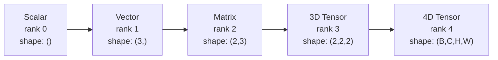
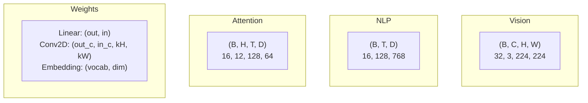
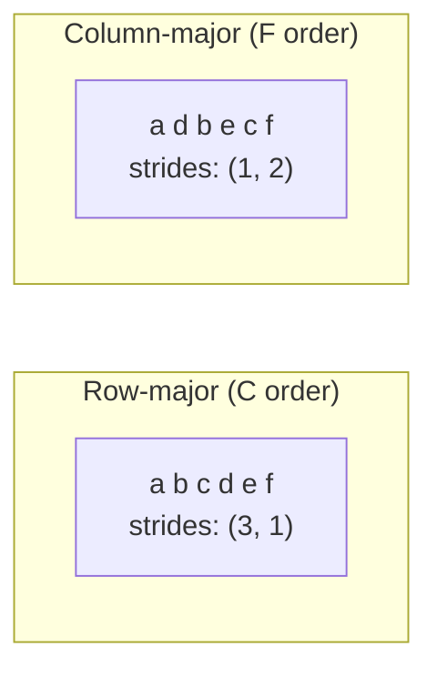
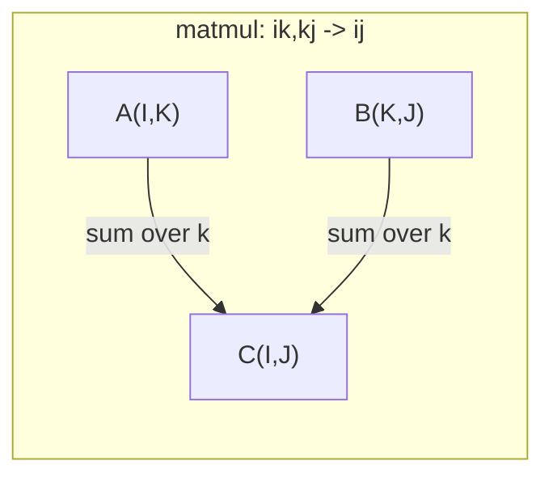

# Tensor Operations / 张量运算

> Tensor 是数据与深度学习之间的共同语言。每张图像、每个句子、每个 gradient 都会流过它们。

**类型：** 构建
**语言：** Python
**前置要求：** Phase 1, Lessons 01 (Linear Algebra Intuition), 02 (Vectors, Matrices & Operations)
**时间：** 约 90 分钟

## Learning Objectives / 学习目标

- 从零实现一个 tensor class，支持 shape、strides、reshape、transpose 和 element-wise operations
- 应用 broadcasting rules，让不同 shapes 的 tensors 在不复制数据的情况下参与运算
- 为 dot products、matrix multiplications、outer products 和 batched operations 编写 einsum expressions
- 追踪 multi-head attention 每一步的精确 tensor shapes

## The Problem / 问题

你构建了一个 transformer。Forward pass 看起来很干净。运行后却得到：`RuntimeError: mat1 and mat2 shapes cannot be multiplied (32x768 and 512x768)`。你盯着 shapes。尝试加一个 transpose。现在错误变成 `Expected 4D input (got 3D input)`。你又加了一个 unsqueeze。别的地方又坏了。

Shape errors 是 deep learning code 中最常见的 bug。它们概念上不难，因为每个 operation 都有 shape contract，但它们会快速叠加。一个 transformer 有几十个 reshapes、transposes 和 broadcasts 连在一起。一个 axis 错了，错误就会连锁扩散。更糟的是，一些 shape mistakes 根本不会报错，而是沿错误维度 broadcast 或 sum，静默地产生垃圾结果。

Matrices 处理的是两组对象之间的 pairwise relationships。真实数据不止二维。一批 32 张 224x224 的 RGB images 是 4D tensor：`(32, 3, 224, 224)`。12 个 heads 的 self-attention 也是 4D：`(batch, heads, seq_len, head_dim)`。你需要一种能推广到任意维度的数据结构，并且它的 operations 能在所有维度上清晰组合。这个结构就是 tensor。掌握它的 operations，shape errors 就会变得容易调试。

## The Concept / 概念

### What a tensor is / 什么是 tensor

Tensor 是一个具有统一 data type 的多维数字数组。维度数量称为 **rank**（或 **order**）。每个维度是一个 **axis**。**Shape** 是一个 tuple，列出每个 axis 上的 size。



总元素数 = 所有 sizes 的乘积。Shape `(2, 3, 4)` 持有 `2 * 3 * 4 = 24` 个元素。

### Tensor shapes in deep learning / Deep learning 中的 tensor shapes

不同数据类型按照惯例映射到特定 tensor shapes。



PyTorch 使用 NCHW（channels-first）。TensorFlow 默认使用 NHWC（channels-last）。Layout 不匹配会导致静默变慢或报错。

### How memory layout works / 内存布局如何工作

2D array 在内存中是一维 byte 序列。**Strides** 告诉你沿每个 axis 移动一步需要跳过多少元素。



Transpose 不会移动数据。它会交换 strides，让 tensor 变成 **non-contiguous**，也就是一行中的元素在内存中不再相邻。

### Broadcasting rules / 广播规则

Broadcasting 允许不同 shapes 的 tensors 在不复制数据的情况下运算。从右侧对齐 shapes。当两个 dimensions 相等，或其中一个为 1 时，它们兼容。维度较少的一方，会在左侧补 1。

```
Tensor A:     (8, 1, 6, 1)
Tensor B:        (7, 1, 5)
Padded B:     (1, 7, 1, 5)
Result:       (8, 7, 6, 5)
```

### Einsum: the universal tensor operation / Einsum：通用 tensor operation

Einstein summation 会用字母标记每个 axis。出现在 input 中但不出现在 output 中的 axes 会被求和。两边都出现的 axes 会保留。



关键模式：`i,i->`（dot product）、`i,j->ij`（outer product）、`ii->`（trace）、`ij->ji`（transpose）、`bij,bjk->bik`（batch matmul）、`bhtd,bhsd->bhts`（attention scores）。

```figure
tensor-broadcast
```

## Build It / 动手构建

代码位于 `code/tensors.py`。每一步都对应那里的实现。

### Step 1: Tensor storage and strides / 第 1 步：Tensor storage 与 strides

Tensor 会存储一个扁平数字列表，加上 shape metadata。Strides 告诉 indexing 逻辑，如何把 multi-dimensional indices 映射到 flat positions。

```python
class Tensor:
    def __init__(self, data, shape=None):
        if isinstance(data, (list, tuple)):
            self._data, self._shape = self._flatten_nested(data)
        elif isinstance(data, np.ndarray):
            self._data = data.flatten().tolist()
            self._shape = tuple(data.shape)
        else:
            self._data = [data]
            self._shape = ()

        if shape is not None:
            total = reduce(lambda a, b: a * b, shape, 1)
            if total != len(self._data):
                raise ValueError(
                    f"Cannot reshape {len(self._data)} elements into shape {shape}"
                )
            self._shape = tuple(shape)

        self._strides = self._compute_strides(self._shape)

    @staticmethod
    def _compute_strides(shape):
        if len(shape) == 0:
            return ()
        strides = [1] * len(shape)
        for i in range(len(shape) - 2, -1, -1):
            strides[i] = strides[i + 1] * shape[i + 1]
        return tuple(strides)
```

对 shape `(3, 4)`，strides 是 `(4, 1)`，也就是前进一行跳过 4 个元素，前进一列跳过 1 个元素。

### Step 2: Reshape, squeeze, unsqueeze / 第 2 步：Reshape、squeeze、unsqueeze

Reshape 改变 shape，但不改变元素顺序。总元素数必须保持不变。用 `-1` 可以推断某一维的 size。

```python
t = Tensor(list(range(12)), shape=(2, 6))
r = t.reshape((3, 4))
r = t.reshape((-1, 3))
```

Squeeze 删除 size 为 1 的 axes。Unsqueeze 插入一个 axis。Unsqueeze 对 broadcasting 很关键：把 bias vector `(D,)` 加到 batch `(B, T, D)` 时，需要 unsqueeze 到 `(1, 1, D)`。

```python
t = Tensor(list(range(6)), shape=(1, 3, 1, 2))
s = t.squeeze()
v = Tensor([1, 2, 3])
u = v.unsqueeze(0)
```

### Step 3: Transpose and permute / 第 3 步：Transpose 与 permute

Transpose 交换两个 axes。Permute 会重新排列所有 axes。这就是在 NCHW 和 NHWC 之间转换的方式。

```python
mat = Tensor(list(range(6)), shape=(2, 3))
tr = mat.transpose(0, 1)

t4d = Tensor(list(range(24)), shape=(1, 2, 3, 4))
perm = t4d.permute((0, 2, 3, 1))
```

Transpose 或 permute 后，tensor 在内存中是 non-contiguous 的。在 PyTorch 中，`view` 会在 non-contiguous tensors 上失败，此时要用 `reshape`，或先调用 `.contiguous()`。

### Step 4: Element-wise operations and reductions / 第 4 步：Element-wise operations 与 reductions

Element-wise ops（add、multiply、subtract）会独立作用于每个元素，并保持 shape。Reductions（sum、mean、max）会压缩一个或多个 axes。

```python
a = Tensor([[1, 2], [3, 4]])
b = Tensor([[10, 20], [30, 40]])
c = a + b
d = a * 2
s = a.sum(axis=0)
```

CNN 中的 global average pooling：`(B, C, H, W).mean(axis=[2, 3])` 会产生 `(B, C)`。NLP 中的 sequence mean pooling：`(B, T, D).mean(axis=1)` 会产生 `(B, D)`。

### Step 5: Broadcasting with NumPy / 第 5 步：用 NumPy 做 broadcasting

`tensors.py` 中的 `demo_broadcasting_numpy()` function 展示核心模式。

```python
activations = np.random.randn(4, 3)
bias = np.array([0.1, 0.2, 0.3])
result = activations + bias

images = np.random.randn(2, 3, 4, 4)
scale = np.array([0.5, 1.0, 1.5]).reshape(1, 3, 1, 1)
result = images * scale

a = np.array([1, 2, 3]).reshape(-1, 1)
b = np.array([10, 20, 30, 40]).reshape(1, -1)
outer = a * b
```

通过 broadcasting 计算 pairwise distance：把 `(M, 2)` reshape 为 `(M, 1, 2)`，把 `(N, 2)` reshape 为 `(1, N, 2)`，相减、平方、沿最后一个 axis 求和，再开平方。结果是 `(M, N)`。

### Step 6: Einsum operations / 第 6 步：Einsum operations

`demo_einsum()` 和 `demo_einsum_gallery()` functions 会遍历每种常见模式。

```python
a = np.array([1.0, 2.0, 3.0])
b = np.array([4.0, 5.0, 6.0])
dot = np.einsum("i,i->", a, b)

A = np.array([[1, 2], [3, 4], [5, 6]], dtype=float)
B = np.array([[7, 8, 9], [10, 11, 12]], dtype=float)
matmul = np.einsum("ik,kj->ij", A, B)

batch_A = np.random.randn(4, 3, 5)
batch_B = np.random.randn(4, 5, 2)
batch_mm = np.einsum("bij,bjk->bik", batch_A, batch_B)
```

一个 contraction 的计算成本，是所有 index sizes（保留和求和的都算）的乘积。对 B=32、I=128、J=64、K=128 的 `bij,bjk->bik`：需要 `32 * 128 * 64 * 128 = 33,554,432` 次 multiply-adds。

### Step 7: Attention mechanism via einsum / 第 7 步：用 einsum 实现 attention mechanism

`demo_attention_einsum()` function 端到端实现 multi-head attention。

```python
B, H, T, D = 2, 4, 8, 16
E = H * D

X = np.random.randn(B, T, E)
W_q = np.random.randn(E, E) * 0.02

Q = np.einsum("bte,ek->btk", X, W_q)
Q = Q.reshape(B, T, H, D).transpose(0, 2, 1, 3)

scores = np.einsum("bhtd,bhsd->bhts", Q, K) / np.sqrt(D)
weights = softmax(scores, axis=-1)
attn_output = np.einsum("bhts,bhsd->bhtd", weights, V)

concat = attn_output.transpose(0, 2, 1, 3).reshape(B, T, E)
output = np.einsum("bte,ek->btk", concat, W_o)
```

每一步都是 tensor operation：projection（通过 einsum 做 matmul）、head splitting（reshape + transpose）、attention scores（通过 einsum 做 batch matmul）、weighted sum（通过 einsum 做 batch matmul）、head merging（transpose + reshape）、output projection（通过 einsum 做 matmul）。

## Use It / 应用它

### Scratch vs NumPy / 从零实现与 NumPy 对比

| Operation | Scratch (Tensor class) | NumPy |
|---|---|---|
| Create | `Tensor([[1,2],[3,4]])` | `np.array([[1,2],[3,4]])` |
| Reshape | `t.reshape((3,4))` | `a.reshape(3,4)` |
| Transpose | `t.transpose(0,1)` | `a.T` or `a.transpose(0,1)` |
| Squeeze | `t.squeeze(0)` | `np.squeeze(a, 0)` |
| Sum | `t.sum(axis=0)` | `a.sum(axis=0)` |
| Einsum | N/A | `np.einsum("ij,jk->ik", a, b)` |

### Scratch vs PyTorch / 从零实现与 PyTorch 对比

```python
import torch

t = torch.tensor([[1, 2, 3], [4, 5, 6]], dtype=torch.float32)
t.shape
t.stride()
t.is_contiguous()

t.reshape(3, 2)
t.unsqueeze(0)
t.transpose(0, 1)
t.transpose(0, 1).contiguous()

torch.einsum("ik,kj->ij", A, B)
```

PyTorch 增加了 autograd、GPU support 和 optimized BLAS kernels。Shape semantics 是相同的。如果你理解了从零实现版本，PyTorch shape errors 就会变得可读。

### Every neural network layer as a tensor operation / 每个神经网络层都是 tensor operation

| Operation | Tensor Form | Einsum |
|---|---|---|
| Linear layer | `Y = X @ W.T + b` | `"bd,od->bo"` + bias |
| Attention QKV | `Q = X @ W_q` | `"btd,dh->bth"` |
| Attention scores | `Q @ K.T / sqrt(d)` | `"bhtd,bhsd->bhts"` |
| Attention output | `softmax(scores) @ V` | `"bhts,bhsd->bhtd"` |
| Batch norm | `(X - mu) / sigma * gamma` | element-wise + broadcast |
| Softmax | `exp(x) / sum(exp(x))` | element-wise + reduction |

## Ship It / 交付它

本课产出两个可复用 prompts：

1. **`outputs/prompt-tensor-shapes.md`**：一个用于系统化调试 tensor shape mismatches 的 prompt。包含每个常见 operation（matmul、broadcast、cat、Linear、Conv2d、BatchNorm、softmax）的 decision tables 和 fix lookup table。

2. **`outputs/prompt-tensor-debugger.md`**：一个 step-by-step debugging prompt。当 shape error 阻塞你时，把它粘贴到任意 AI assistant 中。提供 error message 和 tensor shapes，它会返回精确修复方式。

## Exercises / 练习

1. **Easy -- Reshape round-trip。** 取一个 shape 为 `(2, 3, 4)` 的 tensor。把它 reshape 到 `(6, 4)`，再到 `(24,)`，然后回到 `(2, 3, 4)`。通过打印 flat data 验证每一步元素顺序都保持不变。

2. **Medium -- Implement broadcasting。** 给 `Tensor` class 添加 `broadcast_to(shape)` method，把 size 为 1 的 dimensions 扩展到 target shape。然后修改 `_elementwise_op`，让它在操作前自动 broadcast。用 shapes `(3, 1)` 和 `(1, 4)` 测试，输出应为 `(3, 4)`。

3. **Hard -- Build einsum from scratch。** 实现一个基础 `einsum(subscripts, *tensors)` function，至少支持：dot product（`i,i->`）、matrix multiply（`ij,jk->ik`）、outer product（`i,j->ij`）和 transpose（`ij->ji`）。解析 subscript string，识别 contracted indices，并遍历所有 index combinations。把结果与 `np.einsum` 对比。

4. **Hard -- Attention shape tracker。** 写一个函数，输入 `batch_size`、`seq_len`、`embed_dim` 和 `num_heads`，打印 multi-head attention 每一步的精确 shape：input、Q/K/V projection、head split、attention scores、softmax weights、weighted sum、head merge、output projection。对照 `demo_attention_einsum()` 的输出验证。

## Key Terms / 关键术语

| 术语 | 常见说法 | 实际含义 |
|---|---|---|
| Tensor | “多维矩阵” | 一个有 uniform type、明确 shape、strides 和 operations 的 multi-dimensional array |
| Rank | “维度数量” | Axes 的数量。Matrix 的 rank 是 2，这里的 rank 不是矩阵秩 |
| Shape | “Tensor 的大小” | 一个 tuple，列出每个 axis 的 size。`(2, 3)` 表示 2 行、3 列 |
| Stride | “内存如何排列” | 沿某个 axis 前进一步需要跳过的元素数量 |
| Broadcasting | “Shape 不同时也能工作” | 一组严格规则：从右对齐，dimensions 必须相等或其中一个为 1 |
| Contiguous | “Tensor 是正常连续的” | 元素按照逻辑布局连续存储在内存中，没有空隙或重排 |
| Einsum | “写 matmul 的高级方式” | 一种通用 notation，可以一行表达任意 tensor contraction、outer product、trace 或 transpose |
| View | “和 reshape 一样” | 共享同一 memory buffer 但具有不同 shape/stride metadata 的 tensor。Non-contiguous data 上会失败 |
| Contraction | “对一个 index 求和” | 一个 shared index 在 tensors 间相乘再求和，产生 lower-rank result 的通用操作 |
| NCHW / NHWC | “PyTorch 与 TensorFlow 格式” | Image tensors 的 memory layout conventions。NCHW 把 channels 放在 spatial dims 前，NHWC 放在后 |

## Further Reading / 延伸阅读

- [NumPy Broadcasting](https://numpy.org/doc/stable/user/basics.broadcasting.html) -- 官方规则和可视化例子
- [PyTorch Tensor Views](https://pytorch.org/docs/stable/tensor_view.html) -- 什么时候 view 可用，什么时候会 copy
- [einops](https://github.com/arogozhnikov/einops) -- 让 tensor reshaping 更可读、更安全的 library
- [The Illustrated Transformer](https://jalammar.github.io/illustrated-transformer/) -- 可视化 attention 中流动的 tensor shapes
- [Einstein Summation in NumPy](https://numpy.org/doc/stable/reference/generated/numpy.einsum.html) -- 完整 einsum 文档和示例
