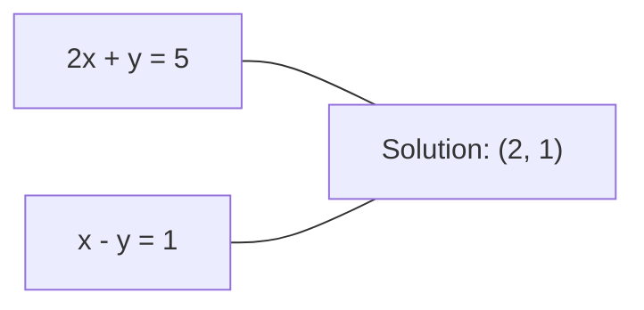
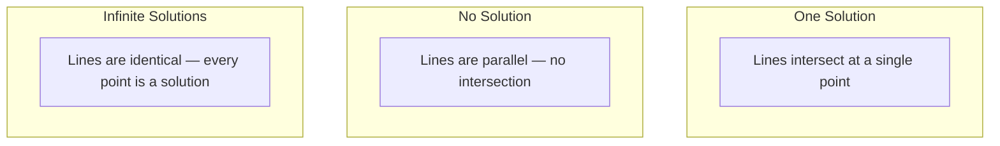

# Linear Systems / 线性方程组

> 求解 Ax = b 是数学中最古老的问题之一，而它今天仍在驱动你的神经网络。

**类型：** 构建
**语言：** Python
**前置要求：** Phase 1, Lessons 01 (Linear Algebra Intuition), 02 (Vectors & Matrices), 03 (Matrix Transformations)
**时间：** 约 120 分钟

## Learning Objectives / 学习目标

- 使用带 partial pivoting 的 Gaussian elimination 和 back substitution 求解 Ax = b
- 用 LU、QR 和 Cholesky decompositions 分解矩阵，并解释各自适用场景
- 推导 least squares 的 normal equations，并把它们连接到 linear regression 和 ridge regression
- 使用 condition number 诊断 ill-conditioned systems，并用 regularization 稳定它们

## The Problem / 问题

每次训练 linear regression，你都在解一个 linear system。每次计算 least-squares fit，你都在解 linear system。每次 neural network layer 计算 `y = Wx + b`，它都在评估 linear system 的一边。加 regularization 时，你在修改这个 system。使用 Gaussian processes 时，你在分解一个矩阵。为 Mahalanobis distance 求 covariance matrix 的逆时，你也在解 linear system。

方程 Ax = b 无处不在。A 是已知 coefficients 的矩阵。b 是已知 outputs 的向量。x 是你要找到的 unknowns 向量。在线性回归中，A 是 data matrix，b 是 target vector，x 是 weight vector。整个模型可以归结为：找到 x，让 Ax 尽可能接近 b。

本课会从零构建求解这个方程的主要方法。你会理解为什么一些方法快、另一些方法稳定，为什么一些方法只适用于 square systems、另一些能处理 overdetermined systems，以及为什么 matrix 的 condition number 决定你的答案到底有没有意义。

## The Concept / 概念

### What Ax = b means geometrically / Ax = b 的几何意义

一组 linear equations 有几何解释。每个 equation 定义一个 hyperplane。Solution 是所有 hyperplanes 的交点，或交点集合。

```
2x + y = 5          Two lines in 2D.
x - y  = 1          They intersect at x=2, y=1.
```



可能发生三种情况：



在 matrix form 中，“one solution” 表示 A invertible。“No solution” 表示 system inconsistent。“Infinite solutions” 表示 A 有 null space。大多数 ML problems 属于“没有精确解”这一类，因为 equations（data points）比 unknowns（parameters）多。这就是 least squares 出场的地方。

### Column picture vs row picture / 列视角与行视角

读 Ax = b 有两种方式。

**Row picture。** A 的每一行定义一个 equation。每个 equation 是一个 hyperplane。Solution 是它们的交点。

**Column picture。** A 的每一列是一个 vector。问题变成：A 的 columns 经过什么 linear combination 能产生 b？

```
A = | 2  1 |    b = | 5 |
    | 1 -1 |        | 1 |

Row picture: solve 2x + y = 5 and x - y = 1 simultaneously.

Column picture: find x1, x2 such that:
  x1 * [2, 1] + x2 * [1, -1] = [5, 1]
  2 * [2, 1] + 1 * [1, -1] = [4+1, 2-1] = [5, 1]   check.
```

Column picture 更基础。如果 b 位于 A 的 column space，system 有解。如果 b 不在 column space 中，你就寻找 column space 中离它最近的点。那个最近点就是 least-squares solution。

### Gaussian elimination / Gaussian elimination

Gaussian elimination 会把 Ax = b 转换为 upper triangular system Ux = c，然后通过 back substitution 求解。这是最直接的方法。

算法：

```
1. For each column k (the pivot column):
   a. Find the largest entry in column k at or below row k (partial pivoting).
   b. Swap that row with row k.
   c. For each row i below k:
      - Compute multiplier m = A[i][k] / A[k][k]
      - Subtract m times row k from row i.
2. Back substitute: solve from the last equation upward.
```

例子：

```
Original:
| 2  1  1 | 8 |       R2 = R2 - (2)R1     | 2  1   1 |  8 |
| 4  3  3 |20 |  -->  R3 = R3 - (1)R1 --> | 0  1   1 |  4 |
| 2  3  1 |12 |                            | 0  2   0 |  4 |

                       R3 = R3 - (2)R2     | 2  1   1 |  8 |
                                       --> | 0  1   1 |  4 |
                                           | 0  0  -2 | -4 |

Back substitute:
  -2 * x3 = -4    -->  x3 = 2
  x2 + 2  = 4     -->  x2 = 2
  2*x1 + 2 + 2 = 8 --> x1 = 2
```

Gaussian elimination 需要 O(n^3) operations。对 1000x1000 system，大约是十亿次 floating-point operations。它很快，但如果你需要用同一个 A 求解多个 systems，还可以更高效。

### Partial pivoting: why it matters / Partial pivoting 为什么重要

没有 pivoting，Gaussian elimination 可能失败或给出垃圾结果。如果 pivot element 是零，你会除以零。如果它很小，你会放大 rounding errors。

```
Bad pivot:                       With partial pivoting:
| 0.001  1 | 1.001 |            Swap rows first:
| 1      1 | 2     |            | 1      1 | 2     |
                                 | 0.001  1 | 1.001 |
m = 1/0.001 = 1000              m = 0.001/1 = 0.001
R2 = R2 - 1000*R1               R2 = R2 - 0.001*R1
| 0.001  1     | 1.001   |      | 1      1     | 2     |
| 0     -999   | -999.0  |      | 0      0.999 | 0.999 |

x2 = 1.000 (correct)            x2 = 1.000 (correct)
x1 = (1.001 - 1)/0.001          x1 = (2 - 1)/1 = 1.000 (correct)
   = 0.001/0.001 = 1.000        Stable because the multiplier is small.
```

在有限 precision 的 floating-point arithmetic 中，未 pivot 的版本会损失 significant digits。Partial pivoting 总是选择当前可用的最大 pivot，以最小化 error amplification。

### LU decomposition / LU 分解

LU decomposition 把 A 分解为 lower triangular matrix L 和 upper triangular matrix U：A = LU。L matrix 存储 Gaussian elimination 中的 multipliers。U matrix 是 elimination 的结果。

```
A = L @ U

| 2  1  1 |   | 1  0  0 |   | 2  1   1 |
| 4  3  3 | = | 2  1  0 | @ | 0  1   1 |
| 2  3  1 |   | 1  2  1 |   | 0  0  -2 |
```

为什么要 factor，而不是直接 eliminate？因为一旦有了 L 和 U，为任意新 b 求解 Ax = b 只需要 O(n^2)：

```
Ax = b
LUx = b
Let y = Ux:
  Ly = b    (forward substitution, O(n^2))
  Ux = y    (back substitution, O(n^2))
```

O(n^3) 的成本只在 factorization 时付一次。后续每次 solve 都是 O(n^2)。如果你要用同一个 A、不同 b vectors 解 1000 个 systems，LU 会在总工作量上节省大约 1000/3 倍。

带 partial pivoting 时，你得到 PA = LU，其中 P 是记录 row swaps 的 permutation matrix。

### QR decomposition / QR 分解

QR decomposition 把 A 分解为 orthogonal matrix Q 和 upper triangular matrix R：A = QR。

Orthogonal matrix 满足 Q^T Q = I。它的 columns 是 orthonormal vectors。乘以 Q 会保持 lengths 和 angles。

```
A = Q @ R

Q has orthonormal columns: Q^T Q = I
R is upper triangular

To solve Ax = b:
  QRx = b
  Rx = Q^T b    (just multiply by Q^T, no inversion needed)
  Back substitute to get x.
```

对于 least-squares problems，QR 比 LU 数值上更稳定。Gram-Schmidt process 会逐列构建 Q：

```
Given columns a1, a2, ... of A:

q1 = a1 / ||a1||

q2 = a2 - (a2 . q1) * q1        (subtract projection onto q1)
q2 = q2 / ||q2||                (normalize)

q3 = a3 - (a3 . q1) * q1 - (a3 . q2) * q2
q3 = q3 / ||q3||

R[i][j] = qi . aj    for i <= j
```

每一步都会移除沿所有 previous q vectors 的 component，只留下新的 orthogonal direction。

### Cholesky decomposition / Cholesky 分解

当 A symmetric（A = A^T）且 positive definite（所有 eigenvalues 为正）时，可以把它分解为 A = L L^T，其中 L 是 lower triangular。这就是 Cholesky decomposition。

```
A = L @ L^T

| 4  2 |   | 2  0 |   | 2  1 |
| 2  5 | = | 1  2 | @ | 0  2 |

L[i][i] = sqrt(A[i][i] - sum(L[i][k]^2 for k < i))
L[i][j] = (A[i][j] - sum(L[i][k]*L[j][k] for k < j)) / L[j][j]    for i > j
```

Cholesky 比 LU 快两倍，并且只需要一半存储。它只适用于 symmetric positive definite matrices，但这些矩阵经常出现：

- Covariance matrices 是 symmetric positive semi-definite，加 regularization 后 positive definite。
- Gaussian processes 中的 kernel matrix 是 symmetric positive definite。
- Convex function 在 minimum 处的 Hessian 是 symmetric positive definite。
- A^T A 永远是 symmetric positive semi-definite。

在 Gaussian processes 中，你用 Cholesky factorization 分解 kernel matrix K，然后求解 K alpha = y 得到 predictive mean。Cholesky factor 也给出 marginal likelihood 的 log-determinant：log det(K) = 2 * sum(log(diag(L)))。

### Least squares: when Ax = b has no exact solution / Least squares：当 Ax = b 没有精确解

如果 A 是 m x n 且 m > n，也就是 equations 比 unknowns 多，那么 system 是 overdetermined。通常没有精确解。于是你最小化 squared error：

```
minimize ||Ax - b||^2

This is the sum of squared residuals:
  sum((A[i,:] @ x - b[i])^2 for i in range(m))
```

Minimizer 满足 normal equations：

```
A^T A x = A^T b
```

推导：展开 ||Ax - b||^2 = (Ax - b)^T (Ax - b) = x^T A^T A x - 2 x^T A^T b + b^T b。对 x 求 gradient 并置零：2 A^T A x - 2 A^T b = 0。

```
Original system (overdetermined, 4 equations, 2 unknowns):
| 1  1 |         | 3 |
| 1  2 | x     = | 5 |       No exact x satisfies all 4 equations.
| 1  3 |         | 6 |
| 1  4 |         | 8 |

Normal equations:
A^T A = | 4  10 |    A^T b = | 22 |
        | 10 30 |            | 63 |

Solve: x = [1.5, 1.7]

This is linear regression. x[0] is the intercept, x[1] is the slope.
```

### Normal equations = linear regression / Normal equations 就是 linear regression

二者完全等价。Linear regression 中，data matrix X 每一行对应一个 sample，每一列对应一个 feature。Target vector y 每个 entry 对应一个 sample。Weight vector w 满足：

```
X^T X w = X^T y
w = (X^T X)^(-1) X^T y
```

这是 linear regression 的 closed-form solution。每次调用 `sklearn.linear_model.LinearRegression.fit()` 都在计算它，或通过 QR/SVD 计算等价形式。

加一个 regularization term lambda * I 到矩阵上，就得到 ridge regression：

```
(X^T X + lambda * I) w = X^T y
w = (X^T X + lambda * I)^(-1) X^T y
```

Regularization 会改善 matrix conditioning，让它更容易准确 invert，并通过把 weights 向零收缩来防止 overfitting。当 lambda > 0 时，X^T X + lambda * I 永远是 symmetric positive definite，所以可以用 Cholesky 求解。

### Pseudoinverse (Moore-Penrose) / 伪逆（Moore-Penrose）

Pseudoinverse A+ 把 matrix inversion 推广到 non-square 和 singular matrices。对任意矩阵 A：

```
x = A+ b

where A+ = V Sigma+ U^T    (computed via SVD)
```

Sigma+ 通过取每个非零 singular value 的 reciprocal，并转置结果得到。如果 A = U Sigma V^T，那么 A+ = V Sigma+ U^T。

```
A = U Sigma V^T        (SVD)

Sigma = | 5  0 |       Sigma+ = | 1/5  0  0 |
        | 0  2 |                | 0  1/2  0 |
        | 0  0 |

A+ = V Sigma+ U^T
```

Pseudoinverse 给出 minimum-norm least-squares solution。如果 system 有：
- 一个解：A+ b 给出它。
- 无解：A+ b 给出 least-squares solution。
- 无穷多解：A+ b 给出 ||x|| 最小的那个解。

NumPy 的 `np.linalg.lstsq` 和 `np.linalg.pinv` 内部都使用 SVD。

### Condition number / 条件数

Condition number 衡量 solution 对 input 小变化有多敏感。对矩阵 A，condition number 是：

```
kappa(A) = ||A|| * ||A^(-1)|| = sigma_max / sigma_min
```

其中 sigma_max 和 sigma_min 是最大和最小 singular values。

```
Well-conditioned (kappa ~ 1):        Ill-conditioned (kappa ~ 10^15):
Small change in b -->                Small change in b -->
small change in x                    huge change in x

| 2  0 |   kappa = 2/1 = 2          | 1   1          |   kappa ~ 10^15
| 0  1 |   safe to solve            | 1   1+10^(-15) |   solution is garbage
```

经验规则：
- kappa < 100：安全，solution 准确。
- kappa ~ 10^k：你会损失大约 k 位 floating-point precision。
- kappa ~ 10^16（对 float64）：solution 没有意义。矩阵实际上是 singular。

在 ML 中，ill-conditioning 会在 features 近似 collinear 时出现。Regularization（添加 lambda * I）会把 condition number 从 sigma_max / sigma_min 改善为 (sigma_max + lambda) / (sigma_min + lambda)。

### Iterative methods: conjugate gradient / 迭代方法：conjugate gradient

对 very large sparse systems（数百万 unknowns），LU 或 Cholesky 这样的 direct methods 太昂贵。Iterative methods 会通过许多 iterations 改进一个猜测，逐步逼近 solution。

Conjugate gradient（CG）在 A symmetric positive definite 时求解 Ax = b。在 exact arithmetic 中，它最多 n iterations 找到精确解；如果 A 的 eigenvalues 聚集，通常更快收敛。

```
Algorithm sketch:
  x0 = initial guess (often zero)
  r0 = b - A x0           (residual)
  p0 = r0                 (search direction)

  For k = 0, 1, 2, ...:
    alpha = (rk . rk) / (pk . A pk)
    x_{k+1} = xk + alpha * pk
    r_{k+1} = rk - alpha * A pk
    beta = (r_{k+1} . r_{k+1}) / (rk . rk)
    p_{k+1} = r_{k+1} + beta * pk
    if ||r_{k+1}|| < tolerance: stop
```

CG 用于：
- Large-scale optimization（Newton-CG method）
- 求解 PDE discretizations
- Kernel methods，其中 kernel matrix 太大无法 factor
- 给其他 iterative solvers 做 preconditioning

Convergence rate 取决于 condition number。Conditioning 越好，system 收敛越快，这也是 regularization 有帮助的另一个原因。

### The full picture: which method when / 全局图：什么时候用哪种方法

| Method | Requirements | Cost | Use case |
|--------|-------------|------|----------|
| Gaussian elimination | Square, nonsingular A | O(n^3) | 一次性求解 square system |
| LU decomposition | Square, nonsingular A | O(n^3) factor + O(n^2) solve | 同一个 A 上多次求解 |
| QR decomposition | Any A (m >= n) | O(mn^2) | Least squares，数值稳定 |
| Cholesky | Symmetric positive definite A | O(n^3/3) | Covariance matrices、Gaussian processes、ridge regression |
| Normal equations | Overdetermined (m > n) | O(mn^2 + n^3) | Linear regression（small n） |
| SVD / pseudoinverse | Any A | O(mn^2) | Rank-deficient systems、minimum-norm solutions |
| Conjugate gradient | Symmetric positive definite, sparse A | O(n * k * nnz) | Large sparse systems，k = iterations |

### Connection to ML / 与 ML 的连接

本课中的每种方法都会出现在 production ML 中：

**Linear regression。** Closed-form solution 会求解 normal equations X^T X w = X^T y。小 n 时用 Cholesky，重视数值稳定性时用 QR，如果 matrix 可能 rank-deficient，就用 SVD。

**Ridge regression。** 给 X^T X 添加 lambda * I。Regularized system (X^T X + lambda * I) w = X^T y 总是可以用 Cholesky 求解，因为当 lambda > 0 时，X^T X + lambda * I 是 symmetric positive definite。

**Gaussian processes。** Predictive mean 需要求解 K alpha = y，其中 K 是 kernel matrix。标准做法是对 K 做 Cholesky factorization。Log marginal likelihood 使用 log det(K) = 2 sum(log(diag(L)))。

**Neural network initialization。** Orthogonal initialization 使用 QR decomposition 生成 columns orthonormal 的 weight matrices。这会防止 deep networks 中 signal collapse。

**Preconditioning。** Large-scale optimizers 使用 incomplete Cholesky 或 incomplete LU 作为 conjugate gradient solvers 的 preconditioners。

**Feature engineering。** X^T X 的 condition number 告诉你 features 是否 collinear。如果 kappa 很大，就丢掉一些 features 或添加 regularization。

```figure
linear-system-conditioning
```

## Build It / 动手构建

### Step 1: Gaussian elimination with partial pivoting / 第 1 步：带 partial pivoting 的 Gaussian elimination

```python
import numpy as np

def gaussian_elimination(A, b):
    n = len(b)
    Ab = np.hstack([A.astype(float), b.reshape(-1, 1).astype(float)])

    for k in range(n):
        max_row = k + np.argmax(np.abs(Ab[k:, k]))
        Ab[[k, max_row]] = Ab[[max_row, k]]

        if abs(Ab[k, k]) < 1e-12:
            raise ValueError(f"Matrix is singular or nearly singular at pivot {k}")

        for i in range(k + 1, n):
            m = Ab[i, k] / Ab[k, k]
            Ab[i, k:] -= m * Ab[k, k:]

    x = np.zeros(n)
    for i in range(n - 1, -1, -1):
        x[i] = (Ab[i, -1] - Ab[i, i+1:n] @ x[i+1:n]) / Ab[i, i]

    return x
```

### Step 2: LU decomposition / 第 2 步：LU decomposition

```python
def lu_decompose(A):
    n = A.shape[0]
    L = np.eye(n)
    U = A.astype(float).copy()
    P = np.eye(n)

    for k in range(n):
        max_row = k + np.argmax(np.abs(U[k:, k]))
        if max_row != k:
            U[[k, max_row]] = U[[max_row, k]]
            P[[k, max_row]] = P[[max_row, k]]
            if k > 0:
                L[[k, max_row], :k] = L[[max_row, k], :k]

        for i in range(k + 1, n):
            L[i, k] = U[i, k] / U[k, k]
            U[i, k:] -= L[i, k] * U[k, k:]

    return P, L, U

def lu_solve(P, L, U, b):
    n = len(b)
    Pb = P @ b.astype(float)

    y = np.zeros(n)
    for i in range(n):
        y[i] = Pb[i] - L[i, :i] @ y[:i]

    x = np.zeros(n)
    for i in range(n - 1, -1, -1):
        x[i] = (y[i] - U[i, i+1:] @ x[i+1:]) / U[i, i]

    return x
```

### Step 3: Cholesky decomposition / 第 3 步：Cholesky decomposition

```python
def cholesky(A):
    n = A.shape[0]
    L = np.zeros_like(A, dtype=float)

    for i in range(n):
        for j in range(i + 1):
            s = A[i, j] - L[i, :j] @ L[j, :j]
            if i == j:
                if s <= 0:
                    raise ValueError("Matrix is not positive definite")
                L[i, j] = np.sqrt(s)
            else:
                L[i, j] = s / L[j, j]

    return L
```

### Step 4: Least squares via normal equations / 第 4 步：通过 normal equations 做 least squares

```python
def least_squares_normal(A, b):
    AtA = A.T @ A
    Atb = A.T @ b
    return gaussian_elimination(AtA, Atb)

def ridge_regression(A, b, lam):
    n = A.shape[1]
    AtA = A.T @ A + lam * np.eye(n)
    Atb = A.T @ b
    L = cholesky(AtA)
    y = np.zeros(n)
    for i in range(n):
        y[i] = (Atb[i] - L[i, :i] @ y[:i]) / L[i, i]
    x = np.zeros(n)
    for i in range(n - 1, -1, -1):
        x[i] = (y[i] - L.T[i, i+1:] @ x[i+1:]) / L.T[i, i]
    return x
```

### Step 5: Condition number / 第 5 步：Condition number

```python
def condition_number(A):
    U, S, Vt = np.linalg.svd(A)
    return S[0] / S[-1]
```

## Use It / 应用它

把这些组件放到 real data 上，做 linear regression 和 ridge regression：

```python
np.random.seed(42)
X_raw = np.random.randn(100, 3)
w_true = np.array([2.0, -1.0, 0.5])
y = X_raw @ w_true + np.random.randn(100) * 0.1

X = np.column_stack([np.ones(100), X_raw])

w_ols = least_squares_normal(X, y)
print(f"OLS weights (ours):    {w_ols}")

w_np = np.linalg.lstsq(X, y, rcond=None)[0]
print(f"OLS weights (numpy):   {w_np}")
print(f"Max difference: {np.max(np.abs(w_ols - w_np)):.2e}")

w_ridge = ridge_regression(X, y, lam=1.0)
print(f"Ridge weights (ours):  {w_ridge}")

from sklearn.linear_model import Ridge
ridge_sk = Ridge(alpha=1.0, fit_intercept=False)
ridge_sk.fit(X, y)
print(f"Ridge weights (sklearn): {ridge_sk.coef_}")
```

## Ship It / 交付它

本课产出：
- `code/linear_systems.py`，包含 Gaussian elimination、LU decomposition、Cholesky decomposition、least squares 和 ridge regression 的 from-scratch implementations
- 一个 working demonstration，展示 normal equations 与 sklearn 的 LinearRegression 产生相同 weights

## Exercises / 练习

1. 使用你的 Gaussian elimination、LU solver 和 `np.linalg.solve` 求解 system `[[1,2,3],[4,5,6],[7,8,10]] x = [6, 15, 27]`。验证三者在 floating-point tolerance 内给出同样答案。

2. 生成一个 50x5 random matrix X 和 target y = X @ w_true + noise。分别使用 normal equations、QR（通过 `np.linalg.qr`）、SVD（通过 `np.linalg.svd`）和 `np.linalg.lstsq` 求解 w。比较四个 solutions。测量 X^T X 的 condition number，并解释它如何影响你信任哪种方法。

3. 创建一个 nearly singular matrix，让两列几乎相同，例如 column 2 = column 1 + 1e-10 * noise。计算 condition number。分别在有无 regularization（添加 0.01 * I）时求解 Ax = b。比较 solutions 和 residuals。解释为什么 regularization 有帮助。

4. 为一个 100x100 random symmetric positive definite matrix 实现 conjugate gradient algorithm。统计达到 tolerance 1e-8 需要多少 iterations。与理论最多 n iterations 对比。

5. 在 size 10、50、200、500 的 symmetric positive definite matrices 上，对比你的 Cholesky solver、LU solver 和 `np.linalg.solve` 的耗时。绘图。验证 Cholesky 大约比 LU 快 2 倍。

## Key Terms / 关键术语

| 术语 | 常见说法 | 实际含义 |
|------|----------------|----------------------|
| Linear system | “求 x” | 一组 linear equations Ax = b。找到 x，就是找到 transformation A 下产生 output b 的 input。 |
| Gaussian elimination | “行约简” | 用 row operations 系统地把 diagonal 下方 entries 清零，得到 upper triangular system，再用 back substitution 求解。O(n^3)。 |
| Partial pivoting | “换行保证稳定” | 在 column k 做 elimination 前，把该列绝对值最大的 row 换到 pivot position。防止除以小数。 |
| LU decomposition | “分解成三角矩阵” | 写成 A = LU，其中 L lower triangular（存 multipliers），U upper triangular（eliminated matrix）。把 O(n^3) 成本摊到多次 solves 上。 |
| QR decomposition | “正交分解” | 写成 A = QR，其中 Q columns orthonormal，R upper triangular。对 least squares 比 LU 更稳定。 |
| Cholesky decomposition | “矩阵平方根” | 对 symmetric positive definite A，写成 A = LL^T。成本是 LU 的一半。用于 covariance matrices、kernel matrices 和 ridge regression。 |
| Least squares | “精确不可能时的最佳拟合” | 当 system overdetermined（equations 多于 unknowns）时，最小化 squared residuals 之和 ||Ax - b||^2。 |
| Normal equations | “微积分捷径” | A^T A x = A^T b。把 ||Ax - b||^2 的 gradient 置零。这就是 linear regression 的 closed-form solution。 |
| Pseudoinverse | “非方阵的逆” | 通过 SVD 得到 A+ = V Sigma+ U^T。对任意矩阵给出 minimum-norm least-squares solution，无论 square/rectangular、singular 与否。 |
| Condition number | “答案有多可信” | kappa = sigma_max / sigma_min。衡量对 input perturbations 的敏感性。大约损失 log10(kappa) 位 precision。 |
| Ridge regression | “Regularized least squares” | 求解 (X^T X + lambda I) w = X^T y。添加 lambda I 改善 conditioning，并把 weights 向零收缩，防止 overfitting。 |
| Conjugate gradient | “大矩阵的迭代 Ax=b” | 用于 symmetric positive definite systems 的 iterative solver。最多 n steps 收敛。适合 factorization 太贵的大型 sparse systems。 |
| Overdetermined system | “数据多于参数” | m-by-n system 中 m > n。没有精确解。Least squares 找最佳近似。这就是每个 regression problem。 |
| Back substitution | “从底向上求解” | 给定 upper triangular system，先解最后一个 equation，再向上代回。O(n^2)。 |
| Forward substitution | “从顶向下求解” | 给定 lower triangular system，先解第一个 equation，再向下代入。O(n^2)。用于 LU solves 的 L step。 |

## Further Reading / 延伸阅读

- [MIT 18.06: Linear Algebra](https://ocw.mit.edu/courses/18-06-linear-algebra-spring-2010/) (Gilbert Strang) -- 线性系统和矩阵分解的经典课程
- [Numerical Linear Algebra](https://people.maths.ox.ac.uk/trefethen/text.html) (Trefethen & Bau) -- 理解 numerical stability、conditioning 和算法失效原因的标准参考
- [Matrix Computations](https://www.cs.cornell.edu/cv/GolubVanLoan4/golubandvanloan.htm) (Golub & Van Loan) -- 各类 matrix algorithm 的百科式参考
- [3Blue1Brown: Inverse Matrices](https://www.3blue1brown.com/lessons/inverse-matrices) -- 用可视化直觉理解求解 Ax = b 的几何意义
