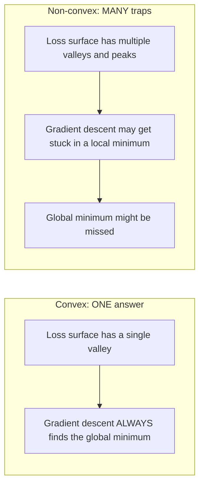
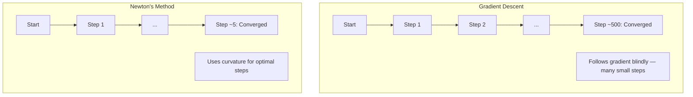
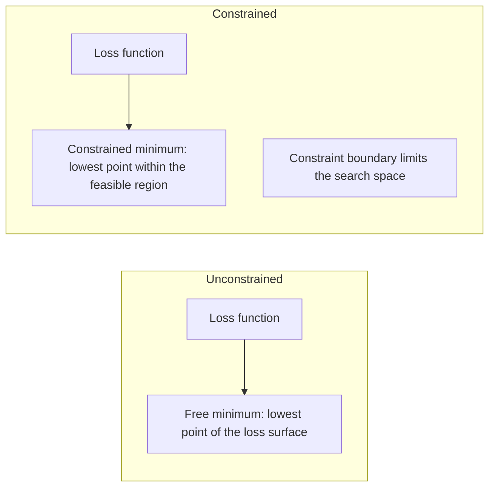
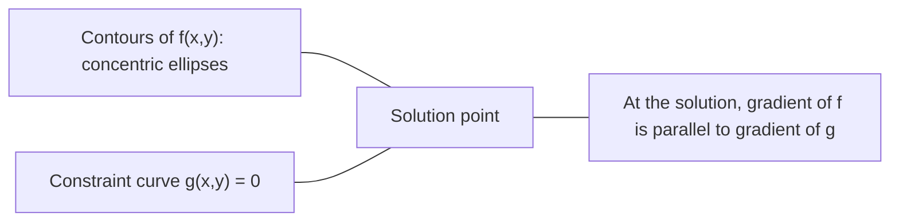

# Convex Optimization / 凸优化

> 凸问题只有一个山谷。神经网络有数百万个。理解差异很重要。

**类型：** 构建
**语言：** Python
**前置要求：** Phase 1, Lessons 04 (Calculus for ML), 08 (Optimization)
**时间：** 约 90 分钟

## Learning Objectives / 学习目标

- 使用定义、second derivative 和 Hessian criteria 测试函数是否 convex
- 实现 Newton's method，并把它的 quadratic convergence 与 gradient descent 对比
- 使用 Lagrange multipliers 求解 constrained optimization problems，并解释 KKT conditions
- 解释为什么 neural network loss landscapes 是 non-convex，但 SGD 仍能找到好解

## The Problem / 问题

Lesson 08 教了 gradient descent、momentum 和 Adam。这些 optimizers 会在任意曲面上向下走。但它们没有保证。Non-convex landscape 上的 gradient descent 可能落到坏 local minimum，卡在 saddle point，或永远 oscillate。你仍然使用它，因为 neural networks 是 non-convex，而且没有真正替代品。

但 machine learning 中很多问题是 convex 的。Linear regression、logistic regression、SVMs、LASSO、ridge regression。对这些问题，有更强的东西：带数学保证的 optimization。Convex problem 只有一个山谷。任何向下走的算法都会到达 global minimum。不需要重启，不需要 learning rate schedules，也不需要祈祷。

理解 convexity 有三个作用。第一，它告诉你问题是 easy（convex）还是 hard（non-convex）。第二，它给你 Newton's method 这样的更快工具来解 convex problems。第三，它解释 ML 中反复出现的概念：regularization as a constraint、SVMs 中的 duality，以及为什么 deep learning 虽然违反了 convexity 的美好性质，却仍然有效。

## The Concept / 概念

### Convex sets / 凸集

如果集合 S 中任意两点之间的 line segment 都完全位于 S 中，那么 S 是 convex。

| Convex sets | Not convex |
|---|---|
| **Rectangle**：内部任意两点连线都留在内部 | **Star/crescent shape**：内部两点连线可能穿出集合 |
| **Triangle**：所有内部点都满足相同性质 | **Donut/annulus**：洞会让某些 line segments 离开集合 |
| 任意两点之间的 line segment 都在集合内 | 某些点对之间的 line segment 会离开集合 |

Formal test：对 S 中任意 points x、y，以及任意 t in [0, 1]，点 tx + (1-t)y 也必须在 S 中。

Convex sets 的例子：
- 一条 line、一个 plane、整个 R^n
- 一个 ball（circle、sphere、hypersphere）
- 一个 halfspace：{x : a^T x <= b}
- 任意数量 convex sets 的 intersection

Non-convex sets 的例子：
- Donut（annulus）
- 两个 disjoint circles 的 union
- 任意带 “dent” 或 “hole” 的集合

### Convex functions / 凸函数

如果函数 f 的 domain 是 convex set，并且对 domain 中任意两个点 x、y 和任意 t in [0, 1]：

```
f(tx + (1-t)y) <= t*f(x) + (1-t)*f(y)
```

那么 f 是 convex。

几何上：图像上任意两点之间的 line segment 都在 graph 上方或贴着 graph。

| Property | Convex function | Non-convex function |
|---|---|---|
| **Line segment test** | 图像上任意两点之间的 line 在 curve **上方或贴着** | 某些点之间的 line 会跌到 curve **下方** |
| **Shape** | 单个向上弯曲的 bowl/valley | 多个 peaks 和 valleys，curvature 混合 |
| **Local minima** | 每个 local minimum 都是 global minimum | 可能存在高度不同的多个 local minima |

常见 convex functions：
- f(x) = x^2（parabola）
- f(x) = |x|（absolute value）
- f(x) = e^x（exponential）
- f(x) = max(0, x)（ReLU，虽然是 piecewise linear）
- x > 0 上的 f(x) = -log(x)（negative log）
- 任意 linear function f(x) = a^T x + b（既 convex 也 concave）

### Testing for convexity / 测试 convexity

三个实用测试，从最简单到最严谨。

**Test 1：Second derivative test（1D）。** 如果对所有 x，f''(x) >= 0，那么 f 是 convex。

- f(x) = x^2：f''(x) = 2 >= 0。Convex。
- f(x) = x^3：f''(x) = 6x。x < 0 时为负。Not convex。
- f(x) = e^x：f''(x) = e^x > 0。Convex。

**Test 2：Hessian test（multivariate）。** 如果 Hessian matrix H(x) 对所有 x 都 positive semidefinite，那么 f 是 convex。Hessian 是 second partial derivatives 的矩阵。

**Test 3：Definition test。** 直接检查 inequality f(tx + (1-t)y) <= t*f(x) + (1-t)*f(y)。适用于 derivatives 难算的函数。

### Why convexity matters / 为什么 convexity 重要

Convex optimization 的核心定理：

**对 convex function，每个 local minimum 都是 global minimum。**

这意味着 gradient descent 不会被困住。任何 downhill path 都通向同一个答案。算法保证收敛到 optimal solution。



结果：
- 不需要 random restarts
- 不需要复杂 learning rate schedules
- 可以证明 convergence（rate 取决于函数性质）
- Solution 是唯一的，flat regions 除外

### Convex vs non-convex in ML / ML 中的 convex 与 non-convex

| Problem | Convex? | Why |
|---------|---------|-----|
| Linear regression (MSE) | 是 | Loss 对 weights 是 quadratic |
| Logistic regression | 是 | Log-loss 对 weights 是 convex |
| SVM (hinge loss) | 是 | Linear functions 的 maximum |
| LASSO (L1 regression) | 是 | Convex functions 之和仍是 convex |
| Ridge regression (L2) | 是 | Quadratic + quadratic = convex |
| Neural network (any loss) | 否 | Nonlinear activations 产生 non-convex landscape |
| k-means clustering | 否 | Discrete assignment step |
| Matrix factorization | 否 | Unknowns 的乘积 |

带 convex losses 的 linear models 是 convex。只要加上带 nonlinear activations 的 hidden layers，convexity 就破坏了。

### The Hessian matrix / Hessian 矩阵

函数 f: R^n -> R 的 Hessian H 是 n x n 的 second partial derivatives 矩阵。

```
H[i][j] = d^2 f / (dx_i dx_j)
```

对 f(x, y) = x^2 + 3xy + y^2：

```
df/dx = 2x + 3y       d^2f/dx^2 = 2      d^2f/dxdy = 3
df/dy = 3x + 2y       d^2f/dydx = 3      d^2f/dy^2 = 2

H = [ 2  3 ]
    [ 3  2 ]
```

Hessian 告诉你 curvature：
- Eigenvalues 全为正：函数在每个方向上都向上弯（该点处 convex）
- Eigenvalues 全为负：每个方向都向下弯（concave，local max）
- 符号混合：saddle point（某些方向向上，另一些向下）
- Zero eigenvalue：该方向 flat（degenerate）

要判断 convexity，Hessian 必须在所有地方 positive semidefinite（所有 eigenvalues >= 0），而不只是在某一点。

### Newton's method / Newton 方法

Gradient descent 使用 first-order information（gradient）。Newton's method 使用 second-order information（Hessian）。它在当前点拟合一个 quadratic approximation，并直接跳到该二次函数的 minimum。

```
Update rule:
  x_new = x - H^(-1) * gradient

Compare to gradient descent:
  x_new = x - lr * gradient
```

Newton's method 用 inverse Hessian 替代 scalar learning rate。这会根据 local curvature 自动调整 step size 和 direction。



优势：
- 接近 minimum 时 quadratic convergence，error 每一步近似平方缩小
- 不需要调 learning rate
- Scale-invariant，不依赖你如何参数化问题

劣势：
- 计算 Hessian 需要 O(n^2) memory，求逆需要 O(n^3)
- 对 100 万 weights 的 neural network，这是 10^12 entries 和 10^18 operations
- 对 deep learning 不现实

### Constrained optimization / 约束优化

Unconstrained optimization：在所有 x 上 minimize f(x)。
Constrained optimization：在 constraints 下 minimize f(x)。

真实问题有 constraints。你想 minimize cost，但 budget 有限。你想 minimize error，但 model complexity 有边界。



### Lagrange multipliers / Lagrange 乘子

Lagrange multipliers 方法会把 constrained problem 转换成 unconstrained problem。

问题：minimize f(x) subject to g(x) = 0。

解法：引入一个新变量，也就是 Lagrange multiplier lambda，求解 unconstrained problem：

```
L(x, lambda) = f(x) + lambda * g(x)
```

在 solution 处，L 的 gradient 为零：

```
dL/dx = df/dx + lambda * dg/dx = 0
dL/dlambda = g(x) = 0
```

几何直觉：在 constrained minimum 处，f 的 gradient 必须与 constraint g 的 gradient 平行。如果不平行，你就可以沿着 constraint surface 移动，并进一步降低 f。



例子：minimize f(x,y) = x^2 + y^2 subject to x + y = 1。

```
L = x^2 + y^2 + lambda(x + y - 1)

dL/dx = 2x + lambda = 0  =>  x = -lambda/2
dL/dy = 2y + lambda = 0  =>  y = -lambda/2
dL/dlambda = x + y - 1 = 0

From first two: x = y
Substituting: 2x = 1, so x = y = 0.5, lambda = -1
```

直线 x + y = 1 上离 origin 最近的点是 (0.5, 0.5)。

### KKT conditions / KKT 条件

Karush-Kuhn-Tucker conditions 把 Lagrange multipliers 扩展到 inequality constraints。

问题：minimize f(x) subject to g_i(x) <= 0 for i = 1, ..., m。

KKT conditions（optimality 的必要条件）：

```
1. Stationarity:    df/dx + sum(lambda_i * dg_i/dx) = 0
2. Primal feasibility:  g_i(x) <= 0  for all i
3. Dual feasibility:    lambda_i >= 0  for all i
4. Complementary slackness:  lambda_i * g_i(x) = 0  for all i
```

Complementary slackness 是关键洞见：constraint 要么 active（g_i = 0，solution 位于 boundary），要么 multiplier 为零（constraint 不起作用）。不影响 solution 的 constraint，其 lambda = 0。

KKT conditions 对 SVMs 很核心。Support vectors 是 constraint active 的 data points（lambda > 0）。其他 data points 的 lambda = 0，不影响 decision boundary。

### Regularization as constrained optimization / Regularization 是 constrained optimization

L1 和 L2 regularization 不是随意技巧。它们是伪装过的 constrained optimization problems。

**L2 regularization（Ridge）：**

```
minimize  Loss(w)  subject to  ||w||^2 <= t

Equivalent unconstrained form:
minimize  Loss(w) + lambda * ||w||^2
```

Constraint ||w||^2 <= t 定义一个 ball，在 2D 中是 circle，在 3D 中是 sphere。Solution 是 loss contours 首次接触这个 ball 的地方。

**L1 regularization（LASSO）：**

```
minimize  Loss(w)  subject to  ||w||_1 <= t

Equivalent unconstrained form:
minimize  Loss(w) + lambda * ||w||_1
```

Constraint ||w||_1 <= t 定义一个 diamond，在 2D 中是旋转后的 square。

| Property | L2 constraint (circle) | L1 constraint (diamond) |
|---|---|---|
| **Constraint shape** | Circle（高维中是 sphere） | Diamond（2D 中是 rotated square） |
| **Where loss contour touches** | Smooth boundary，circle 上任意点 | Corner，与某条 axis 对齐 |
| **Solution behavior** | Weights 小但非零 | 某些 weights 精确为零（sparse） |
| **Result** | Weight shrinkage | Feature selection |

这解释了为什么 L1 会产生 sparse models（feature selection），而 L2 只会缩小 weights。Diamond 有与 axes 对齐的 corners。Loss contours 更可能接触 corner，让一个或多个 weights 精确为零。

### Duality / 对偶性

每个 constrained optimization problem（primal）都有一个伴随问题（dual）。对 convex problems，primal 和 dual 有相同 optimal value。这叫 strong duality。

Lagrangian dual function：

```
Primal: minimize f(x) subject to g(x) <= 0
Lagrangian: L(x, lambda) = f(x) + lambda * g(x)
Dual function: d(lambda) = min_x L(x, lambda)
Dual problem: maximize d(lambda) subject to lambda >= 0
```

为什么 duality 重要：
- Dual problem 有时比 primal 更容易解
- SVMs 会在 dual form 中求解，此时问题依赖 data points 之间的 dot products，从而启用 kernel trick
- Dual 会提供 primal optimum 的 lower bound，可用于检查 solution quality

对 SVMs 来说：

```
Primal: find w, b that maximize the margin 2/||w|| subject to
        y_i(w^T x_i + b) >= 1 for all i

Dual:   maximize sum(alpha_i) - 0.5 * sum_ij(alpha_i * alpha_j * y_i * y_j * x_i^T x_j)
        subject to alpha_i >= 0 and sum(alpha_i * y_i) = 0

The dual only involves dot products x_i^T x_j.
Replace x_i^T x_j with K(x_i, x_j) to get the kernel trick.
```

### Why deep learning works despite non-convexity / 为什么 deep learning 虽然 non-convex 仍然有效

Neural network loss functions 非常 non-convex。按经典标准，优化它们应该失败。但 stochastic gradient descent 可靠地找到了好解。几个因素解释了这一点。

**大多数 local minima 足够好。** 在高维空间中，random critical points（gradient 为零的点）绝大多数是 saddle points，而不是 local minima。少数存在的 local minima，其 loss values 往往接近 global minimum。当 parameter space 有数百万维时，卡在糟糕 local minimum 的概率极低。

**真正障碍是 saddle points，而不是 local minima。** 对一个有 n 个 parameters 的函数，saddle point 的 curvature directions 有正有负。高维中的 random critical point，所有 n 个 eigenvalues 都为正（local minimum）的概率大约是 2^(-n)。几乎所有 critical points 都是 saddle points。SGD 的 noise 有助于逃离它们。

**Overparameterization 会平滑 landscape。** 参数数量多于 training examples 的 networks 有更平滑、更连通的 loss surfaces。Wider networks 有更少 bad local minima。这听起来反直觉，但经验上成立。

**Loss landscape structure：**

| Property | Low-dimensional space | High-dimensional space |
|---|---|---|
| **Landscape** | 许多孤立 peaks 和 valleys | 平滑连接的 valleys |
| **Minima** | 许多孤立 local minima | 很少 bad local minima；多数接近 optimal |
| **Navigation** | 很难找到 global minimum | 很多路径通向好解 |
| **Critical points** | local minima 和 saddle points 混合 | 压倒性多数是 saddle points，不是 local minima |

**Stochastic noise 作为 implicit regularization。** Mini-batch SGD 引入的 noise 会防止模型落入 sharp minima。Sharp minima 容易 overfit；flat minima 泛化更好。这个 noise 会让 optimization 偏向 loss landscape 的 flat regions。

### Second-order methods in practice / 实践中的二阶方法

纯 Newton's method 对大模型不现实。有几类近似让 second-order information 可用。

**L-BFGS（Limited-memory BFGS）：** 用最近 m 次 gradient differences 近似 inverse Hessian。需要 O(mn) memory，而不是 O(n^2)。适合最多约 10,000 parameters 的问题。用于 classical ML（logistic regression、CRFs），但不常用于 deep learning。

**Natural gradient：** 使用 Fisher information matrix（log-likelihood 的 expected Hessian）而不是标准 Hessian。这会考虑 probability distributions 的几何。K-FAC（Kronecker-Factored Approximate Curvature）把 Fisher matrix 近似为 Kronecker product，使其可用于 neural networks。

**Hessian-free optimization：** 使用 conjugate gradient 求解 Hx = g，但从不显式形成 H。只需要 Hessian-vector products，可以通过 automatic differentiation 在 O(n) time 中计算。

**Diagonal approximations：** Adam 的 second moment 是 Hessian diagonal 的 diagonal approximation。AdaHessian 进一步通过 Hutchinson's estimator 使用实际 Hessian diagonal elements。

| Method | Memory | Per-step cost | When to use |
|--------|--------|--------------|-------------|
| Gradient descent | O(n) | O(n) | Baseline, large models |
| Newton's method | O(n^2) | O(n^3) | Small convex problems |
| L-BFGS | O(mn) | O(mn) | Medium convex problems |
| Adam | O(n) | O(n) | Deep learning default |
| K-FAC | O(n) | O(n) per layer | Research, large-batch training |

```figure
convex-vs-nonconvex
```

## Build It / 动手构建

### Step 1: Convexity checker / 第 1 步：Convexity checker

构建一个 function，通过采样 points 并检查定义来 empirical test convexity。

```python
import random
import math

def check_convexity(f, dim, bounds=(-5, 5), samples=1000):
    violations = 0
    for _ in range(samples):
        x = [random.uniform(*bounds) for _ in range(dim)]
        y = [random.uniform(*bounds) for _ in range(dim)]
        t = random.uniform(0, 1)
        mid = [t * xi + (1 - t) * yi for xi, yi in zip(x, y)]
        lhs = f(mid)
        rhs = t * f(x) + (1 - t) * f(y)
        if lhs > rhs + 1e-10:
            violations += 1
    return violations == 0, violations
```

### Step 2: Newton's method for 2D / 第 2 步：2D Newton's method

使用 explicit Hessian 实现 Newton's method。对比它与 gradient descent 的 convergence speed。

```python
def newtons_method(f, grad_f, hessian_f, x0, steps=50, tol=1e-12):
    x = list(x0)
    history = [x[:]]
    for _ in range(steps):
        g = grad_f(x)
        H = hessian_f(x)
        det = H[0][0] * H[1][1] - H[0][1] * H[1][0]
        if abs(det) < 1e-15:
            break
        H_inv = [
            [H[1][1] / det, -H[0][1] / det],
            [-H[1][0] / det, H[0][0] / det],
        ]
        dx = [
            H_inv[0][0] * g[0] + H_inv[0][1] * g[1],
            H_inv[1][0] * g[0] + H_inv[1][1] * g[1],
        ]
        x = [x[0] - dx[0], x[1] - dx[1]]
        history.append(x[:])
        if sum(gi ** 2 for gi in g) < tol:
            break
    return history
```

### Step 3: Lagrange multiplier solver / 第 3 步：Lagrange multiplier solver

在 Lagrangian 上使用 gradient descent 求解 constrained optimization。

```python
def lagrange_solve(f_grad, g_val, g_grad, x0, lr=0.01,
                   lr_lambda=0.01, steps=5000):
    x = list(x0)
    lam = 0.0
    history = []
    for _ in range(steps):
        fg = f_grad(x)
        gv = g_val(x)
        gg = g_grad(x)
        x = [
            xi - lr * (fgi + lam * ggi)
            for xi, fgi, ggi in zip(x, fg, gg)
        ]
        lam = lam + lr_lambda * gv
        history.append((x[:], lam, gv))
    return history
```

### Step 4: Compare first-order vs second-order / 第 4 步：比较一阶与二阶方法

在同一个 quadratic function 上运行 gradient descent 和 Newton's method。统计达到 convergence 的 steps。

```python
def quadratic(x):
    return 5 * x[0] ** 2 + x[1] ** 2

def quadratic_grad(x):
    return [10 * x[0], 2 * x[1]]

def quadratic_hessian(x):
    return [[10, 0], [0, 2]]
```

Newton's method 会在 1 step 内收敛，因为对 quadratics 它是精确的。Gradient descent 会花数百 steps，因为 Hessian 的 eigenvalues 相差 5 倍，形成 elongated valley。

## Use It / 应用它

Convexity analysis 可以直接用于选择 ML models 和 solvers。

对 convex problems（logistic regression、SVMs、LASSO）：
- 使用专门 solvers（liblinear、CVXPY、`scipy.optimize.minimize` with method='L-BFGS-B'）
- 预期有唯一 global solution
- Second-order methods 实用且快速

对 non-convex problems（neural networks）：
- 使用 first-order methods（SGD、Adam）
- 接受 solution 会依赖 initialization 和 randomness
- 使用 overparameterization、noise 和 learning rate schedules 作为 implicit regularization
- 不要浪费时间寻找 global minimum。一个好的 local minimum 就足够。

```python
from scipy.optimize import minimize

result = minimize(
    fun=lambda w: sum((y - X @ w) ** 2) + 0.1 * sum(w ** 2),
    x0=np.zeros(d),
    method='L-BFGS-B',
    jac=lambda w: -2 * X.T @ (y - X @ w) + 0.2 * w,
)
```

对 SVMs，dual formulation 让你可以使用 kernel trick：

```python
from sklearn.svm import SVC

svm = SVC(kernel='rbf', C=1.0)
svm.fit(X_train, y_train)
print(f"Support vectors: {svm.n_support_}")
```

## Ship It / 交付它

本课交付一个 convex optimization 判断框架：先识别问题是否 convex，再选择有保证的 solver；如果是 non-convex，就使用适合 deep learning 的一阶方法和正则化策略。

## Exercises / 练习

1. **Convexity gallery。** 用 checker 测试这些 functions 的 convexity：f(x) = x^4、f(x) = sin(x)、f(x,y) = x^2 + y^2、f(x,y) = x*y、f(x) = max(x, 0)。解释每个结果为什么合理。

2. **Newton vs gradient descent race。** 从 starting point (10, 10) 出发，在 f(x,y) = 50*x^2 + y^2 上运行两种方法。每种方法需要多少 steps 才能达到 loss < 1e-10？当 condition number（最大与最小 Hessian eigenvalue 之比）增加时，gradient descent 会发生什么？

3. **Lagrange multiplier geometry。** Minimize f(x,y) = (x-3)^2 + (y-3)^2 subject to x + 2y = 4。通过检查 solution 处 f 的 gradient 与 g 的 gradient 平行来验证答案。

4. **Regularization constraint。** 实现 L1-constrained optimization：minimize (x-3)^2 + (y-2)^2 subject to |x| + |y| <= 1。展示 solution 有一个 coordinate 等于 zero，也就是 diamond constraint 带来的 sparsity。

5. **Hessian eigenvalue analysis。** 分别计算 Rosenbrock function 在 (1,1) 和 (-1,1) 处的 Hessian。计算两点处的 eigenvalues。Eigenvalues 告诉你 minimum 附近和远离 minimum 处的 curvature 有什么区别？

## Key Terms / 关键术语

| Term | What it means |
|------|---------------|
| Convex set | 集合中任意两点之间的 line segment 都留在集合内 |
| Convex function | 图像上任意两点之间的 line 位于 graph 上方或贴着 graph。等价地，Hessian everywhere positive semidefinite |
| Local minimum | 比所有邻近点都低的点。对 convex functions，每个 local minimum 都是 global minimum |
| Global minimum | 函数在整个 domain 上的最低点 |
| Hessian matrix | 所有 second partial derivatives 组成的矩阵。编码 curvature information |
| Positive semidefinite | 所有 eigenvalues 都非负的矩阵。是“second derivative >= 0”的多维对应 |
| Condition number | Hessian 最大与最小 eigenvalue 之比。高 condition number 表示 elongated valleys，gradient descent 很慢 |
| Newton's method | 使用 inverse Hessian 决定 step direction 和 size 的 second-order optimizer。接近 minimum 时 quadratic convergence |
| Lagrange multiplier | 为把 constrained optimization problem 转成 unconstrained problem 而引入的变量 |
| KKT conditions | Inequality constraints 下 optimality 的必要条件。推广了 Lagrange multipliers |
| Complementary slackness | 在 solution 处，constraint 要么 active，要么它的 multiplier 为零。二者不会同时非零 |
| Duality | 每个 constrained problem 都有一个 companion dual problem。对 convex problems，两者有相同 optimal value |
| Strong duality | Primal 和 dual optimal values 相等。对满足 Slater's condition 的 convex problems 成立 |
| L-BFGS | 近似 second-order method，存储最近 m 次 gradient differences，而不是完整 Hessian |
| Saddle point | Gradient 为零，但某些方向是 minimum、另一些方向是 maximum 的点 |
| Overparameterization | 使用比 training examples 更多的 parameters。会平滑 loss landscape，减少 bad local minima |

## Further Reading / 延伸阅读

- [Boyd & Vandenberghe: Convex Optimization](https://web.stanford.edu/~boyd/cvxbook/) - 标准教材，在线免费
- [Bottou, Curtis, Nocedal: Optimization Methods for Large-Scale Machine Learning (2018)](https://arxiv.org/abs/1606.04838) - 连接 convex optimization theory 与 deep learning practice
- [Choromanska et al.: The Loss Surfaces of Multilayer Networks (2015)](https://arxiv.org/abs/1412.0233) - 为什么 non-convex neural network landscapes 没有想象中糟糕
- [Nocedal & Wright: Numerical Optimization](https://link.springer.com/book/10.1007/978-0-387-40065-5) - Newton's method、L-BFGS 和 constrained optimization 的综合参考
