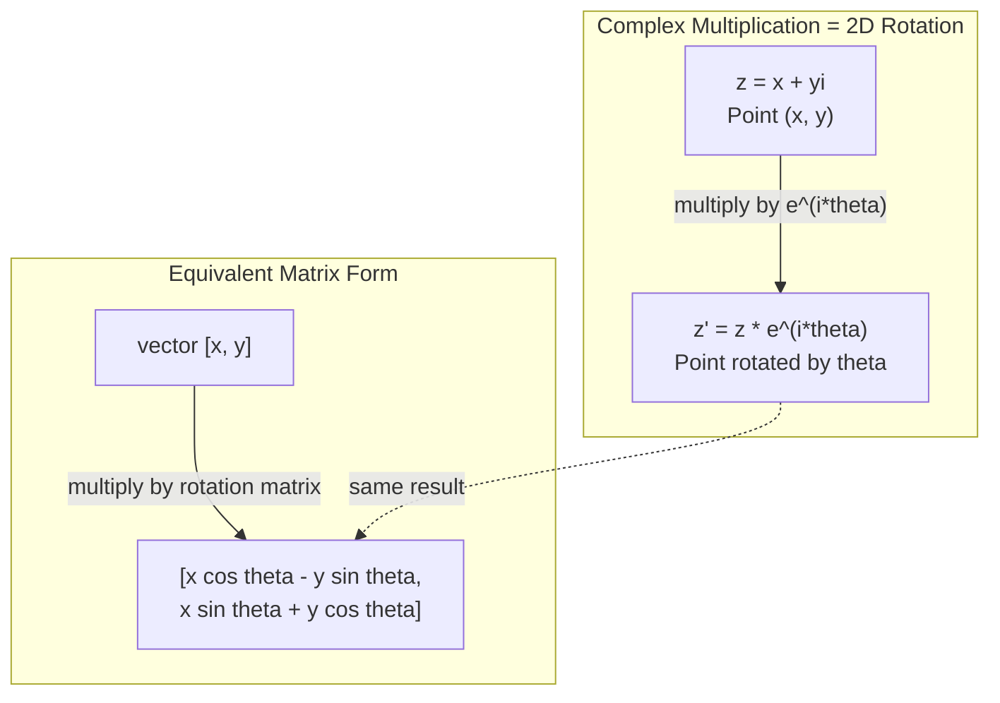
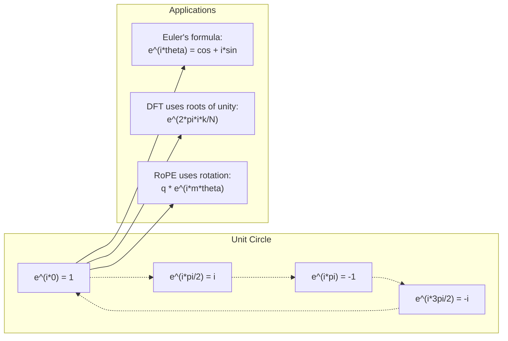

# Complex Numbers for AI / 面向 AI 的复数

> -1 的平方根并不“虚幻”。它是旋转、频率，以及半个信号处理领域的钥匙。

**类型：** Learn
**语言：** Python
**先修要求：** Phase 1，Lessons 01-04（线性代数、微积分）
**时间：** 约 60 分钟

## Learning Objectives / 学习目标

- 同时用直角坐标形式和极坐标形式进行复数运算（加法、乘法、除法、共轭）
- 使用欧拉公式在复指数与三角函数之间转换
- 用复数单位根从零实现离散傅里叶变换
- 解释复数旋转如何支撑 transformer 中的 RoPE 和正弦位置编码

## The Problem / 问题

你打开一篇傅里叶变换论文，里面到处都是 `i`。你看 transformer 位置编码，看到不同频率上的 `sin` 和 `cos`，它们其实是复指数的实部和虚部。你读量子计算，又发现一切都写在复向量空间里。

复数看起来很抽象。一个建立在 -1 平方根上的数系，像是数学上的技巧。但它不是技巧。它是描述旋转和振荡的自然语言。只要某个东西在旋转、振动或周期性变化，复数就是合适的工具。

如果不理解复数，就无法真正理解离散傅里叶变换。你也无法理解 FFT，无法理解现代语言模型中的 RoPE (Rotary Position Embedding) 是怎么工作的，也无法理解原始 Transformer 论文中的正弦位置编码为什么使用那组频率。

这一课从零构建复数运算，把它连接到几何直觉，并明确展示复数在机器学习中的出现位置。

## The Concept / 核心概念

### What is a complex number? / 什么是复数？

复数有两个部分：实部和虚部。

```
z = a + bi

where:
  a is the real part
  b is the imaginary part
  i is the imaginary unit, defined by i^2 = -1
```

就是这样。你把一条数轴扩展成一个平面。实数在一条轴上，虚数在另一条轴上。每个复数都是这个平面上的一个点。

### Complex arithmetic / 复数运算

**加法。** 实部和实部相加，虚部和虚部相加。

```
(a + bi) + (c + di) = (a + c) + (b + d)i

Example: (3 + 2i) + (1 + 4i) = 4 + 6i
```

**乘法。** 使用分配律，并记住 i^2 = -1。

```
(a + bi)(c + di) = ac + adi + bci + bdi^2
                 = ac + adi + bci - bd
                 = (ac - bd) + (ad + bc)i

Example: (3 + 2i)(1 + 4i) = 3 + 12i + 2i + 8i^2
                            = 3 + 14i - 8
                            = -5 + 14i
```

**共轭。** 把虚部的符号翻转。

```
conjugate of (a + bi) = a - bi
```

一个复数和它的共轭相乘，结果永远是实数：

```
(a + bi)(a - bi) = a^2 + b^2
```

**除法。** 分子和分母同时乘以分母的共轭。

```
(a + bi) / (c + di) = (a + bi)(c - di) / (c^2 + d^2)
```

这样会消掉分母中的虚部，得到一个干净的复数。

### The complex plane / 复平面

复平面把每个复数映射到二维点。水平轴是实轴，垂直轴是虚轴。

```
z = 3 + 2i  corresponds to the point (3, 2)
z = -1 + 0i corresponds to the point (-1, 0) on the real axis
z = 0 + 4i  corresponds to the point (0, 4) on the imaginary axis
```

复数既是一个点，也是从原点出发的一根向量。这种双重解释让复数在几何中非常有用。

### Polar form / 极坐标形式

平面上的任何点都可以用它到原点的距离，以及它相对正实轴的角度来描述。

```
z = r * (cos(theta) + i*sin(theta))

where:
  r = |z| = sqrt(a^2 + b^2)     (magnitude, or modulus)
  theta = atan2(b, a)             (phase, or argument)
```

直角坐标形式 (a + bi) 适合做加法。极坐标形式 (r, theta) 适合做乘法。

**极坐标形式下的乘法。** 模长相乘，角度相加。

```
z1 = r1 * e^(i*theta1)
z2 = r2 * e^(i*theta2)

z1 * z2 = (r1 * r2) * e^(i*(theta1 + theta2))
```

这就是复数特别适合表示旋转的原因。乘以一个模长为 1 的复数，就是一次纯旋转。

### Euler's formula / 欧拉公式

复指数和三角函数之间的桥梁：

```
e^(i*theta) = cos(theta) + i*sin(theta)
```

这是本课最重要的公式。当 theta = pi 时：

```
e^(i*pi) = cos(pi) + i*sin(pi) = -1 + 0i = -1

Therefore: e^(i*pi) + 1 = 0
```

五个基本常数（e、i、pi、1、0）被同一个方程连接起来。

### Why Euler's formula matters for ML / 为什么欧拉公式对 ML 重要

欧拉公式说明 `e^(i*theta)` 会随着 theta 变化沿单位圆移动。theta = 0 时，你在 (1, 0)。theta = pi/2 时，你在 (0, 1)。theta = pi 时，你在 (-1, 0)。theta = 3*pi/2 时，你在 (0, -1)。完整一圈是 theta = 2*pi。

这意味着复指数本身就是旋转。而旋转在信号处理和 ML 中无处不在。

### Connection to 2D rotations / 与二维旋转的联系

把复数 (x + yi) 乘以 e^(i*theta)，就会把点 (x, y) 围绕原点旋转 theta 角。

```
Rotation via complex multiplication:
  (x + yi) * (cos(theta) + i*sin(theta))
  = (x*cos(theta) - y*sin(theta)) + (x*sin(theta) + y*cos(theta))i

Rotation via matrix multiplication:
  [cos(theta)  -sin(theta)] [x]   [x*cos(theta) - y*sin(theta)]
  [sin(theta)   cos(theta)] [y] = [x*sin(theta) + y*cos(theta)]
```

两者给出完全相同的结果。复数乘法就是二维旋转。旋转矩阵只是把复数乘法改写成了矩阵记号。



### Phasors and rotating signals / 相量与旋转信号

复指数 e^(i*omega*t) 是一个以角频率 omega 绕单位圆旋转的点。随着 t 增加，这个点描出一条圆。

这个旋转点的实部是 cos(omega*t)。虚部是 sin(omega*t)。正弦信号就是一个旋转复数投下的影子。

```
e^(i*omega*t) = cos(omega*t) + i*sin(omega*t)

Real part:      cos(omega*t)    -- a cosine wave
Imaginary part: sin(omega*t)    -- a sine wave
```

这就是相量表示。你不再追踪一条上下摆动的正弦曲线，而是追踪一支平滑旋转的箭头。相位偏移变成角度偏移，幅度变化变成模长变化，信号相加变成向量相加。

### Roots of unity / 单位根

N 次单位根是单位圆上等间隔分布的 N 个点：

```
w_k = e^(2*pi*i*k/N)    for k = 0, 1, 2, ..., N-1
```

当 N = 4 时，单位根是：1、i、-1、-i（四个罗盘方向）。
当 N = 8 时，除了四个罗盘方向，还会得到四条对角线方向。

单位根是离散傅里叶变换的基础。DFT 会把一个信号分解成这 N 个等间隔频率上的分量。

### Connection to the DFT / 与 DFT 的联系

信号 x[0], x[1], ..., x[N-1] 的离散傅里叶变换是：

```
X[k] = sum_{n=0}^{N-1} x[n] * e^(-2*pi*i*k*n/N)
```

每个 X[k] 衡量信号与第 k 个单位根，也就是频率 k 上的复正弦波，有多强的相关性。DFT 把信号拆成 N 个旋转相量，并告诉你每个相量的幅度和相位。

### Why i is not imaginary / 为什么 i 并不“虚幻”

“imaginary” 这个词是历史偶然。笛卡尔曾带着贬义使用它。但 i 并不比负数更虚幻；负数刚出现时也被许多人排斥。负数回答的是“从 3 里减去什么能得到 5？”虚数单位回答的是“什么数平方之后得到 -1？”

更有用的理解是：i 是一个 90 度旋转算子。把实数乘以 i 一次，你会旋转 90 度到虚轴。再乘一次 i（i^2），又旋转 90 度，现在指向负实轴。这就是为什么 i^2 = -1。它并不神秘，只是两个四分之一圈构成的半圈旋转。

这就是复数在工程中无处不在的原因。任何旋转的东西：电磁波、量子态、信号振荡、位置编码，都自然适合用复数描述。

### Complex exponentials vs trigonometric functions / 复指数与三角函数

在欧拉公式之前，工程师会把信号写成 A*cos(omega*t + phi)：幅度 A、频率 omega、相位 phi。这可以用，但做运算很麻烦。两个不同相位的余弦相加需要三角恒等式。

有了复指数，同一个信号可以写成 A*e^(i*(omega*t + phi))。两个信号相加就是两个复数相加。相乘（调制）就是模长相乘、角度相加。相位偏移变成角度加法，频率偏移变成乘以相量。

整个信号处理领域转向复指数记号，是因为数学更干净。“真实信号”总是复表示的实部。虚部作为簿记一起携带，让代数自然成立。

### Connection to transformers / 与 transformer 的联系

**正弦位置编码**（原始 Transformer 论文）：

```
PE(pos, 2i) = sin(pos / 10000^(2i/d))
PE(pos, 2i+1) = cos(pos / 10000^(2i/d))
```

sin 和 cos 成对出现，它们是不同频率上复指数的实部和虚部。每个频率都为位置编码提供一种不同的“分辨率”。低频变化慢（粗粒度位置），高频变化快（细粒度位置）。组合起来，每个位置都会得到唯一的频率指纹。

**RoPE (Rotary Position Embedding)** 更进一步。它显式地把 query 和 key 向量乘以复数旋转矩阵。两个 token 之间的相对位置变成一个旋转角。注意力基于这些旋转后的向量计算，从而通过复数乘法让模型感知相对位置。

| Operation | Algebraic Form | Geometric Meaning |
|-----------|---------------|-------------------|
| 加法 | (a+c) + (b+d)i | 平面中的向量加法 |
| 乘法 | (ac-bd) + (ad+bc)i | 旋转并缩放 |
| 共轭 | a - bi | 关于实轴反射 |
| 模长 | sqrt(a^2 + b^2) | 到原点的距离 |
| 相位 | atan2(b, a) | 相对正实轴的角度 |
| 除法 | multiply by conjugate | 反向旋转并重新缩放 |
| 幂 | r^n * e^(i*n*theta) | 旋转 n 次，并按 r^n 缩放 |



```figure
roots-of-unity
```

## Build It / 动手构建

### Step 1: Complex class / 第 1 步：Complex 类

构建一个 Complex 数字类，支持算术运算、模长、相位，以及直角坐标形式和极坐标形式之间的转换。

```python
import math

class Complex:
    def __init__(self, real, imag=0.0):
        self.real = real
        self.imag = imag

    def __add__(self, other):
        return Complex(self.real + other.real, self.imag + other.imag)

    def __mul__(self, other):
        r = self.real * other.real - self.imag * other.imag
        i = self.real * other.imag + self.imag * other.real
        return Complex(r, i)

    def __truediv__(self, other):
        denom = other.real ** 2 + other.imag ** 2
        r = (self.real * other.real + self.imag * other.imag) / denom
        i = (self.imag * other.real - self.real * other.imag) / denom
        return Complex(r, i)

    def magnitude(self):
        return math.sqrt(self.real ** 2 + self.imag ** 2)

    def phase(self):
        return math.atan2(self.imag, self.real)

    def conjugate(self):
        return Complex(self.real, -self.imag)
```

### Step 2: Polar conversion and Euler's formula / 第 2 步：极坐标转换与欧拉公式

```python
def to_polar(z):
    return z.magnitude(), z.phase()

def from_polar(r, theta):
    return Complex(r * math.cos(theta), r * math.sin(theta))

def euler(theta):
    return Complex(math.cos(theta), math.sin(theta))
```

验证：`euler(theta).magnitude()` 应该始终是 1.0。`euler(0)` 应该得到 (1, 0)。`euler(pi)` 应该得到 (-1, 0)。

### Step 3: Rotation / 第 3 步：旋转

把点 (x, y) 旋转 theta 角，只需要一次复数乘法：

```python
point = Complex(3, 4)
rotated = point * euler(math.pi / 4)
```

模长保持不变，变化的只有角度。

### Step 4: DFT from complex arithmetic / 第 4 步：用复数运算实现 DFT

```python
def dft(signal):
    N = len(signal)
    result = []
    for k in range(N):
        total = Complex(0, 0)
        for n in range(N):
            angle = -2 * math.pi * k * n / N
            total = total + Complex(signal[n], 0) * euler(angle)
        result.append(total)
    return result
```

这是 O(N^2) 的 DFT。每个输出 X[k] 都是信号样本乘以单位根后的求和。

### Step 5: Inverse DFT / 第 5 步：逆 DFT

逆 DFT 从频谱重建原始信号。和正向 DFT 相比，只有两个变化：指数中的符号翻转，并除以 N。

```python
def idft(spectrum):
    N = len(spectrum)
    result = []
    for n in range(N):
        total = Complex(0, 0)
        for k in range(N):
            angle = 2 * math.pi * k * n / N
            total = total + spectrum[k] * euler(angle)
        result.append(Complex(total.real / N, total.imag / N))
    return result
```

这会给出完美重建。先应用 DFT，再应用 IDFT，就能在机器精度范围内得到原始信号。没有信息丢失。

### Step 6: Roots of unity / 第 6 步：单位根

```python
def roots_of_unity(N):
    return [euler(2 * math.pi * k / N) for k in range(N)]
```

验证两个性质：
- 每个单位根的模长都恰好是 1。
- 所有 N 个单位根相加为零（它们因对称性相互抵消）。

这些性质让 DFT 可逆。单位根为频域构成了一组正交基。

## Use It / 实际使用

Python 原生支持复数。字面量 `j` 表示虚数单位。

```python
z = 3 + 2j
w = 1 + 4j

print(z + w)
print(z * w)
print(abs(z))

import cmath
print(cmath.phase(z))
print(cmath.exp(1j * cmath.pi))
```

对于数组，numpy 原生处理复数：

```python
import numpy as np

z = np.array([1+2j, 3+4j, 5+6j])
print(np.abs(z))
print(np.angle(z))
print(np.conj(z))
print(np.real(z))
print(np.imag(z))

signal = np.sin(2 * np.pi * 5 * np.linspace(0, 1, 128))
spectrum = np.fft.fft(signal)
freqs = np.fft.fftfreq(128, d=1/128)
```

## Ship It / 交付

运行 `code/complex_numbers.py`，生成 `outputs/skill-complex-arithmetic.md`。

## Exercises / 练习

1. **手算复数运算。** 计算 (2 + 3i) * (4 - i)，并用代码验证。然后计算 (5 + 2i) / (1 - 3i)。把两个结果都画在复平面上，并检查乘法确实对第一个数进行了旋转和缩放。

2. **旋转序列。** 从点 (1, 0) 开始。连续乘以 e^(i*pi/6) 十二次。验证 12 次乘法后回到 (1, 0)。打印每一步的坐标，确认它们描出一个正 12 边形。

3. **已知信号的 DFT。** 构造一个信号，由 sin(2*pi*3*t) 和 0.5*sin(2*pi*7*t) 相加而成，并采样 32 个点。运行你的 DFT。验证幅度谱在频率 3 和 7 处有峰，并且频率 7 的峰高是频率 3 的一半。

4. **单位根可视化。** 计算 8 次单位根。验证它们的和为零。再验证任意一个单位根乘以本原根 e^(2*pi*i/8) 都会得到下一个单位根。

5. **旋转矩阵等价性。** 对 10 个随机角度和 10 个随机点，验证复数乘法与使用 2x2 旋转矩阵做矩阵-向量乘法得到相同结果。打印最大的数值差异。

## Key Terms / 关键术语

| Term | What it means |
|------|---------------|
| 复数 | 形如 a + bi 的数，其中 a 是实部，b 是虚部，并且 i^2 = -1 |
| 虚数单位 | 数 i，定义为 i^2 = -1。它并不是哲学意义上的“虚幻”，而是一个旋转算子 |
| 复平面 | x 轴为实轴、y 轴为虚轴的二维平面。也叫 Argand plane |
| 模长（modulus） | 到原点的距离：sqrt(a^2 + b^2)。写作 \|z\| |
| 相位（argument） | 相对正实轴的角度：atan2(b, a)。写作 arg(z) |
| 共轭 | 关于实轴的镜像：a + bi 的共轭是 a - bi |
| 极坐标形式 | 把 z 写成 r * e^(i*theta)，而不是 a + bi。这样乘法更容易 |
| 欧拉公式 | e^(i*theta) = cos(theta) + i*sin(theta)。连接指数函数与三角函数 |
| 相量 | 旋转复数 e^(i*omega*t)，用于表示正弦信号 |
| 单位根 | k = 0 到 N-1 时的 N 个复数 e^(2*pi*i*k/N)。它们是单位圆上的 N 个等间隔点 |
| DFT | Discrete Fourier Transform。用单位根把信号分解成复正弦分量 |
| RoPE | Rotary Position Embedding。用复数乘法在 transformer attention 中编码相对位置 |

## Further Reading / 延伸阅读

- [Visual Introduction to Euler's Formula](https://betterexplained.com/articles/intuitive-understanding-of-eulers-formula/) - 用较少符号建立几何直觉
- [Su et al.: RoFormer (2021)](https://arxiv.org/abs/2104.09864) - 引入 Rotary Position Embedding 的论文，使用复数旋转
- [Vaswani et al.: Attention Is All You Need (2017)](https://arxiv.org/abs/1706.03762) - 原始 Transformer 论文，包含正弦位置编码
- [3Blue1Brown: Euler's formula with introductory group theory](https://www.youtube.com/watch?v=mvmuCPvRoWQ) - 解释为什么 e^(i*pi) = -1 的可视化内容
- [Needham: Visual Complex Analysis](https://global.oup.com/academic/product/visual-complex-analysis-9780198534464) - 最好的复数视觉化教材之一，充满几何直觉
- [Strang: Introduction to Linear Algebra, Ch. 10](https://math.mit.edu/~gs/linearalgebra/) - 在线性代数和特征值语境中讲解复数
