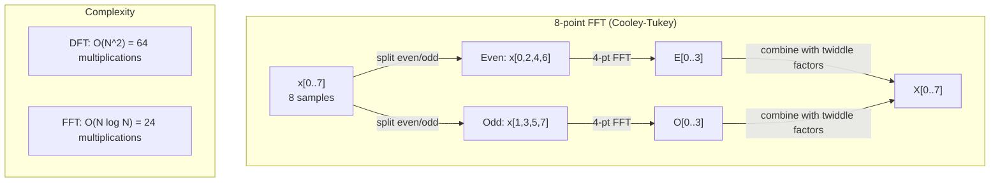
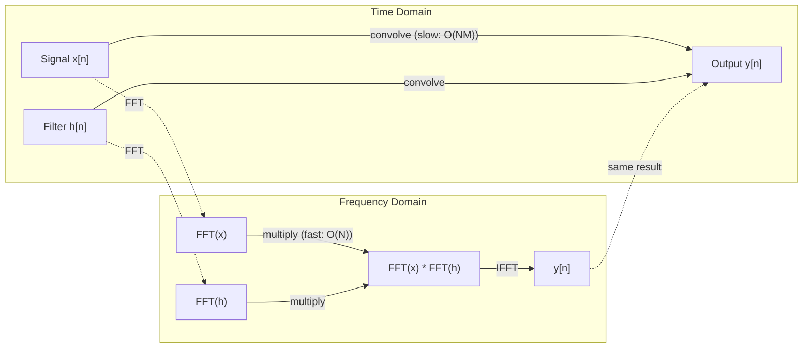

# The Fourier Transform / 傅里叶变换

> 每个信号都是一组正弦波的和。傅里叶变换告诉你里面有哪些正弦波。

**类型：** Build
**语言：** Python
**先修要求：** Phase 1，Lessons 01-04、19（复数）
**时间：** 约 90 分钟

## Learning Objectives / 学习目标

- 从零实现 DFT，并用 O(N log N) 的 Cooley-Tukey FFT 验证结果
- 解释频率系数：从信号中提取幅度、相位和功率谱
- 应用卷积定理，通过 FFT 乘法执行卷积
- 把傅里叶频率分解连接到 transformer 位置编码和 CNN 卷积层

## The Problem / 问题

一段音频录音是随时间变化的压力测量序列。股票价格是一串按天排列的数值。图像是空间上的像素强度网格。它们都是时域（或空域）数据：你看到的是数值沿某个索引变化。

但许多模式在时域里是不可见的。这段音频是单音还是和弦？这只股票价格有没有周周期？这张图像有没有重复纹理？这些问题问的是频率内容，而时域会把它隐藏起来。

傅里叶变换把数据从时域转换到频域。它接收一个信号，并把它分解成不同频率的正弦波。每个正弦波都有幅度（有多强）和相位（从哪里开始）。傅里叶变换同时告诉你这两者。

这对 ML 很重要，因为频域思维无处不在。卷积神经网络执行卷积，而卷积在频域中就是乘法。Transformer 位置编码用频率分解表示位置。音频模型（语音识别、音乐生成）处理的是声谱图，也就是声音的频率表示。时间序列模型会寻找周期模式。理解傅里叶变换，会给你处理这些问题的共同语言。

## The Concept / 核心概念

### The DFT definition / DFT 定义

给定 N 个样本 x[0], x[1], ..., x[N-1]，离散傅里叶变换会产生 N 个频率系数 X[0], X[1], ..., X[N-1]：

```
X[k] = sum_{n=0}^{N-1} x[n] * e^(-2*pi*i*k*n/N)

for k = 0, 1, ..., N-1
```

每个 X[k] 都是复数。它的模长 |X[k]| 告诉你频率 k 的幅度。它的相位 angle(X[k]) 告诉你这个频率的相位偏移。

关键洞见：`e^(-2*pi*i*k*n/N)` 是频率 k 上的旋转相量。DFT 计算信号与 N 个等间隔频率的相关性。如果信号在频率 k 上有能量，相关性就很大；否则它会接近零。

### What each coefficient means / 每个系数表示什么

**X[0]：DC 分量。** 这是所有样本的和，和均值成比例。它表示信号的常数（零频）偏移。

```
X[0] = sum_{n=0}^{N-1} x[n] * e^0 = sum of all samples
```

**1 <= k <= N/2 时的 X[k]：正频率。** X[k] 表示每 N 个样本中循环 k 次的频率。k 越大，频率越高（振荡越快）。

**X[N/2]：Nyquist 频率。** 这是用 N 个样本能表示的最高频率。再高就会出现 aliasing：高频伪装成低频。

**N/2 < k < N 时的 X[k]：负频率。** 对实值信号，X[N-k] = conj(X[k])。负频率是正频率的镜像。这就是为什么有用信息在前 N/2 + 1 个系数里。

### Inverse DFT / 逆 DFT

逆 DFT 从频率系数重建原始信号：

```
x[n] = (1/N) * sum_{k=0}^{N-1} X[k] * e^(2*pi*i*k*n/N)

for n = 0, 1, ..., N-1
```

和正向 DFT 只有两个区别：指数中的符号是正号（不是负号），并且有一个 1/N 的归一化因子。

逆 DFT 是完美重建。没有信息丢失。你可以从时域到频域，再回到时域，除了数值误差外不会丢失任何东西。DFT 是一种基变换：它用另一套坐标系统表达同一份信息。

### The FFT: making it fast / FFT：让它变快

按定义计算 DFT 是 O(N^2)：N 个输出系数，每个都要对 N 个输入样本求和。N = 1 million 时，这就是 10^12 次运算。

快速傅里叶变换（FFT）用 O(N log N) 计算同样结果。N = 1 million 时，大约是 2000 万次运算，而不是一万亿次。这让频率分析变得实用。

Cooley-Tukey 算法（最常见的 FFT）使用分治法：

1. 把信号拆成偶数索引样本和奇数索引样本。
2. 递归计算两个半长信号的 DFT。
3. 用 "twiddle factors" e^(-2*pi*i*k/N) 合并两个半长 DFT。

```
X[k] = E[k] + e^(-2*pi*i*k/N) * O[k]          for k = 0, ..., N/2 - 1
X[k + N/2] = E[k] - e^(-2*pi*i*k/N) * O[k]    for k = 0, ..., N/2 - 1

where E = DFT of even-indexed samples
      O = DFT of odd-indexed samples
```

这种对称性意味着递归的每一层做 O(N) 工作，总共有 log2(N) 层。总复杂度是 O(N log N)。



FFT 要求信号长度是 2 的幂。实践中，通常会把信号零填充到下一个 2 的幂。

### Spectral analysis / 频谱分析

**功率谱**是 |X[k]|^2，也就是每个频率系数的模长平方。它显示每个频率上有多少能量。

**相位谱**是 angle(X[k])，也就是每个频率的相位偏移。多数分析任务更关心功率谱，而会忽略相位。

```
Power at frequency k:  P[k] = |X[k]|^2 = X[k].real^2 + X[k].imag^2
Phase at frequency k:  phi[k] = atan2(X[k].imag, X[k].real)
```

### Frequency resolution / 频率分辨率

DFT 的频率分辨率取决于样本数 N 和采样率 fs。

```
Frequency of bin k:      f_k = k * fs / N
Frequency resolution:    delta_f = fs / N
Maximum frequency:       f_max = fs / 2  (Nyquist)
```

要区分两个很接近的频率，你需要更多样本。要捕获高频，你需要更高采样率。

### The convolution theorem / 卷积定理

这是信号处理中最重要的结果之一，也和 CNN 直接相关。

**时域中的卷积等于频域中的逐点乘法。**

```
x * h = IFFT(FFT(x) . FFT(h))

where * is convolution and . is element-wise multiplication
```

为什么这很重要：

- 长度为 N 和 M 的两个信号做直接卷积需要 O(N*M) 次运算。
- 基于 FFT 的卷积需要 O(N log N)：先变换两者，再相乘，再变换回来。
- 对大 kernel，FFT 卷积会快得多。
- 这正是大感受野卷积层中发生的事情。

注意：DFT 计算的是循环卷积（信号会绕回去）。如果要线性卷积（不绕回），需要在计算前把两个信号零填充到长度 N + M - 1。



### Windowing / 加窗

DFT 假设信号是周期性的，也就是把 N 个样本看成一个无限重复信号的一个周期。如果信号的起点和终点数值不同，边界处会出现不连续，这会表现为虚假的高频内容。这叫 spectral leakage。

加窗会在计算 DFT 之前，让信号在两端逐渐衰减到零，从而降低泄漏。

常见窗口：

| Window | Shape | Main lobe width | Side lobe level | Use case |
|--------|-------|----------------|-----------------|----------|
| Rectangular | 平坦（不加窗） | 最窄 | 最高 (-13 dB) | 信号在 N 个样本中刚好周期完整时 |
| Hann | Raised cosine | 中等 | 低 (-31 dB) | 通用频谱分析 |
| Hamming | Modified cosine | 中等 | 更低 (-42 dB) | 音频处理、语音分析 |
| Blackman | Triple cosine | 宽 | 很低 (-58 dB) | 旁瓣抑制非常关键时 |

```
Hann window:    w[n] = 0.5 * (1 - cos(2*pi*n / (N-1)))
Hamming window: w[n] = 0.54 - 0.46 * cos(2*pi*n / (N-1))
```

在 DFT 前，把窗口和信号逐元素相乘：`X = DFT(x * w)`。

### DFT properties / DFT 性质

| Property | Time Domain | Frequency Domain |
|----------|-------------|-----------------|
| 线性 | a*x + b*y | a*X + b*Y |
| 时间平移 | x[n - k] | X[f] * e^(-2*pi*i*f*k/N) |
| 频率平移 | x[n] * e^(2*pi*i*f0*n/N) | X[f - f0] |
| 卷积 | x * h | X * H (pointwise) |
| 乘法 | x * h (pointwise) | X * H (circular convolution, scaled by 1/N) |
| Parseval's theorem | sum \|x[n]\|^2 | (1/N) * sum \|X[k]\|^2 |
| 共轭对称（实输入） | x[n] real | X[k] = conj(X[N-k]) |

Parseval's theorem 说明总能量在两个域中相同。能量在变换中守恒。

### Connection to positional encodings / 与位置编码的联系

原始 Transformer 使用正弦位置编码：

```
PE(pos, 2i)   = sin(pos / 10000^(2i/d_model))
PE(pos, 2i+1) = cos(pos / 10000^(2i/d_model))
```

每一对维度 (2i, 2i+1) 都以不同频率振荡。频率从高（维度 0、1）到低（最后的维度）按几何间隔排列。这让每个位置在所有频带上得到唯一模式，类似傅里叶系数唯一标识一个信号。

这种设计提供的关键性质：

- **唯一性：** 没有两个位置具有相同编码。
- **有界值：** sin 和 cos 始终位于 [-1, 1]。
- **相对位置：** 位置 p+k 的编码可以表示为位置 p 编码的线性函数。模型可以学习关注相对位置。

### Connection to CNNs / 与 CNN 的联系

卷积层把一个学习到的滤波器（kernel）滑过信号或图像。数学上，这就是卷积操作。

根据卷积定理，它等价于：
1. 对输入做 FFT
2. 对 kernel 做 FFT
3. 在频域中相乘
4. 对结果做 IFFT

标准 CNN 实现使用直接卷积，因为小型 3x3 kernel 更快。但对大 kernel 或全局卷积，基于 FFT 的方法明显更快。一些架构（如 FNet）完全用 FFT 替代 attention，以 O(N log N) 复杂度而不是 O(N^2) 得到有竞争力的准确率。

### Spectrograms and the Short-Time Fourier Transform / 声谱图与短时傅里叶变换

单次 FFT 会给出整个信号的频率内容，但不会告诉你这些频率在什么时候出现。一个 chirp（频率随时间升高的信号）和一个 chord（所有频率同时出现）可能有相同的幅度谱。

短时傅里叶变换（STFT）通过在信号的重叠窗口上计算 FFT 来解决这个问题。结果是声谱图：一个二维表示，一条轴是时间，另一条轴是频率。每个点的强度表示该时刻该频率上的能量。

```
STFT procedure:
1. Choose a window size (e.g., 1024 samples)
2. Choose a hop size (e.g., 256 samples -- 75% overlap)
3. For each window position:
   a. Extract the windowed segment
   b. Apply a Hann/Hamming window
   c. Compute FFT
   d. Store the magnitude spectrum as one column of the spectrogram
```

声谱图是音频 ML 模型的标准输入表示。语音识别模型（Whisper、DeepSpeech）使用 mel-spectrogram，也就是把频率映射到 mel 标度的声谱图；mel 标度更符合人类对音高的感知。

### Aliasing / 混叠

如果信号包含 fs/2（Nyquist 频率）以上的频率，用采样率 fs 采样时会产生混叠副本。一个 90 Hz 信号以 100 Hz 采样，看起来和一个 10 Hz 信号完全一样。只看样本无法区分它们。

```
Example:
  True signal: 90 Hz sine wave
  Sampling rate: 100 Hz
  Apparent frequency: 100 - 90 = 10 Hz

  The samples from the 90 Hz signal at 100 Hz sampling rate
  are identical to the samples from a 10 Hz signal.
  No amount of math can recover the original 90 Hz.
```

这就是模拟到数字转换器会加入 anti-aliasing filters 的原因：它们会在采样前去掉 Nyquist 以上的频率。在 ML 中，如果在没有合适低通滤波的情况下下采样 feature map，也会出现混叠；一些架构用 anti-aliased pooling layer 处理这个问题。

### Zero-padding does not increase resolution / 零填充不会提高分辨率

一个常见误解是：FFT 前给信号做零填充能提高频率分辨率。它不能。零填充只是在已有频率 bin 之间做插值，让频谱看起来更平滑。它不能揭示原始样本中不存在的频率细节。

真正的频率分辨率只取决于观测时间 T = N / fs。要区分相差 delta_f 的两个频率，你至少需要 T = 1 / delta_f 秒的数据。任何零填充都无法改变这个基本限制。

```figure
fourier-synthesis
```

## Build It / 动手构建

### Step 1: DFT from scratch / 第 1 步：从零实现 DFT

O(N^2) 的 DFT 直接来自定义。

```python
import math

class Complex:
    ...

def dft(x):
    N = len(x)
    result = []
    for k in range(N):
        total = Complex(0, 0)
        for n in range(N):
            angle = -2 * math.pi * k * n / N
            w = Complex(math.cos(angle), math.sin(angle))
            xn = x[n] if isinstance(x[n], Complex) else Complex(x[n])
            total = total + xn * w
        result.append(total)
    return result
```

### Step 2: Inverse DFT / 第 2 步：逆 DFT

结构相同，指数为正号，并除以 N。

```python
def idft(X):
    N = len(X)
    result = []
    for n in range(N):
        total = Complex(0, 0)
        for k in range(N):
            angle = 2 * math.pi * k * n / N
            w = Complex(math.cos(angle), math.sin(angle))
            total = total + X[k] * w
        result.append(Complex(total.real / N, total.imag / N))
    return result
```

### Step 3: FFT (Cooley-Tukey) / 第 3 步：FFT (Cooley-Tukey)

递归 FFT 要求长度是 2 的幂。拆成偶数项和奇数项，递归计算，再用 twiddle factors 合并。

```python
def fft(x):
    N = len(x)
    if N <= 1:
        return [x[0] if isinstance(x[0], Complex) else Complex(x[0])]
    if N % 2 != 0:
        return dft(x)

    even = fft([x[i] for i in range(0, N, 2)])
    odd = fft([x[i] for i in range(1, N, 2)])

    result = [Complex(0)] * N
    for k in range(N // 2):
        angle = -2 * math.pi * k / N
        twiddle = Complex(math.cos(angle), math.sin(angle))
        t = twiddle * odd[k]
        result[k] = even[k] + t
        result[k + N // 2] = even[k] - t
    return result
```

### Step 4: Spectral analysis helpers / 第 4 步：频谱分析辅助函数

```python
def power_spectrum(X):
    return [xk.real ** 2 + xk.imag ** 2 for xk in X]

def convolve_fft(x, h):
    N = len(x) + len(h) - 1
    padded_N = 1
    while padded_N < N:
        padded_N *= 2

    x_padded = x + [0.0] * (padded_N - len(x))
    h_padded = h + [0.0] * (padded_N - len(h))

    X = fft(x_padded)
    H = fft(h_padded)

    Y = [xk * hk for xk, hk in zip(X, H)]

    y = idft(Y)
    return [y[n].real for n in range(N)]
```

## Use It / 实际使用

真实工作中，使用 numpy 的 FFT。它背后是高度优化的 C 库。

```python
import numpy as np

signal = np.sin(2 * np.pi * 5 * np.arange(256) / 256)
spectrum = np.fft.fft(signal)
freqs = np.fft.fftfreq(256, d=1/256)

power = np.abs(spectrum) ** 2

positive_freqs = freqs[:len(freqs)//2]
positive_power = power[:len(power)//2]
```

对于加窗和更高级的频谱分析：

```python
from scipy.signal import windows, stft

window = windows.hann(256)
windowed = signal * window
spectrum = np.fft.fft(windowed)
```

对于卷积：

```python
from scipy.signal import fftconvolve

result = fftconvolve(signal, kernel, mode='full')
```

对于声谱图：

```python
from scipy.signal import stft

frequencies, times, Zxx = stft(signal, fs=sample_rate, nperseg=256)
spectrogram = np.abs(Zxx) ** 2
```

声谱图矩阵的形状是 (n_frequencies, n_time_frames)。每一列是一个时间窗口上的功率谱。这就是音频 ML 模型消费的输入。

## Ship It / 交付

运行 `code/fourier.py`，生成 `outputs/prompt-spectral-analyzer.md`。

## Exercises / 练习

1. **识别纯音。** 创建一个包含单个正弦波的信号，频率未知（在 1 到 50 Hz 之间），以 128 Hz 采样 1 秒。用你的 DFT 识别频率。验证答案匹配。然后加入标准差为 0.5 的高斯噪声并重复。噪声如何影响频谱？

2. **验证 FFT 与 DFT。** 生成长度为 64 的随机信号。分别计算 DFT (O(N^2)) 和 FFT。验证所有系数在 1e-10 内匹配。对长度 256、512、1024 和 2048 的信号计时两个函数。画出 DFT 时间与 FFT 时间的比值。

3. **用例子证明卷积定理。** 创建信号 x = [1, 2, 3, 4, 0, 0, 0, 0] 和滤波器 h = [1, 1, 1, 0, 0, 0, 0, 0]。直接用嵌套循环计算它们的循环卷积。再通过 FFT 计算（变换、相乘、逆变换）。验证结果一致。然后用适当零填充完成线性卷积。

4. **加窗影响。** 创建一个由 10 Hz 和 12 Hz 两个正弦波相加而成的信号（频率非常接近）。以 128 Hz 采样 1 秒。分别在不加窗、Hann window 和 Hamming window 下计算功率谱。哪个窗口最容易区分两个峰？为什么？

5. **位置编码分析。** 生成 d_model = 128、max_pos = 512 的正弦位置编码。对每一对位置 (p1, p2)，计算它们编码的点积。证明点积只依赖 |p1 - p2|，而不依赖绝对位置。随着距离增加，点积会发生什么？

## Key Terms / 关键术语

| Term | What it means |
|------|---------------|
| DFT (Discrete Fourier Transform) | 把 N 个时域样本转换成 N 个频域系数。每个系数都是与对应频率复正弦波的相关性 |
| FFT (Fast Fourier Transform) | 计算 DFT 的 O(N log N) 算法。Cooley-Tukey 算法递归拆分偶数/奇数索引 |
| 逆 DFT | 从频率系数重建时域信号。公式与 DFT 相同，但指数符号翻转并带有 1/N 缩放 |
| 频率 bin | DFT 输出中的每个索引 k 表示频率 k*fs/N Hz。这个“bin”是离散频率槽 |
| DC 分量 | X[0]，零频系数。与信号均值成比例 |
| Nyquist 频率 | fs/2，在采样率 fs 下可表示的最高频率。高于它的频率会混叠 |
| 功率谱 | \|X[k]\|^2，每个频率系数的模长平方。展示跨频率的能量分布 |
| 相位谱 | angle(X[k])，每个频率分量的相位偏移。分析中经常忽略 |
| Spectral leakage | 把非周期信号当作周期信号处理导致的虚假频率内容。可通过加窗降低 |
| 窗函数 | 在 DFT 前应用的渐变函数（Hann、Hamming、Blackman），用于降低频谱泄漏 |
| Twiddle factor | FFT butterfly 计算中用于合并子 DFT 的复指数 e^(-2*pi*i*k/N) |
| 卷积定理 | 时域中的卷积等于频域中的逐点乘法。它是信号处理和 CNN 的基础 |
| 循环卷积 | 信号会绕回的卷积。这是 DFT 天然计算的形式 |
| 线性卷积 | 不绕回的标准卷积。可通过 DFT 前零填充实现 |
| Parseval's theorem | 总能量在傅里叶变换中保持不变。sum \|x[n]\|^2 = (1/N) sum \|X[k]\|^2 |
| Aliasing | 当采样率不足时，Nyquist 以上的频率会表现为更低频率 |

## Further Reading / 延伸阅读

- [Cooley & Tukey: An Algorithm for the Machine Calculation of Complex Fourier Series (1965)](https://www.ams.org/journals/mcom/1965-19-090/S0025-5718-1965-0178586-1/) - 改变计算的原始 FFT 论文
- [3Blue1Brown: But what is the Fourier Transform?](https://www.youtube.com/watch?v=spUNpyF58BY) - 最好的傅里叶变换可视化入门之一
- [Lee-Thorp et al.: FNet: Mixing Tokens with Fourier Transforms (2021)](https://arxiv.org/abs/2105.03824) - 在 transformer 中用 FFT 替代 self-attention
- [Smith: The Scientist and Engineer's Guide to Digital Signal Processing](http://www.dspguide.com/) - 免费在线教材，深入覆盖 FFT、加窗和频谱分析
- [Vaswani et al.: Attention Is All You Need (2017)](https://arxiv.org/abs/1706.03762) - 从傅里叶频率分解衍生出正弦位置编码
- [Radford et al.: Whisper (2022)](https://arxiv.org/abs/2212.04356) - 使用 mel-spectrogram 作为输入表示的语音识别模型
