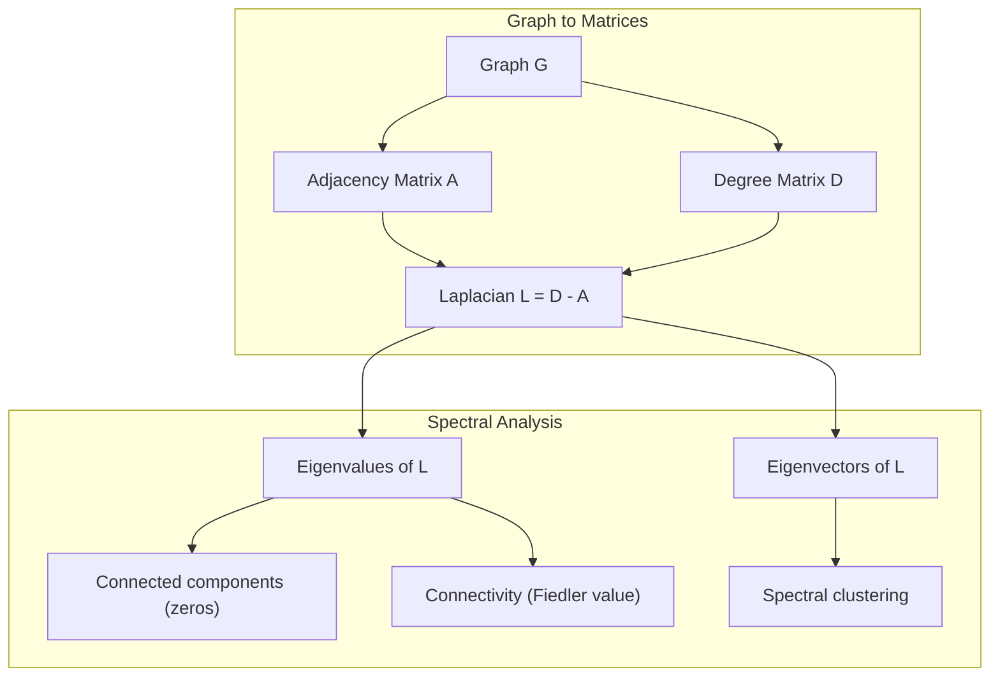
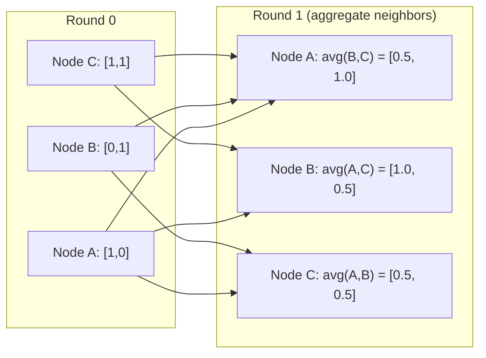

# Graph Theory for Machine Learning / 面向机器学习的图论

> 图是关系的数据结构。如果你的数据里有连接，就需要图论。

**类型：** Build
**语言：** Python
**先修要求：** Phase 1，Lessons 01-03（线性代数、矩阵）
**时间：** 约 90 分钟

## Learning Objectives / 学习目标

- 构建一个 graph class，支持邻接矩阵/邻接表表示，并实现 BFS 和 DFS 遍历
- 计算图拉普拉斯矩阵，并用它的特征值检测连通分量、聚类节点
- 将一轮 GNN 风格的消息传递实现为归一化邻接矩阵乘法
- 使用 Fiedler vector 应用谱聚类来划分图

## The Problem / 问题

社交网络、分子、知识库、引用网络、道路地图，都是图。传统 ML 把数据当作扁平表格。每一行彼此独立，每个特征是一列。但当连接结构本身很重要时，表格就不够用了。

想象一个社交网络。你想预测某个用户会买什么产品。这个用户的购买历史很重要，但他们朋友的购买历史可能更重要。连接关系本身携带信号。

再看一个分子。你想预测它是否会与某种蛋白结合。原子很重要，但真正关键的是原子之间如何成键。结构就是数据。

Graph Neural Networks (GNNs) 是深度学习中增长最快的方向之一。它们驱动药物发现、社交推荐、欺诈检测和知识图谱推理。每个 GNN 都建立在同一个基础上：基本图论。

你需要四件东西：
1. 一种把图表示为矩阵的方法（这样才能做矩阵乘法）
2. 用来探索图结构的遍历算法
3. 拉普拉斯矩阵：谱图理论中最重要的一张矩阵
4. 消息传递：让 GNN 工作起来的操作

## The Concept / 核心概念

### Graphs: Nodes and Edges / 图：节点与边

图 G = (V, E) 由顶点（节点）V 和边 E 组成。每条边连接两个节点。

**有向 vs 无向。** 在无向图中，边 (u, v) 表示 u 连接 v，同时 v 也连接 u。在有向图（digraph）中，边 (u, v) 表示 u 指向 v，但反向不一定存在。

**加权 vs 无权。** 在无权图中，边要么存在，要么不存在。在加权图中，每条边有一个数值权重，比如距离、成本或强度。

| Graph type | Example |
|-----------|---------|
| 无向、无权 | Facebook 朋友网络 |
| 有向、无权 | Twitter 关注网络 |
| 无向、加权 | 道路地图（距离） |
| 有向、加权 | 网页链接（PageRank 分数） |

### The Adjacency Matrix / 邻接矩阵

邻接矩阵 A 是核心表示。对于一个有 n 个节点的图：

```
A[i][j] = 1    if there is an edge from node i to node j
A[i][j] = 0    otherwise
```

对无向图，A 是对称矩阵：A[i][j] = A[j][i]。对加权图，A[i][j] = 边 (i, j) 的权重。

**例子：一个三角形：**

```
Nodes: 0, 1, 2
Edges: (0,1), (1,2), (0,2)

A = [[0, 1, 1],
     [1, 0, 1],
     [1, 1, 0]]
```

邻接矩阵是每个 GNN 的输入。对 A 做矩阵运算，就对应着对图做操作。

### Degree / 度

节点的度是连接到它的边数量。对于有向图，还会区分入度（指向该节点的边）和出度（从该节点指出的边）。

度矩阵 D 是对角矩阵：

```
D[i][i] = degree of node i
D[i][j] = 0    for i != j
```

三角形例子中，D = diag(2, 2, 2)，因为每个节点都连接另外两个节点。

度告诉你节点的重要性。高 degree = hub node。一个网络的 degree distribution 会揭示它的结构。社交网络通常服从幂律（少数 hub，很多 leaf node）。随机图的度通常服从泊松分布。

### BFS and DFS / BFS 与 DFS

这是两个最基本的图遍历算法。两者都需要掌握。

**Breadth-First Search (BFS)：** 先探索所有邻居，再探索邻居的邻居。使用队列（FIFO）。

```
BFS from node 0:
  Visit 0
  Queue: [1, 2]        (neighbors of 0)
  Visit 1
  Queue: [2, 3]        (add neighbors of 1)
  Visit 2
  Queue: [3]           (neighbors of 2 already visited)
  Visit 3
  Queue: []            (done)
```

BFS 在无权图中找到最短路径。从起点到任意节点的距离，等于该节点第一次被发现时所在的 BFS 层级。这就是为什么 BFS 会用于社交网络里的跳数距离。

**Depth-First Search (DFS)：** 尽可能深入，走不下去再回溯。使用栈（LIFO）或递归。

```
DFS from node 0:
  Visit 0
  Stack: [1, 2]        (neighbors of 0)
  Visit 2               (pop from stack)
  Stack: [1, 3]         (add neighbors of 2)
  Visit 3               (pop from stack)
  Stack: [1]
  Visit 1               (pop from stack)
  Stack: []             (done)
```

DFS 适用于：
- 寻找连通分量（从未访问节点开始运行 DFS）
- 检测环（DFS 树中的 back edge）
- 拓扑排序（反转 DFS 完成顺序）

| Algorithm | Data structure | Finds | Use case |
|-----------|---------------|-------|----------|
| BFS | Queue | 最短路径 | 社交网络距离、知识图谱遍历 |
| DFS | Stack | 分量、环 | 连通性、拓扑排序 |

### The Graph Laplacian / 图拉普拉斯矩阵

L = D - A。它是谱图理论中最重要的矩阵。

对于三角形：

```
D = [[2, 0, 0],    A = [[0, 1, 1],    L = [[2, -1, -1],
     [0, 2, 0],         [1, 0, 1],         [-1, 2, -1],
     [0, 0, 2]]         [1, 1, 0]]         [-1, -1,  2]]
```

拉普拉斯矩阵有一些非常强的性质：

1. **L 是正半定的。** 所有特征值都 >= 0。

2. **零特征值的数量等于连通分量数量。** 一个连通图恰好有一个零特征值。一个有 3 个互不连通分量的图有三个零特征值。

3. **最小的非零特征值（Fiedler value）衡量连通性。** Fiedler value 大，说明图连接紧密。Fiedler value 小，说明图有薄弱点，也就是瓶颈。

4. **Fiedler value 对应的特征向量（Fiedler vector）揭示最佳划分。** 值为正的节点进入一组，值为负的节点进入另一组。这就是谱聚类。



### Spectral Properties / 谱性质

邻接矩阵和拉普拉斯矩阵的特征值可以在不遍历图的情况下揭示结构性质。

**Spectral clustering** 的流程如下：
1. 计算拉普拉斯矩阵 L
2. 找到 L 的 k 个最小特征向量（对连通图，跳过第一个全 1 特征向量）
3. 用这些特征向量作为每个节点的新坐标
4. 在这些坐标上运行 k-means

为什么这有效？L 的特征向量编码了图上“最平滑”的函数。连接紧密的节点会得到相似的特征向量值。被瓶颈隔开的节点会得到不同值。特征向量会自然分离簇。

**随机游走联系。** 归一化拉普拉斯矩阵和图上的随机游走有关。随机游走的 stationary distribution 与节点度成比例。mixing time（随机游走收敛有多快）取决于 spectral gap。

### Message Passing / 消息传递

这是 Graph Neural Networks 的核心操作。每个节点从邻居收集消息、聚合消息，并更新自己的状态。

```
h_v^(k+1) = UPDATE(h_v^(k), AGGREGATE({h_u^(k) : u in neighbors(v)}))
```

最简单的形式中，AGGREGATE = mean，UPDATE = linear transform + activation：

```
h_v^(k+1) = sigma(W * mean({h_u^(k) : u in neighbors(v)}))
```

这其实是伪装成节点操作的矩阵乘法。如果 H 是所有节点特征矩阵，A 是邻接矩阵：

```
H^(k+1) = sigma(A_norm * H^(k) * W)
```

其中 A_norm 是归一化邻接矩阵（每一行求和为 1）。

一轮消息传递让每个节点“看见”它的一阶邻居。两轮让它看见邻居的邻居。K 轮让每个节点获得 K-hop 邻域的信息。



### Concepts and ML Applications / 概念与 ML 应用

| Concept | ML Application |
|---------|---------------|
| 邻接矩阵 | GNN 输入表示 |
| 图拉普拉斯矩阵 | 谱聚类、社区检测 |
| BFS/DFS | 知识图谱遍历、路径查找 |
| 度分布 | 节点重要性、特征工程 |
| 消息传递 | GNN 层（GCN、GAT、GraphSAGE） |
| L 的特征值 | 社区检测、图划分 |
| 谱聚类 | 无监督节点分组 |
| PageRank | 节点重要性、网页搜索 |

```figure
graph-degree-distribution
```

## Build It / 动手构建

### Step 1: Graph class from scratch / 第 1 步：从零实现 Graph 类

```python
class Graph:
    def __init__(self, n_nodes, directed=False):
        self.n = n_nodes
        self.directed = directed
        self.adj = {i: {} for i in range(n_nodes)}

    def add_edge(self, u, v, weight=1.0):
        self.adj[u][v] = weight
        if not self.directed:
            self.adj[v][u] = weight

    def neighbors(self, node):
        return list(self.adj[node].keys())

    def degree(self, node):
        return len(self.adj[node])

    def adjacency_matrix(self):
        import numpy as np
        A = np.zeros((self.n, self.n))
        for u in range(self.n):
            for v, w in self.adj[u].items():
                A[u][v] = w
        return A

    def degree_matrix(self):
        import numpy as np
        D = np.zeros((self.n, self.n))
        for i in range(self.n):
            D[i][i] = self.degree(i)
        return D

    def laplacian(self):
        return self.degree_matrix() - self.adjacency_matrix()
```

邻接表（`self.adj`）高效存储邻居。邻接矩阵转换使用 numpy，因为所有谱操作都需要它。

### Step 2: BFS and DFS / 第 2 步：BFS 与 DFS

```python
from collections import deque

def bfs(graph, start):
    visited = set()
    order = []
    distances = {}
    queue = deque([(start, 0)])
    visited.add(start)
    while queue:
        node, dist = queue.popleft()
        order.append(node)
        distances[node] = dist
        for neighbor in graph.neighbors(node):
            if neighbor not in visited:
                visited.add(neighbor)
                queue.append((neighbor, dist + 1))
    return order, distances


def dfs(graph, start):
    visited = set()
    order = []
    stack = [start]
    while stack:
        node = stack.pop()
        if node in visited:
            continue
        visited.add(node)
        order.append(node)
        for neighbor in reversed(graph.neighbors(node)):
            if neighbor not in visited:
                stack.append(neighbor)
    return order
```

BFS 使用 deque（双端队列）来获得 O(1) 的 popleft。DFS 使用 list 作为栈。两者都恰好访问每个节点一次，时间复杂度是 O(V + E)。

### Step 3: Connected components and Laplacian eigenvalues / 第 3 步：连通分量与拉普拉斯特征值

```python
def connected_components(graph):
    visited = set()
    components = []
    for node in range(graph.n):
        if node not in visited:
            order, _ = bfs(graph, node)
            visited.update(order)
            components.append(order)
    return components


def laplacian_eigenvalues(graph):
    import numpy as np
    L = graph.laplacian()
    eigenvalues = np.linalg.eigvalsh(L)
    return eigenvalues
```

`eigvalsh` 用于对称矩阵；无向图的拉普拉斯矩阵总是对称的。它按升序返回特征值。数一数零特征值，就能得到连通分量数量。

### Step 4: Spectral clustering / 第 4 步：谱聚类

```python
def spectral_clustering(graph, k=2):
    import numpy as np
    L = graph.laplacian()
    eigenvalues, eigenvectors = np.linalg.eigh(L)
    features = eigenvectors[:, 1:k+1]

    labels = np.zeros(graph.n, dtype=int)
    for i in range(graph.n):
        if features[i, 0] >= 0:
            labels[i] = 0
        else:
            labels[i] = 1
    return labels
```

当 k=2 时，Fiedler vector 的符号会把图分成两个簇。k>2 时，应在前 k 个特征向量（排除平凡的全 1 特征向量）上运行 k-means。

### Step 5: Message passing / 第 5 步：消息传递

```python
def message_passing(graph, features, weight_matrix):
    import numpy as np
    A = graph.adjacency_matrix()
    row_sums = A.sum(axis=1, keepdims=True)
    row_sums[row_sums == 0] = 1
    A_norm = A / row_sums
    aggregated = A_norm @ features
    output = aggregated @ weight_matrix
    return output
```

这是一轮 GNN 消息传递。每个节点的新特征是其邻居特征的加权平均，再经过权重矩阵变换。堆叠多轮，就能把信息传播得更远。

## Use It / 实际使用

有了 networkx 和 numpy，同样的操作可以一行完成：

```python
import networkx as nx
import numpy as np

G = nx.karate_club_graph()

A = nx.adjacency_matrix(G).toarray()
L = nx.laplacian_matrix(G).toarray()

eigenvalues = np.linalg.eigvalsh(L.astype(float))
print(f"Smallest eigenvalues: {eigenvalues[:5]}")
print(f"Connected components: {nx.number_connected_components(G)}")

communities = nx.community.greedy_modularity_communities(G)
print(f"Communities found: {len(communities)}")

pr = nx.pagerank(G)
top_nodes = sorted(pr.items(), key=lambda x: x[1], reverse=True)[:5]
print(f"Top 5 PageRank nodes: {top_nodes}")
```

networkx 用优化过的 C 后端处理各种规模的图。生产环境中使用它。你从零实现的版本用来理解它到底在做什么。

### numpy spectral analysis / numpy 谱分析

```python
import numpy as np

A = np.array([
    [0, 1, 1, 0, 0],
    [1, 0, 1, 0, 0],
    [1, 1, 0, 1, 0],
    [0, 0, 1, 0, 1],
    [0, 0, 0, 1, 0]
])

D = np.diag(A.sum(axis=1))
L = D - A

eigenvalues, eigenvectors = np.linalg.eigh(L)
print(f"Eigenvalues: {np.round(eigenvalues, 4)}")
print(f"Fiedler value: {eigenvalues[1]:.4f}")
print(f"Fiedler vector: {np.round(eigenvectors[:, 1], 4)}")

fiedler = eigenvectors[:, 1]
group_a = np.where(fiedler >= 0)[0]
group_b = np.where(fiedler < 0)[0]
print(f"Cluster A: {group_a}")
print(f"Cluster B: {group_b}")
```

Fiedler vector 做了主要工作。正值进入一个簇，负值进入另一个簇。不需要迭代优化，只需要一次特征分解。

## Ship It / 交付

本课会产出：
- `outputs/skill-graph-analysis.md`：一份用于分析图结构数据的技能参考

## Connections / 关联

| Concept | Where it shows up |
|---------|------------------|
| 邻接矩阵 | GCN、GAT、GraphSAGE 输入 |
| 拉普拉斯矩阵 | 谱聚类、ChebNet filters |
| BFS | 知识图谱遍历、最短路径查询 |
| 消息传递 | 每个 GNN layer、neural message passing |
| Spectral gap | 图连通性、随机游走 mixing time |
| 度分布 | 幂律网络、节点特征工程 |
| 连通分量 | 预处理、处理非连通图 |
| PageRank | 节点重要性排序、attention 初始化 |

GNN 值得特别说明。GCN（Kipf & Welling, 2017）中的图卷积操作使用带自环的邻接矩阵 A_hat = A + I：

```text
H^(l+1) = sigma(D_hat^(-1/2) * A_hat * D_hat^(-1/2) * H^(l) * W^(l))
```

其中 A_hat = A + I（邻接矩阵加自环），D_hat 是 A_hat 的度矩阵。自环确保每个节点在聚合时包含自己的特征。这正是带对称归一化的消息传递。D_hat^(-1/2) * A_hat * D_hat^(-1/2) 是归一化邻接矩阵。拉普拉斯矩阵会出现，是因为这种归一化与 L_sym = I - D^(-1/2) * A * D^(-1/2) 有关。理解拉普拉斯矩阵，也就是在理解 GCN 为什么有效。

## Exercises / 练习

1. **从零实现 PageRank。** 从均匀分数开始。每一步：score(v) = (1-d)/n + d * sum(score(u)/out_degree(u))，其中 u 是所有指向 v 的节点。使用 d=0.85。运行直到收敛（变化 < 1e-6）。在一个小型网页图上测试。

2. **用谱聚类寻找社区。** 创建一个有两个明显分离簇的图（例如两个 clique 之间只有一条边）。运行谱聚类并验证它找到正确划分。随着你增加更多跨簇边，会发生什么？

3. **实现 Dijkstra's algorithm** 来处理加权图最短路径。把结果和同一图上均匀权重时的 BFS 结果比较。

4. **构建一个 2 层消息传递网络。** 使用不同权重矩阵应用两次消息传递。展示经过 2 轮后，每个节点已经拥有其 2-hop 邻域的信息。

5. **分析一个真实世界图。** 使用 Karate Club 图（34 个节点、78 条边）。计算度分布、拉普拉斯特征值和谱聚类。把谱聚类结果与已知 ground truth 划分比较。

## Key Terms / 关键术语

| 术语 | 常见说法 | 实际含义 |
|------|----------------|----------------------|
| 图 | "Nodes and edges" | 一个数学结构 G=(V,E)，编码成对关系 |
| 邻接矩阵 | "The connection table" | 一个 n x n 矩阵；如果节点 i 和 j 相连，则 A[i][j] = 1 |
| 度 | "How connected a node is" | 接触某个节点的边数量 |
| 拉普拉斯矩阵 | "D minus A" | L = D - A，其特征值揭示图结构 |
| Fiedler value | "The algebraic connectivity" | L 的最小非零特征值，衡量图连接得有多好 |
| BFS | "Level-by-level search" | 先访问所有邻居再深入的遍历，能找到最短路径 |
| DFS | "Go deep first" | 沿一条路径走到底再回溯的遍历 |
| 消息传递 | "Nodes talk to neighbors" | 每个节点聚合邻居信息，是 GNN 的核心 |
| 谱聚类 | "Cluster by eigenvectors" | 使用拉普拉斯矩阵的特征向量划分图 |
| 连通分量 | "A separate piece" | 一个极大子图，其中任意节点都可以到达任意其他节点 |

## Further Reading / 延伸阅读

- **Kipf & Welling (2017)** -- "Semi-Supervised Classification with Graph Convolutional Networks." 开启现代 GNN 的论文，展示谱图卷积如何简化成消息传递。
- **Spielman (2012)** -- "Spectral Graph Theory" lecture notes. 关于拉普拉斯矩阵、spectral gap 和图划分的权威入门。
- **Hamilton (2020)** -- "Graph Representation Learning." 从基础到应用覆盖 GNN 的书。
- **Bronstein et al. (2021)** -- "Geometric Deep Learning: Grids, Groups, Graphs, Geodesics, and Gauges." 几何深度学习的统一框架论文。
- **Veličković et al. (2018)** -- "Graph Attention Networks." 用 attention 机制扩展消息传递。
