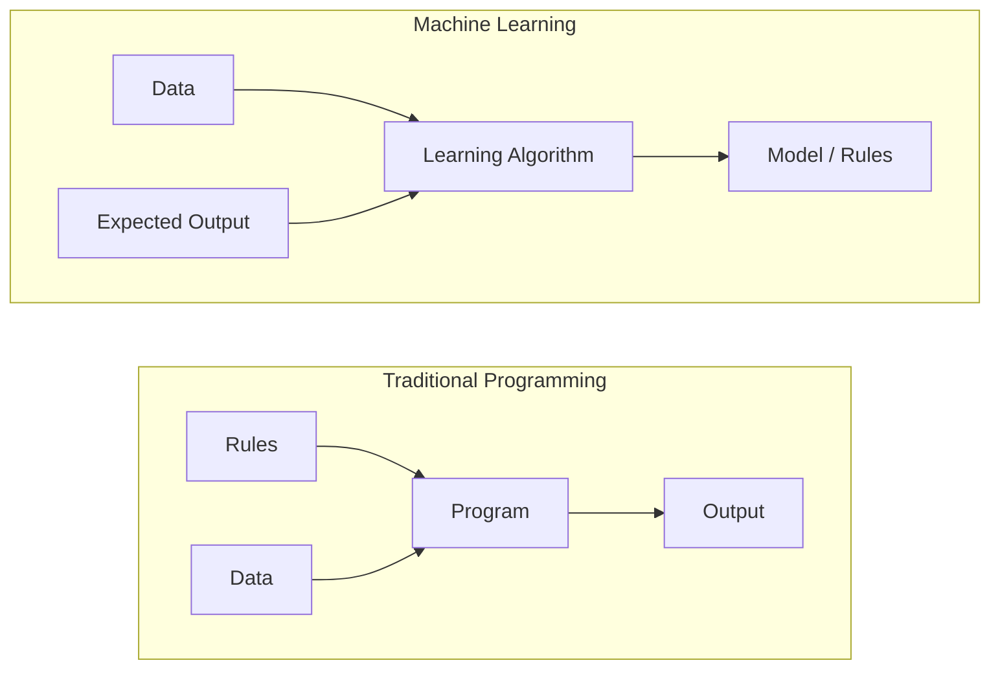
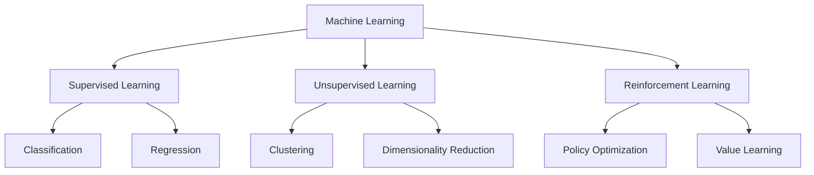
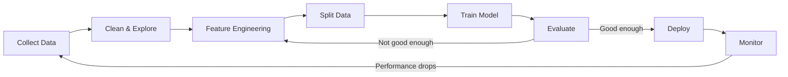
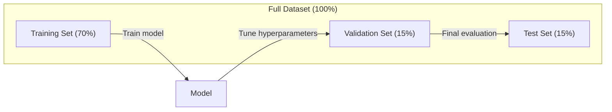
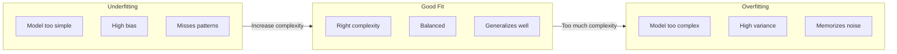
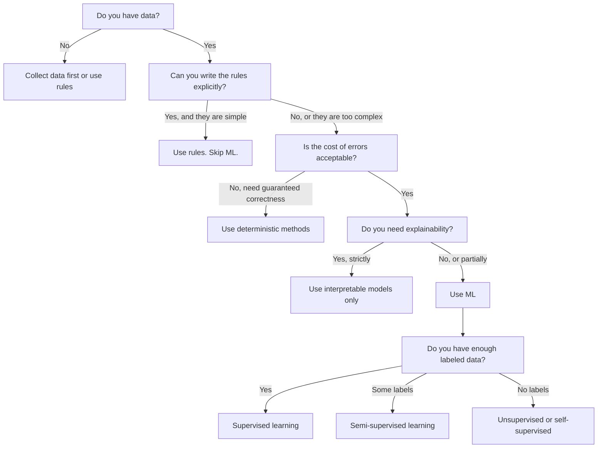

# What Is Machine Learning / 什么是机器学习

> 机器学习不是手写规则，而是教计算机从数据中发现模式。

**Type / 类型：** Learn / 学习
**Languages / 语言：** Python
**Prerequisites / 前置知识：** Phase 1 (Math Foundations)
**Time / 时间：** 约 45 分钟

## Learning Objectives / 学习目标

- 解释 supervised learning、unsupervised learning 和 reinforcement learning 的区别，并判断给定问题属于哪一类
- 从零实现 nearest centroid classifier，并把它与随机 baseline 做对比评估
- 区分 classification 和 regression 任务，并为每类任务选择合适的 loss function
- 判断一个业务问题是否适合用 ML 解决，还是更适合用确定性的规则系统

## The Problem / 问题

你想做一个垃圾邮件过滤器。传统做法是坐下来写几百条规则：“如果邮件包含 `FREE MONEY`，标记为垃圾邮件。如果感叹号超过 3 个，标记为垃圾邮件。”你花几周时间写规则。然后垃圾邮件发送者换了措辞，你的规则失效。你继续补规则。这个循环没有尽头。

机器学习把这个过程反过来。你不再手写规则，而是给计算机几千封带标签的邮件（“spam” 或 “not spam”），让它自己找出规则。计算机会发现你未必能想到的模式。当垃圾邮件策略变化时，你用新数据重新训练，而不是重写代码。

这种从“编写规则”到“从数据中学习”的转变，就是机器学习的核心。推荐系统、语音助手、自动驾驶汽车和语言模型，本质上都按这个方式工作。

## The Concept / 概念

### Learning From Data, Not Rules / 从数据学习，而不是从规则学习

传统编程和机器学习是从相反方向解决问题的。



传统编程：你写规则，程序把规则应用到数据上，然后产生输出。

机器学习：你提供数据和期望输出，算法从中发现规则。

训练得到的 “model” 本身就是规则，只不过这些规则被编码成数字（weights、parameters）。它会从已经见过的样本中泛化，对从未见过的数据做预测。

### The Three Types of Machine Learning / 机器学习的三种类型



**Supervised Learning / 监督学习**：你拥有输入-输出配对数据。模型学习如何把输入映射到输出。
- “这里有 10,000 张标注为猫或狗的照片，学会区分它们。”
- “这里有房屋特征和售价，学会预测价格。”

**Unsupervised Learning / 无监督学习**：你只有输入，没有标签。模型自己寻找结构。
- “这里有 10,000 条客户购买历史，找出自然分组。”
- “这里有 1,000 维的数据点，在保留结构的同时降到 2 维。”

**Reinforcement Learning / 强化学习**：一个 agent 在环境中采取动作，并获得奖励或惩罚。它学习一种策略（policy），让总奖励最大化。
- “玩这个游戏。赢了 +1，输了 -1。自己找策略。”
- “控制机械臂。拿起物体 +1，每浪费一秒 -0.01。”

实践中你最常构建的是 supervised learning。Unsupervised learning 常用于预处理和探索。Reinforcement learning 支撑游戏 AI、机器人，以及语言模型中的 RLHF。

### Beyond the Big Three / 三大类之外

上面三类很清晰，但真实世界的 ML 经常会混合它们的边界。

**Semi-supervised learning / 半监督学习** 使用少量有标签数据和大量无标签数据。你可能有 100 张已标注医学影像，以及 100,000 张未标注影像。常见技术包括：

- **Label propagation：** 构建连接相似数据点的图。标签会沿着图从有标签节点传播到相邻的无标签节点。
- **Pseudo-labeling：** 先用有标签数据训练模型，再用它给无标签数据预测标签，然后把所有数据一起重新训练。模型会为自己“扩充”训练集。
- **Consistency regularization：** 同一个输入和它轻微扰动后的版本，模型应该给出相同预测。即使没有标签，这个约束也能发挥作用。

**Self-supervised learning / 自监督学习** 从数据本身构造监督信号，完全不需要人工标签。模型根据数据结构为自己创建预测任务。

- **Masked language modeling (BERT)：** 隐藏句子中 15% 的词，让模型预测缺失词。“标签”来自原始文本。
- **Contrastive learning (SimCLR)：** 取一张图片，生成两个增强版本。训练模型识别它们来自同一张图，同时区分其他图片的增强版本。
- **Next-token prediction (GPT)：** 给定前面的所有词，预测下一个词。每个文本文档都能变成训练样本。

这些不是独立于三大类的新类别，而是把监督和无监督思想结合起来的策略。Self-supervised learning 从技术上看仍然是 supervised（模型在预测某个东西），只是标签自动生成，不由人标注。

### Classification vs Regression / 分类与回归

这是两类主要的监督学习任务。

| Aspect / 方面 | Classification / 分类 | Regression / 回归 |
|--------|---------------|------------|
| Output / 输出 | 离散类别 | 连续数值 |
| Example / 示例 | “这封邮件是垃圾邮件吗？” | “房价会是多少？” |
| Output space / 输出空间 | {cat, dog, bird} | 任意实数 |
| Loss function / 损失函数 | Cross-entropy, accuracy | Mean squared error, MAE |
| Decision / 决策形式 | 类别之间的边界 | 拟合数据的一条曲线 |

Classification 回答“属于哪一类？”Regression 回答“数值是多少？”

有些问题两种方式都能表达。预测股票上涨还是下跌是 classification。预测精确价格是 regression。

### The ML Workflow / ML 工作流

无论算法是什么，每个机器学习项目都会遵循同一条 pipeline。



**Collect Data / 收集数据**：收集原始数据。更多数据通常更好，但质量比数量更重要。

**Clean & Explore / 清洗与探索**：处理缺失值、去重、可视化分布、发现异常。这个步骤经常占整个项目时间的 60-80%。

**Feature Engineering / 特征工程**：把原始数据转成模型可用的 features。把日期转成星期几，归一化数值列，编码类别变量。好的 features 比花哨的算法更重要。

**Split Data / 划分数据**：分成 training、validation 和 test sets。模型在 training data 上训练，你在 validation data 上调 hyperparameters，最后在 test data 上报告最终性能。

**Train Model / 训练模型**：把训练数据喂给算法。算法调整内部参数，让 loss function 最小化。

**Evaluate / 评估**：在 validation/test data 上衡量性能。如果性能不可接受，就回到前面尝试不同 features、algorithms 或 hyperparameters。

**Deploy / 部署**：把模型放到生产环境，让它对新数据做预测。

**Monitor / 监控**：跟踪性能随时间的变化。数据分布会变（data drift），模型会退化。当性能下降时，需要重新训练。

### Training, Validation, and Test Splits / 训练集、验证集与测试集划分

这是初学者最容易弄错、也最重要的概念。你必须在训练期间从未见过的数据上评估模型。否则你衡量的是记忆能力，不是学习能力。



| Split / 划分 | Purpose / 用途 | When used / 使用时机 | Typical size / 常见比例 |
|-------|---------|-----------|-------------|
| Training | 模型从这部分数据学习 | 训练期间 | 60-80% |
| Validation | 调 hyperparameters、比较模型 | 每次训练后 | 10-20% |
| Test | 最终无偏性能估计 | 只在最后用一次 | 10-20% |

Test set 是神圣的。你只看它一次。如果你根据 test performance 不断调整模型，本质上就是在 test set 上训练，你报告的数字也就没有意义了。

小数据集可以用 k-fold cross-validation：把数据切成 k 份，用 k-1 份训练，剩下 1 份验证，轮换并平均结果。

### Overfitting vs Underfitting / 过拟合与欠拟合



**Underfitting / 欠拟合**：模型太简单，抓不住数据里的模式。比如用直线拟合弯曲关系。Training error 高，test error 也高。

**Overfitting / 过拟合**：模型太复杂，把训练数据连同噪声都记住了。比如一条弯弯曲曲的曲线穿过每个训练点，但在新数据上失败。Training error 低，test error 高。

**Good fit / 良好拟合**：模型捕捉真实模式，但没有记忆噪声。Training error 和 test error 都比较低。

过拟合的信号：
- Training accuracy 明显高于 validation accuracy
- 模型在训练数据上表现很好，在新数据上表现很差
- 增加训练数据能提升性能（说明模型原本在记忆，而不是学习）

修复过拟合：
- 获取更多训练数据
- 降低模型复杂度（更少参数、更简单架构）
- Regularization（对大权重增加惩罚）
- Dropout（训练时随机把神经元置零）
- Early stopping（validation error 开始上升时停止训练）

修复欠拟合：
- 使用更复杂的模型
- 增加更多 features
- 降低 regularization
- 训练更久

### The Bias-Variance Tradeoff / 偏差-方差权衡

这是 overfitting 和 underfitting 背后的数学框架。

**Bias / 偏差**：来自模型错误假设的误差。当真实关系是非线性的，而你用线性模型时，bias 很高。高 bias 会导致 underfitting。

**Variance / 方差**：来自模型对训练数据小波动过于敏感的误差。高 variance 的模型在不同数据子集上训练会给出很不一样的预测。高 variance 会导致 overfitting。

| Model complexity / 模型复杂度 | Bias / 偏差 | Variance / 方差 | Result / 结果 |
|-----------------|------|----------|--------|
| Too low（用线性模型拟合曲线数据） | High | Low | Underfitting |
| Just right | Medium | Medium | Good generalization |
| Too high（10 个点拟合 20 阶多项式） | Low | High | Overfitting |

Total error = Bias^2 + Variance + Irreducible noise

你无法降低 irreducible noise（它是数据本身的随机性）。你要找的是让 bias^2 + variance 最小的最佳折中点。

### No Free Lunch Theorem / 没有免费午餐定理

不存在对所有问题都最优的单一算法。一个算法在某类问题上表现好，就会在另一类问题上表现差。这就是为什么 data scientist 会尝试多个算法并比较结果。

实践中，选择取决于：
- 你有多少数据
- features 有多少
- 关系是线性的还是非线性的
- 是否需要可解释性
- 可用算力有多少

### When NOT to Use Machine Learning / 什么时候不要用机器学习

ML 很强，但不总是合适的工具。在拿模型之前，先问自己是否真的需要它。

**不要在这些情况下使用 ML：**

- **规则简单且定义清楚。** 税费计算、排序算法、单位换算。如果几条 if 语句就能写清逻辑，模型只会增加复杂度。
- **没有数据或数据极少。** ML 需要样本来学习。10 个数据点训练不出有意义的东西。先收集数据。
- **错误代价灾难性，且需要保证正确。** 医疗剂量计算、核反应堆控制、密码学验证。ML 模型是概率性的，一定会偶尔出错。如果“偶尔出错”不可接受，就用确定性方法。
- **查表或 heuristic 已经能解决问题。** 如果简单阈值或表覆盖了 99% 情况，引入 ML 会增加维护成本，却没有实质收益。
- **你无法解释决策，而可解释性是硬要求。** 借贷、保险、刑事司法等受监管行业有时要求每个决策都可完全解释。有些 ML 模型可解释（linear regression、小 decision tree），大多数不行。
- **问题变化快过重新训练速度。** 如果规则每天变，而重新训练要一周，模型永远是过期的。

使用这个决策流程：



## Build It / 动手构建

`code/ml_intro.py` 里的代码从零实现了 nearest centroid classifier，这是最简单的 ML 算法。它展示了核心思想：从数据学习，然后对新数据预测。

### Step 1: Nearest Centroid Classifier from Scratch / 第 1 步：从零实现最近质心分类器

Nearest centroid classifier 会计算训练数据中每个类别的中心（均值）。预测时，把新点分配给距离最近的类别中心。

```python
class NearestCentroid:
    def fit(self, X, y):
        self.classes = np.unique(y)
        self.centroids = np.array([
            X[y == c].mean(axis=0) for c in self.classes
        ])

    def predict(self, X):
        distances = np.array([
            np.sqrt(((X - c) ** 2).sum(axis=1))
            for c in self.centroids
        ])
        return self.classes[distances.argmin(axis=0)]
```

这就是完整算法。Fit 计算两个均值。Predict 计算距离。没有 gradient descent，没有迭代，也没有 hyperparameters。

### Step 2: Train on Synthetic Data / 第 2 步：在合成数据上训练

我们生成一个二维分类数据集，两类数据略有重叠。Centroid classifier 会在两个类别中心之间画出线性 decision boundary。

```python
rng = np.random.RandomState(42)
X_class0 = rng.randn(100, 2) + np.array([1.0, 1.0])
X_class1 = rng.randn(100, 2) + np.array([-1.0, -1.0])
X = np.vstack([X_class0, X_class1])
y = np.array([0] * 100 + [1] * 100)
```

### Step 3: Compare Against a Baseline / 第 3 步：与 baseline 对比

每个 ML 模型都应该和一个平凡 baseline 对比。这里的 baseline 随机预测类别。如果你的 ML 模型连随机猜都比不过，那一定哪里出了问题。

```python
baseline_preds = rng.choice([0, 1], size=len(y_test))
baseline_acc = np.mean(baseline_preds == y_test)
```

在这个干净数据集上，centroid classifier 应该能达到约 90%+ accuracy。随机 baseline 约 50%。

### Why This Matters / 为什么这很重要

Nearest centroid classifier 简单到近乎平凡。它没有 hyperparameters，没有迭代，没有 gradient descent。但它捕捉了 ML 的基本模式：

1. 从训练数据中 **learn** 一种表示（centroids）
2. 用这种表示对新数据 **predict**（nearest distance）
3. 与 baseline **evaluate**（random guessing）

从 logistic regression 到 transformers，所有 ML 算法都遵循这三个步骤。表示会越来越复杂，但工作流不变。

### Step 4: What the Centroid Classifier Cannot Do / 第 4 步：Centroid classifier 做不到什么

Nearest centroid classifier 假设每个类别形成单个“团块”。它画的是线性 decision boundaries。它会在这些情况下失败：

- 一个类别有多个 cluster（例如数字 “1” 可以有多种写法）
- Decision boundary 是非线性的（例如一个类别包围另一个类别）
- features 的尺度差异很大（距离被最大尺度的 feature 主导）

这些限制会引出你后面要学习的其他算法。K-nearest neighbors 能处理多个 cluster。Decision trees 能处理非线性边界。Feature scaling 能修复尺度问题。每节课都会建立在上一节课的限制之上。

## Use It / 应用它

sklearn 提供了 `NearestCentroid` 和合成数据生成器：

```python
from sklearn.neighbors import NearestCentroid
from sklearn.datasets import make_classification
from sklearn.model_selection import train_test_split

X, y = make_classification(
    n_samples=500, n_features=2, n_redundant=0,
    n_clusters_per_class=1, random_state=42
)
X_train, X_test, y_train, y_test = train_test_split(X, y, test_size=0.3)

clf = NearestCentroid()
clf.fit(X_train, y_train)
print(f"Accuracy: {clf.score(X_test, y_test):.3f}")
```

## Ship It / 交付它

本课会产出 `outputs/prompt-ml-problem-framer.md`：一个把模糊业务问题转成具体 ML 任务的 prompt。给它一个问题描述（比如 “we want to reduce churn” 或 “predict demand for next quarter”），它会识别 learning type、定义 prediction target、列出候选 features、选择 success metric、建立 baseline，并标记 data leakage 或 class imbalance 等陷阱。在任何 ML 项目开始时使用它，可以避免构建错误的东西。

## Key Terms / 关键术语

| 术语 | 常见说法 | 实际含义 |
|------|----------------|----------------------|
| Model | “The AI” | 一个带有可学习参数的数学函数，把输入映射到输出 |
| Training | “Teaching the AI” | 运行优化算法来调整模型参数，让预测匹配已知输出 |
| Feature | “An input column” | 数据中可测量的属性，模型用它来做预测 |
| Label | “The answer” | 训练样本的已知输出，用来计算 error signal |
| Hyperparameter | “A setting you tweak” | 训练前设定、控制学习过程的参数（learning rate、层数等） |
| Loss function | “How wrong the model is” | 衡量预测输出和真实输出差距的函数，训练会尝试最小化它 |
| Overfitting | “It memorized the test” | 模型学到了训练集特有噪声，而不是一般模式，所以在新数据上失败 |
| Underfitting | “It didn't learn anything” | 模型太简单，无法捕捉数据中的真实模式 |
| Generalization | “It works on new data” | 模型对未训练过的数据做出准确预测的能力 |
| Cross-validation | “Testing on different chunks” | 反复把数据切成 train/test folds 并平均结果，得到更稳健的性能估计 |
| Regularization | “Keeping weights small” | 在 loss function 中加入惩罚项，抑制过度复杂的模型 |
| Data drift | “The world changed” | 输入数据的统计分布随时间变化，导致模型性能下降 |

## Exercises / 练习

1. 任选一个数据集（例如 Iris、Titanic），按 70/15/15 划分 train/validation/test。解释为什么不应该在 test set 上调 hyperparameters。
2. 列出三个真实世界问题。对每个问题判断它是 classification、regression 还是 clustering，以及是 supervised 还是 unsupervised。
3. 一个模型在训练数据上达到 99% accuracy，但在测试数据上只有 60%。诊断问题，并列出三个你会尝试的修复方法。

## Further Reading / 延伸阅读

- [An Introduction to Statistical Learning](https://www.statlearning.com/) - 免费教材，覆盖所有经典 ML 方法，并包含实践示例
- [Google's Machine Learning Crash Course](https://developers.google.com/machine-learning/crash-course) - 简洁、可视化的 ML 概念入门
- [Scikit-learn User Guide](https://scikit-learn.org/stable/user_guide.html) - 在 Python 中实现 ML 的实用参考
