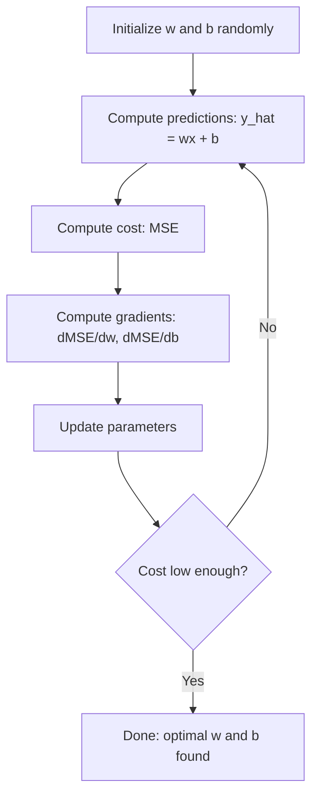

# Linear Regression / 线性回归

> 线性回归是在数据中画出最合适的一条直线。它是机器学习里的 “hello world”。

**Type / 类型：** Build / 构建
**Languages / 语言：** Python
**Prerequisites / 前置知识：** Phase 1 (Linear Algebra, Calculus, Optimization), Phase 2 Lesson 1
**Time / 时间：** 约 90 分钟

## Learning Objectives / 学习目标

- 推导 mean squared error 的 gradient descent 更新规则，并从零实现 linear regression
- 从计算复杂度和适用场景两个角度比较 gradient descent 与 normal equation
- 构建带 feature standardization 的 multiple linear regression 模型，并解释学到的 weights
- 解释 Ridge regression（L2 regularization）如何通过惩罚大权重来防止 overfitting

## The Problem / 问题

你有一组数据：房屋面积和成交价格。你想根据新房子的面积预测价格。你可以在散点图上凭感觉估计，但你需要一个公式。你需要一条最贴合数据的线，这样才能输入任意面积并得到价格预测。

Linear regression 给你的就是这条线。更重要的是，它引入了完整的 ML 训练循环：定义模型、定义 cost function、优化 parameters。所有 ML 算法都遵循同样的模式。先在最简单的场景里掌握它，之后你会在各处认出这个结构。

它不只适合简单问题。Linear regression 在生产系统中用于需求预测、A/B test 分析、金融建模，也常作为所有 regression task 的 baseline。

## The Concept / 概念

### The Model / 模型

Linear regression 假设输入（x）和输出（y）之间存在线性关系：

```
y = wx + b
```

- `w` (weight/slope)：当 x 增加 1 时，y 改变多少
- `b` (bias/intercept)：当 x = 0 时，y 的值

对于多个输入（features），它扩展为：

```
y = w1*x1 + w2*x2 + ... + wn*xn + b
```

向量形式为：`y = w^T * x + b`

目标是找到 w 和 b 的取值，让所有训练样本上的 predicted y 尽可能接近 actual y。

### The Cost Function (Mean Squared Error) / Cost function（均方误差）

如何衡量“尽可能接近”？你需要一个数字来表示预测有多错。最常见选择是 Mean Squared Error (MSE)：

```
MSE = (1/n) * sum((y_predicted - y_actual)^2)
```

为什么平方？两个原因。第一，它对大误差惩罚更重（误差 10 比误差 1 糟 100 倍，而不是 10 倍）。第二，平方函数处处平滑且可微，让优化变得直接。

Cost function 会形成一个曲面。对于单个 weight w 和 bias b，MSE 曲面像一个碗（convex paraboloid）。碗底就是 MSE 最小的位置。训练就是找到这个碗底。

### Gradient Descent / 梯度下降

Gradient descent 通过一步步往下走来找到碗底。



Gradients 告诉你两件事：每个 parameter 应该朝哪个方向移动，以及移动多少。

对于 MSE 和 y_hat = wx + b：

```
dMSE/dw = (2/n) * sum((y_hat - y) * x)
dMSE/db = (2/n) * sum(y_hat - y)
```

更新规则：

```
w = w - learning_rate * dMSE/dw
b = b - learning_rate * dMSE/db
```

Learning rate 控制步长。太大：会越过最小值并发散。太小：训练会很慢。常见起始值：0.01、0.001 或 0.0001。

### The Normal Equation (Closed-Form Solution) / Normal equation（闭式解）

对 linear regression 来说，有一个无需迭代、直接给出最优 weights 的公式：

```
w = (X^T * X)^(-1) * X^T * y
```

它通过矩阵求逆一步解出 w。小数据集上非常好用。对大数据集（百万行或上千 features），通常更偏向 gradient descent，因为矩阵求逆在 features 数量上是 O(n^3)。

### Multiple Linear Regression / 多元线性回归

有多个 features 时，模型变成：

```
y = w1*x1 + w2*x2 + ... + wn*xn + b
```

其他部分完全一样：MSE 是 cost function，gradient descent 同时更新所有 weights。唯一差别是你拟合的是 hyperplane，而不是一条线。

Feature scaling 在这里很重要。如果一个 feature 范围是 0 到 1，另一个是 0 到 1,000,000，gradient descent 会很吃力，因为 cost surface 会被拉长。训练前要标准化 features（减去均值，除以标准差）。

### Polynomial Regression / 多项式回归

如果关系不是线性的怎么办？你仍然可以使用 linear regression，只要创建 polynomial features：

```
y = w1*x + w2*x^2 + w3*x^3 + b
```

它仍然是 “linear” regression，因为模型对 weights（w1、w2、w3）是线性的。你只是使用了 x 的非线性 features。

更高阶的多项式能拟合更复杂的曲线，但也有 overfitting 风险。一个 10 阶多项式可以穿过 10 点数据集里的每个点，却在新数据上预测很差。

### R-Squared Score / R-squared 分数

MSE 告诉你错得多厉害，但数值依赖 y 的尺度。R-squared (R^2) 给出一个与尺度无关的指标：

```
R^2 = 1 - (sum of squared residuals) / (sum of squared deviations from mean)
    = 1 - SS_res / SS_tot
```

- R^2 = 1.0：预测完美
- R^2 = 0.0：模型不比每次预测均值更好
- R^2 < 0.0：模型比预测均值还差

### Regularization Preview (Ridge Regression) / Regularization 预览（Ridge regression）

当 features 很多时，模型可能通过分配很大的 weights 来 overfit。Ridge regression（L2 regularization）加入惩罚项：

```
Cost = MSE + lambda * sum(w_i^2)
```

惩罚项会抑制大权重。Hyperparameter lambda 控制权衡：lambda 越高，weights 越小，regularization 越强。后续课程会深入讲它。现在先知道它存在，以及为什么有用。

```figure
linear-regression-fit
```

## Build It / 动手构建

### Step 1: Generate sample data / 第 1 步：生成样本数据

```python
import random
import math

random.seed(42)

TRUE_W = 3.0
TRUE_B = 7.0
N_SAMPLES = 100

X = [random.uniform(0, 10) for _ in range(N_SAMPLES)]
y = [TRUE_W * x + TRUE_B + random.gauss(0, 2.0) for x in X]

print(f"Generated {N_SAMPLES} samples")
print(f"True relationship: y = {TRUE_W}x + {TRUE_B} (+ noise)")
print(f"First 5 points: {[(round(X[i], 2), round(y[i], 2)) for i in range(5)]}")
```

### Step 2: Linear regression from scratch with gradient descent / 第 2 步：用 gradient descent 从零实现 linear regression

```python
class LinearRegression:
    def __init__(self, learning_rate=0.01):
        self.w = 0.0
        self.b = 0.0
        self.lr = learning_rate
        self.cost_history = []

    def predict(self, X):
        return [self.w * x + self.b for x in X]

    def compute_cost(self, X, y):
        predictions = self.predict(X)
        n = len(y)
        cost = sum((pred - actual) ** 2 for pred, actual in zip(predictions, y)) / n
        return cost

    def compute_gradients(self, X, y):
        predictions = self.predict(X)
        n = len(y)
        dw = (2 / n) * sum((pred - actual) * x for pred, actual, x in zip(predictions, y, X))
        db = (2 / n) * sum(pred - actual for pred, actual in zip(predictions, y))
        return dw, db

    def fit(self, X, y, epochs=1000, print_every=200):
        for epoch in range(epochs):
            dw, db = self.compute_gradients(X, y)
            self.w -= self.lr * dw
            self.b -= self.lr * db
            cost = self.compute_cost(X, y)
            self.cost_history.append(cost)
            if epoch % print_every == 0:
                print(f"  Epoch {epoch:4d} | Cost: {cost:.4f} | w: {self.w:.4f} | b: {self.b:.4f}")
        return self

    def r_squared(self, X, y):
        predictions = self.predict(X)
        y_mean = sum(y) / len(y)
        ss_res = sum((actual - pred) ** 2 for actual, pred in zip(y, predictions))
        ss_tot = sum((actual - y_mean) ** 2 for actual in y)
        return 1 - (ss_res / ss_tot)


print("=== Training Linear Regression (Gradient Descent) ===")
model = LinearRegression(learning_rate=0.005)
model.fit(X, y, epochs=1000, print_every=200)
print(f"\nLearned: y = {model.w:.4f}x + {model.b:.4f}")
print(f"True:    y = {TRUE_W}x + {TRUE_B}")
print(f"R-squared: {model.r_squared(X, y):.4f}")
```

### Step 3: Normal equation (closed-form solution) / 第 3 步：Normal equation（闭式解）

```python
class LinearRegressionNormal:
    def __init__(self):
        self.w = 0.0
        self.b = 0.0

    def fit(self, X, y):
        n = len(X)
        x_mean = sum(X) / n
        y_mean = sum(y) / n
        numerator = sum((X[i] - x_mean) * (y[i] - y_mean) for i in range(n))
        denominator = sum((X[i] - x_mean) ** 2 for i in range(n))
        self.w = numerator / denominator
        self.b = y_mean - self.w * x_mean
        return self

    def predict(self, X):
        return [self.w * x + self.b for x in X]

    def r_squared(self, X, y):
        predictions = self.predict(X)
        y_mean = sum(y) / len(y)
        ss_res = sum((actual - pred) ** 2 for actual, pred in zip(y, predictions))
        ss_tot = sum((actual - y_mean) ** 2 for actual in y)
        return 1 - (ss_res / ss_tot)


print("\n=== Normal Equation (Closed-Form) ===")
model_normal = LinearRegressionNormal()
model_normal.fit(X, y)
print(f"Learned: y = {model_normal.w:.4f}x + {model_normal.b:.4f}")
print(f"R-squared: {model_normal.r_squared(X, y):.4f}")
```

### Step 4: Multiple linear regression / 第 4 步：多元线性回归

```python
class MultipleLinearRegression:
    def __init__(self, n_features, learning_rate=0.01):
        self.weights = [0.0] * n_features
        self.bias = 0.0
        self.lr = learning_rate
        self.cost_history = []

    def predict_single(self, x):
        return sum(w * xi for w, xi in zip(self.weights, x)) + self.bias

    def predict(self, X):
        return [self.predict_single(x) for x in X]

    def compute_cost(self, X, y):
        predictions = self.predict(X)
        n = len(y)
        return sum((pred - actual) ** 2 for pred, actual in zip(predictions, y)) / n

    def fit(self, X, y, epochs=1000, print_every=200):
        n = len(y)
        n_features = len(X[0])
        for epoch in range(epochs):
            predictions = self.predict(X)
            errors = [pred - actual for pred, actual in zip(predictions, y)]
            for j in range(n_features):
                grad = (2 / n) * sum(errors[i] * X[i][j] for i in range(n))
                self.weights[j] -= self.lr * grad
            grad_b = (2 / n) * sum(errors)
            self.bias -= self.lr * grad_b
            cost = self.compute_cost(X, y)
            self.cost_history.append(cost)
            if epoch % print_every == 0:
                print(f"  Epoch {epoch:4d} | Cost: {cost:.4f}")
        return self

    def r_squared(self, X, y):
        predictions = self.predict(X)
        y_mean = sum(y) / len(y)
        ss_res = sum((actual - pred) ** 2 for actual, pred in zip(y, predictions))
        ss_tot = sum((actual - y_mean) ** 2 for actual in y)
        return 1 - (ss_res / ss_tot)


random.seed(42)
N = 100
X_multi = []
y_multi = []
for _ in range(N):
    size = random.uniform(500, 3000)
    bedrooms = random.randint(1, 5)
    age = random.uniform(0, 50)
    price = 50 * size + 10000 * bedrooms - 1000 * age + 50000 + random.gauss(0, 20000)
    X_multi.append([size, bedrooms, age])
    y_multi.append(price)


def standardize(X):
    n_features = len(X[0])
    means = [sum(X[i][j] for i in range(len(X))) / len(X) for j in range(n_features)]
    stds = []
    for j in range(n_features):
        variance = sum((X[i][j] - means[j]) ** 2 for i in range(len(X))) / len(X)
        stds.append(variance ** 0.5)
    X_scaled = []
    for i in range(len(X)):
        row = [(X[i][j] - means[j]) / stds[j] if stds[j] > 0 else 0 for j in range(n_features)]
        X_scaled.append(row)
    return X_scaled, means, stds


y_mean_val = sum(y_multi) / len(y_multi)
y_std_val = (sum((yi - y_mean_val) ** 2 for yi in y_multi) / len(y_multi)) ** 0.5
y_scaled = [(yi - y_mean_val) / y_std_val for yi in y_multi]

X_scaled, x_means, x_stds = standardize(X_multi)

print("\n=== Multiple Linear Regression (3 features) ===")
print("Features: house size, bedrooms, age")
multi_model = MultipleLinearRegression(n_features=3, learning_rate=0.01)
multi_model.fit(X_scaled, y_scaled, epochs=1000, print_every=200)

print(f"\nWeights (standardized): {[round(w, 4) for w in multi_model.weights]}")
print(f"Bias (standardized): {multi_model.bias:.4f}")
print(f"R-squared: {multi_model.r_squared(X_scaled, y_scaled):.4f}")
```

### Step 5: Polynomial regression / 第 5 步：多项式回归

```python
class PolynomialRegression:
    def __init__(self, degree, learning_rate=0.01):
        self.degree = degree
        self.weights = [0.0] * degree
        self.bias = 0.0
        self.lr = learning_rate

    def make_features(self, X):
        return [[x ** (d + 1) for d in range(self.degree)] for x in X]

    def predict(self, X):
        features = self.make_features(X)
        return [sum(w * f for w, f in zip(self.weights, row)) + self.bias for row in features]

    def fit(self, X, y, epochs=1000, print_every=200):
        features = self.make_features(X)
        n = len(y)
        for epoch in range(epochs):
            predictions = [sum(w * f for w, f in zip(self.weights, row)) + self.bias for row in features]
            errors = [pred - actual for pred, actual in zip(predictions, y)]
            for j in range(self.degree):
                grad = (2 / n) * sum(errors[i] * features[i][j] for i in range(n))
                self.weights[j] -= self.lr * grad
            grad_b = (2 / n) * sum(errors)
            self.bias -= self.lr * grad_b
            if epoch % print_every == 0:
                cost = sum(e ** 2 for e in errors) / n
                print(f"  Epoch {epoch:4d} | Cost: {cost:.6f}")
        return self

    def r_squared(self, X, y):
        predictions = self.predict(X)
        y_mean = sum(y) / len(y)
        ss_res = sum((actual - pred) ** 2 for actual, pred in zip(y, predictions))
        ss_tot = sum((actual - y_mean) ** 2 for actual in y)
        return 1 - (ss_res / ss_tot)


random.seed(42)
X_poly = [x / 10.0 for x in range(0, 50)]
y_poly = [0.5 * x ** 2 - 2 * x + 3 + random.gauss(0, 1.0) for x in X_poly]

x_max = max(abs(x) for x in X_poly)
X_poly_norm = [x / x_max for x in X_poly]
y_poly_mean = sum(y_poly) / len(y_poly)
y_poly_std = (sum((yi - y_poly_mean) ** 2 for yi in y_poly) / len(y_poly)) ** 0.5
y_poly_norm = [(yi - y_poly_mean) / y_poly_std for yi in y_poly]

print("\n=== Polynomial Regression (degree 2 vs degree 5) ===")
print("True relationship: y = 0.5x^2 - 2x + 3")

print("\nDegree 2:")
poly2 = PolynomialRegression(degree=2, learning_rate=0.1)
poly2.fit(X_poly_norm, y_poly_norm, epochs=2000, print_every=500)
print(f"  R-squared: {poly2.r_squared(X_poly_norm, y_poly_norm):.4f}")

print("\nDegree 5:")
poly5 = PolynomialRegression(degree=5, learning_rate=0.1)
poly5.fit(X_poly_norm, y_poly_norm, epochs=2000, print_every=500)
print(f"  R-squared: {poly5.r_squared(X_poly_norm, y_poly_norm):.4f}")

print("\nDegree 2 fits the true curve well. Degree 5 fits training data slightly better")
print("but risks overfitting on new data.")
```

### Step 6: Ridge regression (L2 regularization) / 第 6 步：Ridge regression（L2 regularization）

```python
class RidgeRegression:
    def __init__(self, n_features, learning_rate=0.01, alpha=1.0):
        self.weights = [0.0] * n_features
        self.bias = 0.0
        self.lr = learning_rate
        self.alpha = alpha

    def predict_single(self, x):
        return sum(w * xi for w, xi in zip(self.weights, x)) + self.bias

    def predict(self, X):
        return [self.predict_single(x) for x in X]

    def fit(self, X, y, epochs=1000, print_every=200):
        n = len(y)
        n_features = len(X[0])
        for epoch in range(epochs):
            predictions = self.predict(X)
            errors = [pred - actual for pred, actual in zip(predictions, y)]
            mse = sum(e ** 2 for e in errors) / n
            reg_term = self.alpha * sum(w ** 2 for w in self.weights)
            cost = mse + reg_term
            for j in range(n_features):
                grad = (2 / n) * sum(errors[i] * X[i][j] for i in range(n))
                grad += 2 * self.alpha * self.weights[j]
                self.weights[j] -= self.lr * grad
            grad_b = (2 / n) * sum(errors)
            self.bias -= self.lr * grad_b
            if epoch % print_every == 0:
                print(f"  Epoch {epoch:4d} | Cost: {cost:.4f} | L2 penalty: {reg_term:.4f}")
        return self


print("\n=== Ridge Regression (L2 Regularization) ===")
print("Same data as multiple regression, with alpha=0.1")
ridge = RidgeRegression(n_features=3, learning_rate=0.01, alpha=0.1)
ridge.fit(X_scaled, y_scaled, epochs=1000, print_every=200)
print(f"\nRidge weights: {[round(w, 4) for w in ridge.weights]}")
print(f"Plain weights: {[round(w, 4) for w in multi_model.weights]}")
print("Ridge weights are smaller (shrunk toward zero) due to the L2 penalty.")
```

## Use It / 应用它

下面用 scikit-learn 完成同样的事，这也是你在生产中真正会使用的方式。

```python
from sklearn.linear_model import LinearRegression as SklearnLR
from sklearn.linear_model import Ridge
from sklearn.preprocessing import PolynomialFeatures, StandardScaler
from sklearn.model_selection import train_test_split
from sklearn.metrics import mean_squared_error, r2_score
import numpy as np

np.random.seed(42)
X_sk = np.random.uniform(0, 10, (100, 1))
y_sk = 3.0 * X_sk.squeeze() + 7.0 + np.random.normal(0, 2.0, 100)

X_train, X_test, y_train, y_test = train_test_split(X_sk, y_sk, test_size=0.2, random_state=42)

lr = SklearnLR()
lr.fit(X_train, y_train)
y_pred = lr.predict(X_test)

print("=== Scikit-learn Linear Regression ===")
print(f"Coefficient (w): {lr.coef_[0]:.4f}")
print(f"Intercept (b): {lr.intercept_:.4f}")
print(f"R-squared (test): {r2_score(y_test, y_pred):.4f}")
print(f"MSE (test): {mean_squared_error(y_test, y_pred):.4f}")

poly = PolynomialFeatures(degree=2, include_bias=False)
X_poly_sk = poly.fit_transform(X_train)
X_poly_test = poly.transform(X_test)

lr_poly = SklearnLR()
lr_poly.fit(X_poly_sk, y_train)
print(f"\nPolynomial degree 2 R-squared: {r2_score(y_test, lr_poly.predict(X_poly_test)):.4f}")

scaler = StandardScaler()
X_train_scaled = scaler.fit_transform(X_train)
X_test_scaled = scaler.transform(X_test)

ridge = Ridge(alpha=1.0)
ridge.fit(X_train_scaled, y_train)
print(f"Ridge R-squared: {r2_score(y_test, ridge.predict(X_test_scaled)):.4f}")
print(f"Ridge coefficient: {ridge.coef_[0]:.4f}")
```

你的 from-scratch 实现和 scikit-learn 会产生相同结果。区别在于：scikit-learn 处理了边界情况、数值稳定性和性能优化。生产中用库。自己实现是为了理解内部发生了什么。

## Ship It / 交付它

本课会产出：
- `outputs/skill-regression.md` - 一个根据问题选择合适 regression 方法的 skill

## Exercises / 练习

1. 实现 batch gradient descent、stochastic gradient descent (SGD) 和 mini-batch gradient descent。在同一数据集上比较收敛速度。哪个收敛最快？哪个 cost curve 最平滑？
2. 从 cubic function（y = ax^3 + bx^2 + cx + d + noise）生成数据。分别拟合 1、3、10 阶多项式。比较 training R^2 和 test R^2。从哪个 degree 开始 overfitting 明显？
3. 实现 Lasso regression（L1 regularization: penalty = alpha * sum(|w_i|））。在多 feature 房价数据上训练。比较哪些 weights 会变成 0，以及 Ridge 的结果。为什么 L1 会产生 sparse solutions，而 L2 不会？

## Key Terms / 关键术语

| 术语 | 常见说法 | 实际含义 |
|------|----------------|----------------------|
| Linear regression | “Draw a line through data” | 找到 weight w 和 bias b，让 wx+b 与真实 y 值之间的平方差之和最小 |
| Cost function | “How bad the model is” | 把模型参数映射成单个预测误差数字的函数，优化过程会最小化它 |
| Mean squared error | “Average of squared errors” | (1/n) * sum of (predicted - actual)^2，对大误差进行非线性惩罚 |
| Gradient descent | “Walk downhill” | 使用偏导数，沿着降低 cost function 的方向迭代调整参数 |
| Learning rate | “Step size” | 控制每次 gradient descent step 中参数变化幅度的标量 |
| Normal equation | “Solve it directly” | 闭式解 w = (X^T X)^-1 X^T y，无需迭代即可得到最优 weights |
| R-squared | “How good the fit is” | y 的方差中被模型解释的比例，范围从负无穷到 1.0 |
| Feature scaling | “Make features comparable” | 把 features 转换到相近范围（如零均值、单位方差），让 gradient descent 更快收敛 |
| Regularization | “Penalize complexity” | 在 cost function 中加入收缩 weights 的项，防止 overfitting |
| Ridge regression | “L2 regularization” | 在 MSE 中加入 lambda * sum(w_i^2) 惩罚项的 linear regression |
| Polynomial regression | “Fitting curves with linear math” | 在 polynomial features（x, x^2, x^3, ...）上做 linear regression，对 weights 仍然是线性的 |
| Overfitting | “Memorizing training data” | 模型复杂到拟合了训练数据中的噪声，导致在新数据上失败 |

## Further Reading / 延伸阅读

- [An Introduction to Statistical Learning (ISLR)](https://www.statlearning.com/) -- 免费 PDF，第 3 和第 6 章用实用 R 示例讲 linear regression 和 regularization
- [The Elements of Statistical Learning (ESL)](https://hastie.su.domains/ElemStatLearn/) -- 免费 PDF，ISLR 的数学加强版，对 ridge 和 lasso 讨论更深入
- [Stanford CS229 Lecture Notes on Linear Regression](https://cs229.stanford.edu/main_notes.pdf) -- Andrew Ng 的讲义，从第一性原理推导 normal equation 和 gradient descent
- [scikit-learn LinearRegression documentation](https://scikit-learn.org/stable/modules/linear_model.html) -- LinearRegression、Ridge、Lasso 和 ElasticNet 的实用参考与代码示例
