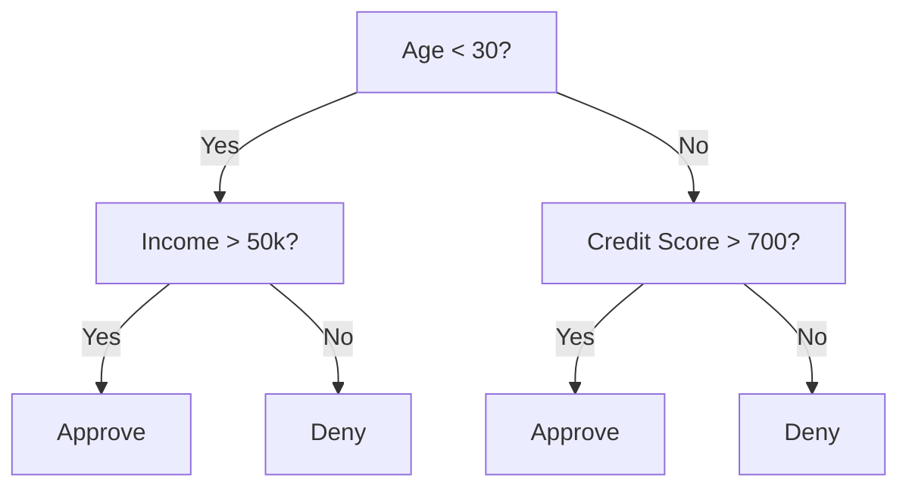
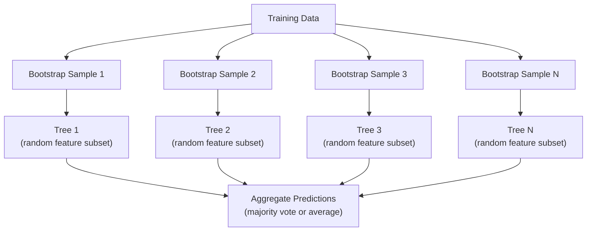

# Decision Trees and Random Forests / 决策树与随机森林

> Decision tree 本质上就是 flowchart。但由许多树组成的 forest，是 ML 中最强大的工具之一。

**Type / 类型：** Build / 构建
**Language / 语言：** Python
**Prerequisites / 前置知识：** Phase 1 (Lessons 09 Information Theory, 06 Probability)
**Time / 时间：** 约 90 分钟

## Learning Objectives / 学习目标

- 实现 Gini impurity、entropy 和 information gain 的计算，用它们寻找最优 decision tree splits
- 从零构建带 pre-pruning 控制（max depth、min samples）的 decision tree classifier
- 使用 bootstrap sampling 和 feature randomization 构建 random forest，并解释它为什么能降低 variance
- 比较 MDI feature importance 和 permutation importance，并判断 MDI 什么时候有偏

## The Problem / 问题

你有 tabular data。每一行是一个样本，每一列是一个 feature，还有一个你想预测的 target column。你可以直接上 neural network。但对 tabular data 来说，tree-based models（decision trees、random forests、gradient boosted trees）一直稳定胜过 deep learning。结构化数据上的 Kaggle 比赛由 XGBoost 和 LightGBM 主导，而不是 transformers。

为什么？Trees 不需要太多预处理，就能处理混合 feature types（numeric 和 categorical）。它们不需要 feature engineering 就能处理非线性关系。它们可解释：你可以看着树，知道一次预测到底为什么发生。Random forests 会平均很多树，对中等规模数据集上的 overfitting 非常有抵抗力。

本课从 recursive splitting 开始，从零构建 decision trees，然后在上面构建 random forest。你会实现 split criteria 背后的数学（Gini impurity、entropy、information gain），并理解一组 weak learners 为什么能变成 strong learner。

## The Concept / 概念

### What a decision tree does / Decision tree 做什么

Decision tree 通过一系列 yes/no 问题，把 feature space 切分成矩形区域。



每个 internal node 都测试一个 feature 是否超过某个 threshold。每个 leaf node 做出预测。对一个新数据点分类时，从 root 开始沿着分支走，直到 leaf。

树是自顶向下构建的：在每个 node，选择最能分开数据的 feature 和 threshold。“最好”由 split criterion 定义。

### Split criteria: measuring impurity / 划分标准：衡量 impurity

每个 node 上有一组样本。我们希望把它们切成尽可能“纯”的 child nodes，也就是每个 child 里大多属于同一类。

**Gini impurity** 衡量的是：如果按照该 node 的类别分布给一个随机样本贴标签，它被贴错的概率。

```
Gini(S) = 1 - sum(p_k^2)

where p_k is the proportion of class k in set S.
```

纯 node（全是一类）Gini = 0。二分类 50/50 split 时 Gini = 0.5。越低越好。

```
Example: 6 cats, 4 dogs

Gini = 1 - (0.6^2 + 0.4^2) = 1 - (0.36 + 0.16) = 0.48
```

**Entropy** 衡量 node 中的信息量（混乱程度）。它在 Phase 1 Lesson 09 中讲过。

```
Entropy(S) = -sum(p_k * log2(p_k))
```

纯 node entropy = 0。二分类 50/50 split 时 entropy = 1.0。越低越好。

```
Example: 6 cats, 4 dogs

Entropy = -(0.6 * log2(0.6) + 0.4 * log2(0.4))
        = -(0.6 * -0.737 + 0.4 * -1.322)
        = 0.442 + 0.529
        = 0.971 bits
```

**Information gain** 是 split 后 impurity（entropy 或 Gini）的下降量。

```
IG(S, feature, threshold) = Impurity(S) - weighted_avg(Impurity(S_left), Impurity(S_right))

where the weights are the proportions of samples in each child.
```

每个 node 上的 greedy algorithm：尝试每个 feature 和每个可能 threshold。选择让 information gain 最大的 (feature, threshold) 组合。

### How splitting works / 划分如何工作

对于当前 node 上有 n 个 features、m 个 samples 的数据集：

1. 对每个 feature j（j = 1 到 n）：
   - 按 feature j 对样本排序
   - 尝试相邻不同值之间的每个 midpoint 作为 threshold
   - 计算每个 threshold 的 information gain
2. 选择 information gain 最高的 feature 和 threshold
3. 把数据切成 left（feature <= threshold）和 right（feature > threshold）
4. 对每个 child 递归执行

这种 greedy 方法不保证得到全局最优树。寻找最优树是 NP-hard。但 greedy splitting 在实践中效果很好。

### Stopping conditions / 停止条件

没有 stopping conditions 时，树会一直长到每个 leaf 都是纯的（每个 leaf 一个样本）。这会完美记住训练数据，并且泛化极差。

**Pre-pruning** 在树完全长成前停止：
- Maximum depth：树达到指定深度后停止 split
- Minimum samples per leaf：node 样本少于 k 时停止
- Minimum information gain：最佳 split 对 impurity 的改善小于阈值时停止
- Maximum leaf nodes：限制 leaf 总数

**Post-pruning** 先长出完整树，再向回修剪：
- Cost-complexity pruning（scikit-learn 使用）：加入与 leaf 数量成比例的惩罚。惩罚越大，树越小
- Reduced error pruning：如果移除 subtree 不增加 validation error，就剪掉它

Pre-pruning 更简单更快。Post-pruning 经常产生更好的树，因为它不会过早阻止后续可能有用的 split。

### Decision trees for regression / 回归树

Regression 场景中，leaf prediction 是该 leaf 中 target values 的均值。Split criterion 也会变化：

**Variance reduction** 取代 information gain：

```
VR(S, feature, threshold) = Var(S) - weighted_avg(Var(S_left), Var(S_right))
```

选择让 variance 降低最多的 split。树会把 input space 切成多个区域，并在每个区域预测一个常数（均值）。

### Random forests: the power of ensembles / Random forests：ensemble 的力量

单棵 decision tree variance 很高。数据发生一点变化，就可能产生完全不同的树。Random forests 通过平均很多树来修复这个问题。



两种随机性让树之间保持多样：

**Bagging (bootstrap aggregating)：** 每棵树都在一个 bootstrap sample 上训练，也就是从训练数据中有放回随机抽样得到的样本。每个 bootstrap 中约 63% 的原始样本会出现，其余是 out-of-bag samples，可用于验证。

**Feature randomization：** 每次 split 时，只考虑随机子集中的 features。Classification 默认是 sqrt(n_features)，regression 默认是 n_features/3。这能防止所有树都在同一个 dominant feature 上 split。

关键洞察：平均许多去相关的树可以降低 variance，而不增加 bias。每棵树可能一般，但 ensemble 很强。

### Feature importance / 特征重要性

Random forests 天然提供 feature importance scores。最常见方法是：

**Mean Decrease in Impurity (MDI)：** 对每个 feature，把所有树中所有使用该 feature 的 nodes 的 impurity reduction 加起来。越早产生越大 impurity reduction 的 features 越重要。

```
importance(feature_j) = sum over all nodes where feature_j is used:
    (n_samples_at_node / n_total_samples) * impurity_decrease
```

它很快（训练过程中即可计算），但会偏向 high-cardinality features 和拥有更多可能 split points 的 features。

**Permutation importance** 是替代方法：随机打乱一个 feature 的值，测量模型 accuracy 下降多少。它更可靠，但更慢。

### When trees beat neural networks / Trees 什么时候胜过神经网络

在 tabular data 上，trees 和 forests 通常压过 neural networks。原因包括：

| Factor / 因素 | Trees | Neural networks |
|--------|-------|----------------|
| Mixed types (numeric + categorical) | 原生支持 | 需要 encoding |
| Small datasets (< 10k rows) | 表现好 | 容易 overfit |
| Feature interactions | 通过 split 发现 | 需要架构设计 |
| Interpretability | 完全透明 | Black box |
| Training time | 分钟级 | 小时级 |
| Hyperparameter sensitivity | 低 | 高 |

当数据有空间或序列结构（images、text、audio）时，neural networks 胜出。对于扁平的 feature table，trees 是默认选择。

```figure
decision-tree-depth
```

## Build It / 动手构建

### Step 1: Gini impurity and entropy / 第 1 步：Gini impurity 和 entropy

从零构建两种 split criteria，并验证它们对“好 split”的判断一致。

```python
import math

def gini_impurity(labels):
    n = len(labels)
    if n == 0:
        return 0.0
    counts = {}
    for label in labels:
        counts[label] = counts.get(label, 0) + 1
    return 1.0 - sum((c / n) ** 2 for c in counts.values())

def entropy(labels):
    n = len(labels)
    if n == 0:
        return 0.0
    counts = {}
    for label in labels:
        counts[label] = counts.get(label, 0) + 1
    return -sum(
        (c / n) * math.log2(c / n) for c in counts.values() if c > 0
    )
```

### Step 2: Find the best split / 第 2 步：寻找最佳 split

尝试每个 feature 和每个 threshold。返回 information gain 最高的那个。

```python
def information_gain(parent_labels, left_labels, right_labels, criterion="gini"):
    measure = gini_impurity if criterion == "gini" else entropy
    n = len(parent_labels)
    n_left = len(left_labels)
    n_right = len(right_labels)
    if n_left == 0 or n_right == 0:
        return 0.0
    parent_impurity = measure(parent_labels)
    child_impurity = (
        (n_left / n) * measure(left_labels) +
        (n_right / n) * measure(right_labels)
    )
    return parent_impurity - child_impurity
```

### Step 3: Build the DecisionTree class / 第 3 步：构建 DecisionTree class

递归 split、prediction 和 feature importance tracking。

```python
class DecisionTree:
    def __init__(self, max_depth=None, min_samples_split=2,
                 min_samples_leaf=1, criterion="gini",
                 max_features=None):
        self.max_depth = max_depth
        self.min_samples_split = min_samples_split
        self.min_samples_leaf = min_samples_leaf
        self.criterion = criterion
        self.max_features = max_features
        self.tree = None
        self.feature_importances_ = None

    def fit(self, X, y):
        self.n_features = len(X[0])
        self.feature_importances_ = [0.0] * self.n_features
        self.n_samples = len(X)
        self.tree = self._build(X, y, depth=0)
        total = sum(self.feature_importances_)
        if total > 0:
            self.feature_importances_ = [
                fi / total for fi in self.feature_importances_
            ]

    def predict(self, X):
        return [self._predict_one(x, self.tree) for x in X]
```

### Step 4: Build the RandomForest class / 第 4 步：构建 RandomForest class

Bootstrap sampling、feature randomization 和 majority voting。

```python
class RandomForest:
    def __init__(self, n_trees=100, max_depth=None,
                 min_samples_split=2, max_features="sqrt",
                 criterion="gini"):
        self.n_trees = n_trees
        self.max_depth = max_depth
        self.min_samples_split = min_samples_split
        self.max_features = max_features
        self.criterion = criterion
        self.trees = []

    def fit(self, X, y):
        n = len(X)
        for _ in range(self.n_trees):
            indices = [random.randint(0, n - 1) for _ in range(n)]
            X_boot = [X[i] for i in indices]
            y_boot = [y[i] for i in indices]
            tree = DecisionTree(
                max_depth=self.max_depth,
                min_samples_split=self.min_samples_split,
                max_features=self.max_features,
                criterion=self.criterion,
            )
            tree.fit(X_boot, y_boot)
            self.trees.append(tree)

    def predict(self, X):
        all_preds = [tree.predict(X) for tree in self.trees]
        predictions = []
        for i in range(len(X)):
            votes = {}
            for preds in all_preds:
                v = preds[i]
                votes[v] = votes.get(v, 0) + 1
            predictions.append(max(votes, key=votes.get))
        return predictions
```

完整实现和所有 helper methods 见 `code/trees.py`。

## Use It / 应用它

用 scikit-learn 训练 random forest 只需要三行：

```python
from sklearn.ensemble import RandomForestClassifier
from sklearn.datasets import load_iris
from sklearn.model_selection import train_test_split

X, y = load_iris(return_X_y=True)
X_train, X_test, y_train, y_test = train_test_split(X, y, random_state=42)

rf = RandomForestClassifier(n_estimators=100, random_state=42)
rf.fit(X_train, y_train)
print(f"Accuracy: {rf.score(X_test, y_test):.4f}")
print(f"Feature importances: {rf.feature_importances_}")
```

实践中，gradient boosted trees（XGBoost、LightGBM、CatBoost）通常比 random forests 更强，因为它们按顺序构建树，每棵新树都会修正前面树的错误。但 random forests 更不容易配置错，也几乎不需要 hyperparameter tuning。

## Ship It / 交付它

本课会产出 `outputs/prompt-tree-interpreter.md`：一个为业务相关方解释 decision tree splits 的 prompt。把训练好的 tree 结构（depth、features、split thresholds、accuracy）喂给它，它会把模型翻译成自然语言规则，排序 feature importance，标记 overfitting 或 leakage，并推荐下一步。任何需要向不看代码的人解释 tree-based model 时都可以使用它。

## Exercises / 练习

1. 在一个 3 类二维数据集上训练单棵 decision tree。手动追踪 splits，并画出矩形 decision boundaries。比较 max_depth=2 和 max_depth=10 的边界。

2. 为 regression trees 实现 variance reduction splitting。生成 200 个点的 y = sin(x) + noise 并拟合 regression tree。把树的 piecewise-constant predictions 与真实曲线画在一起。

3. 构建包含 1、5、10、50、200 棵树的 random forest。绘制 training accuracy 和 test accuracy 随树数量变化的曲线。观察 test accuracy 会趋于平稳但不会下降（forests 抵抗 overfitting）。

4. 在 5 个不同数据集上比较 Gini impurity 和 entropy 作为 split criteria。测量 accuracy 和 tree depth。大多数情况下它们结果几乎相同。解释为什么。

5. 实现 permutation importance。在一个包含高 cardinality 随机噪声 feature 的数据集上，把它和 MDI importance 比较。MDI 会把噪声 feature 排得很高，permutation importance 不会。

## Key Terms / 关键术语

| 术语 | 常见说法 | 实际含义 |
|------|----------------|----------------------|
| Decision tree | “A flowchart for predictions” | 一个通过学习一系列 if/else splits，把 feature space 划分成矩形区域的模型 |
| Gini impurity | “How mixed the node is” | node 上随机样本被误分类的概率。0 = pure，0.5 = binary 情况下最大 impurity |
| Entropy | “The disorder in a node” | node 上的信息量。0 = pure，1.0 = binary 情况下最大不确定性。来自 information theory |
| Information gain | “How good a split is” | split 后 impurity 的下降量，是 greedy split 选择标准 |
| Pre-pruning | “Stop the tree early” | 通过 max depth、min samples 或 min gain thresholds 提前停止树生长 |
| Post-pruning | “Trim the tree after” | 先长完整树，再移除不会提升 validation performance 的 subtrees |
| Bagging | “Train on random subsets” | Bootstrap aggregating。每个模型在有放回随机样本上训练 |
| Random forest | “A bunch of trees” | Decision trees 的 ensemble，每棵树在 bootstrap sample 上训练，并在每次 split 随机选择 feature subsets |
| Feature importance (MDI) | “Which features matter” | 每个 feature 贡献的 total impurity decrease，在所有树和 nodes 上求和 |
| Permutation importance | “Shuffle and check” | 随机打乱某个 feature 的值时 accuracy 下降多少。对噪声 features 比 MDI 更可靠 |
| Variance reduction | “The regression version of info gain” | Regression tree 中 information gain 的对应物，选择最能降低 target variance 的 split |
| Bootstrap sample | “Random sample with repeats” | 从原始数据集中有放回抽样得到的随机样本。大小相同，但包含重复样本 |

## Further Reading / 延伸阅读

- [Breiman: Random Forests (2001)](https://link.springer.com/article/10.1023/A:1010933404324) - random forest 原始论文
- [Grinsztajn et al.: Why do tree-based models still outperform deep learning on tabular data? (2022)](https://arxiv.org/abs/2207.08815) - 对 tabular tasks 中 trees 与 neural networks 的严谨比较
- [scikit-learn Decision Trees documentation](https://scikit-learn.org/stable/modules/tree.html) - 带 visualization tools 的实践指南
- [XGBoost: A Scalable Tree Boosting System (Chen & Guestrin, 2016)](https://arxiv.org/abs/1603.02754) - 主导 Kaggle 的 gradient boosting 论文
