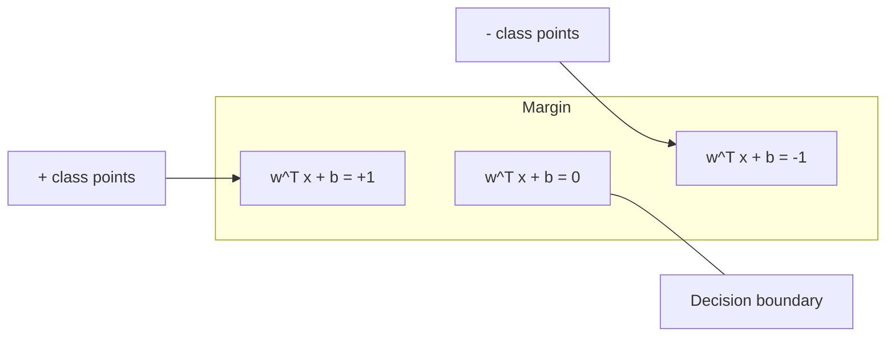
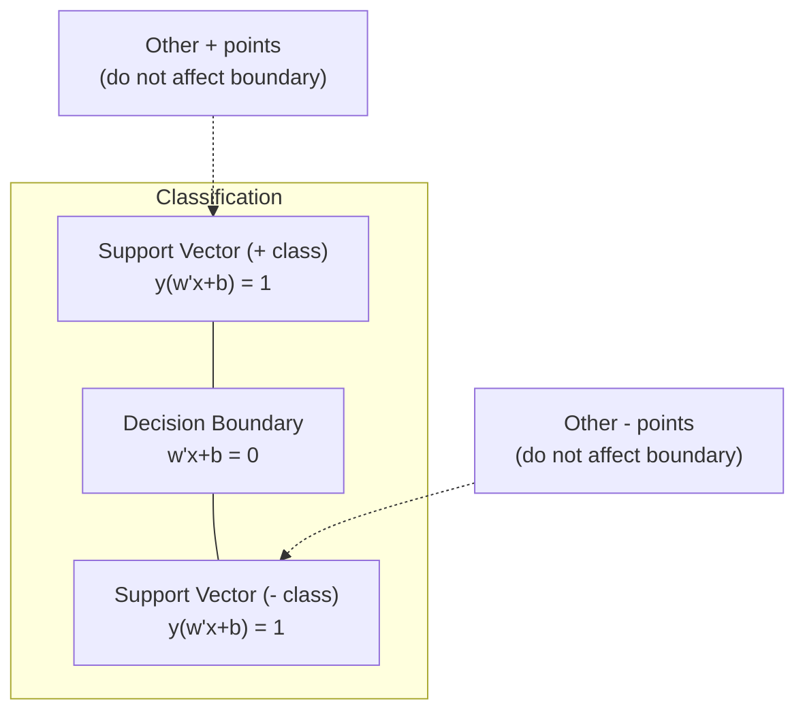
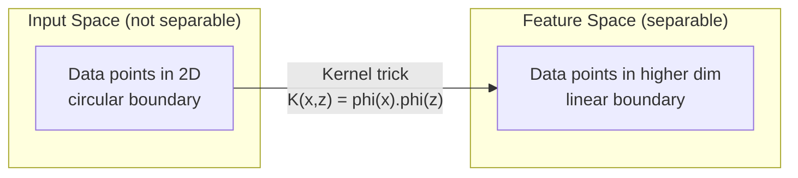

# Support Vector Machines / 支持向量机

> 在两个类别之间找到最宽的街道。这就是全部核心思想。

**Type / 类型：** Build / 构建
**Language / 语言：** Python
**Prerequisites / 前置知识：** Phase 1 (Lessons 08 Optimization, 14 Norms and Distances, 18 Convex Optimization)
**Time / 时间：** 约 90 分钟

## Learning Objectives / 学习目标

- 使用 hinge loss 和 primal formulation 上的 gradient descent，从零实现 linear SVM
- 解释 maximum margin principle，并从训练好的模型中识别 support vectors
- 比较 linear、polynomial 和 RBF kernels，并解释 kernel trick 如何避免显式高维映射
- 评估 C parameter 在 margin width 与 classification errors 之间控制的权衡

## The Problem / 问题

你有两类数据点，需要画一条线（或 hyperplane）把它们分开。能做到这一点的线有无穷多条。你应该选哪条？

选 margin 最大的那条。Margin 是 decision boundary 到两侧最近数据点之间的距离。更宽的 margin 意味着 classifier 更有信心，也更容易泛化到未见数据。

这个直觉引出了 Support Vector Machines，它是 ML 中数学上最优雅的算法之一。在 deep learning 之前，SVMs 曾是主流 classification 方法；在小数据集、高维数据，以及需要有原则、有理论保证且行为清楚的模型时，它们仍然是最佳选择之一。

SVMs 与 Phase 1 直接相连：优化问题是 convex 的（Lesson 18），margin 用 norms 衡量（Lesson 14），kernel trick 则利用 dot products 在不显式计算高维空间的情况下处理 nonlinear boundaries。

## The Concept / 概念

### The maximum margin classifier / 最大间隔分类器

给定 linearly separable data，其中 labels y_i in {-1, +1}，feature vectors 为 x_i，我们希望找到 hyperplane w^T x + b = 0 来分隔类别。

点 x_i 到 hyperplane 的距离为：

```
distance = |w^T x_i + b| / ||w||
```

对正确分类的点：y_i * (w^T x_i + b) > 0。Margin 是 hyperplane 到两侧最近点距离的两倍。



优化问题：

```
maximize    2 / ||w||     (the margin width)
subject to  y_i * (w^T x_i + b) >= 1  for all i
```

等价地（最小化 ||w||^2 更容易优化）：

```
minimize    (1/2) ||w||^2
subject to  y_i * (w^T x_i + b) >= 1  for all i
```

这是 convex quadratic program，有唯一的 global solution。正好落在 margin boundaries 上的数据点（满足 y_i * (w^T x_i + b) = 1）就是 support vectors。它们是唯一决定 decision boundary 的点。移动或删除任何非 support-vector 点，边界都不会改变。

### Support vectors: the critical few / Support vectors：关键少数



大多数训练点都无关紧要。只有 support vectors 重要。这也是为什么 SVMs 在 prediction time 内存效率高：你只需要存 support vectors，而不是整个训练集。

Support vectors 的数量也给出了 generalization error 的一个界。相对于数据集大小，support vectors 越少，泛化通常越好。

### Soft margin: handling noise with the C parameter / Soft margin：用 C parameter 处理噪声

真实数据很少完美可分。有些点可能在边界错误的一侧，或落在 margin 内部。Soft margin formulation 通过引入 slack variables 允许这些违规。

```
minimize    (1/2) ||w||^2 + C * sum(xi_i)
subject to  y_i * (w^T x_i + b) >= 1 - xi_i
            xi_i >= 0  for all i
```

Slack variable xi_i 衡量第 i 个点违反 margin 的程度。C 控制权衡：

| C value / C 值 | Behavior / 行为 |
|---------|----------|
| Large C | 严厉惩罚违规。Margin 窄，misclassifications 更少。容易 overfit |
| Small C | 允许更多违规。Margin 宽，misclassifications 更多。容易 underfit |

C 是 regularization strength 的倒数。Large C = less regularization。Small C = more regularization。

### Hinge loss: the SVM loss function / Hinge loss：SVM 的损失函数

Soft margin SVM 可以改写成无约束优化：

```
minimize    (1/2) ||w||^2 + C * sum(max(0, 1 - y_i * (w^T x_i + b)))
```

max(0, 1 - y_i * f(x_i)) 这一项就是 hinge loss。当点被正确分类且位于 margin 外时，它为 0。当点在 margin 内或被误分类时，它是线性惩罚。

```
Hinge loss for a single point:

loss
  |
  | \
  |  \
  |   \
  |    \
  |     \_______________
  |
  +-----|-----|-------->  y * f(x)
       0     1

Zero loss when y*f(x) >= 1 (correctly classified, outside margin).
Linear penalty when y*f(x) < 1.
```

与 logistic loss（logistic regression）比较：

```
Hinge:     max(0, 1 - y*f(x))          Hard cutoff at margin
Logistic:  log(1 + exp(-y*f(x)))        Smooth, never exactly zero
```

Hinge loss 会产生 sparse solutions（只有 support vectors 有非零贡献）。Logistic loss 会使用所有数据点。这让 SVMs 在 prediction time 更省内存。

### Training a linear SVM with gradient descent / 用 gradient descent 训练 linear SVM

你可以直接在 hinge loss 加 L2 regularization 上做 gradient descent 来训练 linear SVM，不需要解 constrained QP：

```
L(w, b) = (lambda/2) * ||w||^2 + (1/n) * sum(max(0, 1 - y_i * (w^T x_i + b)))

Gradient with respect to w:
  If y_i * (w^T x_i + b) >= 1:  dL/dw = lambda * w
  If y_i * (w^T x_i + b) < 1:   dL/dw = lambda * w - y_i * x_i

Gradient with respect to b:
  If y_i * (w^T x_i + b) >= 1:  dL/db = 0
  If y_i * (w^T x_i + b) < 1:   dL/db = -y_i
```

这叫 primal formulation。每个 epoch 的复杂度是 O(n * d)，n 是样本数，d 是 feature 数。对大规模、稀疏、高维数据（text classification）来说很快。

### The dual formulation and the kernel trick / Dual formulation 与 kernel trick

SVM 问题的 Lagrangian dual（来自 Phase 1 Lesson 18 的 KKT conditions）为：

```
maximize    sum(alpha_i) - (1/2) * sum_ij(alpha_i * alpha_j * y_i * y_j * (x_i . x_j))
subject to  0 <= alpha_i <= C
            sum(alpha_i * y_i) = 0
```

Dual 只涉及数据点之间的 dot products x_i . x_j。这是关键洞察。把每个 dot product 替换成 kernel function K(x_i, x_j)，SVM 就能在不显式计算变换的情况下学习 nonlinear boundaries。

```
Linear kernel:      K(x, z) = x . z
Polynomial kernel:  K(x, z) = (x . z + c)^d
RBF (Gaussian):     K(x, z) = exp(-gamma * ||x - z||^2)
```

RBF kernel 会把数据映射到无限维空间。输入空间中相近的点 kernel value 接近 1，距离远的点接近 0。它可以学习任意平滑的 decision boundary。



Kernel trick 直接计算高维空间里的 dot product，却不真正进入那个空间。对于 D 维中的 d 阶 polynomial kernel，显式 feature space 有 O(D^d) 维。但 K(x, z) 的计算只需要 O(D) 时间。

### SVM for regression (SVR) / 用于回归的 SVM（SVR）

Support Vector Regression 会围绕数据拟合一个宽度为 epsilon 的 tube。Tube 内的点 loss 为 0。Tube 外的点被线性惩罚。

```
minimize    (1/2) ||w||^2 + C * sum(xi_i + xi_i*)
subject to  y_i - (w^T x_i + b) <= epsilon + xi_i
            (w^T x_i + b) - y_i <= epsilon + xi_i*
            xi_i, xi_i* >= 0
```

Epsilon parameter 控制 tube width。Tube 越宽，support vectors 越少，拟合越平滑。Tube 越窄，support vectors 越多，拟合越紧。

### Why SVMs lost to deep learning (and when they still win) / SVM 为什么输给 deep learning（以及何时仍然胜出）

从 1990 年代末到 2010 年代初，SVMs 曾主导 ML。Deep learning 后来超越它们，原因包括：

| Factor / 因素 | SVMs | Deep learning |
|--------|------|---------------|
| Feature engineering | 需要 | 自动学习 features |
| Scalability | Kernel 版本 O(n^2) 到 O(n^3) | SGD 每个 epoch O(n) |
| Image/text/audio | 需要 handcrafted features | 从 raw data 学习 |
| Large datasets (>100k) | 慢 | 扩展性好 |
| GPU acceleration | 收益有限 | 巨大加速 |

SVMs 在这些情况下仍然很强：
- 小数据集（几百到几千低位样本）
- 高维稀疏数据（带 TF-IDF features 的文本）
- 需要数学保证时（margin bounds）
- 训练时间必须很短时（linear SVM 非常快）
- 具有清晰 margin structure 的 binary classification
- Anomaly detection（one-class SVM）

```figure
svm-margin
```

## Build It / 动手构建

### Step 1: Hinge loss and gradient / 第 1 步：Hinge loss 与 gradient

基础部分。计算一个 batch 的 hinge loss 及其 gradient。

```python
def hinge_loss(X, y, w, b):
    n = len(X)
    total_loss = 0.0
    for i in range(n):
        margin = y[i] * (dot(w, X[i]) + b)
        total_loss += max(0.0, 1.0 - margin)
    return total_loss / n
```

### Step 2: Linear SVM via gradient descent / 第 2 步：通过 gradient descent 训练 Linear SVM

通过最小化 regularized hinge loss 训练。不需要 QP solver。

```python
class LinearSVM:
    def __init__(self, lr=0.001, lambda_param=0.01, n_epochs=1000):
        self.lr = lr
        self.lambda_param = lambda_param
        self.n_epochs = n_epochs
        self.w = None
        self.b = 0.0

    def fit(self, X, y):
        n_features = len(X[0])
        self.w = [0.0] * n_features
        self.b = 0.0

        for epoch in range(self.n_epochs):
            for i in range(len(X)):
                margin = y[i] * (dot(self.w, X[i]) + self.b)
                if margin >= 1:
                    self.w = [wj - self.lr * self.lambda_param * wj
                              for wj in self.w]
                else:
                    self.w = [wj - self.lr * (self.lambda_param * wj - y[i] * X[i][j])
                              for j, wj in enumerate(self.w)]
                    self.b -= self.lr * (-y[i])

    def predict(self, X):
        return [1 if dot(self.w, x) + self.b >= 0 else -1 for x in X]
```

### Step 3: Kernel functions / 第 3 步：Kernel functions

实现 linear、polynomial 和 RBF kernels。

```python
def linear_kernel(x, z):
    return dot(x, z)

def polynomial_kernel(x, z, degree=3, c=1.0):
    return (dot(x, z) + c) ** degree

def rbf_kernel(x, z, gamma=0.5):
    diff = [xi - zi for xi, zi in zip(x, z)]
    return math.exp(-gamma * dot(diff, diff))
```

### Step 4: Margin and support vector identification / 第 4 步：Margin 与 support vectors 识别

训练后，识别哪些点是 support vectors，并计算 margin width。

```python
def find_support_vectors(X, y, w, b, tol=1e-3):
    support_vectors = []
    for i in range(len(X)):
        margin = y[i] * (dot(w, X[i]) + b)
        if abs(margin - 1.0) < tol:
            support_vectors.append(i)
    return support_vectors
```

完整实现和所有 demos 见 `code/svm.py`。

## Use It / 应用它

使用 scikit-learn：

```python
from sklearn.svm import SVC, LinearSVC, SVR
from sklearn.preprocessing import StandardScaler
from sklearn.pipeline import Pipeline

clf = Pipeline([
    ("scaler", StandardScaler()),
    ("svm", SVC(kernel="rbf", C=1.0, gamma="scale")),
])
clf.fit(X_train, y_train)
print(f"Accuracy: {clf.score(X_test, y_test):.4f}")
print(f"Support vectors: {clf['svm'].n_support_}")
```

重要：训练 SVM 前一定要 scale features。SVMs 对 feature magnitudes 很敏感，因为 margin 依赖 ||w||，未缩放 features 会扭曲几何结构。

对大数据集，使用 `LinearSVC`（primal formulation，每个 epoch O(n)）而不是 `SVC`（dual formulation，O(n^2) 到 O(n^3)）：

```python
from sklearn.svm import LinearSVC

clf = Pipeline([
    ("scaler", StandardScaler()),
    ("svm", LinearSVC(C=1.0, max_iter=10000)),
])
```

## Ship It / 交付它

本课会产出 `code/svm.py`：从零实现 linear SVM、kernel functions、margin 计算和 support vector 识别的完整示例，可作为理解 SVM 几何直觉和训练机制的参考实现。

## Exercises / 练习

1. 生成一个二维 linearly separable dataset。训练你的 LinearSVM 并识别 support vectors。验证 support vectors 是距离 decision boundary 最近的点。

2. 在 noisy dataset 上把 C 从 0.001 变化到 1000。绘制每个 C value 的 decision boundary。观察从 wide margin（underfitting）到 narrow margin（overfitting）的过渡。

3. 创建一个 class boundaries 为圆形的数据集（非线性）。展示 linear SVM 会失败。计算 RBF kernel matrix，并展示类别在 kernel-induced feature space 中变得可分。

4. 在同一数据集上比较 hinge loss 和 logistic loss。训练 linear SVM 和 logistic regression。统计有多少训练点影响每个模型的 decision boundary（support vectors vs all points）。

5. 实现 SVR（epsilon-insensitive loss）。拟合 y = sin(x) + noise。绘制 predictions 周围的 epsilon tube，并高亮 support vectors（tube 外的点）。

## Key Terms / 关键术语

| 术语 | 实际含义 |
|------|----------------------|
| Support vectors | 离 decision boundary 最近的训练点。它们是唯一决定 hyperplane 的点 |
| Margin | Decision boundary 与最近 support vectors 之间的距离。SVMs 最大化它 |
| Hinge loss | max(0, 1 - y*f(x))。正确分类且在 margin 外时为 0，否则线性惩罚 |
| C parameter | Margin width 与 classification errors 的权衡。Large C = narrow margin，small C = wide margin |
| Soft margin | 允许通过 slack variables 违反 margin 的 SVM formulation，用于处理不可分数据 |
| Kernel trick | 在不显式映射到高维 feature space 的情况下计算其中的 dot products |
| Linear kernel | K(x, z) = x . z。等价于标准 dot product，适用于线性可分数据 |
| RBF kernel | K(x, z) = exp(-gamma * \|\|x-z\|\|^2)。映射到无限维，能学习任意平滑边界 |
| Polynomial kernel | K(x, z) = (x . z + c)^d。映射到 polynomial combinations 的 feature space |
| Dual formulation | 只依赖数据点之间 dot products 的 SVM 问题重写形式，从而支持 kernels |
| SVR | Support Vector Regression。围绕数据拟合 epsilon-tube，tube 内点 loss 为 0 |
| Slack variables | xi_i：衡量点违反 margin 的程度。正确分类且在 margin 外的点为 0 |
| Maximum margin | 选择使到每类最近点距离最大的 hyperplane 的原则 |

## Further Reading / 延伸阅读

- [Vapnik: The Nature of Statistical Learning Theory (1995)](https://link.springer.com/book/10.1007/978-1-4757-3264-1) - 关于 SVMs 和 statistical learning 的奠基文本
- [Cortes & Vapnik: Support-vector networks (1995)](https://link.springer.com/article/10.1007/BF00994018) - SVM 原始论文
- [Platt: Sequential Minimal Optimization (1998)](https://www.microsoft.com/en-us/research/publication/sequential-minimal-optimization-a-fast-algorithm-for-training-support-vector-machines/) - 让 SVM training 变得实用的 SMO 算法
- [scikit-learn SVM documentation](https://scikit-learn.org/stable/modules/svm.html) - 带实现细节的实践指南
- [LIBSVM: A Library for Support Vector Machines](https://www.csie.ntu.edu.tw/~cjlin/libsvm/) - 大多数 SVM 实现背后的 C++ library
