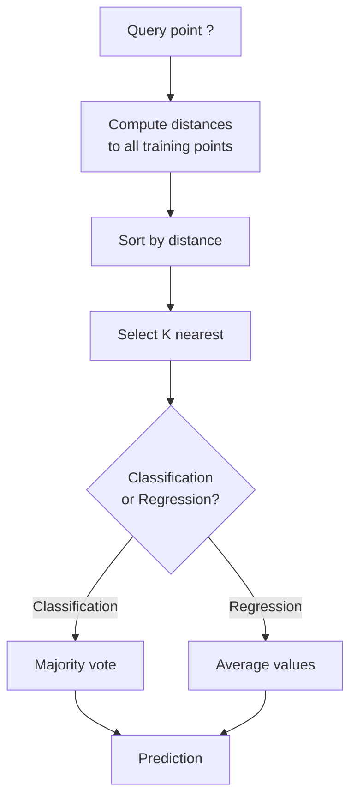
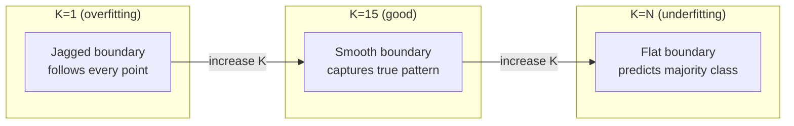
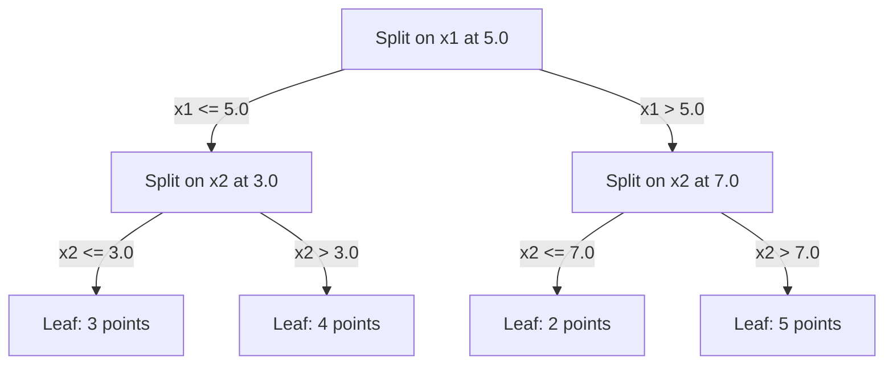

# K-Nearest Neighbors and Distances / K 近邻与距离

> 存下所有东西。预测时看邻居。最简单、但真正能工作的算法。

**Type / 类型：** Build / 构建
**Language / 语言：** Python
**Prerequisites / 前置知识：** Phase 1 (Lesson 14 Norms and Distances)
**Time / 时间：** 约 90 分钟

## Learning Objectives / 学习目标

- 从零实现 KNN classification 和 regression，支持可配置 K 与 distance-weighted voting
- 比较 L1、L2、cosine 和 Minkowski distance metrics，并为给定数据类型选择合适距离
- 解释 curse of dimensionality，并演示为什么 KNN 在高维空间中会退化
- 构建 KD-tree 做高效 nearest neighbor search，并分析它什么时候比 brute-force 更快

## The Problem / 问题

你有一个数据集。一个新数据点来了。你需要给它分类或预测数值。你不学习参数（不像 linear regression 或 SVMs），而是找到距离这个新点最近的 K 个训练点，让它们投票。

这就是 K-nearest neighbors。没有训练阶段。没有要学习的 parameters。没有要最小化的 loss function。你存下整个训练集，在 prediction time 计算距离。

它听起来简单到不像能工作。但 KNN 在很多问题上意外地有竞争力，尤其是小到中等规模数据集。深入理解它会揭示一些基础概念：distance metric 的选择（连接到 Phase 1 Lesson 14）、curse of dimensionality，以及 lazy learning 和 eager learning 的差别。

KNN 也出现在现代 AI 的许多地方，只是换了名字。Vector databases 在 embeddings 上做 KNN search。Retrieval-augmented generation (RAG) 找 K 个最近的 document chunks。Recommendation systems 找相似用户或物品。算法相同，只是规模和数据结构不同。

## The Concept / 概念

### How KNN works / KNN 如何工作

给定一个有标签数据集和一个新的 query point：

1. 计算 query 到数据集中每个点的距离
2. 按距离排序
3. 取最近的 K 个点
4. Classification：K 个邻居 majority vote
5. Regression：K 个邻居的值取平均（或 weighted average）



这就是完整算法。没有 fitting，没有 gradient descent，没有 epochs。

### Choosing K / 选择 K

K 是唯一的 hyperparameter。它控制 bias-variance trade-off：

| K | Behavior / 行为 |
|---|----------|
| K = 1 | Decision boundary 追随每个点。Training error 为 0。High variance。Overfits |
| Small K (3-5) | 对局部结构敏感。能捕捉复杂边界 |
| Large K | 边界更平滑。对噪声更稳健。可能 underfit |
| K = N | 对每个点都预测 majority class。Maximum bias |

常见起点是 K = sqrt(N)，其中 N 是数据集大小。二分类中使用奇数 K，可以避免平票。



### Distance metrics / 距离度量

Distance function 定义了“近”是什么意思。不同 metrics 会产生不同 neighbors、不同 predictions。

**L2 (Euclidean)** 是默认选择。直线距离。

```
d(a, b) = sqrt(sum((a_i - b_i)^2))
```

它对 feature scale 敏感。使用 L2 和 KNN 前一定要 standardize features。

**L1 (Manhattan)** 对绝对差求和。它比 L2 更能抵抗 outliers，因为不会平方放大差异。

```
d(a, b) = sum(|a_i - b_i|)
```

**Cosine distance** 衡量向量夹角，忽略 magnitude。对 text 和 embedding data 很关键。

```
d(a, b) = 1 - (a . b) / (||a|| * ||b||)
```

**Minkowski** 用参数 p 泛化 L1 和 L2。

```
d(a, b) = (sum(|a_i - b_i|^p))^(1/p)

p=1: Manhattan
p=2: Euclidean
p->inf: Chebyshev (max absolute difference)
```

该用哪个 metric 取决于数据：

| Data type / 数据类型 | Best metric / 推荐度量 | Why / 原因 |
|-----------|------------|-----|
| Numeric features, similar scale | L2 (Euclidean) | 默认选择，适合空间数据 |
| Numeric features, outliers | L1 (Manhattan) | 更稳健，不会放大大差异 |
| Text embeddings | Cosine | Magnitude 多半是噪声，direction 表示语义 |
| High-dimensional sparse | Cosine or L1 | L2 受 curse of dimensionality 影响严重 |
| Mixed types | Custom distance | 按 feature type 组合不同 metrics |

### Weighted KNN / 加权 KNN

标准 KNN 对所有 K 个 neighbors 赋予相同权重。但距离 0.1 的 neighbor 应该比距离 5.0 的 neighbor 更重要。

**Distance-weighted KNN** 按距离倒数给每个 neighbor 加权：

```
weight_i = 1 / (distance_i + epsilon)

For classification: weighted vote
For regression:     weighted average = sum(w_i * y_i) / sum(w_i)
```

epsilon 防止 query point 与训练点完全重合时除以 0。

Weighted KNN 对 K 的选择没那么敏感，因为远处 neighbors 的贡献本来就很小。

### The curse of dimensionality / 维度灾难

KNN 在高维中会退化。这不是模糊担忧，而是数学事实。

**问题 1：距离会收敛。** 维度升高时，最大距离与最小距离的比值趋近 1。所有点都变得离 query 差不多“远”。

```
In d dimensions, for random uniform points:

d=2:    max_dist / min_dist = varies widely
d=100:  max_dist / min_dist ~ 1.01
d=1000: max_dist / min_dist ~ 1.001

When all distances are nearly equal, "nearest" is meaningless.
```

**问题 2：体积爆炸。** 如果想在固定比例的数据中捕获 K 个 neighbors，你需要把搜索半径扩展到 feature space 的更大部分。高维中的“邻域”会包含空间的大部分区域。

**问题 3：角落占主导。** 在 d 维 unit hypercube 中，大部分体积集中在角落而不是中心。随着 d 增大，内切球包含的体积分数趋近于 0。

实践结果：KNN 在约 20-50 个 features 以内表现较好。超过这个范围，你需要先做 dimensionality reduction（PCA、UMAP、t-SNE）再用 KNN，或者使用能利用数据 intrinsic lower dimensionality 的 tree-based search structures。

### KD-trees: fast nearest neighbor search / KD-trees：快速最近邻搜索

Brute-force KNN 会计算 query 到每个训练点的距离。每次 query 是 O(n * d)。数据集大时太慢。

KD-tree 沿 feature axes 递归切分空间。每一层按某个维度的 median value 切分。



寻找 nearest neighbor 时，先沿树走到包含 query 的 leaf，然后回溯，只在相邻分区可能包含更近点时才检查它们。

低维平均 query time：O(log n)。但在高维（d > 20）中，KD-trees 会退化到 O(n)，因为回溯能剪掉的分支越来越少。

### Ball trees: better for moderate dimensions / Ball trees：更适合中等维度

Ball trees 用嵌套 hyperspheres 而不是 axis-aligned boxes 来切分数据。每个 node 定义一个 ball（center + radius），包含该 subtree 的所有点。

相对 KD-trees 的优势：
- 在中等维度（最高约 50）效果更好
- 能处理非 axis-aligned 结构
- 更紧的 bounding volumes 会让搜索时剪掉更多分支

KD-trees 和 ball trees 都是 exact algorithms。真正大规模搜索（百万级点、百维级向量）会使用 approximate nearest neighbor 方法（HNSW、IVF、product quantization）。这些在 Phase 1 Lesson 14 中讲过。

### Lazy learning vs eager learning / Lazy learning 与 eager learning

KNN 是 lazy learner：训练时几乎不做事，所有工作发生在 prediction time。大多数其他算法（linear regression、SVMs、neural networks）是 eager learners：训练时进行大量计算，构建紧凑模型，然后预测很快。

| Aspect / 方面 | Lazy (KNN) | Eager (SVM, neural net) |
|--------|------------|------------------------|
| Training time | O(1)，只存数据 | O(n * epochs) |
| Prediction time | 每次 query O(n * d) | O(d) 或 O(parameters) |
| Memory at prediction | 存整个训练集 | 只存 model parameters |
| Adapts to new data | 直接添加点 | 重新训练模型 |
| Decision boundary | 隐式，预测时计算 | 显式，训练后固定 |

Lazy learning 适合：
- 数据集经常变化（无需 retraining 即可 add/remove points）
- 只需要很少量 predictions
- 希望训练时间为 0
- 数据集足够小，brute-force search 很快

### KNN for regression / 用 KNN 做回归

Regression 不做 majority voting，而是对 K 个 neighbors 的 target values 求平均。

```
prediction = (1/K) * sum(y_i for i in K nearest neighbors)

Or with distance weighting:
prediction = sum(w_i * y_i) / sum(w_i)
where w_i = 1 / distance_i
```

KNN regression 产生的是 piecewise-constant predictions（加权时是 piecewise-smooth）。它无法 extrapolate 到训练数据范围之外。如果训练 targets 全在 0 到 100 之间，KNN 永远不会预测 200。

```figure
knn-smoothness
```

## Build It / 动手构建

### Step 1: Distance functions / 第 1 步：距离函数

实现 L1、L2、cosine 和 Minkowski distances。它们直接连接到 Phase 1 Lesson 14。

```python
import math

def l2_distance(a, b):
    return math.sqrt(sum((ai - bi) ** 2 for ai, bi in zip(a, b)))

def l1_distance(a, b):
    return sum(abs(ai - bi) for ai, bi in zip(a, b))

def cosine_distance(a, b):
    dot_val = sum(ai * bi for ai, bi in zip(a, b))
    norm_a = math.sqrt(sum(ai ** 2 for ai in a))
    norm_b = math.sqrt(sum(bi ** 2 for bi in b))
    if norm_a == 0 or norm_b == 0:
        return 1.0
    return 1.0 - dot_val / (norm_a * norm_b)

def minkowski_distance(a, b, p=2):
    if p == float('inf'):
        return max(abs(ai - bi) for ai, bi in zip(a, b))
    return sum(abs(ai - bi) ** p for ai, bi in zip(a, b)) ** (1 / p)
```

### Step 2: KNN classifier and regressor / 第 2 步：KNN classifier 与 regressor

构建完整 KNN，支持可配置 K、distance metric 和可选 distance weighting。

```python
class KNN:
    def __init__(self, k=5, distance_fn=l2_distance, weighted=False,
                 task="classification"):
        self.k = k
        self.distance_fn = distance_fn
        self.weighted = weighted
        self.task = task
        self.X_train = None
        self.y_train = None

    def fit(self, X, y):
        self.X_train = X
        self.y_train = y

    def predict(self, X):
        return [self._predict_one(x) for x in X]
```

### Step 3: KD-tree for efficient search / 第 3 步：用于高效搜索的 KD-tree

从零构建 KD-tree，按每个维度的 median 递归切分。

```python
class KDTree:
    def __init__(self, X, indices=None, depth=0):
        # Recursively partition the data
        self.axis = depth % len(X[0])
        # Split on median of the current axis
        ...

    def query(self, point, k=1):
        # Traverse to leaf, then backtrack
        ...
```

完整实现、helper methods 和 demos 见 `code/knn.py`。

### Step 4: Feature scaling / 第 4 步：Feature scaling

KNN 必须做 feature scaling，因为距离对 feature magnitudes 很敏感。范围 0 到 1000 的 feature 会主导范围 0 到 1 的 feature。

```python
def standardize(X):
    n = len(X)
    d = len(X[0])
    means = [sum(X[i][j] for i in range(n)) / n for j in range(d)]
    stds = [
        max(1e-10, (sum((X[i][j] - means[j]) ** 2 for i in range(n)) / n) ** 0.5)
        for j in range(d)
    ]
    return [[((X[i][j] - means[j]) / stds[j]) for j in range(d)] for i in range(n)], means, stds
```

## Use It / 应用它

使用 scikit-learn：

```python
from sklearn.neighbors import KNeighborsClassifier
from sklearn.preprocessing import StandardScaler
from sklearn.pipeline import Pipeline

clf = Pipeline([
    ("scaler", StandardScaler()),
    ("knn", KNeighborsClassifier(n_neighbors=5, metric="euclidean")),
])
clf.fit(X_train, y_train)
print(f"Accuracy: {clf.score(X_test, y_test):.4f}")
```

当数据集足够大且维度足够低时，scikit-learn 会自动使用 KD-trees 或 ball trees。高维数据会退回 brute force。你可以用 `algorithm` parameter 控制它。

大规模 nearest neighbor search（百万级 vectors）可以用 FAISS、Annoy 或 vector database：

```python
import faiss

index = faiss.IndexFlatL2(dimension)
index.add(embeddings)
distances, indices = index.search(query_vectors, k=5)
```

## Ship It / 交付它

本课会产出 `code/knn.py`：包含 distance functions、KNN classifier/regressor、KD-tree 和 feature scaling demo 的完整实现，可用于对比 brute-force search 与树结构搜索在不同维度下的表现。

## Exercises / 练习

1. 在一个 3 类二维数据集上实现 KNN classification。分别绘制 K=1、K=5、K=15 和 K=N 的 decision boundary。观察从 overfitting 到 underfitting 的过渡。

2. 在 2、5、10、50、100 和 500 维中生成 1000 个随机点。对每个维度计算最大 pairwise distance 与最小 pairwise distance 的比值。绘制 ratio vs dimensionality，可视化 curse of dimensionality。

3. 在文本分类问题（使用 TF-IDF vectors）上比较 L1、L2 和 cosine distance 的 KNN。哪个 metric accuracy 最好？为什么 cosine 往往更适合文本？

4. 实现 KD-tree，并在 2D、10D、50D 中，对 1k、10k、100k 点数据集比较 query time 与 brute force。KD-tree 从哪个维度开始不再比 brute force 更快？

5. 为 y = sin(x) + noise 构建 weighted KNN regressor。把它与 unweighted KNN 在 K=3、10、30 下比较。展示 weighting 会产生更平滑的 predictions，尤其是大 K 时。

## Key Terms / 关键术语

| 术语 | 实际含义 |
|------|----------------------|
| K-nearest neighbors | Non-parametric algorithm，通过寻找距离 query 最近的 K 个训练点来预测 |
| Lazy learning | 训练时不计算，所有工作发生在 prediction time。KNN 是典型例子 |
| Eager learning | 训练时进行大量计算，构建紧凑模型。大多数 ML 算法都是 eager |
| Curse of dimensionality | 高维中距离收敛、邻域扩张到覆盖大部分空间，让 KNN 失效 |
| KD-tree | 沿 feature axes 递归切分空间的 binary tree。低维中 O(log n) query |
| Ball tree | 嵌套 hyperspheres 组成的树。在中等维度（最高约 50）比 KD-trees 更好 |
| Weighted KNN | 按距离倒数给 neighbors 加权，越近的 neighbor 对 prediction 影响越大 |
| Feature scaling | 把 features 归一化到可比范围。KNN 这类 distance-based methods 必须做 |
| Majority vote | 通过统计 K 个 neighbors 中最常见类别进行 classification |
| Brute force search | 计算到每个训练点的距离。每次 query O(n*d)，精确但大 n 时慢 |
| Approximate nearest neighbor | HNSW、LSH、IVF 等算法，用近似最近点换取更快搜索 |
| Voronoi diagram | 空间划分，每个区域包含离某个训练点比离其他点都近的所有点。K=1 KNN 产生 Voronoi boundaries |

## Further Reading / 延伸阅读

- [Cover & Hart: Nearest Neighbor Pattern Classification (1967)](https://ieeexplore.ieee.org/document/1053964) - KNN 奠基论文，证明它的 error rate 最多是 Bayes optimal 的两倍
- [Friedman, Bentley, Finkel: An Algorithm for Finding Best Matches in Logarithmic Expected Time (1977)](https://dl.acm.org/doi/10.1145/355744.355745) - KD-tree 原始论文
- [Beyer et al.: When Is "Nearest Neighbor" Meaningful? (1999)](https://link.springer.com/chapter/10.1007/3-540-49257-7_15) - 对 nearest neighbor 维度灾难的形式化分析
- [scikit-learn Nearest Neighbors documentation](https://scikit-learn.org/stable/modules/neighbors.html) - 带 algorithm selection 的实践指南
- [FAISS: A Library for Efficient Similarity Search](https://github.com/facebookresearch/faiss) - Meta 的 billion-scale approximate nearest neighbor search library
