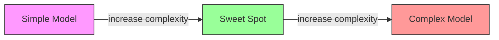
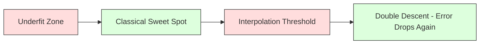
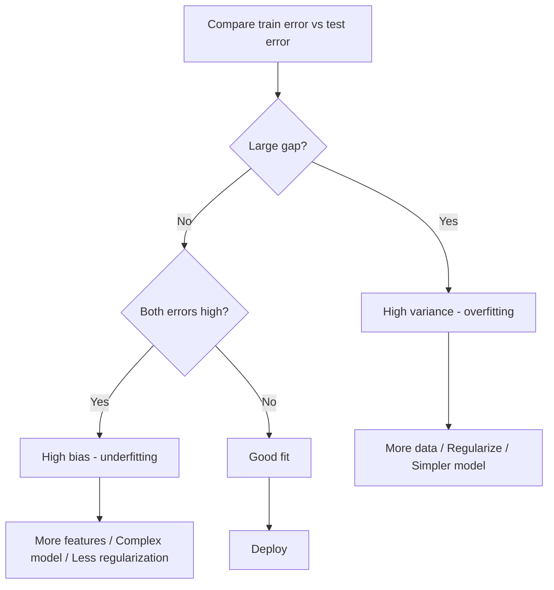
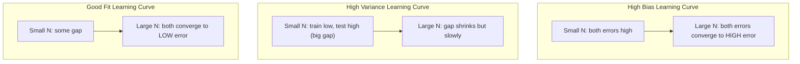
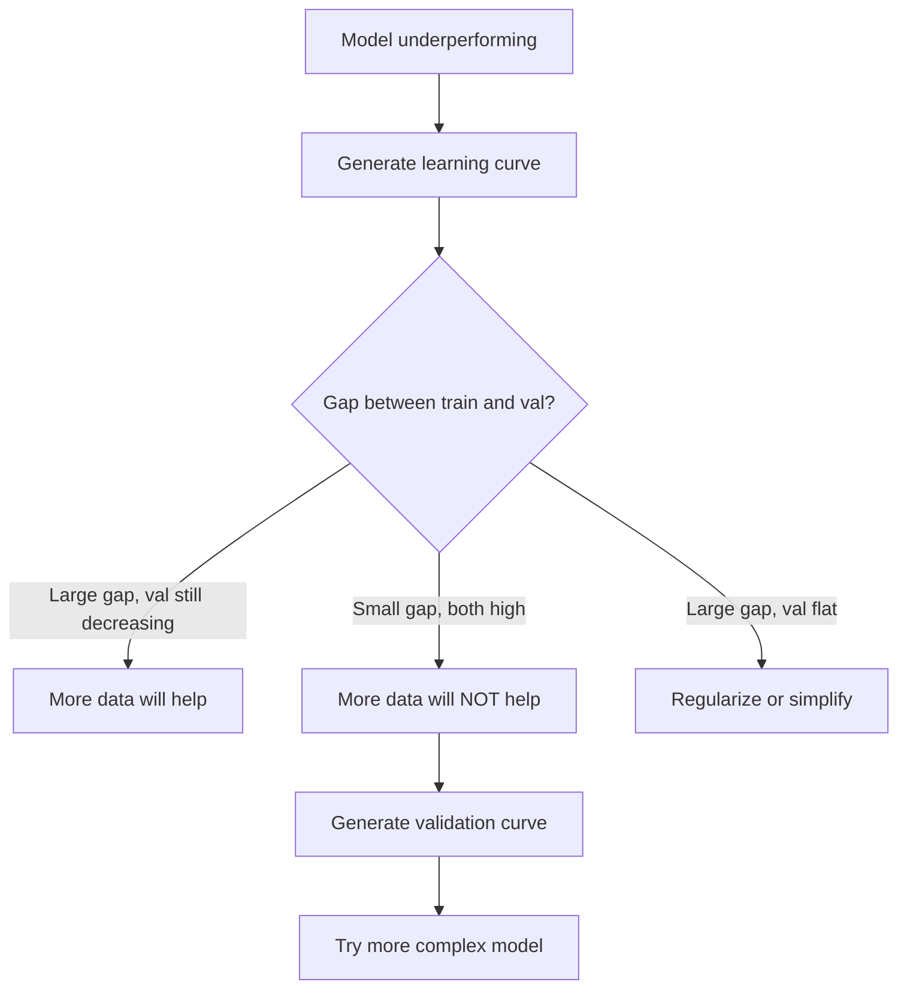

# Bias-Variance Tradeoff / 偏差-方差权衡

> 每个模型误差都来自三种来源之一：bias、variance 或 noise。你只能控制前两者。

**Type / 类型：** Learn / 学习
**Language / 语言：** Python
**Prerequisites / 前置知识：** Phase 2, Lessons 01-09 (ML basics, regression, classification, evaluation)
**Time / 时间：** 约 75 分钟

## Learning Objectives / 学习目标

- 推导 expected prediction error 的 bias-variance decomposition，并解释 irreducible noise 的作用
- 使用 training 和 test error patterns 诊断模型是 high bias 还是 high variance
- 解释 regularization techniques（L1、L2、dropout、early stopping）如何用 bias 换取更低 variance
- 实现实验，可视化模型复杂度增加时的 bias-variance tradeoff

## The Problem / 问题

你训练了一个模型。它在 test data 上有误差。这个误差从哪里来？

如果模型太简单（在弯曲数据上用 linear regression），它会持续错过真实模式。这是 bias。如果模型太复杂（用 15 个数据点拟合 20 阶多项式），它会完美拟合训练数据，但在新数据上给出 wildly different predictions。这是 variance。

对固定模型容量来说，你无法同时最小化二者。压低 bias，variance 会升高。压低 variance，bias 会升高。理解这个权衡，是机器学习中最有用的诊断技能之一。它告诉你该让模型更复杂还是更简单，该获取更多数据还是做更好的 features，该加强还是减弱 regularization。

## The Concept / 概念

### Bias: Systematic Error / Bias：系统性误差

Bias 衡量模型平均预测离真实值有多远。假设你用来自同一分布的许多不同训练集训练同一个模型，并对预测取平均，bias 就是这个平均预测与真实值之间的差距。

High bias 意味着模型太僵硬，无法捕捉真实模式。用直线拟合抛物线，无论给多少数据，都总会错过曲线。这就是 underfitting。

```
High bias (underfitting):
  Model always predicts roughly the same wrong thing.
  Training error: HIGH
  Test error: HIGH
  Gap between them: SMALL
```

### Variance: Sensitivity to Training Data / Variance：对训练数据的敏感性

Variance 衡量当你在不同数据子集上训练时，预测会变化多少。如果训练集很小的变化就导致模型大幅变化，variance 很高。

High variance 意味着模型在拟合训练数据中的 noise，而不是 underlying signal。20 阶多项式会穿过每个训练点，但在点之间剧烈震荡。这就是 overfitting。

```
High variance (overfitting):
  Model fits training data perfectly but fails on new data.
  Training error: LOW
  Test error: HIGH
  Gap between them: LARGE
```

### The Decomposition / 分解

对任意点 x，在 squared loss 下 expected prediction error 可以精确分解为：

```
Expected Error = Bias^2 + Variance + Irreducible Noise

where:
  Bias^2   = (E[f_hat(x)] - f(x))^2
  Variance = E[(f_hat(x) - E[f_hat(x)])^2]
  Noise    = E[(y - f(x))^2]             (sigma^2)
```

- `f(x)` 是真实函数
- `f_hat(x)` 是你的模型预测
- `E[...]` 是对不同训练集的 expectation
- `y` 是观测标签（真实函数加 noise）

Noise term 是 irreducible 的。任何模型都无法在 noisy data 上做到比 sigma^2 更好。你的任务是找到 bias^2 与 variance 的正确平衡。

### Model Complexity vs Error / 模型复杂度与误差



经典 U 型曲线：

| Complexity / 复杂度 | Bias | Variance | Total Error / 总误差 |
|-----------|------|----------|-------------|
| Too low | HIGH | LOW | HIGH (underfitting) |
| Just right | MODERATE | MODERATE | LOWEST |
| Too high | LOW | HIGH | HIGH (overfitting) |

### Regularization as Bias-Variance Control / 用 regularization 控制 bias-variance

Regularization 会有意增加 bias 来降低 variance。它约束模型，让模型不能追逐 noise。

- **L2 (Ridge)：** 把所有 weights 向 0 收缩。保留所有 features，但降低其影响。
- **L1 (Lasso)：** 把部分 weights 正好推到 0。执行 feature selection。
- **Dropout：** 训练时随机关闭 neurons。迫使模型学习冗余表示。
- **Early stopping：** 在模型完全拟合训练数据前停止训练。

Regularization strength（lambda、dropout rate、epochs 数）直接控制你在 bias-variance 曲线上的位置。More regularization 意味着 more bias、less variance。

### Double Descent: The Modern Perspective / Double descent：现代视角

经典理论说：过了 sweet spot 后，更多复杂度总是有害。但 2019 年以来的研究发现了意外现象。如果继续把模型容量增加到远超 interpolation threshold（模型参数足以完美拟合训练数据的位置），test error 可能再次下降。



这种 “double descent” 现象解释了为什么 massively overparameterized neural networks（参数远多于训练样本）仍然能泛化。经典 bias-variance tradeoff 不是错的，但对现代 regime 来说不完整。

关于 double descent 的关键观察：
- 它会出现在 linear models、decision trees 和 neural networks 中
- 在 interpolation region，更多数据有时反而会伤害表现（sample-wise double descent）
- 更多 training epochs 也可能触发它（epoch-wise double descent）
- Regularization 会平滑峰值，但不会完全消除它

为什么会这样？在 interpolation threshold，模型刚好有足够容量拟合所有训练点。它被迫找到一个穿过每个点的非常具体的解，数据中的小扰动会导致拟合大幅变化，所以 variance 在这里达到峰值。超过 threshold 后，模型有很多个能完美拟合数据的解。学习算法（例如带 implicit regularization 的 gradient descent）倾向于选择其中最简单的解。这种偏向简单解的 implicit bias，是 overparameterized models 仍能泛化的原因。

| Regime / 区域 | Parameters vs Samples | Behavior / 行为 |
|--------|----------------------|----------|
| Underparameterized | p << n | 经典 tradeoff 适用 |
| Interpolation threshold | p ~ n | Variance 达峰，test error 暴涨 |
| Overparameterized | p >> n | Implicit regularization 生效，test error 下降 |

实践上：如果你在用 neural networks 或大型 tree ensembles，不要停在 interpolation threshold。要么用 explicit regularization 远低于它，要么远超过它。最差的位置是正好卡在 threshold。

### Diagnosing Your Model / 诊断模型



| Symptom / 现象 | Diagnosis / 诊断 | Fix / 修复 |
|---------|-----------|-----|
| High train error, high test error | Bias | 更多 features、更复杂模型、更少 regularization |
| Low train error, high test error | Variance | 更多数据、regularization、更简单模型、dropout |
| Low train error, low test error | Good fit | Ship it |
| Train error decreasing, test error increasing | Overfitting in progress | Early stopping |

### Practical Strategies / 实用策略

**当 bias 是问题：**
- 添加 polynomial 或 interaction features
- 使用更灵活的模型（tree ensemble 替代 linear）
- 降低 regularization strength
- 训练更久（如果尚未收敛）

**当 variance 是问题：**
- 获取更多训练数据
- 使用 bagging（random forests）
- 增加 regularization（更高 lambda、更多 dropout）
- Feature selection（移除噪声 features）
- 用 cross-validation 尽早发现问题

### Ensemble Methods and Variance Reduction / Ensemble methods 与 variance reduction

Ensemble methods 是对抗 variance 的最实用工具。

**Bagging (Bootstrap Aggregating)** 在训练数据的不同 bootstrap samples 上训练多个模型，然后平均预测。单个模型 variance 很高，但平均后 variance 大幅下降。Random forests 就是把 bagging 应用到 decision trees。

数学上为什么有效：如果你平均 N 个独立预测，每个预测 variance 为 sigma^2，那么平均值的 variance 是 sigma^2 / N。模型并不真正独立（它们看到相似数据），所以下降幅度小于 1/N，但仍然显著。

**Boosting** 通过顺序构建模型来降低 bias，每个新模型都关注当前 ensemble 的错误。Gradient boosting 和 AdaBoost 是主要例子。如果添加太多模型，boosting 也可能 overfit，因此需要 early stopping 或 regularization。

| Method / 方法 | Primary Effect / 主要效果 | Bias Change | Variance Change |
|--------|---------------|-------------|-----------------|
| Bagging | Reduces variance | No change | Decreases |
| Boosting | Reduces bias | Decreases | Can increase |
| Stacking | Reduces both | Depends on meta-learner | Depends on base models |
| Dropout | Implicit bagging | Slight increase | Decreases |

**实践规则：** 如果 base model high variance（deep trees、高阶多项式），用 bagging。如果 base model high bias（shallow stumps、simple linear models），用 boosting。

### Learning Curves / 学习曲线

Learning curves 绘制 training 和 validation error 随 training set size 的变化。它们是你最实用的诊断工具。与单次 train/test 比较不同，learning curves 展示模型轨迹，并告诉你更多数据是否有帮助。



如何解读：

| Scenario / 场景 | Training Error | Validation Error | Gap | What It Means / 含义 | What to Do / 处理 |
|----------|---------------|-----------------|-----|---------------|------------|
| High bias | High | High | Small | 模型抓不住模式 | 更多 features、更复杂模型、更少 regularization |
| High variance | Low | High | Large | 模型记忆训练数据 | 更多数据、regularization、更简单模型 |
| Good fit | Moderate | Moderate | Small | 模型泛化良好 | Ship it |
| High variance, improving | Low | Decreasing with more data | Shrinking | 数据可以修复的 variance 问题 | 收集更多数据 |
| High bias, flat | High | High and flat | Small and flat | 更多数据不会有帮助 | 改变模型架构 |

关键洞察：如果两条曲线都已经 plateau，gap 小但 error 都高，更多数据没用。你需要更好的模型。如果 gap 大且仍在缩小，更多数据会有帮助。

### How to Generate Learning Curves / 如何生成 learning curves

有两种方式：

**Approach 1: Vary training set size, fixed model.** 固定模型和 hyperparameters。用越来越大的训练数据子集训练。在每个 size 上测量 training error 和 validation error。这是标准 learning curve。

**Approach 2: Vary model complexity, fixed data.** 固定数据，扫一个 complexity parameter（polynomial degree、tree depth、layers 数）。在每个 complexity 上测量 training error 和 validation error。这是 validation curve，能直接展示 bias-variance tradeoff。

两种方式互补。第一种告诉你更多数据是否有用。第二种告诉你换模型是否有用。在决定下一步前都跑一遍。



```figure
bias-variance
```

## Build It / 动手构建

`code/bias_variance.py` 会运行完整的 bias-variance decomposition 实验。下面是分步骤方法。

### Step 1: Generate Synthetic Data from a Known Function / 第 1 步：从已知函数生成合成数据

我们使用 `f(x) = sin(1.5x) + 0.5x`，加上 Gaussian noise。已知真实函数可以让我们计算精确 bias 和 variance。

```python
def true_function(x):
    return np.sin(1.5 * x) + 0.5 * x

def generate_data(n_samples=30, noise_std=0.5, x_range=(-3, 3), seed=None):
    rng = np.random.RandomState(seed)
    x = rng.uniform(x_range[0], x_range[1], n_samples)
    y = true_function(x) + rng.normal(0, noise_std, n_samples)
    return x, y
```

### Step 2: Bootstrap Sampling and Polynomial Fitting / 第 2 步：Bootstrap sampling 与 polynomial fitting

对每个 polynomial degree，我们抽取许多 bootstrap training sets，拟合 polynomial，并记录在固定 test grid 上的 predictions。这样每个 test point 都会得到一组 predictions 分布。

```python
def fit_polynomial(x_train, y_train, degree, lam=0.0):
    X = np.column_stack([x_train ** d for d in range(degree + 1)])
    if lam > 0:
        penalty = lam * np.eye(X.shape[1])
        penalty[0, 0] = 0
        w = np.linalg.solve(X.T @ X + penalty, X.T @ y_train)
    else:
        w = np.linalg.lstsq(X, y_train, rcond=None)[0]
    return w
```

我们在 200 个不同 bootstrap samples 上拟合。每个 bootstrap sample 来自同一 underlying distribution，但包含不同点。

### Step 3: Computing Bias^2, Variance Decomposition / 第 3 步：计算 Bias^2 与 variance decomposition

有了每个 test point 上的 200 组 predictions 后，可以直接按定义计算 decomposition：

```python
mean_pred = predictions.mean(axis=0)
bias_sq = np.mean((mean_pred - y_true) ** 2)
variance = np.mean(predictions.var(axis=0))
total_error = np.mean(np.mean((predictions - y_true) ** 2, axis=1))
```

- `mean_pred` 是用 bootstrap samples 估计的 E[f_hat(x)]
- `bias_sq` 是平均预测与真实值之间的 squared gap
- `variance` 是不同 bootstrap samples 的 predictions spread 的平均值
- `total_error` 应该近似等于 bias^2 + variance + noise

### Step 4: Learning Curves / 第 4 步：Learning curves

Learning curves 固定模型复杂度，扫描 training set size。它们展示模型是 data-limited 还是 capacity-limited。

```python
def demo_learning_curves():
    sizes = [10, 15, 20, 30, 50, 75, 100, 150, 200, 300]
    degree = 5

    for n in sizes:
        train_errors = []
        test_errors = []
        for seed in range(50):
            x_train, y_train = generate_data(n_samples=n, seed=seed * 100)
            w = fit_polynomial(x_train, y_train, degree)
            train_pred = predict_polynomial(x_train, w)
            train_mse = np.mean((train_pred - y_train) ** 2)
            test_pred = predict_polynomial(x_test, w)
            test_mse = np.mean((test_pred - y_test) ** 2)
            train_errors.append(train_mse)
            test_errors.append(test_mse)
        # Average over runs gives the learning curve point
```

对 high-variance model（小数据上的 degree 5）你会看到：
- Training error 一开始很低，随着数据增加、记忆变难而升高
- Test error 一开始很高，随着模型得到更多 signal 而下降
- Gap 会随着数据增加而缩小

对 high-bias model（degree 1），两种 error 会很快收敛到相同的高值，更多数据没有帮助。

### Step 5: Regularization Sweep / 第 5 步：Regularization sweep

代码还包含 `demo_regularization_sweep()`，它固定一个 high-degree polynomial（degree 15），并把 Ridge regularization strength 从 0.001 扫到 100。这从另一个角度展示 bias-variance tradeoff：不是改变模型复杂度，而是改变约束强度。

```python
def demo_regularization_sweep():
    alphas = [0.001, 0.005, 0.01, 0.05, 0.1, 0.5, 1.0, 5.0, 10.0, 50.0, 100.0]
    for alpha in alphas:
        results = bias_variance_decomposition([15], lam=alpha)
        r = results[15]
        print(f"alpha={alpha:.3f}  bias={r['bias_sq']:.4f}  var={r['variance']:.4f}")
```

低 alpha 时，degree-15 polynomial 几乎不受约束。Variance 主导，因为模型追逐每个 bootstrap sample 中的 noise。高 alpha 时，惩罚太强，模型几乎变成常数函数。Bias 主导。最优 alpha 位于两端之间。

这和改变 polynomial degree 得到的 U 型曲线相同，只是这里用连续旋钮控制，而不是离散 feature set。实践中，regularization 是控制 tradeoff 的首选方式，因为它不改变 feature set 就能做细粒度调节。

## Use It / 应用它

sklearn 提供 `learning_curve` 和 `validation_curve`，无需自己写 bootstrap loops 就能自动做诊断。

### Validation Curve: Sweep Model Complexity / Validation curve：扫描模型复杂度

```python
from sklearn.model_selection import validation_curve
from sklearn.pipeline import make_pipeline
from sklearn.preprocessing import PolynomialFeatures
from sklearn.linear_model import Ridge

degrees = list(range(1, 16))
train_scores_all = []
val_scores_all = []

for d in degrees:
    pipe = make_pipeline(PolynomialFeatures(d), Ridge(alpha=0.01))
    train_scores, val_scores = validation_curve(
        pipe, X, y, param_name="polynomialfeatures__degree",
        param_range=[d], cv=5, scoring="neg_mean_squared_error"
    )
    train_scores_all.append(-train_scores.mean())
    val_scores_all.append(-val_scores.mean())
```

这会直接给出 bias-variance tradeoff curve。Validation score 相对 train score 最差的地方，variance 主导。二者都差的地方，bias 主导。

### Learning Curve: Sweep Training Set Size / Learning curve：扫描训练集大小

```python
from sklearn.model_selection import learning_curve

pipe = make_pipeline(PolynomialFeatures(5), Ridge(alpha=0.01))
train_sizes, train_scores, val_scores = learning_curve(
    pipe, X, y, train_sizes=np.linspace(0.1, 1.0, 10),
    cv=5, scoring="neg_mean_squared_error"
)
train_mse = -train_scores.mean(axis=1)
val_mse = -val_scores.mean(axis=1)
```

把 `train_mse` 和 `val_mse` 对 `train_sizes` 作图。曲线形状会告诉你模型的一切。

### Cross-Validation with Regularization Sweep / Cross-validation 加 regularization sweep

```python
from sklearn.model_selection import cross_val_score

alphas = [0.001, 0.01, 0.1, 1.0, 10.0, 100.0]
for alpha in alphas:
    pipe = make_pipeline(PolynomialFeatures(10), Ridge(alpha=alpha))
    scores = cross_val_score(pipe, X, y, cv=5, scoring="neg_mean_squared_error")
    print(f"alpha={alpha:>7.3f}  MSE={-scores.mean():.4f} +/- {scores.std():.4f}")
```

这会在固定 model complexity 下扫描 regularization strength。你会看到同样的 bias-variance tradeoff：low alpha 意味着 high variance，high alpha 意味着 high bias。

### Putting It All Together: A Complete Diagnostic Workflow / 组合起来：完整诊断工作流

实践中，按顺序运行这些诊断：

1. 训练模型。计算 train error 和 test error。
2. 如果二者都高：你有 bias 问题，跳到第 4 步。
3. 如果 train 低但 test 高：你有 variance 问题。生成 learning curve，看看更多数据是否有帮助。如果没有，就 regularize。
4. 生成 validation curve，扫描主要 complexity parameter。找到 sweet spot。
5. 在 sweet spot 上生成 learning curve。如果 gap 仍大，你需要更多数据或 regularization。
6. 使用 `cross_val_score` 尝试不同 alpha values 的 Ridge/Lasso。选择 cross-validated error 最低的 alpha。

对大多数 tabular datasets，这需要 10-15 分钟计算，但能省掉几个小时的猜测。

## Ship It / 交付它

本课会产出：`outputs/prompt-model-diagnostics.md`

## Exercises / 练习

1. 用 `noise_std=0`（没有 noise）运行 decomposition。Irreducible error term 会发生什么？最优复杂度会变化吗？

2. 把 training set size 从 30 增加到 300。它如何影响 variance component？最优 polynomial degree 会移动吗？

3. 给实验加入 L2 regularization（Ridge regression）。对固定 high-degree polynomial（degree 15），把 lambda 从 0 扫到 100。绘制 bias^2 和 variance 随 lambda 变化的曲线。

4. 把 true function 从 polynomial 改成 `sin(x)`。Bias-variance decomposition 会如何变化？还会有清晰的 optimal degree 吗？

5. 实现简单 bootstrap aggregating（bagging）wrapper：在 bootstrap samples 上训练 10 个模型并平均 predictions。展示它能在几乎不增加 bias 的情况下降低 variance。

## Key Terms / 关键术语

| 术语 | 常见说法 | 实际含义 |
|------|----------------|----------------------|
| Bias | “The model is too simple” | 来自错误假设的系统性误差。平均模型预测与真实值之间的差距。 |
| Variance | “The model is overfitting” | 来自对训练数据敏感性的误差。不同训练集下 predictions 会变化多少。 |
| Irreducible error | “Noise in the data” | 真实数据生成过程中的随机性导致的误差。任何模型都无法消除。 |
| Underfitting | “Not learning enough” | 模型 high bias。即使在训练数据上也错过真实模式。 |
| Overfitting | “Memorizing the data” | 模型 high variance。拟合了无法泛化的训练数据噪声。 |
| Regularization | “Constraining the model” | 添加 penalty 来降低模型复杂度，用更多 bias 换更低 variance。 |
| Double descent | “More parameters can help” | 当模型容量远超 interpolation threshold 后，test error 再次下降。 |
| Model complexity | “How flexible the model is” | 模型拟合任意模式的能力，由架构、features 或 regularization 控制。 |

## Further Reading / 延伸阅读

- [Hastie, Tibshirani, Friedman: Elements of Statistical Learning, Ch. 7](https://hastie.su.domains/ElemStatLearn/) -- bias-variance decomposition 的权威讨论
- [Belkin et al., Reconciling modern machine learning practice and the bias-variance trade-off (2019)](https://arxiv.org/abs/1812.11118) -- double descent 论文
- [Nakkiran et al., Deep Double Descent (2019)](https://arxiv.org/abs/1912.02292) -- epoch-wise 和 sample-wise double descent
- [Scott Fortmann-Roe: Understanding the Bias-Variance Tradeoff](http://scott.fortmann-roe.com/docs/BiasVariance.html) -- 清晰的可视化解释
