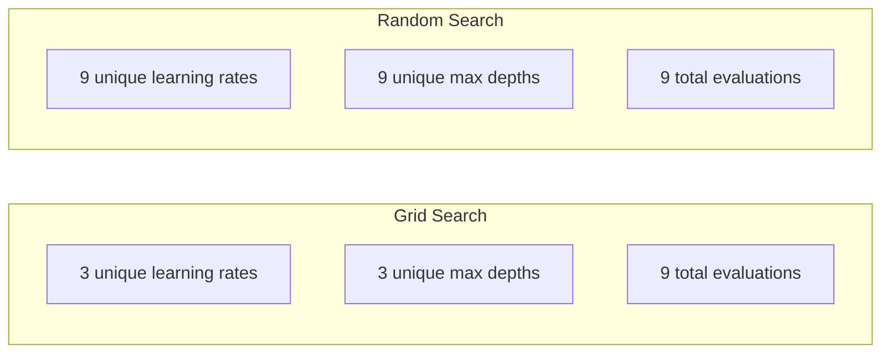
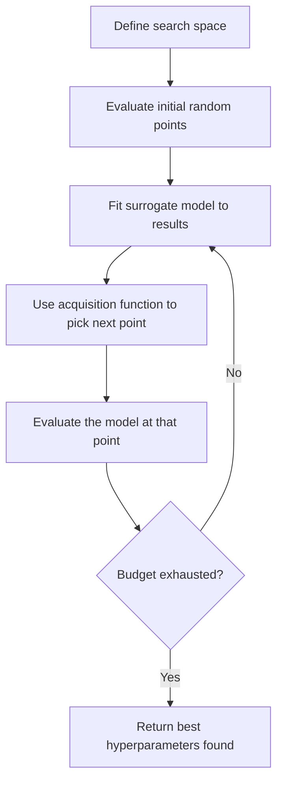
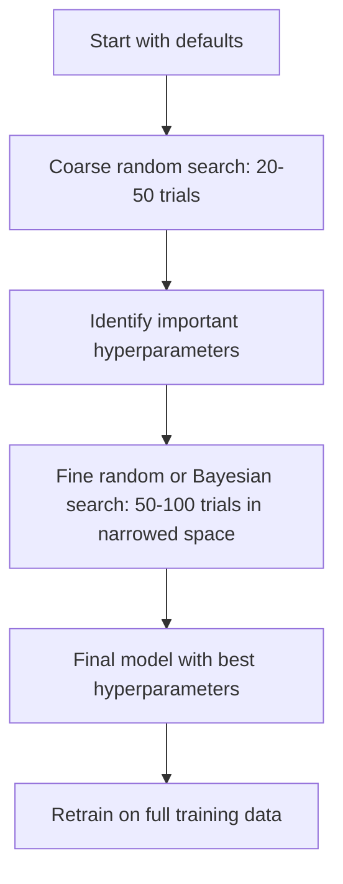
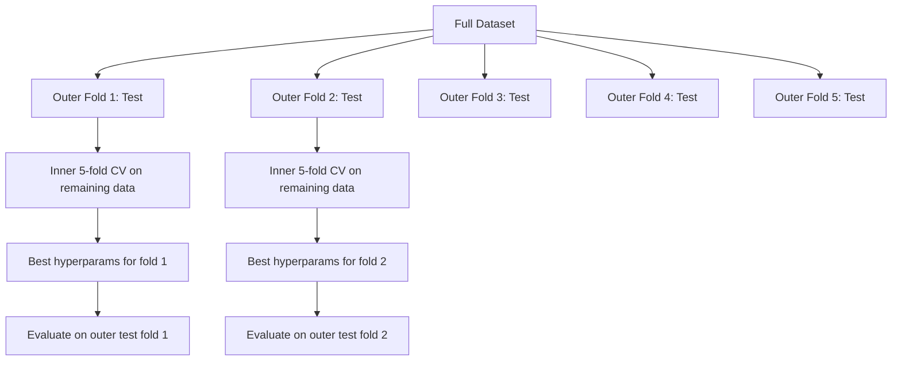

# Hyperparameter Tuning / 超参数调优

> Hyperparameters 是训练开始前要拧的旋钮。拧得好不好，决定模型是平庸还是优秀。

**Type / 类型：** Build / 构建
**Language / 语言：** Python
**Prerequisites / 前置知识：** Phase 2, Lesson 11 (Ensemble Methods)
**Time / 时间：** 约 90 分钟

## Learning Objectives / 学习目标

- 从零实现 grid search、random search 和 Bayesian optimization，并比较它们的 sample efficiency
- 解释为什么当多数 hyperparameters 的 effective dimensionality 很低时，random search 会优于 grid search
- 使用 surrogate model 和 acquisition function 构建 Bayesian optimization loop 来引导搜索
- 设计一种通过正确 cross-validation 避免 overfitting validation set 的 hyperparameter tuning strategy

## The Problem / 问题

你的 gradient boosting model 有 learning rate、number of trees、max depth、min samples per leaf、subsample ratio 和 column sample ratio。也就是六个 hyperparameters。如果每个都有 5 个合理取值，grid 就有 5^6 = 15,625 种组合。每次训练 10 秒，总计要 43 小时。

Grid search 是最显然的方法，也是规模变大后最差的方法。Random search 用更少 compute 做得更好。Bayesian optimization 会从过去评估中学习，通常更进一步。知道该用哪种策略，以及哪些 hyperparameters 真正重要，可以省掉几天 GPU 时间。

## The Concept / 概念

### Parameters vs Hyperparameters / Parameters 与 hyperparameters

Parameters 在训练中学习得到（weights、biases、split thresholds）。Hyperparameters 在训练前设定，控制学习过程。

| Hyperparameter | What it controls / 控制什么 | Typical range / 典型范围 |
|---------------|-----------------|---------------|
| Learning rate | 每次 update 的 step size | 0.001 to 1.0 |
| Number of trees/epochs | 训练多长 | 10 to 10,000 |
| Max depth | 模型复杂度 | 1 to 30 |
| Regularization (lambda) | 防止 overfitting | 0.0001 to 100 |
| Batch size | Gradient estimation noise | 16 to 512 |
| Dropout rate | 被丢弃 neurons 的比例 | 0.0 to 0.5 |

### Grid Search / 网格搜索

Grid search 会评估指定取值的所有组合。它穷尽且容易理解，但成本随 hyperparameters 数量指数增长。

```
Grid for 2 hyperparameters:

  learning_rate: [0.01, 0.1, 1.0]
  max_depth:     [3, 5, 7]

  Evaluations: 3 x 3 = 9 combinations

  (0.01, 3)  (0.01, 5)  (0.01, 7)
  (0.1,  3)  (0.1,  5)  (0.1,  7)
  (1.0,  3)  (1.0,  5)  (1.0,  7)
```

Grid search 有根本缺陷：如果一个 hyperparameter 很重要，另一个不重要，大部分评估都浪费了。9 次评估只得到重要 parameter 的 3 个不同取值。

### Random Search / 随机搜索

Random search 不是在 grid 上枚举，而是从 distributions 中采样 hyperparameters。同样 9 次评估，你会得到每个 hyperparameter 的 9 个不同取值。



为什么 random 胜过 grid（Bergstra & Bengio, 2012）：

- 多数 hyperparameters 的 effective dimensionality 很低。对一个具体问题，通常只有 6 个 hyperparameters 中的 1-2 个真正重要。
- Grid search 会在不重要维度上浪费评估。
- 在相同预算下，random search 对重要维度覆盖更密。
- 60 次 random trials 后，如果 search space 中存在一个距离最优 5% 以内的点，你有约 95% 概率找到它。

### Bayesian Optimization / 贝叶斯优化

Random search 会忽略结果。它不会学到高 learning rates 会发散，也不会学到 depth 3 稳定优于 depth 10。Bayesian optimization 使用过去评估来决定下一步搜索哪里。



两个关键组件：

**Surrogate model：** 一个评估成本低的模型（通常是 Gaussian process），近似昂贵的 objective function。它在 search space 中任意点给出 prediction 和 uncertainty estimate。

**Acquisition function：** 通过平衡 exploitation（在已知好点附近搜索）和 exploration（在 uncertainty 高的地方搜索）决定下一步评估点。常见选择：

- **Expected Improvement (EI)：** 在当前 best 之上，我们预期能改善多少？
- **Upper Confidence Bound (UCB)：** Prediction 加上不确定性倍数。UCB 高意味着这个点可能好，也可能尚未探索。
- **Probability of Improvement (PI)：** 这个点超过当前 best 的概率是多少？

Bayesian optimization 通常能用比 random search 少 2-5 倍的评估找到更好的 hyperparameters。拟合 surrogate model 的开销相对于训练真实模型可以忽略。

### Early Stopping / 早停

不是每次 training run 都需要跑完。如果一个配置 10 epochs 后明显很差，就停掉它，换下一个。这是 hyperparameter search 语境下的 early stopping。

策略：
- **Patience-based：** 如果 validation loss 连续 N 个 epochs 没改善就停止
- **Median pruning：** 如果某个 trial 在同一步的 intermediate result 比已完成 trials 的 median 更差，就停止
- **Hyperband：** 给很多配置分配小预算，再逐步给最好的配置增加预算

Hyperband 很有效。它从 81 个配置、每个 1 epoch 开始，保留 top third，给它们 3 epochs，再保留 top third，如此继续。相比让所有 configs 跑完整预算，它能快 10-50 倍找到好配置。

### Learning Rate Schedulers / 学习率调度器

Learning rate 几乎总是最重要的 hyperparameter。与其保持固定，不如在训练中动态调整。

| Scheduler | Formula | When to use / 何时使用 |
|-----------|---------|-------------|
| Step decay | Multiply by 0.1 every N epochs | 经典 CNN training |
| Cosine annealing | lr * 0.5 * (1 + cos(pi * t / T)) | 现代默认选择 |
| Warmup + decay | Linear increase then cosine decay | Transformers |
| One-cycle | Increase then decrease over one cycle | 快速收敛 |
| Reduce on plateau | Reduce by factor when metric stalls | 安全默认 |

### Hyperparameter Importance / 超参数重要性

不是所有 hyperparameters 都同等重要。关于 random forests（Probst et al., 2019）和 gradient boosting 的研究显示出稳定模式：

**High importance：**
- Learning rate（永远优先调）
- Number of estimators / epochs（使用 early stopping，而不是直接调）
- Regularization strength

**Medium importance：**
- Max depth / number of layers
- Min samples per leaf / weight decay
- Subsample ratio

**Low importance：**
- Max features（对 random forests）
- 具体 activation function choice
- Batch size（在合理范围内）

先调重要项，其余保留默认值。

### Practical Strategy / 实用策略



具体 workflow：

1. **Start with library defaults.** 它们通常由经验丰富的实践者选择，往往已经完成 80%。
2. **Coarse random search.** 使用宽范围，20-50 trials。用 early stopping 快速杀掉差 runs。
3. **Analyze results.** 哪些 hyperparameters 与 performance 相关？缩小 search space。
4. **Fine search.** 在缩小后的空间中用 Bayesian optimization 或 focused random search。50-100 trials。
5. **Retrain on all training data**，使用找到的最佳 hyperparameters。

### Cross-Validation Integration / 与 cross-validation 集成

在单个 validation split 上调 hyperparameters 有风险。最佳 hyperparameters 可能 overfit 到特定 validation fold。Nested cross-validation 用两个 loop 解决：

- **Outer loop**（evaluation）：把数据切成 train+val 和 test。报告无偏性能。
- **Inner loop**（tuning）：把 train+val 切成 train 和 val。寻找最佳 hyperparameters。



每个 outer fold 都独立寻找自己的最佳 hyperparameters。Outer scores 是 generalization performance 的无偏估计。

用 sklearn：

```python
from sklearn.model_selection import cross_val_score, GridSearchCV
from sklearn.ensemble import GradientBoostingRegressor

inner_cv = GridSearchCV(
    GradientBoostingRegressor(),
    param_grid={
        "learning_rate": [0.01, 0.05, 0.1],
        "max_depth": [2, 3, 5],
        "n_estimators": [50, 100, 200],
    },
    cv=5,
    scoring="neg_mean_squared_error",
)

outer_scores = cross_val_score(
    inner_cv, X, y, cv=5, scoring="neg_mean_squared_error"
)

print(f"Nested CV MSE: {-outer_scores.mean():.4f} +/- {outer_scores.std():.4f}")
```

这很贵（5 outer folds x 5 inner folds x 27 grid points = 675 model fits），但会给你可信的 performance estimate。论文报告结果或高风险决策时使用它。

### Practical Tips / 实用提示

**Start with the learning rate.** 对 gradient-based methods，它永远是最重要的 hyperparameter。坏 learning rate 会让其他所有东西无关紧要。先固定其他 hyperparameters 为默认值，只扫 learning rate。

**Use log-uniform distributions for learning rate and regularization.** 0.001 到 0.01 的差距与 0.1 到 1.0 一样重要。线性搜索会把预算浪费在大值端。

**Use early stopping instead of tuning n_estimators.** 对 boosting 和 neural networks，把 n_estimators 或 epochs 设高，让 early stopping 决定何时停止。这样可以从 search 中移除一个 hyperparameter。

**Budget allocation.** 把 60% tuning budget 花在最重要的前 2 个 hyperparameters 上。剩下 40% 给其他项。前 2 个通常解释了大部分 performance variation。

**Scale matters.** 永远不要对 batch size 做 log scale 搜索（16、32、64 就很好）。Learning rate 则永远用 log scale。Search distribution 要匹配 hyperparameter 对模型的影响方式。

| Model Type | Top Hyperparameters | Recommended Search | Budget |
|-----------|--------------------|--------------------|--------|
| Random Forest | n_estimators, max_depth, min_samples_leaf | Random search, 50 trials | Low (fast training) |
| Gradient Boosting | learning_rate, n_estimators, max_depth | Bayesian, 100 trials + early stopping | Medium |
| Neural Network | learning_rate, weight_decay, batch_size | Bayesian or random, 100+ trials | High (slow training) |
| SVM | C, gamma (RBF kernel) | Grid on log scale, 25-50 trials | Low (2 params) |
| Lasso/Ridge | alpha | 1D search on log scale, 20 trials | Very low |
| XGBoost | learning_rate, max_depth, subsample, colsample | Bayesian, 100-200 trials + early stopping | Medium |

**When in doubt:** random search，trials 数至少是 hyperparameters 数量的 2 倍（例如 6 个 hyperparameters = 至少 12 个 trials）。你会惊讶地发现，50 次 random search 经常胜过精心设计的 grid search。

```figure
k-fold-cv
```

## Build It / 动手构建

### Step 1: Grid Search from Scratch / 第 1 步：从零实现 Grid Search

`code/tuning.py` 从零实现 grid search、random search 和一个简单 Bayesian optimizer。

```python
def grid_search(model_fn, param_grid, X_train, y_train, X_val, y_val):
    keys = list(param_grid.keys())
    values = list(param_grid.values())
    best_score = -float("inf")
    best_params = None
    n_evals = 0

    for combo in itertools.product(*values):
        params = dict(zip(keys, combo))
        model = model_fn(**params)
        model.fit(X_train, y_train)
        score = evaluate(model, X_val, y_val)
        n_evals += 1

        if score > best_score:
            best_score = score
            best_params = params

    return best_params, best_score, n_evals
```

### Step 2: Random Search from Scratch / 第 2 步：从零实现 Random Search

```python
def random_search(model_fn, param_distributions, X_train, y_train,
                  X_val, y_val, n_iter=50, seed=42):
    rng = np.random.RandomState(seed)
    best_score = -float("inf")
    best_params = None

    for _ in range(n_iter):
        params = {k: sample(v, rng) for k, v in param_distributions.items()}
        model = model_fn(**params)
        model.fit(X_train, y_train)
        score = evaluate(model, X_val, y_val)

        if score > best_score:
            best_score = score
            best_params = params

    return best_params, best_score, n_iter
```

### Step 3: Bayesian Optimization (Simplified) / 第 3 步：Bayesian optimization（简化版）

核心思想：用已观察到的 (hyperparameter, score) pairs 拟合 Gaussian process，再用 acquisition function 决定下一步看哪里。

```python
class SimpleBayesianOptimizer:
    def __init__(self, search_space, n_initial=5):
        self.search_space = search_space
        self.n_initial = n_initial
        self.X_observed = []
        self.y_observed = []

    def _kernel(self, x1, x2, length_scale=1.0):
        dists = np.sum((x1[:, None, :] - x2[None, :, :]) ** 2, axis=2)
        return np.exp(-0.5 * dists / length_scale ** 2)

    def _fit_gp(self, X_new):
        X_obs = np.array(self.X_observed)
        y_obs = np.array(self.y_observed)
        y_mean = y_obs.mean()
        y_centered = y_obs - y_mean

        K = self._kernel(X_obs, X_obs) + 1e-4 * np.eye(len(X_obs))
        K_star = self._kernel(X_new, X_obs)

        L = np.linalg.cholesky(K)
        alpha = np.linalg.solve(L.T, np.linalg.solve(L, y_centered))
        mu = K_star @ alpha + y_mean

        v = np.linalg.solve(L, K_star.T)
        var = 1.0 - np.sum(v ** 2, axis=0)
        var = np.maximum(var, 1e-6)

        return mu, var

    def _expected_improvement(self, mu, var, best_y):
        sigma = np.sqrt(var)
        z = (mu - best_y) / (sigma + 1e-10)
        ei = sigma * (z * norm_cdf(z) + norm_pdf(z))
        return ei

    def suggest(self):
        if len(self.X_observed) < self.n_initial:
            return sample_random(self.search_space)

        candidates = [sample_random(self.search_space) for _ in range(500)]
        X_cand = np.array([to_vector(c) for c in candidates])
        mu, var = self._fit_gp(X_cand)
        ei = self._expected_improvement(mu, var, max(self.y_observed))
        return candidates[np.argmax(ei)]

    def observe(self, params, score):
        self.X_observed.append(to_vector(params))
        self.y_observed.append(score)
```

GP surrogate 在每个 candidate point 上给出两件事：predicted score（mu）和 uncertainty（var）。Expected Improvement 平衡这两者：它偏好模型预测分数高的点，也偏好 uncertainty 高的点。早期大多数点 uncertainty 高，所以 optimizer 会探索。后期它会集中到最有希望的区域。

### Step 4: Compare All Methods / 第 4 步：比较所有方法

在同一个 synthetic objective 上运行三种方法并比较。这个比较使用简化 wrapper，直接调用 objective function（不训练模型），所以 API 与上面的 model-based implementations 不同：

```python
def synthetic_objective(params):
    lr = params["learning_rate"]
    depth = params["max_depth"]
    return -(np.log10(lr) + 2) ** 2 - (depth - 4) ** 2 + 10

param_grid = {
    "learning_rate": [0.001, 0.01, 0.1, 1.0],
    "max_depth": [2, 3, 4, 5, 6, 7, 8],
}

grid_best = None
grid_score = -float("inf")
grid_history = []
for combo in itertools.product(*param_grid.values()):
    params = dict(zip(param_grid.keys(), combo))
    score = synthetic_objective(params)
    grid_history.append((params, score))
    if score > grid_score:
        grid_score = score
        grid_best = params

param_dist = {
    "learning_rate": ("log_float", 0.001, 1.0),
    "max_depth": ("int", 2, 8),
}

rand_best = None
rand_score = -float("inf")
rand_history = []
rng = np.random.RandomState(42)
for _ in range(28):
    params = {k: sample(v, rng) for k, v in param_dist.items()}
    score = synthetic_objective(params)
    rand_history.append((params, score))
    if score > rand_score:
        rand_score = score
        rand_best = params

optimizer = SimpleBayesianOptimizer(param_dist, n_initial=5)
bayes_history = []
for _ in range(28):
    params = optimizer.suggest()
    score = synthetic_objective(params)
    optimizer.observe(params, score)
    bayes_history.append((params, score))
bayes_score = max(s for _, s in bayes_history)

print(f"{'Method':<20} {'Best Score':>12} {'Evaluations':>12}")
print("-" * 50)
print(f"{'Grid Search':<20} {grid_score:>12.4f} {len(grid_history):>12}")
print(f"{'Random Search':<20} {rand_score:>12.4f} {len(rand_history):>12}")
print(f"{'Bayesian Opt':<20} {bayes_score:>12.4f} {len(bayes_history):>12}")
```

在相同预算下，Bayesian optimization 通常最快找到最佳分数，因为它不会在明显差的区域浪费评估。Random search 比 grid search 覆盖更广。Grid search 只有在 hyperparameters 很少且预算足够穷尽时才占优。

## Use It / 应用它

### Optuna in Practice / 实践中的 Optuna

Optuna 是严肃 hyperparameter tuning 推荐使用的 library。它支持 pruning、distributed search 和开箱即用的 visualization。

```python
import optuna

def objective(trial):
    lr = trial.suggest_float("learning_rate", 1e-4, 1e-1, log=True)
    n_est = trial.suggest_int("n_estimators", 50, 500)
    max_depth = trial.suggest_int("max_depth", 2, 10)

    model = GradientBoostingRegressor(
        learning_rate=lr,
        n_estimators=n_est,
        max_depth=max_depth,
    )
    model.fit(X_train, y_train)
    return mean_squared_error(y_val, model.predict(X_val))

study = optuna.create_study(direction="minimize")
study.optimize(objective, n_trials=100)

print(f"Best params: {study.best_params}")
print(f"Best MSE: {study.best_value:.4f}")
```

Optuna 关键特性：
- 对最好按 log scale 搜索的参数（learning rate、regularization）使用 `suggest_float(..., log=True)`
- 对整数参数使用 `suggest_int`
- 对离散选择使用 `suggest_categorical`
- 内置 MedianPruner，可早停差 trials
- 用 `study.trials_dataframe()` 做分析

### Optuna with Pruning / 带 pruning 的 Optuna

Pruning 会提前停止没有希望的 trials，节省大量 compute。模式如下：

```python
import optuna
from sklearn.model_selection import cross_val_score

def objective(trial):
    params = {
        "learning_rate": trial.suggest_float("lr", 1e-4, 0.5, log=True),
        "max_depth": trial.suggest_int("max_depth", 2, 10),
        "n_estimators": trial.suggest_int("n_estimators", 50, 500),
        "subsample": trial.suggest_float("subsample", 0.5, 1.0),
    }

    model = GradientBoostingRegressor(**params)
    scores = cross_val_score(model, X_train, y_train, cv=3,
                             scoring="neg_mean_squared_error")
    mean_score = -scores.mean()

    trial.report(mean_score, step=0)
    if trial.should_prune():
        raise optuna.TrialPruned()

    return mean_score

pruner = optuna.pruners.MedianPruner(n_startup_trials=10, n_warmup_steps=5)
study = optuna.create_study(direction="minimize", pruner=pruner)
study.optimize(objective, n_trials=200)
```

`MedianPruner` 会在某个 trial 的 intermediate value 比同一步已完成 trials 的 median 更差时停止它。Pruning 要求调用 `trial.report()` 上报中间指标，并调用 `trial.should_prune()` 检查是否要停。`n_startup_trials=10` 确保至少 10 个 trials 完整结束后才开始 pruning。这通常能节省 40-60% 总 compute。

### sklearn's Built-in Tuners / sklearn 内置调参器

快速实验时，sklearn 提供 `GridSearchCV`、`RandomizedSearchCV` 和 `HalvingRandomSearchCV`：

```python
from sklearn.model_selection import RandomizedSearchCV
from scipy.stats import loguniform, randint

param_dist = {
    "learning_rate": loguniform(1e-4, 0.5),
    "max_depth": randint(2, 10),
    "n_estimators": randint(50, 500),
}

search = RandomizedSearchCV(
    GradientBoostingRegressor(),
    param_dist,
    n_iter=100,
    cv=5,
    scoring="neg_mean_squared_error",
    random_state=42,
    n_jobs=-1,
)
search.fit(X_train, y_train)
print(f"Best params: {search.best_params_}")
print(f"Best CV MSE: {-search.best_score_:.4f}")
```

Learning rate 和 regularization 使用 scipy 的 `loguniform`。整数 hyperparameters 使用 `randint`。`n_jobs=-1` 会并行使用所有 CPU cores。

### Common Mistakes in Hyperparameter Tuning / 超参数调优常见错误

**Data leakage through preprocessing.** 如果你在 cross-validation 前对完整数据 fit scaler，validation fold 的信息会泄漏到 training。永远把 preprocessing 放在 `Pipeline` 里，让它只在 training fold 上 fit。

**Overfitting to the validation set.** 跑几千个 trials 本质上是在 validation set 上训练。最终性能估计要用 nested cross-validation，或者留出一个 tuning 期间从不触碰的独立 test set。

**Searching too narrow a range.** 如果 best value 位于 search space 边界，说明搜索范围不够宽。最优值可能在范围外。永远检查最佳参数是否贴边。

**Ignoring interaction effects.** Boosting 中 learning rate 和 number of estimators 强交互。低 learning rate 需要更多 estimators。独立调它们会比联合调更差。

**Not using early stopping for iterative models.** 对 gradient boosting 和 neural networks，把 n_estimators 或 epochs 设高并使用 early stopping。它严格优于把 iterations 当作 hyperparameter 直接调。

## Ship It / 交付它

本课会产出 `code/tuning.py`：包含 grid search、random search、简化 Bayesian optimizer 和方法对比 demo 的实现，可作为后续真实调参流程的基础参考。

## Exercises / 练习

1. 用相同总预算运行 grid search 和 random search（例如 50 次评估）。比较找到的最佳分数。用不同 seeds 重复 10 次。Random search 赢了多少次？

2. 从零实现 Hyperband。先启动 81 个配置，每个训练 1 epoch。每轮保留 top 1/3，并把它们的预算乘以 3。比较总 compute（所有 configs 的 epochs 之和）与让 81 个 configs 跑完整预算的差异。

3. 给 Lesson 11 的 gradient boosting implementation 添加 learning rate scheduler（cosine annealing）。与固定 learning rate 相比是否有帮助？

4. 用 Optuna 在真实数据集（例如 sklearn breast cancer dataset）上调 RandomForestClassifier。使用 `optuna.visualization.plot_param_importances(study)` 查看哪些 hyperparameters 最重要。它是否符合本课的重要性排序？

5. 实现一个简单 acquisition function（Expected Improvement），并演示 exploration vs exploitation。绘制 surrogate model 的 mean 和 uncertainty，展示 EI 会选择哪里作为下一次评估点。

## Key Terms / 关键术语

| 术语 | 常见说法 | 实际含义 |
|------|----------------|----------------------|
| Hyperparameter | “A setting you choose” | 训练前设定、控制学习过程的值，不从数据中学习 |
| Grid search | “Try every combination” | 在指定 parameter grid 上穷尽搜索，成本指数增长 |
| Random search | “Just sample randomly” | 从 distributions 中采样 hyperparameters，比 grid 更好覆盖重要维度 |
| Bayesian optimization | “Smart search” | 使用 objective 的 surrogate model 决定下一步评估位置，平衡 exploration 和 exploitation |
| Surrogate model | “A cheap approximation” | 从已观察评估中近似昂贵 objective function 的模型，通常是 Gaussian process |
| Acquisition function | “Where to look next” | 通过 expected improvement 与 uncertainty 给 candidate points 打分。EI 和 UCB 很常见 |
| Early stopping | “Stop wasting time” | 当 validation performance 不再改善时提前终止训练 |
| Hyperband | “Tournament bracket for configs” | 自适应资源分配：先用小预算评估许多 configs，保留最好的一批并增加预算 |
| Learning rate scheduler | “Change lr during training” | 在训练过程中调整 learning rate 以获得更好收敛的函数 |

## Further Reading / 延伸阅读

- [Bergstra & Bengio: Random Search for Hyper-Parameter Optimization (2012)](https://jmlr.org/papers/v13/bergstra12a.html) -- 证明 random beats grid 的论文
- [Snoek et al., Practical Bayesian Optimization of Machine Learning Algorithms (2012)](https://arxiv.org/abs/1206.2944) -- 用于 ML 的 Bayesian optimization
- [Li et al., Hyperband: A Novel Bandit-Based Approach (2018)](https://jmlr.org/papers/v18/16-558.html) -- Hyperband 论文
- [Optuna: A Next-generation Hyperparameter Optimization Framework](https://arxiv.org/abs/1907.10902) -- Optuna 论文
- [Probst et al., Tunability: Importance of Hyperparameters (2019)](https://jmlr.org/papers/v20/18-444.html) -- 哪些 hyperparameters 真正重要
