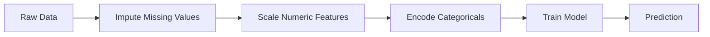
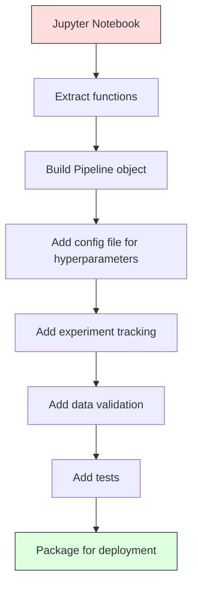

# ML Pipelines / 机器学习流水线

> 模型不是产品。Pipeline 才是。Pipeline 覆盖从 raw data 到 deployed prediction 的全部过程，而且每一步都必须可复现。

**Type / 类型：** Build / 构建
**Language / 语言：** Python
**Prerequisites / 前置知识：** Phase 2, Lesson 12 (Hyperparameter Tuning)
**Time / 时间：** 约 120 分钟

## Learning Objectives / 学习目标

- 从零构建 ML pipeline，把 imputation、scaling、encoding 和 model training 串成一个可复现对象
- 识别 data leakage 场景，并解释 pipelines 如何通过只在 training data 上 fit transformers 来防止泄漏
- 构建 ColumnTransformer，对 numeric 和 categorical features 应用不同 preprocessing
- 实现 pipeline serialization，并演示同一个 fitted pipeline 在训练和生产中产生一致结果

## The Problem / 问题

你有一个 notebook：加载数据，用 median 填缺失值，scale features，训练模型，然后打印 accuracy。它能跑。你把它上线。

一个月后，有人重新训练模型，得到不同结果。Median 是在包含 test data 的完整数据集上计算的（data leakage）。Scaling parameters 没有保存，所以 inference 使用了不同统计量。Feature engineering code 在 training 和 serving 之间复制粘贴，两个版本逐渐分叉。生产中某个 categorical column 出现了 encoder 从未见过的新值。

这些不是假设，而是 ML 系统在生产中失败的最常见原因。Pipelines 通过把每个 transformation step 打包成一个有序、可复现的对象，解决这些问题。

## The Concept / 概念

### What a Pipeline Is / Pipeline 是什么

Pipeline 是一串有序 data transformations，最后接一个 model。每一步的输出都是下一步的输入。整个 pipeline 只在 training data 上 fit 一次。Inference 时，同一个 fitted pipeline 会转换新数据并产生 predictions。



Pipeline 保证：
- Transformations 只在 training data 上 fit（无 leakage）
- Inference time 使用完全相同的 transformations
- 整个对象可以作为一个 artifact 序列化并部署
- Cross-validation 会在每个 fold 内应用 pipeline，防止隐蔽 leakage

### Data Leakage: The Silent Killer / Data leakage：沉默杀手

Data leakage 指 test set 或 future data 的信息污染了 training。Pipelines 可以防止最常见的形式。

**Leaky (wrong):**
```python
X = df.drop("target", axis=1)
y = df["target"]

scaler = StandardScaler()
X_scaled = scaler.fit_transform(X)

X_train, X_test = X_scaled[:800], X_scaled[800:]
y_train, y_test = y[:800], y[800:]
```

Scaler 看到了 test data。Mean 和 standard deviation 包含 test samples。这会虚高 accuracy estimates。

**Correct:**
```python
X_train, X_test = X[:800], X[800:]

scaler = StandardScaler()
X_train_scaled = scaler.fit_transform(X_train)
X_test_scaled = scaler.transform(X_test)
```

有了 pipeline，你不需要每次手动想这些。Pipeline 会自动处理。

### sklearn Pipeline / sklearn Pipeline

sklearn 的 `Pipeline` 会串联 transformers 和 estimator。它暴露 `.fit()`、`.predict()` 和 `.score()`，按顺序应用所有步骤。

```python
from sklearn.pipeline import Pipeline
from sklearn.preprocessing import StandardScaler
from sklearn.linear_model import LogisticRegression

pipe = Pipeline([
    ("scaler", StandardScaler()),
    ("model", LogisticRegression()),
])

pipe.fit(X_train, y_train)
predictions = pipe.predict(X_test)
```

调用 `pipe.fit(X_train, y_train)` 时：
1. Scaler 对 X_train 调用 `fit_transform`
2. Model 在 scaled X_train 上调用 `fit`

调用 `pipe.predict(X_test)` 时：
1. Scaler 对 X_test 调用 `transform`（不是 fit_transform）
2. Model 在 scaled X_test 上调用 `predict`

Scaler 在 fitting 时永远不会看到 test data。这就是 pipeline 的全部意义。

### ColumnTransformer: Different Pipelines for Different Columns / ColumnTransformer：按列使用不同 pipelines

真实数据集同时有 numeric 和 categorical columns，需要不同 preprocessing。`ColumnTransformer` 处理这个问题。

```python
from sklearn.compose import ColumnTransformer
from sklearn.preprocessing import StandardScaler, OneHotEncoder
from sklearn.impute import SimpleImputer

numeric_pipe = Pipeline([
    ("impute", SimpleImputer(strategy="median")),
    ("scale", StandardScaler()),
])

categorical_pipe = Pipeline([
    ("impute", SimpleImputer(strategy="most_frequent")),
    ("encode", OneHotEncoder(handle_unknown="ignore")),
])

preprocessor = ColumnTransformer([
    ("num", numeric_pipe, ["age", "income", "score"]),
    ("cat", categorical_pipe, ["city", "gender", "plan"]),
])

full_pipeline = Pipeline([
    ("preprocess", preprocessor),
    ("model", GradientBoostingClassifier()),
])
```

OneHotEncoder 中的 `handle_unknown="ignore"` 对生产至关重要。当新类别出现（模型从未见过的城市），它会输出零向量，而不是崩溃。

### Experiment Tracking / 实验追踪

Pipeline 让训练可复现，但你还需要记录每次实验发生了什么：用了哪些 hyperparameters、哪个 dataset version、metrics 是多少、运行的是哪份代码。

**MLflow** 是最常见的开源方案：

```python
import mlflow

with mlflow.start_run():
    mlflow.log_param("max_depth", 5)
    mlflow.log_param("n_estimators", 100)
    mlflow.log_param("learning_rate", 0.1)

    pipe.fit(X_train, y_train)
    accuracy = pipe.score(X_test, y_test)

    mlflow.log_metric("accuracy", accuracy)
    mlflow.sklearn.log_model(pipe, "model")
```

每次 run 都会记录 parameters、metrics、artifacts 和完整模型。你可以比较 runs、复现任意实验，并部署任意 model version。

**Weights & Biases (wandb)** 提供类似功能，并带 hosted dashboard：

```python
import wandb

wandb.init(project="my-pipeline")
wandb.config.update({"max_depth": 5, "n_estimators": 100})

pipe.fit(X_train, y_train)
accuracy = pipe.score(X_test, y_test)

wandb.log({"accuracy": accuracy})
```

### Model Versioning / 模型版本管理

有了 experiment tracking 后，还需要管理 model versions。哪个模型在 production？哪个在 staging？上周用的是哪个？

MLflow 的 Model Registry 提供：
- **Version tracking：** 每个保存的 model 都有 version number
- **Stage transitions：** “Staging”、“Production”、“Archived”
- **Approval workflow：** 模型必须显式 promoted to production
- **Rollback：** 可以立刻切回 previous version

### Data Versioning with DVC / 用 DVC 做数据版本管理

Code 用 git 管理版本。Data 也应该版本化，但 git 不能处理大文件。DVC（Data Version Control）解决这个问题。

```
dvc init
dvc add data/training.csv
git add data/training.csv.dvc data/.gitignore
git commit -m "Track training data"
dvc push
```

DVC 把实际数据存到 remote storage（S3、GCS、Azure），并在 git 中保留一个小 `.dvc` 文件记录 hash。当你 checkout 某个 git commit 时，`dvc checkout` 会恢复当时使用的精确数据。

这意味着每个 git commit 同时固定 code 和 data。完整可复现。

### Reproducible Experiments / 可复现实验

可复现实验需要四件事：

1. **Fixed random seeds：** 为 numpy、random 和 framework（torch、sklearn）设置 seeds
2. **Pinned dependencies：** requirements.txt 或 poetry.lock 中精确固定版本
3. **Versioned data：** DVC 或类似工具
4. **Config files：** 所有 hyperparameters 放在 config 中，不要 hardcode

```python
import numpy as np
import random

def set_seed(seed=42):
    random.seed(seed)
    np.random.seed(seed)
    try:
        import torch
        torch.manual_seed(seed)
        torch.cuda.manual_seed_all(seed)
        torch.backends.cudnn.deterministic = True
    except ImportError:
        pass
```

### From Notebook to Production Pipeline / 从 notebook 到生产 pipeline



典型演进路径：

1. **Notebook exploration：** 快速实验、可视化、feature ideas
2. **Extract functions：** 把 preprocessing、feature engineering、evaluation 移到 modules
3. **Build Pipeline：** 把 transformations 串成 sklearn Pipeline 或自定义 class
4. **Config management：** 把所有 hyperparameters 移到 YAML/JSON config
5. **Experiment tracking：** 加入 MLflow 或 wandb logging
6. **Data validation：** 训练前检查 schema、distributions 和 missing value patterns
7. **Tests：** 为 transformers 写 unit tests，为完整 pipeline 写 integration tests
8. **Deployment：** 序列化 pipeline，包装成 API（FastAPI、Flask），容器化

### Common Pipeline Mistakes / 常见 pipeline 错误

| Mistake / 错误 | Why it is bad / 危害 | Fix / 修复 |
|---------|-------------|-----|
| Fitting on full data before splitting | Data leakage | Use Pipeline with cross_val_score |
| Feature engineering outside pipeline | Train 与 serve 使用不同 transforms | Put all transforms in the Pipeline |
| Not handling unknown categories | 生产中新值导致崩溃 | OneHotEncoder(handle_unknown="ignore") |
| Hardcoded column names | Schema 变化时坏掉 | Use column name lists from config |
| No data validation | 坏数据导致 silent wrong predictions | Add schema checks before prediction |
| Training/serving skew | 生产中模型看到不同 features | One Pipeline object for both |

## Build It / 动手构建

`code/pipeline.py` 会从零构建一个完整 ML pipeline：

### Step 1: Custom Transformer / 第 1 步：自定义 transformer

```python
class CustomTransformer:
    def __init__(self):
        self.means = None
        self.stds = None

    def fit(self, X):
        self.means = np.mean(X, axis=0)
        self.stds = np.std(X, axis=0)
        self.stds[self.stds == 0] = 1.0
        return self

    def transform(self, X):
        return (X - self.means) / self.stds

    def fit_transform(self, X):
        return self.fit(X).transform(X)
```

### Step 2: Pipeline from Scratch / 第 2 步：从零实现 Pipeline

```python
class PipelineFromScratch:
    def __init__(self, steps):
        self.steps = steps

    def fit(self, X, y=None):
        X_current = X.copy()
        for name, step in self.steps[:-1]:
            X_current = step.fit_transform(X_current)
        name, model = self.steps[-1]
        model.fit(X_current, y)
        return self

    def predict(self, X):
        X_current = X.copy()
        for name, step in self.steps[:-1]:
            X_current = step.transform(X_current)
        name, model = self.steps[-1]
        return model.predict(X_current)
```

### Step 3: Cross-Validation with Pipeline / 第 3 步：带 pipeline 的 cross-validation

代码会演示 pipeline 如何防止 data leakage：scaler 会在每个 fold 的 training data 上单独 fit。

### Step 4: Full Production Pipeline with sklearn / 第 4 步：用 sklearn 构建完整生产 pipeline

完整 pipeline 包含 `ColumnTransformer`、多个 preprocessing paths 和一个 model，并使用正确 cross-validation 和 experiment logging 训练。

## Use It / 应用它

实际项目中，优先使用 sklearn 的 `Pipeline` 和 `ColumnTransformer` 把所有 preprocessing 与 model 打包在一起，再用 `cross_val_score` 或 `GridSearchCV` 评估。上线时序列化整个 fitted pipeline，而不是只保存 model weights；这样 training 和 serving 会使用同一套 imputation、scaling 和 encoding 参数。

## Ship It / 交付它

本课会产出：
- `outputs/prompt-ml-pipeline.md` -- 一个用于构建和调试 ML pipelines 的 skill
- `code/pipeline.py` -- 从零实现到 sklearn 版本的完整 pipeline

## Exercises / 练习

1. 构建一个处理 3 个 numeric columns 和 2 个 categorical columns 的 pipeline。使用 `ColumnTransformer`，对 numerics 应用 median imputation + scaling，对 categoricals 应用 most-frequent imputation + one-hot encoding。用 5-fold cross-validation 训练。

2. 故意引入 data leakage：在 split 前对完整数据 fit scaler。比较 leaky cross-validation score 和 clean pipeline cross-validation score。差异有多大？

3. 用 `joblib.dump` 序列化 pipeline。在另一个脚本中加载并运行 predictions。验证 predictions 完全一致。

4. 给 pipeline 添加 custom transformer，为两个最重要的 numeric columns 创建 polynomial features（degree 2）。它应该放在 pipeline 的哪个位置？

5. 为 pipeline 设置 MLflow tracking。用不同 hyperparameters 跑 5 次实验。使用 MLflow UI（`mlflow ui`）比较 runs 并选择最佳模型。

## Key Terms / 关键术语

| 术语 | 常见说法 | 实际含义 |
|------|----------------|----------------------|
| Pipeline | “Chain of transforms + model” | 一串有序 fitted transformers 和一个 model，作为整体应用来防止 leakage |
| Data leakage | “Test info leaked into training” | 使用 training set 之外的信息构建模型，虚高 performance estimates |
| ColumnTransformer | “Different preprocessing per column” | 对不同列子集应用不同 pipelines，并合并结果 |
| Experiment tracking | “Logging your runs” | 记录每次训练 run 的 parameters、metrics、artifacts 和 code versions |
| MLflow | “Track and deploy models” | 开源平台，用于 experiment tracking、model registry 和 deployment |
| DVC | “Git for data” | 大文件数据版本控制系统，在 git 中存 hash，在 remote storage 中存数据 |
| Model registry | “Model version catalog” | 追踪 model versions 及其 stage labels（staging、production、archived）的系统 |
| Training/serving skew | “It worked in the notebook” | 训练和 inference 中数据处理方式不同，导致 silent errors |
| Reproducibility | “Same code, same result” | 用同样 code、data 和 configuration 得到完全相同结果的能力 |

## Further Reading / 延伸阅读

- [scikit-learn Pipeline docs](https://scikit-learn.org/stable/modules/compose.html) -- 官方 pipeline 参考
- [MLflow documentation](https://mlflow.org/docs/latest/index.html) -- experiment tracking 和 model registry
- [DVC documentation](https://dvc.org/doc) -- data versioning
- [Sculley et al., Hidden Technical Debt in Machine Learning Systems (2015)](https://papers.nips.cc/paper/2015/hash/86df7dcfd896fcaf2674f757a2463eba-Abstract.html) -- 关于 ML systems complexity 的经典论文
- [Google ML Best Practices: Rules of ML](https://developers.google.com/machine-learning/guides/rules-of-ml) -- 实用 production ML 建议
