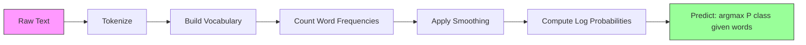

# Naive Bayes / 朴素贝叶斯

> “Naive” 假设是错的，但它仍然有效。这就是它的美。

**Type / 类型：** Build / 构建
**Language / 语言：** Python
**Prerequisites / 前置知识：** Phase 2, Lessons 01-07 (classification, Bayes' theorem)
**Time / 时间：** 约 75 分钟

## Learning Objectives / 学习目标

- 使用 Laplace smoothing 从零实现用于 text classification 的 Multinomial Naive Bayes
- 解释为什么 naive independence assumption 在数学上是错的，但实践中仍能产生正确 class rankings
- 比较 Multinomial、Bernoulli 和 Gaussian Naive Bayes variants，并为给定 feature type 选择正确版本
- 在 high-dimensional sparse data 上评估 Naive Bayes 与 logistic regression，并解释其中的 bias-variance tradeoff

## The Problem / 问题

你需要做文本分类。把 emails 分成 spam 或 not-spam，把 customer reviews 分成 positive 或 negative，把 support tickets 分到不同 categories。你有数千个 features（每个词一个），但训练数据有限。

大多数 classifiers 会在这里吃力。Logistic regression 需要足够 samples 来可靠估计数千个 weights。Decision trees 一次只按一个词 split，会疯狂 overfit。KNN 在 10,000 维中没有意义，因为每个点到其他点都差不多远。

Naive Bayes 能处理这个问题。它做了一个数学上错误的假设（给定 class 后，每个 feature 都与其他 feature 独立），但在 text classification 上仍然胜过很多“更聪明”的模型，尤其是在小训练集上。它只需单次遍历数据就能训练。它能扩展到百万 features。它能输出概率估计（虽然由于 independence assumption，概率通常校准得很差）。

理解为什么错误假设还能带来好预测，会教你一个机器学习基本原则：最好的模型不是“最正确”的模型，而是在你的数据上拥有最佳 bias-variance tradeoff 的模型。

## The Concept / 概念

### Bayes' Theorem (Quick Review) / 贝叶斯定理快速回顾

Bayes' theorem 反转条件概率：

```
P(class | features) = P(features | class) * P(class) / P(features)
```

我们想要 `P(class | features)`，即给定文档中的词后，它属于某个 class 的概率。可以从这些量计算：
- `P(features | class)`：该 class 的文档中看到这些词的 likelihood
- `P(class)`：class 的 prior probability（spam 总体上有多常见？）
- `P(features)`：evidence，对所有 classes 相同，所以比较时可以忽略

`P(class | features)` 最高的 class 获胜。

### The Naive Independence Assumption / 朴素独立假设

精确计算 `P(features | class)` 需要估计所有 features 的 joint probability。词表有 10,000 个词时，你需要估计 2^10,000 种可能组合的分布。做不到。

Naive assumption：给定 class 后，每个 feature 条件独立。

```
P(w1, w2, ..., wn | class) = P(w1 | class) * P(w2 | class) * ... * P(wn | class)
```

你不再估计一个不可能的 joint distribution，而是估计 n 个简单的 per-feature distributions。每个只需要计数。

这个假设显然是错的。任何文档里，“machine” 和 “learning” 都不是独立的。但 classifier 不需要正确的概率估计。它需要正确的 ranking：哪个 class 概率最高。Independence assumption 会引入系统误差，但这些误差往往类似地影响所有 classes，所以 ranking 仍然正确。

### Why It Still Works / 为什么它仍然有效

三个原因：

1. **Ranking over calibration.** Classification 只需要最高排名 class 正确。即使 P(spam) = 0.99999，而真实概率是 0.7，classifier 仍然正确选择 spam。我们不需要准确概率，只需要正确赢家。

2. **High bias, low variance.** Independence assumption 是很强的 prior。它严格约束模型，防止 overfitting。在训练数据有限时，一个略微错误但稳定的模型，会胜过理论上正确但极不稳定的模型。这就是 bias-variance tradeoff。

3. **Feature redundancy cancels out.** 相关 features 提供冗余证据。Classifier 会重复计算这份证据，但也会为正确 class 重复计算。如果 “machine” 和 “learning” 总是一起出现，二者都为 “tech” class 提供证据。NB 会算两次，但算的是正确 class 的证据。

第四个实践原因：Naive Bayes 极快。训练只是遍历数据计数。预测是一次 matrix multiplication。你可以在几秒内训练百万文档。这种速度意味着你能更快迭代、尝试更多 feature sets、运行更多实验。

### The Math Step by Step / 数学过程

来看一个具体例子。假设有两个 classes：spam 和 not-spam。词表有三个词：“free”、“money”、“meeting”。

训练数据：
- Spam emails 中 “free” 出现 80 次，“money” 出现 60 次，“meeting” 出现 10 次（总 150 词）
- Not-spam emails 中 “free” 出现 5 次，“money” 出现 10 次，“meeting” 出现 100 次（总 115 词）
- 40% 邮件是 spam，60% 是 not-spam

使用 Laplace smoothing（alpha=1）：

```
P(free | spam)    = (80 + 1) / (150 + 3) = 81/153 = 0.529
P(money | spam)   = (60 + 1) / (150 + 3) = 61/153 = 0.399
P(meeting | spam) = (10 + 1) / (150 + 3) = 11/153 = 0.072

P(free | not-spam)    = (5 + 1) / (115 + 3) = 6/118 = 0.051
P(money | not-spam)   = (10 + 1) / (115 + 3) = 11/118 = 0.093
P(meeting | not-spam) = (100 + 1) / (115 + 3) = 101/118 = 0.856
```

新邮件包含：“free”（2 次）、“money”（1 次）、“meeting”（0 次）。

```
log P(spam | email) = log(0.4) + 2*log(0.529) + 1*log(0.399) + 0*log(0.072)
                    = -0.916 + 2*(-0.637) + (-0.919) + 0
                    = -3.109

log P(not-spam | email) = log(0.6) + 2*log(0.051) + 1*log(0.093) + 0*log(0.856)
                        = -0.511 + 2*(-2.976) + (-2.375) + 0
                        = -8.838
```

Spam 以很大优势胜出。“free” 出现两次是强 spam 证据。注意 “meeting” 不出现对两个 log sums 都贡献 0（0 * log(P)）：在 Multinomial NB 中，不出现的词没有影响。Bernoulli NB 才会显式建模 word absence。

### Three Variants / 三种变体

Naive Bayes 有三种主要风格。每种都以不同方式建模 `P(feature | class)`。

#### Multinomial Naive Bayes / 多项式朴素贝叶斯

把每个 feature 建模为 count。最适合 word frequencies 或 TF-IDF values 这类文本数据。

```
P(word_i | class) = (count of word_i in class + alpha) / (total words in class + alpha * vocab_size)
```

`alpha` 是 Laplace smoothing（下面解释）。这是 text classification 的主力版本。

#### Gaussian Naive Bayes / 高斯朴素贝叶斯

把每个 feature 建模为 normal distribution。最适合 continuous features。

```
P(x_i | class) = (1 / sqrt(2 * pi * var)) * exp(-(x_i - mean)^2 / (2 * var))
```

每个 class 对每个 feature 都有自己的 mean 和 variance。当 features 在每个 class 内确实近似钟形分布时，它效果好。

#### Bernoulli Naive Bayes / 伯努利朴素贝叶斯

把每个 feature 建模为 binary（出现或不出现）。最适合短文本或 binary feature vectors。

```
P(word_i | class) = (docs in class containing word_i + alpha) / (total docs in class + 2 * alpha)
```

与 Multinomial 不同，Bernoulli 会显式惩罚词的缺失。如果 “free” 通常出现在 spam 中，但这封邮件没有 “free”，Bernoulli 会把这作为反对 spam 的证据。

### When to Use Each Variant / 何时使用哪个变体

| Variant / 变体 | Feature Type / 特征类型 | Best For / 适合 | Example / 示例 |
|---------|-------------|----------|---------|
| Multinomial | Counts or frequencies | Text classification, bag-of-words | Email spam, topic classification |
| Gaussian | Continuous values | 近似 normal 的 tabular data | Iris classification, sensor data |
| Bernoulli | Binary (0/1) | Short text, binary feature vectors | SMS spam, presence/absence features |

### Laplace Smoothing / 拉普拉斯平滑

如果一个词出现在 test data 中，但在某个 class 的 training data 中从未出现，会发生什么？

没有 smoothing 时：`P(word | class) = 0/N = 0`。一个零乘进整个乘积，会让 `P(class | features) = 0`，不管其他证据多强。单个未见词会毁掉整个 prediction。

Laplace smoothing 给每个 feature count 加一个小计数 `alpha`（通常为 1）：

```
P(word_i | class) = (count(word_i, class) + alpha) / (total_words_in_class + alpha * vocab_size)
```

alpha=1 时，每个词至少有一个很小的概率。测试邮件中出现 “discombobulate” 不再会杀死 spam probability。Smoothing 有 Bayesian 解释：等价于给 word distributions 放一个 uniform Dirichlet prior。

Alpha 越高，smoothing 越强（分布更均匀）。Alpha 越低，模型越相信数据。Alpha 是需要 tune 的 hyperparameter。

Alpha 的效果：

| Alpha | Effect / 效果 | When to use / 何时使用 |
|-------|--------|-------------|
| 0.001 | 几乎不 smoothing，信任数据 | 非常大训练集，预期没有 unseen features |
| 0.1 | 轻度 smoothing | 大训练集 |
| 1.0 | 标准 Laplace smoothing | 默认起点 |
| 10.0 | 重 smoothing，压平分布 | 很小训练集，预期有很多 unseen features |

### Log-Space Computation / Log 空间计算

把几百个概率（每个小于 1）相乘会导致 floating-point underflow。乘积在浮点数中变成 0，虽然真实值只是很小的正数。

解决方法：在 log space 中工作。不是乘概率，而是加 logarithms：

```
log P(class | x1, x2, ..., xn) = log P(class) + sum_i log P(xi | class)
```

这把 prediction 变成 dot product：

```
log_scores = X @ log_feature_probs.T + log_class_priors
prediction = argmax(log_scores)
```

Matrix multiplication。这就是 Naive Bayes prediction 很快的原因：它和单层 linear model 是同一个操作。

### Naive Bayes vs Logistic Regression / Naive Bayes 与 Logistic Regression

二者都是文本上的 linear classifiers。区别在于它们建模什么。

| Aspect / 方面 | Naive Bayes | Logistic Regression |
|--------|------------|-------------------|
| Type | Generative (models P(X\|Y)) | Discriminative (models P(Y\|X)) |
| Training | Count frequencies | Optimize loss function |
| Small data | 更好（strong prior 有帮助） | 更差（样本不足以估计 weights） |
| Large data | 更差（错误假设拖后腿） | 更好（flexible boundary） |
| Features | 假设 independence | 能处理 correlations |
| Speed | 单次遍历，非常快 | 迭代优化 |
| Calibration | 概率较差 | 概率更好 |

经验法则：从 Naive Bayes 开始。如果数据足够多且 NB plateau，再切换到 logistic regression。

### Classification Pipeline / 分类 pipeline



实践中，我们在 log space 工作来避免 floating-point underflow。不再乘很多小概率，而是加它们的 logarithms：

```
log P(class | features) = log P(class) + sum_i log P(feature_i | class)
```

```figure
naive-bayes
```

## Build It / 动手构建

`code/naive_bayes.py` 从零实现了 MultinomialNB 和 GaussianNB。

### MultinomialNB / MultinomialNB

From-scratch implementation：

1. **fit(X, y)**：对每个 class，统计每个 feature 的频率。加 Laplace smoothing。计算 log probabilities。存储 class priors（class frequencies 的 log）。

2. **predict_log_proba(X)**：对每个 sample，计算所有 classes 的 log P(class) + sum of log P(feature_i | class)。这是 matrix multiplication：X @ log_probs.T + log_priors。

3. **predict(X)**：返回 log probability 最高的 class。

```python
class MultinomialNB:
    def __init__(self, alpha=1.0):
        self.alpha = alpha

    def fit(self, X, y):
        classes = np.unique(y)
        n_classes = len(classes)
        n_features = X.shape[1]

        self.classes_ = classes
        self.class_log_prior_ = np.zeros(n_classes)
        self.feature_log_prob_ = np.zeros((n_classes, n_features))

        for i, c in enumerate(classes):
            X_c = X[y == c]
            self.class_log_prior_[i] = np.log(X_c.shape[0] / X.shape[0])
            counts = X_c.sum(axis=0) + self.alpha
            self.feature_log_prob_[i] = np.log(counts / counts.sum())

        return self
```

关键洞察：fit 后，prediction 就是 matrix multiplication 加一个 bias。这就是 Naive Bayes 如此快的原因。

### GaussianNB / GaussianNB

对 continuous features，我们为每个 class、每个 feature 估计 mean 和 variance：

```python
class GaussianNB:
    def __init__(self):
        pass

    def fit(self, X, y):
        classes = np.unique(y)
        self.classes_ = classes
        self.means_ = np.zeros((len(classes), X.shape[1]))
        self.vars_ = np.zeros((len(classes), X.shape[1]))
        self.priors_ = np.zeros(len(classes))

        for i, c in enumerate(classes):
            X_c = X[y == c]
            self.means_[i] = X_c.mean(axis=0)
            self.vars_[i] = X_c.var(axis=0) + 1e-9
            self.priors_[i] = X_c.shape[0] / X.shape[0]

        return self
```

Prediction 会按 feature 使用 Gaussian PDF，并跨 features 相乘（在 log space 中相加）。

### Demo: Text Classification / Demo：文本分类

代码会生成 synthetic bag-of-words data，模拟两个 classes（tech articles vs sports articles）。每个 class 有不同 word frequency distribution。MultinomialNB 使用 word counts 对它们分类。

Synthetic data 的构造方式：创建 200 个 “words”（feature columns）。Words 0-39 在 tech articles 中高频、在 sports 中低频。Words 80-119 在 sports 中高频、在 tech 中低频。Words 40-79 在两类中都是中等频率。这样构造了一个现实场景：有些词是强 class indicators，另一些是 noise。

### Demo: Continuous Features / Demo：连续特征

代码会生成类似 Iris 的数据（3 classes、4 features、Gaussian clusters）。GaussianNB 使用 per-class mean 和 variance 分类。每个 class 有不同 center（mean vector）和 spread（variance），模拟真实世界中不同类别的测量值系统性不同。

代码还演示：
- **Smoothing comparison：** 用不同 alpha values 训练 MultinomialNB，展示 smoothing strength 对 accuracy 的影响。
- **Training size experiment：** NB accuracy 如何随 training data 从 20 增长到 1600 而提升。NB 在很少样本下就能达到不错 accuracy，这是它的主要优势。
- **Confusion matrix：** Per-class precision、recall 和 F1 score，用来展示 NB 会在哪里犯错。

### Prediction Speed / 预测速度

Naive Bayes prediction 是 matrix multiplication。对 n 个 samples、d 个 features、k 个 classes：
- MultinomialNB：一次 matrix multiply (n x d) @ (d x k) = O(n * d * k)
- GaussianNB：n * k 次 Gaussian PDF evaluations，每次跨 d 个 features = O(n * d * k)

二者对每个维度都是线性的。相比 KNN（需要对所有 training points 计算距离）或 RBF kernel SVM（需要对所有 support vectors 计算 kernel），NB 的 prediction time 快几个数量级。

## Use It / 应用它

用 sklearn，两个 variants 都是一行：

```python
from sklearn.naive_bayes import GaussianNB, MultinomialNB

gnb = GaussianNB()
gnb.fit(X_train, y_train)
print(f"GaussianNB accuracy: {gnb.score(X_test, y_test):.3f}")

mnb = MultinomialNB(alpha=1.0)
mnb.fit(X_train_counts, y_train)
print(f"MultinomialNB accuracy: {mnb.score(X_test_counts, y_test):.3f}")
```

用 sklearn 做 text classification：

```python
from sklearn.feature_extraction.text import CountVectorizer
from sklearn.naive_bayes import MultinomialNB
from sklearn.pipeline import Pipeline

text_clf = Pipeline([
    ("vectorizer", CountVectorizer()),
    ("classifier", MultinomialNB(alpha=1.0)),
])

text_clf.fit(train_texts, train_labels)
accuracy = text_clf.score(test_texts, test_labels)
```

`naive_bayes.py` 中的代码会在同一数据上比较 from-scratch implementations 和 sklearn，验证正确性。

### TF-IDF with Naive Bayes / Naive Bayes 搭配 TF-IDF

Raw word counts 对每个词的每次出现都给同样权重。但像 “the” 和 “is” 这样的常见词会出现在每个 class 中，几乎不携带信息。TF-IDF（Term Frequency - Inverse Document Frequency）会降低常见词权重，提高罕见且有区分度词的权重。

```python
from sklearn.feature_extraction.text import TfidfVectorizer
from sklearn.naive_bayes import MultinomialNB
from sklearn.pipeline import Pipeline

text_clf = Pipeline([
    ("tfidf", TfidfVectorizer()),
    ("classifier", MultinomialNB(alpha=0.1)),
])
```

TF-IDF values 非负，因此可以和 MultinomialNB 配合。TF-IDF + MultinomialNB 是 text classification 最强 baselines 之一。在少于 10,000 training samples 的数据集上，它经常胜过更复杂模型。

### BernoulliNB for Short Text / 短文本中的 BernoulliNB

对短文本（tweets、SMS、chat messages），BernoulliNB 可能优于 MultinomialNB。短文本词数少，MultinomialNB 依赖的 frequency 信息噪声较大。BernoulliNB 只关心出现或不出现，这对短文本更可靠。

```python
from sklearn.naive_bayes import BernoulliNB
from sklearn.feature_extraction.text import CountVectorizer

text_clf = Pipeline([
    ("vectorizer", CountVectorizer(binary=True)),
    ("classifier", BernoulliNB(alpha=1.0)),
])
```

CountVectorizer 中的 `binary=True` 会把所有 counts 转成 0/1。不加它，BernoulliNB 仍能运行，但它看到的是自己不是为其设计的 counts。

### Calibrating NB Probabilities / 校准 NB 概率

NB probabilities 校准很差。当 NB 说 P(spam) = 0.95 时，真实概率可能是 0.7。如果你需要可靠 probability estimates（例如设 threshold 或与其他模型组合），使用 sklearn 的 CalibratedClassifierCV：

```python
from sklearn.calibration import CalibratedClassifierCV

calibrated_nb = CalibratedClassifierCV(MultinomialNB(), cv=5, method="sigmoid")
calibrated_nb.fit(X_train, y_train)
proba = calibrated_nb.predict_proba(X_test)
```

它会使用 cross-validation 在 NB raw scores 上拟合 logistic regression。得到的 probabilities 会更接近真实 class frequencies。

### Common Gotchas / 常见坑

1. **Negative feature values.** MultinomialNB 要求 features 非负。如果有负值（例如某些设置下的 TF-IDF 或 standardized features），使用 GaussianNB，或者把 features 平移为正。

2. **Zero variance features.** GaussianNB 会除以 variance。如果某个 class 中某个 feature variance 为 0（所有值完全相同），probability computation 会出问题。代码给所有 variances 加了小 smoothing term（1e-9）防止这个问题。

3. **Class imbalance.** 如果 99% 邮件是 not-spam，prior P(not-spam) = 0.99 会非常强，可能压过 likelihood evidence。你可以手动设置 class priors，或使用 sklearn 的 class_prior parameter。

4. **Feature scaling.** MultinomialNB 不需要 scaling（它使用 counts）。GaussianNB 也不需要 scaling（它估计 per-feature statistics）。这是它相对 logistic regression 和 SVM 的优势，后两者对 feature scales 敏感。

## Ship It / 交付它

本课会产出：
- `outputs/skill-naive-bayes-chooser.md` -- 一个选择正确 NB variant 的 decision skill
- `code/naive_bayes.py` -- 从零实现的 MultinomialNB 和 GaussianNB，并包含 sklearn 对比

### When Naive Bayes Fails / Naive Bayes 什么时候失败

当 independence assumption 导致 ranking 错误（不只是 probability 错误）时，NB 会失败。常见情况：

1. **Strong feature interactions.** 如果 class 取决于两个 features 的组合，而不取决于任意单独 feature（类似 XOR patterns），NB 会完全错过。每个 feature 单独都不给证据，NB 无法非线性组合它们。

2. **Highly correlated features with opposing evidence.** 如果 feature A 指向 “spam”，feature B 指向 “not-spam”，但 A 和 B 实际完全相关（现实中总是一致），NB 会看到不存在的冲突证据。

3. **Very large training sets.** 数据足够多时，logistic regression 这类 discriminative models 会学到真实 decision boundary 并超过 NB。小数据时有帮助的 independence assumption，此时会限制模型。

实践中，这些 failure modes 在 text classification 上并不常见。文本 features 数量多、单个 feature 弱，independence assumption 的错误往往会相互抵消。对少量强相关 features 的 tabular data，优先考虑 logistic regression 或 tree-based models。

## Exercises / 练习

1. **Smoothing experiment.** 在 text data 上分别用 alpha = 0.01、0.1、1.0、10.0、100.0 训练 MultinomialNB。绘制 accuracy vs alpha。性能在哪里达到峰值？为什么 alpha 很高会伤害效果？

2. **Feature independence test.** 取一个真实 text dataset。选择两个明显相关的词（“machine” 和 “learning”）。计算 P(word1 | class) * P(word2 | class)，并与 P(word1 AND word2 | class) 比较。Independence assumption 错得有多厉害？它影响 classification accuracy 吗？

3. **Bernoulli implementation.** 扩展代码，实现 BernoulliNB class。把 bag-of-words 转成 binary（present/absent），并在 text data 上与 MultinomialNB 比较 accuracy。什么时候 Bernoulli 胜出？

4. **NB vs Logistic Regression.** 在 text data 上训练二者。从 100 个 training samples 开始增加到 10,000。绘制两者 accuracy vs training set size。Logistic Regression 在什么时候超过 Naive Bayes？

5. **Spam filter.** 构建完整 spam classifier：tokenize raw email text、build vocabulary、create bag-of-words features、train MultinomialNB，并用 precision 和 recall 评估（不只看 accuracy，为什么？）。

## Key Terms / 关键术语

| 术语 | 常见说法 | 实际含义 |
|------|----------------|----------------------|
| Naive Bayes | “Simple probabilistic classifier” | 一个应用 Bayes' theorem，并假设 features 在给定 class 后条件独立的 classifier |
| Conditional independence | “Features don't affect each other” | P(A, B \| C) = P(A \| C) * P(B \| C) -- 知道 C 后，知道 B 不再给 A 提供新信息 |
| Laplace smoothing | “Add-one smoothing” | 给每个 feature 加小计数，防止零概率支配 prediction |
| Prior | “What you believed before seeing data” | P(class) -- 观察 features 前每个 class 的概率 |
| Likelihood | “How well the data fits” | P(features \| class) -- 已知 class 时观察到这些 features 的概率 |
| Posterior | “What you believe after seeing data” | P(class \| features) -- 观察 features 后更新后的 class 概率 |
| Generative model | “Models how data is generated” | 学习 P(X \| Y) 和 P(Y)，再用 Bayes' theorem 得到 P(Y \| X) 的模型 |
| Discriminative model | “Models the decision boundary” | 直接学习 P(Y \| X)，不建模 X 如何生成 |
| Log probability | “Avoid underflow” | 使用 log P 而不是 P，防止很多小数相乘后在浮点中变成 0 |

## Further Reading / 延伸阅读

- [scikit-learn Naive Bayes docs](https://scikit-learn.org/stable/modules/naive_bayes.html) -- 三种 variants 及其数学细节
- [McCallum and Nigam, A Comparison of Event Models for Naive Bayes Text Classification (1998)](https://www.cs.cmu.edu/~knigam/papers/multinomial-aaaiws98.pdf) -- Multinomial 与 Bernoulli 在文本上的经典比较
- [Rennie et al., Tackling the Poor Assumptions of Naive Bayes Text Classifiers (2003)](https://people.csail.mit.edu/jrennie/papers/icml03-nb.pdf) -- 改进文本 NB 的方法
- [Ng and Jordan, On Discriminative vs. Generative Classifiers (2001)](https://ai.stanford.edu/~ang/papers/nips01-discriminativegenerative.pdf) -- 证明 NB 在少数据时比 LR 收敛更快
