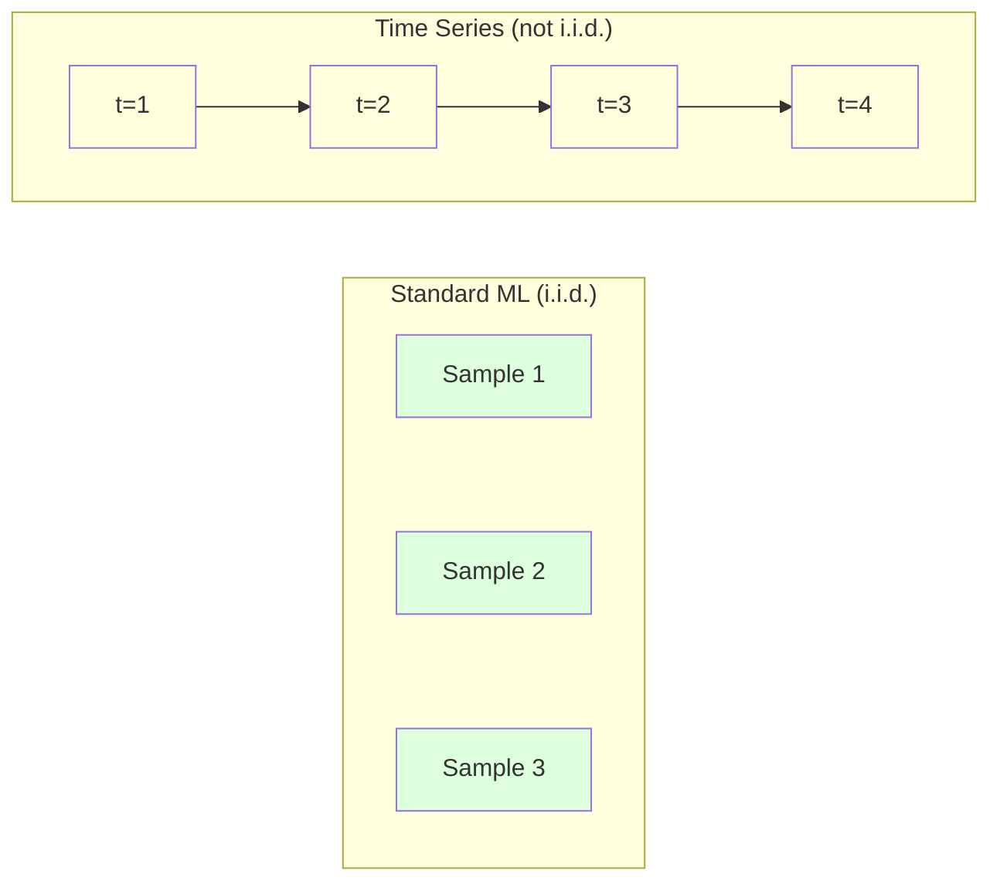
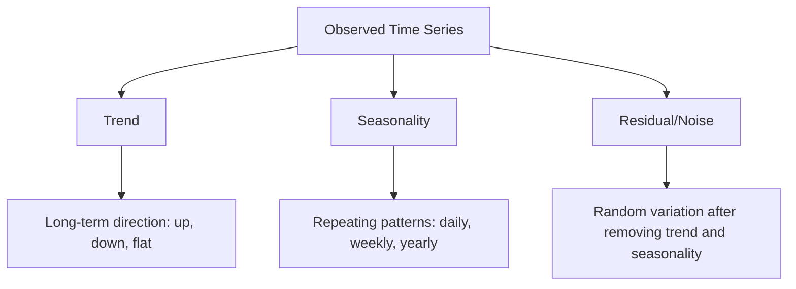
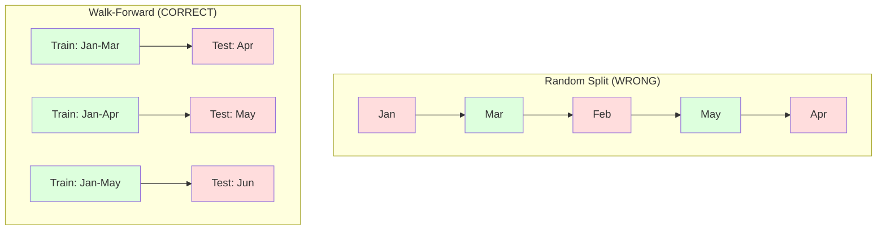

# Time Series Fundamentals / 时间序列基础

> 过去表现确实可以预测未来结果，前提是你先检查 stationarity。

**Type / 类型：** Build / 构建
**Language / 语言：** Python
**Prerequisites / 前置知识：** Phase 2, Lessons 01-09
**Time / 时间：** 约 90 分钟

## Learning Objectives / 学习目标

- 把 time series 分解成 trend、seasonality 和 residual components，并测试 stationarity
- 实现 lag features 和 rolling statistics，把 time series 转成 supervised learning problem
- 构建 walk-forward validation framework，防止 future data 泄漏进 training
- 解释为什么随机 train/test splits 对 time series 无效，并展示它与正确 temporal splits 的性能差距

## The Problem / 问题

你有按时间排序的数据。每日销售额、每小时温度、每分钟 CPU 使用率、每周股价。你想预测下一个值、下一周或下一季度。

你拿起标准 ML 工具箱：random train/test split、cross-validation、feature matrix 输入、prediction 输出。每一步都是错的。

Time series 破坏了标准 ML 依赖的假设。Samples 不独立，今天的温度依赖昨天的温度。Random splits 会把未来信息泄漏到过去。Backtest 中看起来很好的 features，到生产中会失败，因为它们依赖随时间变化的模式。

一个用 random cross-validation 达到 95% accuracy 的模型，用正确 time-based evaluation 可能只有 55%。这不是技术细节，而是纸面模型与生产模型的分界线。

本课覆盖基础内容：时间数据有什么不同、如何诚实评估模型，以及如何把 time series 转成标准 ML 模型可以消费的 features。

## The Concept / 概念

### What Makes Time Series Different / Time series 有何不同

标准 ML 假设 i.i.d.：independent and identically distributed。每个 sample 都独立来自同一分布。Time series 同时违反这两点：

- **Not independent.** 今天的股价依赖昨天的。本周销售额和上周相关。
- **Not identically distributed.** 分布会随时间变化。12 月销售额和 3 月不同。

这些违反不是小问题。它们会改变你构造 features、评估模型和选择算法的方式。



在标准 ML 中，samples 可以互换，打乱不影响信息。在 time series 中，顺序就是一切。打乱会摧毁信号。

### Components of a Time Series / Time series 的组成

每个 time series 都由几部分组合而成：



- **Trend**：长期方向。收入每年增长 10%。全球温度上升。
- **Seasonality**：固定间隔重复的模式。零售销售在 12 月激增。空调使用在 7 月达到峰值。
- **Residual**：移除 trend 和 seasonality 后剩下的东西。如果 residual 像 white noise，说明 decomposition 捕捉到了信号。

### Stationarity / 平稳性

如果 time series 的统计性质（mean、variance、autocorrelation）不随时间变化，它就是 stationary 的。多数 forecasting methods 假设 stationarity。

**为什么重要：** non-stationary series 的 mean 会漂移。在 1 月数据上训练的模型学到的是不同于 2 月的 mean，会系统性出错。

**如何检查：** 在窗口上计算 rolling mean 和 rolling standard deviation。如果它们漂移，series 就是 non-stationary。

**如何修复：** Differencing。不是建模 raw values，而是建模相邻值之间的变化：

```
diff[t] = value[t] - value[t-1]
```

如果一阶 differencing 还不能让 series stationary，再做一次（二阶 differencing）。大多数真实 series 最多需要两轮。

**示例：**

Original series: [100, 102, 106, 112, 120]
First difference:  [2, 4, 6, 8] (still trending upward)
Second difference:  [2, 2, 2] (constant -- stationary)

原始 series 有 quadratic trend。一阶 differencing 把它变成 linear trend。二阶 differencing 让它变平。实践中很少需要超过两轮。

**Formal test：** Augmented Dickey-Fuller (ADF) test 是 stationarity 的标准统计检验。Null hypothesis 是 “series is non-stationary”。p-value 低于 0.05 表示可以拒绝 null，并得出 stationary 结论。我们不会从零实现 ADF（它需要 asymptotic distribution tables），但代码中的 rolling statistics 方法提供了实用的视觉检查。

### Autocorrelation / 自相关

Autocorrelation 衡量 time t 的值与 time t-k（过去 k 步）的值相关多少。Autocorrelation function (ACF) 会为每个 lag k 画出这种相关性。

**ACF 告诉你：**
- Series 记忆有多长。如果 ACF 在 lag 5 后降到 0，超过 5 步的历史就无关。
- 是否存在 seasonality。如果 ACF 在 lag 12（月度数据）处尖峰，说明存在 yearly seasonality。
- 要创建多少 lag features。使用 ACF 变得可忽略之前的 lags。

**PACF (Partial Autocorrelation Function)** 会去除间接相关。如果今天与 3 天前相关只是因为二者都与昨天相关，那么 lag 3 的 PACF 会为零，而 ACF 不一定。

### Lag Features: Turning Time Series into Supervised Learning / Lag features：把 time series 转成 supervised learning

标准 ML 模型需要 feature matrix X 和 target y。Time series 只有一列值。桥梁是 lag features。

把 series [10, 12, 14, 13, 15] 转成 lag-1 和 lag-2 features：

| lag_2 | lag_1 | target |
|-------|-------|--------|
| 10    | 12    | 14     |
| 12    | 14    | 13     |
| 14    | 13    | 15     |

现在你有了标准 regression problem。任何 ML 模型（linear regression、random forest、gradient boosting）都可以用 lags 预测 target。

还可以工程化的 features：
- **Rolling statistics：** 最近 k 个值的 mean、std、min、max
- **Calendar features：** day of week、month、is_holiday、is_weekend
- **Differenced values：** 与上一步的变化
- **Expanding statistics：** cumulative mean、cumulative sum
- **Ratio features：** current value / rolling mean（偏离近期均值多少）
- **Interaction features：** lag_1 * day_of_week（weekday effects on momentum）

**多少 lags？** 使用 autocorrelation function。如果 ACF 到 lag 10 都显著，至少使用 10 个 lags。如果有 weekly seasonality，包含 lag 7（也可能包含 14）。更多 lags 给模型更多历史，但也增加要拟合的 features，提高 overfitting 风险。

**Target alignment trap.** 创建 lag features 时，target 必须是 time t 的值，所有 features 必须只使用 time t-1 或更早的值。如果你不小心把 time t 的值作为 feature，就得到一个完美 predictor 和完全没用的模型。这是 time series feature engineering 中最常见 bug。

### Walk-Forward Validation / Walk-forward 验证

这是本课最重要的概念。标准 k-fold cross-validation 会随机把 samples 分到 train 和 test。对 time series 来说，这会泄漏 future information。



Walk-forward validation：
1. 用截至 time t 的数据训练
2. 预测 time t+1（或多步预测中的 t+1 到 t+k）
3. 向前滑动窗口
4. 重复

每个 test fold 只包含所有 training data 之后的数据。没有 future leakage。这给出了模型部署后表现的诚实估计。

**Expanding window** 使用所有历史数据训练（window 增长）。**Sliding window** 使用固定长度 training window（window 滑动）。如果你认为旧数据仍相关，用 expanding。如果世界变化且旧数据有害，用 sliding。

### ARIMA Intuition / ARIMA 直觉

ARIMA 是经典 time series model。它有三个组件：

- **AR (Autoregressive)：** 从过去值预测。AR(p) 使用最近 p 个值。
- **I (Integrated)：** 用 differencing 达到 stationarity。I(d) 应用 d 轮 differencing。
- **MA (Moving Average)：** 从过去 forecast errors 预测。MA(q) 使用最近 q 个 errors。

ARIMA(p, d, q) 组合三者。你可以基于 ACF/PACF analysis 或 automated search（auto-ARIMA）选择 p、d、q。

我们不会从零实现 ARIMA，它需要超出本课范围的 numerical optimization。关键是理解每个组件在做什么，这样你能解释 ARIMA 结果，并知道何时使用它。

### When to Use What / 什么时候用什么

| Approach / 方法 | Best For / 适合 | Handles Seasonality / 处理 seasonality | Handles External Features / 处理外部 features |
|----------|---------|-------------------|------------------------|
| Lag features + ML | 有许多 external features 的 tabular 问题 | 用 calendar features | Yes |
| ARIMA | 单个 univariate series、短期预测 | SARIMA variant | No (ARIMAX for limited) |
| Exponential smoothing | 简单 trend + seasonality | Yes (Holt-Winters) | No |
| Prophet | Business forecasting、holidays | Yes (Fourier terms) | Limited |
| Neural networks (LSTM, Transformer) | 长序列、多条 series | Learned | Yes |

多数实际问题中，lag features + gradient boosting 是最强起点。它天然处理 external features，不要求 stationarity，也容易 debug。

### Forecasting Horizons and Strategies / 预测 horizon 与策略

Single-step forecasting 预测下一步。Multi-step forecasting 预测多步。三种策略：

**Recursive (iterated)：** 先预测一步，再把 prediction 作为下一步输入。简单，但 errors 会累积，因为每次 prediction 都依赖前一次 prediction。

**Direct：** 为每个 horizon 训练一个单独模型。Model-1 预测 t+1，Model-5 预测 t+5。没有 error accumulation，但每个模型训练样本更少，且不共享信息。

**Multi-output：** 训练一个模型同时输出所有 horizons。能跨 horizons 共享信息，但需要支持 multiple outputs 的模型（或自定义 loss function）。

大多数实践问题中，短 horizon（1-5 steps）先用 recursive，长 horizon 先用 direct。

### Common Mistakes in Time Series / Time series 常见错误

| Mistake / 错误 | Why it happens / 原因 | How to fix / 修复 |
|---------|---------------|-----------|
| Random train/test split | 标准 ML 习惯 | Use walk-forward or temporal split |
| Using future features | 错把 time t 的 feature 加入 | Audit every feature for temporal alignment |
| Overfitting to seasonality | 模型记住 calendar patterns | Hold out a full seasonal cycle in the test set |
| Ignoring scale changes | Revenue doubles but patterns stay | Model percentage change instead of absolute |
| Too many lag features | “More history is better” | Use ACF to determine relevant lags |
| Not differencing | “The model will figure it out” | Tree models handle trends; linear models need stationarity |

## Build It / 动手构建

`code/time_series.py` 从零实现核心 building blocks。

### Lag Feature Creator / Lag feature 创建器

```python
def make_lag_features(series, n_lags):
    n = len(series)
    X = np.full((n, n_lags), np.nan)
    for lag in range(1, n_lags + 1):
        X[lag:, lag - 1] = series[:-lag]
    valid = ~np.isnan(X).any(axis=1)
    return X[valid], series[valid]
```

它把 1D series 转成 feature matrix，每行包含最近 `n_lags` 个值作为 features，当前值作为 target。

### Walk-Forward Cross-Validation / Walk-forward cross-validation

```python
def walk_forward_split(n_samples, n_splits=5, min_train=50):
    assert min_train < n_samples, "min_train must be less than n_samples"
    step = max(1, (n_samples - min_train) // n_splits)
    for i in range(n_splits):
        train_end = min_train + i * step
        test_end = min(train_end + step, n_samples)
        if train_end >= n_samples:
            break
        yield slice(0, train_end), slice(train_end, test_end)
```

每个 split 都保证 training data 严格早于 test data。Training window 每个 fold 都会扩展。

### Simple Autoregressive Model / 简单 autoregressive model

纯 AR model 就是在 lag features 上做 linear regression：

```python
class SimpleAR:
    def __init__(self, n_lags=5):
        self.n_lags = n_lags
        self.weights = None
        self.bias = None

    def fit(self, series):
        X, y = make_lag_features(series, self.n_lags)
        # Solve via normal equations
        X_b = np.column_stack([np.ones(len(X)), X])
        theta = np.linalg.lstsq(X_b, y, rcond=None)[0]
        self.bias = theta[0]
        self.weights = theta[1:]
        return self
```

它在概念上与 Lesson 02 的 linear regression 完全相同，只是应用在同一变量的 time-lagged versions 上。

### Stationarity Check / Stationarity 检查

代码计算 rolling statistics，从视觉和数值上评估 stationarity：

```python
def check_stationarity(series, window=50):
    rolling_mean = np.array([
        series[max(0, i - window):i].mean()
        for i in range(1, len(series) + 1)
    ])
    rolling_std = np.array([
        series[max(0, i - window):i].std()
        for i in range(1, len(series) + 1)
    ])
    return rolling_mean, rolling_std
```

如果 rolling mean 漂移或 rolling std 变化，series 就是 non-stationary。做 differencing 后再检查。

代码还通过比较 series 的前半段和后半段来检查 stationarity。如果 means 相差超过半个 standard deviation，或 variance ratio 超过 2x，就标记为 non-stationary。

### Autocorrelation / 自相关

```python
def autocorrelation(series, max_lag=20):
    n = len(series)
    mean = series.mean()
    var = series.var()
    acf = np.zeros(max_lag + 1)
    for k in range(max_lag + 1):
        cov = np.mean((series[:n-k] - mean) * (series[k:] - mean))
        acf[k] = cov / var if var > 0 else 0
    return acf
```

## Use It / 应用它

用 sklearn，你可以把 lag features 直接喂给任意 regressor：

```python
from sklearn.linear_model import Ridge
from sklearn.ensemble import GradientBoostingRegressor

X, y = make_lag_features(series, n_lags=10)

for train_idx, test_idx in walk_forward_split(len(X)):
    model = Ridge(alpha=1.0)
    model.fit(X[train_idx], y[train_idx])
    predictions = model.predict(X[test_idx])
```

ARIMA 使用 statsmodels：

```python
from statsmodels.tsa.arima.model import ARIMA

model = ARIMA(train_series, order=(5, 1, 2))
fitted = model.fit()
forecast = fitted.forecast(steps=30)
```

`time_series.py` 中的代码会演示两种方式，并用 walk-forward validation 比较。

### sklearn TimeSeriesSplit / sklearn TimeSeriesSplit

sklearn 提供 `TimeSeriesSplit` 实现 walk-forward validation：

```python
from sklearn.model_selection import TimeSeriesSplit

tscv = TimeSeriesSplit(n_splits=5)
for train_index, test_index in tscv.split(X):
    X_train, X_test = X[train_index], X[test_index]
    y_train, y_test = y[train_index], y[test_index]
    model.fit(X_train, y_train)
    score = model.score(X_test, y_test)
```

这等价于 from-scratch 的 `walk_forward_split`，但集成进 sklearn 的 cross-validation framework。可以与 `cross_val_score` 一起使用：

```python
from sklearn.model_selection import cross_val_score

scores = cross_val_score(model, X, y, cv=TimeSeriesSplit(n_splits=5))
print(f"Mean score: {scores.mean():.4f} +/- {scores.std():.4f}")
```

### Evaluation Metrics / 评估指标

Time series forecasting 使用 regression metrics，但要带 time-aware context：

- **MAE (Mean Absolute Error)：** |y_true - y_pred| 的平均值。用原单位解释很容易。“平均来说，预测偏差为 3.2 度。”
- **RMSE (Root Mean Squared Error)：** Mean squared error 的平方根。对大误差惩罚比 MAE 更重。当大错误比许多小错误更糟时使用。
- **MAPE (Mean Absolute Percentage Error)：** |error / true_value| * 100 的平均值。与尺度无关，适合跨 series 比较。但 true values 为 0 时未定义。
- **Naive baseline comparison：** 永远与简单 baselines 比较。Seasonal naive baseline 会预测上一周期的值（昨天、上周）。如果模型比不过 naive，一定有问题。

### Rolling Features / 滚动特征

代码会演示在 lag features 上添加 rolling statistics（7 天和 14 天窗口的 mean、std、min、max）。它们给模型提供近期 trend 和 volatility 信息，这些是单独 lag features 捕捉不到的。

例如，rolling mean 上升暗示 upward trend。Rolling std 上升暗示 volatility 增强。Tree-based models 能从这些模式中学习，但 linear models 通常不能。

## Ship It / 交付它

本课会产出：
- `outputs/prompt-time-series-advisor.md` -- 一个用于 framing time series problems 的 prompt
- `code/time_series.py` -- lag features、walk-forward validation、AR model、stationarity checks

### Baselines You Must Beat / 必须击败的 baselines

建任何模型前，先建立 baselines：

1. **Last value (persistence).** 预测明天等于今天。对很多 series 来说，这非常难击败。
2. **Seasonal naive.** 预测今天等于上周同一天（或去年同一天）。如果模型比不过它，就没有学到 seasonality 之外的有用模式。
3. **Moving average.** 预测最近 k 个值的平均。能平滑 noise，但不能捕捉突变。

如果你的复杂 ML 模型输给 seasonal naive baseline，你有 bug。最常见原因：features 中有 future leakage、评估方法错误，或者 series 真的是随机且不可预测。

### Practical Tips / 实用提示

1. **Start with plotting.** 建模前先画 raw series。看 trend、seasonality、outliers、structural breaks（行为突然变化）。30 秒的视觉检查往往比 1 小时自动分析更有价值。

2. **Difference first, model second.** 如果 series 有明显 trend，先 differencing 再创建 lag features。Tree-based models 能处理 trends，但 linear models 不行；differencing 通常有益。

3. **Hold out at least one full seasonal cycle.** 如果有 weekly seasonality，test set 至少要包含完整一周。如果是 monthly，至少完整一个月。否则无法评估模型是否捕捉到 seasonal pattern。

4. **Monitor in production.** Time series models 会随世界变化而退化。滚动跟踪 prediction errors。错误开始上升时，用近期数据 retrain。

5. **Beware of regime changes.** 用疫情前数据训练的模型预测不了疫情后行为。为已知 regime changes 加 indicator features，或使用会遗忘旧数据的 sliding window。

6. **Log-transform skewed series.** Revenue、prices 和 counts 常常右偏。取 log 可以稳定 variance，并把 multiplicative patterns 变成 additive patterns，linear models 更容易处理。在 log space 预测，再 exponentiate 回原单位。

## Exercises / 练习

1. **Stationarity experiment.** 生成带 linear trend 的 series。用 rolling statistics 检查 stationarity。做一阶 differencing 后再检查。Quadratic trend 需要几轮 differencing？

2. **Lag selection.** 在 seasonal series（period=7）上计算 ACF。哪些 lags 的 autocorrelation 最高？只使用这些 lags 创建 lag features（而不是连续 lags）。相比使用 lags 1 through 7，accuracy 是否提升？

3. **Walk-forward vs random split.** 在 lag features 上训练 Ridge regression。用 random 80/20 split 和 walk-forward validation 评估。Random split 会高估多少性能？

4. **Feature engineering.** 给 lag features 添加 rolling mean（window=7）、rolling std（window=7）和 day-of-week features。用 walk-forward validation 比较加入前后的 accuracy。

5. **Multi-step forecasting.** 修改 AR model 预测 5 steps ahead，而不是 1 step。比较两种策略：(a) 先预测一步，再把 prediction 作为下一步输入（recursive）；(b) 为每个 horizon 训练单独模型（direct）。哪个更准确？

## Key Terms / 关键术语

| 术语 | 常见说法 | 实际含义 |
|------|----------------|----------------------|
| Stationarity | “The stats don't change over time” | mean、variance 和 autocorrelation structure 随时间保持不变的 series |
| Differencing | “Subtract consecutive values” | 计算 y[t] - y[t-1] 来移除 trends 并达到 stationarity |
| Autocorrelation (ACF) | “How a series correlates with itself” | time series 与自身 lagged copy 之间的相关性，作为 lag 的函数 |
| Partial autocorrelation (PACF) | “Direct correlation only” | 移除所有更短 lags 影响后，lag k 处的 autocorrelation |
| Lag features | “Past values as inputs” | 使用 y[t-1]、y[t-2]、...、y[t-k] 作为 features 来预测 y[t] |
| Walk-forward validation | “Time-respecting cross-validation” | 训练数据永远在时间上早于测试数据的评估方式 |
| ARIMA | “The classic time series model” | AutoRegressive Integrated Moving Average：结合 past values（AR）、differencing（I）和 past errors（MA） |
| Seasonality | “Repeating calendar patterns” | 与日、周、年等 calendar periods 绑定的规则、可预测 cycles |
| Trend | “The long-term direction” | Series level 随时间持续上升或下降 |
| Expanding window | “Use all history” | Walk-forward validation 中 training set 随每个 fold 增长 |
| Sliding window | “Fixed-size history” | Walk-forward validation 中 training set 是向前滑动的固定长度窗口 |

## Further Reading / 延伸阅读

- [Hyndman and Athanasopoulos, Forecasting: Principles and Practice (3rd ed.)](https://otexts.com/fpp3/) -- 最好的免费 time series forecasting 教材
- [scikit-learn Time Series Split](https://scikit-learn.org/stable/modules/generated/sklearn.model_selection.TimeSeriesSplit.html) -- sklearn 的 walk-forward splitter
- [statsmodels ARIMA docs](https://www.statsmodels.org/stable/generated/statsmodels.tsa.arima.model.ARIMA.html) -- 带 diagnostics 的 ARIMA 实现
- [Makridakis et al., The M5 Competition (2022)](https://www.sciencedirect.com/science/article/pii/S0169207021001874) -- 大规模 forecasting competition，展示 ML methods 与 statistical methods 的比较
