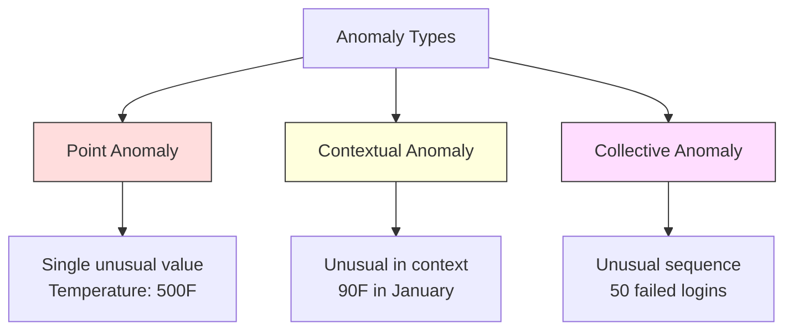
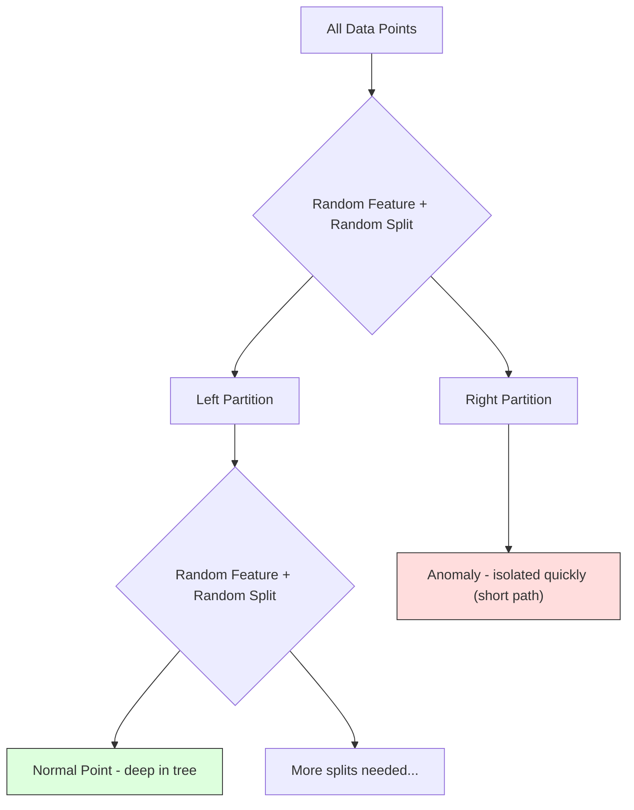
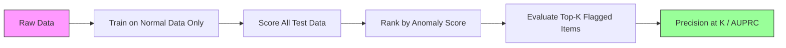

# Anomaly Detection / 异常检测

> 正常很容易定义。异常就是不符合正常模式的东西。

**Type / 类型：** Build / 构建
**Language / 语言：** Python
**Prerequisites / 前置知识：** Phase 2, Lessons 01-09
**Time / 时间：** 约 75 分钟

## Learning Objectives / 学习目标

- 从零实现 Z-score、IQR 和 Isolation Forest anomaly detection methods
- 区分 point、contextual 和 collective anomalies，并为每类异常选择合适 detection method
- 解释为什么 anomaly detection 被表述为建模 normal data，而不是分类 anomalies
- 比较 unsupervised anomaly detection 与 supervised classification，并评估 novel anomaly coverage 和 precision 之间的权衡

## The Problem / 问题

一张信用卡下午 2 点在纽约被使用，2:05 又在东京被使用。工厂传感器读数 150 度，而正常范围是 80-120。服务器每秒发送 50,000 个请求，而日均只有 200。

这些都是 anomalies。找到它们很重要。Fraud 造成数十亿美元损失。设备故障造成停机。网络入侵造成数据泄露。

挑战是：你很少有带标签的 anomaly 样本。Fraud 只占交易的 0.1%。设备故障一年只发生几次。你无法训练标准 classifier，因为 “anomaly” class 几乎没有可学习的样本。即使有一些 labels，你见过的 anomalies 也不是未来会遇到的全部类型。明天的 fraud scheme 会不同于今天。

Anomaly detection 把问题反过来。不是学习什么是 abnormal，而是学习什么是 normal。任何偏离 normal 的东西都值得怀疑。这不需要 labels，能适应新型 anomalies，也能扩展到大规模数据。

## The Concept / 概念

### Types of Anomalies / 异常类型

不是所有 anomalies 都相同：

- **Point anomalies.** 单个数据点无论上下文如何都异常。500 度的温度读数。一个平时花 50 美元的账户发生 50,000 美元交易。
- **Contextual anomalies.** 给定上下文时异常的数据点。90 度在夏天正常，在冬天异常。同样的值，不同 context。
- **Collective anomalies.** 一组数据点整体异常，即使每个单独点可能正常。5 次登录失败正常，连续 50 次就是 brute-force attack。

大多数方法检测 point anomalies。Contextual anomalies 需要 time 或 location features。Collective anomalies 需要 sequence-aware methods。



### The Unsupervised Framing / 无监督表述

标准 classification 中，你有两个 classes 的 labels。Anomaly detection 通常是三种情况之一：

1. **Fully unsupervised.** 完全没有 labels。你在所有数据上 fit detector，并希望 anomalies 足够稀少，不会污染 “normal” model。
2. **Semi-supervised.** 你有一个只包含 normal data 的干净数据集。你在这个 clean set 上 fit，然后给其他所有数据打分。这是可能时最强的设定。
3. **Weakly supervised.** 你有少量 labeled anomalies。用它们做 evaluation，不用于 training。先 unsupervised training，再在 labeled subset 上测 precision/recall。

关键洞察：anomaly detection 与 classification 根本不同。你建模的是 normal data 的 distribution，而不是两个 classes 之间的 decision boundary。

### Supervised vs Unsupervised: The Tradeoff / Supervised 与 unsupervised 的权衡

如果你有 labeled anomalies，应该用它们训练（supervised classification），还是只用来评估（unsupervised detection）？

**Supervised（当成 classification）：**
- 能抓住已经见过的 anomaly types
- 对已知 anomaly types precision 更高
- 完全漏掉 novel anomaly types
- 新 anomaly types 出现时需要 retrain
- 需要足够 anomaly examples（通常太少）

**Unsupervised（model normal, flag deviations）：**
- 能抓住任何偏离 normal 的东西，包括 novel types
- 不需要 labeled anomalies
- False positive rate 更高（异常不一定是坏事）
- 对 distribution shift 更稳健

实践中，最好的系统会组合二者：用 unsupervised detection 提供广覆盖，用 supervised models 处理已知高优先级 anomaly types，用 human review 处理模糊案例。

### Z-Score Method / Z-score 方法

最简单的方法。计算每个 feature 的 mean 和 standard deviation。标记任何超过 k 个 standard deviations 的点。

```text
z_score = (x - mean) / std
anomaly if |z_score| > threshold
```

默认 threshold 是 3.0（Gaussian distribution 中 99.7% 的 normal data 落在 3 个 standard deviations 内）。

**优点：** 简单、快速、可解释（“这个值比正常高 4.5 个 standard deviations”）。

**缺点：** 假设数据是 normal distribution。对 training data 中的 outliers 敏感（outliers 会移动 mean、抬高 std，让自己更难被发现）。在 multimodal distributions 上失败。

**适合：** 单 feature monitoring，且数据大致钟形。Server response times、manufacturing tolerances、baseline 稳定的 sensor readings。

**失败场景：** Multi-cluster data（两个办公室 baseline temperatures 不同）、skewed data（transaction amounts 中 $1000 罕见但不异常）、training set 中已有 outliers。

### IQR Method / IQR 方法

比 Z-score 更稳健。它使用 interquartile range，而不是 mean 和 standard deviation。

```
Q1 = 25th percentile
Q3 = 75th percentile
IQR = Q3 - Q1
lower_bound = Q1 - factor * IQR
upper_bound = Q3 + factor * IQR
anomaly if x < lower_bound or x > upper_bound
```

默认 factor 是 1.5。

**优点：** 对 outliers 稳健（percentiles 不受极端值影响）。适合 skewed distributions。不假设 normality。

**缺点：** 只是一元方法（逐 feature 独立应用）。无法检测只有在 joint space 中才异常的点（某个点在每个单独 feature 上都正常，但组合异常）。

**实践提示：** IQR 中的 1.5 factor 对应 box plot 中的 whiskers。Whiskers 外的点是 potential outliers。使用 3.0 而不是 1.5 会让 detector 更保守（更少 flags、更少 false positives）。正确 factor 取决于你对 false alarms 的容忍度。

### Isolation Forest / 孤立森林

关键洞察：anomalies 数量少且不同。在随机切分数据时，anomalies 更容易被隔离，只需要更少 random splits 就能与其他点分开。



**工作方式：**
1. 构建许多 random trees（isolation forest）
2. 每个 node 随机选择一个 feature，并在该 feature 的 min 和 max 之间随机选择 split value
3. 继续 split，直到每个点都被隔离（在自己的 leaf 中）
4. Anomalies 在所有 trees 上的 average path length 更短

**为什么有效：** Normal points 位于 dense regions。需要许多 random splits 才能把一个点从邻居中隔离出来。Anomalies 位于 sparse regions。一两次 random split 就足以隔离它们。

Anomaly score 基于所有 trees 的 average path length，并用 random binary search tree 的 expected path length 归一化：

```
score(x) = 2^(-average_path_length(x) / c(n))
```

其中 `c(n)` 是 n 个 samples 的 expected path length。Score 接近 1 表示 anomaly，接近 0.5 表示 normal，接近 0 表示非常 normal（深处在 dense clusters 中）。

**优点：** 不假设分布。高维可用。扩展性好（因为每棵树使用 subsample，复杂度 sublinear in sample size）。处理 mixed feature types。

**缺点：** 对 dense regions 中的 anomalies 表现较差（masking effect）。当很多 features irrelevant 时，random splitting 效果变差。

**关键 hyperparameters：**
- `n_estimators`：树的数量。100 通常足够。更多树让 scores 更稳定，但更慢。
- `max_samples`：每棵树使用的 samples 数。原始论文默认 256。较小值让单棵树不那么准确，但增加 diversity。Subsampling 是 Isolation Forest 快的原因，每棵树只看少量数据。
- `contamination`：预期 anomaly 比例。只用于设置 threshold，不影响 scores 本身。

### Local Outlier Factor (LOF) / 局部离群因子

LOF 比较一个点周围的 local density 与其 neighbors 周围的 density。一个位于稀疏区域、但周围是稠密区域的点就是异常。

**工作方式：**
1. 对每个点，找到 k nearest neighbors
2. 计算 local reachability density（邻域有多密）
3. 比较每个点的 density 与其 neighbors 的 densities
4. 如果某个点的 density 明显低于 neighbors，它就是 outlier

**LOF score：**
- LOF 接近 1.0 表示与 neighbors density 类似（normal）
- LOF 大于 1.0 表示 density 低于 neighbors（potentially anomalous）
- LOF 远大于 1.0（例如 2.0+）表示显著低 density（likely anomaly）

“Local” 很关键。考虑一个有两个 clusters 的数据集：一个 1000 点 dense cluster，一个 50 点 sparse cluster。Sparse cluster 边缘的点并不是全局异常，它有 50 个 neighbors。但如果它的 immediate neighbors 比它更密，它在局部就是异常。LOF 捕捉了这种 global methods 会错过的细节。

**优点：** 检测 local anomalies（即使不是全局异常，只要在邻域中异常即可）。能处理不同密度的 clusters。

**缺点：** 大数据集上慢（naive implementation O(n^2)）。对 k 的选择敏感。高维中效果不好（curse of dimensionality 会影响 distance calculations）。

### Comparison / 比较

| Method / 方法 | Assumptions / 假设 | Speed / 速度 | Handles High Dims / 处理高维 | Detects Local Anomalies / 检测局部异常 |
|--------|------------|-------|-------------------|------------------------|
| Z-score | Normal distribution | Very fast | Yes (per feature) | No |
| IQR | None (per feature) | Very fast | Yes (per feature) | No |
| Isolation Forest | None | Fast | Yes | Partially |
| LOF | Distance is meaningful | Slow | Poorly | Yes |

### Evaluation Challenges / 评估挑战

评估 anomaly detectors 比评估 classifiers 更难：

- **Extreme class imbalance.** 只有 0.1% anomalies 时，永远预测 “normal” 也有 99.9% accuracy。Accuracy 没用。
- **AUROC is misleading.** 类别极不平衡时，AUROC 看起来可能很好，但模型在实际 threshold 上漏掉大多数 anomalies。
- **Better metrics：** Precision@k（top k flagged items 中有多少是真 anomalies）、AUPRC（precision-recall curve 下的面积）、以及 fixed false positive rate 下的 recall。



### Anomaly Detection Pipeline / 异常检测 pipeline

实践中的 anomaly detection workflow：

1. **Collect baseline data.** 理想情况下，选择一个你确认没有（或很少）anomalies 的时期。
2. **Feature engineering.** Raw features 加 derived features（rolling statistics、time features、ratios）。
3. **Train the detector.** 在 baseline data 上 fit。模型学习 “normal” 长什么样。
4. **Score new data.** 每个新 observation 得到 anomaly score。
5. **Threshold selection.** 选择 score cutoff。这是业务决策：更高 threshold 意味着更少 false alarms，但更多 missed anomalies。
6. **Alert and investigate.** Flagged points 进入 human review 或自动响应。
7. **Feedback collection.** 记录 flagged items 是 true anomalies 还是 false alarms。用这些数据评估 detector 并随时间调 threshold。

Pipeline 永远不会“完成”。Data distributions 会漂移，新 anomaly types 会出现，thresholds 需要调整。把 anomaly detection 当成一个持续运行的系统，而不是一次性模型。

## Build It / 动手构建

`code/anomaly_detection.py` 从零实现 Z-score、IQR 和 Isolation Forest。

### Z-Score Detector / Z-score detector

```python
def zscore_detect(X, threshold=3.0):
    mean = X.mean(axis=0)
    std = X.std(axis=0)
    std[std == 0] = 1.0
    z = np.abs((X - mean) / std)
    return z.max(axis=1) > threshold
```

简单且向量化。如果任意 feature 超过 threshold，就标记该点。

### IQR Detector / IQR detector

```python
def iqr_detect(X, factor=1.5):
    q1 = np.percentile(X, 25, axis=0)
    q3 = np.percentile(X, 75, axis=0)
    iqr = q3 - q1
    iqr[iqr == 0] = 1.0
    lower = q1 - factor * iqr
    upper = q3 + factor * iqr
    outside = (X < lower) | (X > upper)
    return outside.any(axis=1)
```

### Isolation Forest from Scratch / 从零实现 Isolation Forest

From-scratch implementation 构建随机切分 feature space 的 isolation trees：

```python
class IsolationTree:
    def __init__(self, max_depth):
        self.max_depth = max_depth

    def fit(self, X, depth=0):
        n, p = X.shape
        if depth >= self.max_depth or n <= 1:
            self.is_leaf = True
            self.size = n
            return self
        self.is_leaf = False
        self.feature = np.random.randint(p)
        x_min = X[:, self.feature].min()
        x_max = X[:, self.feature].max()
        if x_min == x_max:
            self.is_leaf = True
            self.size = n
            return self
        self.threshold = np.random.uniform(x_min, x_max)
        left_mask = X[:, self.feature] < self.threshold
        self.left = IsolationTree(self.max_depth).fit(X[left_mask], depth + 1)
        self.right = IsolationTree(self.max_depth).fit(X[~left_mask], depth + 1)
        return self
```

隔离一个点所需的 path length 决定它的 anomaly score。更短 path 意味着更 anomalous。

`IsolationForest` class 包装多棵 trees：

```python
class IsolationForest:
    def __init__(self, n_estimators=100, max_samples=256, seed=42):
        self.n_estimators = n_estimators
        self.max_samples = max_samples

    def fit(self, X):
        sample_size = min(self.max_samples, X.shape[0])
        max_depth = int(np.ceil(np.log2(sample_size)))
        for _ in range(self.n_estimators):
            idx = rng.choice(X.shape[0], size=sample_size, replace=False)
            tree = IsolationTree(max_depth=max_depth)
            tree.fit(X[idx])
            self.trees.append(tree)

    def anomaly_score(self, X):
        avg_path = average path length across all trees
        scores = 2.0 ** (-avg_path / c(max_samples))
        return scores
```

Normalization factor `c(n)` 是 n 个元素的 binary search tree 中 unsuccessful search 的 expected path length。它等于 `2 * H(n-1) - 2*(n-1)/n`，其中 `H` 是 harmonic number。这个归一化让不同大小数据集上的 scores 可比。

### Demo Scenarios / Demo 场景

代码生成多个测试场景：

1. **Single cluster with outliers.** 一个 2D Gaussian cluster，外加远离中心的 injected anomalies。所有方法都应该有效。
2. **Multimodal data.** 三个大小和密度不同的 clusters。Clusters 之间的点是 anomalous。Z-score 会吃力，因为 per-feature ranges 很宽。
3. **High-dimensional data.** 50 个 features，但 anomalies 只在其中 5 个 features 上不同。测试方法能否在 feature subset 中找到 anomalies。

每个 demo 都用 precision、recall、F1 和 Precision@k 比较所有方法。

## Use It / 应用它

用 sklearn（使用 library implementations，而不是 from-scratch）：

```python
from sklearn.ensemble import IsolationForest
from sklearn.neighbors import LocalOutlierFactor

iso = IsolationForest(n_estimators=100, contamination=0.05, random_state=42)
iso.fit(X_train)
predictions = iso.predict(X_test)

lof = LocalOutlierFactor(n_neighbors=20, contamination=0.05, novelty=True)
lof.fit(X_train)
predictions = lof.predict(X_test)
```

注意 `contamination` 设置预期 anomaly 比例。设置正确很重要，太低会漏 anomalies，太高会产生 false alarms。

`anomaly_detection.py` 中的代码会在同一数据上比较 from-scratch implementations 与 sklearn。

### sklearn Contamination Parameter / sklearn 的 contamination 参数

sklearn 中的 `contamination` parameter 决定把连续 anomaly scores 转成 binary predictions 的 threshold。它不改变底层 scores。

```python
iso_5 = IsolationForest(contamination=0.05)
iso_10 = IsolationForest(contamination=0.10)
```

二者产生相同 anomaly scores。但 `iso_5` 标记 top 5%，`iso_10` 标记 top 10%。如果你不知道真实 anomaly rate（通常不知道），把 contamination 设为 "auto"，并直接使用 raw scores。再根据 false positives 与 false negatives 的成本权衡设置自己的 threshold。

### One-Class SVM / One-Class SVM

另一个值得了解的 unsupervised anomaly detector。One-Class SVM 使用 kernel trick 在 high-dimensional feature space 中围绕 normal data 拟合边界。

```python
from sklearn.svm import OneClassSVM

oc_svm = OneClassSVM(kernel="rbf", gamma="auto", nu=0.05)
oc_svm.fit(X_train)
predictions = oc_svm.predict(X_test)
```

`nu` parameter 近似 anomaly 比例。One-Class SVM 在小到中等数据集上效果好，但不能扩展到很大数据（kernel matrix 二次增长）。

### Autoencoder Approach (Preview) / Autoencoder 方法预览

Autoencoders 是学习压缩和重构数据的 neural networks。只在 normal data 上训练。Test time，anomalies reconstruction error 会很高，因为 network 只学会重构 normal patterns。

这会在 Phase 3（Deep Learning）中讲，但原则相同：model what is normal, flag what deviates。

### Ensemble Anomaly Detection / 集成异常检测

正如 ensemble methods 能提升 classification（Lesson 11），组合多个 anomaly detectors 也能提升 detection。最简单方法：

1. 运行多个 detectors（Z-score、IQR、Isolation Forest、LOF）
2. 把每个 detector 的 scores 归一化到 [0, 1]
3. 平均归一化 scores
4. 对平均 score 超过 threshold 的点做 flag

这会降低 false positives，因为不同方法有不同 failure modes。一个被四种方法都标记的点几乎一定 anomalous。只被一种方法标记的点可能只是该方法的特例。

更复杂的 ensembles 会按 detector 的估计可靠性加权（如果有 known anomalies 的 validation set，则可测得）。

### Production Considerations / 生产注意事项

1. **Threshold drift.** 数据分布变化时，固定 threshold 会过期。监控 anomaly scores 的分布，并定期调整。
2. **Alert fatigue.** False alarms 太多，operators 会停止关注。先用高 threshold（更少、更可靠 alerts），随着信任建立再降低。
3. **Ensemble approach.** 生产中组合多个 detectors。只有多个方法都同意时才 flag。这样能显著降低 false positives。
4. **Feature engineering.** Raw features 很少够用。添加 rolling statistics、ratios、time-since-last-event 和 domain-specific features。好的 feature set 比 detector 选择更重要。
5. **Feedback loop.** Operators 调查 flagged items 并确认或驳回后，把反馈送回系统。随时间积累 labeled data，用于评估和改进 detector。

## Ship It / 交付它

本课会产出：
- `outputs/skill-anomaly-detector.md` -- 一个选择合适 detector 的 decision skill
- `code/anomaly_detection.py` -- 从零实现 Z-score、IQR 和 Isolation Forest，并包含 sklearn 对比

### Choosing a Threshold / 选择 threshold

Anomaly score 是连续值。你需要 threshold 做 binary decisions。这是业务决策，不是纯技术决策。

考虑两个场景：
- **Fraud detection.** 漏掉 fraud 代价高（chargebacks、customer trust）。False alarms 只花 human analyst 5 分钟调查。设置较低 threshold 来抓更多 fraud，接受更多 false alarms。
- **Equipment maintenance.** False alarm 意味着不必要停机，成本 $50,000。Missed failure 意味着 $500,000 维修。设置 threshold 来平衡这些成本。

两种情况下，最佳 threshold 都取决于 false positives 和 false negatives 的 cost ratio。绘制不同 thresholds 下的 precision 和 recall，叠加 cost function，选择成本最低点。

### Scaling to Production / 扩展到生产

实时 anomaly detection 的生产方式：

1. **Batch training, online scoring.** 定期（每天、每周）在近期 normal data 上训练模型。新 observation 到达时实时打分。
2. **Feature computation must match.** 如果训练时使用 30 天 rolling statistics，新 observation 也需要 30 天历史才能计算 features。要缓存所需历史。
3. **Score distribution monitoring.** 跟踪 anomaly scores 分布。如果 median score 上移，要么数据在变，要么模型过期。
4. **Explainability.** 标记 anomaly 时要说明原因。Z-score：“Feature X 比正常高 4.2 个 standard deviations。”Isolation Forest：“该点平均 3.1 次 split 就被隔离（normal points 需要 8.5 次）。”

## Exercises / 练习

1. **Threshold tuning.** 用 1.0 到 5.0、步长 0.5 的 thresholds 运行 Z-score detector。绘制每个 threshold 下的 precision 和 recall。你的数据上 sweet spot 在哪里？

2. **Multivariate anomalies.** 创建二维数据，每个 feature 单独看都正常，但组合异常（例如远离主 cluster diagonal 的点）。展示 per-feature Z-score 会漏掉它们，但 Isolation Forest 能抓住。

3. **LOF from scratch.** 使用 k-nearest neighbors 实现 Local Outlier Factor。与 sklearn 的 LocalOutlierFactor 在同一数据上比较。使用 k=10 和 k=50，k 的选择如何影响结果？

4. **Streaming anomaly detection.** 修改 Z-score detector，使其能在 streaming setting 下工作：新点到达时更新 running mean 和 variance（Welford's online algorithm）。与同一数据上的 batch Z-score 比较。

5. **Real-world evaluation.** 取一个带 known anomalies 的数据集（例如 Kaggle credit card fraud）。用 precision@100、precision@500 和 AUPRC 评估四种方法。哪种最好？为什么？

## Key Terms / 关键术语

| 术语 | 常见说法 | 实际含义 |
|------|----------------|----------------------|
| Anomaly | “Outlier, unusual point” | 显著偏离 normal data 预期模式的数据点 |
| Point anomaly | “A single weird value” | 一个无论上下文如何都异常的单独 observation |
| Contextual anomaly | “Normal value, wrong context” | 在给定 context（time、location 等）下异常，但其他 context 中可能正常的 observation |
| Isolation Forest | “Random splits to find outliers” | 由 random trees 组成的 ensemble，anomalies 比 normal points 更少 splits 就能被隔离 |
| Local Outlier Factor | “Compare density to neighbors” | 标记 local density 远低于 neighbors density 的点 |
| Z-score | “Standard deviations from mean” | (x - mean) / std，用 standard deviation 单位衡量点离中心多远 |
| IQR | “Interquartile range” | Q3 - Q1，衡量中间 50% 数据的 spread，用于 robust outlier detection |
| Contamination | “Expected fraction of anomalies” | 告诉 detector 应该把多少比例数据标为 anomalous 的 hyperparameter |
| Precision@k | “Of the top k flags, how many are real” | 只在最可疑的 k 个点上计算 precision，适合 imbalanced anomaly detection |
| AUPRC | “Area under precision-recall curve” | 跨所有 thresholds 总结 precision-recall performance 的指标，对 imbalanced data 比 AUROC 更好 |

## Further Reading / 延伸阅读

- [Liu et al., Isolation Forest (2008)](https://cs.nju.edu.cn/zhouzh/zhouzh.files/publication/icdm08b.pdf) -- Isolation Forest 原始论文
- [Breunig et al., LOF: Identifying Density-Based Local Outliers (2000)](https://dl.acm.org/doi/10.1145/342009.335388) -- LOF 原始论文
- [scikit-learn Outlier Detection docs](https://scikit-learn.org/stable/modules/outlier_detection.html) -- 所有 sklearn anomaly detectors 概览
- [Chandola et al., Anomaly Detection: A Survey (2009)](https://dl.acm.org/doi/10.1145/1541880.1541882) -- anomaly detection 方法综述
- [Goldstein and Uchida, A Comparative Evaluation of Unsupervised Anomaly Detection Algorithms (2016)](https://journals.plos.org/plosone/article?id=10.1371/journal.pone.0152173) -- 10 种方法在真实数据集上的经验比较
