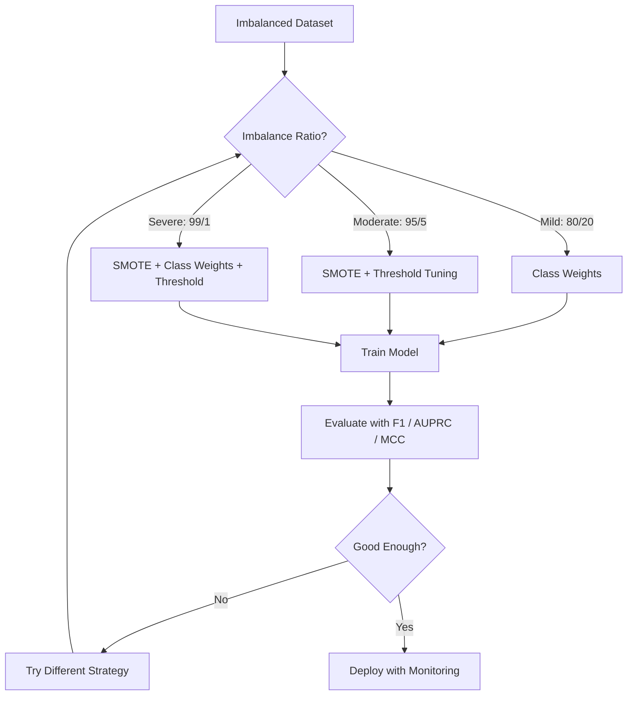
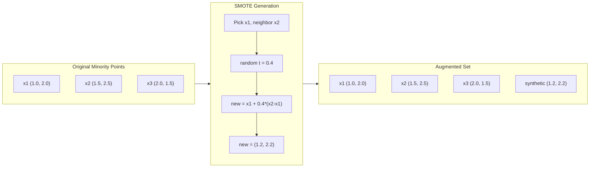
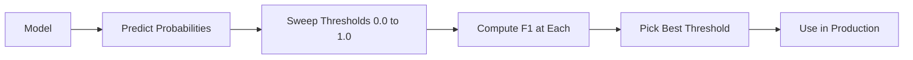
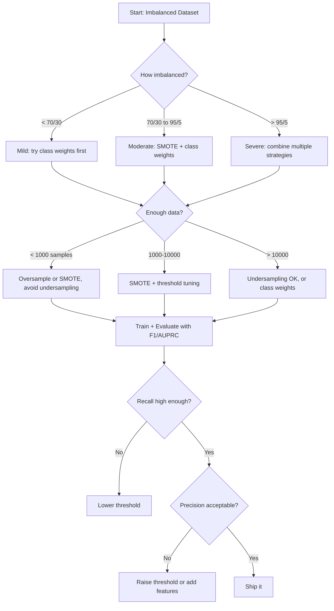

# Handling Imbalanced Data / 处理不平衡数据

> 当 99% 的数据都是 “normal” 时，accuracy 就是谎言。

**Type / 类型：** Build / 构建
**Language / 语言：** Python
**Prerequisites / 前置知识：** Phase 2, Lessons 01-09 (especially evaluation metrics)
**Time / 时间：** 约 90 分钟

## Learning Objectives / 学习目标

- 从零实现 SMOTE，并解释 synthetic oversampling 与 random duplication 的区别
- 使用 F1、AUPRC 和 Matthews Correlation Coefficient 评估 imbalanced classifiers，而不是 accuracy
- 比较 class weighting、threshold tuning 和 resampling strategies，并为给定 imbalance ratio 选择合适方法
- 构建完整 imbalanced data pipeline，组合 SMOTE、class weights 和 threshold optimization

## The Problem / 问题

你构建了一个 fraud detection model。它有 99.9% accuracy。你准备庆祝。然后你发现它对每笔交易都预测 “not fraud”。

这不是 bug。当只有 0.1% 交易是 fraudulent 时，永远猜 majority class 是最理性的做法。模型学到的是：总是猜 majority class 可以最小化整体错误。技术上正确，实际完全没用。

所有重要的真实分类问题都会遇到这种情况。疾病诊断：positive rate 1%。网络入侵：0.01% attacks。制造缺陷：0.5% defective。垃圾邮件过滤：20% spam。流失预测：5% churners。越关键的 minority class，往往越稀有。

Accuracy 失败，是因为它把所有正确预测同等对待。正确标记一笔正常交易和正确抓住一笔 fraud，都只算 accuracy 的一分。但抓住 fraud 才是模型存在的全部理由。我们需要 metrics、techniques 和 training strategies，强迫模型关注稀有但重要的类别。

## The Concept / 概念

### Why Accuracy Fails / 为什么 accuracy 失效

考虑一个 1000 个样本的数据集：990 个 negative，10 个 positive。一个永远预测 negative 的模型：

|  | Predicted Positive / 预测为正 | Predicted Negative / 预测为负 |
|--|---|---|
| Actually Positive / 实际为正 | 0 (TP) | 10 (FN) |
| Actually Negative / 实际为负 | 0 (FP) | 990 (TN) |

Accuracy = (0 + 990) / 1000 = 99.0%

模型抓住了 0 个 fraud、0 个 disease、0 个 defects。但 accuracy 说 99%。这就是为什么 accuracy 对 imbalanced problems 很危险。

### Better Metrics / 更好的指标

**Precision** = TP / (TP + FP)。所有被标为 positive 的样本中，有多少真的 positive？High precision 意味着 false alarms 少。

**Recall** = TP / (TP + FN)。所有真实 positive 中，我们抓住了多少？High recall 意味着 missed positives 少。

**F1 Score** = 2 * precision * recall / (precision + recall)。Harmonic mean。相比 arithmetic mean，它会更严厉惩罚 precision 和 recall 的极端不平衡。

**F-beta Score** = (1 + beta^2) * precision * recall / (beta^2 * precision + recall)。当 beta > 1 时，recall 更重要。当 beta < 1 时，precision 更重要。Fraud detection 中常用 F2（漏掉 fraud 比 false alarm 更糟）。

**AUPRC** (Area Under Precision-Recall Curve)。类似 AUC-ROC，但对 imbalanced data 更有信息量。Random classifier 的 AUPRC 等于 positive class rate（不像 ROC 是 0.5）。这让改善更容易看出来。

**Matthews Correlation Coefficient** = (TP * TN - FP * FN) / sqrt((TP+FP)(TP+FN)(TN+FP)(TN+FN))。范围 -1 到 +1。只有模型在两个 classes 上都表现好时才高。即使类别大小差很多也保持 balanced。

对上面的 “always predict negative” 模型：precision = 0/0（undefined，通常设为 0）、recall = 0/10 = 0、F1 = 0、MCC = 0。这些 metrics 会正确指出模型没有价值。

### The Imbalanced Data Pipeline / 不平衡数据 pipeline



### SMOTE: Synthetic Minority Oversampling Technique / SMOTE：合成少数类过采样

Random oversampling 会复制 existing minority samples。它能工作，但有 overfitting 风险，因为模型反复看到完全相同的点。

SMOTE 会创建新的 synthetic minority samples，这些样本合理但不是拷贝。算法：

1. 对每个 minority sample x，在其他 minority samples 中找到 k nearest neighbors
2. 随机选择一个 neighbor
3. 在 x 与该 neighbor 的线段上创建新样本

公式：`new_sample = x + random(0, 1) * (neighbor - x)`

它在真实 minority points 之间插值，在相同 feature space 区域中创建样本，而不是简单复制已有数据。



### Sampling Strategies Compared / 采样策略比较

**Random Oversampling**：复制 minority samples，使其数量匹配 majority count。
- Pros：简单，不丢信息
- Cons：精确重复会导致 overfitting，增加训练时间

**Random Undersampling**：删除 majority samples，使其数量匹配 minority count。
- Pros：训练快，简单
- Cons：丢掉可能有用的 majority data，variance 更高

**SMOTE**：通过插值创建 synthetic minority samples。
- Pros：生成新数据点，相比 random oversampling 降低 overfitting
- Cons：可能在 decision boundary 附近生成 noisy samples，不考虑 majority class distribution

| Strategy / 策略 | Data Changed / 数据变化 | Risk / 风险 | When to Use / 何时使用 |
|----------|-------------|------|-------------|
| Oversample | Minority duplicated | Overfitting | 小数据集、中等 imbalance |
| Undersample | Majority removed | Information loss | 大数据集、想要更快训练 |
| SMOTE | Synthetic minority added | Boundary noise | 中等 imbalance，且 minority samples 足够做 k-NN |

### Class Weights / 类别权重

不改变数据，而是改变模型如何看待错误。给 minority class 的误分类更高权重。

对于 950 个 negative、50 个 positive 的 binary problem：
- Weight for negative class = n_samples / (2 * n_negative) = 1000 / (2 * 950) = 0.526
- Weight for positive class = n_samples / (2 * n_positive) = 1000 / (2 * 50) = 10.0

Positive class 得到 19 倍权重。错分一个 positive sample 的代价，相当于错分 19 个 negative samples。模型被迫关注 minority class。

在 logistic regression 中，这会修改 loss function：

```
weighted_loss = -sum(w_i * [y_i * log(p_i) + (1-y_i) * log(1-p_i)])
```

其中 w_i 取决于 sample i 的 class。

Class weights 在期望意义上等价于 oversampling，但不创建新数据点。因此更快，也避免 duplicated samples 的 overfitting 风险。

### Threshold Tuning / 阈值调优

多数 classifiers 输出 probability。默认 threshold 是 0.5：如果 P(positive) >= 0.5，就预测 positive。但 0.5 是任意选择。类别不平衡时，最优 threshold 通常低得多。

过程：
1. 训练模型
2. 在 validation set 上得到 predicted probabilities
3. 从 0.0 到 1.0 扫描 thresholds
4. 每个 threshold 计算 F1（或你选择的 metric）
5. 选择最大化 metric 的 threshold



模型可能对一笔 fraudulent transaction 输出 P(fraud) = 0.15。在 threshold 0.5 下，它被判为 not fraud。在 threshold 0.10 下，它会被正确抓住。Probability calibration 不如 ranking 重要，只要 fraud 的 probabilities 高于 non-fraud，就存在一个能分开它们的 threshold。

### Cost-Sensitive Learning / 成本敏感学习

Class weights 的泛化版本。不是统一成本，而是指定具体 misclassification costs：

| | Predict Positive | Predict Negative |
|--|---|---|
| Actually Positive | 0 (correct) | C_FN = 100 |
| Actually Negative | C_FP = 1 | 0 (correct) |

漏掉 fraudulent transaction（FN）比 false alarm（FP）贵 100 倍。模型优化 total cost，而不是 error count。

当你能估计真实世界成本时，这是最有原则的方法。漏诊癌症和导致额外 biopsy 的 false alarm 成本完全不同。把这些成本显式化，会迫使模型做出正确权衡。

### Decision Flowchart / 决策流程图



```figure
class-imbalance
```

## Build It / 动手构建

### Step 1: Generate an imbalanced dataset / 第 1 步：生成 imbalanced dataset

```python
import numpy as np


def make_imbalanced_data(n_majority=950, n_minority=50, seed=42):
    rng = np.random.RandomState(seed)

    X_maj = rng.randn(n_majority, 2) * 1.0 + np.array([0.0, 0.0])
    X_min = rng.randn(n_minority, 2) * 0.8 + np.array([2.5, 2.5])

    X = np.vstack([X_maj, X_min])
    y = np.concatenate([np.zeros(n_majority), np.ones(n_minority)])

    shuffle_idx = rng.permutation(len(y))
    return X[shuffle_idx], y[shuffle_idx]
```

### Step 2: SMOTE from scratch / 第 2 步：从零实现 SMOTE

```python
def euclidean_distance(a, b):
    return np.sqrt(np.sum((a - b) ** 2))


def find_k_neighbors(X, idx, k):
    distances = []
    for i in range(len(X)):
        if i == idx:
            continue
        d = euclidean_distance(X[idx], X[i])
        distances.append((i, d))
    distances.sort(key=lambda x: x[1])
    return [d[0] for d in distances[:k]]


def smote(X_minority, k=5, n_synthetic=100, seed=42):
    rng = np.random.RandomState(seed)
    n_samples = len(X_minority)
    k = min(k, n_samples - 1)
    synthetic = []

    for _ in range(n_synthetic):
        idx = rng.randint(0, n_samples)
        neighbors = find_k_neighbors(X_minority, idx, k)
        neighbor_idx = neighbors[rng.randint(0, len(neighbors))]
        t = rng.random()
        new_point = X_minority[idx] + t * (X_minority[neighbor_idx] - X_minority[idx])
        synthetic.append(new_point)

    return np.array(synthetic)
```

### Step 3: Random oversampling and undersampling / 第 3 步：Random oversampling 和 undersampling

```python
def random_oversample(X, y, seed=42):
    rng = np.random.RandomState(seed)
    classes, counts = np.unique(y, return_counts=True)
    max_count = counts.max()

    X_resampled = list(X)
    y_resampled = list(y)

    for cls, count in zip(classes, counts):
        if count < max_count:
            cls_indices = np.where(y == cls)[0]
            n_needed = max_count - count
            chosen = rng.choice(cls_indices, size=n_needed, replace=True)
            X_resampled.extend(X[chosen])
            y_resampled.extend(y[chosen])

    X_out = np.array(X_resampled)
    y_out = np.array(y_resampled)
    shuffle = rng.permutation(len(y_out))
    return X_out[shuffle], y_out[shuffle]


def random_undersample(X, y, seed=42):
    rng = np.random.RandomState(seed)
    classes, counts = np.unique(y, return_counts=True)
    min_count = counts.min()

    X_resampled = []
    y_resampled = []

    for cls in classes:
        cls_indices = np.where(y == cls)[0]
        chosen = rng.choice(cls_indices, size=min_count, replace=False)
        X_resampled.extend(X[chosen])
        y_resampled.extend(y[chosen])

    X_out = np.array(X_resampled)
    y_out = np.array(y_resampled)
    shuffle = rng.permutation(len(y_out))
    return X_out[shuffle], y_out[shuffle]
```

### Step 4: Logistic regression with class weights / 第 4 步：带 class weights 的 logistic regression

```python
def sigmoid(z):
    return 1.0 / (1.0 + np.exp(-np.clip(z, -500, 500)))


def logistic_regression_weighted(X, y, weights, lr=0.01, epochs=200):
    n_samples, n_features = X.shape
    w = np.zeros(n_features)
    b = 0.0

    for _ in range(epochs):
        z = X @ w + b
        pred = sigmoid(z)
        error = pred - y
        weighted_error = error * weights

        gradient_w = (X.T @ weighted_error) / n_samples
        gradient_b = np.mean(weighted_error)

        w -= lr * gradient_w
        b -= lr * gradient_b

    return w, b


def compute_class_weights(y):
    classes, counts = np.unique(y, return_counts=True)
    n_samples = len(y)
    n_classes = len(classes)
    weight_map = {}
    for cls, count in zip(classes, counts):
        weight_map[cls] = n_samples / (n_classes * count)
    return np.array([weight_map[yi] for yi in y])
```

### Step 5: Threshold tuning / 第 5 步：Threshold tuning

```python
def find_optimal_threshold(y_true, y_probs, metric="f1"):
    best_threshold = 0.5
    best_score = -1.0

    for threshold in np.arange(0.05, 0.96, 0.01):
        y_pred = (y_probs >= threshold).astype(int)
        tp = np.sum((y_pred == 1) & (y_true == 1))
        fp = np.sum((y_pred == 1) & (y_true == 0))
        fn = np.sum((y_pred == 0) & (y_true == 1))

        if metric == "f1":
            precision = tp / (tp + fp) if (tp + fp) > 0 else 0.0
            recall = tp / (tp + fn) if (tp + fn) > 0 else 0.0
            score = 2 * precision * recall / (precision + recall) if (precision + recall) > 0 else 0.0
        elif metric == "recall":
            score = tp / (tp + fn) if (tp + fn) > 0 else 0.0
        elif metric == "precision":
            score = tp / (tp + fp) if (tp + fp) > 0 else 0.0

        if score > best_score:
            best_score = score
            best_threshold = threshold

    return best_threshold, best_score
```

### Step 6: Evaluation functions / 第 6 步：Evaluation functions

```python
def confusion_matrix_values(y_true, y_pred):
    tp = np.sum((y_pred == 1) & (y_true == 1))
    tn = np.sum((y_pred == 0) & (y_true == 0))
    fp = np.sum((y_pred == 1) & (y_true == 0))
    fn = np.sum((y_pred == 0) & (y_true == 1))
    return tp, tn, fp, fn


def compute_metrics(y_true, y_pred):
    tp, tn, fp, fn = confusion_matrix_values(y_true, y_pred)
    accuracy = (tp + tn) / (tp + tn + fp + fn)
    precision = tp / (tp + fp) if (tp + fp) > 0 else 0.0
    recall = tp / (tp + fn) if (tp + fn) > 0 else 0.0
    f1 = 2 * precision * recall / (precision + recall) if (precision + recall) > 0 else 0.0

    denom = np.sqrt(float((tp + fp) * (tp + fn) * (tn + fp) * (tn + fn)))
    mcc = (tp * tn - fp * fn) / denom if denom > 0 else 0.0

    return {
        "accuracy": accuracy,
        "precision": precision,
        "recall": recall,
        "f1": f1,
        "mcc": mcc,
    }
```

### Step 7: Compare all approaches / 第 7 步：比较所有方法

```python
X, y = make_imbalanced_data(950, 50, seed=42)
split = int(0.8 * len(y))
X_train, X_test = X[:split], X[split:]
y_train, y_test = y[:split], y[split:]

# Baseline: no treatment
w_base, b_base = logistic_regression_weighted(
    X_train, y_train, np.ones(len(y_train)), lr=0.1, epochs=300
)
probs_base = sigmoid(X_test @ w_base + b_base)
preds_base = (probs_base >= 0.5).astype(int)

# Oversampled
X_over, y_over = random_oversample(X_train, y_train)
w_over, b_over = logistic_regression_weighted(
    X_over, y_over, np.ones(len(y_over)), lr=0.1, epochs=300
)
preds_over = (sigmoid(X_test @ w_over + b_over) >= 0.5).astype(int)

# SMOTE
minority_mask = y_train == 1
X_minority = X_train[minority_mask]
synthetic = smote(X_minority, k=5, n_synthetic=len(y_train) - 2 * int(minority_mask.sum()))
X_smote = np.vstack([X_train, synthetic])
y_smote = np.concatenate([y_train, np.ones(len(synthetic))])
w_sm, b_sm = logistic_regression_weighted(
    X_smote, y_smote, np.ones(len(y_smote)), lr=0.1, epochs=300
)
preds_smote = (sigmoid(X_test @ w_sm + b_sm) >= 0.5).astype(int)

# Class weights
sample_weights = compute_class_weights(y_train)
w_cw, b_cw = logistic_regression_weighted(
    X_train, y_train, sample_weights, lr=0.1, epochs=300
)
probs_cw = sigmoid(X_test @ w_cw + b_cw)
preds_cw = (probs_cw >= 0.5).astype(int)

# Threshold tuning (tune on held-out validation set, not test set)
probs_val = sigmoid(X_val @ w_cw + b_cw)
best_thresh, best_f1 = find_optimal_threshold(y_val, probs_val, metric="f1")
preds_thresh = (probs_cw >= best_thresh).astype(int)
```

代码文件会把这些步骤放在一个脚本中运行并打印结果。

## Use It / 应用它

用 scikit-learn 和 imbalanced-learn，这些技术都是一行：

```python
from sklearn.linear_model import LogisticRegression
from sklearn.metrics import classification_report, f1_score
from sklearn.model_selection import train_test_split
from imblearn.over_sampling import SMOTE
from imblearn.under_sampling import RandomUnderSampler
from imblearn.pipeline import Pipeline

X_train, X_test, y_train, y_test = train_test_split(X, y, stratify=y)

model_weighted = LogisticRegression(class_weight="balanced")
model_weighted.fit(X_train, y_train)
print(classification_report(y_test, model_weighted.predict(X_test)))

smote = SMOTE(random_state=42)
X_resampled, y_resampled = smote.fit_resample(X_train, y_train)
model_smote = LogisticRegression()
model_smote.fit(X_resampled, y_resampled)
print(classification_report(y_test, model_smote.predict(X_test)))

pipeline = Pipeline([
    ("smote", SMOTE()),
    ("model", LogisticRegression(class_weight="balanced")),
])
pipeline.fit(X_train, y_train)
print(classification_report(y_test, pipeline.predict(X_test)))
```

From-scratch implementations 展示每种技术到底做什么。SMOTE 只是 minority class 上的 k-NN interpolation。Class weights 会乘进 loss。Threshold tuning 只是遍历 cutoffs 的 for-loop。没有魔法。

## Ship It / 交付它

本课会产出：
- `outputs/skill-imbalanced-data.md` -- 一个处理 imbalanced classification problems 的 decision checklist

## Exercises / 练习

1. **Borderline-SMOTE**：修改 SMOTE 实现，只为靠近 decision boundary 的 minority points 生成 synthetic samples（它们的 k-nearest neighbors 中包含 majority class samples）。在 classes 重叠的数据集上与 standard SMOTE 比较。

2. **Cost matrix optimization**：实现 cost-sensitive learning，让 cost matrix 成为参数。创建一个函数，输入 cost matrix，返回最小化 expected cost 的 optimal predictions。用不同 cost ratios（1:10、1:100、1:1000）测试，并绘制 precision-recall tradeoff 如何变化。

3. **Threshold calibration**：实现 Platt scaling（在模型 raw outputs 上拟合 logistic regression，产生 calibrated probabilities）。比较 calibration 前后的 precision-recall curve。展示 calibration 不改变 ranking（AUC 不变），但让 probabilities 更有意义。

4. **Ensemble with balanced bagging**：训练多个模型，每个模型用 balanced bootstrap sample（所有 minority + majority 的随机子集）。平均 predictions。与单个 SMOTE 模型比较。测量 performance 和多次运行间的 variance。

5. **Imbalance ratio experiment**：取一个 balanced dataset，并逐步增加 imbalance ratio（50/50、70/30、90/10、95/5、99/1）。每个 ratio 下分别用和不用 SMOTE 训练。绘制 F1 vs imbalance ratio。SMOTE 从哪个 ratio 开始产生有意义差异？

## Key Terms / 关键术语

| 术语 | 常见说法 | 实际含义 |
|------|----------------|----------------------|
| Class imbalance | “One class has way more samples” | 数据集中类别分布显著倾斜，导致模型偏向 majority class |
| SMOTE | “Synthetic oversampling” | 在已有 minority samples 和其 k-nearest minority neighbors 之间插值，生成新的 minority samples |
| Class weights | “Making errors on rare classes more expensive” | 用 class-specific weights 乘进 loss function，让模型更重视 minority misclassification |
| Threshold tuning | “Moving the decision boundary” | 把 classification probability cutoff 从默认 0.5 改为优化目标 metric 的值 |
| Precision-recall tradeoff | “You cannot have both” | 降低 threshold 会抓住更多 positives（higher recall），也会带来更多 false positives（lower precision），反之亦然 |
| AUPRC | “Area under the PR curve” | 把 precision-recall curve 汇总成单个数字；类别严重不平衡时比 AUC-ROC 更有信息量 |
| Matthews Correlation Coefficient | “The balanced metric” | Predicted labels 与 actual labels 的相关性；只有两个 classes 都表现好时才高 |
| Cost-sensitive learning | “Different mistakes cost different amounts” | 把现实 misclassification costs 纳入 training objective，让模型优化 total cost，而不是 error count |
| Random oversampling | “Duplicate the minority” | 重复 minority class samples 来平衡 class counts；简单但有 overfitting duplicated points 的风险 |

## Further Reading / 延伸阅读

- [SMOTE: Synthetic Minority Over-sampling Technique (Chawla et al., 2002)](https://arxiv.org/abs/1106.1813) -- SMOTE 原始论文，仍是不平衡学习引用最多的工作
- [Learning from Imbalanced Data (He & Garcia, 2009)](https://ieeexplore.ieee.org/document/5128907) -- 覆盖 sampling、cost-sensitive 和 algorithmic approaches 的综述
- [imbalanced-learn documentation](https://imbalanced-learn.org/stable/) -- 提供 SMOTE variants、undersampling strategies 和 pipeline integration 的 Python library
- [The Precision-Recall Plot Is More Informative than the ROC Plot (Saito & Rehmsmeier, 2015)](https://journals.plos.org/plosone/article?id=10.1371/journal.pone.0118432) -- 为什么 imbalanced problems 中 PR curves 比 ROC curves 更合适
