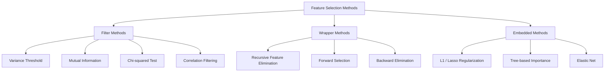
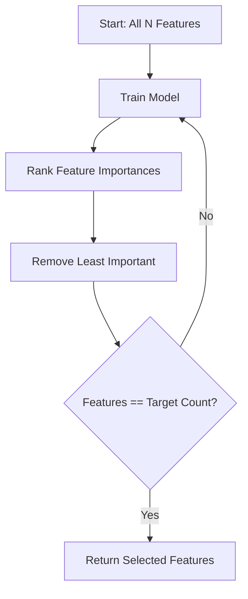
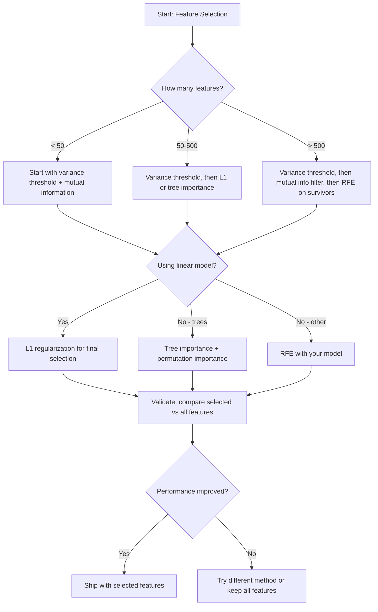

# Feature Selection / 特征选择

> 更多 features 并不更好。正确的 features 才更好。

**Type / 类型：** Build / 构建
**Language / 语言：** Python
**Prerequisites / 前置知识：** Phase 2, Lessons 01-09, 08 (feature engineering)
**Time / 时间：** 约 75 分钟

## Learning Objectives / 学习目标

- 从零实现 filter methods（variance threshold、mutual information、chi-squared）和 wrapper methods（RFE、forward selection）
- 解释为什么 mutual information 能捕捉 correlation 会错过的 nonlinear feature-target relationships
- 比较 L1 regularization（embedded selection）与 RFE（wrapper selection），并评估它们的计算权衡
- 构建组合多种方法的 feature selection pipeline，并展示它在 held-out data 上改善 generalization

## The Problem / 问题

你有 500 个 features。模型训练很慢，持续 overfit，而且没人能解释它学到了什么。你希望加更多 features 改善性能，结果更差。

这就是 curse of dimensionality。随着 features 数量增长，feature space 的体积爆炸。数据点变稀疏。点之间的距离趋于一致。模型需要指数级更多数据才能找到真实模式。噪声 features 会淹没信号 features。Overfitting 变成默认状态。

Feature selection 是解药。剥掉噪声，移除冗余，保留真正携带 target 信息的 features。结果是：训练更快、泛化更好、模型也更可解释。

目标不是使用所有可用信息，而是使用正确的信息。

## The Concept / 概念

### Three Categories of Feature Selection / 三类 feature selection

所有 feature selection 方法都属于三类之一：



**Filter methods** 用统计度量独立给每个 feature 打分。它们不使用模型。很快，但会错过 feature interactions。

**Wrapper methods** 训练模型来评估 feature subsets。它们用模型 performance 作为分数。效果更好，但昂贵，因为要反复重新训练模型。

**Embedded methods** 在模型训练过程中选择 features。L1 regularization 会把 weights 推到 0。Decision trees 会在最有用的 features 上 split。选择发生在 fitting 过程中，而不是单独步骤。

### Variance Threshold / 方差阈值

最简单的 filter。如果一个 feature 在样本之间几乎不变化，它几乎不携带信息。

考虑一个 feature，在 1000 个样本中 999 个都是 0.0。它的 variance 接近 0。任何模型都无法用它区分类别。移除它。

```
variance(x) = mean((x - mean(x))^2)
```

设置阈值（例如 0.01）。丢掉 variance 低于阈值的 features。这个过程完全不看 target variable，就能移除 constant 或 near-constant features。

何时使用：作为其他方法前的 preprocessing step。它几乎零成本地抓住明显无用 features。

限制：一个 feature 可以有高 variance，但仍然是纯噪声。Variance threshold 必要但不充分。

### Mutual Information / 互信息

Mutual information 衡量知道 feature X 的值能减少多少关于 target Y 的不确定性。

```
I(X; Y) = sum_x sum_y p(x, y) * log(p(x, y) / (p(x) * p(y)))
```

如果 X 和 Y 独立，p(x, y) = p(x) * p(y)，log 项为 0，所以 I(X; Y) = 0。X 对 Y 提供的信息越多，mutual information 越高。

相比 correlation 的关键优势：mutual information 能捕捉 nonlinear relationships。一个 feature 可能与 target correlation 为 0，但 mutual information 很高，因为关系是 quadratic 或 periodic。

对 continuous features，先离散化成 bins（histogram-based estimation）。Bins 数量会影响估计，太少会丢信息，太多会增加噪声。常见选择：sqrt(n) bins 或 Sturges' rule（1 + log2(n)）。


### Recursive Feature Elimination (RFE) / 递归特征消除

RFE 是 wrapper method。它用模型自己的 feature importance 反复剪枝：

1. 用所有 features 训练模型
2. 按 importance 排序 features（linear models 用 coefficients，trees 用 impurity reduction）
3. 移除最不重要的 feature(s)
4. 重复直到剩下目标数量的 features



RFE 会考虑 feature interactions，因为模型会同时看到所有 remaining features。移除一个 feature 会改变其他 features 的 importance。这比 filter methods 更彻底。

代价：你要训练模型 N - target 次。500 个 features、目标 10 个，就要 490 次 training runs。对昂贵模型来说很慢。可以每轮移除多个 features（例如 bottom 10%）来加速。

### L1 (Lasso) Regularization / L1（Lasso）正则化

L1 regularization 在 loss function 中加入 weights 绝对值：

```
loss = prediction_error + alpha * sum(|w_i|)
```

Alpha parameter 控制剪枝强度。Alpha 越高，越多 weights 会正好变成 0。

为什么会正好为 0？L1 penalty 在 weight space 中形成 diamond-shaped constraint region。最优解倾向落在 diamond 的角上，而角上一个或多个 weights 为 0。L2 regularization（ridge）形成 circular constraint，weights 会缩小但很少正好为 0。

这就是 embedded feature selection：模型在训练中学会忽略哪些 features。Weight 为 0 的 features 实际上被移除。

优点：单次 training run，能处理 correlated features（选一个并把其他归零），多数 linear model implementations 都内置。

限制：只适用于 linear models，无法捕捉 nonlinear feature importance。

### Tree-Based Feature Importance / 基于树的特征重要性

Decision trees 及其 ensembles（random forests、gradient boosting）天然能排序 features。每次 split 都降低 impurity（classification 用 Gini 或 entropy，regression 用 variance）。产生更大 impurity reduction 的 features 更重要。

对含 T 棵树的 random forest：

```
importance(feature_j) = (1/T) * sum over all trees of
    sum over all nodes splitting on feature_j of
        (n_samples * impurity_decrease)
```

这会给每个 feature 一个 normalized importance score。它能自动处理 nonlinear relationships 和 feature interactions。

注意：tree-based importance 会偏向 many unique values（high cardinality）的 features。一个随机 ID column 可能看起来重要，因为它能完美 split 每个样本。用 permutation importance 做 sanity check。

### Permutation Importance / 置换重要性

一种 model-agnostic 方法：

1. 训练模型，并记录 validation data 上的 baseline performance
2. 对每个 feature：随机打乱它的值，测量 performance 下降多少
3. 下降越大，feature 越重要

如果打乱某个 feature 不伤害 performance，模型不依赖它。如果 performance 崩掉，这个 feature 很关键。

Permutation importance 避免了 tree-based importance 的 cardinality bias。但它很慢：每个 feature 都要完整评估一次，并且通常要重复多次以获得稳定结果。

### Comparison Table / 对比表

| Method / 方法 | Type / 类型 | Speed / 速度 | Nonlinear / 非线性 | Feature Interactions / 特征交互 |
|--------|------|-------|-----------|---------------------|
| Variance threshold | Filter | Very fast | No | No |
| Mutual information | Filter | Fast | Yes | No |
| Correlation filter | Filter | Fast | No | No |
| RFE | Wrapper | Slow | Depends on model | Yes |
| L1 / Lasso | Embedded | Fast | No (linear) | No |
| Tree importance | Embedded | Medium | Yes | Yes |
| Permutation importance | Model-agnostic | Slow | Yes | Yes |

### Decision Flowchart / 决策流程图



## Build It / 动手构建

### Step 1: Generate synthetic data with known feature structure / 第 1 步：生成已知 feature structure 的合成数据

```python
import numpy as np


def make_feature_selection_data(n_samples=500, seed=42):
    rng = np.random.RandomState(seed)

    x1 = rng.randn(n_samples)
    x2 = rng.randn(n_samples)
    x3 = rng.randn(n_samples)
    x4 = x1 + 0.1 * rng.randn(n_samples)
    x5 = x2 + 0.1 * rng.randn(n_samples)

    informative = np.column_stack([x1, x2, x3, x4, x5])

    correlated = np.column_stack([
        x1 * 0.9 + 0.1 * rng.randn(n_samples),
        x2 * 0.8 + 0.2 * rng.randn(n_samples),
        x3 * 0.7 + 0.3 * rng.randn(n_samples),
        x1 * 0.5 + x2 * 0.5 + 0.1 * rng.randn(n_samples),
        x2 * 0.6 + x3 * 0.4 + 0.1 * rng.randn(n_samples),
    ])

    noise = rng.randn(n_samples, 10) * 0.5

    X = np.hstack([informative, correlated, noise])
    y = (2 * x1 - 1.5 * x2 + x3 + 0.5 * rng.randn(n_samples) > 0).astype(int)

    feature_names = (
        [f"info_{i}" for i in range(5)]
        + [f"corr_{i}" for i in range(5)]
        + [f"noise_{i}" for i in range(10)]
    )

    return X, y, feature_names
```

我们知道 ground truth：features 0-4 是 informative（且 3、4 分别是 0、1 的 correlated copies），features 5-9 与 informative features 相关，features 10-19 是纯噪声。好的 selection method 应该把 0-4 排在最前，把 10-19 排在最后。

### Step 2: Variance threshold / 第 2 步：Variance threshold

```python
def variance_threshold(X, threshold=0.01):
    variances = np.var(X, axis=0)
    mask = variances > threshold
    return mask, variances
```

### Step 3: Mutual information (discrete) / 第 3 步：Mutual information（离散版）

```python
def discretize(x, n_bins=10):
    min_val, max_val = x.min(), x.max()
    if max_val == min_val:
        return np.zeros_like(x, dtype=int)
    bin_edges = np.linspace(min_val, max_val, n_bins + 1)
    binned = np.digitize(x, bin_edges[1:-1])
    return binned


def mutual_information(X, y, n_bins=10):
    n_samples, n_features = X.shape
    mi_scores = np.zeros(n_features)

    y_vals, y_counts = np.unique(y, return_counts=True)
    p_y = y_counts / n_samples

    for f in range(n_features):
        x_binned = discretize(X[:, f], n_bins)
        x_vals, x_counts = np.unique(x_binned, return_counts=True)
        p_x = dict(zip(x_vals, x_counts / n_samples))

        mi = 0.0
        for xv in x_vals:
            for yi, yv in enumerate(y_vals):
                joint_mask = (x_binned == xv) & (y == yv)
                p_xy = np.sum(joint_mask) / n_samples
                if p_xy > 0:
                    mi += p_xy * np.log(p_xy / (p_x[xv] * p_y[yi]))
        mi_scores[f] = mi

    return mi_scores
```

### Step 4: Recursive Feature Elimination / 第 4 步：Recursive Feature Elimination

```python
def simple_logistic_importance(X, y, lr=0.1, epochs=100):
    n_samples, n_features = X.shape
    w = np.zeros(n_features)
    b = 0.0

    for _ in range(epochs):
        z = X @ w + b
        pred = 1.0 / (1.0 + np.exp(-np.clip(z, -500, 500)))
        error = pred - y
        w -= lr * (X.T @ error) / n_samples
        b -= lr * np.mean(error)

    return w, b


def rfe(X, y, n_features_to_select=5, lr=0.1, epochs=100):
    n_total = X.shape[1]
    remaining = list(range(n_total))
    rankings = np.ones(n_total, dtype=int)
    rank = n_total

    while len(remaining) > n_features_to_select:
        X_subset = X[:, remaining]
        w, _ = simple_logistic_importance(X_subset, y, lr, epochs)
        importances = np.abs(w)

        least_idx = np.argmin(importances)
        original_idx = remaining[least_idx]
        rankings[original_idx] = rank
        rank -= 1
        remaining.pop(least_idx)

    for idx in remaining:
        rankings[idx] = 1

    selected_mask = rankings == 1
    return selected_mask, rankings
```

### Step 5: L1 feature selection / 第 5 步：L1 feature selection

```python
def soft_threshold(w, alpha):
    return np.sign(w) * np.maximum(np.abs(w) - alpha, 0)


def l1_feature_selection(X, y, alpha=0.1, lr=0.01, epochs=500):
    n_samples, n_features = X.shape
    w = np.zeros(n_features)
    b = 0.0

    for _ in range(epochs):
        z = X @ w + b
        pred = 1.0 / (1.0 + np.exp(-np.clip(z, -500, 500)))
        error = pred - y

        gradient_w = (X.T @ error) / n_samples
        gradient_b = np.mean(error)

        w -= lr * gradient_w
        w = soft_threshold(w, lr * alpha)
        b -= lr * gradient_b

    selected_mask = np.abs(w) > 1e-6
    return selected_mask, w
```

### Step 6: Tree-based importance (simple decision tree) / 第 6 步：Tree-based importance（简单 decision tree）

```python
def gini_impurity(y):
    if len(y) == 0:
        return 0.0
    classes, counts = np.unique(y, return_counts=True)
    probs = counts / len(y)
    return 1.0 - np.sum(probs ** 2)


def best_split(X, y, feature_idx):
    values = np.unique(X[:, feature_idx])
    if len(values) <= 1:
        return None, -1.0

    best_threshold = None
    best_gain = -1.0
    parent_gini = gini_impurity(y)
    n = len(y)

    for i in range(len(values) - 1):
        threshold = (values[i] + values[i + 1]) / 2.0
        left_mask = X[:, feature_idx] <= threshold
        right_mask = ~left_mask

        n_left = np.sum(left_mask)
        n_right = np.sum(right_mask)

        if n_left == 0 or n_right == 0:
            continue

        gain = parent_gini - (n_left / n) * gini_impurity(y[left_mask]) - (n_right / n) * gini_impurity(y[right_mask])

        if gain > best_gain:
            best_gain = gain
            best_threshold = threshold

    return best_threshold, best_gain


def tree_importance(X, y, n_trees=50, max_depth=5, seed=42):
    rng = np.random.RandomState(seed)
    n_samples, n_features = X.shape
    importances = np.zeros(n_features)

    for _ in range(n_trees):
        sample_idx = rng.choice(n_samples, size=n_samples, replace=True)
        feature_subset = rng.choice(n_features, size=max(1, int(np.sqrt(n_features))), replace=False)

        X_boot = X[sample_idx]
        y_boot = y[sample_idx]

        tree_imp = _build_tree_importance(X_boot, y_boot, feature_subset, max_depth)
        importances += tree_imp

    total = importances.sum()
    if total > 0:
        importances /= total

    return importances


def _build_tree_importance(X, y, feature_subset, max_depth, depth=0):
    n_features = X.shape[1]
    importances = np.zeros(n_features)

    if depth >= max_depth or len(np.unique(y)) <= 1 or len(y) < 4:
        return importances

    best_feature = None
    best_threshold = None
    best_gain = -1.0

    for f in feature_subset:
        threshold, gain = best_split(X, y, f)
        if gain > best_gain:
            best_gain = gain
            best_feature = f
            best_threshold = threshold

    if best_feature is None or best_gain <= 0:
        return importances

    importances[best_feature] += best_gain * len(y)

    left_mask = X[:, best_feature] <= best_threshold
    right_mask = ~left_mask

    importances += _build_tree_importance(X[left_mask], y[left_mask], feature_subset, max_depth, depth + 1)
    importances += _build_tree_importance(X[right_mask], y[right_mask], feature_subset, max_depth, depth + 1)

    return importances
```

### Step 7: Run all methods and compare / 第 7 步：运行所有方法并比较

代码文件会在同一 synthetic dataset 上运行五种方法，并打印 comparison table，展示每种方法选择了哪些 features。

## Use It / 应用它

在 scikit-learn 中，feature selection 可以内置进 pipeline：

```python
from sklearn.feature_selection import (
    VarianceThreshold,
    mutual_info_classif,
    RFE,
    SelectFromModel,
)
from sklearn.linear_model import Lasso, LogisticRegression
from sklearn.ensemble import RandomForestClassifier

vt = VarianceThreshold(threshold=0.01)
X_filtered = vt.fit_transform(X)

mi_scores = mutual_info_classif(X, y)
top_k = np.argsort(mi_scores)[-10:]

rfe_selector = RFE(LogisticRegression(), n_features_to_select=10)
rfe_selector.fit(X, y)
X_rfe = rfe_selector.transform(X)

lasso_selector = SelectFromModel(Lasso(alpha=0.01))
lasso_selector.fit(X, y)
X_lasso = lasso_selector.transform(X)

rf = RandomForestClassifier(n_estimators=100)
rf.fit(X, y)
importances = rf.feature_importances_
```

From-scratch implementations 展示每个方法内部到底发生了什么。Variance threshold 只是计算 `var(X, axis=0)` 并应用 mask。Mutual information 是在 contingency table 中统计 joint 和 marginal frequencies。RFE 是训练、排序、剪枝的循环。L1 是带 soft-thresholding step 的 gradient descent。Tree importance 累积 split 的 impurity reductions。没有魔法，只有统计和循环。

sklearn 版本增加了 robustness（例如 mutual_info_classif 使用 k-NN density estimation 而不是 binning）、速度（C implementations）和 pipeline integration。

## Ship It / 交付它

本课会产出：
- `outputs/skill-feature-selector.md` -- 一个选择合适 feature selection method 的 quick reference decision tree

## Exercises / 练习

1. **Forward selection**：实现 RFE 的反方向。先从 0 个 features 开始，每一步加入最能提升 model performance 的 feature。当继续添加 features 不再有帮助时停止。与 RFE 结果比较。哪个更快？哪个结果更好？

2. **Stability selection**：运行 L1 feature selection 50 次，每次在随机 80% 子样本上运行，并轻微改变 alpha values。统计每个 feature 被选择的频率。被选中超过 80% 的 features 是 “stable”。与单次 L1 selection 比较。哪个更可靠？

3. **Multicollinearity detection**：计算所有 features 的 correlation matrix。实现一个函数，给定 correlation threshold（例如 0.9），从每对高度相关 features 中移除一个（保留与 target mutual information 更高的那个）。在 synthetic dataset 上测试，并验证它移除了 redundant correlated features。

4. **Feature selection pipeline**：把 variance threshold、mutual information filter 和 RFE 串成一个 pipeline。先移除 near-zero-variance features，再按 mutual information 保留 top 50%，最后在 survivors 上运行 RFE。与直接在所有 features 上运行 RFE 比较。Pipeline 是否更快？Accuracy 是否相当？

5. **Permutation importance from scratch**：实现 permutation importance。对每个 feature，打乱其值 10 次，测量 F1 score 的平均下降。与 tree-based importance 排名比较。找出二者不一致的情况并解释原因（提示：correlated features）。

## Key Terms / 关键术语

| 术语 | 常见说法 | 实际含义 |
|------|----------------|----------------------|
| Filter method | “Score features independently” | 不训练模型、用统计度量独立评价每个 feature 的 selection 方法 |
| Wrapper method | “Use the model to pick features” | 通过训练模型并使用其 performance 作为 selection criterion 来评估 feature subsets |
| Embedded method | “The model selects features during training” | Feature selection 作为 model fitting 的一部分发生，例如 L1 regularization 把 weights 推到 0 |
| Mutual information | “How much one variable tells you about another” | 衡量知道 X 后关于 Y 的不确定性减少多少，能捕捉 linear 和 nonlinear dependencies |
| Recursive Feature Elimination | “Train, rank, prune, repeat” | 迭代 wrapper method：训练模型、移除最不重要 feature(s)，重复直到达到目标数量 |
| L1 / Lasso regularization | “Penalty that kills features” | 在 loss function 中加入 absolute weight values 之和，使不重要 feature weights 正好变为 0 |
| Variance threshold | “Remove constant features” | 丢弃 across samples variance 低于阈值的 features，过滤不携带信息的 features |
| Feature importance | “Which features matter most” | 表示每个 feature 对 model predictions 贡献多少的分数，可由 split gains（trees）或 coefficient magnitudes（linear）计算 |
| Permutation importance | “Shuffle and measure the damage” | 通过随机打乱每个 feature 的值并测量 performance 下降来评估 feature importance |
| Curse of dimensionality | “Too many features, not enough data” | Features 增加会让 feature space 体积指数增长，使数据稀疏、距离失去意义 |

## Further Reading / 延伸阅读

- [An Introduction to Variable and Feature Selection (Guyon & Elisseeff, 2003)](https://jmlr.org/papers/v3/guyon03a.html) -- feature selection methods 的奠基综述，至今仍被广泛引用
- [scikit-learn Feature Selection Guide](https://scikit-learn.org/stable/modules/feature_selection.html) -- filter、wrapper 和 embedded methods 的实践参考与代码示例
- [Stability Selection (Meinshausen & Buhlmann, 2010)](https://arxiv.org/abs/0809.2932) -- 结合 subsampling 与 feature selection，得到稳定可复现结果
- [Beware Default Random Forest Importances (Strobl et al., 2007)](https://bmcbioinformatics.biomedcentral.com/articles/10.1186/1471-2105-8-25) -- 展示 tree-based importance 的 cardinality bias，并提出 conditional importance 替代
