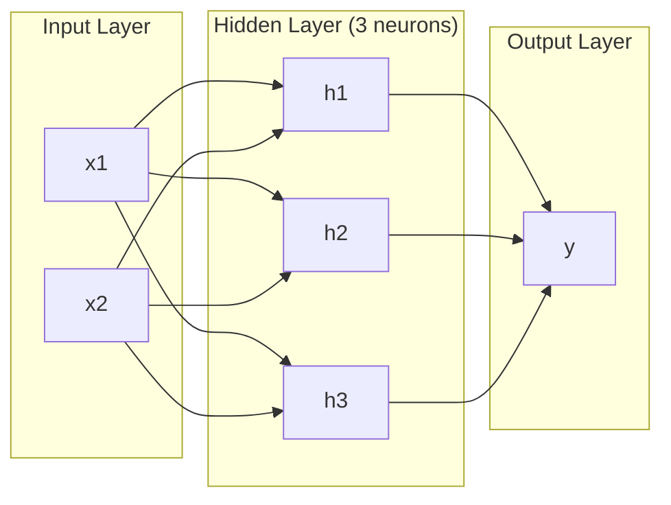
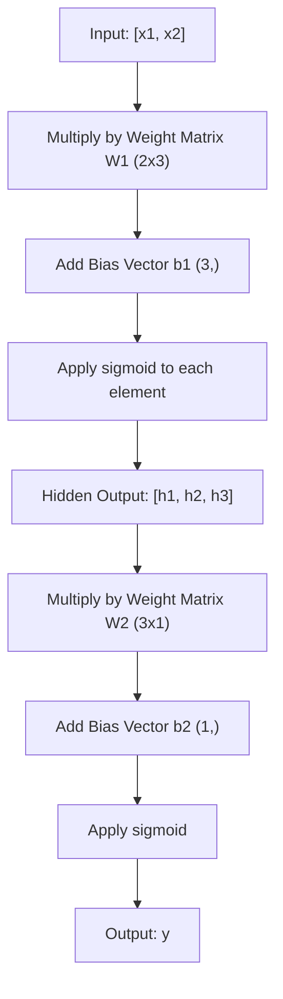
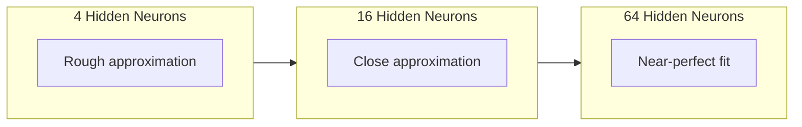

# Multi-Layer Networks and Forward Pass / 多层网络与前向传播

> 一个神经元只能画一条线。把它们堆叠起来，你就能画出任何形状。

**Type / 类型：** Build / 构建
**Languages / 语言：** Python
**Prerequisites / 前置知识：** Phase 01 (Math Foundations), Lesson 03.01 (The Perceptron)
**Time / 时间：** 约 90 分钟

## Learning Objectives / 学习目标

- 从零构建带 Layer 和 Network classes 的 multi-layer network，并完成一次完整 forward pass
- 跟踪 network 每一层的 matrix dimensions，并识别 shape mismatches
- 解释堆叠 nonlinear activations 如何让 network 学习 curved decision boundaries
- 使用 2-2-1 architecture 和手动调好的 sigmoid weights 解决 XOR 问题

## The Problem / 问题

单个 neuron 只是一个画线器。仅此而已。它只能在数据中画一条直线。但 AI 中所有真实问题，比如 image recognition、language understanding、playing Go，都需要曲线。把 neurons 堆叠成 layers，才会得到曲线。

1969 年，Minsky 和 Papert 证明了这个限制是致命的：single-layer network 无法学习 XOR。不是“学起来很困难”，而是数学上不可能。XOR truth table 让 [0,1] 和 [1,0] 在一侧，[0,0] 和 [1,1] 在另一侧。没有任何单条直线能分开它们。

这让 neural network 研究经费沉寂了十多年。回头看，修复方式很明显：不要只用一层。把 neurons 堆叠成 layers。让第一层把 input space 切分成新的 features，再让第二层把这些 features 组合成单条线做不出的决策。

这个堆叠结构就是 multi-layer network。它是今天所有生产级 deep learning model 的基础。Forward pass，也就是数据从 input 流经 hidden layers 到 output 的过程，是你需要先构建的第一件事；没有它，后面的训练都无从谈起。

## The Concept / 概念

### Layers: Input, Hidden, Output / 层：输入、隐藏、输出

Multi-layer network 有三类 layers：

**Input layer** -- 严格说它并不真正计算。它承载 raw data。两个 features 意味着两个 input nodes。这里不发生计算。

**Hidden layers** -- 真正的工作发生在这里。每个 neuron 接收上一层的每个 output，应用 weights 和 bias，再把结果送入 activation function。“Hidden” 是因为你在 training data 里不会直接看到这些值。

**Output layer** -- 最终答案。Binary classification 通常用一个 sigmoid neuron。Multi-class 则通常每个 class 一个 neuron。



这是一个 2-3-1 network。两个 inputs，三个 hidden neurons，一个 output。每条连接都带一个 weight。每个 neuron（input 除外）都带一个 bias。

每一层都会产生一个由数字组成的 vector，叫作 hidden state。对于 text，hidden states 会提升维度，比如把一个 word 编码成 768 个数字来捕捉 semantic meaning。对于 images，它们会降低维度，把数百万 pixels 压缩成可处理的 representation。Hidden state 就是学习发生的地方。

### Neurons and Activations / 神经元与激活

每个 neuron 做三件事：

1. 把每个 input 乘以对应的 weight
2. 求和并加上 bias
3. 把结果送进 activation function

这里先使用 sigmoid 作为 activation：

```
sigmoid(z) = 1 / (1 + e^(-z))
```

Sigmoid 会把任意数字压到 (0, 1) 区间。很大的正数会推向 1，很大的负数会推向 0，0 会映射到 0.5。这条平滑曲线让学习成为可能：不同于 perceptron 的硬 step，sigmoid 处处都有 gradient。

### Forward Pass: How Data Flows / 前向传播：数据如何流动

Forward pass 会把 input data 一层层推过 network，直到到达 output。Forward pass 期间不会发生学习。它只是纯计算：multiply、add、activate，然后重复。



每一层都会按顺序执行三个操作：

```
z = W * input + b       (linear transformation)
a = sigmoid(z)           (activation)
```

一层的 output 会变成下一层的 input。这就是完整的 forward pass。

### Matrix Dimensions / 矩阵维度

跟踪 dimensions 是 deep learning 中最重要的调试技能。下面是 2-3-1 network：

| Step / 步骤 | Operation / 操作 | Dimensions / 维度 | Result Shape / 结果形状 |
|------|-----------|------------|-------------|
| Input | x | -- | (2,) |
| Hidden linear | W1 * x + b1 | W1: (3, 2), b1: (3,) | (3,) |
| Hidden activation | sigmoid(z1) | -- | (3,) |
| Output linear | W2 * h + b2 | W2: (1, 3), b2: (1,) | (1,) |
| Output activation | sigmoid(z2) | -- | (1,) |

规则是：第 k 层的 weight matrix W 形状为 (neurons_in_layer_k, neurons_in_layer_k_minus_1)。Rows 对应当前层，columns 对应上一层。如果 shapes 对不上，你就有 bug。

### Universal Approximation Theorem / 通用近似定理

1989 年，George Cybenko 证明了一件重要的事：只要 hidden layer 中有足够多 neurons，带单个 hidden layer 的 neural network 就能以任意期望精度近似任意 continuous function。

这并不意味着一个 hidden layer 总是最好。它只说明这种 architecture 在理论上具备表达能力。实践中，更深的 networks（更多 layers、每层更少 neurons）通常能用远少于 shallow-wide networks 的总 parameters 学到同样的 functions。这就是 deep learning 有效的原因。

直觉是：hidden layer 中的每个 neuron 学到一个“凸起”或 feature。只要有足够多凸起，并把它们放在合适的位置，就可以近似任意平滑曲线。Neurons 越多，凸起越多，近似越好。



### Composability / 可组合性

Neural networks 是可组合的。你可以堆叠它们、串联它们，也可以并行运行它们。Whisper model 使用 encoder network 处理 audio，再用独立的 decoder network 生成 text。现代 LLMs 是 decoder-only。BERT 是 encoder-only。T5 是 encoder-decoder。Architecture choice 决定了 model 能做什么。

```figure
mlp-forward
```

## Build It / 动手构建

Pure Python。不要用 numpy。每个 matrix operation 都从零手写。

### Step 1: Sigmoid Activation / 第 1 步：Sigmoid activation

```python
import math

def sigmoid(x):
    x = max(-500.0, min(500.0, x))
    return 1.0 / (1.0 + math.exp(-x))
```

把输入 clamp 到 [-500, 500] 可以防止 overflow。`math.exp(500)` 很大，但仍然有限。`math.exp(1000)` 会是 infinity。

### Step 2: Layer Class / 第 2 步：Layer class

Deep learning 中最重要的操作是 matrix multiplication。每一层、每个 attention head、每次 forward pass，本质上都是 matmuls。Linear layer 接收一个 input vector，把它乘以 weight matrix，再加上 bias vector：y = Wx + b。这个单一方程占据了 neural network 中 90% 的计算。

Layer 持有一个 weight matrix 和一个 bias vector。它的 forward method 接收 input vector，并返回 activation 后的 output。

```python
class Layer:
    def __init__(self, n_inputs, n_neurons, weights=None, biases=None):
        if weights is not None:
            self.weights = weights
        else:
            import random
            self.weights = [
                [random.uniform(-1, 1) for _ in range(n_inputs)]
                for _ in range(n_neurons)
            ]
        if biases is not None:
            self.biases = biases
        else:
            self.biases = [0.0] * n_neurons

    def forward(self, inputs):
        self.last_input = inputs
        self.last_output = []
        for neuron_idx in range(len(self.weights)):
            z = sum(
                w * x for w, x in zip(self.weights[neuron_idx], inputs)
            )
            z += self.biases[neuron_idx]
            self.last_output.append(sigmoid(z))
        return self.last_output
```

Weight matrix 的形状是 (n_neurons, n_inputs)。每一行都是一个 neuron 面向所有 inputs 的 weights。Forward method 会遍历 neurons，计算 weighted sum plus bias，应用 sigmoid，并收集结果。

### Step 3: Network Class / 第 3 步：Network class

Network 是一组 layers。Forward pass 会把它们串起来：第 k 层的 output 会送入第 k+1 层。

```python
class Network:
    def __init__(self, layers):
        self.layers = layers

    def forward(self, inputs):
        current = inputs
        for layer in self.layers:
            current = layer.forward(current)
        return current
```

这就是完整的 forward pass。四行逻辑。Data 进入，流过每一层，再从另一侧出来。

### Step 4: XOR with Hand-Tuned Weights / 第 4 步：用手动调好的 weights 解决 XOR

Lesson 01 中，我们通过组合 OR、NAND 和 AND perceptrons 解决了 XOR。现在用我们的 Layer 和 Network classes 做同一件事。2-2-1 architecture：两个 inputs，两个 hidden neurons，一个 output。

```python
hidden = Layer(
    n_inputs=2,
    n_neurons=2,
    weights=[[20.0, 20.0], [-20.0, -20.0]],
    biases=[-10.0, 30.0],
)

output = Layer(
    n_inputs=2,
    n_neurons=1,
    weights=[[20.0, 20.0]],
    biases=[-30.0],
)

xor_net = Network([hidden, output])

xor_data = [
    ([0, 0], 0),
    ([0, 1], 1),
    ([1, 0], 1),
    ([1, 1], 0),
]

for inputs, expected in xor_data:
    result = xor_net.forward(inputs)
    predicted = 1 if result[0] >= 0.5 else 0
    print(f"  {inputs} -> {result[0]:.6f} (rounded: {predicted}, expected: {expected})")
```

较大的 weights（20、-20）会让 sigmoid 表现得像 step function。第一个 hidden neuron 近似 OR，第二个近似 NAND。Output neuron 把它们组合成 AND，也就是 XOR。

### Step 5: Circle Classification / 第 5 步：圆形分类

一个更难的问题：把 2D points 分类为在以原点为中心、半径 0.5 的圆内或圆外。这需要 curved decision boundary，单个 perceptron 不可能做到。

```python
import random
import math

random.seed(42)

data = []
for _ in range(200):
    x = random.uniform(-1, 1)
    y = random.uniform(-1, 1)
    label = 1 if (x * x + y * y) < 0.25 else 0
    data.append(([x, y], label))

circle_net = Network([
    Layer(n_inputs=2, n_neurons=8),
    Layer(n_inputs=8, n_neurons=1),
])
```

使用 random weights 时，network 分类效果不会好。但 forward pass 仍然能运行。这正是重点：forward pass 只是计算。学习正确 weights 是 backpropagation 的工作，会在 Lesson 03 出现。

```python
correct = 0
for inputs, expected in data:
    result = circle_net.forward(inputs)
    predicted = 1 if result[0] >= 0.5 else 0
    if predicted == expected:
        correct += 1

print(f"Accuracy with random weights: {correct}/{len(data)} ({100*correct/len(data):.1f}%)")
```

Random weights 会得到很差的 accuracy，通常甚至不如总是猜多数类。训练之后（Lesson 03），这个相同的 architecture 只用 8 个 hidden neurons，就能画出区分圆内和圆外的 curved boundary。

## Use It / 应用它

PyTorch 用四行就能完成上面的所有内容：

```python
import torch
import torch.nn as nn

model = nn.Sequential(
    nn.Linear(2, 8),
    nn.Sigmoid(),
    nn.Linear(8, 1),
    nn.Sigmoid(),
)

x = torch.tensor([[0.0, 0.0], [0.0, 1.0], [1.0, 0.0], [1.0, 1.0]])
output = model(x)
print(output)
```

`nn.Linear(2, 8)` 就是你的 Layer class：shape 为 (8, 2) 的 weight matrix，以及 shape 为 (8,) 的 bias vector。`nn.Sigmoid()` 就是逐元素应用的 sigmoid function。`nn.Sequential` 就是你的 Network class：按顺序串起 layers。

差异在速度和规模。PyTorch 可以在 GPUs 上运行，处理包含数百万 samples 的 batches，并自动为 backpropagation 计算 gradients。但 forward pass 逻辑与你刚从零构建的版本完全一致。

## Ship It / 交付它

本课会产出一个用于设计 network architectures 的可复用 prompt：

- `outputs/prompt-network-architect.md`

当你需要决定某个问题应该用多少 layers、每层多少 neurons、以及使用哪些 activation functions 时，可以使用它。

## Exercises / 练习

1. 构建一个 2-4-2-1 network（两个 hidden layers），并在 XOR data 上用 random weights 运行 forward pass。打印中间 hidden layer outputs，观察 representation 在每一层如何变化。

2. 把 circle classifier 的 hidden layer size 从 8 改成 2，再改成 32。每次都用 random weights 运行 forward pass。Hidden neurons 的数量会改变 output range 或 distribution 吗？为什么？

3. 在 Network class 上实现一个 `count_parameters` method，返回 trainable weights 和 biases 的总数。在 784-256-128-10 network（经典 MNIST architecture）上测试它。它有多少 parameters？

4. 为一个 3-4-4-2 network 构建 forward pass。输入 RGB color values（归一化到 0-1），观察两个 outputs。这是一个二分类 color classifier 的 architecture。

5. 把 sigmoid 替换成一个 “leaky step” function：如果 z < 0，返回 0.01 * z，否则返回 1.0。用第 4 步同一组 hand-tuned weights 在 XOR 上运行 forward pass。它还有效吗？为什么 smooth sigmoid 比 hard cutoffs 更常用？

## Key Terms / 关键术语

| 术语 | 常见说法 | 实际含义 |
|------|----------------|----------------------|
| Forward pass | “运行模型” | 把 input 推过每一层：乘以 weights、加 bias、activation，最终产生 output |
| Hidden layer | “中间那部分” | 位于 input 和 output 之间、其数值不会直接出现在 data 中的任何 layer |
| Multi-layer network | “深度神经网络” | 顺序堆叠的 neuron layers，每一层的 output 会作为下一层的 input |
| Activation function | “非线性” | 在线性变换之后应用的函数，它把曲线引入 decision boundary |
| Sigmoid | “S 型曲线” | sigma(z) = 1/(1+e^(-z))，把任意实数压到 (0,1)，平滑且处处可微 |
| Weight matrix | “参数” | 形状为 (current_layer_neurons, previous_layer_neurons) 的 matrix W，包含可学习的连接强度 |
| Bias vector | “偏移量” | Matrix multiply 之后加上的 vector，让 neurons 即使在所有 inputs 为零时也能激活 |
| Universal approximation | “神经网络什么都能学” | 带足够多 neurons 的单个 hidden layer 可以近似任意 continuous function，但“足够多”可能意味着数十亿 |
| Linear transformation | “矩阵乘法那一步” | z = W * x + b，也就是 activation 之前的计算，它把 inputs 映射到一个新空间 |
| Decision boundary | “分类器切换的位置” | Input space 中 network output 跨过 classification threshold 的那张曲面 |

## Further Reading / 延伸阅读

- Michael Nielsen, "Neural Networks and Deep Learning", Chapter 1-2 (http://neuralnetworksanddeeplearning.com/) -- 对 forward passes 和 network structure 最清楚的免费解释之一，包含交互式可视化
- Cybenko, "Approximation by Superpositions of a Sigmoidal Function" (1989) -- universal approximation theorem 的原始论文，意外地好读
- 3Blue1Brown, "But what is a neural network?" (https://www.youtube.com/watch?v=aircAruvnKk) -- 20 分钟的可视化讲解，帮助你建立 layers、weights 和 forward passes 的正确心智模型
- Goodfellow, Bengio, Courville, "Deep Learning", Chapter 6 (https://www.deeplearningbook.org/) -- multi-layer networks 的标准参考，在线免费
