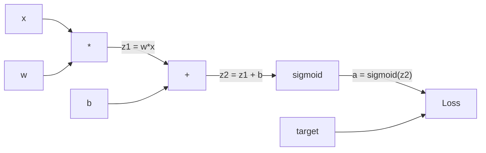
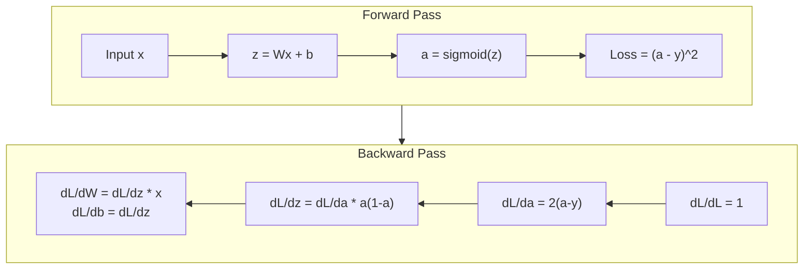
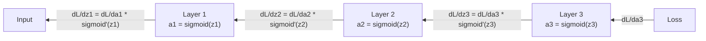

# Backpropagation from Scratch / 从零实现反向传播

> Backpropagation 是让学习成为可能的算法。没有它，神经网络只是昂贵的随机数生成器。

**Type / 类型：** Build / 构建
**Languages / 语言：** Python
**Prerequisites / 前置知识：** Lesson 03.02 (Multi-Layer Networks)
**Time / 时间：** 约 120 分钟

## Learning Objectives / 学习目标

- 实现一个基于 Value 的 autograd engine，能够构建 computational graph，并通过 topological sort 计算 gradients
- 使用 chain rule 推导 addition、multiplication 和 sigmoid 的 backward pass
- 只用从零实现的 backpropagation engine，在 XOR 和 circle classification 上训练 multi-layer network
- 识别 deep sigmoid networks 中的 vanishing gradient problem，并解释为什么 gradients 会指数级缩小

## The Problem / 问题

你的 network 有一个 hidden layer，包含 768 个 inputs 和 3072 个 outputs。这意味着 2,359,296 个 weights。它做错了一次预测。到底哪些 weights 导致了 error？如果逐个测试每个 weight，就需要 230 多万次 forward passes。Backpropagation 能在一次 backward pass 中计算全部 230 多万个 gradients。这不是优化技巧，而是“可训练”和“不可能训练”的分界线。

朴素做法是：拿一个 weight，轻微扰动它，再跑一次 forward pass，观察 loss 是上升还是下降。这样能得到这个 weight 的 gradient。然后对 network 里的每个 weight 都这么做。再乘以数千个 training steps 和数百万个 data points。你需要地质级时间才能训练出任何有用的东西。

Backpropagation 解决了这个问题。一次 forward pass，一次 backward pass，所有 gradients 都被计算出来。技巧是把 calculus 里的 chain rule 系统性地应用到 computational graph 上。正是这个算法让 deep learning 变得可行。没有它，我们仍然会困在 toy problems 里。

## The Concept / 概念

### The Chain Rule, Applied to Networks / 应用于网络的链式法则

你在 Phase 01, Lesson 05 里已经见过 chain rule。快速回顾：如果 y = f(g(x))，那么 dy/dx = f'(g(x)) * g'(x)。你沿着链条把 derivatives 乘起来。

在 neural network 中，这条“链”就是从 input 到 loss 的一系列 operations。每一层应用 weights、加上 biases、通过 activation。Loss function 把最终 output 与 target 做比较。Backpropagation 会沿着这条链反向追踪，计算每个 operation 对 error 的贡献。

### Computational Graphs / 计算图

每次 forward pass 都会构建一张 graph。每个 node 是一个 operation（multiply、add、sigmoid）。每条 edge 向前携带 value，向后携带 gradient。



Forward pass：values 从左到右流动。x 和 w 产生 z1 = w*x。加上 b 得到 z2。Sigmoid 得到 activation a。再用 loss function 把 a 和 target y 比较。

Backward pass：gradients 从右到左流动。从 dL/da 开始（loss 如何随 activation 改变）。乘以 da/dz2（sigmoid derivative），得到 dL/dz2。然后拆成 dL/db（因为 z2 = z1 + b，所以它等于 dL/dz2）和 dL/dz1。接着 dL/dw = dL/dz1 * x，dL/dx = dL/dz1 * w。

Graph 中每个 node 在 backward pass 中只有一个职责：接收上游传来的 gradient，乘以自己的 local derivative，再继续往下传。

### Forward vs Backward / 前向与反向



Forward pass 会存储每个 intermediate value：z、a、每一层的 inputs。Backward pass 需要这些存储值来计算 gradients。这就是 backprop 核心的 memory-computation tradeoff：用 memory（存储 activations）换 speed（一次 pass，而不是数百万次）。

### Gradient Flow Through a Network / Gradient 如何穿过网络

对于一个 3-layer network，gradients 会穿过每一层形成链式传播：



每经过一层，gradient 都会乘以 sigmoid derivative。Sigmoid derivative 是 a * (1 - a)，最大值只有 0.25（当 a = 0.5）。三层之后，gradient 最多被乘以 0.25^3 = 0.0156。十层之后：0.25^10 = 0.000001。

### Vanishing Gradients / 梯度消失

这就是 vanishing gradient problem。Sigmoid 把 output 压到 0 和 1 之间。它的 derivative 总是小于 0.25。堆叠足够多 sigmoid layers 后，gradients 会缩小到几乎没有。早期 layers 因为收到接近 0 的 gradients，几乎学不动。

```
sigmoid(z):     Output range [0, 1]
sigmoid'(z):    Max value 0.25 (at z = 0)

After 5 layers:   gradient * 0.25^5 = 0.001x original
After 10 layers:  gradient * 0.25^10 = 0.000001x original
```

这就是 deep sigmoid networks 几乎无法训练的原因。修复方式是 ReLU 及其变体，这是 Lesson 04 的主题。现在先理解：backprop 本身工作得很好；问题在于它要穿过什么。

### Deriving Gradients for a 2-Layer Network / 推导两层网络的 gradients

下面是一个具体数学例子：network 有 input x、带 sigmoid 的 hidden layer、带 sigmoid 的 output layer，以及 MSE loss。

Forward pass:
```
z1 = W1 * x + b1
a1 = sigmoid(z1)
z2 = W2 * a1 + b2
a2 = sigmoid(z2)
L = (a2 - y)^2
```

Backward pass（逐步应用 chain rule）：
```
dL/da2 = 2(a2 - y)
da2/dz2 = a2 * (1 - a2)
dL/dz2 = dL/da2 * da2/dz2 = 2(a2 - y) * a2 * (1 - a2)

dL/dW2 = dL/dz2 * a1
dL/db2 = dL/dz2

dL/da1 = dL/dz2 * W2
da1/dz1 = a1 * (1 - a1)
dL/dz1 = dL/da1 * da1/dz1

dL/dW1 = dL/dz1 * x
dL/db1 = dL/dz1
```

每个 gradient 都是从 loss 往回追踪时遇到的 local derivatives 的乘积。Backpropagation 就只是这些。

```figure
backprop-vanishing
```

## Build It / 动手构建

### Step 1: The Value Node / 第 1 步：Value node

我们计算中的每个数字都会变成一个 Value。它存储自己的 data、gradient，以及它是如何被创建的（这样它才知道如何反向计算 gradients）。

```python
class Value:
    def __init__(self, data, children=(), op=''):
        self.data = data
        self.grad = 0.0
        self._backward = lambda: None
        self._children = set(children)
        self._op = op

    def __repr__(self):
        return f"Value(data={self.data:.4f}, grad={self.grad:.4f})"
```

现在还没有 gradient（0.0），也没有 backward function（no-op）。`_children` 用来跟踪哪些 Values 产生了当前 Value，之后我们会用它对 graph 做 topological sort。

### Step 2: Operations with Backward Functions / 第 2 步：带 backward functions 的 operations

每个 operation 都会创建一个新的 Value，并定义 gradients 如何从它这里向后流动。

```python
def __add__(self, other):
    other = other if isinstance(other, Value) else Value(other)
    out = Value(self.data + other.data, (self, other), '+')

    def _backward():
        self.grad += out.grad
        other.grad += out.grad

    out._backward = _backward
    return out

def __mul__(self, other):
    other = other if isinstance(other, Value) else Value(other)
    out = Value(self.data * other.data, (self, other), '*')

    def _backward():
        self.grad += other.data * out.grad
        other.grad += self.data * out.grad

    out._backward = _backward
    return out
```

对于 addition：d(a+b)/da = 1，d(a+b)/db = 1。因此两个 inputs 都直接拿到 output 的 gradient。

对于 multiplication：d(a*b)/da = b，d(a*b)/db = a。每个 input 都拿到“另一个 input 的 value 乘以 output gradient”。

这里的 `+=` 很关键。一个 Value 可能被多个 operations 使用。它的 gradient 是所有路径传回 gradients 的总和。

### Step 3: Sigmoid and Loss / 第 3 步：Sigmoid 与 loss

```python
import math

def sigmoid(self):
    x = self.data
    x = max(-500, min(500, x))
    s = 1.0 / (1.0 + math.exp(-x))
    out = Value(s, (self,), 'sigmoid')

    def _backward():
        self.grad += (s * (1 - s)) * out.grad

    out._backward = _backward
    return out
```

Sigmoid derivative：sigmoid(x) * (1 - sigmoid(x))。我们在 forward pass 中已经计算出 sigmoid(x) = s。直接复用它，不需要额外计算。

```python
def mse_loss(predicted, target):
    diff = predicted + Value(-target)
    return diff * diff
```

单个 output 的 MSE：(predicted - target)^2。这里把 subtraction 表达成加上一个 negated Value。

### Step 4: Backward Pass / 第 4 步：Backward pass

Topological sort 能确保我们按正确顺序处理 nodes：某个 node 的 gradient 完全累积之后，才会继续通过它向后传播。

```python
def backward(self):
    topo = []
    visited = set()

    def build_topo(v):
        if v not in visited:
            visited.add(v)
            for child in v._children:
                build_topo(child)
            topo.append(v)

    build_topo(self)
    self.grad = 1.0
    for v in reversed(topo):
        v._backward()
```

从 loss 开始（gradient = 1.0，因为 dL/dL = 1）。沿着排序后的 graph 反向遍历。每个 node 的 `_backward` 会把 gradients 推给它的 children。

### Step 5: Layer and Network / 第 5 步：Layer 与 Network

```python
import random

class Neuron:
    def __init__(self, n_inputs):
        scale = (2.0 / n_inputs) ** 0.5
        self.weights = [Value(random.uniform(-scale, scale)) for _ in range(n_inputs)]
        self.bias = Value(0.0)

    def __call__(self, x):
        act = sum((wi * xi for wi, xi in zip(self.weights, x)), self.bias)
        return act.sigmoid()

    def parameters(self):
        return self.weights + [self.bias]


class Layer:
    def __init__(self, n_inputs, n_outputs):
        self.neurons = [Neuron(n_inputs) for _ in range(n_outputs)]

    def __call__(self, x):
        out = [n(x) for n in self.neurons]
        return out[0] if len(out) == 1 else out

    def parameters(self):
        params = []
        for n in self.neurons:
            params.extend(n.parameters())
        return params


class Network:
    def __init__(self, sizes):
        self.layers = []
        for i in range(len(sizes) - 1):
            self.layers.append(Layer(sizes[i], sizes[i + 1]))

    def __call__(self, x):
        for layer in self.layers:
            x = layer(x)
            if not isinstance(x, list):
                x = [x]
        return x[0] if len(x) == 1 else x

    def parameters(self):
        params = []
        for layer in self.layers:
            params.extend(layer.parameters())
        return params

    def zero_grad(self):
        for p in self.parameters():
            p.grad = 0.0
```

Neuron 接收 inputs，计算 weighted sum + bias，并应用 sigmoid。Weight initialization 使用 sqrt(2/n_inputs) 做缩放，避免在更深 networks 中让 sigmoid 饱和。Layer 是 Neurons 的列表。Network 是 Layers 的列表。`parameters()` method 会收集所有可学习 Values，方便我们更新它们。

### Step 6: Train on XOR / 第 6 步：在 XOR 上训练

```python
random.seed(42)
net = Network([2, 4, 1])

xor_data = [
    ([0.0, 0.0], 0.0),
    ([0.0, 1.0], 1.0),
    ([1.0, 0.0], 1.0),
    ([1.0, 1.0], 0.0),
]

learning_rate = 1.0

for epoch in range(1000):
    total_loss = Value(0.0)
    for inputs, target in xor_data:
        x = [Value(i) for i in inputs]
        pred = net(x)
        loss = mse_loss(pred, target)
        total_loss = total_loss + loss

    net.zero_grad()
    total_loss.backward()

    for p in net.parameters():
        p.data -= learning_rate * p.grad

    if epoch % 100 == 0:
        print(f"Epoch {epoch:4d} | Loss: {total_loss.data:.6f}")

print("\nXOR Results:")
for inputs, target in xor_data:
    x = [Value(i) for i in inputs]
    pred = net(x)
    print(f"  {inputs} -> {pred.data:.4f} (expected {target})")
```

观察 loss 下降。模型会从 random predictions 走向正确的 XOR outputs，整个过程完全由 backpropagation 计算 gradients 并把 weights 往正确方向推动。

### Step 7: Circle Classification / 第 7 步：圆形分类

Lesson 02 里，你为 circle classification 手动调了 weights。现在让 network 自己学习它们。

```python
random.seed(7)

def generate_circle_data(n=100):
    data = []
    for _ in range(n):
        x1 = random.uniform(-1.5, 1.5)
        x2 = random.uniform(-1.5, 1.5)
        label = 1.0 if x1 * x1 + x2 * x2 < 1.0 else 0.0
        data.append(([x1, x2], label))
    return data

circle_data = generate_circle_data(80)

circle_net = Network([2, 8, 1])
learning_rate = 0.5

for epoch in range(2000):
    random.shuffle(circle_data)
    total_loss_val = 0.0
    for inputs, target in circle_data:
        x = [Value(i) for i in inputs]
        pred = circle_net(x)
        loss = mse_loss(pred, target)
        circle_net.zero_grad()
        loss.backward()
        for p in circle_net.parameters():
            p.data -= learning_rate * p.grad
        total_loss_val += loss.data

    if epoch % 200 == 0:
        correct = 0
        for inputs, target in circle_data:
            x = [Value(i) for i in inputs]
            pred = circle_net(x)
            predicted_class = 1.0 if pred.data > 0.5 else 0.0
            if predicted_class == target:
                correct += 1
        accuracy = correct / len(circle_data) * 100
        print(f"Epoch {epoch:4d} | Loss: {total_loss_val:.4f} | Accuracy: {accuracy:.1f}%")
```

这里使用 online SGD，也就是每个 sample 后就更新 weights，而不是累积完整 batch。这会更快打破对称性，也能避免 sigmoid 在完整 loss landscape 上饱和。每个 epoch shuffle 数据，可以防止 network 记住样本顺序。

不需要手调。Network 会自己发现 circular decision boundary。这就是 backpropagation 的力量：你定义 architecture、loss function 和 data，算法会找出 weights。

## Use It / 应用它

PyTorch 用几行就能完成上面所有工作。核心思想完全一致：autograd 在 forward pass 期间构建 computational graph，再反向追踪它来计算 gradients。

```python
import torch
import torch.nn as nn

model = nn.Sequential(
    nn.Linear(2, 4),
    nn.Sigmoid(),
    nn.Linear(4, 1),
    nn.Sigmoid(),
)
optimizer = torch.optim.SGD(model.parameters(), lr=1.0)
criterion = nn.MSELoss()

X = torch.tensor([[0,0],[0,1],[1,0],[1,1]], dtype=torch.float32)
y = torch.tensor([[0],[1],[1],[0]], dtype=torch.float32)

for epoch in range(1000):
    pred = model(X)
    loss = criterion(pred, y)
    optimizer.zero_grad()
    loss.backward()
    optimizer.step()

print("PyTorch XOR Results:")
with torch.no_grad():
    for i in range(4):
        pred = model(X[i])
        print(f"  {X[i].tolist()} -> {pred.item():.4f} (expected {y[i].item()})")
```

`loss.backward()` 就是你的 `total_loss.backward()`。`optimizer.step()` 就是手写的 `p.data -= lr * p.grad`。`optimizer.zero_grad()` 就是你的 `net.zero_grad()`。同一个算法，工业级实现。PyTorch 处理 GPU acceleration、mixed precision、gradient checkpointing 和数百种 layer types。但 backward pass 仍然是把同一个 chain rule 应用到同一类 computational graph。

Training 会运行 forward pass，然后运行 backward pass，再更新 weights。Inference 只运行 forward pass。没有 gradients，也没有 updates。这个区别很重要，因为 production 中发生的是 inference。当你调用 Claude 或 GPT 这样的 API 时，你运行的是 inference：你的 prompt 向前流过 network，tokens 从另一端出来。Weights 不会改变。理解 backprop 仍然重要，因为它塑造了那个 network 中的每一个 weight。

## Ship It / 交付它

本课产出：
- `outputs/prompt-gradient-debugger.md` -- 一个可复用 prompt，用来诊断任何 neural network 中的 gradient problems（vanishing、exploding、NaN）

## Exercises / 练习

1. 给 Value class 增加一个 `__sub__` method（a - b = a + (-1 * b)）。再实现一个 `__neg__` method。用类似 (a - b)^2 的简单表达式和手算结果对比，验证 gradients 正确。

2. 给 Value 增加一个 `relu` method（output max(0, x)，derivative 是 x > 0 时为 1，否则为 0）。把 hidden layers 中的 sigmoid 替换为 relu，再在 XOR 上训练。比较 convergence speed。你应该会看到更快的训练，这会预告 Lesson 04。

3. 在 Value 上实现一个支持整数幂的 `__pow__` method。用它把 `mse_loss` 替换成真正的 `(predicted - target) ** 2` 表达式。验证 gradients 与原实现一致。

4. 给 training loop 增加 gradient clipping：调用 `backward()` 之后，把所有 gradients clip 到 [-1, 1]。训练一个更深的 network（4+ layers with sigmoid），比较有无 clipping 的 loss curves。这是你对抗 exploding gradients 的第一道防线。

5. 构建一个 visualization：在 XOR 训练完成后，打印 network 中每个 parameter 的 gradient。找出哪个 layer 的 gradients 最小。这会演示你在 Concept 部分读到的 vanishing gradient problem。

## Key Terms / 关键术语

| 术语 | 常见说法 | 实际含义 |
|------|----------------|----------------------|
| Backpropagation | “网络在学习” | 一种通过 computational graph 反向应用 chain rule，为每个 weight 计算 dL/dw 的算法 |
| Computational graph | “网络结构” | 一个 directed acyclic graph，其中 nodes 是 operations，edges 向前携带 values、向后携带 gradients |
| Chain rule | “把导数乘起来” | 如果 y = f(g(x))，那么 dy/dx = f'(g(x)) * g'(x)，这是 backpropagation 的数学基础 |
| Gradient | “最陡上升方向” | Loss 对某个 parameter 的 partial derivative，告诉你如何改变该 parameter 才能降低 loss |
| Vanishing gradient | “深层网络学不动” | 当 gradients 穿过 sigmoid 等 saturating activations 时指数级缩小的问题 |
| Forward pass | “运行网络” | 通过顺序应用每层 operations，从 inputs 计算 output，并存储 intermediate values |
| Backward pass | “计算 gradients” | 反向遍历 computational graph，在每个 node 用 chain rule 累积 gradients |
| Learning rate | “学得多快” | 控制更新 weights 时 step size 的 scalar：w_new = w_old - lr * gradient |
| Topological sort | “正确顺序” | 一种 graph nodes 排序，使每个 node 都出现在其依赖节点之后，从而确保 gradients 在传播前已完全累积 |
| Autograd | “自动求导” | 在 forward computation 中构建 computational graphs 并自动计算 gradients 的系统，也是 PyTorch engine 所做的事 |

## Further Reading / 延伸阅读

- Rumelhart, Hinton & Williams, "Learning representations by back-propagating errors" (1986) -- 让 backpropagation 成为主流、并解锁 multi-layer network training 的论文
- 3Blue1Brown, "Neural Networks" series (https://www.youtube.com/playlist?list=PLZHQObOWTQDNU6R1_67000Dx_ZCJB-3pi) -- 对 backpropagation 以及 gradient 如何穿过 networks 的最佳可视化讲解之一
