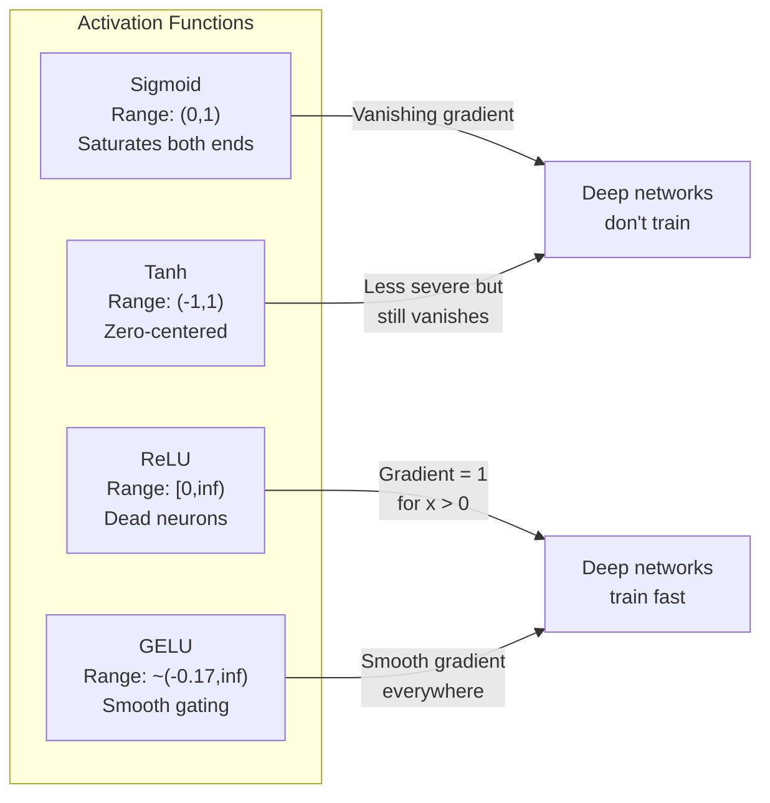
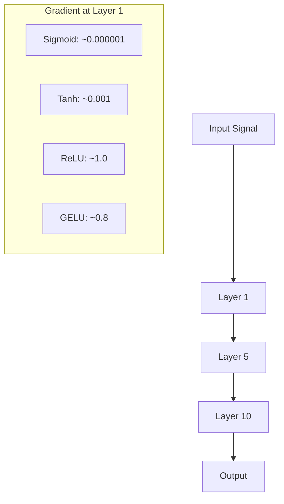
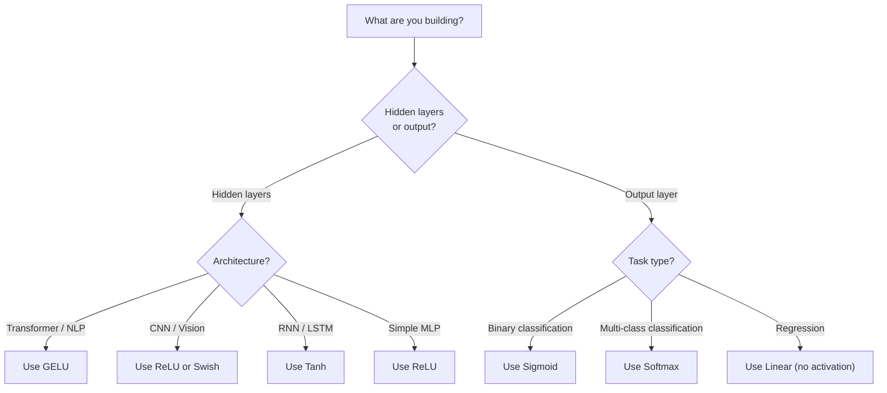

# Activation Functions / 激活函数

> 没有 nonlinearity，你的 100 层 network 也只是一次复杂的 matrix multiply。Activations 是让 neural networks 能用曲线思考的门。

**Type / 类型：** Build / 构建
**Languages / 语言：** Python
**Prerequisites / 前置知识：** Lesson 03.03 (Backpropagation)
**Time / 时间：** 约 75 分钟

## Learning Objectives / 学习目标

- 从零实现 sigmoid、tanh、ReLU、Leaky ReLU、GELU、Swish 和 softmax 及其 derivatives
- 通过测量 10+ layers 中不同 activations 的 activation magnitudes，诊断 vanishing gradient problem
- 在 ReLU network 中检测 dead neurons，并解释为什么 GELU 能避免这种 failure mode
- 为给定 architecture（transformer、CNN、RNN、output layer）选择正确的 activation function

## The Problem / 问题

堆叠两个 linear transformations：y = W2(W1x + b1) + b2。展开后是：y = W2W1x + W2b1 + b2。也就是 y = Ax + c，一个 single linear transformation。无论你堆叠多少 linear layers，结果都会坍缩成一次 matrix multiply。你的 100-layer network 与 single layer 拥有相同的表达能力。

这不是理论上的小趣味。它意味着一个 deep linear network 字面上无法学习 XOR，无法分类 spiral dataset，也无法识别人脸。没有 activation functions，depth 只是幻觉。

Activation functions 打破 linearity。它们用 nonlinear function 扭曲每一层的 output，让 network 能够弯曲 decision boundaries、近似任意 functions，并真正学习。但如果选错 activation，gradients 可能消失为零（deep networks 里的 sigmoid）、爆炸到无穷大（没有谨慎 initialization 的 unbounded activations），或者 neurons 永久死亡（带较大 negative biases 的 ReLU）。Activation function 的选择直接决定 network 是否能学起来。

## The Concept / 概念

### Why Nonlinearity Is Necessary / 为什么必须有非线性

Matrix multiplication 是可组合的。一个 vector 先乘 matrix A，再乘 matrix B，等价于直接乘 AB。这意味着堆叠十个 linear layers，在数学上等同于一个带大 matrix 的 linear layer。那些 parameters 和 depth 都被浪费了。你需要某种东西打断这条链。这就是 activation functions 的作用。

证明如下。Linear layer 计算 f(x) = Wx + b。堆叠两层：

```
Layer 1: h = W1 * x + b1
Layer 2: y = W2 * h + b2
```

代入：

```
y = W2 * (W1 * x + b1) + b2
y = (W2 * W1) * x + (W2 * b1 + b2)
y = A * x + c
```

一层就够了。在 layers 之间插入 nonlinear activation g()：

```
h = g(W1 * x + b1)
y = W2 * h + b2
```

现在代入关系断掉了。W2 * g(W1 * x + b1) + b2 无法被化简成 single linear transformation。Network 可以表示 nonlinear functions。每个带 activation 的额外 layer 都会增加 representational capacity。

### Sigmoid / Sigmoid

Neural networks 最早使用的 activation function。

```
sigmoid(x) = 1 / (1 + e^(-x))
```

Output range：(0, 1)。平滑、可微，会把任意实数映射为类似 probability 的值。

Derivative：

```
sigmoid'(x) = sigmoid(x) * (1 - sigmoid(x))
```

这个 derivative 的最大值是 0.25，发生在 x = 0。在 backpropagation 中，gradients 会穿过 layers 连续相乘。十层 sigmoid 意味着 gradient 最多会被乘以十次 0.25：

```
0.25^10 = 0.000000953674
```

不到原始信号的百万分之一。这就是 vanishing gradient problem。早期 layers 中的 gradients 小到几乎不会更新 weights。Network 看起来在学习，因为 later layers 的 loss 会下降，但最前面的 layers 其实被冻结了。Deep sigmoid networks 根本训练不起来。

另一个问题：sigmoid outputs 总是正数（0 到 1），这意味着 weights 上的 gradients 总是同号。这会让 gradient descent 产生 zig-zagging。

### Tanh / Tanh

Sigmoid 的居中版本。

```
tanh(x) = (e^x - e^(-x)) / (e^x + e^(-x))
```

Output range：(-1, 1)。Zero-centered，因此消除了 zig-zag problem。

Derivative：

```
tanh'(x) = 1 - tanh(x)^2
```

最大 derivative 在 x = 0 时为 1.0，比 sigmoid 好四倍。但 vanishing gradient problem 仍然存在。对于很大的正输入或负输入，derivative 会接近 0。十层之后 gradient 仍然会被压扁，只是没有 sigmoid 那么激烈。

### ReLU: The Breakthrough / ReLU：突破点

Rectified Linear Unit。Nair 和 Hinton 在 2010 年把它推广到 deep learning（这个函数本身可追溯到 Fukushima 1969 年的工作），它改变了一切。

```
relu(x) = max(0, x)
```

Output range：[0, infinity)。Derivative 简单到极致：

```
relu'(x) = 1  if x > 0
            0  if x <= 0
```

对于正输入，不存在 vanishing gradient。Gradient 精确等于 1，会原样通过。这就是 deep networks 变得可训练的原因：ReLU 会跨 layers 保持 gradient magnitude。

但它有一个 failure mode：dead neuron problem。如果某个 neuron's weighted input 总是负数（可能来自很大的 negative bias 或不走运的 weight initialization），它的 output 总是 0，gradient 总是 0，因此永远不会更新。它永久死亡。实践中，ReLU network 中 10-40% 的 neurons 可能会在训练中死亡。

### Leaky ReLU / Leaky ReLU

Dead neurons 最简单的修复方式。

```
leaky_relu(x) = x        if x > 0
                alpha * x if x <= 0
```

其中 alpha 是一个小常数，通常是 0.01。负半轴不再是零，而是保留一个小 slope，所以 dead neurons 仍然能收到 gradient signal，并有机会恢复。

### GELU: The Modern Default / GELU：现代默认选择

Gaussian Error Linear Unit。由 Hendrycks 和 Gimpel 在 2016 年提出。它是 BERT、GPT 和大多数现代 transformers 的默认 activation。

```
gelu(x) = x * Phi(x)
```

其中 Phi(x) 是 standard normal distribution 的 cumulative distribution function。实践中常用的近似式：

```
gelu(x) ~= 0.5 * x * (1 + tanh(sqrt(2/pi) * (x + 0.044715 * x^3)))
```

GELU 处处平滑，允许较小的负值（不像 ReLU 会硬截断为 0），并且有概率解释：它会按照输入在 Gaussian distribution 下为正的概率来加权每个 input。这种 smooth gating 在 transformer architectures 中通常优于 ReLU，因为它提供更好的 gradient flow，并且完全避免 dead neuron problem。

### Swish / SiLU / Swish / SiLU

Ramachandran 等人在 2017 年通过 automated search 发现的 self-gated activation。

```
swish(x) = x * sigmoid(x)
```

Swish 的形式是 x * sigmoid(x)。Google 通过对 activation function space 做 automated search 发现了它，也就是让 neural network 设计 neural networks 的一部分。

与 GELU 一样，它是平滑、非单调的，并允许小的负值。差异很微妙：Swish 使用 sigmoid 做 gating，而 GELU 使用 Gaussian CDF。实践中，两者性能几乎一致。Swish 用于 EfficientNet 和一些 vision models。GELU 在 language models 中占主导。

### Softmax: The Output Activation / Softmax：输出层激活

Softmax 不用于 hidden layers。它把一组 raw scores（logits）转换为 probability distribution。

```
softmax(x_i) = e^(x_i) / sum(e^(x_j) for all j)
```

每个 output 都在 0 和 1 之间，所有 outputs 之和为 1。这让它成为 multi-class classification 的标准 final activation。最大的 logit 会得到最高 probability，但不同于 argmax，softmax 是可微的，并且保留了相对置信度的信息。

### Comparison of Shapes / 形状对比



### Gradient Flow Comparison / Gradient flow 对比



### Which Activation When / 何时使用哪种 activation



```figure
softmax-temperature
```

## Build It / 动手构建

### Step 1: Implement All Activation Functions with Derivatives / 第 1 步：实现所有 activation functions 及 derivatives

每个函数接收一个 float 并返回一个 float。每个 derivative function 接收同样的输入并返回 gradient。

```python
import math

def sigmoid(x):
    x = max(-500, min(500, x))
    return 1.0 / (1.0 + math.exp(-x))

def sigmoid_derivative(x):
    s = sigmoid(x)
    return s * (1 - s)

def tanh_act(x):
    return math.tanh(x)

def tanh_derivative(x):
    t = math.tanh(x)
    return 1 - t * t

def relu(x):
    return max(0.0, x)

def relu_derivative(x):
    return 1.0 if x > 0 else 0.0

def leaky_relu(x, alpha=0.01):
    return x if x > 0 else alpha * x

def leaky_relu_derivative(x, alpha=0.01):
    return 1.0 if x > 0 else alpha

def gelu(x):
    return 0.5 * x * (1 + math.tanh(math.sqrt(2 / math.pi) * (x + 0.044715 * x ** 3)))

def gelu_derivative(x):
    phi = 0.5 * (1 + math.erf(x / math.sqrt(2)))
    pdf = math.exp(-0.5 * x * x) / math.sqrt(2 * math.pi)
    return phi + x * pdf

def swish(x):
    return x * sigmoid(x)

def swish_derivative(x):
    s = sigmoid(x)
    return s + x * s * (1 - s)

def softmax(xs):
    max_x = max(xs)
    exps = [math.exp(x - max_x) for x in xs]
    total = sum(exps)
    return [e / total for e in exps]
```

### Step 2: Visualize Where Gradients Die / 第 2 步：可视化 gradients 在哪里死亡

在 -5 到 5 之间取 100 个等距点，计算每个点的 gradient。打印一个 text histogram，显示每种 activation 的 gradient 在哪些区域接近 0。

```python
def gradient_scan(name, derivative_fn, start=-5, end=5, n=100):
    step = (end - start) / n
    near_zero = 0
    healthy = 0
    for i in range(n):
        x = start + i * step
        g = derivative_fn(x)
        if abs(g) < 0.01:
            near_zero += 1
        else:
            healthy += 1
    pct_dead = near_zero / n * 100
    print(f"{name:15s}: {healthy:3d} healthy, {near_zero:3d} near-zero ({pct_dead:.0f}% dead zone)")

gradient_scan("Sigmoid", sigmoid_derivative)
gradient_scan("Tanh", tanh_derivative)
gradient_scan("ReLU", relu_derivative)
gradient_scan("Leaky ReLU", leaky_relu_derivative)
gradient_scan("GELU", gelu_derivative)
gradient_scan("Swish", swish_derivative)
```

### Step 3: Vanishing Gradient Experiment / 第 3 步：Vanishing gradient 实验

用 sigmoid 和 ReLU 把一个 signal forward-pass 过 N layers，测量 activation magnitude 如何变化。

```python
import random

def vanishing_gradient_experiment(activation_fn, name, n_layers=10, n_inputs=5):
    random.seed(42)
    values = [random.gauss(0, 1) for _ in range(n_inputs)]

    print(f"\n{name} through {n_layers} layers:")
    for layer in range(n_layers):
        weights = [random.gauss(0, 1) for _ in range(n_inputs)]
        z = sum(w * v for w, v in zip(weights, values))
        activated = activation_fn(z)
        magnitude = abs(activated)
        bar = "#" * int(magnitude * 20)
        print(f"  Layer {layer+1:2d}: magnitude = {magnitude:.6f} {bar}")
        values = [activated] * n_inputs

vanishing_gradient_experiment(sigmoid, "Sigmoid")
vanishing_gradient_experiment(relu, "ReLU")
vanishing_gradient_experiment(gelu, "GELU")
```

### Step 4: Dead Neuron Detector / 第 4 步：Dead neuron 检测器

创建一个 ReLU network，让 random inputs 穿过它，统计有多少 neurons 从不触发。

```python
def dead_neuron_detector(n_inputs=5, hidden_size=20, n_samples=1000):
    random.seed(0)
    weights = [[random.gauss(0, 1) for _ in range(n_inputs)] for _ in range(hidden_size)]
    biases = [random.gauss(0, 1) for _ in range(hidden_size)]

    fire_counts = [0] * hidden_size

    for _ in range(n_samples):
        inputs = [random.gauss(0, 1) for _ in range(n_inputs)]
        for neuron_idx in range(hidden_size):
            z = sum(w * x for w, x in zip(weights[neuron_idx], inputs)) + biases[neuron_idx]
            if relu(z) > 0:
                fire_counts[neuron_idx] += 1

    dead = sum(1 for c in fire_counts if c == 0)
    rarely_fire = sum(1 for c in fire_counts if 0 < c < n_samples * 0.05)
    healthy = hidden_size - dead - rarely_fire

    print(f"\nDead Neuron Report ({hidden_size} neurons, {n_samples} samples):")
    print(f"  Dead (never fired):     {dead}")
    print(f"  Barely alive (<5%):     {rarely_fire}")
    print(f"  Healthy:                {healthy}")
    print(f"  Dead neuron rate:       {dead/hidden_size*100:.1f}%")

    for i, c in enumerate(fire_counts):
        status = "DEAD" if c == 0 else "WEAK" if c < n_samples * 0.05 else "OK"
        bar = "#" * (c * 40 // n_samples)
        print(f"  Neuron {i:2d}: {c:4d}/{n_samples} fires [{status:4s}] {bar}")

dead_neuron_detector()
```

### Step 5: Training Comparison -- Sigmoid vs ReLU vs GELU / 第 5 步：训练对比 -- Sigmoid vs ReLU vs GELU

在 circle dataset（圆内点 = class 1，圆外点 = class 0）上，用三种不同 activations 训练同一个 two-layer network。比较 convergence speed。

```python
def make_circle_data(n=200, seed=42):
    random.seed(seed)
    data = []
    for _ in range(n):
        x = random.uniform(-2, 2)
        y = random.uniform(-2, 2)
        label = 1.0 if x * x + y * y < 1.5 else 0.0
        data.append(([x, y], label))
    return data


class ActivationNetwork:
    def __init__(self, activation_fn, activation_deriv, hidden_size=8, lr=0.1):
        random.seed(0)
        self.act = activation_fn
        self.act_d = activation_deriv
        self.lr = lr
        self.hidden_size = hidden_size

        self.w1 = [[random.gauss(0, 0.5) for _ in range(2)] for _ in range(hidden_size)]
        self.b1 = [0.0] * hidden_size
        self.w2 = [random.gauss(0, 0.5) for _ in range(hidden_size)]
        self.b2 = 0.0

    def forward(self, x):
        self.x = x
        self.z1 = []
        self.h = []
        for i in range(self.hidden_size):
            z = self.w1[i][0] * x[0] + self.w1[i][1] * x[1] + self.b1[i]
            self.z1.append(z)
            self.h.append(self.act(z))

        self.z2 = sum(self.w2[i] * self.h[i] for i in range(self.hidden_size)) + self.b2
        self.out = sigmoid(self.z2)
        return self.out

    def backward(self, target):
        error = self.out - target
        d_out = error * self.out * (1 - self.out)

        for i in range(self.hidden_size):
            d_h = d_out * self.w2[i] * self.act_d(self.z1[i])
            self.w2[i] -= self.lr * d_out * self.h[i]
            for j in range(2):
                self.w1[i][j] -= self.lr * d_h * self.x[j]
            self.b1[i] -= self.lr * d_h
        self.b2 -= self.lr * d_out

    def train(self, data, epochs=200):
        losses = []
        for epoch in range(epochs):
            total_loss = 0
            correct = 0
            for x, y in data:
                pred = self.forward(x)
                self.backward(y)
                total_loss += (pred - y) ** 2
                if (pred >= 0.5) == (y >= 0.5):
                    correct += 1
            avg_loss = total_loss / len(data)
            accuracy = correct / len(data) * 100
            losses.append(avg_loss)
            if epoch % 50 == 0 or epoch == epochs - 1:
                print(f"    Epoch {epoch:3d}: loss={avg_loss:.4f}, accuracy={accuracy:.1f}%")
        return losses


data = make_circle_data()

configs = [
    ("Sigmoid", sigmoid, sigmoid_derivative),
    ("ReLU", relu, relu_derivative),
    ("GELU", gelu, gelu_derivative),
]

results = {}
for name, act_fn, act_d_fn in configs:
    print(f"\n=== Training with {name} ===")
    net = ActivationNetwork(act_fn, act_d_fn, hidden_size=8, lr=0.1)
    losses = net.train(data, epochs=200)
    results[name] = losses

print("\n=== Final Loss Comparison ===")
for name, losses in results.items():
    print(f"  {name:10s}: start={losses[0]:.4f} -> end={losses[-1]:.4f} (improvement: {(1 - losses[-1]/losses[0])*100:.1f}%)")
```

## Use It / 应用它

PyTorch 同时提供这些 activations 的 functional 和 module 形式：

```python
import torch
import torch.nn as nn
import torch.nn.functional as F

x = torch.randn(4, 10)

relu_out = F.relu(x)
gelu_out = F.gelu(x)
sigmoid_out = torch.sigmoid(x)
swish_out = F.silu(x)

logits = torch.randn(4, 5)
probs = F.softmax(logits, dim=1)

model = nn.Sequential(
    nn.Linear(10, 64),
    nn.GELU(),
    nn.Linear(64, 32),
    nn.GELU(),
    nn.Linear(32, 5),
)
```

Transformer 的 hidden layers：GELU。CNN 的 hidden layers：ReLU。Classification 的 output layer：softmax。Regression 的 output layer：无 activation（linear）。Probabilities 的 output layer：sigmoid。就这么多。先从这些默认选择开始。只有当你有证据时才替换它们。

RNNs 和 LSTMs 对 hidden state 使用 tanh，对 gates 使用 sigmoid。但如果你今天从零构建模型，大概率不会选 RNNs。如果你的 ReLU network 中 neurons 在死亡，切到 GELU。除非你有具体理由，否则不要先去找 Leaky ReLU；GELU 已经解决 dead neuron problem，并提供更好的 gradient flow。

## Ship It / 交付它

本课产出：
- `outputs/prompt-activation-selector.md` -- 一个可复用 prompt，帮助你为任何 architecture 选择合适的 activation function

## Exercises / 练习

1. 实现 Parametric ReLU (PReLU)，其中 negative slope alpha 是 learnable parameter。在 circle dataset 上训练它，并与固定的 Leaky ReLU 对比。

2. 把 vanishing gradient experiment 从 10 layers 改成 50 layers。绘制 sigmoid、tanh、ReLU 和 GELU 在每一层的 magnitude。每种 activation 到第几层时 signal 实际上接近 0？

3. 实现 ELU (Exponential Linear Unit)：elu(x) = x if x > 0, alpha * (e^x - 1) if x <= 0。在同一个 network 上比较它和 ReLU 的 dead neuron rate。

4. 构建一个 “gradient health monitor”，在训练期间运行：每个 epoch 计算每一层的 average gradient magnitude。当任意 layer 的 gradient 低于 0.001 或高于 100 时打印 warning。

5. 修改 training comparison，使用 Lesson 01 的 XOR dataset，而不是 circles。哪种 activation 在 XOR 上收敛最快？为什么这和 circle results 不同？

## Key Terms / 关键术语

| 术语 | 常见说法 | 实际含义 |
|------|----------------|----------------------|
| Activation function | “非线性部分” | 应用于每个 neuron's output 的函数，它打破 linearity，让 network 能学习 nonlinear mappings |
| Vanishing gradient | “深层网络里的 gradients 消失了” | 当 activation 的 derivative 小于 1 时，gradients 穿过 layers 会指数级缩小，使 early layers 无法训练 |
| Exploding gradient | “Gradients 爆了” | 当有效乘数超过 1 时，gradients 穿过 layers 会指数级增长，导致训练不稳定 |
| Dead neuron | “停止学习的 neuron” | 一个 ReLU neuron 的 input 永久为负，因此 output 为零、gradient 为零 |
| Sigmoid | “把值压到 0-1” | Logistic function 1/(1+e^-x)，历史上很重要，但在 deep networks 中会导致 vanishing gradients |
| ReLU | “把负数截为零” | max(0, x)，通过保持 gradient magnitude，让 deep learning 变得可行的 activation |
| GELU | “Transformer activation” | Gaussian Error Linear Unit，一种 smooth activation，会按输入为正的概率来加权 inputs |
| Swish/SiLU | “Self-gated ReLU” | x * sigmoid(x)，通过 automated search 发现，用于 EfficientNet |
| Softmax | “把分数变成 probabilities” | 把 logits vector 归一化为 probability distribution，其中所有值在 (0,1)，并且总和为 1 |
| Leaky ReLU | “不会死亡的 ReLU” | max(alpha*x, x)，其中 alpha 很小（0.01），通过允许小的 negative gradients 防止 dead neurons |
| Saturation | “Sigmoid 的平坦部分” | Activation 的 derivative 接近 0 的区域，会阻断 gradient flow |
| Logit | “Softmax 之前的原始分数” | 应用 softmax 或 sigmoid 之前，final layer 的 unnormalized output |

## Further Reading / 延伸阅读

- Nair & Hinton, "Rectified Linear Units Improve Restricted Boltzmann Machines" (2010) -- 引入 ReLU 并推动 deep networks 可训练的论文
- Hendrycks & Gimpel, "Gaussian Error Linear Units (GELUs)" (2016) -- 提出了后来成为 transformers 默认选择的 activation function
- Ramachandran et al., "Searching for Activation Functions" (2017) -- 使用 automated search 发现 Swish，说明 activation design 也可以自动化
- Glorot & Bengio, "Understanding the difficulty of training deep feedforward neural networks" (2010) -- 诊断 vanishing/exploding gradients 并提出 Xavier initialization 的论文
- Goodfellow, Bengio, Courville, "Deep Learning" Chapter 6.3 (https://www.deeplearningbook.org/) -- 对 hidden units 和 activation functions 的严谨讲解
