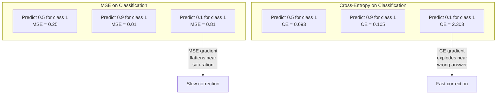
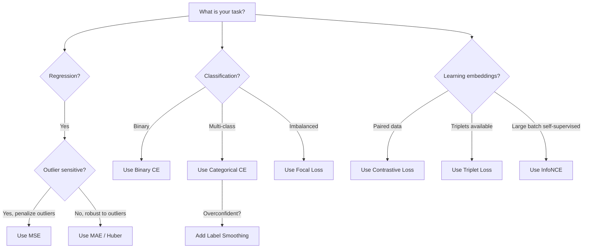
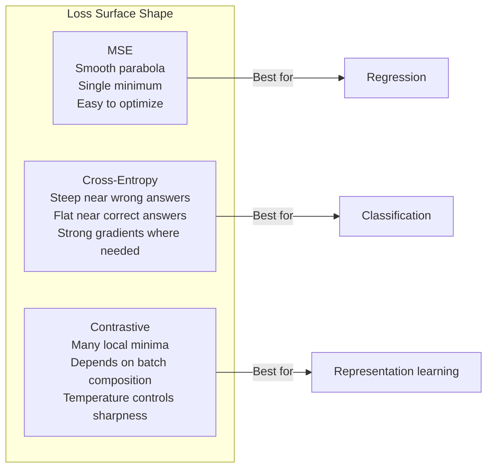

# Loss Functions / 损失函数

> 你的 network 做出了 prediction。Ground truth 说它错了。到底错了多少？这个数字就是 loss。选错 loss function，你的 model 就会彻底优化错目标。

**Type / 类型：** Build / 构建
**Languages / 语言：** Python
**Prerequisites / 前置知识：** Lesson 03.04 (Activation Functions)
**Time / 时间：** 约 75 分钟

## Learning Objectives / 学习目标

- 从零实现 MSE、binary cross-entropy、categorical cross-entropy 和 contrastive loss (InfoNCE) 及其 gradients
- 通过演示“所有输入都预测 0.5”的 failure mode，解释为什么 MSE 不适合 classification
- 将 label smoothing 应用于 cross-entropy，并说明它如何防止 overconfident predictions
- 为 regression、binary classification、multi-class classification 和 embedding learning tasks 选择正确的 loss function

## The Problem / 问题

一个在 classification problem 上最小化 MSE 的 model，可能会自信地把所有东西都预测成 0.5。它确实在最小化 loss，但也完全没用。

Loss function 是你的 model 实际优化的唯一东西。不是 accuracy，不是 F1 score，也不是你向 manager 汇报的任何 metric。Optimizer 会取 loss function 的 gradient，并调整 weights 让这个数字变小。如果 loss function 没有表达你真正关心的目标，model 就会找到数学上最便宜的方式来满足它，而那几乎从来不是你想要的结果。

看一个具体例子。你有一个 binary classification task。两个 classes，比例 50/50。你使用 MSE 作为 loss。Model 对每个 input 都预测 0.5。平均 MSE 是 0.25，这是在不实际学习任何东西的情况下能达到的最小值。Model 没有任何 discriminative ability，但从技术上说，它已经最小化了你的 loss function。换成 cross-entropy 后，同一个 model 会被迫把 predictions 推向 0 或 1，因为 -log(0.5) = 0.693 是很糟的 loss，而 -log(0.99) = 0.01 会奖励自信且正确的 predictions。Loss function 的选择，就是“model 学会了”和“model 钻了 metric 空子”之间的区别。

情况还会更糟。在 self-supervised learning 中，你甚至没有 labels。Contrastive loss 完全定义了 learning signal：什么算相似，什么算不同，以及 model 应该多用力把它们分开。如果 contrastive loss 写错了，embeddings 会 collapse 到单个点，也就是所有 input 都映射到同一个 vector。技术上可能是 zero loss，但完全没有价值。

## The Concept / 概念

### Mean Squared Error (MSE) / 均方误差

Regression 的默认选择。计算 prediction 与 target 的 squared difference，再对所有 samples 取平均。

```
MSE = (1/n) * sum((y_pred - y_true)^2)
```

为什么平方很重要：它会对大错误进行二次惩罚。误差 2 的代价是误差 1 的 4 倍。误差 10 的代价是 100 倍。这让 MSE 对 outliers 非常敏感，一个极端错误的 prediction 会主导 loss。

具体数字：如果你的 model 预测房价，大多数房子只差 $10,000，但某一栋 mansion 差了 $200,000，MSE 会非常强烈地试图修正那一栋 mansion，可能损害另外 99 栋房子的表现。

MSE 对 prediction 的 gradient 是：

```
dMSE/dy_pred = (2/n) * (y_pred - y_true)
```

它与 error 线性相关。更大的 errors 会得到更大的 gradients。这对 regression 是优点（大错误需要大修正），对 classification 则是问题（你希望对自信但错误的答案进行指数级惩罚，而不是线性惩罚）。

### Cross-Entropy Loss / 交叉熵损失

Classification 的 loss function。它根植于 information theory，用来衡量 predicted probability distribution 与 true distribution 之间的 divergence。

**Binary Cross-Entropy (BCE):**

```
BCE = -(y * log(p) + (1 - y) * log(1 - p))
```

其中 y 是 true label（0 或 1），p 是 predicted probability。

为什么 -log(p) 有效：当 true label 是 1，而你预测 p = 0.99 时，loss 是 -log(0.99) = 0.01。当你预测 p = 0.01 时，loss 是 -log(0.01) = 4.6。这个 460 倍差距就是 cross-entropy 有效的原因。它会严厉惩罚自信但错误的 predictions，同时几乎不惩罚自信且正确的 predictions。

Gradient 也讲同一个故事：

```
dBCE/dp = -(y/p) + (1-y)/(1-p)
```

当 y = 1 且 p 接近 0 时，gradient 是 -1/p，会趋向负无穷。Model 会收到巨大的信号去修正错误。当 p 接近 1 时，gradient 很小。已经正确，就没什么需要修。

**Categorical Cross-Entropy:**

用于带 one-hot encoded targets 的 multi-class classification。

```
CCE = -sum(y_i * log(p_i))
```

只有 true class 会贡献 loss（因为其他 y_i 都是 0）。如果有 10 个 classes，正确 class 的 probability 是 0.1（随机猜测），loss 是 -log(0.1) = 2.3。如果正确 class 的 probability 是 0.9，loss 是 -log(0.9) = 0.105。Model 会学习把 probability mass 集中到正确答案上。

### Why MSE Fails for Classification / 为什么 MSE 不适合分类



当 predictions 接近 0 或 1 时，MSE gradients 会变平（因为 sigmoid saturation）。Cross-entropy gradients 会补偿这一点：-log 会抵消 sigmoid 的平坦区域，在最需要强信号的地方给出强 gradients。

### Label Smoothing / 标签平滑

标准 one-hot labels 的说法是：“这 100% 是 class 3，0% 是其他所有 class。”这是一个很强的断言。Label smoothing 会把它软化：

```
smooth_label = (1 - alpha) * one_hot + alpha / num_classes
```

当 alpha = 0.1 且有 10 个 classes 时，target 不再是 [0, 0, 1, 0, ...]，而是 [0.01, 0.01, 0.91, 0.01, ...]。Model 的目标从 1.0 变成 0.91。

为什么它有效：一个试图通过 softmax 输出精确 1.0 的 model，需要把 logits 推到无穷大。这会导致 overconfidence，损害 generalization，并让 model 对 distribution shift 更脆弱。Label smoothing 会把 target 限制在 0.9（alpha=0.1 时），让 logits 保持在合理范围内。GPT 和大多数现代模型都使用 label smoothing 或等价做法。

### Contrastive Loss / 对比损失

没有 labels。没有 classes。只有成对 inputs 和一个问题：它们相似还是不同？

**SimCLR-style contrastive loss (NT-Xent / InfoNCE):**

取一张 image。对它创建两个 augmented views（crop、rotate、color jitter）。它们是 “positive pair”，应该拥有相似 embeddings。Batch 中其他每张 image 都形成 “negative pair”，应该拥有不同 embeddings。

```
L = -log(exp(sim(z_i, z_j) / tau) / sum(exp(sim(z_i, z_k) / tau)))
```

其中 sim() 是 cosine similarity，z_i 和 z_j 是 positive pair，sum 覆盖所有 negatives，tau（temperature）控制 distribution 的 sharpness。更低 temperature = 更难的 negatives = 更强的分离。

具体数字：batch size 256 意味着每个 positive pair 有 255 个 negatives。Temperature tau = 0.07（SimCLR 默认值）。这个 loss 看起来像 similarities 上的 softmax，它希望 positive pair 的 similarity 在 256 个选项中最高。

**Triplet Loss:**

接收三个 inputs：anchor、positive（同 class）、negative（不同 class）。

```
L = max(0, d(anchor, positive) - d(anchor, negative) + margin)
```

Margin（通常 0.2-1.0）强制 positive 和 negative distances 之间至少有一个间隔。如果 negative 已经足够远，loss 就是 0，没有 gradient，也没有 update。这让训练更高效，但需要谨慎的 triplet mining（选择靠近 anchor 的 hard negatives）。

### Focal Loss / Focal loss

用于 imbalanced datasets。标准 cross-entropy 会平等对待所有已经正确分类的 examples。Focal loss 会降低 easy examples 的权重：

```
FL = -alpha * (1 - p_t)^gamma * log(p_t)
```

其中 p_t 是 true class 的 predicted probability，gamma 控制 focusing。gamma = 0 时，它就是标准 cross-entropy。gamma = 2（默认）时：

- Easy example (p_t = 0.9)：weight = (0.1)^2 = 0.01。基本被忽略。
- Hard example (p_t = 0.1)：weight = (0.9)^2 = 0.81。保留完整 gradient signal。

Focal loss 由 Lin 等人提出，用于 object detection，当时 99% 的 candidate regions 都是 background（easy negatives）。没有 focal loss，model 会被 easy background examples 淹没，永远学不会检测 objects。有了 focal loss，model 会把 capacity 聚焦到真正重要的 hard、ambiguous cases 上。

### Loss Function Decision Tree / Loss function 决策树



### Loss Landscape / 损失地形



```figure
cross-entropy-loss
```

## Build It / 动手构建

### Step 1: MSE and Its Gradient / 第 1 步：MSE 及其 gradient

```python
def mse(predictions, targets):
    n = len(predictions)
    total = 0.0
    for p, t in zip(predictions, targets):
        total += (p - t) ** 2
    return total / n

def mse_gradient(predictions, targets):
    n = len(predictions)
    grads = []
    for p, t in zip(predictions, targets):
        grads.append(2.0 * (p - t) / n)
    return grads
```

### Step 2: Binary Cross-Entropy / 第 2 步：Binary cross-entropy

log(0) 问题是真实存在的。如果 model 对一个 positive example 精确预测 0，log(0) = negative infinity。Clipping 可以防止这种情况。

```python
import math

def binary_cross_entropy(predictions, targets, eps=1e-15):
    n = len(predictions)
    total = 0.0
    for p, t in zip(predictions, targets):
        p_clipped = max(eps, min(1 - eps, p))
        total += -(t * math.log(p_clipped) + (1 - t) * math.log(1 - p_clipped))
    return total / n

def bce_gradient(predictions, targets, eps=1e-15):
    grads = []
    for p, t in zip(predictions, targets):
        p_clipped = max(eps, min(1 - eps, p))
        grads.append(-(t / p_clipped) + (1 - t) / (1 - p_clipped))
    return grads
```

### Step 3: Categorical Cross-Entropy with Softmax / 第 3 步：带 Softmax 的 categorical cross-entropy

Softmax 会把 raw logits 转成 probabilities。然后我们计算它与 one-hot targets 的 cross-entropy。

```python
def softmax(logits):
    max_val = max(logits)
    exps = [math.exp(x - max_val) for x in logits]
    total = sum(exps)
    return [e / total for e in exps]

def categorical_cross_entropy(logits, target_index, eps=1e-15):
    probs = softmax(logits)
    p = max(eps, probs[target_index])
    return -math.log(p)

def cce_gradient(logits, target_index):
    probs = softmax(logits)
    grads = list(probs)
    grads[target_index] -= 1.0
    return grads
```

Softmax + cross-entropy 的 gradient 会优雅地简化：true class 上就是 (predicted probability - 1)，其他 classes 上就是 predicted probability。这个优雅的简化不是巧合，它正是 softmax 和 cross-entropy 常被配套使用的原因。

### Step 4: Label Smoothing / 第 4 步：Label smoothing

```python
def label_smoothed_cce(logits, target_index, num_classes, alpha=0.1, eps=1e-15):
    probs = softmax(logits)
    loss = 0.0
    for i in range(num_classes):
        if i == target_index:
            smooth_target = 1.0 - alpha + alpha / num_classes
        else:
            smooth_target = alpha / num_classes
        p = max(eps, probs[i])
        loss += -smooth_target * math.log(p)
    return loss
```

### Step 5: Contrastive Loss (Simplified InfoNCE) / 第 5 步：Contrastive loss（简化版 InfoNCE）

```python
def cosine_similarity(a, b):
    dot = sum(x * y for x, y in zip(a, b))
    norm_a = math.sqrt(sum(x * x for x in a))
    norm_b = math.sqrt(sum(x * x for x in b))
    if norm_a < 1e-10 or norm_b < 1e-10:
        return 0.0
    return dot / (norm_a * norm_b)

def contrastive_loss(anchor, positive, negatives, temperature=0.07):
    sim_pos = cosine_similarity(anchor, positive) / temperature
    sim_negs = [cosine_similarity(anchor, neg) / temperature for neg in negatives]

    max_sim = max(sim_pos, max(sim_negs)) if sim_negs else sim_pos
    exp_pos = math.exp(sim_pos - max_sim)
    exp_negs = [math.exp(s - max_sim) for s in sim_negs]
    total_exp = exp_pos + sum(exp_negs)

    return -math.log(max(1e-15, exp_pos / total_exp))
```

### Step 6: MSE vs Cross-Entropy on Classification / 第 6 步：分类任务上的 MSE vs Cross-Entropy

在 lesson 04 的同一个 network（circle dataset）上分别使用两种 loss functions 训练。观察 cross-entropy 更快收敛。

```python
import random

def sigmoid(x):
    x = max(-500, min(500, x))
    return 1.0 / (1.0 + math.exp(-x))

def make_circle_data(n=200, seed=42):
    random.seed(seed)
    data = []
    for _ in range(n):
        x = random.uniform(-2, 2)
        y = random.uniform(-2, 2)
        label = 1.0 if x * x + y * y < 1.5 else 0.0
        data.append(([x, y], label))
    return data


class LossComparisonNetwork:
    def __init__(self, loss_type="bce", hidden_size=8, lr=0.1):
        random.seed(0)
        self.loss_type = loss_type
        self.lr = lr
        self.hidden_size = hidden_size

        self.w1 = [[random.gauss(0, 0.5) for _ in range(2)] for _ in range(hidden_size)]
        self.b1 = [0.0] * hidden_size
        self.w2 = [random.gauss(0, 0.5) for _ in range(hidden_size)]
        self.b2 = 0.0

    def forward(self, x):
        self.x = x
        self.z1 = []
        self.h = []
        for i in range(self.hidden_size):
            z = self.w1[i][0] * x[0] + self.w1[i][1] * x[1] + self.b1[i]
            self.z1.append(z)
            self.h.append(max(0.0, z))

        self.z2 = sum(self.w2[i] * self.h[i] for i in range(self.hidden_size)) + self.b2
        self.out = sigmoid(self.z2)
        return self.out

    def backward(self, target):
        if self.loss_type == "mse":
            d_loss = 2.0 * (self.out - target)
        else:
            eps = 1e-15
            p = max(eps, min(1 - eps, self.out))
            d_loss = -(target / p) + (1 - target) / (1 - p)

        d_sigmoid = self.out * (1 - self.out)
        d_out = d_loss * d_sigmoid

        for i in range(self.hidden_size):
            d_relu = 1.0 if self.z1[i] > 0 else 0.0
            d_h = d_out * self.w2[i] * d_relu
            self.w2[i] -= self.lr * d_out * self.h[i]
            for j in range(2):
                self.w1[i][j] -= self.lr * d_h * self.x[j]
            self.b1[i] -= self.lr * d_h
        self.b2 -= self.lr * d_out

    def compute_loss(self, pred, target):
        if self.loss_type == "mse":
            return (pred - target) ** 2
        else:
            eps = 1e-15
            p = max(eps, min(1 - eps, pred))
            return -(target * math.log(p) + (1 - target) * math.log(1 - p))

    def train(self, data, epochs=200):
        losses = []
        for epoch in range(epochs):
            total_loss = 0.0
            correct = 0
            for x, y in data:
                pred = self.forward(x)
                self.backward(y)
                total_loss += self.compute_loss(pred, y)
                if (pred >= 0.5) == (y >= 0.5):
                    correct += 1
            avg_loss = total_loss / len(data)
            accuracy = correct / len(data) * 100
            losses.append((avg_loss, accuracy))
            if epoch % 50 == 0 or epoch == epochs - 1:
                print(f"    Epoch {epoch:3d}: loss={avg_loss:.4f}, accuracy={accuracy:.1f}%")
        return losses
```

## Use It / 应用它

PyTorch 提供所有标准 loss functions，并内置 numerical stability：

```python
import torch
import torch.nn as nn
import torch.nn.functional as F

predictions = torch.tensor([0.9, 0.1, 0.7], requires_grad=True)
targets = torch.tensor([1.0, 0.0, 1.0])

mse_loss = F.mse_loss(predictions, targets)
bce_loss = F.binary_cross_entropy(predictions, targets)

logits = torch.randn(4, 10)
labels = torch.tensor([3, 7, 1, 9])
ce_loss = F.cross_entropy(logits, labels)
ce_smooth = F.cross_entropy(logits, labels, label_smoothing=0.1)
```

使用 `F.cross_entropy`，不要手动 `F.nll_loss` 加 softmax。它会把 log-softmax 和 negative log-likelihood 合并成一个 numerically stable operation。先单独应用 softmax 再取 log 稳定性更差，因为你会在大指数的相减中损失精度。

对于 contrastive learning，大多数团队会使用自定义实现，或使用 `lightly`、`pytorch-metric-learning` 等 libraries。核心循环始终相同：计算 pairwise similarities，创建 positives 和 negatives 上的 softmax，然后 backpropagate。

## Ship It / 交付它

本课产出：
- `outputs/prompt-loss-function-selector.md` -- 一个用于选择正确 loss function 的可复用 prompt
- `outputs/prompt-loss-debugger.md` -- 当你的 loss curve 看起来不对时使用的诊断 prompt

## Exercises / 练习

1. 实现 Huber loss（smooth L1 loss），它在小 errors 上像 MSE，在大 errors 上像 MAE。训练一个 regression network 来预测 y = sin(x)，并在 5% training targets 被加入 random noise（outliers）时比较 MSE 与 Huber 的 final test error。

2. 给 binary classification training loop 增加 focal loss。创建一个 imbalanced dataset（90% class 0，10% class 1）。200 epochs 后，对比标准 BCE 与 focal loss（gamma=2）在 minority class recall 上的表现。

3. 实现带 semi-hard negative mining 的 triplet loss。为 5 个 classes 生成 2D embedding data。对每个 anchor，找到仍然比 positive 更远、但尽可能近的 hardest negative（semi-hard）。与 random triplet selection 比较 convergence。

4. 运行 MSE vs cross-entropy 对比，但在训练期间跟踪每一层的 gradient magnitudes。绘制每个 epoch 的 average gradient norm。验证当 model 最不确定的 early epochs 中，cross-entropy 会产生更大的 gradients。

5. 实现 KL divergence loss，并验证当 true distribution 是 one-hot 时，最小化 KL(true || predicted) 会得到与 cross-entropy 相同的 gradients。然后尝试 soft targets（例如 knowledge distillation），其中 “true” distribution 来自 teacher model 的 softmax output。

## Key Terms / 关键术语

| 术语 | 常见说法 | 实际含义 |
|------|----------------|----------------------|
| Loss function | “模型错得多厉害” | 一个把 predictions 和 targets 映射到 scalar 的 differentiable function，optimizer 会最小化它 |
| MSE | “平均平方误差” | Predictions 和 targets 之间 squared differences 的均值；会对大错误进行二次惩罚 |
| Cross-entropy | “分类 loss” | 使用 -log(p) 衡量 predicted probability distribution 与 true distribution 之间的 divergence |
| Binary cross-entropy | “BCE” | 两个 classes 的 cross-entropy：-(y*log(p) + (1-y)*log(1-p)) |
| Label smoothing | “软化 targets” | 用 soft values（如 0.1/0.9）替换硬 0/1 targets，以防止 overconfidence 并提升 generalization |
| Contrastive loss | “拉近相似，推远不同” | 一种通过让 embedding space 中相似 pairs 靠近、不同 pairs 远离来学习 representations 的 loss |
| InfoNCE | “CLIP/SimCLR loss” | Similarity scores 上的 normalized temperature-scaled cross-entropy；把 contrastive learning 当作 classification |
| Focal loss | “imbalanced data 修复方案” | 用 (1-p_t)^gamma 加权的 cross-entropy，用来降低 easy examples 权重并关注 hard ones |
| Triplet loss | “Anchor-positive-negative” | 让 anchor 到 positive 的距离至少比到 negative 的距离小一个 margin |
| Temperature | “Sharpness knob” | 作用在 logits/similarities 上的 scalar divisor，控制最终 distribution 的尖锐程度；越低越尖锐 |

## Further Reading / 延伸阅读

- Lin et al., "Focal Loss for Dense Object Detection" (2017) -- 为处理 object detection（RetinaNet）中的极端 class imbalance 而提出 focal loss
- Chen et al., "A Simple Framework for Contrastive Learning of Visual Representations" (SimCLR, 2020) -- 使用 NT-Xent loss 定义了现代 contrastive learning pipeline
- Szegedy et al., "Rethinking the Inception Architecture" (2016) -- 将 label smoothing 作为 regularization technique 引入，如今已是多数 large models 的标准做法
- Hinton et al., "Distilling the Knowledge in a Neural Network" (2015) -- 使用 soft targets 和 KL divergence 做 knowledge distillation，是 model compression 的基础论文
