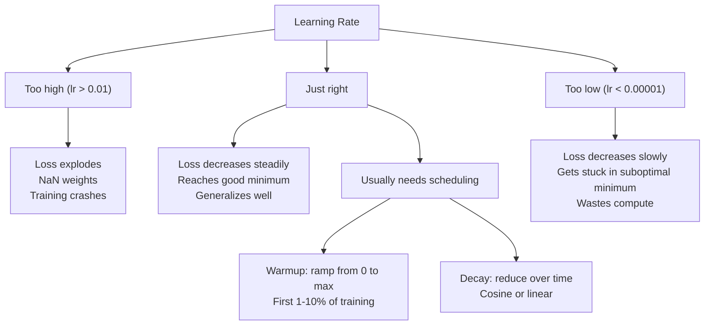
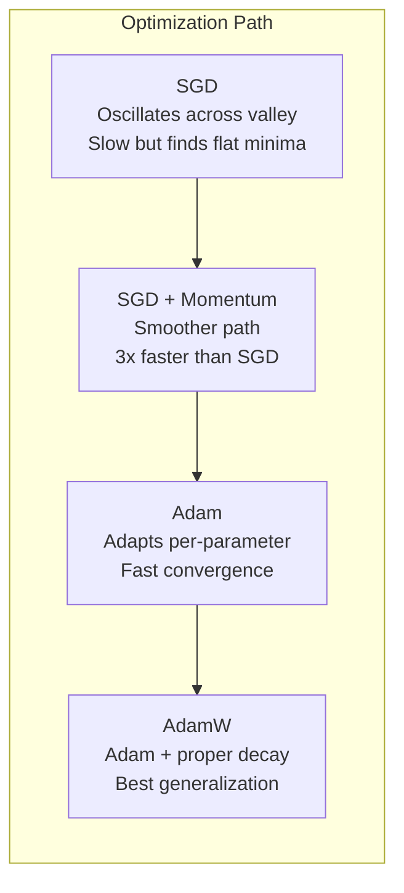
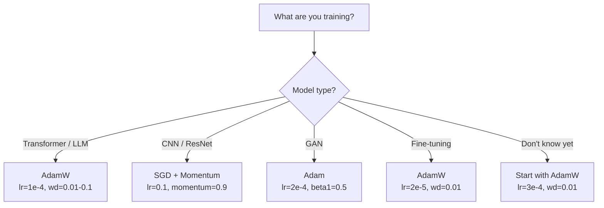

# Optimizers / 优化器

> Gradient descent 告诉你该往哪个方向移动，但没告诉你走多远、走多快。SGD 是指南针。Adam 是带实时路况的 GPS。

**Type / 类型：** Build / 构建
**Languages / 语言：** Python
**Prerequisites / 前置知识：** Lesson 03.05 (Loss Functions)
**Time / 时间：** 约 75 分钟

## Learning Objectives / 学习目标

- 用 Python 从零实现 SGD、SGD with momentum、Adam 和 AdamW optimizers
- 解释 Adam 的 bias correction 如何补偿 early training steps 中 zero-initialized moment estimates 的偏差
- 在同一任务上演示为什么 AdamW 比带 L2 regularization 的 Adam 产生更好的 generalization
- 为 transformers、CNNs、GANs 和 fine-tuning 选择合适的 optimizer 与默认 hyperparameters

## The Problem / 问题

你已经算出了 gradients。你知道 weight #4,721 应该减少 0.003 才能降低 loss。但 0.003 的单位是什么？应该按什么缩放？第 1 步和第 1,000 步应该移动同样的量吗？

Vanilla gradient descent 在每个 step 上都对每个 parameter 应用同一个 learning rate：w = w - lr * gradient。这会带来三个问题，让 neural networks 的实际训练非常痛苦。

第一，oscillation。Loss landscape 很少像一个光滑的碗。它更像一条又长又窄的山谷。Gradient 指向横穿山谷的方向（陡峭方向），而不是沿着山谷向下的方向（平缓方向）。Gradient descent 会在窄维度上来回反弹，同时在真正有用的方向上进展很小。你一定见过这种现象：loss 先快速下降，然后 plateau，不是因为 model 收敛了，而是因为它在 oscillating。

第二，对所有 parameters 使用一个 learning rate 是错误的。有些 weights 需要大 updates（它们还在 early、underfitting stage）。另一些需要很小的 updates（它们已经接近 optimal value）。适合前者的 learning rate 会毁掉后者，反之亦然。

第三，saddle points。在高维空间中，loss landscape 有大片 flat regions，其中 gradient 接近 0。Vanilla SGD 会以 gradient 的速度爬过这些区域，而这个速度实际上接近 0。Model 看起来像卡住了。它没有真的卡住，只是在一个 flat region 里，而另一侧还有有用的下降方向。但 SGD 没有机制把它推过去。

Adam 解决了这三个问题。它为每个 parameter 维护两个 running averages：mean gradient（momentum，处理 oscillation）和 mean squared gradient（adaptive rate，处理不同尺度）。再加上最初几步的 bias correction，它提供了一个用默认 hyperparameters 就能解决 80% 问题的 optimizer。本课会从零构建它，这样你能准确理解它在另外 20% 情况下何时、为何失败。

## The Concept / 概念

### Stochastic Gradient Descent (SGD) / 随机梯度下降

最简单的 optimizer。在 mini-batch 上计算 gradient，然后朝相反方向走一步。

```
w = w - lr * gradient
```

“Stochastic” 的意思是：你用数据的随机子集（mini-batch）来估计 gradient，而不是用完整 dataset。这种噪声其实有用，它有助于逃离 sharp local minima。但噪声也会导致 oscillation。

Learning rate 是唯一旋钮。太高：loss diverges。太低：training 永远跑不完。最优值依赖 architecture、data、batch size 和当前 training stage。现代 networks 上的 vanilla SGD 常见取值在 0.01 到 0.1 之间。但即使在同一次 training run 中，理想 learning rate 也会变化。

### Momentum / 动量

“小球滚下山坡”的类比被用滥了，但它很准确。你不再只按当前 gradient 走，而是维护一个积累过去 gradients 的 velocity。

```
m_t = beta * m_{t-1} + gradient
w = w - lr * m_t
```

Beta（通常 0.9）控制保留多少历史。beta = 0.9 时，momentum 大致是最近 10 个 gradients 的平均值（1 / (1 - 0.9) = 10）。

为什么它能修复 oscillation：指向同一方向的 gradients 会累积，方向来回翻转的 gradients 会互相抵消。在那条狭窄山谷中，“横穿”分量每一步都会变号并被抑制，“沿着”分量保持一致并被放大。结果是在有用方向上平滑加速。

具体数字：SGD 单独在 badly conditioned loss landscape 上可能需要 10,000 steps。带 momentum 的 SGD（beta=0.9）通常在同一问题上只需 3,000-5,000 steps。这不是边际提升。

### RMSProp / RMSProp

第一个真正有效的 per-parameter adaptive learning rate 方法。Hinton 在 Coursera 课程中提出（从未正式发表）。

```
s_t = beta * s_{t-1} + (1 - beta) * gradient^2
w = w - lr * gradient / (sqrt(s_t) + epsilon)
```

s_t 跟踪 squared gradients 的 running average。长期拥有大 gradients 的 parameters 会被一个大数除（更小的 effective learning rate）。拥有小 gradients 的 parameters 会被一个小数除（更大的 effective learning rate）。

这解决了“所有 parameters 共用一个 learning rate”的问题。一个一直得到大 updates 的 weight 可能已经接近目标，应该放慢。一个一直只得到很小 updates 的 weight 可能训练不足，应该加速。

Epsilon（通常 1e-8）用来防止 parameter 还没更新过时出现 division by zero。

### Adam: Momentum + RMSProp / Adam：Momentum + RMSProp

Adam 结合了两个想法。它为每个 parameter 维护两个 exponential moving averages：

```
m_t = beta1 * m_{t-1} + (1 - beta1) * gradient        (first moment: mean)
v_t = beta2 * v_{t-1} + (1 - beta2) * gradient^2       (second moment: variance)
```

**Bias correction** 是多数解释会跳过的关键细节。第 1 步时，m_1 = (1 - beta1) * gradient。beta1 = 0.9 时，它等于 0.1 * gradient，比真实值小十倍。Moving average 还没有预热。Bias correction 会补偿它：

```
m_hat = m_t / (1 - beta1^t)
v_hat = v_t / (1 - beta2^t)
```

第 1 步且 beta1 = 0.9 时：m_hat = m_1 / (1 - 0.9) = m_1 / 0.1 = actual gradient。第 100 步时：(1 - 0.9^100) 近似 1.0，因此 correction 消失。Bias correction 对前 ~10 steps 很重要，约 50 steps 后基本无关。

Update：

```
w = w - lr * m_hat / (sqrt(v_hat) + epsilon)
```

Adam defaults：lr = 0.001，beta1 = 0.9，beta2 = 0.999，epsilon = 1e-8。这些 defaults 对 80% 的问题有效。不有效时，先改 lr；其次改 beta2；几乎不要改 beta1 或 epsilon。

### AdamW: Weight Decay Done Right / AdamW：正确的 weight decay

L2 regularization 会把 lambda * w^2 加到 loss 上。在 vanilla SGD 中，这等价于 weight decay（每一步从 weight 中减去 lambda * w）。但在 Adam 中，这种等价关系不成立。

Loshchilov & Hutter 的洞见是：当你把 L2 加到 loss 中，然后 Adam 处理 gradient 时，adaptive learning rate 也会缩放 regularization term。Gradient variance 大的 parameters 得到更少 regularization，variance 小的 parameters 得到更多。这不是你想要的效果；你想要的是不依赖 gradient statistics 的均匀 regularization。

AdamW 会在 Adam update 之后，直接对 weights 应用 weight decay：

```
w = w - lr * m_hat / (sqrt(v_hat) + epsilon) - lr * lambda * w
```

Weight decay term（lr * lambda * w）不会被 Adam 的 adaptive factor 缩放。每个 parameter 都得到同样比例的收缩。

这看起来像一个小细节。不是。AdamW 在几乎所有任务上都比 Adam + L2 regularization 收敛到更好的解。它是 PyTorch 中训练 transformers、diffusion models 和多数现代 architectures 的默认 optimizer。BERT、GPT、LLaMA、Stable Diffusion 都用 AdamW 训练。

### Learning Rate: The Most Important Hyperparameter / Learning rate：最重要的超参数



如果只调一个 hyperparameter，就调 learning rate。Learning rate 改变 10 倍，影响会超过你做的大多数 architectural decisions。常见 defaults：

- SGD: lr = 0.01 to 0.1
- Adam/AdamW: lr = 1e-4 to 3e-4
- Fine-tuning pretrained models: lr = 1e-5 to 5e-5
- Learning rate warmup: linear ramp over first 1-10% of steps

### Optimizer Comparison / Optimizer 对比



### When Each Optimizer Wins / 每种 optimizer 何时胜出



```figure
optimizer-trajectory
```

## Build It / 动手构建

### Step 1: Vanilla SGD / 第 1 步：Vanilla SGD

```python
class SGD:
    def __init__(self, lr=0.01):
        self.lr = lr

    def step(self, params, grads):
        for i in range(len(params)):
            params[i] -= self.lr * grads[i]
```

### Step 2: SGD with Momentum / 第 2 步：带 Momentum 的 SGD

```python
class SGDMomentum:
    def __init__(self, lr=0.01, beta=0.9):
        self.lr = lr
        self.beta = beta
        self.velocities = None

    def step(self, params, grads):
        if self.velocities is None:
            self.velocities = [0.0] * len(params)
        for i in range(len(params)):
            self.velocities[i] = self.beta * self.velocities[i] + grads[i]
            params[i] -= self.lr * self.velocities[i]
```

### Step 3: Adam / 第 3 步：Adam

```python
import math

class Adam:
    def __init__(self, lr=0.001, beta1=0.9, beta2=0.999, epsilon=1e-8):
        self.lr = lr
        self.beta1 = beta1
        self.beta2 = beta2
        self.epsilon = epsilon
        self.m = None
        self.v = None
        self.t = 0

    def step(self, params, grads):
        if self.m is None:
            self.m = [0.0] * len(params)
            self.v = [0.0] * len(params)

        self.t += 1

        for i in range(len(params)):
            self.m[i] = self.beta1 * self.m[i] + (1 - self.beta1) * grads[i]
            self.v[i] = self.beta2 * self.v[i] + (1 - self.beta2) * grads[i] ** 2

            m_hat = self.m[i] / (1 - self.beta1 ** self.t)
            v_hat = self.v[i] / (1 - self.beta2 ** self.t)

            params[i] -= self.lr * m_hat / (math.sqrt(v_hat) + self.epsilon)
```

### Step 4: AdamW / 第 4 步：AdamW

```python
class AdamW:
    def __init__(self, lr=0.001, beta1=0.9, beta2=0.999, epsilon=1e-8, weight_decay=0.01):
        self.lr = lr
        self.beta1 = beta1
        self.beta2 = beta2
        self.epsilon = epsilon
        self.weight_decay = weight_decay
        self.m = None
        self.v = None
        self.t = 0

    def step(self, params, grads):
        if self.m is None:
            self.m = [0.0] * len(params)
            self.v = [0.0] * len(params)

        self.t += 1

        for i in range(len(params)):
            self.m[i] = self.beta1 * self.m[i] + (1 - self.beta1) * grads[i]
            self.v[i] = self.beta2 * self.v[i] + (1 - self.beta2) * grads[i] ** 2

            m_hat = self.m[i] / (1 - self.beta1 ** self.t)
            v_hat = self.v[i] / (1 - self.beta2 ** self.t)

            params[i] -= self.lr * m_hat / (math.sqrt(v_hat) + self.epsilon)
            params[i] -= self.lr * self.weight_decay * params[i]
```

### Step 5: Training Comparison / 第 5 步：训练对比

在 lesson 05 的 circle dataset 上，用四种 optimizers 训练同一个 two-layer network。比较 convergence。

```python
import random

def sigmoid(x):
    x = max(-500, min(500, x))
    return 1.0 / (1.0 + math.exp(-x))

def make_circle_data(n=200, seed=42):
    random.seed(seed)
    data = []
    for _ in range(n):
        x = random.uniform(-2, 2)
        y = random.uniform(-2, 2)
        label = 1.0 if x * x + y * y < 1.5 else 0.0
        data.append(([x, y], label))
    return data


class OptimizerTestNetwork:
    def __init__(self, optimizer, hidden_size=8):
        random.seed(0)
        self.hidden_size = hidden_size
        self.optimizer = optimizer

        self.w1 = [[random.gauss(0, 0.5) for _ in range(2)] for _ in range(hidden_size)]
        self.b1 = [0.0] * hidden_size
        self.w2 = [random.gauss(0, 0.5) for _ in range(hidden_size)]
        self.b2 = 0.0

    def get_params(self):
        params = []
        for row in self.w1:
            params.extend(row)
        params.extend(self.b1)
        params.extend(self.w2)
        params.append(self.b2)
        return params

    def set_params(self, params):
        idx = 0
        for i in range(self.hidden_size):
            for j in range(2):
                self.w1[i][j] = params[idx]
                idx += 1
        for i in range(self.hidden_size):
            self.b1[i] = params[idx]
            idx += 1
        for i in range(self.hidden_size):
            self.w2[i] = params[idx]
            idx += 1
        self.b2 = params[idx]

    def forward(self, x):
        self.x = x
        self.z1 = []
        self.h = []
        for i in range(self.hidden_size):
            z = self.w1[i][0] * x[0] + self.w1[i][1] * x[1] + self.b1[i]
            self.z1.append(z)
            self.h.append(max(0.0, z))

        self.z2 = sum(self.w2[i] * self.h[i] for i in range(self.hidden_size)) + self.b2
        self.out = sigmoid(self.z2)
        return self.out

    def compute_grads(self, target):
        eps = 1e-15
        p = max(eps, min(1 - eps, self.out))
        d_loss = -(target / p) + (1 - target) / (1 - p)
        d_sigmoid = self.out * (1 - self.out)
        d_out = d_loss * d_sigmoid

        grads = [0.0] * (self.hidden_size * 2 + self.hidden_size + self.hidden_size + 1)
        idx = 0
        for i in range(self.hidden_size):
            d_relu = 1.0 if self.z1[i] > 0 else 0.0
            d_h = d_out * self.w2[i] * d_relu
            grads[idx] = d_h * self.x[0]
            grads[idx + 1] = d_h * self.x[1]
            idx += 2

        for i in range(self.hidden_size):
            d_relu = 1.0 if self.z1[i] > 0 else 0.0
            grads[idx] = d_out * self.w2[i] * d_relu
            idx += 1

        for i in range(self.hidden_size):
            grads[idx] = d_out * self.h[i]
            idx += 1

        grads[idx] = d_out
        return grads

    def train(self, data, epochs=300):
        losses = []
        for epoch in range(epochs):
            total_loss = 0.0
            correct = 0
            for x, y in data:
                pred = self.forward(x)
                grads = self.compute_grads(y)
                params = self.get_params()
                self.optimizer.step(params, grads)
                self.set_params(params)

                eps = 1e-15
                p = max(eps, min(1 - eps, pred))
                total_loss += -(y * math.log(p) + (1 - y) * math.log(1 - p))
                if (pred >= 0.5) == (y >= 0.5):
                    correct += 1
            avg_loss = total_loss / len(data)
            accuracy = correct / len(data) * 100
            losses.append((avg_loss, accuracy))
            if epoch % 75 == 0 or epoch == epochs - 1:
                print(f"    Epoch {epoch:3d}: loss={avg_loss:.4f}, accuracy={accuracy:.1f}%")
        return losses
```

## Use It / 应用它

PyTorch optimizers 会处理 parameter groups、gradient clipping 和 learning rate scheduling：

```python
import torch
import torch.optim as optim

model = torch.nn.Sequential(
    torch.nn.Linear(784, 256),
    torch.nn.ReLU(),
    torch.nn.Linear(256, 10),
)

optimizer = optim.AdamW(model.parameters(), lr=3e-4, weight_decay=0.01)

scheduler = optim.lr_scheduler.CosineAnnealingLR(optimizer, T_max=100)

for epoch in range(100):
    optimizer.zero_grad()
    output = model(torch.randn(32, 784))
    loss = torch.nn.functional.cross_entropy(output, torch.randint(0, 10, (32,)))
    loss.backward()
    torch.nn.utils.clip_grad_norm_(model.parameters(), max_norm=1.0)
    optimizer.step()
    scheduler.step()
```

模式始终是：zero_grad、forward、loss、backward、(clip)、step、(schedule)。记住这个顺序。顺序弄错（比如在 optimizer.step() 之前调用 scheduler.step()）是常见的 subtle bugs 来源。

对于 CNNs，很多实践者仍然偏好 SGD + momentum（lr=0.1、momentum=0.9、weight_decay=1e-4），搭配 step 或 cosine schedule。SGD 会找到更 flat minima，通常 generalize 得更好。对于 transformers 和 LLMs，带 warmup + cosine decay 的 AdamW 是通用默认值。没有可测量的理由，不要和共识对着干。

## Ship It / 交付它

本课产出：
- `outputs/prompt-optimizer-selector.md` -- 一个 decision prompt，用于为任何 architecture 选择正确 optimizer 和 learning rate

## Exercises / 练习

1. 实现 Nesterov momentum：在 “lookahead” 位置（w - lr * beta * v）而不是当前位置计算 gradient。在 circle dataset 上与标准 momentum 比较 convergence。

2. 实现 learning rate warmup schedule：在前 10% training steps 中从 0 线性升到 max_lr，然后 cosine decay 到 0。比较 Adam + warmup 与无 warmup 的 Adam。测量在 circle dataset 上达到 90% accuracy 需要多少 epochs。

3. 在 Adam training 期间跟踪每个 parameter 的 effective learning rate。Effective rate 是 lr * m_hat / (sqrt(v_hat) + eps)。绘制 10、50 和 200 steps 后 effective rates 的 distribution。所有 parameters 都以同样速度更新吗？

4. 实现 gradient clipping（按 global norm clip）。把 max gradient norm 设为 1.0。用高 learning rate（Adam 的 lr=0.01）分别在有无 clipping 的情况下训练。10 个 random seeds 中，各有多少 run 会 diverge（loss 变成 NaN）？

5. 在一个 large weights network 上比较 Adam 和 AdamW。把所有 weights 初始化为 [-5, 5] 中的 random values（远大于正常值）。使用 weight_decay=0.1 训练 200 epochs。绘制训练期间 weights 的 L2 norm。AdamW 应该表现出更快的 weight shrinkage。

## Key Terms / 关键术语

| 术语 | 常见说法 | 实际含义 |
|------|----------------|----------------------|
| Learning rate | “Step size” | Gradient update 上的 scalar multiplier，是训练中影响最大的单个 hyperparameter |
| SGD | “基础 gradient descent” | Stochastic gradient descent：用 mini-batch 计算 gradient，并减去 lr * gradient 来更新 weights |
| Momentum | “小球滚动类比” | 过去 gradients 的 exponential moving average，用于抑制 oscillation 并加速一致方向 |
| RMSProp | “Adaptive learning rate” | 用近期 gradients 的 running RMS 去除每个 parameter 的 gradient，从而均衡 learning rates |
| Adam | “默认 optimizer” | 将 momentum（first moment）和 RMSProp（second moment）结合，并对初始 steps 做 bias correction |
| AdamW | “正确版 Adam” | 带 decoupled weight decay 的 Adam；直接对 weights 应用 regularization，而不是通过 gradient |
| Bias correction | “Running averages 的 warmup” | 除以 (1 - beta^t)，补偿 Adam moment estimates 的 zero-initialization 偏差 |
| Weight decay | “收缩 weights” | 每一步减去一部分 weight value；一种惩罚大 weights 的 regularizer |
| Learning rate schedule | “随时间改变 lr” | 训练期间调整 learning rate 的函数；warmup + cosine decay 是现代默认方案 |
| Gradient clipping | “限制 gradient norm” | 当 gradient vector 的 norm 超过阈值时按比例缩小它，防止 exploding gradient updates |

## Further Reading / 延伸阅读

- Kingma & Ba, "Adam: A Method for Stochastic Optimization" (2014) -- Adam 原始论文，包含 convergence analysis 和 bias correction 推导
- Loshchilov & Hutter, "Decoupled Weight Decay Regularization" (2017) -- 证明 L2 regularization 和 weight decay 在 Adam 中不等价，并提出 AdamW
- Smith, "Cyclical Learning Rates for Training Neural Networks" (2017) -- 引入 LR range test 和 cyclical schedules，减少对固定 learning rate 的调参依赖
- Ruder, "An Overview of Gradient Descent Optimization Algorithms" (2016) -- 对 optimizer variants 最清楚的单篇综述之一，包含比较和直觉解释
