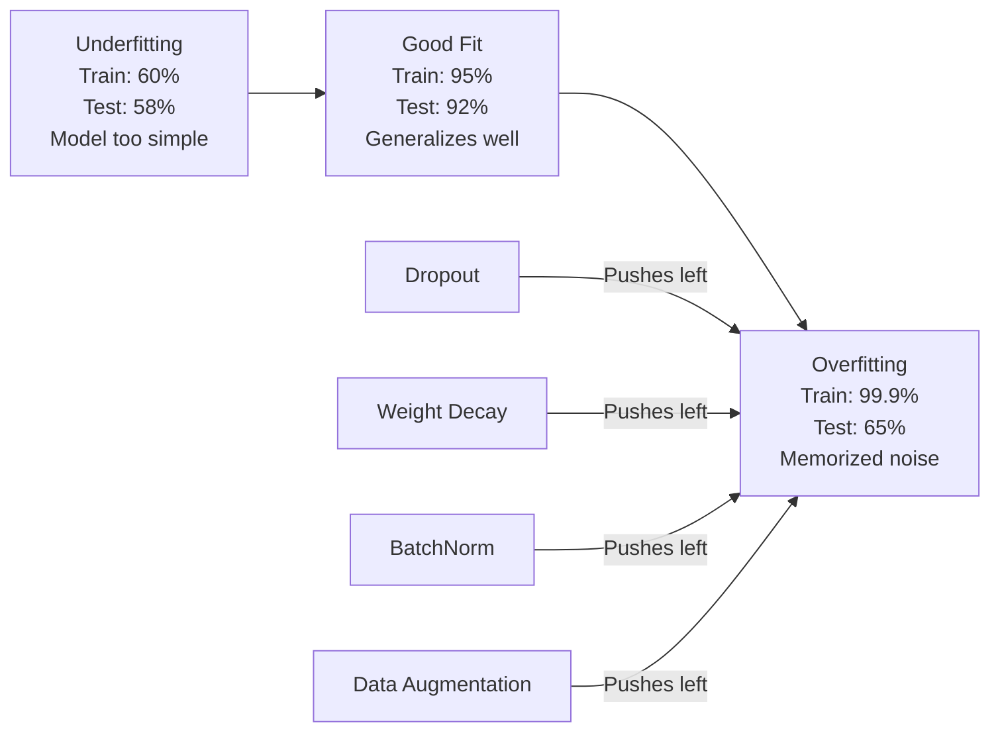
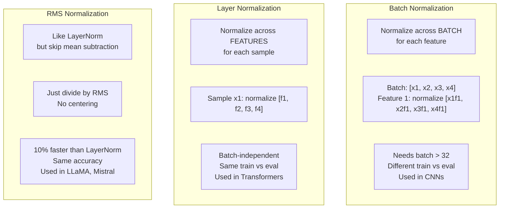
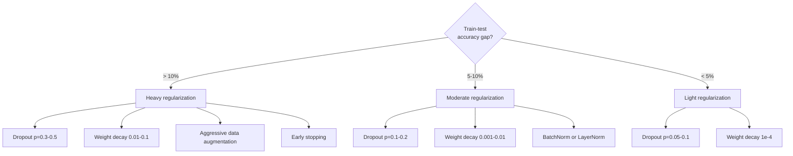

# Regularization / 正则化

> 你的 model 在 training data 上有 99%，在 test data 上只有 60%。它记住了数据，而不是学会了规律。Regularization 是你对 complexity 征收的税，用来迫使 model generalize。

**Type / 类型：** Build / 构建
**Languages / 语言：** Python
**Prerequisites / 前置知识：** Lesson 03.06 (Optimizers)
**Time / 时间：** 约 75 分钟

## Learning Objectives / 学习目标

- 从零实现带 inverted scaling 的 dropout、L2 weight decay、batch normalization、layer normalization 和 RMSNorm
- 测量 train-test accuracy gap，并用 regularization experiments 诊断 overfitting
- 解释为什么 transformers 使用 LayerNorm 而不是 BatchNorm，以及为什么现代 LLMs 更偏好 RMSNorm
- 根据 overfitting 的严重程度，应用正确组合的 regularization techniques

## The Problem / 问题

一个有足够多 parameters 的 neural network 可以记住任何 dataset。这不是假设。Zhang 等人（2017）通过在带 random labels 的 ImageNet 上训练标准 networks 证明了这一点。这些 networks 在完全随机的 label assignments 上达到接近 zero training loss。它们记住了 100 万个没有任何可学习模式的 random input-output pairs。Training loss 完美，test accuracy 为零。

这就是 overfitting problem，而且随着 models 变大，它会更严重。GPT-3 有 175 billion parameters。Training set 约有 500 billion tokens。有了这么多 parameters，model 有足够 capacity 逐字记住相当多 training data。没有 regularization，它只会复述 training examples，而不是学习可泛化的 patterns。

Training performance 和 test performance 之间的差距就是 overfitting gap。本课中的每种 technique 都从不同角度攻击这个 gap。Dropout 强迫 network 不依赖任何单个 neuron。Weight decay 防止任何单个 weight 变得过大。Batch normalization 会平滑 loss landscape，让 optimizer 找到更 flat、更可泛化的 minima。Layer normalization 做类似的事，但能在 batch normalization 失效的场景工作（small batches、variable-length sequences）。RMSNorm 通过去掉 mean calculation，让它再快 10%。每种 technique 都很简单。组合起来，它们就是“只会记忆的 model”和“能够泛化的 model”之间的区别。

## The Concept / 概念

### The Overfitting Spectrum / Overfitting 光谱

每个 model 都落在一个光谱上：一端是 underfitting（太简单，抓不住 pattern），另一端是 overfitting（太复杂，把 noise 也抓住了）。最佳平衡点在中间，regularization 会把 models 从 overfit 一侧往那里推。



### Dropout / Dropout

最简单、解释也最优雅的 regularization technique。训练期间，以 probability p 随机把每个 neuron's output 设为 zero。

```
output = activation(z) * mask    where mask[i] ~ Bernoulli(1 - p)
```

p = 0.5 时，每次 forward pass 都有一半 neurons 被置零。Network 必须学习 redundant representations，因为它无法预测哪些 neurons 可用。这会防止 co-adaptation，也就是 neurons 学会依赖某些特定 neurons 一定存在。

Ensemble interpretation：一个有 N 个 neurons 且使用 dropout 的 network，会创建 2^N 个可能的 subnetworks（每种 neurons 开或关的组合）。用 dropout 训练，近似于同时训练所有 2^N 个 subnetworks，每个 subnetwork 看到不同 mini-batches。Test time 时，你使用所有 neurons（no dropout），并把 outputs 按 (1 - p) 缩放，以匹配 training 期间的 expected value。这等价于对 2^N 个 subnetworks 的 predictions 做平均，用单个 model 得到一个巨大的 ensemble。

实践中，scaling 通常在训练期间应用，而不是测试期间（inverted dropout）：

```
During training:  output = activation(z) * mask / (1 - p)
During testing:   output = activation(z)   (no change needed)
```

这样更干净，因为 test code 根本不需要知道 dropout 的存在。

默认 rates：transformers 中 p = 0.1，MLPs 中 p = 0.5，CNNs 中 p = 0.2-0.3。更高 dropout = 更强 regularization = 更高 underfitting risk。

### Weight Decay (L2 Regularization) / Weight decay（L2 正则化）

把所有 weights 的 squared magnitude 加到 loss 中：

```
total_loss = task_loss + (lambda / 2) * sum(w_i^2)
```

Regularization term 的 gradient 是 lambda * w。这意味着每一步中，每个 weight 都会按其 magnitude 成比例地向 zero 收缩。Large weights 会被更重惩罚。Model 会被推向没有任何单个 weight 占主导的解。

为什么这能帮助 generalization：overfit models 往往有大 weights，会放大 training data 中的 noise。Weight decay 保持 weights 较小，限制 model 的 effective capacity，并强迫它依赖 robust、generalizable features，而不是记住的怪癖。

Lambda hyperparameter 控制强度。典型取值：

- 0.01 for AdamW on transformers
- 1e-4 for SGD on CNNs
- 0.1 for heavily overfit models

正如 lesson 06 所说：weight decay 和 L2 regularization 在 SGD 中等价，但在 Adam 中不等价。使用 Adam 训练时，始终使用 AdamW（decoupled weight decay）。

### Batch Normalization / 批归一化

在把每一层的 output 送入下一层之前，先在 mini-batch 维度上做 normalize。

对于某一层的 mini-batch activations：

```
mu = (1/B) * sum(x_i)           (batch mean)
sigma^2 = (1/B) * sum((x_i - mu)^2)   (batch variance)
x_hat = (x_i - mu) / sqrt(sigma^2 + eps)   (normalize)
y = gamma * x_hat + beta        (scale and shift)
```

Gamma 和 beta 是 learnable parameters，让 network 在必要时撤销 normalization。如果没有它们，你会强迫每一层 output 都是 zero-mean unit-variance，而这未必是 network 想要的。

**Training vs inference split:** 训练期间，mu 和 sigma 来自当前 mini-batch。Inference 期间，使用训练中累积的 running averages（exponential moving average，momentum = 0.1，含义是 90% old + 10% new）。

BatchNorm 为什么有效仍有争议。原论文声称它减少了 “internal covariate shift”（layer inputs 的 distribution 会随着 earlier layers 更新而变化）。Santurkar 等人（2018）证明这个解释是错的。真正原因是：BatchNorm 让 loss landscape 更平滑。Gradients 更可预测，Lipschitz constants 更小，optimizer 可以安全地走更大的 steps。这就是 BatchNorm 能让你使用更高 learning rates 并更快收敛的原因。

BatchNorm 有一个根本限制：它依赖 batch statistics。Batch size 为 1 时，mean 和 variance 没有意义。Small batches（< 32）时，statistics 噪声很大，会伤害 performance。这对 object detection（memory 限制 batch size）和 language modeling（sequence lengths 变化）等任务很重要。

### Layer Normalization / 层归一化

不是跨 batch normalize，而是跨 features normalize。对单个 sample：

```
mu = (1/D) * sum(x_j)           (feature mean)
sigma^2 = (1/D) * sum((x_j - mu)^2)   (feature variance)
x_hat = (x_j - mu) / sqrt(sigma^2 + eps)
y = gamma * x_hat + beta
```

D 是 feature dimension。每个 sample 独立 normalize，不依赖 batch size。这就是 transformers 使用 LayerNorm 而不是 BatchNorm 的原因。Sequences 长度可变，batch sizes 通常很小（generation 时甚至是 1），而且 training 和 inference 的计算完全一致。

Transformers 中的 LayerNorm 会应用在每个 self-attention block 和每个 feed-forward block 之后（Post-LN），或应用在它们之前（Pre-LN，训练更稳定）。

### RMSNorm / RMSNorm

去掉 mean subtraction 的 LayerNorm。由 Zhang & Sennrich（2019）提出。

```
rms = sqrt((1/D) * sum(x_j^2))
y = gamma * x / rms
```

就这样。没有 mean computation，也没有 beta parameter。观察结论是：LayerNorm 中的 re-centering（mean subtraction）对 model performance 贡献很小，但会消耗计算。去掉它，可以用约 10% 更低 overhead 获得相同 accuracy。

LLaMA、LLaMA 2、LLaMA 3、Mistral 以及大多数现代 LLMs 都使用 RMSNorm 而不是 LayerNorm。在数十亿 parameters 和数万亿 tokens 的规模下，这 10% 的节省非常可观。

### Normalization Comparison / 归一化对比



### Data Augmentation as Regularization / 作为 regularization 的数据增强

它不是 model modification，而是 data modification。对 training inputs 做变换，同时保留 labels：

- Images: random crop, flip, rotation, color jitter, cutout
- Text: synonym replacement, back-translation, random deletion
- Audio: time stretch, pitch shift, noise addition

效果与 regularization 相同：它增加了 training set 的 effective size，让 model 更难记住特定 examples。一个只以原始形式看过每张 image 一次的 model 可以记住它。一个见过每张 image 50 个 augmented versions 的 model，则被迫学习 invariant structure。

### Early Stopping / 早停

最简单的 regularizer：当 validation loss 开始上升时停止训练。那一刻 model 还没过拟合。实践中，你会每个 epoch 跟踪 validation loss，保存 best model，并继续训练一个 “patience” window（通常 5-20 epochs）。如果 validation loss 在 patience window 内没有改善，就停止并加载保存的 best model。

### When to Apply What / 何时应用什么



```figure
l2-regularization
```

## Build It / 动手构建

### Step 1: Dropout (Train and Eval Mode) / 第 1 步：Dropout（train 与 eval mode）

```python
import random
import math


class Dropout:
    def __init__(self, p=0.5):
        self.p = p
        self.training = True
        self.mask = None

    def forward(self, x):
        if not self.training:
            return list(x)
        self.mask = []
        output = []
        for val in x:
            if random.random() < self.p:
                self.mask.append(0)
                output.append(0.0)
            else:
                self.mask.append(1)
                output.append(val / (1 - self.p))
        return output

    def backward(self, grad_output):
        grads = []
        for g, m in zip(grad_output, self.mask):
            if m == 0:
                grads.append(0.0)
            else:
                grads.append(g / (1 - self.p))
        return grads
```

### Step 2: L2 Weight Decay / 第 2 步：L2 weight decay

```python
def l2_regularization(weights, lambda_reg):
    penalty = 0.0
    for w in weights:
        penalty += w * w
    return lambda_reg * 0.5 * penalty

def l2_gradient(weights, lambda_reg):
    return [lambda_reg * w for w in weights]
```

### Step 3: Batch Normalization / 第 3 步：Batch normalization

```python
class BatchNorm:
    def __init__(self, num_features, momentum=0.1, eps=1e-5):
        self.gamma = [1.0] * num_features
        self.beta = [0.0] * num_features
        self.eps = eps
        self.momentum = momentum
        self.running_mean = [0.0] * num_features
        self.running_var = [1.0] * num_features
        self.training = True
        self.num_features = num_features

    def forward(self, batch):
        batch_size = len(batch)
        if self.training:
            mean = [0.0] * self.num_features
            for sample in batch:
                for j in range(self.num_features):
                    mean[j] += sample[j]
            mean = [m / batch_size for m in mean]

            var = [0.0] * self.num_features
            for sample in batch:
                for j in range(self.num_features):
                    var[j] += (sample[j] - mean[j]) ** 2
            var = [v / batch_size for v in var]

            for j in range(self.num_features):
                self.running_mean[j] = (1 - self.momentum) * self.running_mean[j] + self.momentum * mean[j]
                self.running_var[j] = (1 - self.momentum) * self.running_var[j] + self.momentum * var[j]
        else:
            mean = list(self.running_mean)
            var = list(self.running_var)

        self.x_hat = []
        output = []
        for sample in batch:
            normalized = []
            out_sample = []
            for j in range(self.num_features):
                x_h = (sample[j] - mean[j]) / math.sqrt(var[j] + self.eps)
                normalized.append(x_h)
                out_sample.append(self.gamma[j] * x_h + self.beta[j])
            self.x_hat.append(normalized)
            output.append(out_sample)
        return output
```

### Step 4: Layer Normalization / 第 4 步：Layer normalization

```python
class LayerNorm:
    def __init__(self, num_features, eps=1e-5):
        self.gamma = [1.0] * num_features
        self.beta = [0.0] * num_features
        self.eps = eps
        self.num_features = num_features

    def forward(self, x):
        mean = sum(x) / len(x)
        var = sum((xi - mean) ** 2 for xi in x) / len(x)

        self.x_hat = []
        output = []
        for j in range(self.num_features):
            x_h = (x[j] - mean) / math.sqrt(var + self.eps)
            self.x_hat.append(x_h)
            output.append(self.gamma[j] * x_h + self.beta[j])
        return output
```

### Step 5: RMSNorm / 第 5 步：RMSNorm

```python
class RMSNorm:
    def __init__(self, num_features, eps=1e-6):
        self.gamma = [1.0] * num_features
        self.eps = eps
        self.num_features = num_features

    def forward(self, x):
        rms = math.sqrt(sum(xi * xi for xi in x) / len(x) + self.eps)
        output = []
        for j in range(self.num_features):
            output.append(self.gamma[j] * x[j] / rms)
        return output
```

### Step 6: Training With and Without Regularization / 第 6 步：有无 regularization 的训练

```python
def sigmoid(x):
    x = max(-500, min(500, x))
    return 1.0 / (1.0 + math.exp(-x))


def make_circle_data(n=200, seed=42):
    random.seed(seed)
    data = []
    for _ in range(n):
        x = random.uniform(-2, 2)
        y = random.uniform(-2, 2)
        label = 1.0 if x * x + y * y < 1.5 else 0.0
        data.append(([x, y], label))
    return data


class RegularizedNetwork:
    def __init__(self, hidden_size=16, lr=0.05, dropout_p=0.0, weight_decay=0.0):
        random.seed(0)
        self.hidden_size = hidden_size
        self.lr = lr
        self.dropout_p = dropout_p
        self.weight_decay = weight_decay
        self.dropout = Dropout(p=dropout_p) if dropout_p > 0 else None

        self.w1 = [[random.gauss(0, 0.5) for _ in range(2)] for _ in range(hidden_size)]
        self.b1 = [0.0] * hidden_size
        self.w2 = [random.gauss(0, 0.5) for _ in range(hidden_size)]
        self.b2 = 0.0

    def forward(self, x, training=True):
        self.x = x
        self.z1 = []
        self.h = []
        for i in range(self.hidden_size):
            z = self.w1[i][0] * x[0] + self.w1[i][1] * x[1] + self.b1[i]
            self.z1.append(z)
            self.h.append(max(0.0, z))

        if self.dropout and training:
            self.dropout.training = True
            self.h = self.dropout.forward(self.h)
        elif self.dropout:
            self.dropout.training = False
            self.h = self.dropout.forward(self.h)

        self.z2 = sum(self.w2[i] * self.h[i] for i in range(self.hidden_size)) + self.b2
        self.out = sigmoid(self.z2)
        return self.out

    def backward(self, target):
        eps = 1e-15
        p = max(eps, min(1 - eps, self.out))
        d_loss = -(target / p) + (1 - target) / (1 - p)
        d_sigmoid = self.out * (1 - self.out)
        d_out = d_loss * d_sigmoid

        for i in range(self.hidden_size):
            d_relu = 1.0 if self.z1[i] > 0 else 0.0
            d_h = d_out * self.w2[i] * d_relu
            self.w2[i] -= self.lr * (d_out * self.h[i] + self.weight_decay * self.w2[i])
            for j in range(2):
                self.w1[i][j] -= self.lr * (d_h * self.x[j] + self.weight_decay * self.w1[i][j])
            self.b1[i] -= self.lr * d_h
        self.b2 -= self.lr * d_out

    def evaluate(self, data):
        correct = 0
        total_loss = 0.0
        for x, y in data:
            pred = self.forward(x, training=False)
            eps = 1e-15
            p = max(eps, min(1 - eps, pred))
            total_loss += -(y * math.log(p) + (1 - y) * math.log(1 - p))
            if (pred >= 0.5) == (y >= 0.5):
                correct += 1
        return total_loss / len(data), correct / len(data) * 100

    def train_model(self, train_data, test_data, epochs=300):
        history = []
        for epoch in range(epochs):
            total_loss = 0.0
            correct = 0
            for x, y in train_data:
                pred = self.forward(x, training=True)
                self.backward(y)
                eps = 1e-15
                p = max(eps, min(1 - eps, pred))
                total_loss += -(y * math.log(p) + (1 - y) * math.log(1 - p))
                if (pred >= 0.5) == (y >= 0.5):
                    correct += 1
            train_loss = total_loss / len(train_data)
            train_acc = correct / len(train_data) * 100
            test_loss, test_acc = self.evaluate(test_data)
            history.append((train_loss, train_acc, test_loss, test_acc))
            if epoch % 75 == 0 or epoch == epochs - 1:
                gap = train_acc - test_acc
                print(f"    Epoch {epoch:3d}: train_acc={train_acc:.1f}%, test_acc={test_acc:.1f}%, gap={gap:.1f}%")
        return history
```

## Use It / 应用它

PyTorch 以 modules 形式提供所有 normalization 和 regularization：

```python
import torch
import torch.nn as nn

model = nn.Sequential(
    nn.Linear(784, 256),
    nn.BatchNorm1d(256),
    nn.ReLU(),
    nn.Dropout(0.3),
    nn.Linear(256, 128),
    nn.BatchNorm1d(128),
    nn.ReLU(),
    nn.Dropout(0.3),
    nn.Linear(128, 10),
)

model.train()
out_train = model(torch.randn(32, 784))

model.eval()
out_test = model(torch.randn(1, 784))
```

`model.train()` / `model.eval()` toggle 非常关键。它会打开/关闭 dropout，并告诉 BatchNorm 使用 batch statistics 还是 running statistics。Inference 前忘记 `model.eval()` 是 deep learning 中最常见的 bugs 之一。你的 test accuracy 会随机波动，因为 dropout 仍然 active，而且 BatchNorm 还在使用 mini-batch statistics。

对于 transformers，模式不同：

```python
class TransformerBlock(nn.Module):
    def __init__(self, d_model=512, nhead=8, dropout=0.1):
        super().__init__()
        self.attention = nn.MultiheadAttention(d_model, nhead, dropout=dropout)
        self.norm1 = nn.LayerNorm(d_model)
        self.ff = nn.Sequential(
            nn.Linear(d_model, d_model * 4),
            nn.GELU(),
            nn.Linear(d_model * 4, d_model),
            nn.Dropout(dropout),
        )
        self.norm2 = nn.LayerNorm(d_model)
        self.dropout = nn.Dropout(dropout)

    def forward(self, x):
        attended, _ = self.attention(x, x, x)
        x = self.norm1(x + self.dropout(attended))
        x = self.norm2(x + self.ff(x))
        return x
```

使用 LayerNorm，而不是 BatchNorm。Dropout p=0.1，而不是 p=0.5。这些是 transformer defaults。

## Ship It / 交付它

本课产出：
- `outputs/prompt-regularization-advisor.md` -- 一个 prompt，用来诊断 overfitting 并推荐正确 regularization strategy

## Exercises / 练习

1. 为 2D data 实现 spatial dropout：不是 drop individual neurons，而是 drop 整个 feature channels。可以把连续的 feature groups 当作 channels，并 drop 整组。在 hidden_size=32 的 circle dataset 上，对比它与 standard dropout 的 train-test gap。

2. 把 lesson 05 的 label smoothing 与本课的 dropout 组合起来。训练四种配置：都不用、只用 dropout、只用 label smoothing、两者都用。测量每种配置最终的 train-test accuracy gap。哪种组合 gap 最小？

3. 在 circle-dataset network 的 hidden layer 和 activation 之间加入 BatchNorm layer。在 learning rates 0.01、0.05、0.1 下分别训练有无 BatchNorm 的版本。BatchNorm 应该允许在 vanilla network 会 diverge 的更高 learning rates 下稳定训练。

4. 实现 early stopping：每个 epoch 跟踪 test loss，保存 best weights，如果 test loss 连续 20 epochs 没有改善就停止。让 regularized network 最多跑 1000 epochs。报告哪个 epoch 的 test accuracy 最好，以及你节省了多少 epochs 的计算。

5. 在 4-layer network（而不是只有 2 层）上比较 LayerNorm 与 RMSNorm。用相同 weights 初始化两者。训练 200 epochs，并比较 final accuracy、training speed（time per epoch）和 first layer 的 gradient magnitudes。验证 RMSNorm 在相同 accuracy 下更快。

## Key Terms / 关键术语

| 术语 | 常见说法 | 实际含义 |
|------|----------------|----------------------|
| Overfitting | “Model 记住了数据” | Model 的 training performance 明显高于 test performance，说明它学到的是 noise 而不是 signal |
| Regularization | “防止 overfitting” | 任何约束 model complexity 以提升 generalization 的技术：dropout、weight decay、normalization、augmentation |
| Dropout | “随机删除 neurons” | 训练期间以 probability p 把 random neurons 置零，强迫 redundant representations；等价于训练 ensemble |
| Weight decay | “L2 penalty” | 每一步减去 lambda * w，把所有 weights 向 zero 收缩；通过 weight magnitude 惩罚 complexity |
| Batch normalization | “按 batch normalize” | 训练期间使用 batch statistics、inference 期间使用 running averages，沿 batch dimension normalize layer outputs |
| Layer normalization | “按 sample normalize” | 在每个 sample 内跨 features normalize；不依赖 batch，用于 batch size 可变的 transformers |
| RMSNorm | “没有 mean 的 LayerNorm” | Root mean square normalization；去掉 LayerNorm 中的 mean subtraction，以相同 accuracy 换取约 10% speedup |
| Early stopping | “在 overfit 前停止” | 当 validation loss 不再改善时停止训练；最简单的 regularizer，通常和其他方法一起用 |
| Data augmentation | “用更少数据变出更多数据” | 对 training inputs 做变换（flip、crop、noise），增加 effective dataset size 并强迫学习 invariance |
| Generalization gap | “Train-test 差距” | Training 和 test performance 之间的差异；regularization 的目标是最小化这个 gap |

## Further Reading / 延伸阅读

- Srivastava et al., "Dropout: A Simple Way to Prevent Neural Networks from Overfitting" (2014) -- dropout 原始论文，包含 ensemble interpretation 和大量实验
- Ioffe & Szegedy, "Batch Normalization: Accelerating Deep Network Training by Reducing Internal Covariate Shift" (2015) -- 引入 BatchNorm 及其训练流程，是引用最多的 deep learning 论文之一
- Zhang & Sennrich, "Root Mean Square Layer Normalization" (2019) -- 证明 RMSNorm 能以更低计算量匹配 LayerNorm accuracy；被 LLaMA 和 Mistral 采用
- Zhang et al., "Understanding Deep Learning Requires Rethinking Generalization" (2017) -- 标志性论文，展示 neural networks 可以记住 random labels，挑战了传统 generalization 观点
