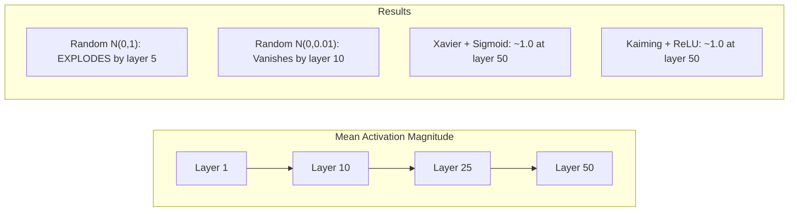
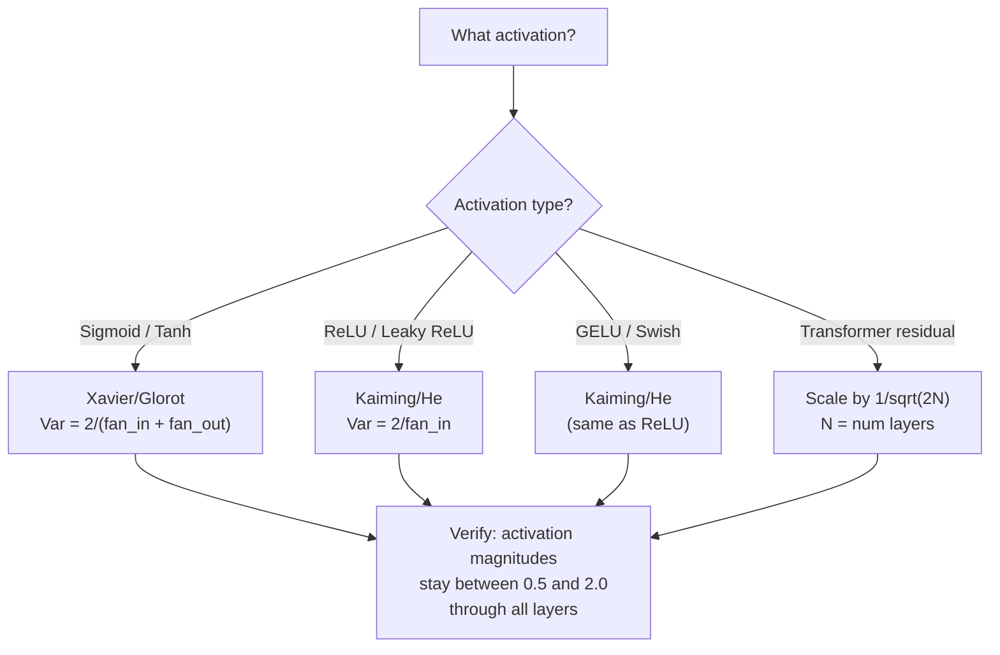

# Weight Initialization and Training Stability / 权重初始化与训练稳定性

> 初始化错了，训练根本开始不了。初始化对了，50 层也能像 3 层一样平滑训练。

**Type / 类型：** Build / 构建
**Languages / 语言：** Python
**Prerequisites / 前置知识：** Lesson 03.04 (Activation Functions), Lesson 03.07 (Regularization)
**Time / 时间：** 约 90 分钟

## Learning Objectives / 学习目标

- 实现 zero、random、Xavier/Glorot 和 Kaiming/He initialization strategies，并测量它们对 50 layers 中 activation magnitudes 的影响
- 推导为什么 Xavier init 使用 Var(w) = 2/(fan_in + fan_out)，而 Kaiming 使用 Var(w) = 2/fan_in
- 演示 zero initialization 的 symmetry problem，并解释为什么仅有 random scale 还不够
- 将正确 initialization strategy 匹配到 activation function：sigmoid/tanh 用 Xavier，ReLU/GELU 用 Kaiming

## The Problem / 问题

把所有 weights 初始化为 zero。什么都学不到。每个 neuron 计算同一个 function，收到同一个 gradient，并以相同方式更新。10,000 epochs 后，你的 512-neuron hidden layer 仍然是同一个 neuron 的 512 份拷贝。你为 512 个 parameters 付出了成本，却只得到了 1 个。

把它们初始化得太大。Activations 会在 network 中爆炸。到 layer 10，values 达到 1e15。到 layer 20，它们 overflow 成 infinity。Gradients 会沿反方向走同样轨迹。

从 standard normal distribution 随机初始化。3 layers 时能用。到 50 layers 时，signal 要么 collapse 到 zero，要么 detonates 到 infinity，取决于 random scale 是否略小或略大。“能工作”和“坏掉”之间的边界非常锋利。

Weight initialization 是 deep learning 中最被低估的决策。Architecture 会拿到论文，optimizers 会有博客文章，initialization 常常只有脚注。但如果它错了，其他东西都不重要：你的 network 在 training 开始前就已经死了。

## The Concept / 概念

### The Symmetry Problem / 对称性问题

一层中的每个 neuron 结构相同：把 inputs 乘以 weights，加 bias，应用 activation。如果所有 weights 从同一个 value 开始（zero 是极端情况），每个 neuron 都会计算同一个 output。在 backpropagation 中，每个 neuron 收到同一个 gradient。在 update step 中，每个 neuron 都改变同样的量。

你被卡住了。Network 有数百个 parameters，但它们都同步移动。这叫 symmetry，而 random initialization 是打破它的粗暴方式。每个 neuron 从 weight space 中不同位置开始，因此每个 neuron 会学到不同 feature。

但“random” 不够。Randomness 的 *scale* 决定了 network 是否能训练。

### Variance Propagation Through Layers / 方差如何穿过层传播

考虑一个有 fan_in 个 inputs 的单层：

```
z = w1*x1 + w2*x2 + ... + w_n*x_n
```

如果每个 weight wi 来自 variance 为 Var(w) 的 distribution，每个 input xi 的 variance 是 Var(x)，那么 output variance 是：

```
Var(z) = fan_in * Var(w) * Var(x)
```

如果 Var(w) = 1 且 fan_in = 512，output variance 是 input variance 的 512 倍。10 layers 后：512^10 = 1.2e27。你的 signal 已经爆炸。

如果 Var(w) = 0.001，output variance 每层会缩小 0.001 * 512 = 0.512。10 layers 后：0.512^10 = 0.00013。你的 signal 已经消失。

目标是：选择 Var(w)，让 Var(z) = Var(x)。Signal magnitude 在 layers 之间保持稳定。

### Xavier/Glorot Initialization / Xavier/Glorot 初始化

Glorot 和 Bengio（2010）为 sigmoid 和 tanh activations 推导了解法。为了在 forward 和 backward pass 中都保持 variance 常量：

```
Var(w) = 2 / (fan_in + fan_out)
```

实践中，weights 会从以下分布抽样：

```
w ~ Uniform(-limit, limit)  where limit = sqrt(6 / (fan_in + fan_out))
```

或：

```
w ~ Normal(0, sqrt(2 / (fan_in + fan_out)))
```

这之所以有效，是因为 sigmoid 和 tanh 在 zero 附近近似线性，而正确初始化的 activations 会停留在那里。Variance 可以穿过几十层仍然稳定。

### Kaiming/He Initialization / Kaiming/He 初始化

ReLU 会杀掉一半 outputs（所有负数都变成 zero）。Effective fan_in 减半，因为平均来说一半 inputs 被置零。Xavier init 没考虑这一点，它低估了所需 variance。

He 等人（2015）调整公式：

```
Var(w) = 2 / fan_in
```

Weights 从以下分布抽样：

```
w ~ Normal(0, sqrt(2 / fan_in))
```

这个 factor of 2 补偿了 ReLU 把一半 activations 置零的影响。没有它，signal 每层会缩小约 0.5 倍。50 layers 后：0.5^50 = 8.8e-16。Kaiming init 可以防止这种情况。

### Transformer Initialization / Transformer 初始化

GPT-2 引入了另一种模式。Residual connections 会把每个 sub-layer 的 output 加回 input：

```
x = x + sublayer(x)
```

每次相加都会增加 variance。有 N 个 residual layers 时，variance 会与 N 成比例增长。GPT-2 会把 residual layers 的 weights 缩放 1/sqrt(2N)，其中 N 是 layers 数量。这能保持累积 signal magnitude 稳定。

Llama 3（405B parameters，126 layers）使用类似方案。如果没有这种 scaling，residual stream 会在 126 layers 的 attention 和 feedforward blocks 中无界增长。

```mermaid
flowchart TD
    subgraph "Zero Init"
        Z1["Layer 1<br/>All weights = 0"] --> Z2["Layer 2<br/>All neurons identical"]
        Z2 --> Z3["Layer 3<br/>Still identical"]
        Z3 --> ZR["Result: 1 effective neuron<br/>regardless of width"]
    end

    subgraph "Xavier Init"
        X1["Layer 1<br/>Var = 2/(fan_in+fan_out)"] --> X2["Layer 2<br/>Signal stable"]
        X2 --> X3["Layer 50<br/>Signal stable"]
        X3 --> XR["Result: Trains with<br/>sigmoid/tanh"]
    end

    subgraph "Kaiming Init"
        K1["Layer 1<br/>Var = 2/fan_in"] --> K2["Layer 2<br/>Signal stable"]
        K2 --> K3["Layer 50<br/>Signal stable"]
        K3 --> KR["Result: Trains with<br/>ReLU/GELU"]
    end
```



### Activation Magnitude Through 50 Layers / 穿过 50 层的 activation magnitude



### Choosing the Right Init / 选择正确的 init



```figure
weight-init-variance
```

## Build It / 动手构建

### Step 1: Initialization Strategies / 第 1 步：Initialization strategies

四种初始化 weight matrix 的方式。每个函数返回一个 list of lists（2D matrix），其中 fan_in 是 columns，fan_out 是 rows。

```python
import math
import random


def zero_init(fan_in, fan_out):
    return [[0.0 for _ in range(fan_in)] for _ in range(fan_out)]


def random_init(fan_in, fan_out, scale=1.0):
    return [[random.gauss(0, scale) for _ in range(fan_in)] for _ in range(fan_out)]


def xavier_init(fan_in, fan_out):
    std = math.sqrt(2.0 / (fan_in + fan_out))
    return [[random.gauss(0, std) for _ in range(fan_in)] for _ in range(fan_out)]


def kaiming_init(fan_in, fan_out):
    std = math.sqrt(2.0 / fan_in)
    return [[random.gauss(0, std) for _ in range(fan_in)] for _ in range(fan_out)]
```

### Step 2: Activation Functions / 第 2 步：Activation functions

我们需要 sigmoid、tanh 和 ReLU，用它们测试每种 init strategy 与其预期 activation 的组合。

```python
def sigmoid(x):
    x = max(-500, min(500, x))
    return 1.0 / (1.0 + math.exp(-x))


def tanh_act(x):
    return math.tanh(x)


def relu(x):
    return max(0.0, x)
```

### Step 3: Forward Pass Through 50 Layers / 第 3 步：Forward pass 穿过 50 层

让 random data 穿过一个 deep network，并测量每一层的 mean activation magnitude。

```python
def forward_deep(init_fn, activation_fn, n_layers=50, width=64, n_samples=100):
    random.seed(42)
    layer_magnitudes = []

    inputs = [[random.gauss(0, 1) for _ in range(width)] for _ in range(n_samples)]

    for layer_idx in range(n_layers):
        weights = init_fn(width, width)
        biases = [0.0] * width

        new_inputs = []
        for sample in inputs:
            output = []
            for neuron_idx in range(width):
                z = sum(weights[neuron_idx][j] * sample[j] for j in range(width)) + biases[neuron_idx]
                output.append(activation_fn(z))
            new_inputs.append(output)
        inputs = new_inputs

        magnitudes = []
        for sample in inputs:
            magnitudes.append(sum(abs(v) for v in sample) / width)
        mean_mag = sum(magnitudes) / len(magnitudes)
        layer_magnitudes.append(mean_mag)

    return layer_magnitudes
```

### Step 4: The Experiment / 第 4 步：实验

运行所有组合：zero init、random N(0,1)、random N(0,0.01)、Xavier with sigmoid、Xavier with tanh、Kaiming with ReLU。打印关键 layers 的 magnitude。

```python
def run_experiment():
    configs = [
        ("Zero init + Sigmoid", lambda fi, fo: zero_init(fi, fo), sigmoid),
        ("Random N(0,1) + ReLU", lambda fi, fo: random_init(fi, fo, 1.0), relu),
        ("Random N(0,0.01) + ReLU", lambda fi, fo: random_init(fi, fo, 0.01), relu),
        ("Xavier + Sigmoid", xavier_init, sigmoid),
        ("Xavier + Tanh", xavier_init, tanh_act),
        ("Kaiming + ReLU", kaiming_init, relu),
    ]

    print(f"{'Strategy':<30} {'L1':>10} {'L5':>10} {'L10':>10} {'L25':>10} {'L50':>10}")
    print("-" * 80)

    for name, init_fn, act_fn in configs:
        mags = forward_deep(init_fn, act_fn)
        row = f"{name:<30}"
        for idx in [0, 4, 9, 24, 49]:
            val = mags[idx]
            if val > 1e6:
                row += f" {'EXPLODED':>10}"
            elif val < 1e-6:
                row += f" {'VANISHED':>10}"
            else:
                row += f" {val:>10.4f}"
        print(row)
```

### Step 5: Symmetry Demonstration / 第 5 步：对称性演示

展示 zero init 会产生 identical neurons。

```python
def symmetry_demo():
    random.seed(42)
    weights = zero_init(2, 4)
    biases = [0.0] * 4

    inputs = [0.5, -0.3]
    outputs = []
    for neuron_idx in range(4):
        z = sum(weights[neuron_idx][j] * inputs[j] for j in range(2)) + biases[neuron_idx]
        outputs.append(sigmoid(z))

    print("\nSymmetry Demo (4 neurons, zero init):")
    for i, out in enumerate(outputs):
        print(f"  Neuron {i}: output = {out:.6f}")
    all_same = all(abs(outputs[i] - outputs[0]) < 1e-10 for i in range(len(outputs)))
    print(f"  All identical: {all_same}")
    print(f"  Effective parameters: 1 (not {len(weights) * len(weights[0])})")
```

### Step 6: Layer-by-Layer Magnitude Report / 第 6 步：逐层 magnitude report

打印 activation magnitudes 穿过 50 layers 的可视化 bar chart。

```python
def magnitude_report(name, magnitudes):
    print(f"\n{name}:")
    for i, mag in enumerate(magnitudes):
        if i % 5 == 0 or i == len(magnitudes) - 1:
            if mag > 1e6:
                bar = "X" * 50 + " EXPLODED"
            elif mag < 1e-6:
                bar = "." + " VANISHED"
            else:
                bar_len = min(50, max(1, int(mag * 10)))
                bar = "#" * bar_len
            print(f"  Layer {i+1:3d}: {bar} ({mag:.6f})")
```

## Use It / 应用它

PyTorch 内置了这些函数：

```python
import torch
import torch.nn as nn

layer = nn.Linear(512, 256)

nn.init.xavier_uniform_(layer.weight)
nn.init.xavier_normal_(layer.weight)

nn.init.kaiming_uniform_(layer.weight, nonlinearity='relu')
nn.init.kaiming_normal_(layer.weight, nonlinearity='relu')

nn.init.zeros_(layer.bias)
```

当你调用 `nn.Linear(512, 256)` 时，PyTorch 默认使用 Kaiming uniform initialization。这就是多数简单 networks “just work” 的原因：PyTorch 已经做了正确选择。但当你构建 custom architectures，或深度超过 20 layers 时，你需要理解背后发生了什么，并可能覆盖默认值。

对于 transformers，HuggingFace models 通常会在自己的 `_init_weights` method 中处理 initialization。GPT-2 的实现会按 1/sqrt(N) 缩放 residual projections。如果你从零构建 transformer，需要自己加上这一点。

## Ship It / 交付它

本课产出：
- `outputs/prompt-init-strategy.md` -- 一个 prompt，用来诊断 weight initialization problems 并推荐正确 strategy

## Exercises / 练习

1. 增加 LeCun initialization（Var = 1/fan_in，为 SELU activation 设计）。用 LeCun init + tanh 运行 50-layer experiment，并与 Xavier + tanh 对比。

2. 实现 GPT-2 residual scaling：在加回 residual stream 之前，把每层 output 乘以 1/sqrt(2*N)。分别在有无 scaling 的情况下运行 50 layers，测量 residual magnitude 增长有多快。

3. 创建一个 “init health check” function：接收 network 的 layer dimensions 和 activation type，推荐正确 initialization，并在当前 init 会出问题时发出 warning。

4. 用 fan_in = 16 和 fan_in = 1024 分别运行实验。Xavier 和 Kaiming 会适应 fan_in，但 random init 不会。展示 layers 变大时，“works”和“breaks”之间的 gap 如何扩大。

5. 实现 orthogonal initialization（生成 random matrix，计算其 SVD，使用 orthogonal matrix U）。在 50 layers 的 ReLU networks 上与 Kaiming 对比。

## Key Terms / 关键术语

| 术语 | 常见说法 | 实际含义 |
|------|----------------|----------------------|
| Weight initialization | “随机设置 starting weights” | 选择 initial weight values 的策略，它决定 network 是否能训练 |
| Symmetry breaking | “让 neurons 变得不同” | 使用 random initialization 确保 neurons 学到不同 features，而不是计算 identical functions |
| Fan-in | “一个 neuron 的 inputs 数量” | Incoming connections 的数量，决定 input variance 如何在 weighted sum 中累积 |
| Fan-out | “一个 neuron 的 outputs 数量” | Outgoing connections 的数量，与 backpropagation 中保持 gradient variance 有关 |
| Xavier/Glorot init | “Sigmoid initialization” | Var(w) = 2/(fan_in + fan_out)，用于在 sigmoid 和 tanh activations 中保持 variance |
| Kaiming/He init | “ReLU initialization” | Var(w) = 2/fan_in，考虑了 ReLU 会把一半 activations 置零 |
| Variance propagation | “Signals 如何穿过 layers 增长或缩小” | 分析 activation variance 如何基于 weight scale 逐层变化的数学方法 |
| Residual scaling | “GPT-2 的 init trick” | 把 residual connection weights 缩放 1/sqrt(2N)，防止 variance 穿过 N 个 transformer layers 时增长 |
| Dead network | “什么都训练不了” | Poor initialization 导致所有 gradients 为 zero 或所有 activations 饱和的 network |
| Exploding activations | “Values 变成 infinity” | Weight variance 过高导致 activation magnitudes 穿过 layers 指数级增长 |

## Further Reading / 延伸阅读

- Glorot & Bengio, "Understanding the difficulty of training deep feedforward neural networks" (2010) -- Xavier initialization 原始论文，包含 variance analysis
- He et al., "Delving Deep into Rectifiers" (2015) -- 为 ReLU networks 引入 Kaiming initialization
- Radford et al., "Language Models are Unsupervised Multitask Learners" (2019) -- GPT-2 论文，包含 residual scaling initialization
- Mishkin & Matas, "All You Need is a Good Init" (2016) -- layer-sequential unit-variance initialization，是 analytical formulas 的经验替代方案
