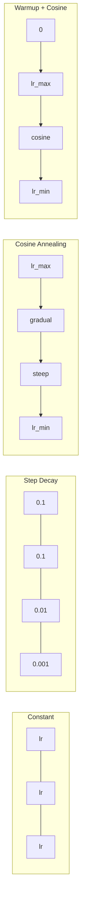
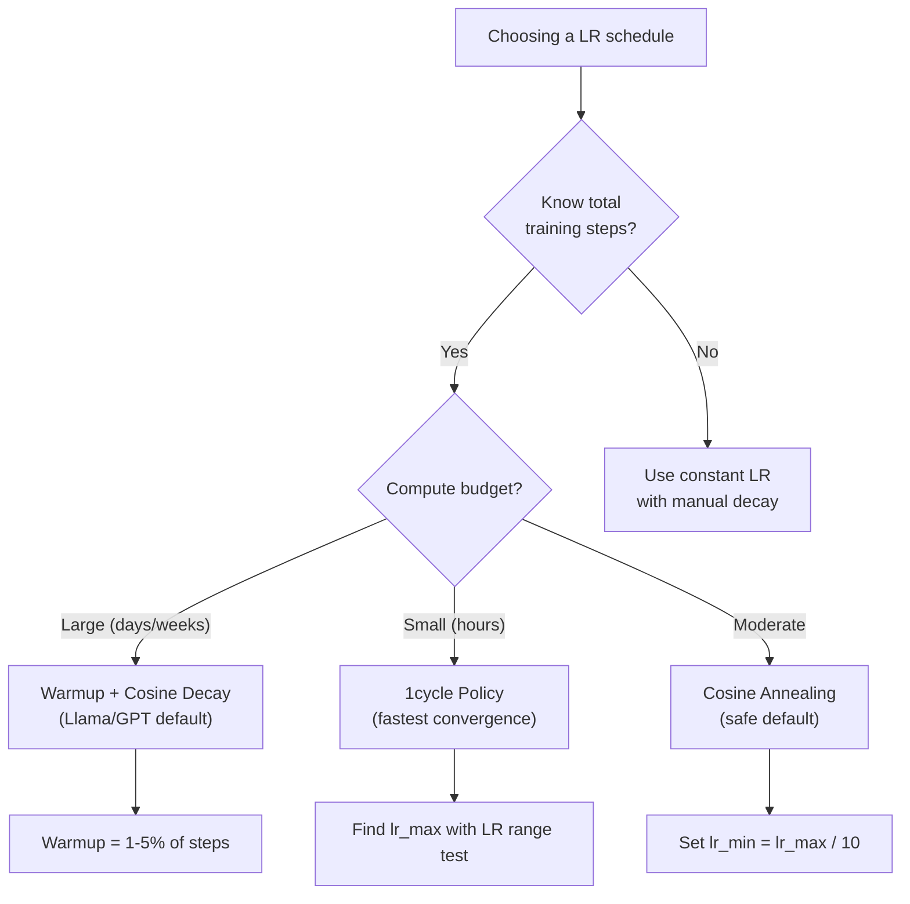
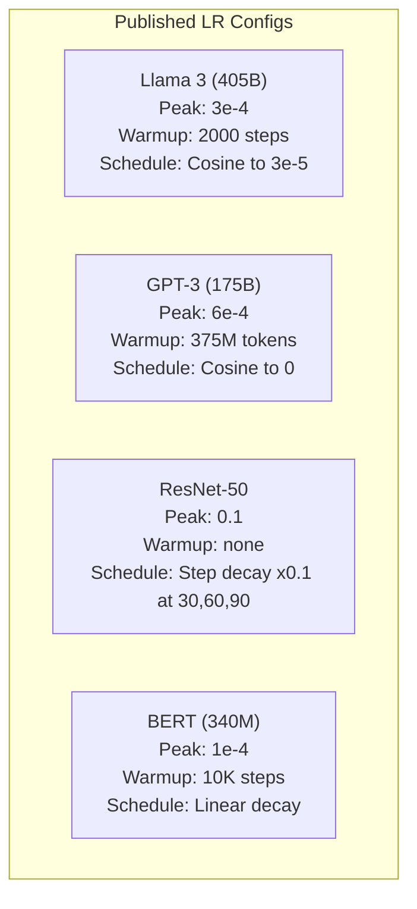

# Learning Rate Schedules and Warmup / 学习率调度与预热

> Learning rate 是最重要的单个 hyperparameter。不是 architecture，不是 dataset size，也不是 activation function。就是 learning rate。如果你只调一个东西，就调它。

**Type / 类型：** Build / 构建
**Languages / 语言：** Python
**Prerequisites / 前置知识：** Lesson 03.06 (Optimizers), Lesson 03.08 (Weight Initialization)
**Time / 时间：** 约 90 分钟

## Learning Objectives / 学习目标

- 从零实现 constant、step decay、cosine annealing、warmup + cosine 和 1cycle learning rate schedules
- 演示 learning rate selection 的三种 failure modes：divergence（太高）、stalling（太低）和 oscillation（没有 decay）
- 解释为什么 Adam-based optimizers 需要 warmup，以及 warmup 如何稳定 early training
- 在同一任务上比较五种 schedules 的 convergence speed，并为给定 training budget 选择合适方案

## The Problem / 问题

把 learning rate 设为 0.1。Training diverges，loss 在 3 steps 内跳到 infinity。设为 0.0001。Training crawls，100 epochs 后 model 几乎还停在 random 附近。设为 0.01。前 50 epochs 能训练，之后 loss 围绕某个 minimum 振荡，因为 steps 太大，永远到不了。

最优 learning rate 不是常数。它会在 training 过程中变化。训练早期，你希望用大 steps 快速覆盖空间。训练后期，你希望用很小的 steps 稳定落入一个 sharp minimum。90% accuracy model 和 95% accuracy model 的区别，往往只是 schedule。

过去三年发布的每个 major model 都使用 learning rate schedule。Llama 3 使用 peak lr=3e-4，2000 warmup steps，并 cosine decay 到 3e-5。GPT-3 使用 lr=6e-4，并在 375 million tokens 上 warmup。这些不是随意选择，而是耗费数百万美元 hyperparameter sweeps 的结果。

你需要理解 schedules，因为 defaults 不会自动适配你的问题。Fine-tune pretrained model 时，正确 schedule 与 from scratch training 不同。增大 batch size 时，warmup period 也需要变化。当 training 在 step 10,000 崩掉时，你需要判断这是 schedule problem 还是别的问题。

## The Concept / 概念

### Constant Learning Rate / 常数学习率

最简单的做法。选一个数字，每一步都用它。

```
lr(t) = lr_0
```

很少是最优选择。它要么对训练末期太高（围绕 minimum oscillation），要么对训练早期太低（在 tiny steps 上浪费 compute）。对 small models 和 debugging 还行。对任何训练超过一小时的东西都很糟。

### Step Decay / 阶梯衰减

ResNet 时代的 old-school 做法。在固定 epochs，把 learning rate 乘以一个 factor（通常 10x 降低）。

```
lr(t) = lr_0 * gamma^(floor(epoch / step_size))
```

当 gamma = 0.1 且 step_size = 30 时：每 30 epochs，lr 降低 10x。ResNet-50 用的就是这个：lr=0.1，并在 epochs 30、60、90 各降低 10x。

问题是：最优 decay points 依赖 dataset 和 architecture。换一个问题，你就需要重新调何时 drop。Transitions 也很突兀，rate 突然变化时 loss 可能 spike。

### Cosine Annealing / 余弦退火

按 cosine curve，从 maximum learning rate 平滑衰减到 minimum：

```
lr(t) = lr_min + 0.5 * (lr_max - lr_min) * (1 + cos(pi * t / T))
```

其中 t 是 current step，T 是 total number of steps。

t=0 时，cosine term 是 1，因此 lr = lr_max。t=T 时，cosine term 是 -1，因此 lr = lr_min。Decay 一开始很缓，中间加速，接近末尾时又变缓。

这是多数现代 training runs 的默认选择。除了 lr_max 和 lr_min 之外，没有太多 hyperparameters 要调。Cosine shape 符合经验观察：大部分 learning 发生在 training 中段，因此你希望在这个关键时期保持合理的 step size。

### Warmup: Why You Start Small / Warmup：为什么要从小开始

Adam 和其他 adaptive optimizers 会维护 gradient mean 和 variance 的 running estimates。在 step 0，这些 estimates 初始化为 zero。最初几次 gradient updates 基于很差的统计量。如果此时 learning rate 很大，model 会走出巨大且方向很差的 steps。

Warmup 修复这个问题。先从很小的 learning rate 开始（通常是 lr_max / warmup_steps，甚至从 zero 开始），在前 N steps 线性提升到 lr_max。当你达到 full learning rate 时，Adam 的 statistics 已经稳定。

```
lr(t) = lr_max * (t / warmup_steps)     for t < warmup_steps
```

典型 warmup：total training steps 的 1-5%。Llama 3 训练了约 1.8 trillion tokens，并 warmup 2000 steps。GPT-3 在 375 million tokens 上 warmup。

### Linear Warmup + Cosine Decay / 线性预热 + 余弦衰减

现代默认方案。先线性 ramp up，再 cosine decay：

```
if t < warmup_steps:
    lr(t) = lr_max * (t / warmup_steps)
else:
    progress = (t - warmup_steps) / (total_steps - warmup_steps)
    lr(t) = lr_min + 0.5 * (lr_max - lr_min) * (1 + cos(pi * progress))
```

Llama、GPT、PaLM 和多数现代 transformers 都用它。Warmup 防止早期不稳定。Cosine decay 让 model 落入一个好的 minimum。

### 1cycle Policy / 1cycle 策略

Leslie Smith 在 2018 年的发现：训练前半段把 learning rate 从低值 ramp up 到高值，后半段再 ramp down。听起来反直觉，为什么要在中途*提高* learning rate？

理论是：高 learning rate 会通过给 optimization trajectory 添加 noise 来充当 regularization。Model 在 ramp-up phase 会探索更多 loss landscape，找到更好的 basins。Ramp-down phase 再在找到的最佳 basin 中细化。

```
Phase 1 (0 to T/2):    lr ramps from lr_max/25 to lr_max
Phase 2 (T/2 to T):    lr ramps from lr_max to lr_max/10000
```

在固定 compute budget 下，1cycle 通常比 cosine annealing 训练得更快。Tradeoff 是：你必须提前知道 total number of steps。

### Schedule Shapes / Schedule 形状



### Decision Flowchart / 决策流程图



### Real Numbers from Published Models / 已发布模型中的真实数字



```figure
lr-schedule
```

## Build It / 动手构建

### Step 1: Schedule Functions / 第 1 步：Schedule functions

每个函数接收 current step，并返回该 step 的 learning rate。

```python
import math


def constant_schedule(step, lr=0.01, **kwargs):
    return lr


def step_decay_schedule(step, lr=0.1, step_size=100, gamma=0.1, **kwargs):
    return lr * (gamma ** (step // step_size))


def cosine_schedule(step, lr=0.01, total_steps=1000, lr_min=1e-5, **kwargs):
    if step >= total_steps:
        return lr_min
    return lr_min + 0.5 * (lr - lr_min) * (1 + math.cos(math.pi * step / total_steps))


def warmup_cosine_schedule(step, lr=0.01, total_steps=1000, warmup_steps=100, lr_min=1e-5, **kwargs):
    if total_steps <= warmup_steps:
        return lr * (step / max(warmup_steps, 1))
    if step < warmup_steps:
        return lr * step / warmup_steps
    progress = (step - warmup_steps) / (total_steps - warmup_steps)
    return lr_min + 0.5 * (lr - lr_min) * (1 + math.cos(math.pi * progress))


def one_cycle_schedule(step, lr=0.01, total_steps=1000, **kwargs):
    mid = max(total_steps // 2, 1)
    if step < mid:
        return (lr / 25) + (lr - lr / 25) * step / mid
    else:
        progress = (step - mid) / max(total_steps - mid, 1)
        return lr * (1 - progress) + (lr / 10000) * progress
```

### Step 2: Visualize All Schedules / 第 2 步：可视化所有 schedules

打印一个 text-based plot，展示每个 schedule 如何随 training 演进。

```python
def visualize_schedule(name, schedule_fn, total_steps=500, **kwargs):
    steps = list(range(0, total_steps, total_steps // 20))
    if total_steps - 1 not in steps:
        steps.append(total_steps - 1)

    lrs = [schedule_fn(s, total_steps=total_steps, **kwargs) for s in steps]
    max_lr = max(lrs) if max(lrs) > 0 else 1.0

    print(f"\n{name}:")
    for s, lr_val in zip(steps, lrs):
        bar_len = int(lr_val / max_lr * 40)
        bar = "#" * bar_len
        print(f"  Step {s:4d}: lr={lr_val:.6f} {bar}")
```

### Step 3: Training Network / 第 3 步：训练 network

在 circle dataset 上使用一个简单 two-layer network，与前面课程相同，但现在改变 schedule。

```python
import random


def sigmoid(x):
    x = max(-500, min(500, x))
    return 1.0 / (1.0 + math.exp(-x))


def relu(x):
    return max(0.0, x)


def relu_deriv(x):
    return 1.0 if x > 0 else 0.0


def make_circle_data(n=200, seed=42):
    random.seed(seed)
    data = []
    for _ in range(n):
        x = random.uniform(-2, 2)
        y = random.uniform(-2, 2)
        label = 1.0 if x * x + y * y < 1.5 else 0.0
        data.append(([x, y], label))
    return data


def train_with_schedule(schedule_fn, schedule_name, data, epochs=300, base_lr=0.05, **kwargs):
    random.seed(0)
    hidden_size = 8
    total_steps = epochs * len(data)

    std = math.sqrt(2.0 / 2)
    w1 = [[random.gauss(0, std) for _ in range(2)] for _ in range(hidden_size)]
    b1 = [0.0] * hidden_size
    w2 = [random.gauss(0, std) for _ in range(hidden_size)]
    b2 = 0.0

    step = 0
    epoch_losses = []

    for epoch in range(epochs):
        total_loss = 0
        correct = 0

        for x, target in data:
            lr = schedule_fn(step, lr=base_lr, total_steps=total_steps, **kwargs)

            z1 = []
            h = []
            for i in range(hidden_size):
                z = w1[i][0] * x[0] + w1[i][1] * x[1] + b1[i]
                z1.append(z)
                h.append(relu(z))

            z2 = sum(w2[i] * h[i] for i in range(hidden_size)) + b2
            out = sigmoid(z2)

            error = out - target
            d_out = error * out * (1 - out)

            for i in range(hidden_size):
                d_h = d_out * w2[i] * relu_deriv(z1[i])
                w2[i] -= lr * d_out * h[i]
                for j in range(2):
                    w1[i][j] -= lr * d_h * x[j]
                b1[i] -= lr * d_h
            b2 -= lr * d_out

            total_loss += (out - target) ** 2
            if (out >= 0.5) == (target >= 0.5):
                correct += 1
            step += 1

        avg_loss = total_loss / len(data)
        accuracy = correct / len(data) * 100
        epoch_losses.append(avg_loss)

    return epoch_losses
```

### Step 4: Compare All Schedules / 第 4 步：比较所有 schedules

用每种 schedule 训练同一个 network，比较 final loss 和 convergence behavior。

```python
def compare_schedules(data):
    configs = [
        ("Constant", constant_schedule, {}),
        ("Step Decay", step_decay_schedule, {"step_size": 15000, "gamma": 0.1}),
        ("Cosine", cosine_schedule, {"lr_min": 1e-5}),
        ("Warmup+Cosine", warmup_cosine_schedule, {"warmup_steps": 3000, "lr_min": 1e-5}),
        ("1cycle", one_cycle_schedule, {}),
    ]

    print(f"\n{'Schedule':<20} {'Start Loss':>12} {'Mid Loss':>12} {'End Loss':>12} {'Best Loss':>12}")
    print("-" * 70)

    for name, schedule_fn, extra_kwargs in configs:
        losses = train_with_schedule(schedule_fn, name, data, epochs=300, base_lr=0.05, **extra_kwargs)
        mid_idx = len(losses) // 2
        best = min(losses)
        print(f"{name:<20} {losses[0]:>12.6f} {losses[mid_idx]:>12.6f} {losses[-1]:>12.6f} {best:>12.6f}")
```

### Step 5: LR Too High vs Too Low / 第 5 步：LR 过高 vs 过低

演示三种 failure modes：too high（divergence）、too low（crawling）和 just right。

```python
def lr_sensitivity(data):
    learning_rates = [1.0, 0.1, 0.01, 0.001, 0.0001]

    print("\nLR Sensitivity (constant schedule, 100 epochs):")
    print(f"  {'LR':>10} {'Start Loss':>12} {'End Loss':>12} {'Status':>15}")
    print("  " + "-" * 52)

    for lr in learning_rates:
        losses = train_with_schedule(constant_schedule, f"lr={lr}", data, epochs=100, base_lr=lr)
        start = losses[0]
        end = losses[-1]

        if end > start or math.isnan(end) or end > 1.0:
            status = "DIVERGED"
        elif end > start * 0.9:
            status = "BARELY MOVED"
        elif end < 0.15:
            status = "CONVERGED"
        else:
            status = "LEARNING"

        end_str = f"{end:.6f}" if not math.isnan(end) else "NaN"
        print(f"  {lr:>10.4f} {start:>12.6f} {end_str:>12} {status:>15}")
```

## Use It / 应用它

PyTorch 在 `torch.optim.lr_scheduler` 中提供 schedulers：

```python
import torch
import torch.optim as optim
from torch.optim.lr_scheduler import CosineAnnealingLR, OneCycleLR, StepLR

model = nn.Sequential(nn.Linear(10, 64), nn.ReLU(), nn.Linear(64, 1))
optimizer = optim.Adam(model.parameters(), lr=3e-4)

scheduler = CosineAnnealingLR(optimizer, T_max=1000, eta_min=1e-5)

for step in range(1000):
    loss = train_step(model, optimizer)
    scheduler.step()
```

对于 warmup + cosine，可以使用 lambda scheduler，或 HuggingFace 的 `get_cosine_schedule_with_warmup`：

```python
from transformers import get_cosine_schedule_with_warmup

scheduler = get_cosine_schedule_with_warmup(
    optimizer,
    num_warmup_steps=2000,
    num_training_steps=100000,
)
```

HuggingFace function 是多数 Llama 和 GPT fine-tuning scripts 使用的方案。拿不准时，就用 warmup + cosine，warmup = total steps 的 3-5%。它几乎适用于所有场景。

## Ship It / 交付它

本课产出：
- `outputs/prompt-lr-schedule-advisor.md` -- 一个 prompt，用来为你的 training setup 推荐正确 learning rate schedule 和 hyperparameters

## Exercises / 练习

1. 实现 exponential decay：lr(t) = lr_0 * gamma^t，其中 gamma = 0.999。在 circle dataset 上与 cosine annealing 对比。

2. 实现 learning rate range test（Leslie Smith）：训练几百 steps，同时把 LR 从 1e-7 指数提升到 1。绘制 loss vs LR。最优 max LR 通常在 loss 开始上升前。

3. 使用 warmup + cosine 训练，但改变 warmup length：total steps 的 0%、1%、5%、10%、20%。找到 training 最稳定的 sweet spot。

4. 实现带 warm restarts 的 cosine annealing（SGDR）：每 T steps 把 learning rate 重置到 lr_max，然后再次 decay。在更长 training run 上与 standard cosine 对比。

5. 构建一个 “schedule surgeon”：监控 training loss，当 loss 稳定后自动从 warmup 切到 cosine；如果 loss plateau 太久，就降低 lr。

## Key Terms / 关键术语

| 术语 | 常见说法 | 实际含义 |
|------|----------------|----------------------|
| Learning rate | “Model 学得多快” | 乘在 gradient 上、决定 parameter update size 的 scalar |
| Schedule | “随时间改变 LR” | 一个把 training step 映射到 learning rate 的函数，用于优化 convergence |
| Warmup | “从小 LR 开始” | 在前 N steps 中把 LR 从接近 zero 线性提升到目标值，以稳定 optimizer statistics |
| Cosine annealing | “平滑 LR decay” | 在 training 中让 LR 按 cosine curve 从 lr_max 降到 lr_min |
| Step decay | “在 milestones 降低 LR” | 在固定 epoch 间隔把 LR 乘以一个 factor（通常 0.1） |
| 1cycle policy | “先升后降” | Leslie Smith 的方法：在单个 cycle 中先 ramp up LR，再 ramp down，以更快 convergence |
| LR range test | “找到最佳 learning rate” | 短暂训练并逐步提高 LR，找到 loss 开始 diverge 的位置 |
| Cosine with warm restarts | “重置并重复” | 定期把 LR 重置为 lr_max 再重新 decay（SGDR） |
| Eta min | “LR 的下限” | Schedule 最终 decay 到的 minimum learning rate |
| Peak learning rate | “最大 LR” | Training 中达到的最高 LR，通常在 warmup 之后 |

## Further Reading / 延伸阅读

- Loshchilov & Hutter, "SGDR: Stochastic Gradient Descent with Warm Restarts" (2017) -- 引入 cosine annealing 和 warm restarts
- Smith, "Super-Convergence: Very Fast Training of Neural Networks Using Large Learning Rates" (2018) -- 1cycle policy 论文
- Touvron et al., "Llama 2: Open Foundation and Fine-Tuned Chat Models" (2023) -- 记录了大规模使用的 warmup + cosine schedule
- Goyal et al., "Accurate, Large Minibatch SGD: Training ImageNet in 1 Hour" (2017) -- 大 batch training 的 linear scaling rule 和 warmup
