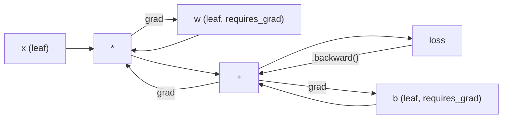
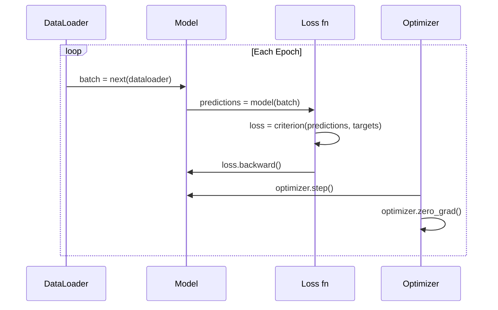

# Introduction to PyTorch / PyTorch 入门

> 你已经从活塞和曲轴开始造出了引擎。现在学习真正被大家开上路的那一台。

**Type / 类型：** Build / 构建
**Languages / 语言：** Python
**Prerequisites / 前置知识：** Lesson 03.10 (Build Your Own Mini Framework)
**Time / 时间：** 约 75 分钟

## Learning Objectives / 学习目标

- 使用 PyTorch 的 nn.Module、nn.Sequential 和 autograd 构建并训练 neural networks
- 使用 PyTorch tensors、GPU acceleration，以及标准 training loop（zero_grad、forward、loss、backward、step）
- 将你从零实现的 mini framework components 转换为对应的 PyTorch equivalents
- 在同一任务上 profile 并比较 pure-Python framework 与 PyTorch 的 training speed

## The Problem / 问题

你已经有一个可工作的 mini framework。Linear layers、ReLU、dropout、batch norm、Adam、DataLoader 和 training loop。它能用 pure Python 在 circle classification problem 上训练 4-layer network。

但在同一个问题上，它也比 PyTorch 慢 500 倍。

你的 mini framework 用嵌套 Python loops 一次处理一个 sample。PyTorch 会把同样的 operations dispatch 到优化过的 C++/CUDA kernels，并在 GPU 上运行。在单张 NVIDIA A100 上，PyTorch 训练一个 ResNet-50（25.6M parameters）和 ImageNet（1.28M images）大约需要 6 小时。你的 framework 在同一任务上大约需要 3,000 小时，而且还可能先耗尽内存。

速度不是唯一差距。你的 framework 没有 GPU support。没有 automatic differentiation，你为每个 module 手写 backward()。没有 serialization。没有 distributed training。没有 mixed precision。除了 print statements，没有调试 gradient flow 的办法。

PyTorch 补齐了所有这些缺口。同时，它保留了你已经构建出的同一套 mental model：Module、forward()、parameters()、backward()、optimizer.step()。概念是一一迁移的，语法也几乎相同。区别在于 PyTorch 把十年的 systems engineering 封装在你从零设计的同一个 interface 之后。

## The Concept / 概念

### Why PyTorch Won / 为什么 PyTorch 赢了

2015 年，TensorFlow 要求你先定义 static computation graph，再运行任何东西。你先构建 graph，编译它，然后把 data 喂进去。Debugging 意味着盯着 graph visualizations。改 architecture 意味着从头重建 graph。

PyTorch 在 2017 年以不同理念发布：eager execution。你写 Python，它马上运行。`y = model(x)` 真的会立刻计算 y，而不是“给之后才会计算 y 的 graph 加一个 node”。这意味着标准 Python debugging tools 能工作。print() 能工作。pdb 能工作。forward pass 里的 if/else 也能工作。

到 2020 年，市场已经给出答案。PyTorch 在 ML research papers 中的占比从 7%（2017）上升到超过 75%（2022）。Meta、Google DeepMind、OpenAI、Anthropic 和 Hugging Face 都把 PyTorch 作为主要 framework。TensorFlow 2.x 也采用 eager execution，这等于承认 PyTorch 的设计是正确的。

教训是：developer experience 会复利增长。一个慢 10% 但 debug 快 50% 的 framework，每次都会赢。

### Tensors / 张量

Tensor 是 multi-dimensional array，带三个关键属性：shape、dtype 和 device。

```python
import torch

x = torch.zeros(3, 4)           # shape: (3, 4), dtype: float32, device: cpu
x = torch.randn(2, 3, 224, 224) # batch of 2 RGB images, 224x224
x = torch.tensor([1, 2, 3])     # from a Python list
```

**Shape** 表示维度。Scalar 的 shape 是 ()，vector 是 (n,)，matrix 是 (m, n)，images batch 是 (batch, channels, height, width)。

**Dtype** 控制 precision 和 memory。

| dtype | Bits / 位数 | Range / 范围 | Use case / 使用场景 |
|-------|------|-------|----------|
| float32 | 32 | 约 7 位十进制数字 | 默认 training |
| float16 | 16 | 约 3.3 位十进制数字 | Mixed precision |
| bfloat16 | 16 | 与 float32 相同范围，precision 更低 | LLM training |
| int8 | 8 | -128 to 127 | Quantized inference |

**Device** 决定 computation 在哪里发生。

```python
device = torch.device("cuda" if torch.cuda.is_available() else "cpu")
x = torch.randn(3, 4, device=device)
x = x.to("cuda")
x = x.cpu()
```

每个 operation 都要求所有 tensors 在同一个 device 上。这是 beginners 最常遇到的 PyTorch error：`RuntimeError: Expected all tensors to be on the same device`。修复方式是在 computation 之前把所有东西都移动到同一 device。

**Reshaping** 是 constant-time 的：它改变 metadata，而不是 data。

```python
x = torch.randn(2, 3, 4)
x.view(2, 12)      # reshape to (2, 12) -- must be contiguous
x.reshape(6, 4)    # reshape to (6, 4) -- works always
x.permute(2, 0, 1) # reorder dimensions
x.unsqueeze(0)     # add dimension: (1, 2, 3, 4)
x.squeeze()        # remove size-1 dimensions
```

### Autograd / 自动求导

你的 mini framework 要求你为每个 module 实现 backward()。PyTorch 不需要。它会把 tensors 上的每个 operation 记录进 directed acyclic graph（computational graph），再反向遍历这张 graph 自动计算 gradients。



与你的 framework 的关键差异是：PyTorch 使用 tape-based autodiff。Forward pass 期间，每个 operation 都追加到一条 “tape” 上。调用 `.backward()` 会反向重放这条 tape。

```python
x = torch.randn(3, requires_grad=True)
y = x ** 2 + 3 * x
z = y.sum()
z.backward()
print(x.grad)  # dz/dx = 2x + 3
```

Autograd 有三条规则：

1. 只有带 `requires_grad=True` 的 leaf tensors 会累积 gradients
2. Gradients 默认会累积，因此每次 backward pass 前都要调用 `optimizer.zero_grad()`
3. `torch.no_grad()` 会关闭 gradient tracking（evaluation 时使用）

### nn.Module / nn.Module

`nn.Module` 是 PyTorch 中每个 neural network component 的 base class。你在 Lesson 10 已经构建过这个 abstraction。PyTorch 版本增加了 automatic parameter registration、recursive module discovery、device management 和 state dict serialization。

```python
import torch.nn as nn

class MLP(nn.Module):
    def __init__(self, input_dim, hidden_dim, output_dim):
        super().__init__()
        self.layer1 = nn.Linear(input_dim, hidden_dim)
        self.relu = nn.ReLU()
        self.layer2 = nn.Linear(hidden_dim, output_dim)

    def forward(self, x):
        x = self.layer1(x)
        x = self.relu(x)
        x = self.layer2(x)
        return x
```

当你在 `__init__` 中把 `nn.Module` 或 `nn.Parameter` 赋值为 attribute 时，PyTorch 会自动注册它。`model.parameters()` 会递归收集所有 registered parameters。这就是为什么你不再需要像 mini framework 中那样手动收集 weights。

关键 building blocks：

| Module | What it does / 作用 | Parameters / 参数量 |
|--------|-------------|------------|
| nn.Linear(in, out) | Wx + b | in*out + out |
| nn.Conv2d(in_ch, out_ch, k) | 2D convolution | in_ch*out_ch*k*k + out_ch |
| nn.BatchNorm1d(features) | Normalize activations | 2 * features |
| nn.Dropout(p) | Random zeroing | 0 |
| nn.ReLU() | max(0, x) | 0 |
| nn.GELU() | Gaussian error linear | 0 |
| nn.Embedding(vocab, dim) | Lookup table | vocab * dim |
| nn.LayerNorm(dim) | Per-sample normalization | 2 * dim |

### Loss Functions and Optimizers / Loss functions 与 optimizers

PyTorch 提供了你已经构建过的所有内容的 production-ready 版本。

**Loss functions**（来自 `torch.nn`）：

| Loss | Task / 任务 | Input / 输入 |
|------|------|-------|
| nn.MSELoss() | Regression | 任意 shape |
| nn.CrossEntropyLoss() | Multi-class classification | Logits（不是 softmax） |
| nn.BCEWithLogitsLoss() | Binary classification | Logits（不是 sigmoid） |
| nn.L1Loss() | Regression（robust） | 任意 shape |
| nn.CTCLoss() | Sequence alignment | Log probabilities |

注意：`CrossEntropyLoss` 内部组合了 `LogSoftmax` + `NLLLoss`。传入 raw logits，不要传 softmax outputs。这是一个常见错误，会悄悄产生错误 gradients。

**Optimizers**（来自 `torch.optim`）：

| Optimizer | When to use / 适用场景 | Typical LR / 典型 LR |
|-----------|-------------|-----------|
| SGD(params, lr, momentum) | CNNs、well-tuned pipelines | 0.01--0.1 |
| Adam(params, lr) | 默认起点 | 1e-3 |
| AdamW(params, lr, weight_decay) | Transformers、fine-tuning | 1e-4--1e-3 |
| LBFGS(params) | Small-scale、second-order | 1.0 |

### The Training Loop / 训练循环

每个 PyTorch training loop 都遵循同一个 5-step pattern。你已经在 Lesson 10 学过。



Canonical pattern：

```python
for epoch in range(num_epochs):
    model.train()
    for inputs, targets in train_loader:
        inputs, targets = inputs.to(device), targets.to(device)
        optimizer.zero_grad()
        outputs = model(inputs)
        loss = criterion(outputs, targets)
        loss.backward()
        optimizer.step()
```

Batch loop 中五行。训练 GPT-4、Stable Diffusion 和 LLaMA 的也是这五行。Architecture 会变，data 会变，这五行不变。

### Dataset and DataLoader / Dataset 与 DataLoader

PyTorch 的 `Dataset` 是一个带两个 methods 的 abstract class：`__len__` 和 `__getitem__`。`DataLoader` 会给它加上 batching、shuffling 和 multi-process data loading。

```python
from torch.utils.data import Dataset, DataLoader

class MNISTDataset(Dataset):
    def __init__(self, images, labels):
        self.images = images
        self.labels = labels

    def __len__(self):
        return len(self.labels)

    def __getitem__(self, idx):
        return self.images[idx], self.labels[idx]

loader = DataLoader(dataset, batch_size=64, shuffle=True, num_workers=4)
```

`num_workers=4` 会启动 4 个 processes，在 GPU 训练当前 batch 的同时并行加载 data。在 disk-bound workloads（large images、audio）上，仅这一项就可能让 training speed 翻倍。

### GPU Training / GPU 训练

把 model 移到 GPU：

```python
device = torch.device("cuda" if torch.cuda.is_available() else "cpu")
model = model.to(device)
```

这会递归地把每个 parameter 和 buffer 移到 GPU。然后在训练期间移动每个 batch：

```python
inputs, targets = inputs.to(device), targets.to(device)
```

**Mixed precision** 会在现代 GPUs（A100、H100、RTX 4090）上把 memory usage 减半、throughput 翻倍：forward/backward 使用 float16，master weights 仍保留 float32：

```python
from torch.amp import autocast, GradScaler

scaler = GradScaler()
for inputs, targets in loader:
    with autocast(device_type="cuda"):
        outputs = model(inputs)
        loss = criterion(outputs, targets)
    scaler.scale(loss).backward()
    scaler.step(optimizer)
    scaler.update()
    optimizer.zero_grad()
```

### Comparison: Mini Framework vs PyTorch vs JAX / 对比：Mini Framework vs PyTorch vs JAX

| Feature / 特性 | Mini Framework (L10) | PyTorch | JAX |
|---------|---------------------|---------|-----|
| Autodiff | Manual backward() | Tape-based autograd | Functional transforms |
| Execution | Eager (Python loops) | Eager (C++ kernels) | Traced + JIT compiled |
| GPU support | No | Yes (CUDA, ROCm, MPS) | Yes (CUDA, TPU) |
| Speed (MNIST MLP) | ~300s/epoch | ~0.5s/epoch | ~0.3s/epoch |
| Module system | Custom Module class | nn.Module | Stateless functions (Flax/Equinox) |
| Debugging | print() | print(), pdb, breakpoint() | Harder (JIT tracing breaks print) |
| Ecosystem | None | Hugging Face, Lightning, timm | Flax, Optax, Orbax |
| Learning curve | You built it | Moderate | Steep (functional paradigm) |
| Production use | Toy problems | Meta, OpenAI, Anthropic, HF | Google DeepMind, Midjourney |

```figure
dropout-mask
```

## Build It / 动手构建

一个只使用 PyTorch primitives 的 3-layer MLP，在 MNIST 上训练。没有 high-level wrappers。没有 `torchvision.datasets`。我们自己下载并解析 raw data。

### Step 1: Load MNIST From Raw Files / 第 1 步：从 raw files 加载 MNIST

MNIST 由 4 个 gzipped files 组成：training images（60,000 x 28 x 28）、training labels、test images（10,000 x 28 x 28）、test labels。我们下载它们并解析 binary format。

```python
import torch
import torch.nn as nn
import struct
import gzip
import urllib.request
import os

def download_mnist(path="./mnist_data"):
    base_url = "https://storage.googleapis.com/cvdf-datasets/mnist/"
    files = [
        "train-images-idx3-ubyte.gz",
        "train-labels-idx1-ubyte.gz",
        "t10k-images-idx3-ubyte.gz",
        "t10k-labels-idx1-ubyte.gz",
    ]
    os.makedirs(path, exist_ok=True)
    for f in files:
        filepath = os.path.join(path, f)
        if not os.path.exists(filepath):
            urllib.request.urlretrieve(base_url + f, filepath)

def load_images(filepath):
    with gzip.open(filepath, "rb") as f:
        magic, num, rows, cols = struct.unpack(">IIII", f.read(16))
        data = f.read()
        images = torch.frombuffer(bytearray(data), dtype=torch.uint8)
        images = images.reshape(num, rows * cols).float() / 255.0
    return images

def load_labels(filepath):
    with gzip.open(filepath, "rb") as f:
        magic, num = struct.unpack(">II", f.read(8))
        data = f.read()
        labels = torch.frombuffer(bytearray(data), dtype=torch.uint8).long()
    return labels
```

### Step 2: Define the Model / 第 2 步：定义 model

一个 3-layer MLP：784 -> 256 -> 128 -> 10。ReLU activations。Dropout 做 regularization。为了简洁，不使用 batch norm。

```python
class MNISTModel(nn.Module):
    def __init__(self):
        super().__init__()
        self.net = nn.Sequential(
            nn.Linear(784, 256),
            nn.ReLU(),
            nn.Dropout(0.2),
            nn.Linear(256, 128),
            nn.ReLU(),
            nn.Dropout(0.2),
            nn.Linear(128, 10),
        )

    def forward(self, x):
        return self.net(x)
```

Output layer 产生 10 个 raw logits（每个 digit 一个）。没有 softmax，`CrossEntropyLoss` 会在内部处理。

Parameter count：784*256 + 256 + 256*128 + 128 + 128*10 + 10 = 235,146。按现代标准很小。GPT-2 small 有 124M。这个模型几秒就能训练完。

### Step 3: Training Loop / 第 3 步：Training loop

Canonical forward-loss-backward-step pattern。

```python
def train_one_epoch(model, loader, criterion, optimizer, device):
    model.train()
    total_loss = 0
    correct = 0
    total = 0
    for images, labels in loader:
        images, labels = images.to(device), labels.to(device)
        optimizer.zero_grad()
        outputs = model(images)
        loss = criterion(outputs, labels)
        loss.backward()
        optimizer.step()
        total_loss += loss.item() * images.size(0)
        _, predicted = outputs.max(1)
        correct += predicted.eq(labels).sum().item()
        total += labels.size(0)
    return total_loss / total, correct / total


def evaluate(model, loader, criterion, device):
    model.eval()
    total_loss = 0
    correct = 0
    total = 0
    with torch.no_grad():
        for images, labels in loader:
            images, labels = images.to(device), labels.to(device)
            outputs = model(images)
            loss = criterion(outputs, labels)
            total_loss += loss.item() * images.size(0)
            _, predicted = outputs.max(1)
            correct += predicted.eq(labels).sum().item()
            total += labels.size(0)
    return total_loss / total, correct / total
```

注意 evaluation 期间的 `torch.no_grad()`。它会关闭 autograd，减少 memory usage 并加快 inference。没有它，PyTorch 会构建一张你根本不会用的 computational graph。

### Step 4: Wire Everything Together / 第 4 步：把所有东西接起来

```python
def main():
    device = torch.device("cuda" if torch.cuda.is_available() else "cpu")

    download_mnist()
    train_images = load_images("./mnist_data/train-images-idx3-ubyte.gz")
    train_labels = load_labels("./mnist_data/train-labels-idx1-ubyte.gz")
    test_images = load_images("./mnist_data/t10k-images-idx3-ubyte.gz")
    test_labels = load_labels("./mnist_data/t10k-labels-idx1-ubyte.gz")

    train_dataset = torch.utils.data.TensorDataset(train_images, train_labels)
    test_dataset = torch.utils.data.TensorDataset(test_images, test_labels)
    train_loader = torch.utils.data.DataLoader(
        train_dataset, batch_size=64, shuffle=True
    )
    test_loader = torch.utils.data.DataLoader(
        test_dataset, batch_size=256, shuffle=False
    )

    model = MNISTModel().to(device)
    criterion = nn.CrossEntropyLoss()
    optimizer = torch.optim.Adam(model.parameters(), lr=1e-3)

    num_params = sum(p.numel() for p in model.parameters())
    print(f"Device: {device}")
    print(f"Parameters: {num_params:,}")
    print(f"Train samples: {len(train_dataset):,}")
    print(f"Test samples: {len(test_dataset):,}")
    print()

    for epoch in range(10):
        train_loss, train_acc = train_one_epoch(
            model, train_loader, criterion, optimizer, device
        )
        test_loss, test_acc = evaluate(
            model, test_loader, criterion, device
        )
        print(
            f"Epoch {epoch+1:2d} | "
            f"Train Loss: {train_loss:.4f} | Train Acc: {train_acc:.4f} | "
            f"Test Loss: {test_loss:.4f} | Test Acc: {test_acc:.4f}"
        )

    torch.save(model.state_dict(), "mnist_mlp.pt")
    print(f"\nModel saved to mnist_mlp.pt")
    print(f"Final test accuracy: {test_acc:.4f}")
```

10 epochs 后的 expected output：约 97.8% test accuracy。CPU 上 training time 约 30 秒，GPU 上约 5 秒。用同样 architecture 的 mini framework，大约 45 分钟。

## Use It / 应用它

### Quick Comparison: Mini Framework vs PyTorch / 快速对比：Mini Framework vs PyTorch

| Mini Framework (Lesson 10) | PyTorch |
|---------------------------|---------|
| `model = Sequential(Linear(784, 256), ReLU(), ...)` | `model = nn.Sequential(nn.Linear(784, 256), nn.ReLU(), ...)` |
| `pred = model.forward(x)` | `pred = model(x)` |
| `optimizer.zero_grad()` | `optimizer.zero_grad()` |
| `grad = criterion.backward()` then `model.backward(grad)` | `loss.backward()` |
| `optimizer.step()` | `optimizer.step()` |
| No GPU | `model.to("cuda")` |
| Manual backward for every module | Autograd handles everything |

Interface 几乎相同。区别全在底层。

### Saving and Loading Models / 保存与加载模型

```python
torch.save(model.state_dict(), "model.pt")

model = MNISTModel()
model.load_state_dict(torch.load("model.pt", weights_only=True))
model.eval()
```

始终保存 `state_dict()`（parameter dictionary），不要保存 model object。保存 model object 会使用 pickle，重构代码后很容易坏。State dicts 更可移植。

### Learning Rate Scheduling / Learning rate scheduling

```python
scheduler = torch.optim.lr_scheduler.CosineAnnealingLR(
    optimizer, T_max=10
)
for epoch in range(10):
    train_one_epoch(model, train_loader, criterion, optimizer, device)
    scheduler.step()
```

PyTorch 提供 15+ schedulers：StepLR、ExponentialLR、CosineAnnealingLR、OneCycleLR、ReduceLROnPlateau。它们都接入同一个 optimizer interface。

## Ship It / 交付它

本课产出两个 artifacts：

- `outputs/prompt-pytorch-debugger.md` -- 一个用于诊断常见 PyTorch training failures 的 prompt
- `outputs/skill-pytorch-patterns.md` -- 一个 PyTorch training patterns 的 skill reference

## Exercises / 练习

1. **加入 batch normalization。** 在每个 linear layer 之后、activation 之前插入 `nn.BatchNorm1d`。比较它与 dropout-only 版本的 test accuracy 和 training speed。Batch norm 应该用更少 epochs 达到 98%+。

2. **实现 learning rate finder。** 用指数递增的 learning rate（从 1e-7 到 1.0）训练一个 epoch。绘制 loss vs LR。最优 LR 通常在 loss 开始上升前。用它为 MNIST model 选择更好的 LR。

3. **移植到 GPU 并使用 mixed precision。** 在 training loop 中加入 `torch.amp.autocast` 和 `GradScaler`。在 GPU 上测量有无 mixed precision 的 throughput（samples/second）。在 A100 上预计约 2x speedup。

4. **构建 custom Dataset。** 下载 Fashion-MNIST（格式与 MNIST 相同，但内容是 clothing items）。实现一个带 `__getitem__` 和 `__len__` 的 `FashionMNISTDataset(Dataset)` class。训练同一个 MLP 并比较 accuracy。Fashion-MNIST 更难，预期约 88%，而 MNIST 约 98%。

5. **用 SGD + momentum 替换 Adam。** 使用 `SGD(params, lr=0.01, momentum=0.9)` 训练。比较 convergence curves。然后加入 `CosineAnnealingLR` scheduler，观察 SGD 是否能在 epoch 10 追上 Adam。

## Key Terms / 关键术语

| 术语 | 常见说法 | 实际含义 |
|------|----------------|----------------------|
| Tensor | “多维数组” | 一个 typed、device-aware array，每个 operation 都内置 automatic differentiation support |
| Autograd | “自动 backprop” | Tape-based system，在 forward pass 中记录 operations，再反向重放以计算精确 gradients |
| nn.Module | “一层” | 任意 differentiable computation block 的 base class；注册 parameters、支持 nesting、处理 train/eval modes |
| state_dict | “Model weights” | 一个 OrderedDict，把 parameter names 映射到 tensors，是 trained model 的可移植、可序列化表示 |
| .backward() | “计算 gradients” | 反向遍历 computational graph，为每个带 requires_grad=True 的 leaf tensor 计算并累积 gradients |
| .to(device) | “移到 GPU” | 递归把所有 parameters 和 buffers 转移到指定 device（CPU、CUDA、MPS） |
| DataLoader | “数据管线” | 一个 iterator，从 Dataset 中 batching、shuffling，并可选地并行加载 data |
| Mixed precision | “使用 float16” | 用 float16 做 forward/backward 来提速，同时保留 float32 master weights 以保证 numerical stability |
| Eager execution | “立刻运行” | Operations 在调用时立即执行，而不是延迟到之后的 compilation step；这是 PyTorch 区分于 TF 1.x 的核心设计 |
| zero_grad | “重置 gradients” | 在下一次 backward pass 前，把所有 parameter gradients 设为 zero，因为 PyTorch 默认会累积 gradients |

## Further Reading / 延伸阅读

- Paszke et al., "PyTorch: An Imperative Style, High-Performance Deep Learning Library" (2019) -- 解释 PyTorch 设计权衡的原始论文
- PyTorch Tutorials: "Learning PyTorch with Examples" (https://pytorch.org/tutorials/beginner/pytorch_with_examples.html) -- 从 tensors 到 nn.Module 的官方路径
- PyTorch Performance Tuning Guide (https://pytorch.org/tutorials/recipes/recipes/tuning_guide.html) -- mixed precision、DataLoader workers、pinned memory 和其他 production optimizations
- Horace He, "Making Deep Learning Go Brrrr" (https://horace.io/brrr_intro.html) -- 解释 GPU training 为什么快，并包含 PyTorch-specific optimization strategies
