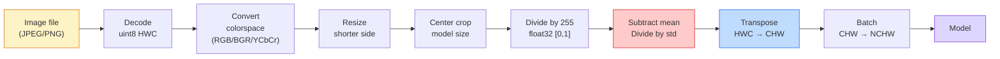
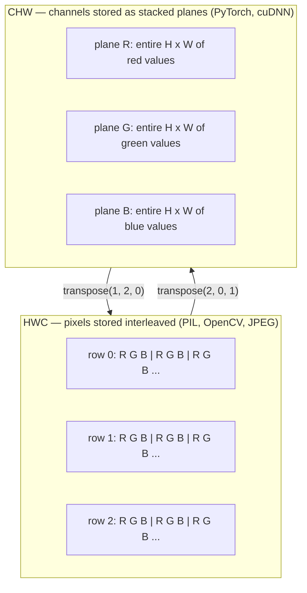

# Image Fundamentals — Pixels, Channels, Color Spaces / 图像基础：像素、通道与色彩空间

> 图像是光照采样组成的张量。你以后会用到的每一个视觉模型，都从这个事实开始。

**Type / 类型：** Build / 构建
**Languages / 语言：** Python
**Prerequisites / 前置知识：** Phase 1 Lesson 12 (Tensor Operations), Phase 3 Lesson 11 (Intro to PyTorch)
**Time / 时间：** 约 45 分钟

## Learning Objectives / 学习目标

- 解释连续场景如何被离散成像素，以及 sampling / quantization 的决策为什么会给所有下游模型设定上限
- 把图像当作 NumPy array 读取、切片和检查，并能在 HWC 与 CHW 布局之间熟练切换
- 在 RGB、grayscale、HSV 和 YCbCr 之间转换，并说明每种 color space 存在的原因
- 按 torchvision 预期的方式精确执行像素级 preprocessing（normalize、standardize、resize、channel-first）

## The Problem / 问题

你会读到的每篇论文、下载的每份 pretrained weight、调用的每个 vision API，都默认输入采用某种特定编码。模型需要 `float32`，你却传入 `uint8` 图像，它仍然会运行，并悄悄输出垃圾结果。把 BGR 喂给一个用 RGB 训练的网络，accuracy 会掉十几个点。模型期待 channels-first，你却给它 channels-last，第一层 conv 会把高度当成 feature channel。这些问题通常不会抛错，只会毁掉指标，让你花一周去找一个其实藏在文件加载方式里的 bug。

一旦你知道 convolution 在什么东西上滑动，它并不复杂。难点在于，“一张图像”对相机、JPEG decoder、PIL、OpenCV、torchvision 和 CUDA kernel 来说含义都不同。每个 stack 都有自己的 axis order、byte range 和 channel convention。不能把这些理清楚的视觉工程师，会把坏 pipeline 发到线上。

这一课先把基础打牢，后面整个 phase 都会依赖它。学完以后，你会知道 pixel 是什么，为什么每个 pixel 通常有三个数字而不是一个，所谓 “normalize with ImageNet stats” 到底做了什么，以及如何在本 phase 其他课程默认使用的两三种 layout 之间切换。

## The Concept / 概念

### The full preprocessing pipeline at a glance / 完整 preprocessing pipeline 一览

每个生产级视觉系统都是一串可逆 transform。只要其中一步错了，模型看到的输入就不再是它训练时见过的输入。



红色和蓝色这两个位置，承载了 80% 的静默失败：漏掉 standardization，以及 layout 搞错。

### A pixel is a sample, not a square / pixel 是采样，不是小方块

相机传感器会统计落在一格格微小 detector 上的光子。每个 detector 在短时间内积分光照，并输出一个与入射光子数量成正比的电压。传感器随后把这个电压离散成整数。一个 detector 就变成一个 pixel。

```
Continuous scene                 Sensor grid                     Digital image
(infinite detail)                (H x W detectors)               (H x W integers)

    ~~~~~                        +--+--+--+--+--+                 210 198 180 155 120
   ~   ~   ~                     |  |  |  |  |  |                 205 195 178 152 118
  ~ light ~      ---->           +--+--+--+--+--+     ---->       200 190 175 150 115
   ~~~~~                         |  |  |  |  |  |                 195 185 170 148 112
                                 +--+--+--+--+--+                 188 180 165 145 108
```

这一步会发生两个选择，它们决定了后续所有环节的上限：

- **Spatial sampling / 空间采样** 决定每一度场景里放多少 detector。太少，边缘会变成锯齿（aliasing）；太多，存储和计算会爆炸。
- **Intensity quantization / 强度量化** 决定电压被分桶得有多细。8 bits 给出 256 个 level，是显示场景的标准。10、12、16 bits 能保留更平滑的梯度，对医学影像、HDR 和 raw sensor pipeline 很重要。

Pixel 不是有面积的彩色方块，而是一次测量。resize 或 rotate 时，你是在重新采样这个测量网格。

### Why three channels / 为什么是三个通道

一个 detector 会统计整个可见光谱里的光子，这就是 grayscale。为了得到颜色，传感器会在网格上覆盖红、绿、蓝滤光片组成的 mosaic。经过 demosaicing 后，每个空间位置都有三个整数：附近红色滤光 detector、绿色滤光 detector 和蓝色滤光 detector 的响应。三者组成一个 pixel 的 RGB triplet。

```
One pixel in memory:

    (R, G, B) = (210, 140, 30)   <- reddish-orange

An H x W RGB image:

    shape (H, W, 3)     stored as   H rows of W pixels of 3 values
                                    each in [0, 255] for uint8
```

“三个”并不神奇。Depth camera 会增加 Z channel。卫星会增加红外和紫外波段。医学扫描常常只有一个 channel（X-ray、CT），也可能有很多 channel（hyperspectral）。Channel 数量就是最后一个 axis；conv layer 会学习如何跨 channel 混合信息。

### Two layout conventions: HWC and CHW / 两种 layout 约定：HWC 和 CHW

同一个 tensor，有两种轴顺序。每个库都会选一种。

```
HWC (height, width, channels)           CHW (channels, height, width)

   W ->                                    H ->
  +-----+-----+-----+                     +-----+-----+
H |R G B|R G B|R G B|                   C |R R R R R R|
| +-----+-----+-----+                   | +-----+-----+
v |R G B|R G B|R G B|                   v |G G G G G G|
  +-----+-----+-----+                     +-----+-----+
                                          |B B B B B B|
                                          +-----+-----+

   PIL, OpenCV, matplotlib,              PyTorch, most deep learning
   almost every image file on disk       frameworks, cuDNN kernels
```

CHW 存在的原因是 convolution kernel 会沿着 H 和 W 滑动。把 channel axis 放在最前面，意味着每个 kernel 看到的是每个 channel 上连续的 2D plane，方便向量化。磁盘格式使用 HWC，是因为它符合 sensor scanline 输出的顺序。

你会输入上千次的一行转换：

```
img_chw = img_hwc.transpose(2, 0, 1)      # NumPy
img_chw = img_hwc.permute(2, 0, 1)        # PyTorch tensor
```

Memory layout 可视化如下：



### Byte ranges and dtype / byte range 与 dtype

三种约定最常见：

| Convention / 约定 | dtype | Range / 范围 | Where you see it / 出现位置 |
|------------|-------|-------|------------------|
| Raw | `uint8` | [0, 255] | Files on disk, PIL, OpenCV output |
| Normalized | `float32` | [0.0, 1.0] | After `img.astype('float32') / 255` |
| Standardized | `float32` | roughly [-2, +2] | After subtracting mean and dividing by std |

Convolutional network 训练时使用的是 standardized input。ImageNet stats `mean=[0.485, 0.456, 0.406]`、`std=[0.229, 0.224, 0.225]` 是在完整 ImageNet training set 上，对 [0, 1] normalized pixel 逐 channel 计算得到的 arithmetic mean 和 standard deviation。把 raw `uint8` 喂给期待 standardized float 的模型，是应用视觉里最常见的静默失败。

### Color spaces and why they exist / color space 以及它们存在的原因

RGB 是采集格式，但它并不总是对模型最有用的表示。

```
 RGB               HSV                       YCbCr / YUV

 R red             H hue (angle 0-360)       Y luminance (brightness)
 G green           S saturation (0-1)        Cb chroma blue-yellow
 B blue            V value/brightness (0-1)  Cr chroma red-green

 Linear to         Separates color from      Separates brightness from
 sensor output     brightness. Useful for    color. JPEG and most video
                   color thresholding, UI    codecs compress the chroma
                   sliders, simple filters   channels harder because the
                                             human eye is less sensitive
                                             to chroma detail than to Y.
```

大多数现代 CNN 都喂 RGB。你会在下面这些场景遇到其他 color space：

- **HSV**：传统 CV 代码、基于颜色的 segmentation、white-balancing。
- **YCbCr**：读取 JPEG 内部、video pipeline、只在 Y channel 上工作的 super-resolution model。
- **Grayscale**：OCR、document model，以及 color 是干扰变量而非信号的场景。

RGB 转 grayscale 不是简单平均，而是加权求和，因为人眼对绿色比对红色或蓝色更敏感：

```
Y = 0.299 R + 0.587 G + 0.114 B       (ITU-R BT.601, the classic weights)
```

### Aspect ratio, resizing, and interpolation / 宽高比、resize 与 interpolation

每个模型都有固定输入大小（大多数 ImageNet classifier 是 224x224，现代 detector 常见 384x384 或 512x512）。你的图像很少刚好匹配。真正重要的 resize 选择有三种：

- **Resize shorter side, then center crop / 缩放短边后中心裁剪**：标准 ImageNet 配方。保留 aspect ratio，但会丢掉边缘的一条区域。
- **Resize and pad / 缩放并填充**：保留 aspect ratio 和所有 pixel，增加黑边。Detection 和 OCR 的标准做法。
- **Resize directly to target / 直接缩放到目标大小**：拉伸图像。便宜，会扭曲几何形状，但对很多 classification 任务足够。

当新网格和旧网格不对齐时，interpolation method 决定中间 pixel 如何计算：

```
Nearest neighbour     fastest, blocky, only choice for masks/labels
Bilinear              fast, smooth, default for most image resizing
Bicubic               slower, sharper on upscaling
Lanczos               slowest, best quality, used for final display
```

经验规则：训练图像用 bilinear；你要亲眼看的 asset 用 bicubic 或 lanczos；任何包含整数 class ID 的东西都用 nearest。

```figure
conv-output-size
```

## Build It / 动手构建

### Step 1: Load an image and inspect its shape / Step 1：加载图像并检查 shape

用 Pillow 加载任意 JPEG 或 PNG，转成 NumPy，并打印结果。为了得到离线可运行的确定性示例，这里直接合成一张图。

```python
import numpy as np
from PIL import Image

def synthetic_rgb(h=128, w=192, seed=0):
    rng = np.random.default_rng(seed)
    yy, xx = np.meshgrid(np.linspace(0, 1, h), np.linspace(0, 1, w), indexing="ij")
    r = (np.sin(xx * 6) * 0.5 + 0.5) * 255
    g = yy * 255
    b = (1 - yy) * xx * 255
    rgb = np.stack([r, g, b], axis=-1) + rng.normal(0, 6, (h, w, 3))
    return np.clip(rgb, 0, 255).astype(np.uint8)

arr = synthetic_rgb()
# Or load from disk:
# arr = np.asarray(Image.open("your_image.jpg").convert("RGB"))

print(f"type:   {type(arr).__name__}")
print(f"dtype:  {arr.dtype}")
print(f"shape:  {arr.shape}     # (H, W, C)")
print(f"min:    {arr.min()}")
print(f"max:    {arr.max()}")
print(f"pixel at (0, 0): {arr[0, 0]}")
```

期望输出：`shape: (H, W, 3)`、`dtype: uint8`，范围是 `[0, 255]`。无论 bytes 来自相机、JPEG decoder 还是 synthetic generator，这都是磁盘上的标准表示。

### Step 2: Split channels and re-order layout / Step 2：拆分 channel 并重排 layout

分别取出 R、G、B，然后从 HWC 转成 PyTorch 使用的 CHW。

```python
R = arr[:, :, 0]
G = arr[:, :, 1]
B = arr[:, :, 2]
print(f"R shape: {R.shape}, mean: {R.mean():.1f}")
print(f"G shape: {G.shape}, mean: {G.mean():.1f}")
print(f"B shape: {B.shape}, mean: {B.mean():.1f}")

arr_chw = arr.transpose(2, 0, 1)
print(f"\nHWC shape: {arr.shape}")
print(f"CHW shape: {arr_chw.shape}")
```

这会得到三个 grayscale plane，每个 channel 一个。CHW 只是重排 axis；在 memory layout 允许时，严格来说不需要复制数据。

### Step 3: Grayscale and HSV conversions / Step 3：grayscale 与 HSV 转换

先做加权求和的 grayscale，再手写 RGB-to-HSV。

```python
def rgb_to_grayscale(rgb):
    weights = np.array([0.299, 0.587, 0.114], dtype=np.float32)
    return (rgb.astype(np.float32) @ weights).astype(np.uint8)

def rgb_to_hsv(rgb):
    rgb_f = rgb.astype(np.float32) / 255.0
    r, g, b = rgb_f[..., 0], rgb_f[..., 1], rgb_f[..., 2]
    cmax = np.max(rgb_f, axis=-1)
    cmin = np.min(rgb_f, axis=-1)
    delta = cmax - cmin

    h = np.zeros_like(cmax)
    mask = delta > 0
    rmax = mask & (cmax == r)
    gmax = mask & (cmax == g)
    bmax = mask & (cmax == b)
    h[rmax] = ((g[rmax] - b[rmax]) / delta[rmax]) % 6
    h[gmax] = ((b[gmax] - r[gmax]) / delta[gmax]) + 2
    h[bmax] = ((r[bmax] - g[bmax]) / delta[bmax]) + 4
    h = h * 60.0

    s = np.where(cmax > 0, delta / cmax, 0)
    v = cmax
    return np.stack([h, s, v], axis=-1)

gray = rgb_to_grayscale(arr)
hsv = rgb_to_hsv(arr)
print(f"gray shape: {gray.shape}, range: [{gray.min()}, {gray.max()}]")
print(f"hsv   shape: {hsv.shape}")
print(f"hue range: [{hsv[..., 0].min():.1f}, {hsv[..., 0].max():.1f}] degrees")
print(f"sat range: [{hsv[..., 1].min():.2f}, {hsv[..., 1].max():.2f}]")
print(f"val range: [{hsv[..., 2].min():.2f}, {hsv[..., 2].max():.2f}]")
```

Hue 以 degree 输出，saturation 和 value 位于 [0, 1]。这与 OpenCV 的 `hsv_full` 约定一致。

### Step 4: Normalize, standardize, and reverse it / Step 4：normalize、standardize 并反向还原

从 raw bytes 转到 pretrained ImageNet model 精确需要的 tensor，然后再转回去。

```python
mean = np.array([0.485, 0.456, 0.406], dtype=np.float32)
std = np.array([0.229, 0.224, 0.225], dtype=np.float32)

def preprocess_imagenet(rgb_uint8):
    x = rgb_uint8.astype(np.float32) / 255.0
    x = (x - mean) / std
    x = x.transpose(2, 0, 1)
    return x

def deprocess_imagenet(chw_float32):
    x = chw_float32.transpose(1, 2, 0)
    x = x * std + mean
    x = np.clip(x * 255.0, 0, 255).astype(np.uint8)
    return x

x = preprocess_imagenet(arr)
print(f"preprocessed shape: {x.shape}     # (C, H, W)")
print(f"preprocessed dtype: {x.dtype}")
print(f"preprocessed mean per channel:  {x.mean(axis=(1, 2)).round(3)}")
print(f"preprocessed std  per channel:  {x.std(axis=(1, 2)).round(3)}")

roundtrip = deprocess_imagenet(x)
max_diff = np.abs(roundtrip.astype(int) - arr.astype(int)).max()
print(f"roundtrip max pixel diff: {max_diff}    # should be 0 or 1")
```

逐 channel mean 应该接近 0，std 接近 1。这对 preprocess/deprocess 正是每次 torchvision `transforms.Normalize` 在底层做的事。

### Step 5: Resize with three interpolation methods / Step 5：用三种 interpolation 方法 resize

对比 nearest、bilinear 和 bicubic 的放大结果，这样差异更容易看出来。

```python
target = (arr.shape[0] * 3, arr.shape[1] * 3)

nearest = np.asarray(Image.fromarray(arr).resize(target[::-1], Image.NEAREST))
bilinear = np.asarray(Image.fromarray(arr).resize(target[::-1], Image.BILINEAR))
bicubic = np.asarray(Image.fromarray(arr).resize(target[::-1], Image.BICUBIC))

def local_roughness(x):
    gy = np.diff(x.astype(float), axis=0)
    gx = np.diff(x.astype(float), axis=1)
    return float(np.abs(gy).mean() + np.abs(gx).mean())

for name, out in [("nearest", nearest), ("bilinear", bilinear), ("bicubic", bicubic)]:
    print(f"{name:>8}  shape={out.shape}  roughness={local_roughness(out):6.2f}")
```

Nearest 的 roughness 最高，因为它保留硬边。Bilinear 最平滑。Bicubic 介于两者之间，在避免阶梯状 artifact 的同时保留感知上的锐度。

## Use It / 应用它

`torchvision.transforms` 把上面的所有步骤打包成一个可组合 pipeline。下面的代码精确复现 `preprocess_imagenet`，并额外加入 resize 和 crop。

```python
import torch
from torchvision import transforms
from PIL import Image

img = Image.fromarray(synthetic_rgb(256, 256))

pipeline = transforms.Compose([
    transforms.Resize(256),
    transforms.CenterCrop(224),
    transforms.ToTensor(),
    transforms.Normalize(mean=[0.485, 0.456, 0.406], std=[0.229, 0.224, 0.225]),
])

x = pipeline(img)
print(f"tensor type:  {type(x).__name__}")
print(f"tensor dtype: {x.dtype}")
print(f"tensor shape: {tuple(x.shape)}      # (C, H, W)")
print(f"per-channel mean: {x.mean(dim=(1, 2)).tolist()}")
print(f"per-channel std:  {x.std(dim=(1, 2)).tolist()}")

batch = x.unsqueeze(0)
print(f"\nbatched shape: {tuple(batch.shape)}   # (N, C, H, W) — ready for a model")
```

四个步骤必须按这个顺序执行：`Resize(256)` 把短边缩放到 256；`CenterCrop(224)` 从中间裁出 224x224 patch；`ToTensor()` 除以 255 并把 HWC 换成 CHW；`Normalize` 减去 ImageNet mean 并除以 std。调换顺序会悄悄改变最终到达模型的输入。

## Ship It / 交付它

本课产出：

- `outputs/prompt-vision-preprocessing-audit.md`：一个 prompt，可把任意 model card 或 dataset card 转成 checklist，列出团队必须遵守的精确 preprocessing invariant。
- `outputs/skill-image-tensor-inspector.md`：一个 skill，给定任意 image-shaped tensor 或 array，报告 dtype、layout、range，以及它看起来是 raw、normalized 还是 standardized。

## Exercises / 练习

1. **(Easy / 简单)** 分别用 OpenCV (`cv2.imread`) 和 Pillow 加载一张 JPEG。打印二者的 shape 和 `(0, 0)` 处的 pixel。解释 channel order 的差异，然后写一行转换，让 OpenCV array 与 Pillow array 完全一致。
2. **(Medium / 中等)** 编写 `standardize(img, mean, std)` 及其 inverse，使它们对任意 uint8 image 都能通过 `roundtrip_max_diff <= 1` 测试。你的函数必须用同一个调用同时支持 HWC 单图和 NCHW batch。
3. **(Hard / 困难)** 取一个 3-channel ImageNet-standardized tensor，让它经过一个 1x1 conv，学习 RGB 到单个 grayscale channel 的加权混合。把 weights 初始化为 `[0.299, 0.587, 0.114]`，冻结它们，并验证输出在 floating-point error 范围内匹配你手写的 `rgb_to_grayscale`。还有哪些经典 color-space transform 可以写成 1x1 convolution？

## Key Terms / 关键术语

| 术语 | 常见说法 | 实际含义 |
|------|----------------|----------------------|
| Pixel | “一个彩色小方块” | 在一个网格位置上对光强做的一次采样；彩色图像是三个数字，grayscale 是一个数字 |
| Channel | “颜色” | 堆叠成 image tensor 的并行 spatial grid 之一；在 HWC 中是最后一个 axis，在 CHW 中是第一个 |
| HWC / CHW | “shape” | Image tensor 的 axis order；磁盘和 PIL 使用 HWC，PyTorch 和 cuDNN 使用 CHW |
| Normalize | “缩放图像” | 除以 255，让 pixel 落在 [0, 1]；这是必要步骤，但还不充分 |
| Standardize | “零中心化” | 对每个 channel 减 mean、除 std，让 input distribution 匹配模型训练时的分布 |
| Grayscale conversion | “把 channel 平均” | 使用 0.299/0.587/0.114 系数的加权和，以匹配人类亮度感知 |
| Interpolation | “resize 怎么选 pixel” | 当新旧网格不对齐时决定输出值的规则；label 用 nearest，训练用 bilinear，展示用 bicubic |
| Aspect ratio | “宽除以高” | 区分“resize and pad”和“resize and stretch”的比例 |

## Further Reading / 延伸阅读

- [Charles Poynton — A Guided Tour of Color Space](https://poynton.ca/PDFs/Guided_tour.pdf)：解释为什么会有这么多 color space，以及每种 space 何时重要的清晰技术材料
- [PyTorch Vision Transforms Docs](https://pytorch.org/vision/stable/transforms.html)：生产中实际会组合使用的完整 transforms pipeline
- [How JPEG Works (Colt McAnlis)](https://www.youtube.com/watch?v=F1kYBnY6mwg)：关于 chroma subsampling、DCT，以及 JPEG 为什么编码 YCbCr 而不是 RGB 的直观讲解
- [ImageNet Preprocessing Conventions (torchvision models)](https://pytorch.org/vision/stable/models.html)：`mean=[0.485, 0.456, 0.406]` 的事实来源，以及 model zoo 中每个模型为什么都期待它
