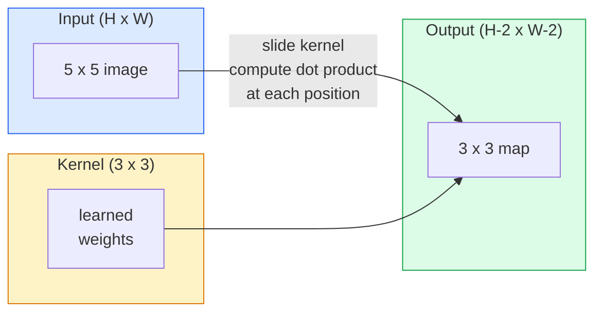
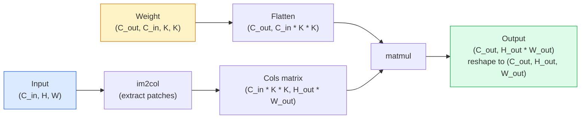

# Convolutions from Scratch / 从零实现卷积

> 卷积就是一个小型 dense layer 在图像上滑动，并在每个位置共享同一组权重。

**Type / 类型：** Build / 构建
**Languages / 语言：** Python
**Prerequisites / 前置知识：** Phase 3 (Deep Learning Core), Phase 4 Lesson 01 (Image Fundamentals)
**Time / 时间：** 约 75 分钟

## Learning Objectives / 学习目标

- 只用 NumPy 从零实现 2D convolution，包括 nested-loop 版本和 vectorised `im2col` 版本
- 对任意 input size、kernel size、padding 和 stride 组合计算输出空间大小，并解释 `(H - K + 2P) / S + 1` 公式
- 手写设计 kernels（edge、blur、sharpen、Sobel），并解释每个 kernel 为什么会产生对应的 activation pattern
- 把 convolution 堆叠成 feature extractor，并把 stack depth 与 receptive field 大小联系起来

## The Problem / 问题

如果在一张 224x224 RGB 图像上使用 fully connected layer，每个 neuron 需要 224 * 224 * 3 = 150,528 个输入权重。一个只有 1,000 个 unit 的 hidden layer 就已经有 1.5 亿个参数，而这还没学到任何有用东西。更糟糕的是，这个 layer 不知道左上角的狗和右下角的狗是同一种 pattern。它把每个 pixel 位置都当成独立变量，而这恰好违背了图像的本质：把一只猫平移三个 pixel，不应该强迫网络重新学习这个概念。

图像模型需要两个性质：**translation equivariance / 平移等变性**（输入平移，输出也随之平移）和 **parameter sharing / 参数共享**（同一个 feature detector 在所有位置运行）。Dense layer 两者都没有。Convolution 会免费给你这两个性质。

Convolution 不是为了 deep learning 才发明的。JPEG compression、Photoshop 里的 Gaussian blur、工业视觉里的 edge detection，以及所有发布过的 audio filter，本质上都依赖同一个操作。CNN 从 2012 到 2020 年主导 ImageNet 的原因，是 convolution 正好是这类数据的正确先验：相邻值彼此相关，同一个 pattern 可以出现在任何位置。

## The Concept / 概念

### One kernel, sliding / 一个 kernel，不断滑动

2D convolution 取一个称为 kernel（或 filter）的小权重矩阵，在 input 上滑动，并在每个位置计算 element-wise product 的和。这个和就是一个 output pixel。



一个具体例子：在 5x5 input 上使用 3x3 kernel（no padding, stride 1）：

```
Input X (5 x 5):                Kernel W (3 x 3):

  1  2  0  1  2                   1  0 -1
  0  1  3  1  0                   2  0 -2
  2  1  0  2  1                   1  0 -1
  1  0  2  1  3
  2  1  1  0  1

The kernel slides across every valid 3 x 3 window. Output Y is 3 x 3:

 Y[0,0] = sum( W * X[0:3, 0:3] )
 Y[0,1] = sum( W * X[0:3, 1:4] )
 Y[0,2] = sum( W * X[0:3, 2:5] )
 Y[1,0] = sum( W * X[1:4, 0:3] )
 ... and so on
```

这个公式，**shared weights、locality、sliding window**，就是完整思想。其他都只是 bookkeeping。

### Output size formula / 输出尺寸公式

给定 input spatial size `H`、kernel size `K`、padding `P`、stride `S`：

```
H_out = floor( (H - K + 2P) / S ) + 1
```

把它记住。你会在每个 architecture 里反复计算。

| Scenario / 场景 | H | K | P | S | H_out |
|----------|---|---|---|---|-------|
| Valid conv, no padding | 32 | 3 | 0 | 1 | 30 |
| Same conv (preserves size) | 32 | 3 | 1 | 1 | 32 |
| Downsample by 2 | 32 | 3 | 1 | 2 | 16 |
| Pool 2x2 | 32 | 2 | 0 | 2 | 16 |
| Large receptive field | 32 | 7 | 3 | 2 | 16 |

“Same padding” 意味着选择 P，使得 S == 1 时 H_out == H。对奇数 K 来说，P = (K - 1) / 2。这也是 3x3 kernel 占主导地位的原因：它是仍然有中心点的最小 odd kernel。

### Padding / Padding

没有 padding 时，每次 convolution 都会缩小 feature map。堆叠 20 层后，224x224 图像会变成 184x184，这会浪费 border 上的计算，并让需要 shape 匹配的 residual connection 变复杂。

```
Zero padding (P = 1) on a 5 x 5 input:

  0  0  0  0  0  0  0
  0  1  2  0  1  2  0
  0  0  1  3  1  0  0
  0  2  1  0  2  1  0       Now the kernel can centre on pixel
  0  1  0  2  1  3  0       (0, 0) and still have three rows and
  0  2  1  1  0  1  0       three columns of values to multiply.
  0  0  0  0  0  0  0
```

实践中会遇到的 mode：`zero`（最常见）、`reflect`（镜像边缘，在 generative model 中避免硬边界）、`replicate`（复制边缘）、`circular`（环绕，用于 toroidal problem）。

### Stride / Stride

Stride 是滑动的步长。`stride=1` 是默认值。`stride=2` 会让空间维度减半，是 CNN 内部不引入单独 pooling layer 就完成 downsample 的经典方法。每个现代 architecture（ResNet、ConvNeXt、MobileNet）都会在某些位置用 strided conv 代替 max-pool。

```
Stride 1 on a 5 x 5 input, 3 x 3 kernel:

  starts: (0,0) (0,1) (0,2)        -> output row 0
          (1,0) (1,1) (1,2)        -> output row 1
          (2,0) (2,1) (2,2)        -> output row 2

  Output: 3 x 3

Stride 2 on the same input:

  starts: (0,0) (0,2)              -> output row 0
          (2,0) (2,2)              -> output row 1

  Output: 2 x 2
```

### Multiple input channels / 多个 input channel

真实图像有三个 channel。RGB input 上的 3x3 convolution 实际上是一个 3x3x3 volume：每个 input channel 对应一个 3x3 slice。在每个空间位置，你会对三个 slice 全部做 multiply 和 sum，再加一个 bias。

```
Input:   (C_in,  H,  W)        3 x 5 x 5
Kernel:  (C_in,  K,  K)        3 x 3 x 3 (one kernel)
Output:  (1,     H', W')       2D map

For a layer that produces C_out output channels, you stack C_out kernels:

Weight:  (C_out, C_in, K, K)   e.g. 64 x 3 x 3 x 3
Output:  (C_out, H', W')       64 x 3 x 3

Parameter count: C_out * C_in * K * K + C_out   (the + C_out is biases)
```

最后一行是你规划模型时会反复计算的式子。一个 3-channel input 上的 64-channel 3x3 conv 有 `64 * 3 * 3 * 3 + 64 = 1,792` 个参数。很便宜。

### The im2col trick / im2col 技巧

Nested loop 容易读，但很慢。GPU 喜欢大矩阵乘法。诀窍是：把 input 中每个 receptive-field window 展平成大矩阵的一列，把 kernel 展平成一行，整个 convolution 就变成一次 matmul。



每个生产级 conv implementation 都是它的某种变体，再加上 cache-tiling 技巧（direct conv、Winograd、大 kernel 用 FFT conv）。理解 im2col，就理解了核心。

### Receptive field / Receptive field

单个 3x3 conv 会看 9 个 input pixel。堆两个 3x3 conv，第二层的一个 neuron 会看到 5x5 input pixel。三个 3x3 conv 得到 7x7。一般来说：

```
RF after L stacked K x K convs (stride 1) = 1 + L * (K - 1)

With strides:   RF grows multiplicatively with stride along each layer.
```

“一路 3x3” 可行（VGG、ResNet、ConvNeXt）的根本原因是，两个 3x3 conv 看到的 input area 等同于一个 5x5 conv，但参数更少，中间还多一个 non-linearity。

```figure
convolution-kernel
```

## Build It / 动手构建

### Step 1: Pad an array / Step 1：给 array 做 padding

从最小 primitive 开始：写一个在 H x W array 四周补零的函数。

```python
import numpy as np

def pad2d(x, p):
    if p == 0:
        return x
    h, w = x.shape[-2:]
    out = np.zeros(x.shape[:-2] + (h + 2 * p, w + 2 * p), dtype=x.dtype)
    out[..., p:p + h, p:p + w] = x
    return out

x = np.arange(9).reshape(3, 3)
print(x)
print()
print(pad2d(x, 1))
```

Trailing-axes 技巧 `x.shape[:-2]` 表示同一个函数无需改动，就能处理 `(H, W)`、`(C, H, W)` 或 `(N, C, H, W)`。

### Step 2: 2D convolution with nested loops / Step 2：用 nested loop 实现 2D convolution

这是 reference implementation，慢，但没有歧义。原则上，这就是 `torch.nn.functional.conv2d` 做的事。

```python
def conv2d_naive(x, w, b=None, stride=1, padding=0):
    c_in, h, w_in = x.shape
    c_out, c_in_w, kh, kw = w.shape
    assert c_in == c_in_w

    x_pad = pad2d(x, padding)
    h_out = (h + 2 * padding - kh) // stride + 1
    w_out = (w_in + 2 * padding - kw) // stride + 1

    out = np.zeros((c_out, h_out, w_out), dtype=np.float32)
    for oc in range(c_out):
        for i in range(h_out):
            for j in range(w_out):
                hs = i * stride
                ws = j * stride
                patch = x_pad[:, hs:hs + kh, ws:ws + kw]
                out[oc, i, j] = np.sum(patch * w[oc])
        if b is not None:
            out[oc] += b[oc]
    return out
```

四层 nested loop（output channel、row、column，再加上对 C_in、kh、kw 的隐式求和）。这就是你用来校验所有更快实现的 ground truth。

### Step 3: Verify with a hand-designed kernel / Step 3：用手写 kernel 做验证

构造一个 vertical Sobel kernel，把它应用到 synthetic step image 上，观察 vertical edge 被点亮。

```python
def synthetic_step_image():
    img = np.zeros((1, 16, 16), dtype=np.float32)
    img[:, :, 8:] = 1.0
    return img

sobel_x = np.array([
    [[-1, 0, 1],
     [-2, 0, 2],
     [-1, 0, 1]]
], dtype=np.float32)[None]

x = synthetic_step_image()
y = conv2d_naive(x, sobel_x, padding=1)
print(y[0].round(1))
```

你应该在第 7 列看到较大的正值（从左到右亮度增加），其他位置接近 0。这个 print 就是验证数学是否正确的 sanity check。

### Step 4: im2col / Step 4：im2col

把 input 中每个 kernel-sized window 转换成矩阵的一列。对 `C_in=3, K=3`，每列有 27 个数字。

```python
def im2col(x, kh, kw, stride=1, padding=0):
    c_in, h, w = x.shape
    x_pad = pad2d(x, padding)
    h_out = (h + 2 * padding - kh) // stride + 1
    w_out = (w + 2 * padding - kw) // stride + 1

    cols = np.zeros((c_in * kh * kw, h_out * w_out), dtype=x.dtype)
    col = 0
    for i in range(h_out):
        for j in range(w_out):
            hs = i * stride
            ws = j * stride
            patch = x_pad[:, hs:hs + kh, ws:ws + kw]
            cols[:, col] = patch.reshape(-1)
            col += 1
    return cols, h_out, w_out
```

这里仍然有 Python loop，但重计算会变成一次 vectorised matmul。

### Step 5: Fast conv via im2col + matmul / Step 5：用 im2col + matmul 实现快速 conv

用一次矩阵乘法替换四重 loop。

```python
def conv2d_im2col(x, w, b=None, stride=1, padding=0):
    c_out, c_in, kh, kw = w.shape
    cols, h_out, w_out = im2col(x, kh, kw, stride, padding)
    w_flat = w.reshape(c_out, -1)
    out = w_flat @ cols
    if b is not None:
        out += b[:, None]
    return out.reshape(c_out, h_out, w_out)
```

Correctness check：同时运行两个实现并对比。

```python
rng = np.random.default_rng(0)
x = rng.normal(0, 1, (3, 16, 16)).astype(np.float32)
w = rng.normal(0, 1, (8, 3, 3, 3)).astype(np.float32)
b = rng.normal(0, 1, (8,)).astype(np.float32)

y_naive = conv2d_naive(x, w, b, padding=1)
y_im2col = conv2d_im2col(x, w, b, padding=1)

print(f"max abs diff: {np.max(np.abs(y_naive - y_im2col)):.2e}")
```

`max abs diff` 应该在 `1e-5` 左右。这是 floating-point accumulation order 的差异，不是 bug。

### Step 6: A bank of hand-designed kernels / Step 6：一组手写 kernel

五个 filter 展示了单个 conv layer 在任何训练之前能表达什么。

```python
KERNELS = {
    "identity": np.array([[0, 0, 0], [0, 1, 0], [0, 0, 0]], dtype=np.float32),
    "blur_3x3": np.ones((3, 3), dtype=np.float32) / 9.0,
    "sharpen": np.array([[0, -1, 0], [-1, 5, -1], [0, -1, 0]], dtype=np.float32),
    "sobel_x": np.array([[-1, 0, 1], [-2, 0, 2], [-1, 0, 1]], dtype=np.float32),
    "sobel_y": np.array([[-1, -2, -1], [0, 0, 0], [1, 2, 1]], dtype=np.float32),
}

def apply_kernel(img2d, kernel):
    x = img2d[None].astype(np.float32)
    w = kernel[None, None]
    return conv2d_im2col(x, w, padding=1)[0]
```

应用到任意 grayscale image 上，blur 会柔化，sharpen 会让边缘更清晰，Sobel-x 点亮 vertical edge，Sobel-y 点亮 horizontal edge。这些正是 AlexNet 和 VGG 中第一层 trained conv 最终学到的 pattern，因为无论后续任务是什么，一个好的 image model 都需要 edge 和 blob detector。

## Use It / 应用它

PyTorch 的 `nn.Conv2d` 用 autograd、CUDA kernel 和 cuDNN optimisation 包装了同一个操作。Shape semantics 完全一致。

```python
import torch
import torch.nn as nn

conv = nn.Conv2d(in_channels=3, out_channels=64, kernel_size=3, stride=1, padding=1)
print(conv)
print(f"weight shape: {tuple(conv.weight.shape)}   # (C_out, C_in, K, K)")
print(f"bias shape:   {tuple(conv.bias.shape)}")
print(f"param count:  {sum(p.numel() for p in conv.parameters())}")

x = torch.randn(8, 3, 224, 224)
y = conv(x)
print(f"\ninput  shape: {tuple(x.shape)}")
print(f"output shape: {tuple(y.shape)}")
```

把 `padding=1` 换成 `padding=0`，输出会降到 222x222。把 `stride=1` 换成 `stride=2`，输出会降到 112x112。和上面要求你记住的是同一个公式。

## Ship It / 交付它

本课产出：

- `outputs/prompt-cnn-architect.md`：一个 prompt，给定 input size、parameter budget 和 target receptive field，设计一组 `Conv2d` layer，并为每一步选择正确的 K/S/P。
- `outputs/skill-conv-shape-calculator.md`：一个 skill，逐 layer 遍历 network spec，并返回每个 block 的 output shape、receptive field 和 parameter count。

## Exercises / 练习

1. **(Easy / 简单)** 给定 128x128 grayscale input，以及 `[Conv3x3(s=1,p=1), Conv3x3(s=2,p=1), Conv3x3(s=1,p=1), Conv3x3(s=2,p=1)]` 组成的 stack，手算每层的 output spatial size 和 receptive field。再用 dummy conv 组成的 PyTorch `nn.Sequential` 验证。
2. **(Medium / 中等)** 扩展 `conv2d_naive` 和 `conv2d_im2col`，让它们接受 `groups` 参数。证明 `groups=C_in=C_out` 会复现 depthwise convolution，并且它的 parameter count 是 `C * K * K`，而不是 `C * C * K * K`。
3. **(Hard / 困难)** 手写 `conv2d_im2col` 的 backward pass：给定 output gradient，计算 `x` 和 `w` 的 gradient。在相同 input 和 weight 上对比 `torch.autograd.grad` 做验证。诀窍是：im2col 的 gradient 是 `col2im`，而且它必须累加重叠 window。

## Key Terms / 关键术语

| 术语 | 常见说法 | 实际含义 |
|------|----------------|----------------------|
| Convolution | “滑动一个 filter” | 在每个 spatial location 上用 shared weights 应用一次 learnable dot product；数学上是 cross-correlation，但大家都叫 convolution |
| Kernel / filter | “feature detector” | 形状为 (C_in, K, K) 的小权重 tensor，与 input window 做 dot product 后产生一个 output pixel |
| Stride | “每次跳多远” | 相邻两次 kernel 放置之间的步长；stride 2 会让每个 spatial dimension 减半 |
| Padding | “边缘补零” | 在 input 周围添加额外值，让 kernel 能以 border pixel 为中心；`same` padding 让 output size 等于 input size |
| Receptive field | “neuron 看到了多少” | 某个 output activation 依赖的原始 input patch，会随 depth 和 stride 增长 |
| im2col | “GEMM trick” | 把每个 receptive window 重排成列，让 convolution 变成一次大矩阵乘法；这是每个快速 conv kernel 的核心 |
| Depthwise conv | “每个 channel 一个 kernel” | `groups == C_in` 的 conv，每个 output channel 只由对应 input channel 计算得到；MobileNet 和 ConvNeXt 的 backbone |
| Translation equivariance | “输入平移，输出平移” | 输入平移 k 个 pixel，输出也平移 k 个 pixel；这是 shared weights 免费带来的性质 |

## Further Reading / 延伸阅读

- [A guide to convolution arithmetic for deep learning (Dumoulin & Visin, 2016)](https://arxiv.org/abs/1603.07285)：padding / stride / dilation 的权威图解，几乎每门课程都在借用它
- [CS231n: Convolutional Neural Networks for Visual Recognition](https://cs231n.github.io/convolutional-networks/)：经典课程笔记，包括最早的 im2col 解释
- [The Annotated ConvNet (fast.ai)](https://nbviewer.org/github/fastai/fastbook/blob/master/13_convolutions.ipynb)：从手写 convolution 到训练 digit classifier 的 notebook
- [Receptive Field Arithmetic for CNNs (Dang Ha The Hien)](https://distill.pub/2019/computing-receptive-fields/)：论文级交互式 receptive field 计算解释器
