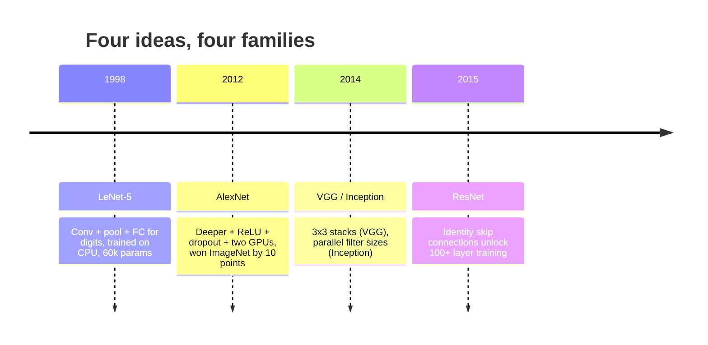
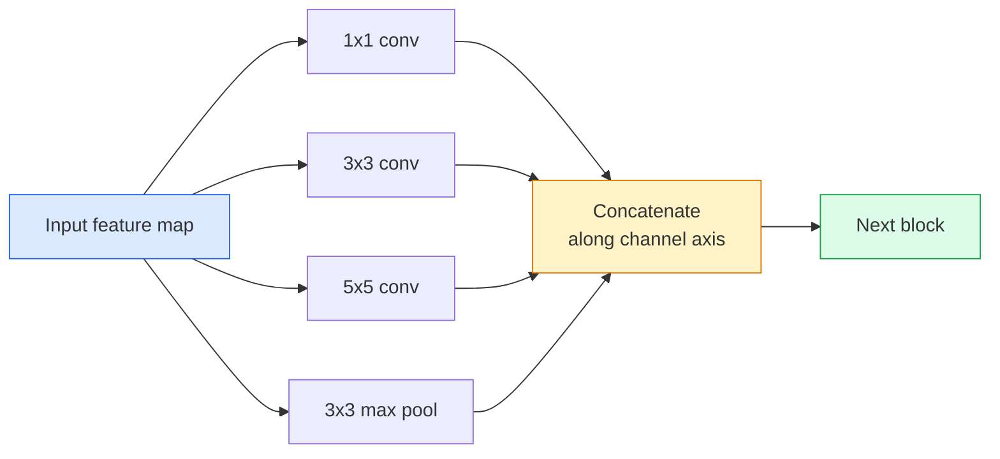
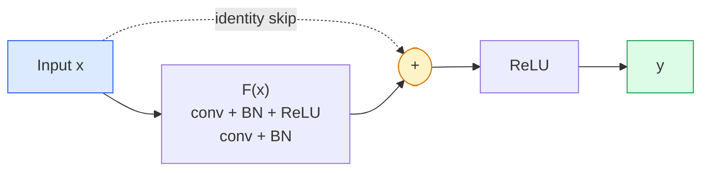

# CNNs — LeNet to ResNet / CNN：从 LeNet 到 ResNet

> 过去三十年里的重要 CNN，本质上都是 conv–nonlinearity–downsample 配方，再加上一个关键新想法。按顺序学这些想法。

**Type / 类型：** Learn + Build / 学习 + 构建
**Languages / 语言：** Python
**Prerequisites / 前置知识：** Phase 3 Lesson 11 (PyTorch), Phase 4 Lesson 01 (Image Fundamentals), Phase 4 Lesson 02 (Convolutions from Scratch)
**Time / 时间：** 约 75 分钟

## Learning Objectives / 学习目标

- 梳理 LeNet-5 -> AlexNet -> VGG -> Inception -> ResNet 的架构谱系，并说出每个 family 贡献的那个新想法
- 用 PyTorch 实现 LeNet-5、一个 VGG-style block 和一个 ResNet BasicBlock，每个都控制在 40 行以内
- 解释为什么 residual connection 能把 1,000-layer network 从不可训练变成 state-of-the-art
- 阅读现代 backbone（ResNet-18、ResNet-50），并在看源码前预测它的 output shape、receptive field 和 parameter count

## The Problem / 问题

2011 年，最好的 ImageNet classifier 大约是 74% top-5 accuracy。2012 年 AlexNet 达到 85%。2015 年 ResNet 达到 96%。没有新数据，也没有新一代 GPU。提升来自架构思想。一个合格的视觉工程师必须知道哪个想法来自哪篇论文，因为 2026 年你上线的每个 production backbone 都是这些部件的重新组合；而且这些思想会继续迁移：grouped conv 从 CNN 走向 transformer，residual connection 从 ResNet 走向每一个 LLM，batch normalisation 也出现在 diffusion model 中。

按顺序学习这些网络，也能避免一个常见错误：明明 LeNet 大小的网络就能解决问题，却直接拿最大的模型。MNIST 不需要 ResNet。理解每个 family 的 scaling curve，才能知道该坐在曲线的哪个位置。

## The Concept / 概念

### The four ideas that changed vision / 改变视觉的四个想法



经典视觉里，没有其他进展比这四次跃迁更重要。

### LeNet-5 (1998) / LeNet-5（1998）

Yann LeCun 的数字识别器。60,000 个参数。两个 conv-pool block、两个 fully connected layer、tanh activation。它定义了每个 CNN 继承下来的模板：

```
input (1, 32, 32)
  conv 5x5 -> (6, 28, 28)
  avg pool 2x2 -> (6, 14, 14)
  conv 5x5 -> (16, 10, 10)
  avg pool 2x2 -> (16, 5, 5)
  flatten -> 400
  dense -> 120
  dense -> 84
  dense -> 10
```

现代世界称为 CNN 的一切，交替的 convolution 和 downsampling，再接一个小 classifier head，本质上都是 LeNet：更多 layer、更大 channel、更好的 activation。

### AlexNet (2012) / AlexNet（2012）

三个变化一起击穿了 ImageNet：

1. **ReLU** 取代 tanh。Gradient 不再容易 vanish，训练速度提升约六倍。
2. **Dropout** 放进 fully connected head。Regularisation 变成一个 layer，而不是小技巧。
3. **Depth and width / 更深更宽**。五个 conv layer、三个 dense layer、60M 参数，在两块 GPU 上拆分模型训练。

论文里的 Figure 2 仍然展示了 GPU split 的两条 parallel stream。那种 parallelism 是硬件限制下的 workaround，不是架构洞见；但上面三个想法仍然存在于你使用的每个模型里。

### VGG (2014) / VGG（2014）

VGG 问了一个问题：如果只用 3x3 convolution，并且不断加深，会发生什么？

```
stack:   conv 3x3 -> conv 3x3 -> pool 2x2
repeat:  16 or 19 conv layers
```

两个 3x3 conv 看到的 input area 与一个 5x5 conv 相同，但参数更少（2*9*C^2 = 18C^2 vs 25*C^2），中间还多了一个 ReLU。VGG 把这个观察扩展成完整 architecture。它的简单性，一个 block type 反复堆叠，让它成为后续所有工作的参照点。

代价是：138M 参数，训练慢，inference 昂贵。

### Inception (2014, same year) / Inception（2014，同一年）

Google 对“该用什么 kernel size？”的回答是：全都用，并行使用。



每个 branch 都会专门化：1x1 做 channel mixing，3x3 做 local texture，5x5 做更大的 pattern，pooling 提供 shift-invariant feature。Concat 让下一层选择有用的 branch。Inception v1 在每个 branch 内部使用 1x1 convolution 作为 bottleneck，让 parameter count 保持可控。

### The degradation problem / degradation problem

到 2015 年，VGG-19 能工作，VGG-32 不行。理论上 depth 应该有帮助，但超过约 20 层后，training loss 和 test loss 都变差。这不是 overfitting，而是 optimiser 找不到有用权重，因为 gradient 会穿过每一层做乘法式缩小。

```
Plain deep network:
  y = f_L( f_{L-1}( ... f_1(x) ... ) )

Gradient wrt early layer:
  dL/dW_1 = dL/dy * df_L/df_{L-1} * ... * df_2/df_1 * df_1/dW_1

Each multiplicative term has magnitude roughly (weight magnitude) * (activation gain).
Stack 100 of them with gains < 1 and the gradient is effectively zero.
```

VGG 能在 19 层工作，是因为同时期发表的 batch norm 让 activation 保持良好尺度。但即使是 batch norm，也救不了超过三十来层的 plain depth。

### ResNet (2015) / ResNet（2015）

He、Zhang、Ren、Sun 提出了一个改变，解决了这个问题：

```
standard block:   y = F(x)
residual block:   y = F(x) + x
```

`+ x` 表示只要把 `F(x)` 推到 0，layer 就可以选择什么也不做。一个 1,000-layer ResNet 现在最坏也不会比 1-layer network 更差，因为每个额外 block 都有一条平凡 escape hatch。有了这个保证，optimiser 愿意让每个 block 变得“稍微”有用；而稍微有用的东西堆叠 100 次，就是 state-of-the-art。



两种 block variant 到处都会出现：

- **BasicBlock**（ResNet-18、ResNet-34）：两个 3x3 conv，skip 跨过两者。
- **Bottleneck**（ResNet-50、-101、-152）：1x1 down、3x3 middle、1x1 up，skip 跨过三者。Channel count 很高时更便宜。

当 skip 必须跨过 downsample（stride=2）时，identity path 会替换成 1x1 stride=2 conv，以匹配 shape。

### Why residuals matter beyond vision / 为什么 residual 不只影响视觉

这个思想真正解决的不是 image classification，而是把 deep network 从“祈祷 gradient 能撑住”变成可靠、可扩展的工程工具。你下一阶段会读到的每个 transformer，在每个 block 里都有完全相同的 skip connection。没有 ResNet，就没有 GPT。

```figure
pooling
```

## Build It / 动手构建

### Step 1: LeNet-5 / Step 1：LeNet-5

一个极简、忠实的 LeNet。Tanh activation、average pooling。唯一现代化的让步是下游使用 `nn.CrossEntropyLoss`，而不是原始 Gaussian connection。

```python
import torch
import torch.nn as nn
import torch.nn.functional as F

class LeNet5(nn.Module):
    def __init__(self, num_classes=10):
        super().__init__()
        self.conv1 = nn.Conv2d(1, 6, kernel_size=5)
        self.conv2 = nn.Conv2d(6, 16, kernel_size=5)
        self.pool = nn.AvgPool2d(2)
        self.fc1 = nn.Linear(16 * 5 * 5, 120)
        self.fc2 = nn.Linear(120, 84)
        self.fc3 = nn.Linear(84, num_classes)

    def forward(self, x):
        x = self.pool(torch.tanh(self.conv1(x)))
        x = self.pool(torch.tanh(self.conv2(x)))
        x = torch.flatten(x, 1)
        x = torch.tanh(self.fc1(x))
        x = torch.tanh(self.fc2(x))
        return self.fc3(x)

net = LeNet5()
x = torch.randn(1, 1, 32, 32)
print(f"output: {net(x).shape}")
print(f"params: {sum(p.numel() for p in net.parameters()):,}")
```

期望输出：`output: torch.Size([1, 10])`，`params: 61,706`。这就是开启现代视觉的完整 digit classifier。

### Step 2: A VGG block / Step 2：一个 VGG block

一个可复用 block：两个 3x3 conv、ReLU、batch norm、max pool。

```python
class VGGBlock(nn.Module):
    def __init__(self, in_c, out_c):
        super().__init__()
        self.conv1 = nn.Conv2d(in_c, out_c, kernel_size=3, padding=1)
        self.bn1 = nn.BatchNorm2d(out_c)
        self.conv2 = nn.Conv2d(out_c, out_c, kernel_size=3, padding=1)
        self.bn2 = nn.BatchNorm2d(out_c)
        self.pool = nn.MaxPool2d(2)

    def forward(self, x):
        x = F.relu(self.bn1(self.conv1(x)))
        x = F.relu(self.bn2(self.conv2(x)))
        return self.pool(x)

class MiniVGG(nn.Module):
    def __init__(self, num_classes=10):
        super().__init__()
        self.stack = nn.Sequential(
            VGGBlock(3, 32),
            VGGBlock(32, 64),
            VGGBlock(64, 128),
        )
        self.head = nn.Sequential(
            nn.AdaptiveAvgPool2d(1),
            nn.Flatten(),
            nn.Linear(128, num_classes),
        )

    def forward(self, x):
        return self.head(self.stack(x))

net = MiniVGG()
x = torch.randn(1, 3, 32, 32)
print(f"output: {net(x).shape}")
print(f"params: {sum(p.numel() for p in net.parameters()):,}")
```

在 CIFAR 大小的 input 上使用三个 VGG block、一个 adaptive pool、一个 linear layer。约 290k 参数。对 CIFAR-10 已经足够。

### Step 3: A ResNet BasicBlock / Step 3：一个 ResNet BasicBlock

ResNet-18 和 ResNet-34 的核心 building block。

```python
class BasicBlock(nn.Module):
    def __init__(self, in_c, out_c, stride=1):
        super().__init__()
        self.conv1 = nn.Conv2d(in_c, out_c, kernel_size=3, stride=stride, padding=1, bias=False)
        self.bn1 = nn.BatchNorm2d(out_c)
        self.conv2 = nn.Conv2d(out_c, out_c, kernel_size=3, stride=1, padding=1, bias=False)
        self.bn2 = nn.BatchNorm2d(out_c)
        if stride != 1 or in_c != out_c:
            self.shortcut = nn.Sequential(
                nn.Conv2d(in_c, out_c, kernel_size=1, stride=stride, bias=False),
                nn.BatchNorm2d(out_c),
            )
        else:
            self.shortcut = nn.Identity()

    def forward(self, x):
        out = F.relu(self.bn1(self.conv1(x)))
        out = self.bn2(self.conv2(out))
        out = out + self.shortcut(x)
        return F.relu(out)
```

Conv layer 上的 `bias=False` 是 batch-norm convention：BN 的 beta parameter 已经处理了 bias，再保留 conv bias 是浪费。只有 stride 或 channel count 发生变化时，`shortcut` 才需要真正的 conv；否则就是 no-op identity。

### Step 4: A tiny ResNet / Step 4：一个 tiny ResNet

堆叠四组 BasicBlock，得到一个适合 CIFAR-sized input 的可用 ResNet。

```python
class TinyResNet(nn.Module):
    def __init__(self, num_classes=10):
        super().__init__()
        self.stem = nn.Sequential(
            nn.Conv2d(3, 32, kernel_size=3, stride=1, padding=1, bias=False),
            nn.BatchNorm2d(32),
            nn.ReLU(inplace=True),
        )
        self.layer1 = self._make_group(32, 32, num_blocks=2, stride=1)
        self.layer2 = self._make_group(32, 64, num_blocks=2, stride=2)
        self.layer3 = self._make_group(64, 128, num_blocks=2, stride=2)
        self.layer4 = self._make_group(128, 256, num_blocks=2, stride=2)
        self.head = nn.Sequential(
            nn.AdaptiveAvgPool2d(1),
            nn.Flatten(),
            nn.Linear(256, num_classes),
        )

    def _make_group(self, in_c, out_c, num_blocks, stride):
        blocks = [BasicBlock(in_c, out_c, stride=stride)]
        for _ in range(num_blocks - 1):
            blocks.append(BasicBlock(out_c, out_c, stride=1))
        return nn.Sequential(*blocks)

    def forward(self, x):
        x = self.stem(x)
        x = self.layer1(x)
        x = self.layer2(x)
        x = self.layer3(x)
        x = self.layer4(x)
        return self.head(x)

net = TinyResNet()
x = torch.randn(1, 3, 32, 32)
print(f"output: {net(x).shape}")
print(f"params: {sum(p.numel() for p in net.parameters()):,}")
```

四组 block，每组两个。第 2、3、4 组开头使用 stride 2。每次 downsample 时 channel count 翻倍。约 2.8M 参数。这就是能平滑扩展到 ResNet-152 的标准配方。

### Step 5: Compare parameter-to-feature efficiency / Step 5：对比参数到特征的效率

把同一个 input 送入三个网络，对比 parameter count。

```python
def summary(name, net, x):
    y = net(x)
    params = sum(p.numel() for p in net.parameters())
    print(f"{name:12s}  input {tuple(x.shape)} -> output {tuple(y.shape)}  params {params:>10,}")

x = torch.randn(1, 3, 32, 32)
summary("LeNet5",     LeNet5(),       torch.randn(1, 1, 32, 32))
summary("MiniVGG",    MiniVGG(),      x)
summary("TinyResNet", TinyResNet(),   x)
```

三个模型、三个时代、三个数量级的参数规模。对 CIFAR-10 accuracy 来说，大致需要：LeNet 60%，MiniVGG 89%，TinyResNet 93%，训练几个 epoch 后就能看到这个趋势。

## Use It / 应用它

`torchvision.models` 提供了上述模型 family 的 pretrained 版本。不同 family 的 call signature 一致，这正是 backbone abstraction 的意义。

```python
from torchvision.models import resnet18, ResNet18_Weights, vgg16, VGG16_Weights

r18 = resnet18(weights=ResNet18_Weights.IMAGENET1K_V1)
r18.eval()

print(f"ResNet-18 params: {sum(p.numel() for p in r18.parameters()):,}")
print(r18.layer1[0])
print()

v16 = vgg16(weights=VGG16_Weights.IMAGENET1K_V1)
v16.eval()
print(f"VGG-16   params: {sum(p.numel() for p in v16.parameters()):,}")
```

ResNet-18 有 11.7M 参数。VGG-16 有 138M。二者 ImageNet top-1 accuracy 接近（69.8% vs 71.6%）。Residual connection 给你带来 12x parameter efficiency。这就是 ResNet variant 从 2016 年到 ViT 于 2021 年到来之前一直主导视觉的原因，也是它们仍然主导 compute 受限真实部署的原因。

Transfer learning 的 recipe 永远相同：load pretrained、freeze backbone、replace classifier head。

```python
for p in r18.parameters():
    p.requires_grad = False
r18.fc = nn.Linear(r18.fc.in_features, 10)
```

三行代码。现在你有了一个 10-class CIFAR classifier，它继承了 ImageNet 为 representation 付出的训练成本。

## Ship It / 交付它

本课产出：

- `outputs/prompt-backbone-selector.md`：一个 prompt，基于 task、dataset size 和 compute budget 选择合适的 CNN family（LeNet/VGG/ResNet/MobileNet/ConvNeXt）。
- `outputs/skill-residual-block-reviewer.md`：一个 skill，读取 PyTorch module 并标记 skip-connection mistake（stride change 时缺少 shortcut、shortcut activation order、BN 相对 addition 的位置）。

## Exercises / 练习

1. **(Easy / 简单)** 按 layer 手算 `TinyResNet` 的参数量。与 `sum(p.numel() for p in net.parameters())` 对比。参数预算主要花在 conv、BN 还是 classifier head？
2. **(Medium / 中等)** 实现 Bottleneck block（1x1 -> 3x3 -> 1x1 with skip），并用它构建一个适合 CIFAR 的 ResNet-50-style network。与 `TinyResNet` 对比参数量。
3. **(Hard / 困难)** 从 `BasicBlock` 移除 skip connection，在 CIFAR-10 上分别训练一个 34-block “plain” network 和一个 34-block ResNet，各 10 个 epoch。绘制二者 training loss vs epoch。复现 He et al. Figure 1 中 plain deep network 收敛到比浅层 twin 更高 loss 的结果。

## Key Terms / 关键术语

| 术语 | 常见说法 | 实际含义 |
|------|----------------|----------------------|
| Backbone | “模型本体” | 产生 feature map 并送入 task head 的 convolutional block stack |
| Residual connection | “Skip connection” | `y = F(x) + x`；让 optimiser 可以通过把 F 设为 0 来学习 identity，从而让任意深度变得可训练 |
| BasicBlock | “两个 3x3 conv 加一个 skip” | ResNet-18/34 的 building block：conv-BN-ReLU-conv-BN-add-ReLU |
| Bottleneck | “1x1 down、3x3、1x1 up” | ResNet-50/101/152 block；在高 channel count 下便宜，因为 3x3 运行在降维后的 width 上 |
| Degradation problem | “更深反而更差” | 超过约 20 层 plain conv 后，training 和 test error 都上升；residual connection 解决它，而不是更多数据 |
| Stem | “第一层” | 把 3-channel input 转换成 base feature width 的初始 conv；ImageNet 常用 7x7 stride 2，CIFAR 常用 3x3 stride 1 |
| Head | “classifier” | 最后一个 backbone block 之后的层：adaptive pool、flatten、linear(s) |
| Transfer learning | “pretrained weights” | 加载在 ImageNet 上训练过的 backbone，并只在你的任务上 fine-tune head |

## Further Reading / 延伸阅读

- [Deep Residual Learning for Image Recognition (He et al., 2015)](https://arxiv.org/abs/1512.03385)：ResNet 论文，每张图都值得细看
- [Very Deep Convolutional Networks (Simonyan & Zisserman, 2014)](https://arxiv.org/abs/1409.1556)：VGG 论文，仍然是理解 “why 3x3” 的最佳参考
- [ImageNet Classification with Deep CNNs (Krizhevsky et al., 2012)](https://papers.nips.cc/paper_files/paper/2012/hash/c399862d3b9d6b76c8436e924a68c45b-Abstract.html)：AlexNet，终结手工特征时代的论文
- [Going Deeper with Convolutions (Szegedy et al., 2014)](https://arxiv.org/abs/1409.4842)：Inception v1，并行 filter 思想今天仍会出现在 vision transformer 中
