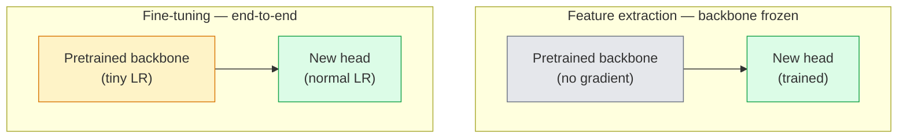

# Transfer Learning & Fine-Tuning / 迁移学习与微调

> 别人已经花了一百万 GPU 小时教网络识别 edges、textures 和 object parts。训练自己的模型前，先借用这些 features。

**Type / 类型：** Build / 构建
**Languages / 语言：** Python
**Prerequisites / 前置知识：** Phase 4 Lesson 03 (CNNs), Phase 4 Lesson 04 (Image Classification)
**Time / 时间：** 约 75 分钟

## Learning Objectives / 学习目标

- 区分 feature extraction 与 fine-tuning，并基于 dataset size、domain distance 和 compute budget 选择合适方案
- 加载 pretrained backbone，替换 classifier head，并在 20 行以内只训练 head 得到可用 baseline
- 用 discriminative learning rates 逐步 unfreeze layers，让早期 generic features 比后期 task-specific features 接受更小更新
- 诊断三类常见失败：unfrozen block 上过高 LR 导致 feature drift，tiny dataset 上 BN statistics collapse，以及 catastrophic forgetting

## The Problem / 问题

在 ImageNet 上训练一个 ResNet-50 大约需要 2,000 GPU-hours。很少有团队能为每个要上线的任务支付这笔预算。几乎所有团队真正上线的，都是 pretrained backbone 加一个在几百或几千张 task-specific image 上训练的新 head。

这不是捷径。任何 ImageNet-trained CNN 的第一个 conv block 都会学习 edge 和 Gabor-like filter。后面几个 block 学习 texture 和简单 motif。中间 block 学习 object parts。最后几个 block 学习开始像 1,000 个 ImageNet categories 的组合。这个层级结构的前 90% 几乎可以原样迁移到 medical imaging、industrial inspection、satellite data 以及其他视觉任务，因为自然界的 edge 和 texture 词汇量有限。真正需要你训练的是最后 10%。

Transfer 做对之前，有三个 bug 等着你：用过高 learning rate 毁掉 pretrained features；冻结太多导致模型信息不足；让 BatchNorm running statistics 漂移到 tiny dataset，而网络其余部分从未从这个 dataset 学过。我们会有意走过这些坑。

## The Concept / 概念

### Feature extraction vs fine-tuning / Feature extraction 与 fine-tuning

两种 regime，取决于你有多少数据，以及你多信任 pretrained features。



经验规则：

| Dataset size / 数据集规模 | Domain distance / 领域距离 | Recipe / 配方 |
|--------------|-----------------|--------|
| < 1k images | close to ImageNet | Freeze backbone，只训练 head |
| 1k-10k | close | Freeze 前 2-3 个 stage，fine-tune 剩余部分 |
| 10k-100k | any | 用 discriminative LR 做 end-to-end fine-tune |
| 100k+ | far | Fine-tune everything；如果 domain 足够远，考虑 from scratch training |

“Close to ImageNet” 大致指自然 RGB 照片，且内容像 object。Medical CT scan、overhead satellite imagery 和 microscopy 都是 far domain；features 仍然有帮助，但你需要让更多 layer 适应。

### Why freezing works at all / 为什么 freezing 会有效

CNN 从 ImageNet 学到的 features 并不专属于那 1,000 个类别，而是专属于 natural image statistics：特定方向的 edge、texture、contrast pattern、shape primitive。这些 statistics 在几乎所有人类能说出名字的视觉领域里都稳定存在。这就是为什么一个在 ImageNet 上训练的模型，只加一个新的 linear head、完全不 fine-tune backbone，也能在 CIFAR-10 上达到 80%+ accuracy。Head 学到的是：在这个任务上，已经学过的哪些 features 应该获得更高权重。

### Discriminative learning rates / Discriminative learning rates

一旦 unfreeze，早期 layer 应该比后期 layer 训练得更慢。早期 layer 编码你想保留的 generic features；后期 layer 编码你需要大幅移动的 task-specific structure。

```
Typical recipe:

  stage 0 (stem + first group): lr = base_lr / 100    (mostly fixed)
  stage 1:                       lr = base_lr / 10
  stage 2:                       lr = base_lr / 3
  stage 3 (last backbone group): lr = base_lr
  head:                          lr = base_lr  (or slightly higher)
```

在 PyTorch 里，这只是传给 optimizer 的 parameter groups list。一个 model，五个 learning rates，不需要额外代码。

### The BatchNorm problem / BatchNorm 问题

BN layer 持有在 ImageNet 上计算得到的 `running_mean` 和 `running_var` buffer。如果你的任务有不同的 pixel distribution，例如不同光照、不同 sensor、不同 colour space，这些 buffer 就是错的。按优先级有三个选择：

1. **Fine-tune with BN in train mode.** 让 BN 与其他部分一起更新 running statistics。Task dataset 中等规模（>= 5k examples）时的默认选择。
2. **Freeze BN in eval mode.** 保留 ImageNet statistics，只训练 weights。当 dataset 小到 BN moving average 会很 noisy 时，这是正确做法。
3. **Replace BN with GroupNorm.** 完全移除 moving-average 问题。Detection 和 segmentation backbone 常用它，因为每张 GPU 上的 batch size 很小。

弄错这件事会悄悄让 accuracy 掉 5-15%。

### Head design / Head 设计

Classifier head 是 1-3 个 linear layer，加可选 dropout。每个 torchvision backbone 都带有一个你要替换掉的默认 head：

```
backbone.fc = nn.Linear(backbone.fc.in_features, num_classes)          # ResNet
backbone.classifier[1] = nn.Linear(..., num_classes)                    # EfficientNet, MobileNet
backbone.heads.head = nn.Linear(..., num_classes)                       # torchvision ViT
```

对小 dataset 来说，单个 linear layer 通常足够。任务分布离 backbone 训练分布越远，加入 hidden layer（Linear -> ReLU -> Dropout -> Linear）越有帮助。

### Layer-wise LR decay / Layer-wise LR decay

这是 modern fine-tuning（BEiT、DINOv2、ViT-B fine-tunes）里更平滑的 discriminative LR。它不把 layer 分成 stage，而是让每个 layer 的 LR 都比上面一层略小：

```
lr_layer_k = base_lr * decay^(L - k)
```

当 decay = 0.75 且 L = 12 transformer blocks 时，第一个 block 的训练 LR 是 head LR 的 `0.75^11 ≈ 0.04x`。这对 transformer fine-tune 更重要；对 CNN 来说，stage-grouped LR 通常已经够用。

### What to evaluate / 应该评估什么

Transfer-learning run 需要跟踪两个 scratch run 不会看重的数字：

- **Pretrained-only accuracy**：backbone frozen 时 head 的 accuracy。这是你的 floor。
- **Fine-tuned accuracy**：同一个 model 经过 end-to-end training 后的 accuracy。这是你的 ceiling。

如果 fine-tuned 低于 pretrained-only，你有 learning-rate 或 BN bug。永远把两个数字都打印出来。

## Build It / 动手构建

### Step 1: Load a pretrained backbone and inspect it / Step 1：加载 pretrained backbone 并检查它

```python
import torch
import torch.nn as nn
from torchvision.models import resnet18, ResNet18_Weights

backbone = resnet18(weights=ResNet18_Weights.IMAGENET1K_V1)
print(backbone)
print()
print("classifier head:", backbone.fc)
print("feature dim:", backbone.fc.in_features)
```

`ResNet18` 有四个 stage（`layer1..layer4`）、一个 stem 和一个 `fc` head。每个 torchvision classification backbone 都有类似结构。

### Step 2: Feature extraction — freeze everything, replace the head / Step 2：feature extraction：冻结全部，替换 head

```python
def make_feature_extractor(num_classes=10):
    model = resnet18(weights=ResNet18_Weights.IMAGENET1K_V1)
    for p in model.parameters():
        p.requires_grad = False
    model.fc = nn.Linear(model.fc.in_features, num_classes)
    return model

model = make_feature_extractor(num_classes=10)
trainable = sum(p.numel() for p in model.parameters() if p.requires_grad)
frozen = sum(p.numel() for p in model.parameters() if not p.requires_grad)
print(f"trainable: {trainable:>10,}")
print(f"frozen:    {frozen:>10,}")
```

只有 `model.fc` 可训练。Backbone 是 frozen feature extractor。

### Step 3: Discriminative fine-tuning / Step 3：discriminative fine-tuning

这个 utility 会用 stage-specific learning rates 构建 parameter groups。

```python
def discriminative_param_groups(model, base_lr=1e-3, decay=0.3):
    stages = [
        ["conv1", "bn1"],
        ["layer1"],
        ["layer2"],
        ["layer3"],
        ["layer4"],
        ["fc"],
    ]
    groups = []
    for i, names in enumerate(stages):
        lr = base_lr * (decay ** (len(stages) - 1 - i))
        params = [p for n, p in model.named_parameters()
                  if any(n.startswith(k) for k in names)]
        if params:
            groups.append({"params": params, "lr": lr, "name": "_".join(names)})
    return groups

model = resnet18(weights=ResNet18_Weights.IMAGENET1K_V1)
model.fc = nn.Linear(model.fc.in_features, 10)
for p in model.parameters():
    p.requires_grad = True

groups = discriminative_param_groups(model)
for g in groups:
    print(f"{g['name']:>10s}  lr={g['lr']:.2e}  params={sum(p.numel() for p in g['params']):>8,}")
```

`decay=0.3` 表示每个 stage 的训练速度是下一 stage 的 30%。`fc` 得到 `base_lr`，`layer4` 得到 `0.3 * base_lr`，`conv1` 得到 `0.3^5 * base_lr ≈ 0.00243 * base_lr`。看起来很极端，但经验上有效。

### Step 4: BatchNorm handling / Step 4：处理 BatchNorm

这个 helper 会冻结 BN running statistics，但不冻结它的 weights。

```python
def freeze_bn_stats(model):
    for m in model.modules():
        if isinstance(m, (nn.BatchNorm1d, nn.BatchNorm2d, nn.BatchNorm3d)):
            m.eval()
            for p in m.parameters():
                p.requires_grad = False
    return model
```

每个 epoch 开始时，在你设置 `model.train()` 之后调用它。`model.train()` 会把所有东西切到 training mode；这个 helper 只把 BN layer 切回去。

### Step 5: A minimal end-to-end fine-tuning loop / Step 5：极简端到端 fine-tuning loop

```python
from torch.optim import SGD
from torch.utils.data import DataLoader
from torch.optim.lr_scheduler import CosineAnnealingLR
import torch.nn.functional as F

def fine_tune(model, train_loader, val_loader, device, epochs=5, base_lr=1e-3, freeze_bn=False):
    model = model.to(device)
    groups = discriminative_param_groups(model, base_lr=base_lr)
    optimizer = SGD(groups, momentum=0.9, weight_decay=1e-4, nesterov=True)
    scheduler = CosineAnnealingLR(optimizer, T_max=epochs)

    for epoch in range(epochs):
        model.train()
        if freeze_bn:
            freeze_bn_stats(model)
        tr_loss, tr_correct, tr_total = 0.0, 0, 0
        for x, y in train_loader:
            x, y = x.to(device), y.to(device)
            logits = model(x)
            loss = F.cross_entropy(logits, y, label_smoothing=0.1)
            optimizer.zero_grad()
            loss.backward()
            optimizer.step()
            tr_loss += loss.item() * x.size(0)
            tr_total += x.size(0)
            tr_correct += (logits.argmax(-1) == y).sum().item()
        scheduler.step()

        model.eval()
        va_total, va_correct = 0, 0
        with torch.no_grad():
            for x, y in val_loader:
                x, y = x.to(device), y.to(device)
                pred = model(x).argmax(-1)
                va_total += x.size(0)
                va_correct += (pred == y).sum().item()
        print(f"epoch {epoch}  train {tr_loss/tr_total:.3f}/{tr_correct/tr_total:.3f}  "
              f"val {va_correct/va_total:.3f}")
    return model
```

用上面配方在 CIFAR-10 上训练五个 epoch，`ResNet18-IMAGENET1K_V1` 会从约 70% zero-shot linear-probe accuracy 提升到约 93% fine-tuned accuracy。如果只训练 head，不碰 backbone，会在约 86% 进入平台期。

### Step 6: Progressive unfreezing / Step 6：progressive unfreezing

从末端向前，每个 epoch 解冻一个 stage。它能缓解 feature drift，代价是多几个 epoch。

```python
def progressive_unfreeze_schedule(model):
    stages = ["layer4", "layer3", "layer2", "layer1"]
    yielded = set()

    def start():
        for p in model.parameters():
            p.requires_grad = False
        for p in model.fc.parameters():
            p.requires_grad = True

    def unfreeze(epoch):
        if epoch < len(stages):
            name = stages[epoch]
            yielded.add(name)
            for n, p in model.named_parameters():
                if n.startswith(name):
                    p.requires_grad = True
            return name
        return None

    return start, unfreeze
```

第一个 epoch 前调用一次 `start()`。每个 epoch 开始时调用 `unfreeze(epoch)`。只要 trainable parameter 集合变化，就要重建 optimizer，否则 frozen params 仍然携带 cached moments，会干扰训练。

## Use It / 应用它

对大多数真实任务来说，`torchvision.models` 加三行代码就够了。上面更重的机制，是在 library default 无法解决问题时才重要。

```python
from torchvision.models import resnet50, ResNet50_Weights

model = resnet50(weights=ResNet50_Weights.IMAGENET1K_V2)
model.fc = nn.Linear(model.fc.in_features, num_classes)
optimizer = torch.optim.AdamW(model.parameters(), lr=1e-4, weight_decay=1e-4)
```

另外两个 production-grade default：

- `timm` 提供约 800 个 pretrained vision backbones，并有一致 API（`timm.create_model("resnet50", pretrained=True, num_classes=10)`）。只要超出 torchvision zoo，它就是 fine-tune 标准工具。
- 对 transformers，`transformers.AutoModelForImageClassification.from_pretrained(name, num_labels=N)` 能以和 text model 相同的 loading semantics 提供 ViT / BEiT / DeiT。

## Ship It / 交付它

本课产出：

- `outputs/prompt-fine-tune-planner.md`：一个 prompt，基于 dataset size、domain distance 和 compute budget，选择 feature-extraction、progressive 或 end-to-end fine-tuning。
- `outputs/skill-freeze-inspector.md`：一个 skill，给定 PyTorch model，报告哪些 parameters trainable、哪些 BatchNorm layers 处于 eval mode，以及 optimizer 实际拿到的是否就是 trainable parameters。

## Exercises / 练习

1. **(Easy / 简单)** 在同一个 synthetic-CIFAR dataset 上，分别把 `ResNet18` 作为 linear probe（frozen backbone）和 full fine-tune 训练。并排报告两个 accuracy。解释哪种 gap 说明 features 迁移得好，哪种 gap 说明迁移不好。
2. **(Medium / 中等)** 故意引入一个 bug：在 backbone stage 上设置 `base_lr = 1e-1`，而不是只给 head。展示 training loss 爆炸，然后用 `discriminative_param_groups` helper 恢复。记录每个 stage 开始发散的 LR。
3. **(Hard / 困难)** 取一个 medical imaging dataset（例如 CheXpert-small、PatchCamelyon 或 HAM10000），对比三种 regime：(a) ImageNet-pretrained frozen backbone + linear head；(b) ImageNet-pretrained end-to-end fine-tune；(c) scratch training。报告每种的 accuracy 和 compute cost。Dataset size 到什么程度时，scratch training 开始有竞争力？

## Key Terms / 关键术语

| 术语 | 常见说法 | 实际含义 |
|------|----------------|----------------------|
| Feature extraction | “freeze and train head” | Backbone parameters frozen，只有新的 classifier head 接收 gradient |
| Fine-tuning | “端到端重训” | 所有 parameters trainable，通常 LR 远小于 scratch training |
| Discriminative LR | “早期 layer 用更小 LR” | Optimizer parameter groups，其中 early-stage LR 是 late-stage LR 的一部分 |
| Layer-wise LR decay | “平滑 LR 梯度” | 每层 LR 乘以 decay^(L - k)；transformer fine-tune 常用 |
| Catastrophic forgetting | “模型忘了 ImageNet” | LR 太高，在新任务信号学会前就覆盖了 pretrained features |
| BN statistics drift | “running mean 错了” | BatchNorm running_mean/var 来自与当前任务不同的分布，会悄悄伤害 accuracy |
| Linear probe | “frozen backbone + linear head” | 对 pretrained features 的评估，也就是 frozen representation 上最佳 linear classifier 的 accuracy |
| Catastrophic collapse | “所有东西都预测成一个 class” | Fine-tuning LR 高到在 head 的 gradient 稳定前就摧毁 features 时会发生 |

## Further Reading / 延伸阅读

- [How transferable are features in deep neural networks? (Yosinski et al., 2014)](https://arxiv.org/abs/1411.1792)：量化 feature 在不同 layer 之间迁移能力的论文
- [Universal Language Model Fine-tuning (ULMFiT, Howard & Ruder, 2018)](https://arxiv.org/abs/1801.06146)：discriminative LR / progressive unfreezing 原始配方；思想可直接迁移到视觉
- [timm documentation](https://huggingface.co/docs/timm)：现代 vision backbone 以及它们训练时 fine-tune default 的参考
- [A Simple Framework for Linear-Probe Evaluation (Kornblith et al., 2019)](https://arxiv.org/abs/1805.08974)：为什么 linear-probe accuracy 重要，以及如何正确报告它
