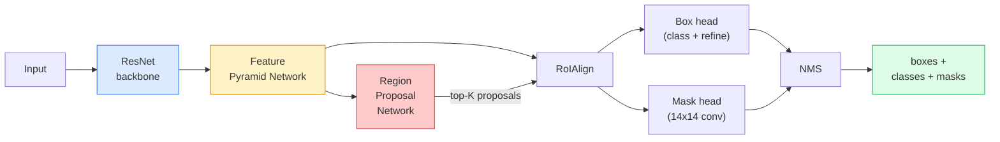

# Instance Segmentation — Mask R-CNN / 实例分割：Mask R-CNN

> 给 Faster R-CNN detector 增加一个很小的 mask branch，你就得到了 instance segmentation。真正难的是 RoIAlign，而且它比看起来更难。

**Type / 类型：** Build + Learn / 构建 + 学习
**Languages / 语言：** Python
**Prerequisites / 前置知识：** Phase 4 Lesson 06 (YOLO), Phase 4 Lesson 07 (U-Net)
**Time / 时间：** 约 75 分钟

## Learning Objectives / 学习目标

- 端到端梳理 Mask R-CNN architecture：backbone、FPN、RPN、RoIAlign、box head、mask head
- 从零实现 RoIAlign，并解释为什么 RoIPool 已经不再使用
- 使用 torchvision `maskrcnn_resnet50_fpn_v2` pretrained model 获得 production-quality instance masks，并正确读取输出格式
- 通过替换 box 和 mask heads、保持 backbone frozen，在小型 custom dataset 上 fine-tune Mask R-CNN

## The Problem / 问题

Semantic segmentation 给你每个 class 一个 mask。Instance segmentation 给你每个 object 一个 mask，即使两个 objects 属于同一 class。计数个体、跨帧 tracking、测量对象（墙上每块砖的 bounding box、显微图像里的每个细胞）都需要 instance segmentation。

Mask R-CNN（He et al., 2017）把 instance segmentation 重新表述为 detection-plus-a-mask，从而解决了这个问题。这个设计非常干净，以至于接下来五年里几乎每篇 instance segmentation 论文都是 Mask R-CNN variant；torchvision 实现直到现在仍是 small / medium dataset 的 production default。

困难的工程问题是采样：如何从一个 proposal box 中裁出 fixed-size feature region，而这个 box 的 corners 并不对齐 pixel boundaries？做错这件事会在各处损失零点几个 mAP。RoIAlign 就是答案。

## The Concept / 概念

### The architecture / 架构



需要理解五个部件：

1. **Backbone**：在 ImageNet 上训练的 ResNet-50 或 ResNet-101。产生 strides 4、8、16、32 的 feature map hierarchy。
2. **FPN (Feature Pyramid Network)**：top-down + lateral connections，让每个 level 都有 C channels 的 semantic-rich features。Detection 会查询与 object size 匹配的 FPN level。
3. **RPN (Region Proposal Network)**：一个小 conv head，在每个 anchor position 上预测“这里是否有 object？”以及“如何 refine box？”。每张图产生约 1000 个 proposals。
4. **RoIAlign**：从任意 FPN level 的任意 box 中采样 fixed-size（例如 7x7）feature patch。Bilinear sampling，不做 quantisation。
5. **Heads**：两层 box head refine box 并选择 class；再加一个小 conv head，为每个 proposal 输出 `28x28` binary mask。

### Why RoIAlign, not RoIPool / 为什么用 RoIAlign 而不是 RoIPool

原始 Fast R-CNN 使用 RoIPool：把 proposal box 分成 grid，在每个 cell 中取最大 feature，并把所有 coordinates 都 round 成 integers。这种 rounding 会让 feature map 和 input pixel coordinates 之间最多偏移一个完整 feature-map pixel。在 224x224 图像上这还小，在 stride 32 feature map 上就很致命。

```
RoIPool:
  box (34.7, 51.3, 98.2, 142.9)
  round -> (34, 51, 98, 142)
  split grid -> round each cell boundary
  misalignment accumulates at every step

RoIAlign:
  box (34.7, 51.3, 98.2, 142.9)
  sample at exact float coordinates using bilinear interpolation
  no rounding anywhere
```

RoIAlign 在 COCO 上免费提升 3-4 个 mask AP。现在任何关心 localisation 的 detector 都使用它，YOLOv7 seg、RT-DETR、Mask2Former 都一样。

### The RPN in one paragraph / 一段话理解 RPN

在 feature map 的每个位置，放置 K 个不同 size 和 shape 的 anchor boxes。对每个 anchor 预测 objectness score，以及把 anchor 调成更贴合 box 的 regression offset。按 score 保留 top ~1,000 boxes，在 IoU 0.7 下做 NMS，把留下的交给 heads。RPN 用自己的 mini-loss 训练，结构与 Lesson 6 的 YOLO loss 相同，只是 class 只有两个（object / no object）。

### The mask head / mask head

对每个 proposal（RoIAlign 后），mask head 是一个 tiny FCN：四个 3x3 conv、一个 2x deconv、最后一个 1x1 conv，在 `28x28` resolution 上产生 `num_classes` 个 output channels。只保留与 predicted class 对应的 channel，其他忽略。这样 mask prediction 就与 classification 解耦。

把 28x28 mask upsample 到 proposal 的原始 pixel size，就得到最终 binary mask。

### Losses / Losses

Mask R-CNN 把四类 losses 相加：

```
L = L_rpn_cls + L_rpn_box + L_box_cls + L_box_reg + L_mask
```

- `L_rpn_cls`, `L_rpn_box`：RPN proposals 的 objectness + box regression。
- `L_box_cls`：head classifier 上对 (C+1) classes（含 background）的 cross-entropy。
- `L_box_reg`：head box refinement 上的 smooth L1。
- `L_mask`：28x28 mask output 上的 per-pixel binary cross-entropy。

每个 loss 都有自己的 default weight；torchvision implementation 通过 constructor arguments 暴露它们。

### Output format / 输出格式

`torchvision.models.detection.maskrcnn_resnet50_fpn_v2` 返回一个 dict list，每张图一个 dict：

```
{
    "boxes":  (N, 4) in (x1, y1, x2, y2) pixel coordinates,
    "labels": (N,) class IDs, 0 = background so indices are 1-based,
    "scores": (N,) confidence scores,
    "masks":  (N, 1, H, W) float masks in [0, 1] — threshold at 0.5 for binary,
}
```

Mask 已经是 full image resolution。28x28 head output 已经在内部 upsample。

## Build It / 动手构建

### Step 1: RoIAlign from scratch / Step 1：从零实现 RoIAlign

Mask R-CNN 的这个组件，用代码理解比用文字理解更简单。

```python
import torch
import torch.nn.functional as F

def roi_align_single(feature, box, output_size=7, spatial_scale=1 / 16.0):
    """
    feature: (C, H, W) single-image feature map
    box: (x1, y1, x2, y2) in original image pixel coordinates
    output_size: side of the output grid (7 for box head, 14 for mask head)
    spatial_scale: reciprocal of the feature map stride
    """
    C, H, W = feature.shape
    x1, y1, x2, y2 = [c * spatial_scale - 0.5 for c in box]
    bin_w = (x2 - x1) / output_size
    bin_h = (y2 - y1) / output_size

    grid_y = torch.linspace(y1 + bin_h / 2, y2 - bin_h / 2, output_size)
    grid_x = torch.linspace(x1 + bin_w / 2, x2 - bin_w / 2, output_size)
    yy, xx = torch.meshgrid(grid_y, grid_x, indexing="ij")

    gx = 2 * (xx + 0.5) / W - 1
    gy = 2 * (yy + 0.5) / H - 1
    grid = torch.stack([gx, gy], dim=-1).unsqueeze(0)
    sampled = F.grid_sample(feature.unsqueeze(0), grid, mode="bilinear",
                            align_corners=False)
    return sampled.squeeze(0)
```

每个数字都来自 bilinearly-sampled position。没有 rounding、没有 quantisation、没有丢掉 gradients。

### Step 2: Compare to torchvision's RoIAlign / Step 2：与 torchvision 的 RoIAlign 对比

```python
from torchvision.ops import roi_align

feature = torch.randn(1, 16, 50, 50)
boxes = torch.tensor([[0, 10, 20, 100, 90]], dtype=torch.float32)  # (batch_idx, x1, y1, x2, y2)

ours = roi_align_single(feature[0], boxes[0, 1:].tolist(), output_size=7, spatial_scale=1/4)
theirs = roi_align(feature, boxes, output_size=(7, 7), spatial_scale=1/4, sampling_ratio=1, aligned=True)[0]

print(f"shape ours:   {tuple(ours.shape)}")
print(f"shape theirs: {tuple(theirs.shape)}")
print(f"max|diff|:    {(ours - theirs).abs().max().item():.3e}")
```

当 `sampling_ratio=1` 且 `aligned=True` 时，二者在 `1e-5` 以内匹配。

### Step 3: Load a pretrained Mask R-CNN / Step 3：加载 pretrained Mask R-CNN

```python
import torch
from torchvision.models.detection import maskrcnn_resnet50_fpn_v2, MaskRCNN_ResNet50_FPN_V2_Weights

model = maskrcnn_resnet50_fpn_v2(weights=MaskRCNN_ResNet50_FPN_V2_Weights.DEFAULT)
model.eval()
print(f"params: {sum(p.numel() for p in model.parameters()):,}")
print(f"classes (including background): {len(model.roi_heads.box_predictor.cls_score.out_features * [0])}")
```

46M 参数，91 classes（COCO）。第一个 class（id 0）是 background；模型实际检测的所有东西从 id 1 开始。

### Step 4: Run inference / Step 4：运行 inference

```python
with torch.no_grad():
    x = torch.randn(3, 400, 600)
    predictions = model([x])
p = predictions[0]
print(f"boxes:  {tuple(p['boxes'].shape)}")
print(f"labels: {tuple(p['labels'].shape)}")
print(f"scores: {tuple(p['scores'].shape)}")
print(f"masks:  {tuple(p['masks'].shape)}")
```

Mask tensor 的 shape 是 `(N, 1, H, W)`。以 0.5 threshold 得到每个 object 的 binary mask：

```python
binary_masks = (p['masks'] > 0.5).squeeze(1)  # (N, H, W) boolean
```

### Step 5: Swap the heads for a custom class count / Step 5：替换 heads 以适配 custom class count

常见 fine-tuning recipe：复用 backbone、FPN 和 RPN；替换两个 classifier heads。

```python
from torchvision.models.detection.faster_rcnn import FastRCNNPredictor
from torchvision.models.detection.mask_rcnn import MaskRCNNPredictor

def build_custom_maskrcnn(num_classes):
    model = maskrcnn_resnet50_fpn_v2(weights=MaskRCNN_ResNet50_FPN_V2_Weights.DEFAULT)
    in_features = model.roi_heads.box_predictor.cls_score.in_features
    model.roi_heads.box_predictor = FastRCNNPredictor(in_features, num_classes)
    in_features_mask = model.roi_heads.mask_predictor.conv5_mask.in_channels
    hidden_layer = 256
    model.roi_heads.mask_predictor = MaskRCNNPredictor(in_features_mask, hidden_layer, num_classes)
    return model

custom = build_custom_maskrcnn(num_classes=5)
print(f"custom cls_score.out_features: {custom.roi_heads.box_predictor.cls_score.out_features}")
```

`num_classes` 必须包含 background class，所以一个包含 4 个 object classes 的 dataset 使用 `num_classes=5`。

### Step 6: Freeze what does not need training / Step 6：冻结不需要训练的部分

在小 dataset 上，freeze backbone 和 FPN。只让 RPN objectness + regression 以及两个 heads 学习。

```python
def freeze_backbone_and_fpn(model):
    # torchvision Mask R-CNN packs the FPN inside `model.backbone` (as
    # `model.backbone.fpn`), so iterating `model.backbone.parameters()` covers
    # both the ResNet feature layers and the FPN lateral/output convs.
    for p in model.backbone.parameters():
        p.requires_grad = False
    return model

custom = freeze_backbone_and_fpn(custom)
trainable = sum(p.numel() for p in custom.parameters() if p.requires_grad)
print(f"trainable after freeze: {trainable:,}")
```

在 500-image dataset 上，这往往是能收敛和过拟合之间的差别。

## Use It / 应用它

Torchvision 中 Mask R-CNN 的完整 training loop 约 40 行，而且在不同任务之间不会有实质变化：换 dataset 即可。

```python
def train_step(model, images, targets, optimizer):
    model.train()
    loss_dict = model(images, targets)
    losses = sum(loss for loss in loss_dict.values())
    optimizer.zero_grad()
    losses.backward()
    optimizer.step()
    return {k: v.item() for k, v in loss_dict.items()}
```

`targets` list 必须包含 per-image dicts，其中有 `boxes`、`labels` 和 `masks`（形状为 `(num_instances, H, W)` 的 binary tensors）。训练时 model 返回四个 losses 的 dict；eval 时返回 predictions list，具体取决于 `model.training`。

`pycocotools` evaluator 会同时为 boxes 和 masks 产出 mAP@IoU=0.5:0.95；你需要两个数字，才能判断 bottleneck 是 box head 还是 mask head。

## Ship It / 交付它

本课产出：

- `outputs/prompt-instance-vs-semantic-router.md`：一个 prompt，提出三个问题，并在 instance、semantic、panoptic 之间选择，同时给出应从哪个 model 开始。
- `outputs/skill-mask-rcnn-head-swapper.md`：一个 skill，给定新的 `num_classes`，为任意 torchvision detection model 生成替换 heads 的 10 行代码。

## Exercises / 练习

1. **(Easy / 简单)** 在 100 个 random boxes 上验证你的 RoIAlign 与 `torchvision.ops.roi_align`。报告 max absolute difference。同时运行 RoIPool（2017 年前的行为），展示它在靠近边界的 boxes 上会偏离约 1-2 个 feature-map pixels。
2. **(Medium / 中等)** 在 50-image custom dataset 上 fine-tune `maskrcnn_resnet50_fpn_v2`（任意两个 classes：balloons、fish、pothole、logos）。Freeze backbone，训练 20 epochs，报告 mask AP@0.5。
3. **(Hard / 困难)** 把 Mask R-CNN 的 mask head 替换成预测 56x56 而不是 28x28 的版本。测量改动前后的 mAP@IoU=0.75。解释收益（或没有收益）为什么符合 boundary-precision / memory trade-off 预期。

## Key Terms / 关键术语

| 术语 | 常见说法 | 实际含义 |
|------|----------------|----------------------|
| Mask R-CNN | “detection plus masks” | Faster R-CNN 加一个 small FCN head，为每个 proposal、每个 class 预测 28x28 mask |
| FPN | “feature pyramid” | Top-down + lateral connections，让每个 stride level 都有 C channels 的 semantic-rich features |
| RPN | “region proposer” | 小 conv head，每张图产生约 1000 个 object/no-object proposals |
| RoIAlign | “不 rounding 的 crop” | 从任意 float-coordinate box 中 bilinearly samples fixed-size feature grid |
| RoIPool | “2017 年前的 crop” | 目的与 RoIAlign 相同，但会 round box coordinates；已经过时 |
| Mask AP | “instance mAP” | 使用 mask IoU 而不是 box IoU 计算的 average precision；COCO instance segmentation metric |
| Binary mask head | “per-class mask” | 对每个 proposal 预测每个 class 的 binary mask；只保留 predicted class 的 channel |
| Background class | “class 0” | “no object” 兜底 class；真实 class 的 index 从 1 开始 |

## Further Reading / 延伸阅读

- [Mask R-CNN (He et al., 2017)](https://arxiv.org/abs/1703.06870)：原论文；关于 RoIAlign 的第 3 节是关键阅读
- [FPN: Feature Pyramid Networks (Lin et al., 2017)](https://arxiv.org/abs/1612.03144)：FPN 论文；每个现代 detector 都在用它
- [torchvision Mask R-CNN tutorial](https://pytorch.org/tutorials/intermediate/torchvision_tutorial.html)：fine-tuning loop 的参考实现
- [Detectron2 model zoo](https://github.com/facebookresearch/detectron2/blob/main/MODEL_ZOO.md)：生产级实现和训练权重，覆盖几乎所有 detection / segmentation variant
