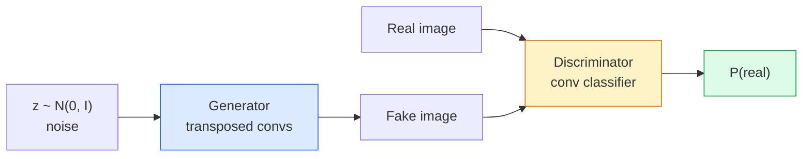
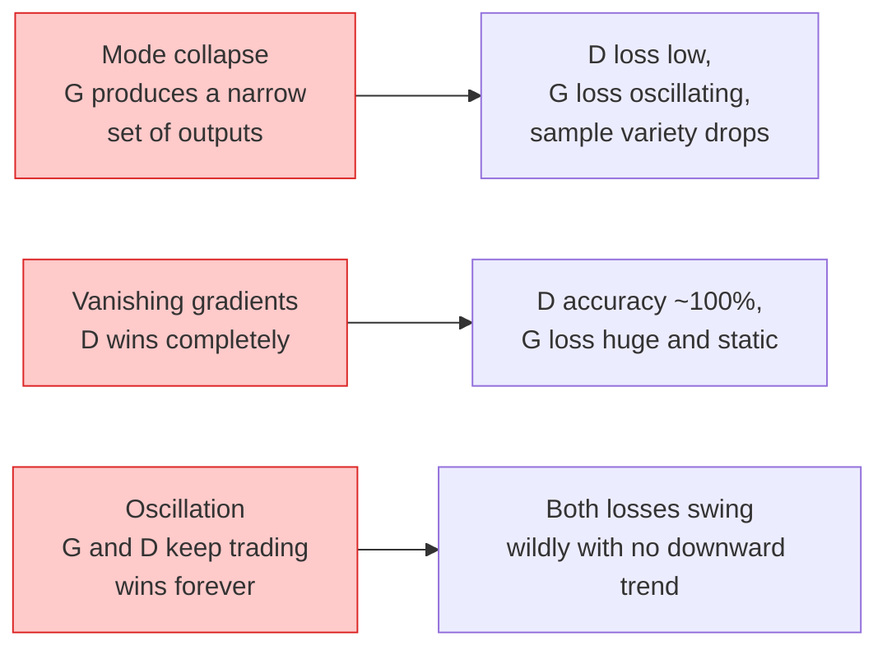

# Image Generation — GANs / 图像生成：GANs

> GAN 是两个神经网络组成的固定博弈。一个负责画图，一个负责批评。它们一起变强，直到画作骗过批评者。

**Type / 类型：** Build / 构建
**Languages / 语言：** Python
**Prerequisites / 前置知识：** Phase 4 Lesson 03 (CNNs), Phase 3 Lesson 06 (Optimizers), Phase 3 Lesson 07 (Regularization)
**Time / 时间：** 约 75 分钟

## Learning Objectives / 学习目标

- 解释 generator 与 discriminator 之间的 minimax game，以及为什么 equilibrium 对应 p_model = p_data
- 在 PyTorch 中实现 DCGAN，并在 60 行以内让它生成 coherent 32x32 synthetic images
- 用三个标准技巧稳定 GAN training：non-saturating loss、spectral norm、TTUR（two-timescale update rule）
- 阅读 training curves，区分 healthy convergence、mode collapse、oscillation 和 discriminator-wins-completely

## The Problem / 问题

Classification 教网络把 images 映射到 labels。Generation 反过来：采样新图像，让它们看起来像来自同一个 distribution。这里没有可以直接 diff 的“正确”输出，只有你想模仿的分布。

标准 loss functions（MSE、cross-entropy）无法衡量“这个 sample 是否来自真实分布”。最小化 per-pixel error 只会产生模糊平均图，而不是真实样本。突破点是学习 loss：训练第二个网络来判断 real vs fake，并用它的判断推动 generator。

GANs（Goodfellow et al., 2014）定义了这个框架。到 2018 年，StyleGAN 已经能生成与照片难以区分的 1024x1024 人脸。Diffusion models 后来在质量和可控性上取得领先，但让 diffusion 实用的很多技巧，如 normalisation choices、latent spaces、feature losses，都先在 GANs 上被理解。

## The Concept / 概念

### The two networks / 两个网络



**Generator** G 接收 noise vector `z` 并输出 image。**Discriminator** D 接收 image 并输出一个 scalar：这张图是真实图像的概率。

### The game / 博弈

G 希望 D 犯错。D 希望自己判断正确。形式化写法：

```
min_G max_D  E_x[log D(x)] + E_z[log(1 - D(G(z)))]
```

从右向左读：D 在最大化 real images（`log D(real)`）和 fake images（`log (1 - D(fake))`）上的 accuracy。G 在最小化 D 对 fakes 的 accuracy，也就是希望 `D(G(z))` 变高。

Goodfellow 证明这个 minimax 有一个 global equilibrium：`p_G = p_data`，D 在所有位置输出 0.5，generated 与 real distributions 之间的 Jensen-Shannon divergence 为零。困难在于如何到达那里。

### Non-saturating loss / Non-saturating loss

上面的形式数值上不稳定。训练早期，每个 fake 的 `D(G(z))` 接近 0，因此 `log(1 - D(G(z)))` 对 G 的 gradients 会消失。修复方式是翻转 G 的 loss。

```
L_D = -E_x[log D(x)] - E_z[log(1 - D(G(z)))]
L_G = -E_z[log D(G(z))]                          # non-saturating
```

现在当 `D(G(z))` 接近 0 时，G 的 loss 很大，gradient 也有信息。每个现代 GAN 都用这个 variant 训练。

### DCGAN architecture rules / DCGAN 架构规则

Radford、Metz、Chintala（2015）把多年失败实验提炼成五条让 GAN training 稳定的规则：

1. 用 strided convs 替代 pooling（两个网络都这样）。
2. 在 generator 和 discriminator 中使用 batch norm，但 G 的输出和 D 的输入除外。
3. 在更深 architecture 中移除 fully connected layers。
4. G 在所有 layer 上使用 ReLU，输出除外（输出用 tanh 到 [-1, 1]）。
5. D 在所有 layer 上使用 LeakyReLU（negative_slope=0.2）。

每个现代 conv-based GAN（StyleGAN、BigGAN、GigaGAN）仍然从这些规则出发，再逐个替换部件。

### Failure modes and their signatures / 失败模式及其信号



- **Mode collapse**：G 找到一张能骗过 D 的图，然后只生成这种图。修复：加入 minibatch discrimination、spectral norm 或 label-conditioning。
- **Discriminator wins**：D 过快变强，G 的 gradients 消失。修复：减小 D、降低 D learning rate，或对 real labels 做 label smoothing。
- **Oscillation**：两个网络一直轮流获胜，却永远不接近 equilibrium。修复：TTUR（D 的学习速度是 G 的 2-4 倍），或切换到 Wasserstein loss。

### Evaluation / 评估

GAN 没有 ground truth，那么怎么知道它是否正常？

- **Sample inspection**：每个 epoch 结束时直接看 64 个 samples。不可省略。
- **FID (Fréchet Inception Distance)**：real 与 generated sets 在 Inception-v3 feature distributions 上的距离。越低越好。社区标准。
- **Inception Score**：更老、更脆弱；优先使用 FID。
- **Precision/Recall for generative models**：分别衡量 quality（precision）和 coverage（recall）。比单独 FID 更有信息量。

对小型 synthetic-data run 来说，sample inspection 已经足够。

## Build It / 动手构建

### Step 1: Generator / Step 1：Generator

一个小型 DCGAN generator，接收 64-dim noise 并生成 32x32 image。

```python
import torch
import torch.nn as nn

class Generator(nn.Module):
    def __init__(self, z_dim=64, img_channels=3, feat=64):
        super().__init__()
        self.net = nn.Sequential(
            nn.ConvTranspose2d(z_dim, feat * 4, kernel_size=4, stride=1, padding=0, bias=False),
            nn.BatchNorm2d(feat * 4),
            nn.ReLU(inplace=True),
            nn.ConvTranspose2d(feat * 4, feat * 2, kernel_size=4, stride=2, padding=1, bias=False),
            nn.BatchNorm2d(feat * 2),
            nn.ReLU(inplace=True),
            nn.ConvTranspose2d(feat * 2, feat, kernel_size=4, stride=2, padding=1, bias=False),
            nn.BatchNorm2d(feat),
            nn.ReLU(inplace=True),
            nn.ConvTranspose2d(feat, img_channels, kernel_size=4, stride=2, padding=1, bias=False),
            nn.Tanh(),
        )

    def forward(self, z):
        return self.net(z.view(z.size(0), -1, 1, 1))
```

四个 transposed conv，每个 `kernel_size=4, stride=2, padding=1`，因此它们会干净地把 spatial size 翻倍。通过 tanh 把 output activation 放到 [-1, 1]。

### Step 2: Discriminator / Step 2：Discriminator

Generator 的镜像。LeakyReLU、strided convs，最后输出 scalar logit。

```python
class Discriminator(nn.Module):
    def __init__(self, img_channels=3, feat=64):
        super().__init__()
        self.net = nn.Sequential(
            nn.Conv2d(img_channels, feat, kernel_size=4, stride=2, padding=1),
            nn.LeakyReLU(0.2, inplace=True),
            nn.Conv2d(feat, feat * 2, kernel_size=4, stride=2, padding=1, bias=False),
            nn.BatchNorm2d(feat * 2),
            nn.LeakyReLU(0.2, inplace=True),
            nn.Conv2d(feat * 2, feat * 4, kernel_size=4, stride=2, padding=1, bias=False),
            nn.BatchNorm2d(feat * 4),
            nn.LeakyReLU(0.2, inplace=True),
            nn.Conv2d(feat * 4, 1, kernel_size=4, stride=1, padding=0),
        )

    def forward(self, x):
        return self.net(x).view(-1)
```

最后一个 conv 把 `4x4` feature map 缩成 `1x1`。每张图输出一个 scalar；只在 loss 计算时应用 sigmoid。

### Step 3: Training step / Step 3：training step

每个 batch 交替执行：先 update D 一次，再 update G 一次。

```python
import torch.nn.functional as F

def train_step(G, D, real, z, opt_g, opt_d, device):
    real = real.to(device)
    bs = real.size(0)

    # D step
    opt_d.zero_grad()
    d_real = D(real)
    d_fake = D(G(z).detach())
    loss_d = (F.binary_cross_entropy_with_logits(d_real, torch.ones_like(d_real))
              + F.binary_cross_entropy_with_logits(d_fake, torch.zeros_like(d_fake)))
    loss_d.backward()
    opt_d.step()

    # G step
    opt_g.zero_grad()
    d_fake = D(G(z))
    loss_g = F.binary_cross_entropy_with_logits(d_fake, torch.ones_like(d_fake))
    loss_g.backward()
    opt_g.step()

    return loss_d.item(), loss_g.item()
```

D step 中的 `G(z).detach()` 很关键：更新 D 时，我们不希望 gradients 流入 G。忘记它是典型 beginner bug。

### Step 4: Full training loop on synthetic shapes / Step 4：在 synthetic shapes 上跑完整 training loop

```python
from torch.utils.data import DataLoader, TensorDataset
import numpy as np

def synthetic_images(num=2000, size=32, seed=0):
    rng = np.random.default_rng(seed)
    imgs = np.zeros((num, 3, size, size), dtype=np.float32) - 1.0
    for i in range(num):
        r = rng.uniform(6, 12)
        cx, cy = rng.uniform(r, size - r, size=2)
        yy, xx = np.meshgrid(np.arange(size), np.arange(size), indexing="ij")
        mask = (xx - cx) ** 2 + (yy - cy) ** 2 < r ** 2
        color = rng.uniform(-0.5, 1.0, size=3)
        for c in range(3):
            imgs[i, c][mask] = color[c]
    return torch.from_numpy(imgs)

device = "cuda" if torch.cuda.is_available() else "cpu"
data = synthetic_images()
loader = DataLoader(TensorDataset(data), batch_size=64, shuffle=True)

G = Generator(z_dim=64, img_channels=3, feat=32).to(device)
D = Discriminator(img_channels=3, feat=32).to(device)
opt_g = torch.optim.Adam(G.parameters(), lr=2e-4, betas=(0.5, 0.999))
opt_d = torch.optim.Adam(D.parameters(), lr=2e-4, betas=(0.5, 0.999))

for epoch in range(10):
    for (batch,) in loader:
        z = torch.randn(batch.size(0), 64, device=device)
        ld, lg = train_step(G, D, batch, z, opt_g, opt_d, device)
    print(f"epoch {epoch}  D {ld:.3f}  G {lg:.3f}")
```

`Adam(lr=2e-4, betas=(0.5, 0.999))` 是 DCGAN 默认配置。较低的 beta1 可以防止 momentum term 把 adversarial game 稳定得过头。

### Step 5: Sampling / Step 5：采样

```python
@torch.no_grad()
def sample(G, n=16, z_dim=64, device="cpu"):
    G.eval()
    z = torch.randn(n, z_dim, device=device)
    imgs = G(z)
    imgs = (imgs + 1) / 2
    return imgs.clamp(0, 1)
```

采样前一定切到 eval mode。对 DCGAN 来说这很重要，因为 batch norm 会使用 running stats，而不是当前 batch stats。

### Step 6: Spectral normalisation / Step 6：spectral normalisation

这是 discriminator 中 BN 的 drop-in replacement，能保证网络是 1-Lipschitz。它修复大多数 “D wins too hard” failure。

```python
from torch.nn.utils import spectral_norm

def build_sn_discriminator(img_channels=3, feat=64):
    return nn.Sequential(
        spectral_norm(nn.Conv2d(img_channels, feat, 4, 2, 1)),
        nn.LeakyReLU(0.2, inplace=True),
        spectral_norm(nn.Conv2d(feat, feat * 2, 4, 2, 1)),
        nn.LeakyReLU(0.2, inplace=True),
        spectral_norm(nn.Conv2d(feat * 2, feat * 4, 4, 2, 1)),
        nn.LeakyReLU(0.2, inplace=True),
        spectral_norm(nn.Conv2d(feat * 4, 1, 4, 1, 0)),
    )
```

把 `Discriminator` 换成 `build_sn_discriminator()` 后，很多时候就不需要 TTUR 技巧。Spectral norm 是你能加的最简单单项 robustness upgrade。

## Use It / 应用它

严肃的 generation 任务应使用 pretrained weights 或切换到 diffusion。两个标准库：

- `torch_fidelity` 可以为你的 generator 计算 FID / IS，不需要写 custom eval code。
- `pytorch-gan-zoo`（legacy）和 `StudioGAN` 提供 DCGAN、WGAN-GP、SN-GAN、StyleGAN、BigGAN 的测试过实现。

到 2026 年，GANs 仍然是这些场景的最佳选择：real-time image generation（latency <10 ms）、style transfer、需要精确控制的 image-to-image translation（Pix2Pix、CycleGAN）。Diffusion 在 photorealism 和 text conditioning 上胜出。

## Ship It / 交付它

本课产出：

- `outputs/prompt-gan-training-triage.md`：一个 prompt，读取 training curve 描述，判断 failure mode（mode collapse、D-wins、oscillation）并给出单个推荐修复。
- `outputs/skill-dcgan-scaffold.md`：一个 skill，根据 `z_dim`、target `image_size` 和 `num_channels` 生成 DCGAN scaffold，包括 training loop 和 sample saver。

## Exercises / 练习

1. **(Easy / 简单)** 在上面的 synthetic circle dataset 上训练 DCGAN，并在每个 epoch 结束时保存 16 个 samples 的 grid。到第几个 epoch 时，生成的 circles 明显变圆？
2. **(Medium / 中等)** 用 spectral norm 替换 discriminator 的 batch norm。并排训练两个版本。哪个收敛更快？哪个在三个 seeds 上 variance 更低？
3. **(Hard / 困难)** 实现 conditional DCGAN：把 class label 喂给 G 和 D（在 G 中把 one-hot concat 到 noise，在 D 中 concat 一个 class embedding channel）。在第 7 课的 synthetic “circles vs squares” dataset 上训练，并通过指定 labels 采样证明 class conditioning 有效。

## Key Terms / 关键术语

| 术语 | 常见说法 | 实际含义 |
|------|----------------|----------------------|
| Generator (G) | “画图的网络” | 把 noise 映射成 images；训练目标是骗过 discriminator |
| Discriminator (D) | “critic” | Binary classifier；训练目标是区分真实与生成图像 |
| Minimax | “the game” | 对 G 最小化、对 D 最大化的 adversarial loss；equilibrium 是 p_G = p_data |
| Non-saturating loss | “数值更正常的版本” | G 的 loss 是 -log(D(G(z))) 而不是 log(1 - D(G(z)))，避免训练早期 gradient vanish |
| Mode collapse | “Generator 只会生成一种东西” | G 只产生数据分布的一小部分；可用 SN、minibatch discrimination 或更大 batch 修复 |
| TTUR | “两个 learning rates” | D 学得比 G 快，通常快 2-4 倍；稳定训练 |
| Spectral norm | “1-Lipschitz layer” | 一种 weight-normalisation，限制每层 Lipschitz constant；阻止 D 变得任意陡峭 |
| FID | “Fréchet Inception Distance” | Real 与 generated sets 的 Inception-v3 feature distributions 之间的距离；标准 evaluation metric |

## Further Reading / 延伸阅读

- [Generative Adversarial Networks (Goodfellow et al., 2014)](https://arxiv.org/abs/1406.2661)：开创 GAN 的论文
- [DCGAN (Radford, Metz, Chintala, 2015)](https://arxiv.org/abs/1511.06434)：让 GAN 变得可训练的 architecture rules
- [Spectral Normalization for GANs (Miyato et al., 2018)](https://arxiv.org/abs/1802.05957)：最有用的单项稳定化技巧
- [StyleGAN3 (Karras et al., 2021)](https://arxiv.org/abs/2106.12423)：SOTA GAN；读起来像过去十年所有技巧的精选集
